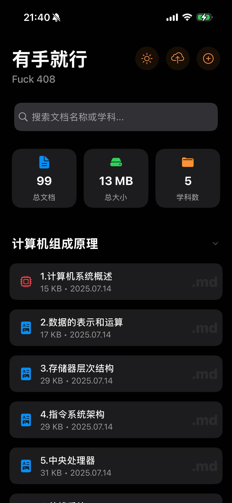
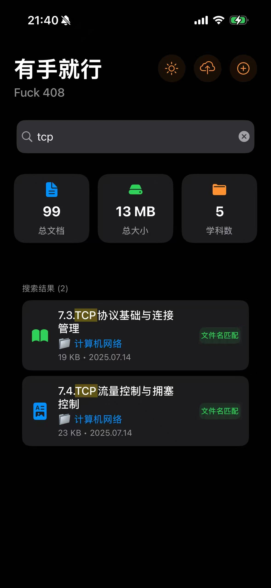
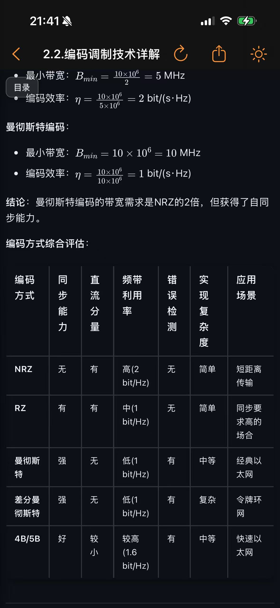
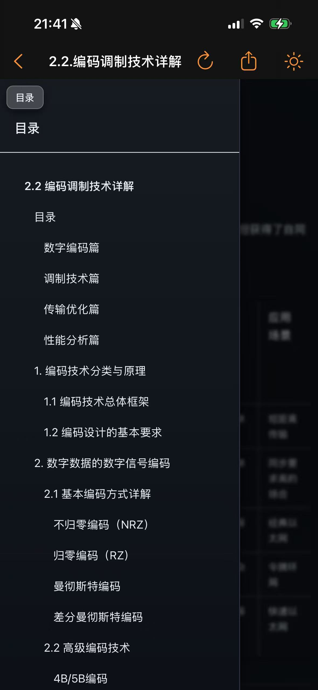
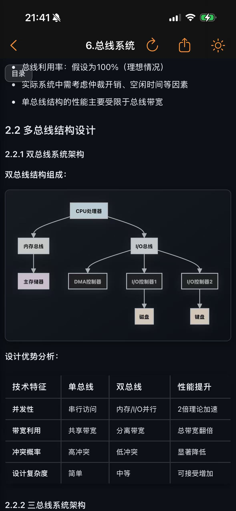
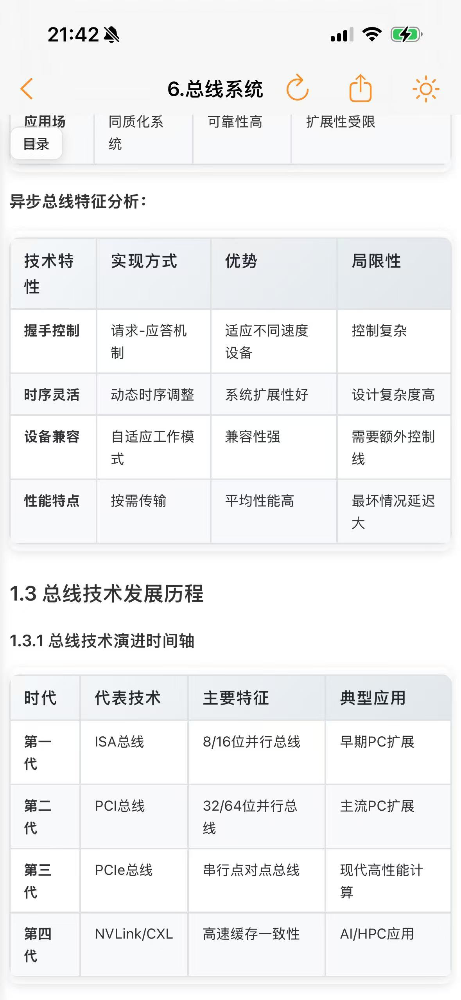

# ohmy408 -  文件管理器 & LaTeX阅读器

> **移动端Markdown LaTeX傻瓜式阅读器**


TODO:
- markdown支持编辑
- 中文等Unicode类\text标签和下表支持
- Xmind本地渲染深度优化，复杂样式支持，新特性支持
  
## 项目背景

在学习计算机科学基础知识，编写[CS-base](https://github.com/Dtheme/CS-base) 时。发现在手机端浏览这些包含大量LaTeX数学公式的Markdown文档时，体验很不友好，或者交互非常复杂，为了解决这些问题，我开发了这个iOS Markdown LaTeX阅读器。

## 主要特性

### 文档渲染
- 基于MathJax 3.0引擎，完美渲染复杂数学公式
- Markdown语法支持
- 分片渲染（支持超大markdown文件）
- 自适应不同屏幕尺寸

### 文件管理
- 自动按学科分类（高等数学、数据结构、计算机组成原理等）
- 快速搜索文件名和内容
- 记录阅读历史，快速回到上次阅读位置
- 显示文件大小、修改时间等详细信息

### 云端同步
- 支持同步文档到iCloud 
- 在多个iOS设备间同步阅读进度
- 支持离线查看已同步的文档

### 多格式支持
- Markdown文件
- 文本文件
- PDF文档
- XMind文件

## 效果图展示
请忽略我的slogan，为自己学习过程打打气。
### 主界面和文件管理
<div align="center">
  
  
</div>

### Markdown阅读器
<div align="center">
  
  
</div>

<div align="center">
  
  
</div>

 
## 技术实现

- **开发语言**: Swift 5.0+
- **支持平台**: iOS/iPad OS
- **渲染引擎**: WKWebView + MathJax 3.0

## 项目结构

```
ohmy408/
├── 视图控制器
│   ├── FileListViewController.swift     # 文件列表主界面
│   ├── MarkdownReaderViewController.swift # Markdown阅读器
│   ├── XMindViewerViewController.swift   # XMind查看器
│   └── SubjectSelectionViewController.swift # 学科选择
├── 管理器类
│   ├── MarkdownFileManager.swift        # 文件管理
│   ├── CloudSyncManager.swift           # iCloud同步
│   ├── FileImportManager.swift          # 文件导入
│   ├── RecentFileManager.swift          # 最近文件
│   └── ToastManager.swift               # 消息提示
├── 渲染模板
│   ├── markdown_viewer.html             # Markdown渲染模板
│   └── xmind_jsmind_viewer.html        # XMind渲染模板
└── 内置资料
    └── datas.bundle/                    # 示例学习资料
```

## 快速开始

### 安装要求
- iOS 15.6+
- Xcode 14.0+
- Swift 5.0+

### 构建步骤
1. **克隆项目**
   ```bash
   git clone https://github.com/yourusername/ohmy408.git
   cd ohmy408
   ```

2. **打开项目**
   ```bash
   open ohmy408.xcodeproj
   ```

3. **安装依赖**
   - 项目使用Swift Package Manager自动管理依赖
   - 首次构建时会自动下载依赖包

4. **运行应用**
   - 选择目标设备或模拟器
   - 点击Run按钮构建并运行

### 使用CS-base资料
1. **下载CS-base仓库**
   ```bash
   git clone https://github.com/Dtheme/CS-base.git
   ```

2. **导入文档**
   - 打开ohmy408应用
   - 点击右上角的"+"按钮
   - 选择"从文件导入"
   - 选择CS-base仓库中的Markdown文件

3. **开始学习**
   - 文档会自动按学科分类
   - 点击任意文档开始阅读

### 隐私安全
- 你也可以作为你自己资料的阅读器，只与你自己的iCloud进行交互，数据不会上传到任何其他服务器


## 贡献指南

欢迎提交Issues和Pull Requests来改进这个项目！

## 许可证

本项目基于MIT许可证开源。详见 [LICENSE](LICENSE) 文件。

## 联系方式

如有问题或建议，请通过以下方式联系：

- 邮件：armchannel.dzw@gmail.com
- Issues：[GitHub Issues](https://github.com/yourusername/ohmy408/issues)
- 讨论：[GitHub Discussions](https://github.com/yourusername/ohmy408/discussions)


