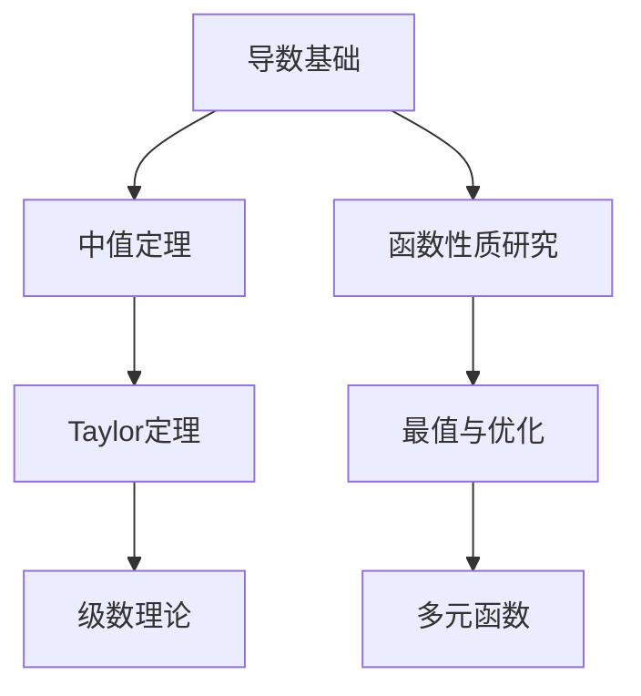

# 3.1 导数与微分基础理论
 
## 目录

1. [导数概念的深度理解与严格定义](#1-导数概念的深度理解与严格定义)
2. [微分理论与几何直观](#2-微分理论与几何直观)
3. [导数计算的系统方法](#3-导数计算的系统方法)
4. [导数存在性理论](#4-导数存在性理论)
5. [特殊函数的导数计算技巧](#5-特殊函数的导数计算技巧)
6. [本章知识点总结](#6-本章知识点总结)
7. [例题解析](#7-例题解析)

---

## 1. 导数概念的深度理解与严格定义

### 1.1 导数的ε-δ定义与几何直观

#### 导数概念的引入

**从平均变化率到瞬时变化率**：
- **平均变化率**： $\frac{\Delta y}{\Delta x} = \frac{f(x_0 + \Delta x) - f(x_0)}{\Delta x}$
- **瞬时变化率**： $\lim_{\Delta x \to 0} \frac{\Delta y}{\Delta x}$

这个极限过程体现了从"有限"到"无限"、从"离散"到"连续"的数学思想。

> **定义1.1（导数的严格定义）**
> 
> 设函数 $f(x)$ 在点 $x_0$ 的某个邻域内有定义，若极限
> $$f'(x_0) = \lim_{h \to 0} \frac{f(x_0 + h) - f(x_0)}{h}$$
> 存在，则称函数 $f(x)$ 在点 $x_0$ 处**可导**，此极限值称为 $f(x)$ 在点 $x_0$ 处的**导数**。

**等价定义形式**：
1. **增量形式**： $f'(x_0) = \lim_{\Delta x \to 0} \frac{\Delta y}{\Delta x} = \lim_{\Delta x \to 0} \frac{f(x_0 + \Delta x) - f(x_0)}{\Delta x}$

2. **变量替换形式**： $f'(x_0) = \lim_{x \to x_0} \frac{f(x) - f(x_0)}{x - x_0}$

3. **对称差商形式**： $f'(x_0) = \lim_{h \to 0} \frac{f(x_0 + h) - f(x_0 - h)}{2h}$ （当此极限存在且函数在 $x_0$ 可导时）

> **注意**：对称差商形式只有在函数已经可导的前提下才等价于导数，不能用它来判定可导性！

#### **几何直观解释**

> **几何意义**：
> 
> 导数 $f'(x_0)$ 表示曲线 $y = f(x)$ 在点 $(x_0, f(x_0))$ 处**切线的斜率**。

**从割线到切线的极限过程**：
- **割线斜率**： $k_{割} = \frac{f(x_0 + h) - f(x_0)}{h}$
- **切线斜率**： $k_{切} = \lim_{h \to 0} \frac{f(x_0 + h) - f(x_0)}{h} = f'(x_0)$

**切线方程**：
$$y - f(x_0) = f'(x_0)(x - x_0)$$

**法线方程**（当 $f'(x_0) \neq 0$ 时）：
$$y - f(x_0) = -\frac{1}{f'(x_0)}(x - x_0)$$

> **常见误区**：
> 1. 误以为"连续必可导"——反例： $f(x) = |x|$ 在 $x = 0$ 处
> 2. 误用对称差商判定可导性——这只是计算技巧，不是判定标准
> 3. 忽略导数定义中的"邻域"要求——函数必须在 $x_0$ 的某邻域内有定义

> **例题1.1**：用导数定义计算 $f(x) = x^2$ 在 $x = 2$ 处的导数。

**解答**：
$$f'(2) = \lim_{h \to 0} \frac{f(2 + h) - f(2)}{h} = \lim_{h \to 0} \frac{(2 + h)^2 - 4}{h}$$
$$= \lim_{h \to 0} \frac{4 + 4h + h^2 - 4}{h} = \lim_{h \to 0} \frac{4h + h^2}{h} = \lim_{h \to 0} (4 + h) = 4$$

**几何解释**：抛物线 $y = x^2$ 在点 $(2, 4)$ 处的切线斜率为 4，切线方程为 $y - 4 = 4(x - 2)$，即 $y = 4x - 4$。

### 1.2 左导数与右导数的理论

> **定义1.2（单侧导数）**
> 
> - **右导数**： $f'_+(x_0) = \lim_{h \to 0^+} \frac{f(x_0 + h) - f(x_0)}{h}$
> - **左导数**： $f'_-(x_0) = \lim_{h \to 0^-} \frac{f(x_0 + h) - f(x_0)}{h}$

> **定理1.1（可导的充要条件）**
> 
> 函数 $f(x)$ 在点 $x_0$ 可导当且仅当左导数和右导数都存在且相等：
> $$f'_-(x_0) = f'_+(x_0) = f'(x_0)$$

> **例题1.2**：讨论函数 $f(x) = |x|$ 在 $x = 0$ 处的可导性。

**解答**：
- **右导数**： $f'_+(0) = \lim_{h \to 0^+} \frac{|h| - |0|}{h} = \lim_{h \to 0^+} \frac{h}{h} = 1$
- **左导数**： $f'_-(0) = \lim_{h \to 0^-} \frac{|h| - |0|}{h} = \lim_{h \to 0^-} \frac{-h}{h} = -1$

由于 $f'_+(0) \neq f'_-(0)$，所以 $f(x) = |x|$ 在 $x = 0$ 处不可导。

### 1.3 可导性与连续性的关系

> **定理1.2（可导必连续）**
> 
> 若函数 $f(x)$ 在点 $x_0$ 可导，则 $f(x)$ 在点 $x_0$ 连续。

**证明**：
设  $f(x)$ 在 $x_0$ 可导，则 $f'(x_0)$ 存在。对于 $x \neq x_0$：
$$f(x) - f(x_0) = \frac{f(x) - f(x_0)}{x - x_0} \cdot (x - x_0)$$

当 $x \to x_0$ 时：
$$\lim_{x \to x_0} [f(x) - f(x_0)] = \lim_{x \to x_0} \frac{f(x) - f(x_0)}{x - x_0} \cdot \lim_{x \to x_0} (x - x_0) = f'(x_0) \cdot 0 = 0$$

因此 $\lim_{x \to x_0} f(x) = f(x_0)$，即 $f(x)$ 在 $x_0$ 连续。

> **重要注意**：连续不一定可导！

**典型反例**：
1. $f(x) = |x|$ 在 $x = 0$ 处连续但不可导
2. $f(x) = \sqrt[3]{x}$ 在 $x = 0$ 处连续但不可导（垂直切线）
3. $f(x) = x^{2/3}$ 在 $x = 0$ 处连续但不可导

### 1.4 导数的物理意义与实际应用

#### **运动学中的应用**

> **物理意义**：
> 
> 若 $s(t)$ 表示质点的位移函数，则：
> - **瞬时速度**： $v(t) = s'(t)$
> - **瞬时加速度**： $a(t) = v'(t) = s''(t)$

> **例题1.3**：一质点的位移函数为 $s(t) = t^3 - 6t^2 + 9t$，求：
> (1) 质点在 $t = 2$ 时的瞬时速度
> (2) 质点何时速度为零
> (3) 质点的加速度函数

**解答**：
(1) $v(t) = s'(t) = 3t^2 - 12t + 9$ ， $v(2) = 12 - 24 + 9 = -3$

(2) 令 $v(t) = 0$： $3t^2 - 12t + 9 = 0$，即 $t^2 - 4t + 3 = 0$
    解得： $t = 1$ 或 $t = 3$

(3) $a(t) = v'(t) = 6t - 12$

#### **经济学中的应用**

- **边际成本**： $MC = C'(x)$ （成本函数的导数）
- **边际收益**： $MR = R'(x)$ （收益函数的导数）
- **边际利润**： $MP = P'(x)$ （利润函数的导数）

---

## 2. 微分理论与几何直观

### 2.1 微分的定义与性质

> **定义2.1（函数的微分）**
> 
> 设函数 $y = f(x)$ 在点 $x_0$ 可导，则称 $dy = f'(x_0)dx$ 为函数 $f(x)$ 在点 $x_0$ 处的**微分**，其中 $dx$ 是自变量的增量。

**微分的几何意义**：
- $\Delta y = f(x_0 + \Delta x) - f(x_0)$：函数的实际增量
- $dy = f'(x_0) \Delta x$：切线的增量（线性近似）

> **定理2.1（微分与导数的关系）**
> 
> 函数 $f(x)$ 在点 $x_0$ 可微当且仅当在该点可导，且：
> $$df = f'(x) dx$$

### 2.2 微分的计算法则

> **定理2.2（微分的运算法则）**
> 
> 设  $u = u(x)$ ， $v = v(x)$ 都可微，则：
> 1. $d(u \pm v) = du \pm dv$
> 2. $d(uv) = v \, du + u \, dv$
> 3. $d\left(\frac{u}{v}\right) = \frac{v \, du - u \, dv}{v^2}$ （ $v \neq 0$）
> 4. $d[f(u)] = f'(u) du$ ， $d[f(x)] = f'(x) dx$ （复合函数微分，对自变量x和中间函数u都成立）

> **例题2.1**：求函数 $y = x^2 \sin x$ 的微分。

**解答**：
$$dy = d(x^2 \sin x) = \sin x \, d(x^2) + x^2 \, d(\sin x)$$
$$= \sin x \cdot 2x \, dx + x^2 \cdot \cos x \, dx = (2x \sin x + x^2 \cos x) dx$$

### 2.3 微分在近似计算中的应用

> **线性近似公式**：
> 
> 当 $|\Delta x|$ 很小时：
> $$f(x_0 + \Delta x) \approx f(x_0) + f'(x_0) \Delta x$$

> **例题2.2**：利用微分计算 $\sqrt{4.01}$ 的近似值。

**解答**：
设  $f(x) = \sqrt{x}$ ， $x_0 = 4$ ， $\Delta x = 0.01$

$f'(x) = \frac{1}{2\sqrt{x}}$ ， $f'(4) = \frac{1}{4}$

$$\sqrt{4.01} = f(4.01) \approx f(4) + f'(4) \cdot 0.01 = 2 + \frac{1}{4} \cdot 0.01 = 2.0025$$

### 2.4 微分形式的不变性

> **定理2.3（微分形式的不变性）**
> 
> 无论 $u$ 是自变量还是中间变量，函数 $y = f(u)$ 的微分形式都是：
> $$dy = f'(u) du$$
> 
> 这个性质使得复合函数的微分计算变得简单，是微分学中的重要性质。

> **例题2.3**：求 $y = \sin(x^2 + 1)$ 的微分。

**解答**：
设  $u = x^2 + 1$，则 $y = \sin u$

$$dy = \cos u \, du = \cos(x^2 + 1) \, d(x^2 + 1) = \cos(x^2 + 1) \cdot 2x \, dx$$

---

## 3. 导数计算的系统方法

### 3.1 基本函数导数公式系统

#### **基本初等函数导数表**

> **参见**：[附录A-常用数学表格速查.md](./附录A-常用数学表格速查.md#3-基本初等函数导数表) - 第3节：基本初等函数导数表

**常用函数导数（快速参考）**：

| 函数 | 导数 | 函数 | 导数 |
|------|------|------|------|
| $\sin x$ | $\cos x$ | $\arcsin x$ | $\frac{1}{\sqrt{1-x^2}}$ |
| $\cos x$ | $-\sin x$ | $\arctan x$ | $\frac{1}{1+x^2}$ |
| $\tan x$ | $\sec^2 x$ | $e^x$ | $e^x$ |
| $\ln x$ | $\frac{1}{x}$ | $x^α$ | $αx^{α-1}$ |

> **记忆口诀**：
> - 三角函数导数："正变余，余变负正，切割方"
> - 反三角函数导数："根号里1减方，分母里1加方"
> - 反三角函数符号："$\arcsin$ 和 $\arctan$ 为正， $\arccos$ 和 $\text{arccot}$ 为负"
> - 双曲函数导数："双曲正弦变余弦，双曲余弦变正弦，双曲正切用余弦平方"
> - 反双曲函数导数："$\text{arcsinh}$ 用加法， $\text{arccosh}$ 用减法， $\text{arctanh}$ 分母用减法"

#### **反三角函数导数的推导与记忆**

** $y = \arcsin x$ 的推导**：
1. 由 $y = \arcsin x$ 得 $x = \sin y$，其中 $y \in [-\frac{\pi}{2}, \frac{\pi}{2}]$
2. 两边对 $x$ 求导： $1 = \cos y \cdot \frac{dy}{dx}$
3. 因此 $\frac{dy}{dx} = \frac{1}{\cos y} = \frac{1}{\sqrt{1 - \sin^2 y}} = \frac{1}{\sqrt{1 - x^2}}$

** $y = \arctan x$ 的推导**：
1. 由 $y = \arctan x$ 得 $x = \tan y$，其中 $y \in (-\frac{\pi}{2}, \frac{\pi}{2})$
2. 两边对 $x$ 求导： $1 = \sec^2 y \cdot \frac{dy}{dx}$
3. 因此 $\frac{dy}{dx} = \frac{1}{\sec^2 y} = \cos^2 y = \frac{1}{1 + \tan^2 y} = \frac{1}{1 + x^2}$

** $y = \text{arcsec} x$ 的推导**：
1. 由 $y = \text{arcsec} x$ 得 $x = \sec y$，其中 $y \in [0, \pi], y \neq \frac{\pi}{2}$
2. 两边对 $x$ 求导： $1 = \sec y \tan y \cdot \frac{dy}{dx}$
3. 因此 $\frac{dy}{dx} = \frac{1}{\sec y \tan y} = \frac{1}{x \sqrt{x^2 - 1}}$
4. 考虑到定义域，最终结果为 $\frac{1}{|x|\sqrt{x^2 - 1}}$

> **易错提醒**：
> 1. $\arcsin x$ 和 $\arccos x$ 的导数相差一个负号
> 2. $\arctan x$ 和 $\text{arccot} x$ 的导数也相差一个负号
> 3. 反三角函数的定义域限制不要忘记
> 4. $\text{arcsec} x$ 和 $\text{arccsc} x$ 的导数含有绝对值 $|x|$
> 5. 双曲函数在整个实数域有定义，但反双曲函数有定义域限制
> 6. $\text{arctanh} x$ 的定义域是 $|x| < 1$，不是 $|x| \leq 1$

### 3.2 导数运算法则的深度应用

> **定理3.1（导数的四则运算法则）**
> 
> 设  $u = u(x)$ ， $v = v(x)$ 在点 $x$ 可导，则：
> 1. $(u \pm v)' = u' \pm v'$
> 2. $(uv)' = u'v + uv'$ （Leibniz公式）
> 3. $\left(\frac{u}{v}\right)' = \frac{u'v - uv'}{v^2}$ （ $v \neq 0$）

#### **运算法则的记忆技巧**

1. **加减法则**：导数的线性性
2. **乘法法则**：一导二不导 + 一不导二导
3. **除法法则**：（上导下不导 - 上不导下导）÷ 下平方

> **常见错误警示**：
> 1. $(uv)' \neq u'v'$ —— 乘法法则不是简单相乘
> 2. $\left(\frac{u}{v}\right)' \neq \frac{u'}{v'}$ —— 除法法则更复杂
> 3. $(u^v)' \neq vu^{v-1}$ —— 幂指函数需要对数求导法

#### **Leibniz公式的推广**

> **定理3.2（高阶Leibniz公式）**
> 
> $$(uv)^{(n)} = \sum_{k=0}^{n} \binom{n}{k} u^{(k)} v^{(n-k)}$$

**记忆方法**：类比二项式定理 $(a+b)^n$ 的展开
> **二项式定理的展开公式**：
> 
> $(a+b)^n = \sum_{k=0}^n \binom{n}{k} a^{n-k}b^k$
> 
> 其中 $\binom{n}{k} = \frac{n!}{k!(n-k)!}$ 为二项式系数。

**展开示例**：
1. $(a+b)^2 = a^2 + 2ab + b^2$
2. $(a+b)^3 = a^3 + 3a^2b + 3ab^2 + b^3$
3. $(a+b)^4 = a^4 + 4a^3b + 6a^2b^2 + 4ab^3 + b^4$
4. $(a + b)^n = \binom{n}{0}a^n b^0 + \binom{n}{1}a^{n-1} b^1 + \binom{n}{2}a^{n-2} b^2 + \cdots + \binom{n}{n-1}a^1 b^{n-1} + \binom{n}{n}a^0 b^n
$

> **记忆技巧**：
> 1. 系数对称性：从两端向中间对称
> 2. 指数规律：第一项 $a$ 的指数从 $n$ 开始递减， $b$ 的指数从 $0$ 开始递增
> 3. 系数和为 $2^n$

> **例题3.1**：求 $(x^2 e^x)''$。

**解答**：
使用Leibniz公式，设  $u = x^2$ ， $v = e^x$：
- $u' = 2x$ ， $u'' = 2$
- $v' = e^x$ ， $v'' = e^x$

$$(x^2 e^x)'' = u''v + 2u'v' + uv'' = 2e^x + 2 \cdot 2x \cdot e^x + x^2 e^x = e^x(x^2 + 4x + 2)$$

**速算技巧**：对于 $x^n e^x$ 型函数， $n$ 阶导数后仍为 $e^x$ 乘以一个 $n$ 次多项式。

### 3.3 复合函数求导的链式法则

> **定理3.3（链式法则）**
> 
> 设  $y = f(u)$ ， $u = g(x)$，若 $g(x)$ 在点 $x$ 可导， $f(u)$ 在对应点 $u = g(x)$ 可导，则复合函数 $y = f(g(x))$ 在点 $x$ 可导，且：
> $$\frac{dy}{dx} = \frac{dy}{du} \cdot \frac{du}{dx} = f'(g(x)) \cdot g'(x)$$

#### **多层复合函数**

对于 $y = f(u)$ ， $u = g(v)$ ， $v = h(x)$：
$$\frac{dy}{dx} = \frac{dy}{du} \cdot \frac{du}{dv} \cdot \frac{dv}{dx}$$

> **例题3.2**：求 $y = e^{\sin(x^2)}$ 的导数。

**解答**：
设  $u = \sin(x^2)$ ， $v = x^2$，则 $y = e^u$ ， $u = \sin v$

$y = e^u \Rightarrow \frac{dy}{du} = e^u$

$u = \sin(v) \Rightarrow \frac{du}{dv} = \cos(v)$

$v = x^2 \Rightarrow \frac{dv}{dx} = 2x$

$\frac{dy}{dx}
= \frac{dy}{du} \cdot \frac{du}{dv} \cdot \frac{dv}{dx}
= e^u \cdot \cos(v) \cdot 2x$

$\frac{dy}{dx} = e^u \cdot \cos v \cdot 2x = e^{\sin(x^2)} \cdot \cos(x^2) \cdot 2x$

### 3.4 隐函数求导技术

> **方法原理**：
> 
> 对于由方程  $F(x, y) = 0$ 确定的隐函数 $y = y(x)$，对方程两边同时对 $x$ 求导，利用链式法则求出 $\frac{dy}{dx}$。

#### **基本步骤**

1. 对方程两边同时关于 $x$ 求导
2. 将 $y$ 看作 $x$ 的函数，应用链式法则
3. 整理得到包含 $\frac{dy}{dx}$ 的方程
4. 解出 $\frac{dy}{dx}$


> **例题3.3**：求由方程  $x^2 + y^2 = 1$ 确定的隐函数 $y = y(x)$ 的导数 $\frac{dy}{dx}$。

**详细符号解释与解题步骤**：

**符号说明**：
- $x^2 + y^2 = 1$：这是一个圆的标准方程，圆心在原点，半径为1
- $y = y(x)$：表示 $y$ 是 $x$ 的隐函数，即虽然没有显式表达式，但 $y$ 的值由 $x$ 唯一确定
- $\frac{dy}{dx}$：表示隐函数 $y = y(x)$ 对 $x$ 的导数，几何上表示曲线在该点处切线的斜率
- $\frac{d}{dx}(\cdot)$：表示对 $x$ 求导的算子

**解题步骤**：

**Step 1：对方程两边同时关于 $x$ 求导**

对等式 $x^2 + y^2 = 1$ 的两边同时应用求导算子 $\frac{d}{dx}$：
$$\frac{d}{dx}(x^2 + y^2) = \frac{d}{dx}(1)$$

**Step 2：分别计算左边每一项的导数**

利用导数的线性性质：
$$\frac{d}{dx}(x^2) + \frac{d}{dx}(y^2) = 0$$

- $\frac{d}{dx}(x^2) = 2x$ （幂函数求导）
- $\frac{d}{dx}(y^2)$：这里需要特别注意！

**Step 3：应用链式法则计算 $\frac{d}{dx}(y^2)$ **

由于 $y = y(x)$ 是 $x$ 的函数，所以 $y^2$ 是复合函数，需要使用链式法则：
$$\frac{d}{dx}(y^2) = \frac{d}{dy}(y^2) \cdot \frac{dy}{dx} = 2y \cdot \frac{dy}{dx}$$

**符号理解**：
- $\frac{d}{dy}(y^2) = 2y$：把 $y^2$ 看作 $y$ 的函数，对 $y$ 求导
- $\frac{dy}{dx}$： $y$ 对 $x$ 的导数（这正是我们要求的）
- 链式法则： $\frac{d}{dx}[f(y(x))] = f'(y) \cdot y'(x)$

**Step 4：代入得到含有 $\frac{dy}{dx}$ 的方程**

将计算结果代入：
$$2x + 2y \cdot \frac{dy}{dx} = 0$$

**Step 5：解出 $\frac{dy}{dx}$ **

从上述方程中解出 $\frac{dy}{dx}$：
$$2y \cdot \frac{dy}{dx} = -2x$$
$$\frac{dy}{dx} = -\frac{2x}{2y} = -\frac{x}{y}$$

**最终答案**：
$$\frac{dy}{dx} = -\frac{x}{y} \quad (y \neq 0)$$

**几何意义与验证**：

1. **几何意义**：
   - $\frac{dy}{dx} = -\frac{x}{y}$ 表示单位圆在点 $(x, y)$ 处的切线斜率
   - 当 $x > 0, y > 0$ （第一象限）时， $\frac{dy}{dx} < 0$，切线向下倾斜
   - 当 $x < 0, y > 0$ （第二象限）时， $\frac{dy}{dx} > 0$，切线向上倾斜

2. **特殊点验证**：
   - 在点 $(1, 0)$： $\frac{dy}{dx} = -\frac{1}{0}$，导数不存在（垂直切线）
   - 在点 $(0, 1)$： $\frac{dy}{dx} = -\frac{0}{1} = 0$，水平切线
   - 在点 $(\frac{\sqrt{2}}{2}, \frac{\sqrt{2}}{2})$： $\frac{dy}{dx} = -1$，切线斜率为 $-1$

3. **切线方程**：
   在点 $(x_0, y_0)$ 处的切线方程为：
   $$y - y_0 = -\frac{x_0}{y_0}(x - x_0)$$
   
   整理得： $$x_0 x + y_0 y = x_0^2 + y_0^2 = 1$$
   
   这正是圆的切线的标准方程！

**注意事项**：
1. **定义域限制**： $y \neq 0$，即在点 $(±1, 0)$ 处导数不存在
2. **多值函数**：圆的方程确定的不是单值函数，需要分上下两支讨论
3. **链式法则的关键**：认识到 $y$ 是 $x$ 的函数，这是隐函数求导的核心

**扩展思考**：
- 如果求 $\frac{dx}{dy}$，结果是什么？
- 答案： $\frac{dx}{dy} = -\frac{y}{x}$ （正好是 $\frac{dy}{dx}$ 的倒数）

> **例题3.4**：由方程  $x^3 + y^3 - 3xy = 0$ 确定的隐函数，求 $\frac{dy}{dx}$。

**解答**：
对方程两边同时对 $x$ 求导：
$$3x^2 + 3y^2 \frac{dy}{dx} - 3y - 3x \frac{dy}{dx} = 0$$

整理得：

$$(3y^2 - 3x) \frac{dy}{dx} = 3y - 3x^2$$

因此：
$$\frac{dy}{dx} = \frac{y - x^2}{y^2 - x}$$
### 3.5 参数方程求导

#### **什么是参数方程？**

在数学中，许多曲线不能直接写成显式函数 $y = f(x)$ 的形式。例如，圆、椭圆、摆线等复杂曲线。这时我们可以引入一个辅助变量（称为**参数**），同时表示 $x$ 和 $y$：

$$\begin{cases} x = x(t) \\ y = y(t) \end{cases}$$

其中 $t$ 称为**参数**，这样的方程组称为**参数方程**。

**常见参数方程实例**：

| 曲线类型 | 参数方程 | 参数含义 |
|---------|----------|----------|
| **单位圆** | $\begin{cases} x = \cos t \\ y = \sin t \end{cases}$ | $t$ 是角度参数 |
| **椭圆** | $\begin{cases} x = a\cos t \\ y = b\sin t \end{cases}$ | $t$ 是角度参数 |
| **直线** | $\begin{cases} x = x_0 + at \\ y = y_0 + bt \end{cases}$ | $t$ 是时间参数 |
| **抛物线** | $\begin{cases} x = at^2 \\ y = bt \end{cases}$ | $t$ 是位置参数 |

> **定理3.4（参数方程求导公式）**
> 
> 设曲线由参数方程  $\begin{cases} x = \varphi(t) \\ y = \psi(t) \end{cases}$ 给出，其中 $\varphi(t)$ ， $\psi(t)$ 可导且 $\varphi'(t) \neq 0$，则：
> $$\frac{dy}{dx} = \frac{dy/dt}{dx/dt} = \frac{\psi'(t)}{\varphi'(t)}$$

#### **公式的直观理解**

> **核心思想**：虽然 $x$ 和 $y$ 都不是彼此的直接函数，但它们都是参数 $t$ 的函数。我们可以通过 $t$ 这个"桥梁"来建立 $y$ 对 $x$ 的导数关系。

**物理意义**：
- $\frac{dy}{dt}$： $y$ 随参数 $t$ 的变化率
- $\frac{dx}{dt}$： $x$ 随参数 $t$ 的变化率  
- $\frac{dy}{dx} = \frac{dy/dt}{dx/dt}$： $y$ 随 $x$ 的变化率

这就像在物理中，如果质点的位置 $(x(t), y(t))$ 都随时间 $t$ 变化，那么轨迹的切线斜率就是 $\frac{dy}{dx} = \frac{v_y}{v_x}$ （ $y$ 方向速度除以 $x$ 方向速度）。

#### **基础例题演练**

> **例题3.5-A**：求参数方程  $\begin{cases} x = t^2 + 1 \\ y = t^3 \end{cases}$ 的导数 $\frac{dy}{dx}$。

**解答**：

**Step 1：分别对参数 $t$ 求导**
$$\frac{dx}{dt} = \frac{d}{dt}(t^2 + 1) = 2t$$
$$\frac{dy}{dt} = \frac{d}{dt}(t^3) = 3t^2$$

**Step 2：应用参数方程求导公式**
$$\frac{dy}{dx} = \frac{dy/dt}{dx/dt} = \frac{3t^2}{2t} = \frac{3t}{2}$$

**几何意义**：当参数 $t = 2$ 时，切线斜率为 $\frac{3 \times 2}{2} = 3$。

#### **二阶导数的求法**

> **定理3.4-扩展（参数方程的二阶导数）**
> 
> 参数方程的二阶导数公式为：
> $$\frac{d^2y}{dx^2} = \frac{d}{dt}\left(\frac{dy}{dx}\right) \div \frac{dx}{dt} = \frac{\frac{d}{dt}\left(\frac{dy}{dx}\right)}{\frac{dx}{dt}}$$

**记忆技巧**：
> 参数方程的二阶导数 = **"一阶导数对 $t$ 求导"** ÷ **"$x$ 对 $t$ 的导数"**

#### **二阶导数例题演练**

> **例题3.5-B**：续上题，求 $\frac{d^2y}{dx^2}$。

**解答**：

**Step 1：利用已求得的一阶导数**
$$\frac{dy}{dx} = \frac{3t}{2}$$

**Step 2：对一阶导数关于 $t$ 求导**
$$\frac{d}{dt}\left(\frac{dy}{dx}\right) = \frac{d}{dt}\left(\frac{3t}{2}\right) = \frac{3}{2}$$

**Step 3：除以 $\frac{dx}{dt}$ **
$$\frac{d^2y}{dx^2} = \frac{\frac{d}{dt}\left(\frac{dy}{dx}\right)}{\frac{dx}{dt}} = \frac{\frac{3}{2}}{2t} = \frac{3}{4t}$$

**凹凸性分析**：
- 当 $t > 0$ 时， $\frac{d^2y}{dx^2} > 0$，曲线凹向上
- 当 $t < 0$ 时， $\frac{d^2y}{dx^2} < 0$，曲线凹向下

> **例题3.5**：曲线 $\begin{cases} x = a(t - \sin t) \\ y = a(1 - \cos t) \end{cases}$ （摆线），求 $\frac{dy}{dx}$。

**详细符号解释与解题步骤**：

**符号说明**：
- $\begin{cases} x = a(t - \sin t) \\ y = a(1 - \cos t) \end{cases}$：这是**摆线**（cycloid）的参数方程，描述半径为 $a$ 的圆沿直线滚动时圆上一点的轨迹
- $t$：参数，表示圆转过的角度（弧度）
- $a > 0$：圆的半径，是常数
- $\frac{dy}{dx}$：曲线在参数 $t$ 对应点处的切线斜率

**解题步骤**：

**Step 1：应用参数方程求导公式**

对于参数方程  $\begin{cases} x = x(t) \\ y = y(t) \end{cases}$，有：
$$\frac{dy}{dx} = \frac{dy/dt}{dx/dt} = \frac{y'(t)}{x'(t)}$$

**Step 2：分别计算 $\frac{dx}{dt}$ 和 $\frac{dy}{dt}$ **

对 $x = a(t - \sin t)$ 关于 $t$ 求导：
$$\frac{dx}{dt} = a \cdot \frac{d}{dt}(t - \sin t) = a(1 - \cos t)$$

**详细计算**：
- $\frac{d}{dt}(t) = 1$
- $\frac{d}{dt}(\sin t) = \cos t$
- 因此： $\frac{dx}{dt} = a(1 - \cos t)$

对 $y = a(1 - \cos t)$ 关于 $t$ 求导：
$$\frac{dy}{dt} = a \cdot \frac{d}{dt}(1 - \cos t) = a \sin t$$

**详细计算**：
- $\frac{d}{dt}(1) = 0$
- $\frac{d}{dt}(\cos t) = -\sin t$
- 因此： $\frac{dy}{dt} = a(0 - (-\sin t)) = a \sin t$

**Step 3：应用公式计算 $\frac{dy}{dx}$ **

$$\frac{dy}{dx} = \frac{dy/dt}{dx/dt} = \frac{a \sin t}{a(1 - \cos t)} = \frac{\sin t}{1 - \cos t}$$

**Step 4：利用三角恒等式简化结果**

使用三角恒等式： $\sin t = 2\sin\frac{t}{2}\cos\frac{t}{2}$ ， $1 - \cos t = 2\sin^2\frac{t}{2}$

$$\frac{dy}{dx} = \frac{\sin t}{1 - \cos t} = \frac{2\sin\frac{t}{2}\cos\frac{t}{2}}{2\sin^2\frac{t}{2}} = \frac{\cos\frac{t}{2}}{\sin\frac{t}{2}} = \cot\frac{t}{2}$$

**最终答案**：
$$\frac{dy}{dx} = \cot\frac{t}{2} = \frac{\cos\frac{t}{2}}{\sin\frac{t}{2}}$$

**几何意义与分析**：

1. **物理背景**：摆线是半径为 $a$ 的圆沿 $x$ 轴滚动时，圆周上一个固定点的轨迹

2. **切线斜率的变化**：
   - 当 $t = 0$ 时： $\frac{dy}{dx} = \cot 0 = +∞$ （垂直切线）
   - 当 $t = \pi$ 时： $\frac{dy}{dx} = \cot\frac{\pi}{2} = 0$ （水平切线）
   - 当 $t = 2\pi$ 时： $\frac{dy}{dx} = \cot\pi = +∞$ （垂直切线）

3. **特殊点分析**：
   - $t = 0$：点 $(0, 0)$，垂直切线
   - $t = \pi$：点 $(a\pi, 2a)$，水平切线（摆线的最高点）
   - $t = 2\pi$：点 $(2a\pi, 0)$，垂直切线

4. **周期性**：摆线每隔 $2\pi$ 重复一次，对应圆滚动一周

**注意事项**：
1. **定义域限制**： $\sin\frac{t}{2} \neq 0$，即 $t \neq 2k\pi$ （ $k \in \mathbb{Z}$）
2. **几何直观**：在摆线的尖点处（ $t = 2k\pi$），切线垂直
3. **参数范围**：通常取 $t \in [0, 2\pi]$ 得到一个完整的摆线拱

#### **参数方程求导知识点总结**

| 知识点 | 内容 | 应用 |
|--------|------|------|
| **参数方程形式** | $x = x(t), y = y(t)$ | 描述复杂曲线 |
| **一阶导数公式** | $\frac{dy}{dx} = \frac{dy/dt}{dx/dt}$ | 求切线斜率 |
| **二阶导数公式** | $\frac{d^2y}{dx^2} = \frac{d}{dt}(\frac{dy}{dx}) \div \frac{dx}{dt}$ | 判断凹凸性 |
| **本质理解** | 用参数 $t$ 作为"桥梁"建立 $x$ 和 $y$ 的关系 | 物理轨迹、几何图形 |
| **常见应用** | 圆、椭圆、摆线、抛物线等 | 物理运动、工程设计 |

#### **解题策略与技巧**

1. **标准步骤**：
   - 分别求 $\frac{dx}{dt}$ 和 $\frac{dy}{dt}$
   - 应用公式 $\frac{dy}{dx} = \frac{dy/dt}{dx/dt}$
   - 化简结果（如使用三角恒等式）

2. **特殊情况处理**：
   - 当 $\frac{dx}{dt} = 0$ 时，切线垂直（斜率无穷大）
   - 当 $\frac{dy}{dt} = 0$ 时，切线水平（斜率为0）
   - 当两者都为0时，需要用洛必达法则

3. **几何直观**：
   - 参数方程常描述运动轨迹， $t$ 可理解为时间
   - $\frac{dy}{dx}$ 表示轨迹的切线方向
   - $\frac{d^2y}{dx^2}$ 表示轨迹的弯曲程度

### 3.6 反函数求导

> **定理3.5（反函数求导定理）**
> 
> 设  $y = f(x)$ 在区间 $I$ 上单调且连续，在点 $x$ 处可导且 $f'(x) \neq 0$，则其反函数 $x = f^{-1}(y)$ 在对应点处可导，且：
> $$\frac{dx}{dy} = \frac{1}{\frac{dy}{dx}} \quad \text{或} \quad [f^{-1}(y)]' = \frac{1}{f'(x)}$$

> **例题3.6**：设  $f(x) = x + e^x$，求 $[f^{-1}(x)]'$。

**详细符号解释与解题步骤**：

**符号说明**：
- $f(x) = x + e^x$：原函数，定义在 $\mathbb{R}$ 上
- $f^{-1}(x)$： $f(x)$ 的反函数
- $[f^{-1}(x)]'$：反函数 $f^{-1}(x)$ 的导数

**解题步骤**：

**Step 1：验证反函数存在性**

要使反函数存在，需要验证 $f(x)$ 在其定义域上单调。

计算 $f(x)$ 的导数：
$$f'(x) = \frac{d}{dx}(x + e^x) = 1 + e^x$$

**分析单调性**：
- 由于 $e^x > 0$ 对所有 $x \in \mathbb{R}$ 恒成立
- 所以 $f'(x) = 1 + e^x > 1 > 0$ 对所有 $x \in \mathbb{R}$ 恒成立
- 因此 $f(x)$ 在 $\mathbb{R}$ 上严格单调递增

**结论**： $f(x)$ 的反函数 $f^{-1}(x)$ 存在。

**Step 2：应用反函数求导定理**

> **反函数求导定理**：若 $y = f(x)$ 可导且 $f'(x) \neq 0$，则其反函数 $x = f^{-1}(y)$ 可导，且：
> $$[f^{-1}(y)]' = \frac{1}{f'(x)}$$

**Step 3：建立反函数关系**

设  $y = f^{-1}(x)$，这意味着：
$$x = f(y) = y + e^y$$

这是确定 $y$ 与 $x$ 关系的方程。

**Step 4：应用反函数求导公式**

根据反函数求导定理：
$$[f^{-1}(x)]' = \frac{dy}{dx} = \frac{1}{f'(y)} = \frac{1}{1 + e^y}$$

**Step 5：用 $x$ 表示最终结果**

由于 $x = y + e^y$，我们得到：
$$[f^{-1}(x)]' = \frac{1}{1 + e^{f^{-1}(x)}}$$

**验证方法（隐函数求导）**：

从 $x = y + e^y$ 对 $x$ 求导：
$$\frac{dx}{dx} = \frac{dy}{dx} + e^y \cdot \frac{dy}{dx}$$
$$1 = \frac{dy}{dx}(1 + e^y)$$
$$\frac{dy}{dx} = \frac{1}{1 + e^y}$$

这与我们的结果一致！

**最终答案**：
$$[f^{-1}(x)]' = \frac{1}{1 + e^{f^{-1}(x)}}$$

**进一步分析**：

1. **定义域与值域**：
   - $f(x) = x + e^x$ 的值域是 $(-1, +∞)$ （因为 $\lim_{x \to -∞} f(x) = -1$ ， $\lim_{x \to +∞} f(x) = +∞$）
   - 所以 $f^{-1}(x)$ 的定义域是 $(-1, +∞)$

2. **导数的性质**：
   - $[f^{-1}(x)]' > 0$ 在定义域内恒成立，说明反函数也是严格单调递增的
   - 当 $x \to (-1)^+$ 时， $f^{-1}(x) \to -∞$ ， $[f^{-1}(x)]' \to \frac{1}{1+0} = 1$
   - 当 $x \to +∞$ 时， $f^{-1}(x) \to +∞$ ， $[f^{-1}(x)]' \to 0^+$

3. **几何意义**：
   - $f(x)$ 和 $f^{-1}(x)$ 的图像关于直线 $y = x$ 对称
   - 在对应点处，两函数的导数互为倒数

**特殊值验证**：
- 当 $x = 1$ 时， $f^{-1}(1) = 0$ （因为 $f(0) = 0 + e^0 = 1$）
- $[f^{-1}(1)]' = \frac{1}{1 + e^0} = \frac{1}{2}$
- 验证： $f'(0) = 1 + e^0 = 2$，所以 $\frac{1}{f'(0)} = \frac{1}{2}$ ✓

**注意事项**：
1. **反函数存在性**：必须先验证原函数单调
2. **定义域限制**：反函数的定义域是原函数的值域
3. **计算技巧**：可以用隐函数求导验证结果

### 3.7 对数求导法

> **适用情况**：
> 
> 1. 幂指函数： $y = [u(x)]^{v(x)}$
> 2. 多个函数相乘相除： $y = \frac{u_1(x) u_2(x) \cdots}{v_1(x) v_2(x) \cdots}$
> 3. 根式复杂的函数

#### **基本步骤**

1. 对函数两边取对数： $\ln y = \ln f(x)$
2. 对等式两边关于 $x$ 求导： $\frac{y'}{y} = [\ln f(x)]'$
3. 解出 $y'$： $y' = y \cdot [\ln f(x)]'$

> **例题3.7**：求 $y = x^{\sin x}$ 的导数。

**解答**：
取对数： $\ln y = \sin x \ln x$

两边对 $x$ 求导：
$$\frac{y'}{y} = \cos x \ln x + \sin x \cdot \frac{1}{x}$$

因此：
$$y' = x^{\sin x} \left(\cos x \ln x + \frac{\sin x}{x}\right)$$

---

## 4. 导数存在性理论

### 4.1 可导性的充要条件

> **定理5.1（可导的充要条件）**
> 
> 函数 $f(x)$ 在点 $x_0$ 可导当且仅当：
> 1. $f(x)$ 在 $x_0$ 连续
> 2. 左导数和右导数都存在且相等

### 4.2 不可导点的分类

#### **第一类不可导点：角点**

函数在该点连续，但左导数和右导数存在且不相等。

**典型例子**： $f(x) = |x|$ 在 $x = 0$ 处

#### **第二类不可导点：尖点**

函数在该点连续，但至少一个单侧导数为无穷大。

**典型例子**： $f(x) = \sqrt[3]{x}$ 在 $x = 0$ 处

#### **第三类不可导点：间断点**

函数在该点不连续。

> **例题5.1**：讨论函数 $f(x) = \begin{cases} x^2 \sin \frac{1}{x}, & x \neq 0 \\ 0, & x = 0 \end{cases}$ 在 $x = 0$ 处的可导性。

**解答**：
首先检查连续性：
$$\lim_{x \to 0} f(x) = \lim_{x \to 0} x^2 \sin \frac{1}{x} = 0 = f(0)$$

所以 $f(x)$ 在 $x = 0$ 连续。

检查可导性：
$$f'(0) = \lim_{h \to 0} \frac{f(h) - f(0)}{h} = \lim_{h \to 0} \frac{h^2 \sin \frac{1}{h}}{h} = \lim_{h \to 0} h \sin \frac{1}{h} = 0$$

因此 $f(x)$ 在 $x = 0$ 处可导，且 $f'(0) = 0$。

### 4.3 导函数的性质

> **定理5.2（Darboux定理）**
> 
> 导函数具有介值性质：若 $f(x)$ 在 $[a, b]$ 上可导， $f'(a) \neq f'(b)$，则对于 $f'(a)$ 和 $f'(b)$ 之间的任意值 $k$，存在 $c \in (a, b)$ 使得 $f'(c) = k$。

**重要注意**：导函数不一定连续！

> **例题5.2**：函数 $f(x) = \begin{cases} x^2 \sin \frac{1}{x}, & x \neq 0 \\ 0, & x = 0 \end{cases}$ 的导函数在 $x = 0$ 处是否连续？

**解答**：
当 $x \neq 0$ 时：
$$f'(x) = 2x \sin \frac{1}{x} + x^2 \cos \frac{1}{x} \cdot \left(-\frac{1}{x^2}\right) = 2x \sin \frac{1}{x} - \cos \frac{1}{x}$$

已知 $f'(0) = 0$，检查 $\lim_{x \to 0} f'(x)$：
$$\lim_{x \to 0} f'(x) = \lim_{x \to 0} (2x \sin \frac{1}{x} - \cos \frac{1}{x})$$

由于 $\lim_{x \to 0} \cos \frac{1}{x}$ 不存在，所以 $\lim_{x \to 0} f'(x)$ 不存在。

因此导函数在 $x = 0$ 处不连续。

---

## 5. 特殊函数的导数计算技巧

### 5.1 分段函数的导数

> **定理6.1（分段函数可导性判定）**
> 
> 设分段函数 $f(x) = \begin{cases} f_1(x), & x \in I_1 \\ f_2(x), & x \in I_2 \end{cases}$ 在分界点 $x_0$ 处：
> 1. 若 $f(x)$ 在 $x_0$ 连续，且左导数和右导数都存在且相等，则 $f(x)$ 在 $x_0$ 可导
> 2. 分界点处的导数需要用定义计算

> **例题6.1**：求函数 $f(x) = \begin{cases} x^2 \sin \frac{1}{x}, & x \neq 0 \\ 0, & x = 0 \end{cases}$ 在 $x = 0$ 处的导数。

**解答**：
当 $x \neq 0$ 时： $f'(x) = 2x \sin \frac{1}{x} + x^2 \cos \frac{1}{x} \cdot \left(-\frac{1}{x^2}\right) = 2x \sin \frac{1}{x} - \cos \frac{1}{x}$

在 $x = 0$ 处用定义：
$$f'(0) = \lim_{h \to 0} \frac{f(h) - f(0)}{h} = \lim_{h \to 0} \frac{h^2 \sin \frac{1}{h}}{h} = \lim_{h \to 0} h \sin \frac{1}{h} = 0$$

因此 $f'(0) = 0$。

### 5.2 含绝对值函数的导数

#### **基本方法**

1. **去绝对值符号**：根据绝对值内表达式的符号分情况讨论
2. **分界点分析**：在使绝对值内表达式为零的点处单独分析
3. **左右导数**：计算分界点处的左右导数

> **例题6.2**：求函数 $f(x) = |x^2 - 1|$ 的导数。

**解答**：
$x^2 - 1 = 0$ 当 $x = ±1$，所以：

$$f(x) = \begin{cases} 
x^2 - 1, & x \in (-∞, -1] \cup [1, +∞) \\
-(x^2 - 1) = 1 - x^2, & x \in [-1, 1]
\end{cases}$$

**在各区间内**：
- 当 $x \in (-∞, -1) \cup (1, +∞)$ 时： $f'(x) = 2x$
- 当 $x \in (-1, 1)$ 时： $f'(x) = -2x$

**在分界点**：
- 在 $x = 1$： $f'_-(1) = -2$ ， $f'_+(1) = 2$，不相等，所以不可导
- 在 $x = -1$： $f'_-(-1) = -2$ ， $f'_+(-1) = 2$，不相等，所以不可导

因此：
$$f'(x) = \begin{cases} 
2x, & x \in (-∞, -1) \cup (1, +∞) \\
-2x, & x \in (-1, 1) \\
\text{不存在}, & x = ±1
\end{cases}$$

### 5.3 复杂复合函数的求导技巧

#### **多层复合的链式法则**

> **例题6.3**：求 $y = \sin^3(\cos(e^{x^2}))$ 的导数。

**解答**：
设  $u = \cos(e^{x^2})$ ， $v = e^{x^2}$ ， $w = x^2$，则 $y = \sin^3 u = (\sin u)^3$

$$\frac{dy}{dx} = 3(\sin u)^2 \cdot \cos u \cdot \frac{du}{dx}$$

其中：
$$\frac{du}{dx} = -\sin(e^{x^2}) \cdot e^{x^2} \cdot 2x$$

因此：
$$\frac{dy}{dx} = 3\sin^2(\cos(e^{x^2})) \cdot \cos(\cos(e^{x^2})) \cdot (-\sin(e^{x^2})) \cdot e^{x^2} \cdot 2x$$

### 5.4 含参积分函数的导数

> **定理6.2（含参积分的导数）**
> 
> 设  $F(x) = \int_{a(x)}^{b(x)} f(x,t) dt$，其中 $f(x,t)$ 和 $\frac{\partial f}{\partial x}$ 连续， $a(x)$ ， $b(x)$ 可导，则：
> $$F'(x) = \int_{a(x)}^{b(x)} \frac{\partial f}{\partial x} dt + f(x,b(x)) \cdot b'(x) - f(x,a(x)) \cdot a'(x)$$

> **例题6.4**：求 $F(x) = \int_0^x e^{t^2} dt$ 的导数。

**解答**：
这是简单情况， $a(x) = 0$ ， $b(x) = x$ ， $f(x,t) = e^{t^2}$

由Leibniz积分法则：
$$F'(x) = e^{x^2} \cdot 1 - e^{0^2} \cdot 0 = e^{x^2}$$

### 5.5 反三角函数复合的求导

> **例题6.5**：求 $y = \arcsin(\sqrt{1-x^2})$ 的导数（ $0 < x < 1$）。

**解答**：
$$\frac{dy}{dx} = \frac{1}{\sqrt{1-(\sqrt{1-x^2})^2}} \cdot \frac{d}{dx}(\sqrt{1-x^2})$$

$$= \frac{1}{\sqrt{1-(1-x^2)}} \cdot \frac{-2x}{2\sqrt{1-x^2}} = \frac{1}{\sqrt{x^2}} \cdot \frac{-x}{\sqrt{1-x^2}}$$

$$= \frac{1}{|x|} \cdot \frac{-x}{\sqrt{1-x^2}} = \frac{-x}{x\sqrt{1-x^2}} = \frac{-1}{\sqrt{1-x^2}}$$

（当 $0 < x < 1$ 时， $|x| = x$）

> **例题6.6**：求 $y = \arctan\left(\frac{x}{1+\sqrt{1+x^2}}\right)$ 的导数。

**解答**：
设  $u = \frac{x}{1+\sqrt{1+x^2}}$，则 $y = \arctan u$

$$\frac{dy}{dx} = \frac{1}{1+u^2} \cdot \frac{du}{dx}$$

计算 $\frac{du}{dx}$：
$$u = \frac{x}{1+\sqrt{1+x^2}}$$

使用除法法则：
$$\frac{du}{dx} = \frac{(1+\sqrt{1+x^2}) \cdot 1 - x \cdot \frac{x}{\sqrt{1+x^2}}}{(1+\sqrt{1+x^2})^2}$$

$$= \frac{1+\sqrt{1+x^2} - \frac{x^2}{\sqrt{1+x^2}}}{(1+\sqrt{1+x^2})^2} = \frac{\sqrt{1+x^2} + 1+x^2 - x^2}{\sqrt{1+x^2}(1+\sqrt{1+x^2})^2}$$

$$= \frac{\sqrt{1+x^2} + 1}{\sqrt{1+x^2}(1+\sqrt{1+x^2})^2} = \frac{1}{\sqrt{1+x^2}(1+\sqrt{1+x^2})}$$

现在计算 $1 + u^2$：
$$1 + u^2 = 1 + \frac{x^2}{(1+\sqrt{1+x^2})^2} = \frac{(1+\sqrt{1+x^2})^2 + x^2}{(1+\sqrt{1+x^2})^2}$$

$$= \frac{1 + 2\sqrt{1+x^2} + 1 + x^2 + x^2}{(1+\sqrt{1+x^2})^2} = \frac{2(1+x^2) + 2\sqrt{1+x^2}}{(1+\sqrt{1+x^2})^2}$$

$$= \frac{2(\sqrt{1+x^2} + 1 + x^2)}{(1+\sqrt{1+x^2})^2}$$

因此：
$$\frac{dy}{dx} = \frac{1}{1+u^2} \cdot \frac{du}{dx} = \frac{(1+\sqrt{1+x^2})^2}{2(\sqrt{1+x^2} + 1 + x^2)} \cdot \frac{1}{\sqrt{1+x^2}(1+\sqrt{1+x^2})}$$

$$= \frac{1+\sqrt{1+x^2}}{2(\sqrt{1+x^2} + 1 + x^2)} \cdot \frac{1}{\sqrt{1+x^2}} = \frac{1}{2\sqrt{1+x^2}(\sqrt{1+x^2} + 1)}$$

**技巧提示**：此类问题通常有简化的结果，可以通过三角代换验证。

---

## 6. 本章知识点总结

### 6.1 核心概念梳理

1. **导数定义**：极限定义、几何意义、物理意义
2. **可导性**：充要条件、与连续性的关系
3. **导数计算**：基本公式、运算法则、特殊方法
4. **高阶导数**：定义、计算、泰勒展开
5. **微分理论**：定义、性质、应用

### 6.2 核心公式速查表

#### **基本导数公式**

| 函数 | 导数 | 函数 | 导数 |
|------|------|------|------|
| $x^n$ | $nx^{n-1}$ | $e^x$ | $e^x$ |
| $a^x$ | $a^x \ln a$ | $\ln x$ | $\frac{1}{x}$ |
| $\sin x$ | $\cos x$ | $\cos x$ | $-\sin x$ |
| $\tan x$ | $\sec^2 x$ | $\cot x$ | $-\csc^2 x$ |
| $\arcsin x$ | $\frac{1}{\sqrt{1-x^2}}$ | $\arccos x$ | $-\frac{1}{\sqrt{1-x^2}}$ |
| $\arctan x$ | $\frac{1}{1+x^2}$ | $\text{arccot} x$ | $-\frac{1}{1+x^2}$ |
| $\sinh x$ | $\cosh x$ | $\cosh x$ | $\sinh x$ |
| $\text{arcsinh} x$ | $\frac{1}{\sqrt{x^2+1}}$ | $\text{arccosh} x$ | $\frac{1}{\sqrt{x^2-1}}$ |

#### **运算法则**

| 法则 | 公式 | 记忆要点 |
|------|------|----------|
| 线性性 | $(af+bg)' = af'+bg'$ | 导数的线性组合 |
| 乘法法则 | $(uv)' = u'v + uv'$ | 一导二不导 + 一不导二导 |
| 除法法则 | $(\frac{u}{v})' = \frac{u'v-uv'}{v^2}$ | 上导下不导 - 上不导下导 |
| 链式法则 | $[f(g(x))]' = f'(g(x)) \cdot g'(x)$ | 由外到内逐层求导 |
| 反函数 | $[f^{-1}(x)]' = \frac{1}{f'(f^{-1}(x))}$ | 导数互为倒数 |

#### **特殊求导方法**

| 方法 | 适用情况 | 关键步骤 |
|------|----------|----------|
| 对数求导法 | $y = [u(x)]^{v(x)}$ | 两边取对数后求导 |
| 隐函数求导 | $F(x,y) = 0$ | 方程两边对 $x$ 求导 |
| 参数方程求导 | $x = x(t), y = y(t)$ | $\frac{dy}{dx} = \frac{dy/dt}{dx/dt}$ |

### 6.3 重要定理汇总

| 定理名称 | 主要内容 | 应用场景 | 考研重要度 |
|---------|----------|----------|------------|
| 可导必连续 | 可导 ⟹ 连续 | 判断连续性 | ★★★★★ |
| 链式法则 | 复合函数求导公式 | 复合函数求导 | ★★★★★ |
| 反函数求导 | $[f^{-1}]' = \frac{1}{f'}$ | 反函数求导 | ★★★★ |
| Leibniz公式 | 乘积高阶导数 | 高阶导数计算 | ★★★★ |
| 泰勒公式 | 函数的多项式近似 | 近似计算、极限 | ★★★★★ |

### 6.4 解题方法总结

#### **导数计算策略决策树**

```
求导问题
├── 基本函数？ → 直接用公式
├── 四则运算？ → 用运算法则
├── 复合函数？ → 链式法则
├── 隐函数？ → 隐函数求导
├── 参数方程？ → 参数求导公式
├── 幂指函数？ → 对数求导法
└── 高阶导数？
    ├── 直接计算（低阶）
    ├── 找规律（特殊函数）
    └── Leibniz公式（乘积）
```

### 6.5 常见错误与注意事项

| 错误类型 | 错误示例 | 正确做法 |
|---------|----------|----------|
| 链式法则遗漏 | $(\sin 2x)' = \cos 2x$ | $(\sin 2x)' = 2\cos 2x$ |
| 隐函数求导 | 忘记 $y$ 是 $x$ 的函数 | 记得乘以 $\frac{dy}{dx}$ |
| 运算法则混淆 | $(uv)' = u'v'$ | $(uv)' = u'v + uv'$ |
| 定义域忽略 | $(\ln x)' = \frac{1}{x}$ | 注意 $x > 0$ |
| 高阶导数计算 | 符号错误 | 仔细检查每一步 |

### 6.6 考研重点提醒

#### **必考知识点**（★★★★★）
1. 导数定义及其应用
2. 基本求导公式和链式法则
3. 隐函数和参数方程求导
4. 高阶导数计算
5. Taylor公式及应用

#### **高频考点**（★★★★）
1. 分段函数在分界点的可导性
2. 导数存在性的判定
3. 抽象函数的求导
4. 导数定义的灵活应用
5. 微分在近似计算中的应用

#### **易错考点**（★★★）
1. 反函数求导定理的应用
2. 对数求导法的使用时机
3. 高阶导数的归纳证明
4. 导函数的连续性判定
5. 含参数的可导性讨论

### 6.7 学习建议

1. **基础要扎实**：导数定义和基本公式必须熟练掌握
2. **方法要灵活**：根据函数特点选择最适合的求导方法
3. **计算要准确**：导数计算步骤较多，容易出错，需要细心
4. **理论要深入**：理解导数的几何意义和物理意义
5. **应用要广泛**：导数在几何、物理、经济中的应用

### 6.8 与后续章节的联系



---

> **下一章预告**：第3.2章将学习微分中值定理，这是导数理论的重要应用和深化，包括Rolle定理、Lagrange定理、Cauchy定理等核心内容。

---

## 7. 例题解析

### 7.1 导数定义与可导性判定

> **例题1**：设函数 $f(x) = \begin{cases} x^α \sin \frac{1}{x}, & x \neq 0 \\ 0, & x = 0 \end{cases}$，问 $α$ 取何值时， $f(x)$ 在 $x = 0$ 处可导？

**解答**：
首先检查连续性：
$$\lim_{x \to 0} f(x) = \lim_{x \to 0} x^α \sin \frac{1}{x}$$

由于 $|\sin \frac{1}{x}| \leq 1$，当 $α > 0$ 时， $\lim_{x \to 0} x^α \sin \frac{1}{x} = 0 = f(0)$，函数连续。

检查可导性：
$$f'(0) = \lim_{h \to 0} \frac{f(h) - f(0)}{h} = \lim_{h \to 0} \frac{h^α \sin \frac{1}{h}}{h} = \lim_{h \to 0} h^{α-1} \sin \frac{1}{h}$$

要使此极限存在且为0，需要 $α - 1 > 0$，即 $α > 1$。

**结论**：当 $α > 1$ 时， $f(x)$ 在 $x = 0$ 处可导。

> **例题2**：设  $f(x) = |x|^{3/2}$，讨论 $f(x)$ 在 $x = 0$ 处的可导性。

**解答**：
$$f(x) = |x|^{3/2} = \begin{cases} x^{3/2}, & x \geq 0 \\ (-x)^{3/2}, & x < 0 \end{cases}$$

计算单侧导数：
- **右导数**： $f'_+(0) = \lim_{h \to 0^+} \frac{h^{3/2}}{h} = \lim_{h \to 0^+} h^{1/2} = 0$
- **左导数**： $f'_-(0) = \lim_{h \to 0^-} \frac{(-h)^{3/2}}{h} = \lim_{h \to 0^-} \frac{(-h)^{3/2}}{h}$

注意到当 $h < 0$ 时， $(-h)^{3/2} = |h|^{3/2} = (-h)^{3/2}$，所以：
$$f'_-(0) = \lim_{h \to 0^-} \frac{(-h)^{3/2}}{h} = \lim_{h \to 0^-} (-h)^{1/2} \cdot (-1) = 0$$

由于 $f'_+(0) = f'_-(0) = 0$，所以 $f(x)$ 在 $x = 0$ 处可导，且 $f'(0) = 0$。

### 7.2 复合函数与隐函数求导

> **例题3**：设  $y = y(x)$ 由方程  $e^y + xy = e$ 确定，求 $\frac{d^2y}{dx^2}$。

**解答**：
对方程两边关于 $x$ 求导：
$$e^y \frac{dy}{dx} + y + x \frac{dy}{dx} = 0$$
$$(e^y + x) \frac{dy}{dx} = -y$$
$$\frac{dy}{dx} = -\frac{y}{e^y + x}$$

对 $\frac{dy}{dx}$ 再次求导：
$$\frac{d^2y}{dx^2} = -\frac{d}{dx}\left(\frac{y}{e^y + x}\right)$$
$$= -\frac{(e^y + x) \frac{dy}{dx} - y(e^y \frac{dy}{dx} + 1)}{(e^y + x)^2}$$
$$= -\frac{(e^y + x) \frac{dy}{dx} - y e^y \frac{dy}{dx} - y}{(e^y + x)^2}$$
$$= -\frac{x \frac{dy}{dx} - y}{(e^y + x)^2}$$

将 $\frac{dy}{dx} = -\frac{y}{e^y + x}$ 代入：
$$\frac{d^2y}{dx^2} = -\frac{x \cdot (-\frac{y}{e^y + x}) - y}{(e^y + x)^2} = -\frac{-\frac{xy}{e^y + x} - y}{(e^y + x)^2}$$
$$= \frac{y(\frac{x}{e^y + x} + 1)}{(e^y + x)^2} = \frac{y(x + e^y + x)}{(e^y + x)^3} = \frac{y(2x + e^y)}{(e^y + x)^3}$$

### 7.3 复合函数与隐函数求导综合

> **例题5**：设  $y = y(x)$ 由方程  $e^y + xy = e$ 确定，求 $\frac{d^2y}{dx^2}$。

**解答**：
对方程两边关于 $x$ 求导：
$$e^y \frac{dy}{dx} + y + x \frac{dy}{dx} = 0$$
$$(e^y + x) \frac{dy}{dx} = -y$$
$$\frac{dy}{dx} = -\frac{y}{e^y + x}$$

对 $\frac{dy}{dx}$ 再次求导：
$$\frac{d^2y}{dx^2} = -\frac{d}{dx}\left(\frac{y}{e^y + x}\right)$$
$$= -\frac{(e^y + x) \frac{dy}{dx} - y(e^y \frac{dy}{dx} + 1)}{(e^y + x)^2}$$
$$= -\frac{(e^y + x) \frac{dy}{dx} - y e^y \frac{dy}{dx} - y}{(e^y + x)^2}$$
$$= -\frac{x \frac{dy}{dx} - y}{(e^y + x)^2}$$

将 $\frac{dy}{dx} = -\frac{y}{e^y + x}$ 代入：
$$\frac{d^2y}{dx^2} = -\frac{x \cdot (-\frac{y}{e^y + x}) - y}{(e^y + x)^2} = -\frac{-\frac{xy}{e^y + x} - y}{(e^y + x)^2}$$
$$= \frac{y(\frac{x}{e^y + x} + 1)}{(e^y + x)^2} = \frac{y(x + e^y + x)}{(e^y + x)^3} = \frac{y(2x + e^y)}{(e^y + x)^3}$$

### 7.4 导数定义的灵活应用

> **例题6（考研真题类型）**：设函数 $f(x)$ 二阶可导，且 $f(0) = 1$ ， $f'(0) = 2$，求 $\lim_{x \to 0} \frac{f(x) - 1 - 2\sin x}{x^2}$。

**解答**：
由于分子分母在 $x = 0$ 处都为0，这是 $\frac{0}{0}$ 型，使用洛必达法则或Taylor展开。

**方法一：洛必达法则**
$$\lim_{x \to 0} \frac{f(x) - 1 - 2\sin x}{x^2} = \lim_{x \to 0} \frac{f'(x) - 2\cos x}{2x}$$

注意到分子在 $x = 0$ 处为 $f'(0) - 2 = 0$，继续使用洛必达法则：
$$= \lim_{x \to 0} \frac{f''(x) + 2\sin x}{2} = \frac{f''(0) + 0}{2} = \frac{f''(0)}{2}$$

**方法二：Taylor展开**
将 $f(x)$ 在 $x = 0$ 处展开：
$$f(x) = f(0) + f'(0)x + \frac{f''(0)}{2}x^2 + o(x^2) = 1 + 2x + \frac{f''(0)}{2}x^2 + o(x^2)$$

将 $\sin x$ 展开：
$$\sin x = x - \frac{x^3}{6} + o(x^3)$$

代入原式：
$$\frac{f(x) - 1 - 2\sin x}{x^2} = \frac{1 + 2x + \frac{f''(0)}{2}x^2 - 1 - 2x + \frac{x^3}{3} + o(x^2)}{x^2} = \frac{f''(0)}{2} + o(1)$$

因此 $\lim_{x \to 0} \frac{f(x) - 1 - 2\sin x}{x^2} = \frac{f''(0)}{2}$。

> **例题7（导数定义的灵活应用）**：设  $f(x)$ 在 $x = 0$ 处可导，且 $f(0) = 0$ ， $f'(0) = 1$。求：
> (1) $\lim_{x \to 0} \frac{f(2x) - f(x)}{x}$
> (2) $\lim_{n \to \infty} n[f(\frac{1}{n}) - f(\frac{1}{n+1})]$

**解答**：
(1) $$\lim_{x \to 0} \frac{f(2x) - f(x)}{x} = \lim_{x \to 0} \frac{f(2x) - f(0) - [f(x) - f(0)]}{x}$$
$$= \lim_{x \to 0} \left[\frac{f(2x) - f(0)}{2x} \cdot 2 - \frac{f(x) - f(0)}{x}\right]$$
$$= 2f'(0) - f'(0) = f'(0) = 1$$

(2) 令 $h = \frac{1}{n}$，当 $n \to \infty$ 时， $h \to 0$。
$$n[f(\frac{1}{n}) - f(\frac{1}{n+1})] = \frac{1}{h}[f(h) - f(\frac{h}{1+h})]$$

由于 $f(0) = 0$：
$$= \frac{1}{h}\left[f(h) - f\left(\frac{h}{1+h}\right)\right]$$
$$= \frac{f(h) - f(0)}{h} - \frac{f(\frac{h}{1+h}) - f(0)}{\frac{h}{1+h}} \cdot \frac{1}{1+h}$$

当 $h \to 0$ 时：
$$\lim_{h \to 0} = f'(0) - f'(0) \cdot 1 = 0$$

### 7.5 解题方法总结

#### **导数计算的策略选择**

1. **导数定义题**：
   - 先检查连续性，再检查可导性
   - 注意分类讨论参数的取值范围
   - 利用夹逼定理处理振荡函数

2. **复合函数求导**：
   - 仔细分析复合结构
   - 逐层应用链式法则
   - 注意中间变量的处理

3. **隐函数求导**：
   - 方程两边同时求导
   - 把 $y$ 看作 $x$ 的函数
   - 整理后解出 $\frac{dy}{dx}$

4. **参数方程求导**：
   - 利用公式 $\frac{dy}{dx} = \frac{dy/dt}{dx/dt}$
   - 注意参数的几何或物理意义
   - 特殊点处可能需要用定义计算

5. **反函数求导**：
   - 先验证反函数存在性（单调性）
   - 应用反函数求导定理
   - 可用隐函数求导法验证

6. **对数求导法**：
   - 适用于幂指函数
   - 适用于复杂的乘除运算
   - 两边取对数后求导

#### **常见错误与避免方法**

1. **链式法则遗漏**：
   - 错误： $(\sin 2x)' = \cos 2x$
   - 正确： $(\sin 2x)' = 2\cos 2x$

2. **隐函数求导忘记链式法则**：
   - 对含 $y$ 的项求导时要乘以 $\frac{dy}{dx}$

3. **分段函数在分界点的处理**：
   - 必须用导数定义计算
   - 不能直接套用求导公式

4. **定义域的忽略**：
   - 反三角函数、对数函数的定义域限制
   - 分母为零的情况

---

> **学习建议**：
> 
> 1. **基础要扎实**：导数定义和基本公式必须熟练掌握
> 2. **方法要灵活**：根据函数特点选择最适合的求导方法
> 3. **计算要准确**：导数计算步骤较多，容易出错，需要细心
> 4. **理论要深入**：理解导数的几何意义和物理意义
> 
> **下一章预告**：第3.2章将学习高阶导数与泰勒公式，这是导数理论的重要扩展和深化，包括高阶导数的计算方法、Leibniz公式、泰勒展开及其应用等核心内容。 