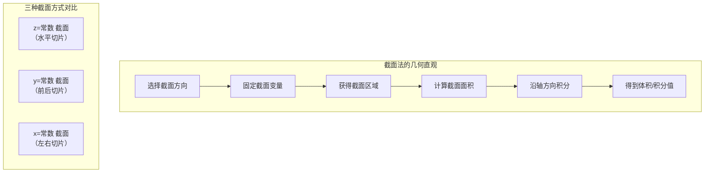
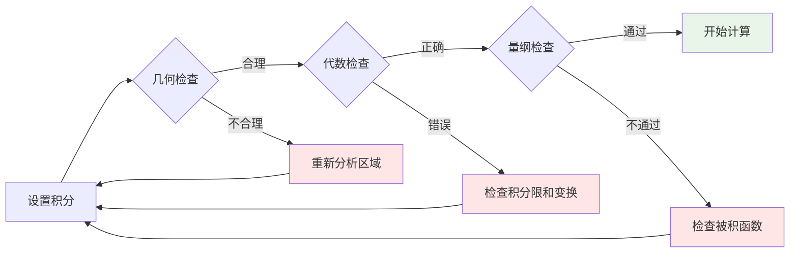

# 7.2 三重积分理论与计算
 
## 目录

1. [三重积分的概念](#1-三重积分的概念)
2. [直角坐标系下的三重积分](#2-直角坐标系下的三重积分)
3. [三重积分的投影理论与计算方法](#3-三重积分的投影理论与计算方法)
4. [柱坐标系下的三重积分](#4-柱坐标系下的三重积分)
5. [球坐标系下的三重积分](#5-球坐标系下的三重积分)
6. [三重积分的对称性](#6-三重积分的对称性)
7. [一般坐标变换](#7-一般坐标变换)
8. [三重积分的应用](#8-三重积分的应用)
9. [计算技巧与注意事项](#9-计算技巧与注意事项)
10. [复杂区域的处理技巧](#10-复杂区域的处理技巧)
11. [经典例题](#11-经典例题)

## 1. 三重积分的概念

### 1.1 三重积分的定义

> **定义1.1（三重积分）**
> 
> 设函数 $f(x,y,z)$ 在有界闭区域 $\Omega$ 上有界，将区域 $\Omega$ 任意分割成 $n$ 个小区域 $\Delta \Omega_1, \Delta \Omega_2, \ldots, \Delta \Omega_n$，各小区域的体积分别为 $\Delta V_1, \Delta V_2, \ldots, \Delta V_n$。在每个 $\Delta \Omega_i$ 上任取一点 $(\xi_i, \eta_i, \zeta_i)$，作积分和：
> $$S_n = \sum_{i=1}^{n} f(\xi_i, \eta_i, \zeta_i) \Delta V_i$$
> 
> 如果当所有小区域的直径趋于零时，积分和 $S_n$ 的极限存在且不依赖于区域的分割方式和点的选取方式，则称此极限为函数 $f(x,y,z)$ 在区域 $\Omega$ 上的**三重积分**，记作：
> $$\iiint_\Omega f(x,y,z) \, dV = \lim_{\lambda \to 0} \sum_{i=1}^{n} f(\xi_i, \eta_i, \zeta_i) \Delta V_i$$
> 
> 其中 $\lambda$ 是所有小区域直径的最大值， $dV = dx \, dy \, dz$ 称为体积元素。

### 1.2 三重积分的几何意义

> **几何意义**
> 
> 当 $f(x,y,z) = 1$ 时，三重积分 $\iiint_\Omega 1 \, dV$ 表示区域 $\Omega$ 的体积。

**物理意义**：
- 当 $f(x,y,z)$ 表示密度函数时，三重积分表示物体的质量
- 当 $f(x,y,z)$ 表示温度分布时，三重积分可以计算平均温度
- 当 $f(x,y,z)$ 表示电荷密度时，三重积分表示总电荷量

### 1.3 三重积分的存在性

> **定理1.2（三重积分存在定理）**
> 
> 若函数 $f(x,y,z)$ 在有界闭区域 $\Omega$ 上连续，则三重积分 $\iiint_\Omega f(x,y,z) \, dV$ 存在。

**推广条件**：若 $f(x,y,z)$ 在区域 $\Omega$ 上除了有限个点、有限条曲线或有限个曲面上不连续外，在其余点连续且有界，则三重积分仍然存在。

### 1.4 三重积分的性质

> **基本性质**
> 
> 1. **线性性**： $\iiint_\Omega [αf + βg] \, dV = α\iiint_\Omega f \, dV + β\iiint_\Omega g \, dV$
> 2. **区域可加性**：若 $\Omega = \Omega_1 \cup \Omega_2$ 且内部不重叠，则 $\iiint_\Omega f \, dV = \iiint_{\Omega_1} f \, dV + \iiint_{\Omega_2} f \, dV$
> 3. **保序性**：若 $f \leq g$，则 $\iiint_\Omega f \, dV \leq \iiint_\Omega g \, dV$
> 4. **估值不等式**：设 $m$ 和 $M$ 分别是 $f(x,y,z)$ 在区域 $\Omega$ 上的最小值和最大值，$V$ 是区域 $\Omega$ 的体积，则：
>    $$m \cdot V \leq \iiint_\Omega f(x,y,z) \, dV \leq M \cdot V$$

### 1.5 三重积分中值定理

> **定理1.3（三重积分中值定理）**
> 
> 若 $f(x,y,z)$ 在有界闭区域 $\Omega$ 上连续，则至少存在一点 $(\xi, \eta, \zeta) \in \Omega$，使得：
> $$\iiint_\Omega f(x,y,z) \, dV = f(\xi, \eta, \zeta) \cdot V$$
> 其中 $V$ 是区域 $\Omega$ 的体积。

**几何意义**：存在某个"平均高度" $f(\xi, \eta, \zeta)$，使得以此为"密度"的均匀物体的某种量度等于实际的三重积分值。

### 1.6 三重积分的几何意义与计算方法概览


上图展示了三重积分的核心概念：
- **体积元素分割**：将积分区域分割成小体积元素
- **投影法原理**：通过投影将三重积分转化为累次积分
- **基本公式**：体积分割 → 积分和 → 取极限得到三重积分

---

## 2. 直角坐标系下的三重积分

### 2.1 长方体区域上的三重积分

对于长方体区域 $\Omega = \{(x,y,z): a \leq x \leq b, c \leq y \leq d, p \leq z \leq q\}$：

> **Fubini定理的推广**
> 
> $$\iiint_\Omega f(x,y,z) \, dV = \int_a^b \int_c^d \int_p^q f(x,y,z) \, dz \, dy \, dx$$

积分次序可以任意改变，共有 $3! = 6$ 种不同的积分次序。

### 2.2 投影法与截面法对比


> **投影法**
> 
> 设区域 $\Omega$ 在 $xy$ 平面上的投影为 $D_{xy}$，对于 $xy$ 平面上的每一点 $(x,y) \in D_{xy}$，相应的纵线与区域 $\Omega$ 的交线为 $z_1(x,y) \leq z \leq z_2(x,y)$，则：
> 
> $$\iiint_\Omega f(x,y,z) \, dV = \iint_{D_{xy}} dx \, dy \int_{z_1(x,y)}^{z_2(x,y)} f(x,y,z) \, dz$$

**投影法特点**：
- 先确定积分区域在坐标平面上的投影
- 适用于区域边界易于用两个变量表示的情况
- 计算步骤：投影 → 确定高度范围 → 累次积分

**计算步骤**：
1. 确定积分区域在坐标平面上的投影
2. 确定穿过投影区域内任一点的直线与积分区域的交线
3. 建立三重积分的累次积分表达式

> **例题2.1**：计算 $\iiint_\Omega xyz \, dx \, dy \, dz$，其中 $\Omega$ 是由平面 $x = 0, y = 0, z = 0, x + y + z = 1$ 围成的四面体。

**解答**：

**步骤1：分析积分区域**


四面体的顶点为 $(0,0,0)$、 $(1,0,0)$、 $(0,1,0)$、 $(0,0,1)$

在 $xy$ 平面上的投影为： $D_{xy} = \{(x,y): x \geq 0, y \geq 0, x + y \leq 1\}$

对于点 $(x,y) \in D_{xy}$，$z$ 的范围为： $0 \leq z \leq 1 - x - y$

**步骤2：建立累次积分**

$$\iiint_\Omega xyz \, dV = \iint_{D_{xy}} dx \, dy \int_0^{1-x-y} xyz \, dz$$

**步骤3：计算积分**
内层积分：
$$\int_0^{1-x-y} xyz \, dz = xy \int_0^{1-x-y} z \, dz = xy \cdot \frac{z^2}{2}\bigg|_0^{1-x-y} = \frac{xy(1-x-y)^2}{2}$$

中间积分：
$$\iint_{D_{xy}} \frac{xy(1-x-y)^2}{2} \, dx \, dy = \frac{1}{2} \int_0^1 dx \int_0^{1-x} xy(1-x-y)^2 \, dy$$

设  $u = 1-x-y$，则 $y = 1-x-u$，$dy = -du$：
当 $y$ 从 $0$ 到 $1-x$ 变化时，$u$ 从 $1-x$ 到 $0$ 变化。

$$\int_0^{1-x} xy(1-x-y)^2 \, dy = x \int_{1-x}^0 (1-x-u)u^2(-du) = x \int_0^{1-x} (1-x-u)u^2 \, du$$
$$= x \int_0^{1-x} [(1-x)u^2 - u^3] \, du$$
$$= x(1-x)\int_0^{1-x} u^2 \, du - x\int_0^{1-x} u^3 \, du$$
$$= x(1-x) \cdot \frac{(1-x)^3}{3} - x \cdot \frac{(1-x)^4}{4} = \frac{x(1-x)^4}{3} - \frac{x(1-x)^4}{4} = \frac{x(1-x)^4}{12}$$

外层积分：
$$\frac{1}{2} \int_0^1 \frac{x(1-x)^4}{12} \, dx = \frac{1}{24} \int_0^1 x(1-x)^4 \, dx$$

使用 Beta 函数： $\int_0^1 x^{m-1}(1-x)^{n-1} \, dx = B(m,n) = \frac{\Gamma(m)\Gamma(n)}{\Gamma(m+n)}$

$$\int_0^1 x(1-x)^4 \, dx = B(2,5) = \frac{\Gamma(2)\Gamma(5)}{\Gamma(7)} = \frac{1! \cdot 4!}{6!} = \frac{24}{720} = \frac{1}{30}$$

因此：
$$\iiint_\Omega xyz \, dx \, dy \, dz = \frac{1}{24} \cdot \frac{1}{30} = \frac{1}{720}$$

### 2.3 截面法计算三重积分

> **截面法（先二后一法）**
> 
> 用平行于某个坐标平面的平面族截积分区域，每个截面都得到一个平面区域，然后在该平面区域上进行二重积分。这种方法的核心思想是"先算面积，后算体积"。

**截面法特点**：
- 选择一个坐标方向作为"截面方向"
- 每个截面上进行二重积分，然后对截面方向积分
- 适用于区域在某个方向上形状规则的情况
- 计算步骤：选择截面方向 → 描述截面区域 → 建立累次积分

#### 2.3.1 截面法的基本原理

**基本思想**：
将三重积分转化为"一重积分套二重积分"的形式，即：
1. 选择一个坐标轴方向作为"截面方向"
2. 用垂直于该轴的平面族截取积分区域
3. 每个截面上的积分是一个二重积分
4. 最后对截面方向的坐标进行一重积分

**三种截面方式**：

1. **$z$ 截面法**（用 $z = $ 常数的平面截取）：
   $$\iiint_\Omega f(x,y,z) \, dV = \int_{z_1}^{z_2} dz \iint_{D(z)} f(x,y,z) \, dx \, dy$$

2. **$y$ 截面法**（用 $y = $ 常数的平面截取）：
   $$\iiint_\Omega f(x,y,z) \, dV = \int_{y_1}^{y_2} dy \iint_{D(y)} f(x,y,z) \, dx \, dz$$

3. **$x$ 截面法**（用 $x = $ 常数的平面截取）：
   $$\iiint_\Omega f(x,y,z) \, dV = \int_{x_1}^{x_2} dx \iint_{D(x)} f(x,y,z) \, dy \, dz$$

#### 2.3.2 截面法的系统步骤

> **截面法计算步骤**：
> 
> **第一步：选择截面方向**
> - 分析积分区域的几何特征
> - 选择使得截面区域最容易描述的方向
> - 通常选择区域在某个方向上"形状规则"的轴
> 
> **第二步：确定截面变量的范围**
> - 找出区域在截面方向上的投影范围
> - 确定截面变量的积分上下限
> 
> **第三步：描述每个截面区域**
> - 对于每个截面值，确定相应的平面区域
> - 用不等式组准确描述截面区域的边界
> 
> **第四步：建立累次积分**
> - 内层：在截面上的二重积分
> - 外层：对截面变量的一重积分
> 
> **第五步：计算积分**
> - 先计算二重积分（可能需要再次选择积分次序）
> - 再计算外层的一重积分

#### 2.3.3 如何选择最优截面方向

**选择原则**：

1. **截面区域简单原则**：选择使截面区域形状最简单的方向
2. **边界函数简单原则**：选择使截面边界容易用函数表达的方向
3. **被积函数简化原则**：考虑被积函数在某个截面上是否更容易积分

> **例题2.3**：分析四面体 $x \geq 0, y \geq 0, z \geq 0, x+y+z \leq 1$ 的三种截面方式。

**解答**：

**$z$ 截面法分析**：
- 用平面 $z = c$（$0 \leq c \leq 1$）截取四面体
- 截面是三角形： $D(c) = \{(x,y) | x \geq 0, y \geq 0, x+y \leq 1-c\}$
- 截面区域简单，边界为直线

**$y$ 截面法分析**：
- 用平面 $y = c$（$0 \leq c \leq 1$）截取四面体  
- 截面是三角形： $D(c) = \{(x,z) | x \geq 0, z \geq 0, x+z \leq 1-c\}$
- 截面区域同样简单

**$x$ 截面法分析**：
- 用平面 $x = c$（$0 \leq c \leq 1$）截取四面体
- 截面是三角形： $D(c) = \{(y,z) | y \geq 0, z \geq 0, y+z \leq 1-c\}$
- 截面区域同样简单

**结论**：对于这个四面体，三种截面方法都同样简单，可以任选其一。

#### 2.3.6 截面法的可视化理解



**截面法的动态理解**：
1. **z截面法**：像切面包一样，用水平面一层层切开立体
2. **y截面法**：像书页一样，用平行于xz平面的面切开立体  
3. **x截面法**：像切片一样，用平行于yz平面的面切开立体

每种方法都是"化立体为平面，化复杂为简单"的体现。

#### 2.3.4 截面法的详细例题

> **例题2.4**：计算 $\iiint_\Omega z \, dV$，其中 $\Omega$ 是由抛物面 $z = x^2 + y^2$ 和平面 $z = 4$ 围成的区域。

**解答**：

**第一步：选择截面方向**

分析区域特点：
- 下边界：抛物面 $z = x^2 + y^2$
- 上边界：平面 $z = 4$
- 区域在 $z$ 方向上的结构最清晰

选择 **$z$ 截面法**。

**第二步：确定 $z$ 的范围**

抛物面与平面的交线：$x^2 + y^2 = 4$
$z$ 的范围：$0 \leq z \leq 4$

**第三步：描述截面区域 $D(z)$**

用平面 $z = $ 常数截取区域：
- 当 $0 \leq z \leq 4$ 时，截面是圆盘
- 由于 $x^2 + y^2 = z$（抛物面）和 $z = $ 常数的交线是圆 $x^2 + y^2 = z$
- 但我们需要在抛物面**上方**，所以实际的截面区域是：

$$D(z) = \{(x,y) | x^2 + y^2 \leq z\}$$

当 $z < 0$ 时，没有截面区域。

**正确分析**：
区域 $\Omega$ 是抛物面上方、平面下方的区域：$\{(x,y,z) | z \geq x^2 + y^2, z \leq 4\}$

所以当用 $z = c$（$0 \leq c \leq 4$）截取时：
需要满足 $c \geq x^2 + y^2$，即 $x^2 + y^2 \leq c$

因此：$$D(c) = \{(x,y) | x^2 + y^2 \leq c\}$$

**第四步：建立累次积分**

$$\iiint_\Omega z \, dV = \int_0^4 z \, dz \iint_{D(z)} 1 \, dx \, dy$$

$$= \int_0^4 z \, dz \iint_{x^2+y^2 \leq z} 1 \, dx \, dy$$

**第五步：计算二重积分**

截面区域是半径为 $\sqrt{z}$ 的圆盘，面积为 $\pi z$：
$$\iint_{x^2+y^2 \leq z} 1 \, dx \, dy = \pi z$$

**第六步：计算外层积分**

$$\iiint_\Omega z \, dV = \int_0^4 z \cdot \pi z \, dz = \pi \int_0^4 z^2 \, dz = \pi \left[\frac{z^3}{3}\right]_0^4 = \pi \cdot \frac{64}{3} = \frac{64\pi}{3}$$

> **例题2.5**：计算 $\iiint_\Omega xy \, dV$，其中 $\Omega$ 是由曲面 $z = \sqrt{x^2 + y^2}$，$z = 1$，$y = 0$，$y = x$，$x \geq 0$ 围成的区域。

**解答**：

**第一步：理解区域的几何结构**

这是一个复杂的区域：
- 下边界：圆锥面 $z = \sqrt{x^2 + y^2}$
- 上边界：平面 $z = 1$
- 侧边界：平面 $y = 0$，$y = x$，条件 $x \geq 0$

**第二步：选择截面方向**

分析各种截面的复杂度：
- $z$ 截面：每个高度 $z$ 上的截面形状规则
- $x$ 截面：截面在 $yz$ 平面上，形状复杂
- $y$ 截面：截面在 $xz$ 平面上，形状相对简单

选择 **$z$ 截面法**。

**第三步：确定 $z$ 的范围**

由于 $z = \sqrt{x^2 + y^2} \leq 1$，所以 $0 \leq z \leq 1$。

**第四步：描述截面区域 $D(z)$**

用平面 $z = c$（$0 \leq c \leq 1$）截取区域：

在高度 $z = c$ 处，需要满足：
1. $\sqrt{x^2 + y^2} \leq c$，即 $x^2 + y^2 \leq c^2$（圆盘）
2. $y \geq 0$（上半平面）
3. $y \leq x$（扇形区域）
4. $x \geq 0$（右半平面）

因此截面区域是：
$$D(c) = \{(x,y) | x^2 + y^2 \leq c^2, 0 \leq y \leq x, x \geq 0\}$$

这是一个扇形区域，角度为 $\frac{\pi}{4}$。

**第五步：建立累次积分**

$$\iiint_\Omega xy \, dV = \int_0^1 dz \iint_{D(z)} xy \, dx \, dy$$

**第六步：计算二重积分**

对于截面区域 $D(z)$，使用极坐标：
$x = r\cos\theta$，$y = r\sin\theta$

区域条件：
- $r^2 \leq z^2 \Rightarrow 0 \leq r \leq z$
- $0 \leq y \leq x \Rightarrow 0 \leq \tan\theta \leq 1 \Rightarrow 0 \leq \theta \leq \frac{\pi}{4}$

$$\iint_{D(z)} xy \, dx \, dy = \int_0^{\pi/4} \int_0^z (r\cos\theta)(r\sin\theta) \cdot r \, dr \, d\theta$$

$$= \int_0^{\pi/4} \cos\theta\sin\theta \, d\theta \int_0^z r^3 \, dr$$

$$= \int_0^{\pi/4} \cos\theta\sin\theta \, d\theta \cdot \frac{z^4}{4}$$

$$= \frac{z^4}{4} \int_0^{\pi/4} \frac{1}{2}\sin(2\theta) \, d\theta$$

$$= \frac{z^4}{8} \left[-\frac{\cos(2\theta)}{2}\right]_0^{\pi/4}$$

$$= \frac{z^4}{16} \left[-\cos\left(\frac{\pi}{2}\right) + \cos(0)\right] = \frac{z^4}{16}(0 + 1) = \frac{z^4}{16}$$

**第七步：计算外层积分**

$$\iiint_\Omega xy \, dV = \int_0^1 \frac{z^4}{16} \, dz = \frac{1}{16} \int_0^1 z^4 \, dz = \frac{1}{16} \cdot \frac{z^5}{5}\bigg|_0^1 = \frac{1}{80}$$

#### 2.3.5 截面法与投影法的比较

> **截面法 vs 投影法**
> 
> | 特征 | 截面法 | 投影法 |
> |------|--------|--------|
> | **基本思想** | 先算截面面积，后算体积 | 先算投影面积，后算高度 |
> | **适用区域** | 在某个方向上截面规则 | 在某个方向上投影简单 |
> | **计算步骤** | 先二重积分，后一重积分 | 先确定积分限，后三重积分 |
> | **优势** | 几何直观，便于理解 | 积分限明确，计算系统 |

**选择建议**：
1. 当区域的截面形状规则且容易计算面积时，优先使用截面法
2. 当区域的投影清晰且第三个变量的范围容易确定时，使用投影法
3. 对于旋转体或具有明显分层结构的区域，截面法更直观
4. 对于由函数图像围成的区域，投影法更系统

#### 2.3.7 三重积分方法选择决策系统

```mermaid
flowchart TD
    A[开始分析三重积分] --> B{分析积分区域形状}
    
    B -->|球形/椭球形| C[考虑球坐标系]
    B -->|圆柱形/圆锥形| D[考虑柱坐标系]
    B -->|长方体/四面体| E[考虑直角坐标系]
    B -->|复杂形状| F[分析对称性和特殊性质]
    
    C --> G{被积函数含有<br/>√(x²+y²+z²)?}
    G -->|是| H[使用球坐标系]
    G -->|否| I[比较球坐标与其他坐标系]
    
    D --> J{被积函数含有<br/>√(x²+y²) 或类似?}
    J -->|是| K[使用柱坐标系]
    J -->|否| L[比较柱坐标与直角坐标]
    
    E --> M{选择积分次序}
    M --> N[投影法 vs 截面法]
    
    F --> O{是否有对称性?}
    O -->|是| P[利用对称性简化]
    O -->|否| Q[选择最简单的坐标系]
    
    N --> R{投影区域是否简单?}
    R -->|是| S[使用投影法]
    R -->|否| T[使用截面法]
    
    style H fill:#e1f5fe
    style K fill:#e8f5e8
    style S fill:#fff3e0
    style T fill:#fce4ec
```

**决策要点总结**：

> **坐标系选择优先级**
> 
> 1. **球坐标系**：
>    - 区域：球体、椭球体、球壳
>    - 被积函数：含 $\sqrt{x^2+y^2+z^2}$、$x^2+y^2+z^2$ 等
> 
> 2. **柱坐标系**：
>    - 区域：圆柱体、圆锥体、旋转抛物面
>    - 被积函数：含 $\sqrt{x^2+y^2}$、$x^2+y^2$ 等
> 
> 3. **直角坐标系**：
>    - 区域：长方体、四面体、由平面围成的多面体
>    - 被积函数：多项式、简单函数

> **计算方法选择**
> 
> | 情况 | 推荐方法 | 优势 |
> |------|----------|------|
> | 截面形状规则 | 截面法 | 几何直观，计算简单 |
> | 投影区域简单 | 投影法 | 积分次序明确 |
> | 旋转对称 | 柱/球坐标 | 利用对称性 |
> | 函数有特殊性质 | 对称性分析 | 可能直接得出结果 |

---

## 3. 三重积分的投影理论与计算方法

### 3.1 投影的基本概念

> **定义3.1（投影）**
> 
> 设空间区域 $\Omega$ 为有界闭区域，将 $\Omega$ 上所有点沿某个坐标轴方向投射到相应的坐标平面上，所得的平面区域称为区域 $\Omega$ 在该坐标平面上的**投影**。

**三种基本投影**：
1. **在 $xy$ 平面上的投影**： $D_{xy} = \{(x,y) | \exists z \text{ 使得 } (x,y,z) \in \Omega\}$
2. **在 $xz$ 平面上的投影**： $D_{xz} = \{(x,z) | \exists y \text{ 使得 } (x,y,z) \in \Omega\}$
3. **在 $yz$ 平面上的投影**： $D_{yz} = \{(y,z) | \exists x \text{ 使得 } (x,y,z) \in \Omega\}$

### 3.2 如何确定投影区域

#### 3.2.1 解析法确定投影

**步骤1：分析区域的边界曲面**
- 列出所有围成区域的曲面方程
- 分析这些曲面的性质和相互关系

**步骤2：消除相应坐标变量**
- 对于 $xy$ 平面投影：从边界曲面方程中消去 $z$
- 对于 $xz$ 平面投影：从边界曲面方程中消去 $y$  
- 对于 $yz$ 平面投影：从边界曲面方程中消去 $x$

**步骤3：确定投影区域的边界**
- 找出投影区域的边界曲线
- 确定投影区域的内部范围

> **例题3.1**：求椭球 $\frac{x^2}{a^2} + \frac{y^2}{b^2} + \frac{z^2}{c^2} \leq 1$ 在各坐标平面上的投影。

**解答**：

**在 $xy$ 平面上的投影**：
消去 $z$ 变量，由椭球方程知 $\frac{z^2}{c^2} \leq 1 - \frac{x^2}{a^2} - \frac{y^2}{b^2}$
为了使 $z$ 有实数解，必须：
$$1 - \frac{x^2}{a^2} - \frac{y^2}{b^2} \geq 0 \Rightarrow \frac{x^2}{a^2} + \frac{y^2}{b^2} \leq 1$$

所以在 $xy$ 平面上的投影为椭圆： $D_{xy} = \left\{(x,y) \mid \frac{x^2}{a^2} + \frac{y^2}{b^2} \leq 1\right\}$

**在 $xz$ 平面上的投影**：
类似地，消去 $y$ 得到： $D_{xz} = \left\{(x,z) \mid \frac{x^2}{a^2} + \frac{z^2}{c^2} \leq 1\right\}$

**在 $yz$ 平面上的投影**：
消去 $x$ 得到： $D_{yz} = \left\{(y,z) \mid \frac{y^2}{b^2} + \frac{z^2}{c^2} \leq 1\right\}$

#### 3.2.2 几何法确定投影

对于具有明显几何特征的区域，可以通过几何直观来确定投影。

> **例题3.2**：求圆锥 $z = \sqrt{x^2 + y^2}, 0 \leq z \leq h$ 在各坐标平面上的投影。

**解答**：

**几何分析**：
这是一个底面半径为 $h$、高为 $h$ 的圆锥（顶点在原点）。

**在 $xy$ 平面上的投影**：
由 $z = \sqrt{x^2 + y^2} \leq h$ 得 $x^2 + y^2 \leq h^2$
所以投影为： $D_{xy} = \{(x,y) \mid x^2 + y^2 \leq h^2\}$ （圆盘）

**在 $xz$ 平面上的投影**：
由于 $y^2 \geq 0$，当 $y = 0$ 时 $z = |x|$
考虑到 $0 \leq z \leq h$，得到投影为：
$D_{xz} = \{(x,z) \mid 0 \leq z \leq h, |x| \leq z\}$ （三角形区域）

**在 $yz$ 平面上的投影**：
由对称性，投影为： $D_{yz} = \{(y,z) \mid 0 \leq z \leq h, |y| \leq z\}$ （三角形区域）

### 3.3 投影法计算三重积分的详细步骤

#### 3.3.1 选择合适的投影平面

**选择原则**：
1. **简化投影区域**：选择使投影区域最简单的坐标平面
2. **简化被积函数**：考虑被积函数的性质
3. **简化积分限**：选择使得第三个变量的积分限最容易表达的投影

> **例题3.3**：对于区域 $\Omega: x^2 + y^2 + z^2 \leq R^2, z \geq 0$，分析三种投影方式的复杂度。

**解答**：

**投影到 $xy$ 平面**：
- 投影区域： $D_{xy} = \{(x,y) \mid x^2 + y^2 \leq R^2\}$ （圆盘，简单）
- $z$ 的范围：对于 $(x,y) \in D_{xy}$，$0 \leq z \leq \sqrt{R^2 - x^2 - y^2}$ （表达式复杂）

**投影到 $xz$ 平面**：
- 投影区域： $D_{xz} = \{(x,z) \mid x^2 + z^2 \leq R^2, z \geq 0\}$ （半圆，中等）
- $y$ 的范围：对于 $(x,z) \in D_{xz}$，$-\sqrt{R^2 - x^2 - z^2} \leq y \leq \sqrt{R^2 - x^2 - z^2}$ （表达式复杂）

**投影到 $yz$ 平面**：
- 投影区域： $D_{yz} = \{(y,z) \mid y^2 + z^2 \leq R^2, z \geq 0\}$ （半圆，中等）
- $x$ 的范围：对于 $(y,z) \in D_{yz}$，$-\sqrt{R^2 - y^2 - z^2} \leq x \leq \sqrt{R^2 - y^2 - z^2}$ （表达式复杂）

**结论**：对于这个半球区域，投影到 $xy$ 平面最合适，因为投影区域最简单。

#### 3.3.2 确定第三个变量的积分限

一旦选定了投影平面，关键是要准确确定第三个变量的积分限。

> **系统方法**：
> 1. **画出投影区域的图形**
> 2. **在投影区域内任取一点，分析垂直线与原区域的交线**
> 3. **确定交线的端点，得到第三个变量的范围**

> **例题3.4**：求由曲面 $z = x^2 + y^2$ 和 $z = 8 - x^2 - y^2$ 围成的区域 $\Omega$ 的具体描述。

**解答**：

**第一步：分析两个曲面**
- 下曲面：$z_1 = x^2 + y^2$ （开口向上的抛物面）
- 上曲面：$z_2 = 8 - x^2 - y^2$ （开口向下的抛物面）

**第二步：求交线**
令 $x^2 + y^2 = 8 - x^2 - y^2$，得到 $2(x^2 + y^2) = 8$，即 $x^2 + y^2 = 4$

**第三步：确定投影区域**
在 $xy$ 平面上的投影为： $D_{xy} = \{(x,y) \mid x^2 + y^2 \leq 4\}$

**第四步：确定 $z$ 的积分限**
对于 $(x,y) \in D_{xy}$，由于 $\Omega$ 是两个抛物面之间的区域，所以：
$$x^2 + y^2 \leq z \leq 8 - x^2 - y^2$$

**第五步：验证合理性**
- 当 $x = y = 0$ 时：$0 \leq z \leq 8$ ✓
- 当 $x^2 + y^2 = 4$ 时：$4 \leq z \leq 4$，即 $z = 4$ ✓

**最终描述**：
$$\Omega = \{(x,y,z) \mid x^2 + y^2 \leq 4, \, x^2 + y^2 \leq z \leq 8 - x^2 - y^2\}$$

### 3.4 复杂区域的投影分析技巧

#### 3.4.1 分段投影法

当区域在某个方向上有复杂的结构时，可能需要分段处理。

> **例题3.5**：分析由球面 $x^2 + y^2 + z^2 = 4$ 和圆柱面 $x^2 + y^2 = 1$ 围成的区域的投影。

**解答**：

**问题分析**：
这是球面被圆柱面穿过形成的复杂区域。需要分析球和圆柱的相互关系。

**第一步：分析几何结构**
- 球心在原点，半径为 2
- 圆柱轴为 $z$ 轴，半径为 1
- 圆柱完全穿过球面

**第二步：分析在 $xy$ 平面上的投影**
投影为： $D_{xy} = \{(x,y) \mid x^2 + y^2 \leq 4\}$ （整个球的投影）

但是区域结构复杂：
- 当 $x^2 + y^2 \leq 1$ 时：球面被圆柱面挖去了中间部分
- 当 $1 < x^2 + y^2 \leq 4$ 时：只有球面部分

**第三步：确定 $z$ 的积分限**

**情况1**：$x^2 + y^2 \leq 1$
区域是球面减去圆柱面的部分，实际上没有区域（或者说区域在圆柱外部）
正确的理解：$x^2 + y^2 = 1$ 是边界

**情况2**：$1 \leq x^2 + y^2 \leq 4$  
$z$ 的范围：$-\sqrt{4 - x^2 - y^2} \leq z \leq \sqrt{4 - x^2 - y^2}$

**更准确的描述**：
$$\Omega = \{(x,y,z) \mid 1 \leq x^2 + y^2 \leq 4, \, -\sqrt{4-x^2-y^2} \leq z \leq \sqrt{4-x^2-y^2}\}$$

#### 3.4.2 投影的对称性利用

> **例题3.6**：利用对称性简化椭球 $\frac{x^2}{4} + \frac{y^2}{9} + \frac{z^2}{16} \leq 1$ 上的积分计算。

**解答**：

**对称性分析**：
- 椭球关于三个坐标平面都对称
- 椭球关于原点中心对称

**投影分析**：
在 $xy$ 平面上的投影为椭圆： $\frac{x^2}{4} + \frac{y^2}{9} \leq 1$

**对称性的利用**：
1. 如果被积函数关于某个变量是奇函数，可直接得出积分值为 0
2. 如果被积函数关于某个变量是偶函数，可以只在一半区域上积分，然后乘以 2
3. 对于具有轮换对称性的被积函数，可以利用对称性简化计算

### 3.5 投影法的实际计算技巧

#### 3.5.1 积分次序的选择策略

> **策略原则**：
> 1. **先积最简单的变量**：选择积分限为常数或简单函数的变量
> 2. **考虑被积函数的特点**：某些函数在特定次序下更容易积分
> 3. **利用对称性**：合理的次序可以更好地利用区域的对称性

> **例题3.7**：比较不同积分次序计算 $\iiint_\Omega xy \, dV$ 的难易程度，其中 $\Omega$ 是由平面 $x+y+z=1$ 和三个坐标平面围成的四面体。

**解答**：

**区域描述**：$\Omega = \{(x,y,z) \mid x \geq 0, y \geq 0, z \geq 0, x+y+z \leq 1\}$

**方法1：投影到 $xy$ 平面，次序 $dz \, dy \, dx$**
- 投影：$D_{xy} = \{(x,y) \mid x \geq 0, y \geq 0, x+y \leq 1\}$
- $z$ 的范围：$0 \leq z \leq 1-x-y$

$$\iiint_\Omega xy \, dV = \int_0^1 \int_0^{1-x} \int_0^{1-x-y} xy \, dz \, dy \, dx$$

内层积分很简单：$\int_0^{1-x-y} xy \, dz = xy(1-x-y)$

**方法2：投影到 $xz$ 平面，次序 $dy \, dz \, dx$**
- 投影：$D_{xz} = \{(x,z) \mid x \geq 0, z \geq 0, x+z \leq 1\}$
- $y$ 的范围：$0 \leq y \leq 1-x-z$

$$\iiint_\Omega xy \, dV = \int_0^1 \int_0^{1-x} \int_0^{1-x-z} xy \, dy \, dz \, dx$$

内层积分：$\int_0^{1-x-z} xy \, dy = x \cdot \frac{y^2}{2}\bigg|_0^{1-x-z} = \frac{x(1-x-z)^2}{2}$

**方法3：投影到 $yz$ 平面，次序 $dx \, dz \, dy$**
- 投影：$D_{yz} = \{(y,z) \mid y \geq 0, z \geq 0, y+z \leq 1\}$
- $x$ 的范围：$0 \leq x \leq 1-y-z$

$$\iiint_\Omega xy \, dV = \int_0^1 \int_0^{1-y} \int_0^{1-y-z} xy \, dx \, dz \, dy$$

内层积分：$\int_0^{1-y-z} xy \, dx = y \cdot \frac{x^2}{2}\bigg|_0^{1-y-z} = \frac{y(1-y-z)^2}{2}$

**比较分析**：
- 方法1最直接，因为内层积分后被积函数仍然是 $xy$ 的倍数
- 方法2和方法3会产生更复杂的被积函数
- **结论**：方法1（$dz \, dy \, dx$ 次序）最优

#### 3.5.2 换元法与投影法的结合

有时候直角坐标下的投影比较复杂，可以考虑先进行坐标变换，再使用投影法。

> **例题3.8**：计算 $\iiint_\Omega (x^2 + y^2) \, dV$，其中 $\Omega$ 是圆柱 $x^2 + y^2 \leq a^2$ 与球 $x^2 + y^2 + z^2 \leq R^2$ （$a < R$）的交集。

**解答**：

**方法1：直角坐标投影法**
投影到 $xy$ 平面：$D_{xy} = \{(x,y) \mid x^2 + y^2 \leq a^2\}$
$z$ 的范围：$-\sqrt{R^2 - x^2 - y^2} \leq z \leq \sqrt{R^2 - x^2 - y^2}$

积分表达式：
$$\iiint_\Omega (x^2 + y^2) \, dV = \iint_{D_{xy}} (x^2 + y^2) \cdot 2\sqrt{R^2 - x^2 - y^2} \, dx \, dy$$

这个二重积分比较复杂。

**方法2：柱坐标变换**
使用柱坐标 $x = r\cos\theta, y = r\sin\theta, z = z$：
- 区域：$0 \leq r \leq a, 0 \leq \theta \leq 2\pi, -\sqrt{R^2-r^2} \leq z \leq \sqrt{R^2-r^2}$
- 被积函数：$x^2 + y^2 = r^2$
- 体积元素：$dV = r \, dr \, d\theta \, dz$

$$\iiint_\Omega (x^2 + y^2) \, dV = \int_0^{2\pi} \int_0^a \int_{-\sqrt{R^2-r^2}}^{\sqrt{R^2-r^2}} r^2 \cdot r \, dz \, dr \, d\theta$$

$$= \int_0^{2\pi} \int_0^a r^3 \cdot 2\sqrt{R^2-r^2} \, dr \, d\theta = 4\pi \int_0^a r^3\sqrt{R^2-r^2} \, dr$$

**结论**：柱坐标变换后的投影法计算更简单。

### 3.6 投影法的常见错误及避免方法

#### 3.6.1 投影区域确定错误

**常见错误**：混淆"区域的投影"和"边界的投影"

> **错误示例**：求圆锥 $z = \sqrt{x^2 + y^2}, 0 \leq z \leq 1$ 在 $xy$ 平面上的投影。
> 
> **错误答案**：投影是射线 $y = \pm x, x \geq 0$
> 
> **正确答案**：投影是圆盘 $x^2 + y^2 \leq 1$

**避免方法**：
- 明确投影的定义：是将整个区域投射，而不仅仅是边界
- 系统地分析：对于区域内的任意一点，确定其投影的位置

#### 3.6.2 积分限确定错误  

**常见错误**：第三个变量的范围确定不准确

> **错误示例**：对于区域 $x^2 + y^2 + z^2 \leq 1, z \geq x^2 + y^2$，错误地认为对于任意 $(x,y)$ 满足 $x^2 + y^2 \leq 1$，都有 $z$ 的范围是 $x^2 + y^2 \leq z \leq \sqrt{1-x^2-y^2}$。

**错误分析**：
当 $x^2 + y^2 > \frac{1}{2}$ 时，条件 $z \geq x^2 + y^2$ 和 $x^2 + y^2 + z^2 \leq 1$ 可能没有公共解。

**正确分析**：
需要 $x^2 + y^2 + (x^2 + y^2)^2 \leq 1$，即 $(x^2 + y^2)(1 + x^2 + y^2) \leq 1$
这要求投影区域实际上比单位圆小。

**避免方法**：
- 仔细检查所有约束条件的相容性
- 画图辅助分析
- 验证边界情况的合理性

---

## 4. 柱坐标系下的三重积分

### 4.1 柱坐标系基础理论

**柱坐标系图像与说明**：


上图清晰展示了柱坐标系的核心特征：
- **r**：点到 $z$ 轴的距离（径向坐标）
- **θ**：在 $xy$ 平面内的角度（方位角）
- **z**：高度坐标（与直角坐标系相同）

> **柱坐标变换公式**：
> $$\begin{cases}
> x = r\cos\theta \\
> y = r\sin\theta \\
> z = z
> \end{cases}$$
> 
> **参数范围**：
> - $0 \leq r < +\infty$
> - $0 \leq \theta \leq 2\pi$
> - $-\infty < z < +\infty$
> 
> **体积元素变换**： $dx \, dy \, dz = r \, dr \, d\theta \, dz$

**Jacobian行列式推导**：
$$J = \frac{\partial(x,y,z)}{\partial(r,\theta,z)} = \begin{vmatrix}
\cos\theta & -r\sin\theta & 0 \\
\sin\theta & r\cos\theta & 0 \\
0 & 0 & 1
\end{vmatrix} = r$$

> **关键要点**：体积元素中的因子 $r$ 来源于Jacobian行列式，是从直角坐标系到柱坐标系变换的必然结果。

### 4.2 柱坐标系下三重积分的计算

> **柱坐标系下的三重积分公式**
> 
> $$\iiint_\Omega f(x,y,z) \, dx \, dy \, dz = \iiint_{\Omega'} f(r\cos\theta, r\sin\theta, z) \cdot r \, dr \, d\theta \, dz$$

### 4.3 柱坐标系的适用条件与选择准则

**适用情况**：
1. **区域特征**：积分区域关于 $z$ 轴具有旋转对称性
2. **函数特征**：被积函数含有 $x^2 + y^2$ 或 $\sqrt{x^2 + y^2}$ 项
3. **几何特征**：积分区域为圆柱形、圆锥形、旋转抛物面等

**选择柱坐标的判断标准**：
- 区域边界用 $x^2 + y^2 = \text{常数}$ 或 $x^2 + y^2 = f(z)$ 表示
- 被积函数简化后形式更简单
- $z$ 方向的约束相对独立

> **例题4.1**：计算 $\iiint_\Omega (x^2 + y^2) \, dx \, dy \, dz$，其中 $\Omega$ 是圆柱体 $x^2 + y^2 \leq a^2, 0 \leq z \leq h$。

**解答**：

**使用柱坐标变换**：
- 区域描述： $0 \leq r \leq a, 0 \leq \theta \leq 2\pi, 0 \leq z \leq h$
- 被积函数： $x^2 + y^2 = r^2$

$$\iiint_\Omega (x^2 + y^2) \, dx \, dy \, dz = \int_0^{2\pi} \int_0^a \int_0^h r^2 \cdot r \, dz \, dr \, d\theta$$

$$= \int_0^{2\pi} \int_0^a \int_0^h r^3 \, dz \, dr \, d\theta = \int_0^{2\pi} \int_0^a r^3 \cdot h \, dr \, d\theta$$

$$= h \int_0^{2\pi} \left[\frac{r^4}{4}\right]_0^a d\theta = h \int_0^{2\pi} \frac{a^4}{4} \, d\theta = \frac{ha^4}{4} \cdot 2\pi = \frac{\pi ha^4}{2}$$

> **例题4.2**：计算 $\iiint_\Omega z \, dx \, dy \, dz$，其中 $\Omega$ 是由抛物面 $z = x^2 + y^2$ 和平面 $z = 4$ 围成的区域。

**解答**：

**区域分析**：
- 抛物面 $z = x^2 + y^2$ 与平面 $z = 4$ 的交线： $x^2 + y^2 = 4$
- 在 $xy$ 平面上的投影： $x^2 + y^2 \leq 4$

**使用柱坐标**：
- 区域描述： $0 \leq r \leq 2, 0 \leq \theta \leq 2\pi, r^2 \leq z \leq 4$

$$\iiint_\Omega z \, dx \, dy \, dz = \int_0^{2\pi} \int_0^2 \int_{r^2}^4 z \cdot r \, dz \, dr \, d\theta$$

内层积分：
$$\int_{r^2}^4 z \, dz = \frac{z^2}{2}\bigg|_{r^2}^4 = \frac{16 - r^4}{2}$$

中层积分：
$$\int_0^2 \frac{16 - r^4}{2} \cdot r \, dr = \frac{1}{2} \int_0^2 (16r - r^5) \, dr = \frac{1}{2}\left[8r^2 - \frac{r^6}{6}\right]_0^2$$
$$= \frac{1}{2}\left(32 - \frac{64}{6}\right) = \frac{1}{2} \cdot \frac{192 - 64}{6} = \frac{128}{12} = \frac{32}{3}$$

外层积分：
$$\int_0^{2\pi} \frac{32}{3} \, d\theta = \frac{32}{3} \cdot 2\pi = \frac{64\pi}{3}$$

---

## 5. 球坐标系下的三重积分

### 5.1 球坐标系基础理论

**三坐标系对比图像**：


**球坐标系图像与说明**：


上图详细展示了球坐标系的三个坐标参数：
- **r**：点到原点的距离（径向距离）
- **φ**：极角，即径向与 $z$ 轴正向的夹角
- **θ**：方位角，即径向在 $xy$ 平面上投影与 $x$ 轴正向的夹角

> **球坐标变换公式**：
> $$\begin{cases}
> x = r\sin\varphi\cos\theta \\
> y = r\sin\varphi\sin\theta \\
> z = r\cos\varphi
> \end{cases}$$
> 
> **参数范围**：
> - $r \geq 0$ (径向距离)
> - $0 \leq \varphi \leq \pi$ (极角，与 $z$ 轴夹角)
> - $0 \leq \theta \leq 2\pi$ (方位角，在 $xy$ 平面内)
> 
> **体积元素变换**： $dx \, dy \, dz = r^2\sin\varphi \, dr \, d\varphi \, d\theta$

**Jacobian行列式推导**：
$$J = \frac{\partial(x,y,z)}{\partial(r,\varphi,\theta)} = \begin{vmatrix}
\sin\varphi\cos\theta & r\cos\varphi\cos\theta & -r\sin\varphi\sin\theta \\
\sin\varphi\sin\theta & r\cos\varphi\sin\theta & r\sin\varphi\cos\theta \\
\cos\varphi & -r\sin\varphi & 0
\end{vmatrix} = r^2\sin\varphi$$

> **关键理解**：
> - 体积元素中的 $r^2$ 来自于球面的面积元素
> - $\sin\varphi$ 因子反映了不同纬度圆的周长差异
> - 当 $\varphi = 0$ 或 $\varphi = \pi$ 时，$\sin\varphi = 0$，对应于两极点

### 5.2 球坐标系下三重积分的计算

> **球坐标系下的三重积分公式**
> 
> $$\iiint_\Omega f(x,y,z) \, dx \, dy \, dz = \iiint_{\Omega'} f(r\sin\varphi\cos\theta, r\sin\varphi\sin\theta, r\cos\varphi) \cdot r^2\sin\varphi \, dr \, d\varphi \, d\theta$$

### 5.3 球坐标系的适用条件与选择准则

**适用情况**：
1. **区域特征**：积分区域为球、球壳、球扇形、圆锥等
2. **函数特征**：被积函数含有 $x^2 + y^2 + z^2$ 或 $\sqrt{x^2 + y^2 + z^2}$ 项
3. **对称特征**：积分区域关于原点具有球对称性

**选择球坐标的判断标准**：
- 区域边界用 $x^2 + y^2 + z^2 = \text{常数}$ 表示
- 区域为圆锥形： $z = k\sqrt{x^2 + y^2}$ 或 $x^2 + y^2 + z^2 = kz$
- 被积函数在球坐标下形式显著简化
- 需要利用球对称性质

> **例题5.1**：计算 $\iiint_\Omega (x^2 + y^2 + z^2) \, dx \, dy \, dz$，其中 $\Omega$ 是球 $x^2 + y^2 + z^2 \leq a^2$。

**解答**：

**使用球坐标变换**：
- 区域描述： $0 \leq r \leq a, 0 \leq \varphi \leq \pi, 0 \leq \theta \leq 2\pi$
- 被积函数： $x^2 + y^2 + z^2 = r^2$

$$\iiint_\Omega (x^2 + y^2 + z^2) \, dx \, dy \, dz = \int_0^{2\pi} \int_0^\pi \int_0^a r^2 \cdot r^2\sin\varphi \, dr \, d\varphi \, d\theta$$

$$= \int_0^{2\pi} \int_0^\pi \int_0^a r^4\sin\varphi \, dr \, d\varphi \, d\theta$$

内层积分：
$$\int_0^a r^4 \, dr = \frac{r^5}{5}\bigg|_0^a = \frac{a^5}{5}$$

中层积分：
$$\int_0^\pi \sin\varphi \, d\varphi = [-\cos\varphi]_0^\pi = -(-1 - 1) = 2$$

外层积分：
$$\int_0^{2\pi} d\theta = 2\pi$$

因此：
$$\iiint_\Omega (x^2 + y^2 + z^2) \, dx \, dy \, dz = \frac{a^5}{5} \cdot 2 \cdot 2\pi = \frac{4\pi a^5}{5}$$

> **例题5.2**：计算 $\iiint_\Omega z^2 \, dx \, dy \, dz$，其中 $\Omega$ 是球 $x^2 + y^2 + z^2 \leq a^2$ 在第一卦限的部分。

**解答**：

**区域分析**：
第一卦限： $x \geq 0, y \geq 0, z \geq 0$

**球坐标表示**：
- $0 \leq r \leq a$
- $0 \leq \varphi \leq \frac{\pi}{2}$ (保证 $z \geq 0$)
- $0 \leq \theta \leq \frac{\pi}{2}$ (保证 $x \geq 0, y \geq 0$)
- $z^2 = r^2\cos^2\varphi$

$$\iiint_\Omega z^2 \, dx \, dy \, dz = \int_0^{\pi/2} \int_0^{\pi/2} \int_0^a r^2\cos^2\varphi \cdot r^2\sin\varphi \, dr \, d\varphi \, d\theta$$

$$= \int_0^{\pi/2} \int_0^{\pi/2} \int_0^a r^4\cos^2\varphi\sin\varphi \, dr \, d\varphi \, d\theta$$

内层积分：
$$\int_0^a r^4 \, dr = \frac{a^5}{5}$$

中层积分： $\int_0^{\pi/2} \cos^2\varphi\sin\varphi \, d\varphi$
令 $u = \cos\varphi$，$du = -\sin\varphi \, d\varphi$：
$$\int_0^{\pi/2} \cos^2\varphi\sin\varphi \, d\varphi = -\int_1^0 u^2 \, du = \int_0^1 u^2 \, du = \frac{1}{3}$$

外层积分：
$$\int_0^{\pi/2} d\theta = \frac{\pi}{2}$$

因此：
$$\iiint_\Omega z^2 \, dx \, dy \, dz = \frac{a^5}{5} \cdot \frac{1}{3} \cdot \frac{\pi}{2} = \frac{\pi a^5}{30}$$

---

## 6. 三重积分的对称性

### 6.1 奇偶性的应用

> **奇偶性定理**
> 
> 若积分区域 $\Omega$ 关于某个坐标平面对称，被积函数关于相应坐标变量具有奇偶性，则：
> - 若被积函数关于该变量为奇函数，则积分值为 0
> - 若被积函数关于该变量为偶函数，则积分等于在对称区域一半上积分的 2 倍

> **例题6.1**：计算 $\iiint_\Omega xyz \, dx \, dy \, dz$，其中 $\Omega$ 是球 $x^2 + y^2 + z^2 \leq 1$。

**解答**：

**利用对称性**：
球关于三个坐标平面都对称，而 $xyz$ 关于每个变量都是奇函数，因此：
$$\iiint_\Omega xyz \, dx \, dy \, dz = 0$$

### 6.2 轮换对称性

> **轮换对称性**
> 
> 若积分区域对于坐标变量的轮换对称，则积分值对变量轮换不变。

> **例题6.2**：计算 $\iiint_\Omega (x^2 + y^2 + z^2) \, dx \, dy \, dz$，其中 $\Omega$ 是四面体 $x \geq 0, y \geq 0, z \geq 0, x + y + z \leq 1$。

**解答**：

**利用轮换对称性**：
由于区域对 $x, y, z$ 轮换对称，所以：
$$\iiint_\Omega x^2 \, dx \, dy \, dz = \iiint_\Omega y^2 \, dx \, dy \, dz = \iiint_\Omega z^2 \, dx \, dy \, dz$$

因此：
$$\iiint_\Omega (x^2 + y^2 + z^2) \, dx \, dy \, dz = 3\iiint_\Omega x^2 \, dx \, dy \, dz$$

计算 $\iiint_\Omega x^2 \, dx \, dy \, dz$：
$$\iiint_\Omega x^2 \, dx \, dy \, dz = \int_0^1 \int_0^{1-x} \int_0^{1-x-y} x^2 \, dz \, dy \, dx$$

$$= \int_0^1 \int_0^{1-x} x^2(1-x-y) \, dy \, dx = \int_0^1 x^2 \left[(1-x)y - \frac{y^2}{2}\right]_0^{1-x} dx$$

$$= \int_0^1 x^2 \left[(1-x)^2 - \frac{(1-x)^2}{2}\right] dx = \int_0^1 x^2 \cdot \frac{(1-x)^2}{2} \, dx$$

$$= \frac{1}{2} \int_0^1 x^2(1-x)^2 \, dx = \frac{1}{2} \cdot B(3,3) = \frac{1}{2} \cdot \frac{\Gamma(3)\Gamma(3)}{\Gamma(6)} = \frac{1}{2} \cdot \frac{4}{120} = \frac{1}{60}$$

因此：
$$\iiint_\Omega (x^2 + y^2 + z^2) \, dx \, dy \, dz = 3 \cdot \frac{1}{60} = \frac{1}{20}$$

---

## 7. 一般坐标变换

### 7.1 一般坐标变换公式

设坐标变换：
$$x = x(u,v,w), \quad y = y(u,v,w), \quad z = z(u,v,w)$$

> **Jacobian行列式**：
> $$J = \frac{\partial(x,y,z)}{\partial(u,v,w)} = \begin{vmatrix}
> \frac{\partial x}{\partial u} & \frac{\partial x}{\partial v} & \frac{\partial x}{\partial w} \\
> \frac{\partial y}{\partial u} & \frac{\partial y}{\partial v} & \frac{\partial y}{\partial w} \\
> \frac{\partial z}{\partial u} & \frac{\partial z}{\partial v} & \frac{\partial z}{\partial w}
> \end{vmatrix}$$

> **变换公式**：
> $$\iiint_\Omega f(x,y,z) \, dx \, dy \, dz = \iiint_{\Omega'} f(x(u,v,w), y(u,v,w), z(u,v,w)) |J| \, du \, dv \, dw$$

### 7.2 常用坐标变换

#### 7.2.1 椭球坐标变换

对于椭球 $\frac{x^2}{a^2} + \frac{y^2}{b^2} + \frac{z^2}{c^2} \leq 1$：

$$x = ar\sin\varphi\cos\theta, \quad y = br\sin\varphi\sin\theta, \quad z = cr\cos\varphi$$

**Jacobian行列式**： $J = abcr^2\sin\varphi$

> **例题7.1**：计算椭球 $\frac{x^2}{a^2} + \frac{y^2}{b^2} + \frac{z^2}{c^2} \leq 1$ 的体积。

**解答**：
$$V = \iiint_\Omega 1 \, dx \, dy \, dz = \int_0^{2\pi} \int_0^\pi \int_0^1 abc \cdot r^2\sin\varphi \, dr \, d\varphi \, d\theta$$

$$= abc \int_0^{2\pi} d\theta \int_0^\pi \sin\varphi \, d\varphi \int_0^1 r^2 \, dr$$

$$= abc \cdot 2\pi \cdot 2 \cdot \frac{1}{3} = \frac{4\pi abc}{3}$$

#### 7.2.2 抛物柱面坐标

对于区域由抛物线族围成时：
$$x = u^2 - v^2, \quad y = 2uv, \quad z = z$$

**Jacobian行列式**： $J = 4(u^2 + v^2)$

---

## 8. 三重积分的应用

### 8.1 几何应用

#### 8.1.1 计算立体的体积

区域 $\Omega$ 的体积：
$$V = \iiint_\Omega 1 \, dV$$

> **例题8.1**：计算由曲面 $z = x^2 + y^2$ 和 $z = 8 - x^2 - y^2$ 围成的立体体积。

**解答**：

**第一步：确定积分区域**
两曲面的交线： $x^2 + y^2 = 8 - x^2 - y^2 \Rightarrow x^2 + y^2 = 4$

区域： $\Omega = \{(x,y,z) | x^2 + y^2 \leq 4, x^2 + y^2 \leq z \leq 8 - x^2 - y^2\}$

**第二步：使用柱坐标**
$$V = \iiint_\Omega 1 \, dV = \int_0^{2\pi} \int_0^2 \int_{r^2}^{8-r^2} r \, dz \, dr \, d\theta$$

$$= \int_0^{2\pi} \int_0^2 r(8-r^2-r^2) \, dr \, d\theta = \int_0^{2\pi} \int_0^2 r(8-2r^2) \, dr \, d\theta$$

$$= \int_0^{2\pi} \left[4r^2 - \frac{r^4}{2}\right]_0^2 d\theta = \int_0^{2\pi} (16-8) \, d\theta = 8 \cdot 2\pi = 16\pi$$

### 8.2 物理应用

#### 8.2.1 质量

设物体占据区域 $\Omega$，密度函数为 $\rho(x,y,z)$，则物体的质量为：
$$m = \iiint_\Omega \rho(x,y,z) \, dV$$

#### 8.2.2 质心

> **质心坐标公式**：
> $$\bar{x} = \frac{1}{m}\iiint_\Omega x\rho(x,y,z) \, dV$$
> $$\bar{y} = \frac{1}{m}\iiint_\Omega y\rho(x,y,z) \, dV$$
> $$\bar{z} = \frac{1}{m}\iiint_\Omega z\rho(x,y,z) \, dV$$

> **例题8.2**：求半球 $x^2 + y^2 + z^2 \leq a^2, z \geq 0$ 的质心，设密度 $\rho = 1$。

**解答**：

**计算质量**：
$$m = \iiint_\Omega 1 \, dV = \frac{1}{2} \cdot \frac{4\pi a^3}{3} = \frac{2\pi a^3}{3}$$

**计算质心的 $z$ 坐标**（由对称性，$\bar{x} = \bar{y} = 0$）：
$$\bar{z} = \frac{1}{m}\iiint_\Omega z \, dV$$

使用球坐标（$0 \leq r \leq a, 0 \leq \varphi \leq \frac{\pi}{2}, 0 \leq \theta \leq 2\pi$）：
$$\iiint_\Omega z \, dV = \int_0^{2\pi} \int_0^{\pi/2} \int_0^a r\cos\varphi \cdot r^2\sin\varphi \, dr \, d\varphi \, d\theta$$

$$= \int_0^{2\pi} d\theta \int_0^{\pi/2} \cos\varphi\sin\varphi \, d\varphi \int_0^a r^3 \, dr$$

$$= 2\pi \cdot \frac{1}{2} \cdot \frac{a^4}{4} = \frac{\pi a^4}{4}$$

因此：
$$\bar{z} = \frac{\pi a^4/4}{2\pi a^3/3} = \frac{\pi a^4}{4} \cdot \frac{3}{2\pi a^3} = \frac{3a}{8}$$

#### 8.2.3 转动惯量

> **转动惯量公式**：
> 
> - **对 $x$ 轴**： $I_x = \iiint_\Omega (y^2 + z^2)\rho(x,y,z) \, dV$
> - **对 $y$ 轴**： $I_y = \iiint_\Omega (x^2 + z^2)\rho(x,y,z) \, dV$
> - **对 $z$ 轴**： $I_z = \iiint_\Omega (x^2 + y^2)\rho(x,y,z) \, dV$
> - **对原点**： $I_0 = \iiint_\Omega (x^2 + y^2 + z^2)\rho(x,y,z) \, dV$

> **例题8.3**：计算均匀球体 $x^2 + y^2 + z^2 \leq a^2$ 对通过中心的轴的转动惯量，设密度 $\rho = 1$。

**解答**：

由对称性，对三个坐标轴的转动惯量相等，计算对 $z$ 轴的转动惯量：

$$I_z = \iiint_\Omega (x^2 + y^2) \, dV$$

使用球坐标：
$$I_z = \int_0^{2\pi} \int_0^\pi \int_0^a (r^2\sin^2\varphi) \cdot r^2\sin\varphi \, dr \, d\varphi \, d\theta$$

$$= \int_0^{2\pi} d\theta \int_0^\pi \sin^3\varphi \, d\varphi \int_0^a r^4 \, dr$$

$$= 2\pi \cdot \frac{4}{3} \cdot \frac{a^5}{5} = \frac{8\pi a^5}{15}$$

**注**：$\int_0^\pi \sin^3\varphi \, d\varphi = \frac{4}{3}$

### 8.3 现代工程与科学应用

#### 8.3.1 流体力学应用

> **例题8.4**：计算流体总流量

设流体的速度场为 $\vec{v}(x,y,z) = (x, y, z)$，密度为 $\rho(x,y,z) = x^2 + y^2 + z^2$，求通过区域 $\Omega: x^2 + y^2 + z^2 \leq 1$ 的总质量流率。

**解答**：

质量流率的计算需要考虑密度和速度的分布：
$$\text{总质量} = \iiint_\Omega \rho(x,y,z) \, dV = \iiint_\Omega (x^2 + y^2 + z^2) \, dV$$

使用球坐标变换：
$$= \int_0^{2\pi} \int_0^\pi \int_0^1 r^2 \cdot r^2\sin\varphi \, dr \, d\varphi \, d\theta$$

$$= \int_0^{2\pi} d\theta \int_0^\pi \sin\varphi \, d\varphi \int_0^1 r^4 \, dr$$

$$= 2\pi \cdot 2 \cdot \frac{1}{5} = \frac{4\pi}{5}$$

#### 8.3.2 电磁学应用

> **例题8.5**：计算电荷分布的总电荷

设空间中电荷密度为 $\rho_e(x,y,z) = k e^{-(x^2+y^2+z^2)}$（$k$ 为常数），求半径为 $R$ 的球内的总电荷。

**解答**：

总电荷：
$$Q = \iiint_\Omega k e^{-(x^2+y^2+z^2)} \, dV$$

使用球坐标：
$$Q = k \int_0^{2\pi} \int_0^\pi \int_0^R e^{-r^2} \cdot r^2\sin\varphi \, dr \, d\varphi \, d\theta$$

$$= k \cdot 2\pi \cdot 2 \int_0^R r^2 e^{-r^2} \, dr$$

使用分部积分或换元法：
$$\int_0^R r^2 e^{-r^2} \, dr = \frac{1}{2}\left[\sqrt{\pi} \text{erf}(R) - R e^{-R^2}\right]$$

其中 $\text{erf}(x)$ 是误差函数。

#### 8.3.3 热传导应用

> **例题8.6**：计算平均温度

设物体占据区域 $\Omega: x^2 + y^2 + z^2 \leq a^2$，温度分布为 $T(x,y,z) = T_0 - \alpha(x^2 + y^2 + z^2)$，其中 $T_0, \alpha$ 为常数。求物体的平均温度。

**解答**：

**第一步：计算温度的总积分**
$$\iiint_\Omega T(x,y,z) \, dV = \iiint_\Omega [T_0 - \alpha(x^2 + y^2 + z^2)] \, dV$$

$$= T_0 \iiint_\Omega 1 \, dV - \alpha \iiint_\Omega (x^2 + y^2 + z^2) \, dV$$

**第二步：计算各部分**
- 体积：$\iiint_\Omega 1 \, dV = \frac{4\pi a^3}{3}$
- 第二项：$\iiint_\Omega (x^2 + y^2 + z^2) \, dV = \frac{4\pi a^5}{5}$（前面已计算）

**第三步：计算平均温度**
$$\bar{T} = \frac{1}{V} \iiint_\Omega T(x,y,z) \, dV = \frac{T_0 \cdot \frac{4\pi a^3}{3} - \alpha \cdot \frac{4\pi a^5}{5}}{\frac{4\pi a^3}{3}}$$

$$= T_0 - \alpha a^2 \cdot \frac{3}{5} = T_0 - \frac{3\alpha a^2}{5}$$

#### 8.3.4 概率统计应用

> **例题8.7**：三维正态分布的概率计算

设三维随机变量 $(X,Y,Z)$ 服从标准正态分布，概率密度函数为：
$$f(x,y,z) = \frac{1}{(2\pi)^{3/2}} e^{-\frac{x^2+y^2+z^2}{2}}$$

求 $P(X^2 + Y^2 + Z^2 \leq r^2)$。

**解答**：

$$P(X^2 + Y^2 + Z^2 \leq r^2) = \iiint_{x^2+y^2+z^2 \leq r^2} \frac{1}{(2\pi)^{3/2}} e^{-\frac{x^2+y^2+z^2}{2}} \, dx \, dy \, dz$$

使用球坐标变换：
$$= \frac{1}{(2\pi)^{3/2}} \int_0^{2\pi} \int_0^\pi \int_0^r e^{-\frac{\rho^2}{2}} \rho^2\sin\varphi \, d\rho \, d\varphi \, d\theta$$

$$= \frac{1}{(2\pi)^{3/2}} \cdot 2\pi \cdot 2 \int_0^r \rho^2 e^{-\frac{\rho^2}{2}} \, d\rho$$

$$= \frac{4\pi}{(2\pi)^{3/2}} \int_0^r \rho^2 e^{-\frac{\rho^2}{2}} \, d\rho = \frac{2}{\sqrt{2\pi}} \int_0^r \rho^2 e^{-\frac{\rho^2}{2}} \, d\rho$$

#### 8.3.5 材料科学应用

> **例题8.8**：计算复合材料的有效密度

设复合材料由两种成分组成，在区域 $\Omega: 0 \leq x,y,z \leq 1$ 中：
- 当 $x + y + z \leq 1.5$ 时，密度为 $\rho_1 = 2$
- 当 $x + y + z > 1.5$ 时，密度为 $\rho_2 = 3$

求复合材料的平均密度。

**解答**：

**第一步：分割积分区域**
- $\Omega_1 = \{(x,y,z) \in [0,1]^3 | x + y + z \leq 1.5\}$
- $\Omega_2 = \{(x,y,z) \in [0,1]^3 | x + y + z > 1.5\}$

**第二步：计算各部分的质量**
$$m_1 = 2 \cdot \text{Volume}(\Omega_1), \quad m_2 = 3 \cdot \text{Volume}(\Omega_2)$$

**第三步：计算平均密度**
$$\bar{\rho} = \frac{m_1 + m_2}{\text{Volume}([0,1]^3)} = \frac{m_1 + m_2}{1}$$

这种方法在工程中用于计算非均匀材料的宏观性质。

### 8.3 其他应用

#### 8.3.1 引力势

点 $(x_0, y_0, z_0)$ 处的引力势：
$$U = \iiint_\Omega \frac{\rho(x,y,z)}{\sqrt{(x-x_0)^2 + (y-y_0)^2 + (z-z_0)^2}} \, dV$$

#### 8.3.2 平均值

函数 $f(x,y,z)$ 在区域 $\Omega$ 上的平均值：
$$\bar{f} = \frac{1}{V(\Omega)} \iiint_\Omega f(x,y,z) \, dV$$

其中 $V(\Omega)$ 是区域 $\Omega$ 的体积。

---

## 9. 计算技巧与注意事项

### 9.1 坐标系选择策略


1. **直角坐标系**：
   - 积分区域为长方体、三角锥等规则形状
   - 被积函数形式简单

2. **柱坐标系**：
   - 积分区域关于 $z$ 轴旋转对称
   - 被积函数含有 $x^2 + y^2$ 项
   - 圆柱、圆锥等形状

3. **球坐标系**：
   - 积分区域为球、球壳、锥体等
   - 被积函数含有 $x^2 + y^2 + z^2$ 项
   - 关于原点对称的区域

### 9.2 积分次序选择

> **选择原则**：
> 1. 使积分限表达式尽可能简单
> 2. 使被积函数容易积分
> 3. 充分利用对称性简化计算

### 9.3 对称性的充分利用

> **对称性应用策略**：
> 1. **奇函数在对称区域上的积分为零**
> 2. **偶函数可以简化为半区域积分的2倍**
> 3. **轮换对称性可以统一不同变量的积分**

### 9.4 常见错误与预防

#### 9.4.1 坐标变换错误

**常见错误**：
1. 忘记写Jacobian行列式
2. 球坐标中 $\varphi$ 和 $\theta$ 的范围搞错
3. 柱坐标中忘记因子 $r$

**预防方法**：
- 牢记各坐标系的变换公式和体积元素
- 仔细分析几何区域的对称性
- 验证积分限的合理性

#### 9.4.2 积分区域描述错误

> **错误类型分析表**
> 
> | 错误类型 | 具体表现 | 正确做法 | 检验方法 |
> |----------|----------|----------|----------|
> | 投影区域错误 | 将边界投影当作区域投影 | 分析整个区域的投影 | 检查边界点是否合理 |
> | 积分限确定错误 | 第三个变量范围不正确 | 系统分析约束条件 | 验证特殊点的取值 |
> | 坐标变换限制错误 | 忽略变换的定义域限制 | 检查变换的有效范围 | 画图验证几何意义 |
> | 对称性误用 | 错误应用奇偶性 | 仔细分析函数和区域的对称性 | 分块验证 |

#### 9.4.3 系统性错误预防策略

> **三重检查法**
> 
> 1. **几何检查**：画图验证区域和坐标系的合理性
> 2. **代数检查**：验证积分限和变换公式的正确性  
> 3. **量纲检查**：确认最终结果的量纲是否正确

**具体实施步骤**：



#### 9.4.4 典型错误示例与纠正

> **例题9.1**：分析常见的区域描述错误。

设要计算锥体 $z = \sqrt{x^2 + y^2}, 0 \leq z \leq h$ 的体积。

**错误描述**：直接用 $0 \leq x^2 + y^2 \leq h^2$ 作为投影

**正确分析**：
- 锥体的投影应该是 $x^2 + y^2 \leq h^2$
- 对于点 $(x,y)$，$z$ 的范围是 $\sqrt{x^2 + y^2} \leq z \leq h$

**正确积分**：
$$V = \iiint_\Omega 1 \, dV = \iint_{x^2+y^2 \leq h^2} \left[\int_{\sqrt{x^2+y^2}}^h dz\right] dx \, dy$$

使用柱坐标更简单：
$$V = \int_0^{2\pi} \int_0^h \int_r^h r \, dz \, dr \, d\theta = \int_0^{2\pi} \int_0^h r(h-r) \, dr \, d\theta$$
$$= 2\pi \int_0^h (hr - r^2) \, dr = 2\pi \left[\frac{h^2r}{2} - \frac{r^3}{3}\right]_0^h = \frac{\pi h^3}{3}$$

### 9.5 计算验证方法

1. **量纲分析**：检查结果的量纲是否正确
2. **特殊情况验证**：用已知结果验证计算方法
3. **对称性检查**：结果应该符合几何对称性
4. **极限情况**：考虑参数趋于特殊值时的情况

> **验证例题**：验证球体积公式 $V = \frac{4\pi a^3}{3}$

**方法1：直接积分验证**
$$V = \iiint_{x^2+y^2+z^2 \leq a^2} 1 \, dV$$

**方法2：量纲分析**
- 体积的量纲应该是长度的三次方
- $\frac{4\pi a^3}{3}$ 确实具有正确的量纲

**方法3：极限验证**
- 当 $a \to 0$ 时，$V \to 0$ ✓
- 当球退化为点时，体积应该为零

---

## 10. 复杂区域的处理技巧

### 10.1 区域分割法

当积分区域无法用简单的不等式描述时，需要将其分割成若干个简单区域。本节重点介绍几种常见的复杂区域处理方法：

**核心策略**：
- **区域分解**：将复杂区域分解为多个简单区域的并集
- **坐标选择**：选择最适合的坐标系简化区域描述
- **对称性利用**：充分利用区域和函数的对称性质

> **例题10.1**：计算 $\iiint_\Omega xyz \, dV$，其中 $\Omega$ 是由 $x^2 + y^2 + z^2 \leq 4$ 和 $x^2 + y^2 \leq 1$ 围成的区域。

**解答**：

**区域分析**：
这是一个球被挖去圆柱的区域，需要分情况讨论：
- 当 $x^2 + y^2 \leq 1$ 时，$z$ 的范围是 $-\sqrt{4-x^2-y^2} \leq z \leq \sqrt{4-x^2-y^2}$
- 当 $1 < x^2 + y^2 \leq 4$ 时，$z$ 的范围是 $-\sqrt{4-x^2-y^2} \leq z \leq \sqrt{4-x^2-y^2}$

但是第一个区域需要挖去圆柱，所以实际上：
$$\Omega = \{(x,y,z) | 1 \leq x^2 + y^2 \leq 4, -\sqrt{4-x^2-y^2} \leq z \leq \sqrt{4-x^2-y^2}\}$$

**使用柱坐标**：
$$\iiint_\Omega xyz \, dV = \int_0^{2\pi} \int_1^2 \int_{-\sqrt{4-r^2}}^{\sqrt{4-r^2}} (r\cos\theta)(r\sin\theta)z \cdot r \, dz \, dr \, d\theta$$

$$= \int_0^{2\pi} \cos\theta\sin\theta \, d\theta \int_1^2 r^3 \, dr \int_{-\sqrt{4-r^2}}^{\sqrt{4-r^2}} z \, dz$$

由于 $z$ 是奇函数，在对称区间上的积分为零：
$$\iiint_\Omega xyz \, dV = 0$$

### 10.2 参数方程描述的区域

对于用参数方程描述的曲面围成的区域，需要先将参数方程转换为直角坐标方程。

> **例题10.2**：计算椭球面 $\frac{x^2}{a^2} + \frac{y^2}{b^2} + \frac{z^2}{c^2} = 1$ 内部的体积。

**解答**：

**使用椭球坐标变换**：
$$x = ar\sin\varphi\cos\theta, \quad y = br\sin\varphi\sin\theta, \quad z = cr\cos\varphi$$

椭球内部对应于 $0 \leq r \leq 1$。

$$V = \iiint_\Omega 1 \, dV = \int_0^{2\pi} \int_0^\pi \int_0^1 abcr^2\sin\varphi \, dr \, d\varphi \, d\theta$$

$$= abc \int_0^{2\pi} d\theta \int_0^\pi \sin\varphi \, d\varphi \int_0^1 r^2 \, dr = abc \cdot 2\pi \cdot 2 \cdot \frac{1}{3} = \frac{4\pi abc}{3}$$

### 10.3 混合坐标系的使用

有时需要在不同部分使用不同的坐标系。

> **例题10.3**：计算由抛物面 $z = x^2 + y^2$ 和球面 $x^2 + y^2 + z^2 = 6$ 围成的区域的体积。

**解答**：

**第一步：找交线**
$z = x^2 + y^2$ 与 $x^2 + y^2 + z^2 = 6$ 的交线：
$z + z^2 = 6 \Rightarrow z^2 + z - 6 = 0 \Rightarrow (z+3)(z-2) = 0$

由于 $z = x^2 + y^2 \geq 0$，所以 $z = 2$，此时 $x^2 + y^2 = 2$。

**第二步：区域分析**
区域是球面在抛物面上方的部分。

当 $0 \leq r \leq \sqrt{2}$ 时，抛物面方程为 $z = r^2$，球面方程为 $z = \sqrt{6-r^2}$，所以 $r^2 \leq z \leq \sqrt{6-r^2}$。

当 $\sqrt{2} < r \leq \sqrt{6}$ 时，只有球面部分，且 $z$ 从 $0$ 到 $\sqrt{6-r^2}$。

**完整区域描述**：
$$\Omega = \Omega_1 \cup \Omega_2$$
其中：
- $\Omega_1 = \{(r,\theta,z) | 0 \leq r \leq \sqrt{2}, 0 \leq \theta \leq 2\pi, r^2 \leq z \leq \sqrt{6-r^2}\}$
- $\Omega_2 = \{(r,\theta,z) | \sqrt{2} \leq r \leq \sqrt{6}, 0 \leq \theta \leq 2\pi, 0 \leq z \leq \sqrt{6-r^2}\}$

**完整体积计算**：
$$V = V_1 + V_2$$

其中：
$$V_1 = \int_0^{2\pi} \int_0^{\sqrt{2}} \int_{r^2}^{\sqrt{6-r^2}} r \, dz \, dr \, d\theta = 2\pi \int_0^{\sqrt{2}} r(\sqrt{6-r^2} - r^2) \, dr$$

$$V_2 = \int_0^{2\pi} \int_{\sqrt{2}}^{\sqrt{6}} \int_0^{\sqrt{6-r^2}} r \, dz \, dr \, d\theta = 2\pi \int_{\sqrt{2}}^{\sqrt{6}} r\sqrt{6-r^2} \, dr$$

计算 $V_1$：
$$V_1 = 2\pi \int_0^{\sqrt{2}} r(\sqrt{6-r^2} - r^2) \, dr$$
$$= 2\pi \left[\int_0^{\sqrt{2}} r\sqrt{6-r^2} \, dr - \int_0^{\sqrt{2}} r^3 \, dr\right]$$

计算 $V_2$：
$$V_2 = 2\pi \int_{\sqrt{2}}^{\sqrt{6}} r\sqrt{6-r^2} \, dr$$

由于被积函数形式相同，可以合并：
$$V = 2\pi \int_0^{\sqrt{6}} r\sqrt{6-r^2} \, dr - 2\pi \int_0^{\sqrt{2}} r^3 \, dr$$

---

## 11. 经典例题

### 11.1 典型计算题

> **题型1：标准区域上的三重积分**

计算 $\iiint_\Omega (x+y+z) \, dV$，其中 $\Omega$ 是四面体 $x \geq 0, y \geq 0, z \geq 0, x+y+z \leq 1$。

**解答**：

**方法1：利用轮换对称性**

由于四面体关于 $x, y, z$ 具有轮换对称性，因此：
$$\iiint_\Omega x \, dV = \iiint_\Omega y \, dV = \iiint_\Omega z \, dV$$

所以：
$$\iiint_\Omega (x+y+z) \, dV = 3\iiint_\Omega x \, dV$$

计算 $\iiint_\Omega x \, dV$：
$$\iiint_\Omega x \, dV = \int_0^1 \int_0^{1-x} \int_0^{1-x-y} x \, dz \, dy \, dx$$

$$= \int_0^1 \int_0^{1-x} x(1-x-y) \, dy \, dx = \int_0^1 x \left[(1-x)y - \frac{y^2}{2}\right]_0^{1-x} dx$$

$$= \int_0^1 x \left[(1-x)^2 - \frac{(1-x)^2}{2}\right] dx = \int_0^1 x \cdot \frac{(1-x)^2}{2} \, dx$$

$$= \frac{1}{2} \int_0^1 x(1-x)^2 \, dx = \frac{1}{2} \int_0^1 (x - 2x^2 + x^3) \, dx$$

$$= \frac{1}{2} \left[\frac{x^2}{2} - \frac{2x^3}{3} + \frac{x^4}{4}\right]_0^1 = \frac{1}{2} \left(\frac{1}{2} - \frac{2}{3} + \frac{1}{4}\right)$$

$$= \frac{1}{2} \cdot \frac{6-8+3}{12} = \frac{1}{2} \cdot \frac{1}{12} = \frac{1}{24}$$

因此：
$$\iiint_\Omega (x+y+z) \, dV = 3 \cdot \frac{1}{24} = \frac{1}{8}$$

**验证**：四面体的体积为 $\frac{1}{6}$，质心为 $(\frac{1}{4}, \frac{1}{4}, \frac{1}{4})$，所以积分值应为 $\frac{1}{6} \times (\frac{1}{4} + \frac{1}{4} + \frac{1}{4}) = \frac{1}{6} \times \frac{3}{4} = \frac{1}{8}$ ✓

> **题型2：坐标变换的选择**

计算 $\iiint_\Omega \sqrt{x^2+y^2+z^2} \, dV$，其中 $\Omega: x^2+y^2+z^2 \leq a^2, z \geq 0$。

**解答**：

**使用球坐标变换**

由于被积函数含有 $\sqrt{x^2+y^2+z^2}$，且积分区域是上半球，采用球坐标：
$$x = r\sin\varphi\cos\theta, \quad y = r\sin\varphi\sin\theta, \quad z = r\cos\varphi$$

**确定积分限**：
- $0 \leq r \leq a$
- $0 \leq \varphi \leq \frac{\pi}{2}$ （保证 $z \geq 0$）
- $0 \leq \theta \leq 2\pi$

**被积函数变换**：
$$\sqrt{x^2+y^2+z^2} = r$$

**体积元素**：
$$dV = r^2\sin\varphi \, dr \, d\varphi \, d\theta$$

**计算积分**：
$$\iiint_\Omega \sqrt{x^2+y^2+z^2} \, dV = \int_0^{2\pi} \int_0^{\pi/2} \int_0^a r \cdot r^2\sin\varphi \, dr \, d\varphi \, d\theta$$

$$= \int_0^{2\pi} \int_0^{\pi/2} \int_0^a r^3\sin\varphi \, dr \, d\varphi \, d\theta$$

**分别计算各层积分**：

内层积分：
$$\int_0^a r^3 \, dr = \frac{r^4}{4}\bigg|_0^a = \frac{a^4}{4}$$

中层积分：
$$\int_0^{\pi/2} \sin\varphi \, d\varphi = [-\cos\varphi]_0^{\pi/2} = -(0-1) = 1$$

外层积分：
$$\int_0^{2\pi} d\theta = 2\pi$$

**最终结果**：
$$\iiint_\Omega \sqrt{x^2+y^2+z^2} \, dV = \frac{a^4}{4} \cdot 1 \cdot 2\pi = \frac{\pi a^4}{2}$$

### 11.2 物理应用题

> **题型3：质心计算**

求均匀锥体 $x^2+y^2 \leq z^2, 0 \leq z \leq h$ 的质心。

**解答**：

**第一步：分析对称性**

由于锥体关于 $z$ 轴旋转对称，因此：
$$\bar{x} = \bar{y} = 0$$

只需计算 $\bar{z}$。

**第二步：使用柱坐标**

锥体的描述：$x^2+y^2 \leq z^2, 0 \leq z \leq h$

在柱坐标下：
- 对于固定的 $z$，投影圆的半径为 $z$，所以 $0 \leq r \leq z$
- $0 \leq \theta \leq 2\pi$
- $0 \leq z \leq h$

**第三步：计算体积**

$$V = \iiint_\Omega 1 \, dV = \int_0^{2\pi} \int_0^h \int_0^z r \, dr \, dz \, d\theta$$

$$= \int_0^{2\pi} d\theta \int_0^h \left[\frac{r^2}{2}\right]_0^z dz = 2\pi \int_0^h \frac{z^2}{2} \, dz$$

$$= \pi \int_0^h z^2 \, dz = \pi \left[\frac{z^3}{3}\right]_0^h = \frac{\pi h^3}{3}$$

**第四步：计算质心的 $z$ 坐标**

$$\bar{z} = \frac{1}{V}\iiint_\Omega z \, dV = \frac{3}{\pi h^3} \int_0^{2\pi} \int_0^h \int_0^z z \cdot r \, dr \, dz \, d\theta$$

$$= \frac{3}{\pi h^3} \int_0^{2\pi} d\theta \int_0^h z \left[\frac{r^2}{2}\right]_0^z dz$$

$$= \frac{3}{\pi h^3} \cdot 2\pi \int_0^h z \cdot \frac{z^2}{2} \, dz = \frac{6}{h^3} \int_0^h \frac{z^3}{2} \, dz$$

$$= \frac{3}{h^3} \int_0^h z^3 \, dz = \frac{3}{h^3} \left[\frac{z^4}{4}\right]_0^h = \frac{3}{h^3} \cdot \frac{h^4}{4} = \frac{3h}{4}$$

**最终结果**：
$$\text{质心坐标：} \left(0, 0, \frac{3h}{4}\right)$$

### 11.3 技巧性题目

> **题型4：利用对称性**

计算 $\iiint_\Omega xyz \, dV$，其中 $\Omega$ 是椭球 $\frac{x^2}{a^2} + \frac{y^2}{b^2} + \frac{z^2}{c^2} \leq 1$。

**解答**：

**方法1：利用对称性（推荐）**

**第一步：分析区域的对称性**

椭球 $\frac{x^2}{a^2} + \frac{y^2}{b^2} + \frac{z^2}{c^2} \leq 1$ 关于三个坐标平面都对称：
- 关于 $yz$ 平面对称（$x \to -x$）
- 关于 $xz$ 平面对称（$y \to -y$）
- 关于 $xy$ 平面对称（$z \to -z$）

**第二步：分析被积函数的奇偶性**

函数 $f(x,y,z) = xyz$ 的性质：
- $f(-x,y,z) = -xyz = -f(x,y,z)$（关于 $x$ 为奇函数）
- $f(x,-y,z) = -xyz = -f(x,y,z)$（关于 $y$ 为奇函数）
- $f(x,y,-z) = -xyz = -f(x,y,z)$（关于 $z$ 为奇函数）

**第三步：应用对称性定理**

由于椭球关于 $yz$ 平面对称，且 $xyz$ 关于 $x$ 为奇函数，因此：
$$\iiint_\Omega xyz \, dV = 0$$

**方法2：直接计算验证**

使用椭球坐标变换：
$$x = ar\sin\varphi\cos\theta, \quad y = br\sin\varphi\sin\theta, \quad z = cr\cos\varphi$$

被积函数变为：
$$xyz = (ar\sin\varphi\cos\theta)(br\sin\varphi\sin\theta)(cr\cos\varphi) = abcr^3\sin^2\varphi\cos\varphi\cos\theta\sin\theta$$

积分变为：
$$\iiint_\Omega xyz \, dV = abc \int_0^{2\pi} \cos\theta\sin\theta \, d\theta \int_0^\pi \sin^3\varphi\cos\varphi \, d\varphi \int_0^1 r^5 \, dr$$

其中：
$$\int_0^{2\pi} \cos\theta\sin\theta \, d\theta = \int_0^{2\pi} \frac{1}{2}\sin(2\theta) \, d\theta = \frac{1}{2} \left[-\frac{\cos(2\theta)}{2}\right]_0^{2\pi} = 0$$

因此整个积分为 0。

**最终结果**：
$$\iiint_\Omega xyz \, dV = 0$$

### 11.4 复合区域题

> **题型5：复杂区域**

计算球 $x^2+y^2+z^2 \leq 4$ 与圆柱 $x^2+y^2 \leq 1$ 的公共部分的体积。

**解答**：

**第一步：理解几何区域**

公共部分是半径为2的球被半径为1的无限长圆柱截取后的部分。

**第二步：分析积分区域**

在柱坐标系下：
- 圆柱条件：$x^2+y^2 \leq 1 \Rightarrow r \leq 1$
- 球的条件：$x^2+y^2+z^2 \leq 4 \Rightarrow r^2+z^2 \leq 4 \Rightarrow z^2 \leq 4-r^2$

因此公共区域为：
$$\Omega = \{(r,\theta,z) | 0 \leq r \leq 1, 0 \leq \theta \leq 2\pi, -\sqrt{4-r^2} \leq z \leq \sqrt{4-r^2}\}$$

**第三步：建立三重积分**

$$V = \iiint_\Omega 1 \, dV = \int_0^{2\pi} \int_0^1 \int_{-\sqrt{4-r^2}}^{\sqrt{4-r^2}} r \, dz \, dr \, d\theta$$

**第四步：计算积分**

内层积分：
$$\int_{-\sqrt{4-r^2}}^{\sqrt{4-r^2}} dz = 2\sqrt{4-r^2}$$

中层积分：
$$\int_0^1 r \cdot 2\sqrt{4-r^2} \, dr = 2\int_0^1 r\sqrt{4-r^2} \, dr$$

使用换元法，令 $u = 4-r^2$，则 $du = -2r \, dr$，$r \, dr = -\frac{1}{2}du$：
- 当 $r = 0$ 时，$u = 4$
- 当 $r = 1$ 时，$u = 3$

$$2\int_0^1 r\sqrt{4-r^2} \, dr = 2\int_4^3 \sqrt{u} \cdot \left(-\frac{1}{2}\right) du = -\int_4^3 u^{1/2} \, du$$

$$= -\left[\frac{2}{3}u^{3/2}\right]_4^3 = -\frac{2}{3}(3^{3/2} - 4^{3/2}) = -\frac{2}{3}(3\sqrt{3} - 8)$$

$$= \frac{2}{3}(8 - 3\sqrt{3})$$

外层积分：
$$\int_0^{2\pi} d\theta = 2\pi$$

**第五步：最终结果**

$$V = 2\pi \cdot \frac{2}{3}(8 - 3\sqrt{3}) = \frac{4\pi}{3}(8 - 3\sqrt{3})$$

**验证**：
- 当圆柱半径趋于无穷时，体积应趋于球体积 $\frac{4\pi \cdot 2^3}{3} = \frac{32\pi}{3}$
- 当圆柱半径趋于0时，体积应趋于0
- 我们的结果 $\frac{4\pi}{3}(8 - 3\sqrt{3}) \approx \frac{4\pi}{3}(8 - 5.196) \approx 11.73$ 是合理的

**最终答案**：
$$V = \frac{4\pi}{3}(8 - 3\sqrt{3})$$
