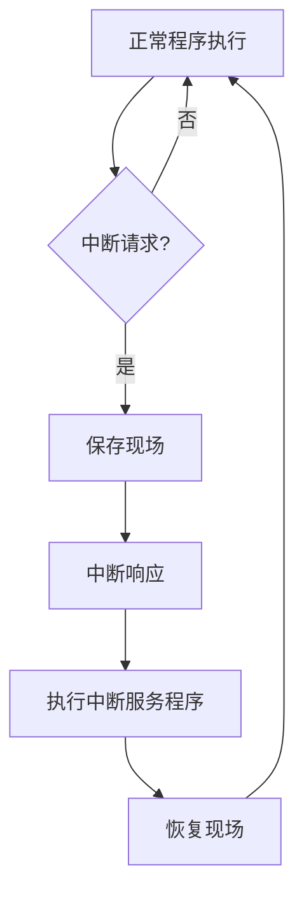

# 4 指令系统架构
 
 
## 目录

1. [指令系统基本概念](#1-指令系统基本概念)
2. [指令格式设计](#2-指令格式设计)
3. [寻址方式](#3-寻址方式)
4. [指令类型与操作](#4-指令类型与操作)
5. [指令执行过程](#5-指令执行过程)
6. [中断系统](#6-中断系统)
7. [CISC与RISC架构](#7-cisc与risc架构)
8. [典型例题](#8-典型例题)

---

## 1. 指令系统基本概念

### 1.1 指令系统概述

> **定义1.1（指令系统）**
> 
> 指令系统是指一台计算机所能执行的全部指令的集合，它描述了计算机内各种操作的实现方法，是计算机硬件和软件的接口。

#### 1.1.1 指令系统的组成要素

**指令系统包含以下四个基本要素**：

1. **指令格式**：指令在内存中的表示方式，包括操作码和地址码的安排
2. **寻址方式**：确定操作数有效地址的方法，影响程序的灵活性和效率
3. **指令类型**：指令按功能进行的分类，如算术运算、逻辑运算、数据传送等
4. **操作类型**：指令能够完成的操作种类，决定了计算机的功能范围

#### 1.1.2 指令系统的设计原则

**指令系统设计应遵循以下原则**：

1. **完备性原则**：指令系统应能完成各种基本运算和操作
2. **有效性原则**：指令执行效率高，编程方便
3. **规整性原则**：指令格式和寻址方式设计规整统一
4. **兼容性原则**：保持良好的向上兼容性

### 1.2 指令的基本组成

> **定义1.2（指令组成）**
> 
> 一条指令通常由操作码字段和地址码字段组成，用于指定要执行的操作和操作数的位置。

**指令的通用格式**：
```
┌─────────┬───────────┬───────────┬───────────┐
│  操作码 │ 第一操作数  │ 第二操作数  │ 第三操作数  │
└─────────┴───────────┴───────────┴───────────┘
```

#### 1.2.1 操作码字段

> **定义1.3（操作码）**
> 
> 操作码指定了指令要执行的操作类型，是指令中最重要的组成部分。

**操作码的设计考虑因素**：

1. **操作码长度**：决定了指令系统的最大容量
2. **操作码分配**：影响指令译码电路的复杂度
3. **扩展技术**：在有限位数内扩展指令数量的方法
4. **译码效率**：操作码编码应便于硬件译码

#### 1.2.2 地址码字段

> **定义1.4（地址码）**
> 
> 地址码指定了指令操作所需的操作数地址或操作数本身。

---

## 2. 指令格式设计

### 2.1 指令格式分类

#### 2.1.1 零地址指令格式

**指令结构：**
```
┌─────────┐
│  操作码  │
└─────────┘
```

**特点**：
- 操作数隐含在栈顶或累加器中
- 指令字最短，但表达能力有限
- 多用于栈式计算机

**应用示例**：
```assembly
PUSH A    ; 将A压入栈
PUSH B    ; 将B压入栈  
ADD       ; 栈顶两元素相加，结果存入栈顶
POP C     ; 将栈顶结果弹出到C
```

#### 一地址指令格式

**指令结构：**
```
┌─────────┬──────────┐
│  操作码  │  地址码   │
└─────────┴──────────┘
```

**特点**：
- 一个操作数由地址码指定，另一个隐含在累加器中
- 指令较短，编程相对简单
- 适用于单累加器结构的CPU

**应用示例**：
```assembly
LOAD A    ; AC ← A
ADD B     ; AC ← AC + B  
STORE C   ; C ← AC
```

#### 二地址指令格式

**指令结构：**
```
┌─────────┬───────────┬───────────┐
│  操作码  │  地址码1   │  地址码2   │
└─────────┴───────────┴───────────┘
```

**特点**：
- 两个地址码分别指定两个操作数
- 结果通常存放在其中一个操作数位置
- 编程方便，指令执行效率高

**应用示例**：
```assembly
MOV A, B   ; A ← B
ADD A, C   ; A ← A + C
```

#### 三地址指令格式

**指令结构：**
```
┌─────────┬───────────┬───────────┬───────────┐
│  操作码  │  地址码1   │  地址码2   │  地址码3   │
└─────────┴───────────┴───────────┴───────────┘
```

**特点**：
- 两个源操作数地址+一个目标操作数地址
- 表达能力最强，但指令字最长
- 适用于高性能处理器

**应用示例**：
```assembly
ADD C, A, B   ; C ← A + B
```

> **例题2.1**：某计算机字长为32位，有32个通用寄存器。现要设计三地址指令格式，若操作码为8位，求每个地址码需要多少位？

**解析**：
```
32个寄存器需要地址位数 = log₂(32) = 5位
三地址指令格式：OP(8位) + A1(5位) + A2(5位) + A3(5位) = 23位
指令字长32位 ≥ 23位，设计可行
```

**答案**：每个地址码需要5位。

### 2.2 扩展操作码技术

> **扩展操作码**是在固定指令字长的前提下，通过变长操作码技术来扩展指令系统容量的方法。

#### 扩展操作码的基本原理

通过牺牲地址码位数来扩展操作码位数，实现指令数量的增加。

**具体位分配 (16位指令字):**

*   **三地址指令 (15条)**: 使用4位操作码。
    ```
      15      12 11      8 7       4 3       0
    ┌──────────┬──────────┬──────────┬──────────┐
    │ OP (4位) │ A1(4位)   │ A2 (4位) │ A3 (4位) │
    └──────────┴──────────┴──────────┴──────────┘
    ```
    *操作码范围：`0000` ~ `1110` (0-14)*

*   **二地址指令 (15条)**: 使用`1111`作为前缀，配合4位扩展操作码。
    ```
      15      12 11      8 7       4 3       0
    ┌──────────┬──────────┬──────────┬──────────┐
    │   1111   │  扩展OP  │ A1 (4位) │ A2 (4位) │
    └──────────┴──────────┴──────────┴──────────┘
    ```
    *注意：为了还能扩展，这里的15条指令操作码范围为 `0000` ~ `1110`。*

*   **一地址指令 (15条)**: 使用`1111 1111`作为前缀，配合4位扩展操作码。
    ```
      15      12 11      8 7       4 3       0
    ┌──────────┬──────────┬──────────┬──────────┐
    │   1111   │   1111   │  扩展OP  │ A1 (4位) │
    └──────────┴──────────┴──────────┴──────────┘
    ```
    *同样，为了扩展，操作码范围为 `0000` ~ `1110`。*

*   **零地址指令 (16条)**: 使用`1111 1111 1111`作为前缀，配合4位扩展操作码。
    ```
      15      12 11      8 7       4 3       0
    ┌──────────┬──────────┬──────────┬──────────┐
    │   1111   │   1111   │   1111   │  扩展OP  │
    └──────────┴──────────┴──────────┴──────────┘
    ```
    *这里不再需要扩展，所以操作码范围可以是 `0000` ~ `1111`。*

#### 扩展操作码的设计原则

1. **不冲突原则**：不同类型指令的操作码不能重复
2. **使用频率优先**：使用频率高的指令采用短操作码
3. **译码简单**：操作码的编码要便于硬件译码

---

## 3. 寻址方式

### 3.1 寻址方式概述

> **定义3.1（寻址方式）**
> 
> 寻址方式是指确定指令中操作数或下一条指令地址的方法，是指令系统设计的重要组成部分。

#### 3.1.1 寻址方式的分类

**按寻址对象分类**：

1. **指令寻址**：确定下一条指令地址的方式
2. **数据寻址**：确定操作数地址的方式

**按寻址复杂度分类**：

1. **直接寻址类**：直接给出操作数或地址
2. **间接寻址类**：通过中间地址找到最终地址
3. **相对寻址类**：相对于某个基准地址的偏移

#### 3.1.2 有效地址的概念

> **定义3.2（有效地址）**
> 
> 有效地址（Effective Address, EA）是指操作数在内存中的实际地址。

**有效地址计算的通用公式**：
$$EA = f(\text{指令中的地址码}, \text{寄存器内容}, \text{内存内容})$$

### 3.2 常见的数据寻址方式

#### 寻址方式总览

| 寻址方式 | 指令结构 | 有效地址计算 | 访存次数 | 速度 | 典型应用 |
|----------|----------|--------------|----------|------|----------|
| 立即寻址 | 操作码 + 立即数 | EA = 立即数 | 0 | 最快 | 常数加载 |
| 直接寻址 | 操作码 + 内存地址 | EA = 地址码 | 1 | 快 | 全局变量 |
| 间接寻址 | 操作码 + 指针地址 | EA = M[地址码] | 2 | 慢 | 指针操作 |
| 寄存器寻址 | 操作码 + 寄存器号 | EA = R[寄存器号] | 0 | 最快 | 临时变量 |
| 寄存器间接 | 操作码 + 寄存器号 | EA = M[R[寄存器号]] | 1 | 较快 | 数组访问 |
| 相对寻址 | 操作码 + 偏移量 | EA = PC + 偏移量 | 1 | 快 | 分支跳转 |
| 基址寻址 | 操作码 + 基址寄存器 + 偏移 | EA = BR + 偏移量 | 1 | 较快 | 程序重定位 |
| 变址寻址 | 操作码 + 基地址 + 变址寄存器 | EA = 基地址 + IX | 1 | 较快 | 数组元素 |

#### 1. 立即寻址（Immediate Addressing）

**指令结构：**
```
┌─────────┬──────────┐
│  操作码 │  立即数  │
└─────────┴──────────┘
```

**特点**：
- 操作数本身就在指令中
- 访问速度最快，无需访问内存
- 操作数不能修改

**地址计算**：$EA = \text{指令中的立即数}$ 

**应用示例**：
```assembly
MOV AX, #100    ; AX ← 100（立即数100）
ADD BX, #5      ; BX ← BX + 5
```

**优缺点分析**：

| 优点 | 缺点 |
|------|------|
| 速度快，无额外内存访问 | 操作数范围受指令字长限制 |
| 指令执行简单 | 操作数不能动态修改 |
| 适合常数操作 | 占用指令字空间 |

#### 2. 直接寻址（Direct Addressing）

**指令结构：**
```
┌─────────┬────────────┐
│  操作码 │  内存地址  │
└─────────┴────────────┘
```

**特点**：
- 指令中直接给出了操作数的内存地址
- 需要一次内存访问获取操作数
- 寻址范围受地址码位数限制

**地址计算**：$EA = \text{地址码}$ 

**应用示例**：
```assembly
MOV AX, [1000H]   ; AX ← M[1000H]
ADD BX, [2000H]   ; BX ← BX + M[2000H]
```

#### 3. 间接寻址（Indirect Addressing）

**指令结构：**
```
┌─────────┬────────────┐
│  操作码 │  指针地址  │
└─────────┴────────────┘
```

**特点**：
- 指令中的地址码不是操作数的地址，而是存放操作数地址的内存单元的地址
- 需要两次内存访问
- 可以扩大寻址范围

**地址计算**：$EA = M[\text{地址码}]$ 

**应用示例**：
```assembly
MOV AX, @[1000H]   ; AX ← M[M[1000H]]
```

**间接寻址的执行过程**：

| 步骤 | 操作 | 说明 |
|------|------|------|
| 1 | 读取指针地址 | 从指令中获取指针地址 |
| 2 | 第一次访存 | 读取指针地址处的内容 |
| 3 | 第二次访存 | 根据指针内容读取实际操作数 |

#### 4. 寄存器寻址（Register Addressing）

**指令结构：**
```
┌─────────┬────────────┐
│  操作码 │  寄存器号  │
└─────────┴────────────┘
```

**特点**：
- 操作数存放在CPU内部的寄存器中
- 访问速度最快
- 寄存器数量有限

**地址计算**：$EA = R[\text{寄存器号}]$ 

**应用示例**：
```assembly
MOV AX, BX    ; AX ← BX
ADD AX, CX    ; AX ← AX + CX
```

#### 5. 寄存器间接寻址（Register Indirect Addressing）

**指令结构：**
```
┌─────────┬────────────┐
│  操作码 │  寄存器号  │
└─────────┴────────────┘
```

**特点**：
- 操作数的地址存放在指定的寄存器中
- 需要一次内存访问
- 便于实现数组和指针操作

**地址计算**：$EA = R[寄存器号]$ 

**应用示例**：
```assembly
MOV AX, [BX]    ; AX ← M[BX]
ADD CX, [DI]    ; CX ← CX + M[DI]
```

#### 6. 相对寻址（Relative Addressing）

**指令结构：**
```
┌─────────┬──────────┐
│  操作码 │  偏移量  │
└─────────┴──────────┘
```

**特点**：
- 操作数的地址是程序计数器PC的内容与指令中的偏移量之和
- 主要用于程序控制指令
- 支持位置无关代码

**地址计算**：$EA = PC + \text{偏移量}$ 

**应用示例**：
```assembly
JMP +10        ; PC ← PC + 10
BEQ LOOP       ; 如果相等，跳转到LOOP
```

#### 7. 基址寻址（Base Addressing）

**指令结构：**
```
┌─────────┬───────────┬──────────┐
│  操作码 │  基址R    │  偏移量  │
└─────────┴───────────┴──────────┘
```

**特点**：
- 操作数的地址是基址寄存器的内容与指令中的偏移量之和
- 便于实现程序的重定位
- 适用于多道程序系统

**地址计算**：$EA = BR + \text{偏移量}$ 

**应用示例**：
```assembly
MOV AX, 100[BX]   ; AX ← M[BX + 100]
```

#### 8. 变址寻址（Indexed Addressing）

**指令结构：**
```
┌─────────┬───────────┬──────────┐
│  操作码 │  基地址   │  变址R   │
└─────────┴───────────┴──────────┘
```

**特点**：
- 操作数的地址是指令中的基地址与变址寄存器的内容之和
- 主要用于数组元素的访问
- 变址寄存器可以动态修改

**地址计算**：$EA = \text{基地址} + IX$ 

**应用示例**：
```assembly
MOV AX, ARRAY[SI]   ; AX ← M[ARRAY + SI]
```

---

## ⚙️ 4.4 指令类型与操作

### 4.4.1 数据传送指令

#### 基本数据传送指令

**1. 加载指令（LOAD）**
```assembly
LOAD R1, [ADDR]    ; R1 ← M[ADDR]
```

**2. 存储指令（STORE）**  
```assembly
STORE [ADDR], R1   ; M[ADDR] ← R1
```

**3. 移动指令（MOVE）**
```assembly
MOVE R1, R2        ; R1 ← R2
```

#### 堆栈操作指令

**1. 压栈指令（PUSH）**
```assembly
PUSH R1           ; SP ← SP - 1; M[SP] ← R1
```

**2. 弹栈指令（POP）**
```assembly
POP R1            ; R1 ← M[SP]; SP ← SP + 1
```

#### 数据交换指令

**1. 交换指令（EXCHANGE）**
```assembly
XCHG R1, R2       ; R1 ↔ R2
```

### 4.4.2 算术运算指令

#### 基本算术指令

**1. 加法指令**
```assembly
ADD R1, R2        ; R1 ← R1 + R2
ADDI R1, #100     ; R1 ← R1 + 100（立即数加法）
```

**2. 减法指令**
```assembly
SUB R1, R2        ; R1 ← R1 - R2
SUBI R1, #50      ; R1 ← R1 - 50
```

**3. 乘法指令**
```assembly
MUL R1, R2        ; R1 ← R1 × R2
```

**4. 除法指令**
```assembly
DIV R1, R2        ; R1 ← R1 ÷ R2
```

#### 高级算术指令

**1. 自增/自减指令**
```assembly
INC R1            ; R1 ← R1 + 1
DEC R1            ; R1 ← R1 - 1
```

**2. 取负指令**
```assembly
NEG R1            ; R1 ← -R1
```

### 4.4.3 逻辑运算指令

#### 基本逻辑指令

**1. 逻辑与（AND）**
```assembly
AND R1, R2        ; R1 ← R1 & R2
```

**2. 逻辑或（OR）**
```assembly
OR R1, R2         ; R1 ← R1 | R2
```

**3. 逻辑异或（XOR）**
```assembly
XOR R1, R2        ; R1 ← R1 ⊕ R2
```

**4. 逻辑非（NOT）**
```assembly
NOT R1            ; R1 ← ~R1
```

#### 移位指令

**1. 逻辑左移**
```assembly
SHL R1, #n        ; R1 ← R1 << n
```

**2. 逻辑右移**
```assembly
SHR R1, #n        ; R1 ← R1 >> n
```

**3. 算术右移**
```assembly
SAR R1, #n        ; 算术右移（保持符号位）
```

**4. 循环移位**
```assembly
ROL R1, #n        ; 循环左移
ROR R1, #n        ; 循环右移
```

### 4.4.4 程序控制指令

#### 无条件转移指令

**1. 无条件跳转**
```assembly
JMP LABEL         ; PC ← LABEL
```

**2. 子程序调用**
```assembly
CALL SUBROUTINE   ; 保存返回地址，跳转到子程序
```

**3. 子程序返回**
```assembly
RET               ; 恢复返回地址，返回调用点
```

#### 条件转移指令

**1. 基于标志位的条件跳转**
```assembly
JZ LABEL          ; 如果零标志位为1，跳转
JNZ LABEL         ; 如果零标志位为0，跳转
JC LABEL          ; 如果进位标志位为1，跳转
JNC LABEL         ; 如果进位标志位为0，跳转
```

**2. 比较跳转指令**
```assembly
CMP R1, R2        ; 比较R1和R2（设置标志位）
JE LABEL          ; 如果相等，跳转
JNE LABEL         ; 如果不相等，跳转
JL LABEL          ; 如果小于，跳转
JG LABEL          ; 如果大于，跳转
```

---

## 5. 指令执行过程

### 5.1 指令执行的基本周期

> **定义5.1（指令周期）**
> 
> 指令周期是指CPU执行一条指令所需的全部时间，包括取指、译码、执行和写回四个阶段。

#### 5.1.1 指令周期的四个阶段

**指令执行流程图**：
```
┌─────────┐    ┌─────────┐    ┌─────────┐    ┌─────────┐
│ 取指阶段 │───▶│ 译码阶段 │───▶│ 执行阶段 │───▶│ 写回阶段 │
│  (IF)   │    │  (ID)   │    │  (EX)   │    │  (WB)   │
└─────────┘    └─────────┘    └─────────┘    └─────────┘
     ▲                                                  │
     └──────────────────────────────────────────────────┘
```

#### 1. 取指阶段（Instruction Fetch, IF）

**主要操作**：
1. 将PC内容送到地址总线
2. 向内存发出读控制信号
3. 从数据总线读取指令
4. 将指令存入指令寄存器IR
5. PC指向下一条指令

**时序图**：
```
时钟周期： 1    2    3    4
PC → MAR   ■■■■
MAR → 内存        ■■■■
内存 → MDR             ■■■■
MDR → IR                   ■■■■
PC + 1                     ■■■■
```

#### 2. 译码阶段（Instruction Decode, ID）

**主要操作**：
1. 分析指令的操作码部分
2. 确定指令类型和所需的控制信号
3. 解析寻址方式
4. 计算操作数的有效地址
5. 准备ALU控制信号

**译码器的功能**：
- **操作码译码**：确定指令类型
- **寻址方式译码**：确定操作数获取方式
- **控制信号生成**：产生各部件的控制信号

#### 3. 执行阶段（Execute, EX）

**主要操作**：
1. 获取操作数（从寄存器或内存）
2. 执行指令规定的操作
3. 产生运算结果
4. 设置相应的标志位

**不同指令类型的执行过程**：

**算术指令执行**：
```
1. 读取源操作数 → ALU
2. 执行算术运算
3. 设置标志位（零标志、进位标志等）
4. 准备结果写回
```

**逻辑指令执行**：
```
1. 读取源操作数 → ALU
2. 执行逻辑运算
3. 设置标志位
4. 准备结果写回
```

**跳转指令执行**：
```
1. 计算跳转目标地址
2. 判断跳转条件
3. 更新PC值
```

#### 4. 写回阶段（Write Back, WB）

**主要操作**：
1. 将运算结果写回目标寄存器或内存
2. 更新相关状态信息
3. 准备执行下一条指令

### 4.5.2 指令执行的时序分析

#### 机器周期与时钟周期

> **机器周期**是指CPU访问一次内存所需的时间。
> **时钟周期**是CPU的基本时间单位。

**关系**：通常一个机器周期包含若干个时钟周期。

#### 指令执行时间的计算

**基本公式**：
$$T_{指令} = T_{取指} + T_{译码} + T_{执行} + T_{写回}$$

**影响因素**：
1. **指令复杂度**：复杂指令需要更多周期
2. **寻址方式**：间接寻址需要额外的内存访问
3. **操作数位置**：寄存器操作比内存操作快
4. **流水线效应**：流水线可以提高整体效率

### 4.5.3 中断处理过程

#### 中断的基本概念

> **中断**是指CPU在执行程序过程中，遇到紧急事件时暂停当前程序的执行，转去处理该事件的机制。

#### 中断处理的基本流程



**详细步骤**：

1. **中断请求**：外部设备或内部事件产生中断信号
2. **中断响应**：CPU检测到中断请求并决定是否响应
3. **保存现场**：
   ```
   保存内容：PC、PSW、相关寄存器
   保存位置：堆栈或特定内存区域
   ```
4. **中断服务**：执行相应的中断服务程序
5. **恢复现场**：恢复被保存的CPU状态
6. **中断返回**：继续执行被中断的程序

---

## 7. CISC与RISC架构

### 7.1 CISC架构

> **定义7.1（CISC）**
> 
> CISC（Complex Instruction Set Computer，复杂指令集计算机）采用复杂的指令集，指令功能强大，寻址方式多样。

#### CISC的主要特征

**1. 指令系统特点**：
- 指令数量多（通常数百条）
- 指令格式复杂，长度不等
- 寻址方式丰富（10种以上）
- 指令功能强大，能完成复杂操作

**2. 硬件特点**：
- 采用微程序控制器
- 指令译码复杂
- 执行时间不等
- 大多数指令需要多个时钟周期

**3. 编程特点**：
- 程序代码密度高
- 编程灵活性大
- 有利于减少内存访问
- 编译器设计相对简单

#### CISC的典型代表：x86架构

**指令示例**：
```assembly
; 字符串复制指令
REP MOVSB          ; 重复执行字节传送，直到CX=0

; 复杂寻址
MOV AX, [BX+SI+100] ; AX ← M[BX+SI+100]

; 浮点运算
FADD ST(1), ST(0)  ; ST(1) ← ST(1) + ST(0)
```

### 4.6.2 RISC（精简指令集计算机）

> **RISC（Reduced Instruction Set Computer）**采用精简的指令集，指令简单规整，便于流水线实现。

#### RISC的主要特征

**1. 指令系统特点**：
- 指令数量少（通常50-100条）
- 指令格式规整，长度固定
- 寻址方式简单（2-3种）
- 指令功能单一，操作简单

**2. 硬件特点**：
- 采用硬布线控制器
- 指令译码简单
- 大多数指令在一个时钟周期内完成
- 便于流水线实现

**3. 编程特点**：
- 程序代码相对较长
- 需要更多指令完成复杂功能
- 编译器设计复杂
- 有利于优化编译

#### RISC的典型代表：ARM、MIPS架构

**MIPS指令示例**：
```assembly
; 所有指令长度为32位
ADD$t0,$t1,$t2   ;$t0 ←$t1 +$t2
LW $t0, 100($sp)   ;$t0 ← M[$sp + 100]
SW $t0, 100($sp)   ; M[$sp + 100] ←$t0
BEQ$t0,$t1, LOOP  ; if($t0 ==$t1) goto LOOP
```

### 4.6.3 CISC与RISC的比较

#### 性能比较

| 特征         | CISC             | RISC            │ │--------------|------------------|-----------------│ │ **指令数量** | 多（数百条）     | 少（50-100条）  │ │ **指令长度** | 变长             | 定长            │ │ **寻址方式** | 多样（10+种）    | 简单（2-3种）   │ │ **执行周期** | 不等（1-数十个） | 固定（通常1个） │ │ **控制器**   | 微程序控制       | 硬布线控制      │ │ **流水线**   | 难以实现         | 容易实现        │ │ **编译器**   | 相对简单         | 复杂优化        │ │ **代码密度** | 高               | 相对较低        |

#### 应用场景比较

**CISC适用场景**：
- 通用计算机系统
- 兼容性要求高的环境
- 内存资源受限的场合
- 编程复杂度要求较低

**RISC适用场景**：
- 嵌入式系统
- 高性能计算
- 低功耗要求
- 实时系统

#### 发展趋势

现代处理器设计呈现**融合趋势**：

1. **CISC的RISC化**：
   - x86处理器内部采用RISC核心
   - 复杂指令分解为简单微操作
   - 实现高效的流水线执行

2. **RISC的功能增强**：
   - 增加一些复杂指令
   - 支持更多寻址方式
   - 提供更丰富的指令集扩展

---

## 8. 典型例题

### 8.1 指令格式设计题

> **例题8.1**：设计一个16位指令字的扩展操作码方案，要求：
> - 15条三地址指令，每个地址码4位
> - 15条二地址指令，每个地址码4位  
> - 16条一地址指令，地址码4位
> - 16条零地址指令

**解析**：

采用扩展操作码技术：

**(1) 三地址指令（15条）**：
```
格式：OP(4位) + A1(4位) + A2(4位) + A3(4位)
操作码：0000 ~ 1110 （15种编码）
```

**(2) 二地址指令（15条）**：
```
格式：1111 + EOP1(4位) + A1(4位) + A2(4位)
扩展操作码：0000 ~ 1110 （15种编码）
```

**(3) 一地址指令（16条）**：
```
格式：1111 + 1111 + EOP2(4位) + A1(4位)
扩展操作码：0000 ~ 1111 （16种编码）
```

**(4) 零地址指令（16条）**：
```
格式：1111 + 1111 + 1111 + EOP3(4位)
扩展操作码：0000 ~ 1111 （16种编码）
```

**答案**：采用4级扩展操作码，可以满足所有要求。

### 8.2 寻址方式计算题

> **例题8.2**：某计算机有以下寻址方式，各寄存器和内存内容如下：
> - R1 = 1000H, R2 = 2000H
> - M[1000H] = 3000H, M[2000H] = 1234H, M[3000H] = 5678H
> 
> 求下列指令中操作数的值：
> 1. MOV AX, #1234H
> 2. MOV AX, 2000H  
> 3. MOV AX, @1000H
> 4. MOV AX, 500H(R1)

**解析**：

**(1) 立即寻址**：
```
MOV AX, #1234H
操作数 = 1234H（立即数）
```

**(2) 直接寻址**：
```
MOV AX, 2000H
EA = 2000H
操作数 = M[2000H] = 1234H
```

**(3) 间接寻址**：
```
MOV AX, @1000H
EA = M[1000H] = 3000H
操作数 = M[3000H] = 5678H
```

**(4) 基址寻址**：
```
MOV AX, 500H(R1)
EA = R1 + 500H = 1000H + 500H = 1500H
操作数 = M[1500H]（值未知）
```

**答案**：
1. 1234H
2. 1234H  
3. 5678H
4. M[1500H]

### 8.3 指令执行分析题

> **例题8.3**：某CPU主频为1GHz，执行一条指令的各阶段时间如下：
> - 取指：2个时钟周期
> - 译码：1个时钟周期
> - 执行：3个时钟周期
> - 写回：1个时钟周期
> 
> 求该指令的执行时间和CPI。

**解析**：

**(1) 指令执行时间计算**：
```
总时钟周期数 = 2 + 1 + 3 + 1 = 7个周期
时钟周期时间 = 1/1GHz = 1ns
指令执行时间 = 7 × 1ns = 7ns
```

**(2) CPI计算**：
```
CPI（Cycles Per Instruction）= 7个周期/指令
```

**答案**：指令执行时间为7ns，CPI为7。

### 8.4 CISC与RISC对比题

> **例题8.4**：比较CISC和RISC架构的特点，并说明各自的适用场景。

**解析**：

**CISC vs RISC特点对比**：

| 特征 | CISC | RISC |
|------|------|------|
| 指令数量 | 多（几百条） | 少（几十条） |
| 指令复杂度 | 复杂，功能强大 | 简单，功能单一 |
| 指令长度 | 变长 | 定长 |
| 寻址方式 | 丰富（10+种） | 简单（2-3种） |
| 执行周期 | 不等（1-几十个） | 固定（通常1个） |
| 控制方式 | 微程序控制 | 硬布线控制 |
| 流水线 | 难以实现 | 容易实现 |
| 编译复杂度 | 相对简单 | 复杂优化 |

**适用场景**：

**CISC适用于**：
- 通用计算机系统
- 兼容性要求高的环境
- 软件开发成本敏感的场合

**RISC适用于**：
- 嵌入式系统
- 高性能计算
- 低功耗应用
- 实时系统

**答案**：CISC注重指令功能的完备性，RISC注重执行效率的最优化。
 