# 6 总线系统

## 导航目录

1. [总线基本概念与分类](#1-总线基本概念与分类)
2. [总线结构设计原理](#2-总线结构设计原理)
3. [总线仲裁机制设计](#3-总线仲裁机制设计)
4. [总线操作时序控制](#4-总线操作时序控制)
5. [总线性能分析](#5-总线性能分析)
6. [典型总线标准](#6-典型总线标准)
7. [典型例题](#7-典型例题)
 
## 1. 总线基本概念与分类

### 1.1 总线定义与功能特征

> **总线（Bus）** 是连接计算机系统中各个部件的一组公共信号线，用于在CPU、内存、I/O设备之间传输信息的共享通信介质。

#### 1.1.1 总线的基本特征

**共享性特征：**
- 多个设备共享同一组信号线
- 采用分时复用的工作方式  
- 需要仲裁机制协调访问冲突
- 同一时刻只能有一个主设备控制总线

**标准化特征：**
- 统一的电气特性规范
- 标准的信号时序协议
- 规范的机械接口标准
- 通用的软件接口规范

**可扩展性特征：**
- 支持设备的灵活增减
- 提供标准化的扩展接口
- 向下兼容早期标准
- 支持未来技术发展需求

#### 1.1.2 总线系统的基本功能

```
总线功能体系
├── 信息传输功能
│   ├── 数据信息传输
│   │   ├── 二进制数据传输
│   │   ├── 并行/串行传输模式
│   │   └── 数据完整性保障
│   ├── 地址信息传输  
│   │   ├── 存储器地址传输
│   │   ├── I/O设备地址传输
│   │   └── 地址译码与选择
│   └── 控制信息传输
│       ├── 操作控制信号
│       ├── 时序控制信号
│       └── 状态反馈信号
├── 资源管理功能
│   ├── 总线访问控制
│   ├── 冲突仲裁管理
│   ├── 设备选择控制
│   └── 优先级管理
├── 协议支持功能
│   ├── 传输协议实现
│   ├── 错误检测纠正
│   ├── 流量控制管理
│   └── 握手协议支持
└── 扩展接口功能
    ├── 设备接入支持
    ├── 即插即用功能
    ├── 热插拔支持
    └── 标准接口提供
```

### 1.2 总线分类体系分析

#### 1.2.1 按功能特性分类

**数据总线（Data Bus）分析：**

| 特性维度 | 技术参数 | 设计考虑 |
|----------|----------|----------|
| **传输方向** | 双向传输 | 需要三态门控制 |
| **位宽规格** | 8/16/32/64/128位 | 决定数据传输能力 |
| **传输模式** | 并行传输 | 提高传输速度 |
| **负载能力** | 驱动多个设备 | 影响信号完整性 |

**地址总线（Address Bus）分析：**$\text{寻址空间} = 2^n \text{字节}$

其中 $n$ 为地址总线位数。

| 地址位数 | 寻址空间 | 典型应用 |
|----------|----------|----------|
| 16位 | 64KB | 早期微控制器 |
| 20位 | 1MB | 8086处理器 |
| 32位 | 4GB | 32位处理器 |
| 64位 | 16EB | 64位处理器 |

**控制总线（Control Bus）信号分析：**

```
控制信号分类
├── 操作控制信号
│   ├── READ（读信号）
│   ├── WRITE（写信号）
│   ├── MREQ（存储器请求）
│   └── IORQ（I/O请求）
├── 时序控制信号
│   ├── CLK（时钟信号）
│   ├── WAIT（等待信号）
│   ├── READY（就绪信号）
│   └── ACK（确认信号）
├── 中断控制信号
│   ├── INT（中断请求）
│   ├── INTA（中断响应）
│   ├── NMI（非屏蔽中断）
│   └── RESET（复位信号）
└── 总线管理信号
    ├── HOLD（总线保持请求）
    ├── HLDA（总线保持响应）
    ├── LOCK（总线锁定）
    └── ERROR（错误信号）
```

#### 1.2.2 按层次结构分类

**总线层次结构分析：**

```
计算机系统总线层次架构
├── 片内总线（On-Chip Bus）
│   ├── 处理器内部总线
│   │   ├── 寄存器传输总线
│   │   ├── 功能单元互连总线
│   │   └── 高速缓存总线
│   ├── 技术特征
│   │   ├── 传输速度：GHz级别
│   │   ├── 传输延迟：< 1ns
│   │   └── 带宽容量：> 100GB/s
│   └── 设计考虑
│       ├── 功耗控制
│       ├── 时序约束
│       └── 物理布局
├── 系统总线（System Bus）
│   ├── 主要组成部件
│   │   ├── CPU接口总线
│   │   ├── 内存控制器总线
│   │   └── 芯片组互连总线
│   ├── 技术特征
│   │   ├── 传输速度：MHz-GHz级别
│   │   ├── 传输延迟：1-10ns
│   │   └── 带宽容量：1-50GB/s
│   └── 典型标准
│       ├── FSB（前端总线）
│       ├── HyperTransport
│       └── QPI/UPI
└── I/O总线（Input/Output Bus）
    ├── 高速I/O总线
    │   ├── PCIe（PCI Express）
    │   ├── SATA（Serial ATA）
    │   └── USB 3.0/3.1
    ├── 标准I/O总线
    │   ├── PCI（Peripheral Component Interconnect）
    │   ├── USB 2.0
    │   └── IEEE 1394
    ├── 低速I/O总线
    │   ├── SPI（Serial Peripheral Interface）
    │   ├── I2C（Inter-Integrated Circuit）
    │   └── UART（Universal Asynchronous Receiver/Transmitter）
    └── 技术特征对比
        ├── 传输速度：kbps-Gbps
        ├── 设备支持：1-127个设备
        └── 应用场景：特定功能设备
```

#### 1.2.3 按时序控制分类

**同步总线特征分析：**

| 技术特性 | 实现方式 | 优势 | 局限性 |
|----------|----------|------|--------|
| **时钟控制** | 统一时钟信号 | 时序关系明确 | 速度受限于最慢设备 |
| **信号时序** | 固定时序关系 | 设计简单 | 灵活性差 |
| **设备适应** | 同步工作模式 | 控制逻辑简单 | 不适应速度差异大的设备 |
| **应用场景** | 同质化系统 | 可靠性高 | 扩展性受限 |

**异步总线特征分析：**

| 技术特性 | 实现方式 | 优势 | 局限性 |
|----------|----------|------|--------|
| **握手控制** | 请求-应答机制 | 适应不同速度设备 | 控制复杂 |
| **时序灵活** | 动态时序调整 | 系统扩展性好 | 设计复杂度高 |
| **设备兼容** | 自适应工作模式 | 兼容性强 | 需要额外控制线 |
| **性能特点** | 按需传输 | 平均性能高 | 最坏情况延迟大 |

### 1.3 总线技术发展历程

#### 1.3.1 总线技术演进时间轴

| 时代 | 代表技术 | 主要特征 | 典型应用 |
|------|----------|----------|----------|
| **第一代** | ISA总线 | 8/16位并行总线 | 早期PC扩展 |
| **第二代** | PCI总线 | 32/64位并行总线 | 主流PC扩展 |
| **第三代** | PCIe总线 | 串行点对点总线 | 现代高性能计算 |
| **第四代** | NVLink/CXL | 高速缓存一致性 | AI/HPC应用 |

#### 1.3.2 现代总线技术发展趋势

```
总线技术发展方向
├── 串行化趋势
│   ├── 并行转串行
│   ├── 点对点连接
│   └── 差分信号传输
├── 高速化发展
│   ├── 传输速率提升
│   ├── 低延迟设计
│   └── 高频时钟技术
├── 智能化特征
│   ├── 自适应调节
│   ├── 错误自动恢复
│   └── 功耗动态管理
└── 标准化统一
    ├── 接口标准统一
    ├── 协议栈标准化
    └── 生态系统建设
```

---

## 2. 总线结构设计原理

### 2.1 单总线结构分析

#### 2.1.1 单总线结构基本原理

**结构组成图：**

```
单总线系统架构：
                系统总线
────────────────────────────────────────────────
│   CPU   │   内存     │  I/O设备1   │  I/O设备2  │     
```

**工作机制分析：**
- **独占访问**：同一时刻只有一个设备可以使用总线
- **分时复用**：各设备按时间片轮流使用总线资源
- **统一仲裁**：需要仲裁机制解决总线访问冲突
- **共享带宽**：所有设备共享总线的总带宽

#### 2.1.2 单总线结构性能分析

**优势特征：**
- **成本效益高**：硬件成本低，实现简单
- **扩展性好**：添加新设备相对容易
- **兼容性强**：统一的接口标准
- **控制简单**：仲裁逻辑相对简单

**性能限制：**
- **带宽瓶颈**：所有设备共享有限带宽
- **延迟问题**：设备间通信需要经过总线仲裁
- **扩展限制**：连接设备数量受到物理限制
- **可靠性风险**：单点故障影响整个系统

#### 2.1.3 单总线系统性能计算

**传输效率分析模型：**

设CPU执行一条指令需要进行 $n$ 次总线访问，每次总线传输耗时为 $T_{bus}$，则：

$$T_{\text{指令}} = n \times T_{bus} + T_{\text{CPU处理}}$$

**性能瓶颈分析：**

当总线传输时间远大于CPU处理时间时：
$$T_{\text{指令}} \approx n \times T_{bus}$$

此时总线成为系统性能瓶颈。

**典型例题解析：**

> **例题2.1**：某单总线计算机系统参数如下：
> - 总线时钟频率：100MHz  
> - 每次总线传输需要：4个时钟周期
> - 每条指令平均需要：2次内存访问
> 
> 计算：
> 1. 总线传输周期时间
> 2. 每条指令的总线占用时间  
> 3. CPU执行1000条指令的理论最小时间

**详细解答过程：**

1. **总线传输周期计算：**
   $$T_{bus} = \frac{4}{100 \times 10^6} = 40\text{ns}$$

2. **每条指令总线时间：**
   $$T_{指令总线} = 2 \times 40\text{ns} = 80\text{ns}$$

3. **1000条指令执行时间：**
   $$T_{总} = 1000 \times 80\text{ns} = 80\mu\text{s}$$

**性能分析结论：**
- 总线利用率：假设为100%（理想情况）
- 实际系统中需考虑仲裁开销、空闲时间等因素
- 单总线结构的性能主要受限于总线带宽

### 2.2 多总线结构设计

#### 2.2.1 双总线系统架构

**双总线结构组成：**

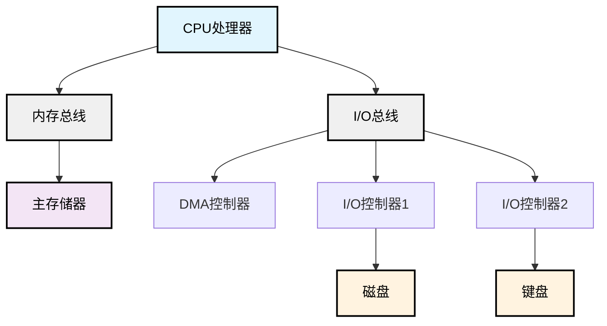
```mermaid
graph TD
    CPU[CPU处理器]
    MemBus[内存总线]
    IOBus[I/O总线]
    Memory[主存储器]
    DMA[DMA控制器]
    IOCtrl1[I/O控制器1]
    IOCtrl2[I/O控制器2]
    IODevice1[磁盘]
    IODevice2[键盘]
    
    CPU --> MemBus
    CPU --> IOBus
    MemBus --> Memory
    IOBus --> DMA
    IOBus --> IOCtrl1
    IOBus --> IOCtrl2
    IOCtrl1 --> IODevice1
    IOCtrl2 --> IODevice2
    
    style CPU fill:#e1f5fe,stroke:#000,stroke-width:2px,color:#000
    style Memory fill:#f3e5f5,stroke:#000,stroke-width:2px,color:#000
    style IODevice1 fill:#fff3e0,stroke:#000,stroke-width:2px,color:#000
    style IODevice2 fill:#fff3e0,stroke:#000,stroke-width:2px,color:#000
    style MemBus fill:#f0f0f0,stroke:#000,stroke-width:2px,color:#000
    style IOBus fill:#f0f0f0,stroke:#000,stroke-width:2px,color:#000
```

**设计优势分析：**

| 技术特征 | 单总线 | 双总线 | 性能提升 |
|----------|--------|--------|----------|
| **并发性** | 串行访问 | 内存/I/O并行 | 2倍理论加速 |
| **带宽利用** | 共享带宽 | 分离带宽 | 总带宽翻倍 |
| **冲突概率** | 高冲突 | 低冲突 | 显著降低 |
| **设计复杂度** | 简单 | 中等 | 可接受增加 |

#### 2.2.2 三总线系统架构

**层次化总线结构：**

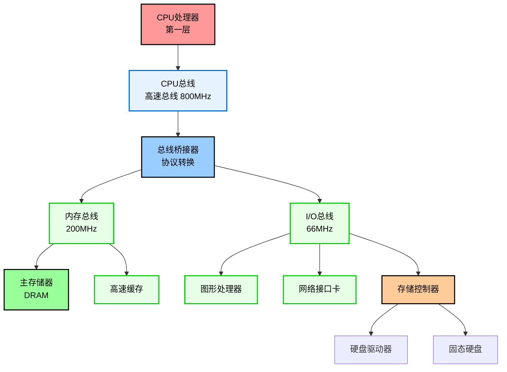
```mermaid
graph TD
    CPU[CPU处理器<br/>第一层]
    CPUBus[CPU总线<br/>高速总线 800MHz]
    Bridge[总线桥接器<br/>协议转换]
    MemBus[内存总线<br/>200MHz]
    IOBus[I/O总线<br/>66MHz]
    Memory[主存储器<br/>DRAM]
    Cache[高速缓存]
    GPU[图形处理器]
    NIC[网络接口卡]
    Storage[存储控制器]
    HDD[硬盘驱动器]
    SSD[固态硬盘]
    
    CPU --> CPUBus
    CPUBus --> Bridge
    Bridge --> MemBus
    Bridge --> IOBus
    MemBus --> Memory
    MemBus --> Cache
    IOBus --> GPU
    IOBus --> NIC
    IOBus --> Storage
    Storage --> HDD
    Storage --> SSD
    
    style CPU fill:#ff9999,stroke:#000,stroke-width:2px,color:#000
    style Bridge fill:#99ccff,stroke:#000,stroke-width:2px,color:#000
    style Memory fill:#99ff99,stroke:#000,stroke-width:2px,color:#000
    style Storage fill:#ffcc99,stroke:#000,stroke-width:2px,color:#000
    
    classDef layer1 fill:#ffe6e6,stroke:#ff0000,stroke-width:2px,color:#000
    classDef layer2 fill:#e6f3ff,stroke:#0066cc,stroke-width:2px,color:#000
    classDef layer3 fill:#e6ffe6,stroke:#00cc00,stroke-width:2px,color:#000
    
    class CPU layer1
    class CPUBus,Bridge layer2
    class MemBus,IOBus,Memory,Cache,GPU,NIC,Storage layer3
```

**三总线结构技术优势：**

1. **性能隔离**：不同性能需求的设备分离
2. **带宽优化**：各层总线可独立优化带宽
3. **扩展灵活**：易于添加新的总线层次
4. **故障隔离**：单个总线故障不影响整体系统

---

## 3. 总线仲裁机制设计

### 3.1 总线仲裁基本原理

#### 3.1.1 总线冲突问题分析

**总线冲突产生场景：**

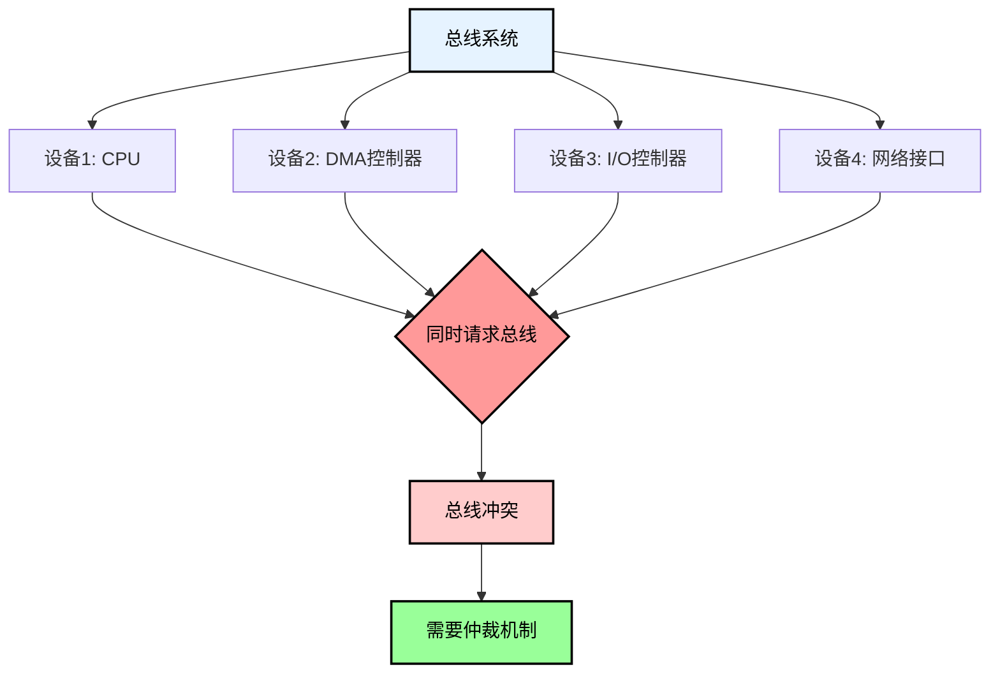
```mermaid
graph TD
    A[总线系统] --> B[设备1: CPU]
    A --> C[设备2: DMA控制器]
    A --> D[设备3: I/O控制器]
    A --> E[设备4: 网络接口]
    
    B --> F{同时请求总线}
    C --> F
    D --> F
    E --> F
    
    F --> G[总线冲突]
    G --> H[需要仲裁机制]
    
    style F fill:#ff9999,stroke:#000,stroke-width:2px,color:#000
    style G fill:#ffcccc,stroke:#000,stroke-width:2px,color:#000
    style H fill:#99ff99,stroke:#000,stroke-width:2px,color:#000
    style A fill:#e6f3ff,stroke:#000,stroke-width:2px,color:#000
```

**冲突类型分析：**

| 冲突类型 | 产生原因 | 影响程度 | 解决方案 |
|----------|----------|----------|----------|
| **同时访问冲突** | 多设备同时请求 | 数据损坏 | 互斥访问控制 |
| **优先级冲突** | 紧急任务被阻塞 | 性能下降 | 优先级仲裁 |
| **饥饿现象** | 低优先级长期等待 | 系统不公平 | 公平性算法 |
| **死锁问题** | 循环等待资源 | 系统停滞 | 死锁检测与恢复 |

#### 3.1.2 总线仲裁工作流程

**完整仲裁流程图：**

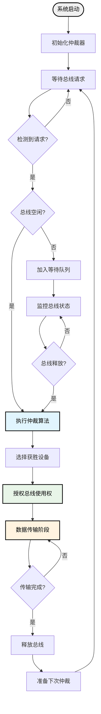
```mermaid
flowchart TD
    Start([系统启动]) --> Init[初始化仲裁器]
    Init --> Wait[等待总线请求]
    Wait --> Detect{检测到请求?}
    
    Detect -->|否| Wait
    Detect -->|是| Check{总线空闲?}
    
    Check -->|否| Queue[加入等待队列]
    Check -->|是| Arbitrate[执行仲裁算法]
    
    Queue --> Monitor[监控总线状态]
    Monitor --> Released{总线释放?}
    Released -->|否| Monitor
    Released -->|是| Arbitrate
    
    Arbitrate --> Select[选择获胜设备]
    Select --> Grant[授权总线使用权]
    Grant --> Transfer[数据传输阶段]
    Transfer --> Complete{传输完成?}
    
    Complete -->|否| Transfer
    Complete -->|是| Release[释放总线]
    Release --> NextArb[准备下次仲裁]
    NextArb --> Wait
    
    style Arbitrate fill:#e1f5fe,stroke:#000,stroke-width:2px,color:#000
    style Grant fill:#e8f5e8,stroke:#000,stroke-width:2px,color:#000
    style Transfer fill:#fff3e0,stroke:#000,stroke-width:2px,color:#000
    style Start fill:#f0f0f0,stroke:#000,stroke-width:2px,color:#000
```

#### 3.1.3 仲裁信号系统设计

**总线仲裁信号系统架构：**

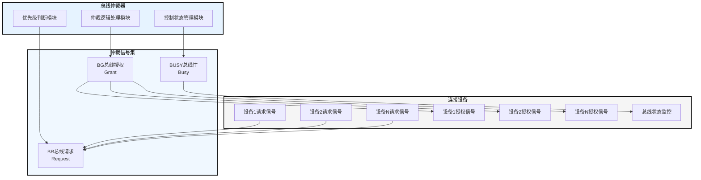
```mermaid
graph TD
    subgraph arbitrator ["总线仲裁器"]
        Priority[优先级判断模块]
        Logic[仲裁逻辑处理模块]
        Control[控制状态管理模块]
    end
    
    subgraph signals ["仲裁信号集"]
        BR[BR总线请求<br/>Request]
        BG[BG总线授权<br/>Grant]
        BUSY[BUSY总线忙<br/>Busy]
    end
    
    subgraph devices ["连接设备"]
        Dev1[设备1请求信号]
        Dev2[设备2请求信号]
        DevN[设备N请求信号]
        Grant1[设备1授权信号]
        Grant2[设备2授权信号]
        GrantN[设备N授权信号]
        Status[总线状态监控]
    end
    
    Priority --> BR
    Logic --> BG
    Control --> BUSY
    
    Dev1 --> BR
    Dev2 --> BR
    DevN --> BR
    
    BG --> Grant1
    BG --> Grant2
    BG --> GrantN
    
    BUSY --> Status
    
    style arbitrator fill:#e6f3ff,stroke:#000,stroke-width:2px,color:#000
    style signals fill:#f0f8ff,stroke:#000,stroke-width:2px,color:#000
    style devices fill:#f5f5f5,stroke:#000,stroke-width:2px,color:#000
```

**总线仲裁信号时序图：**

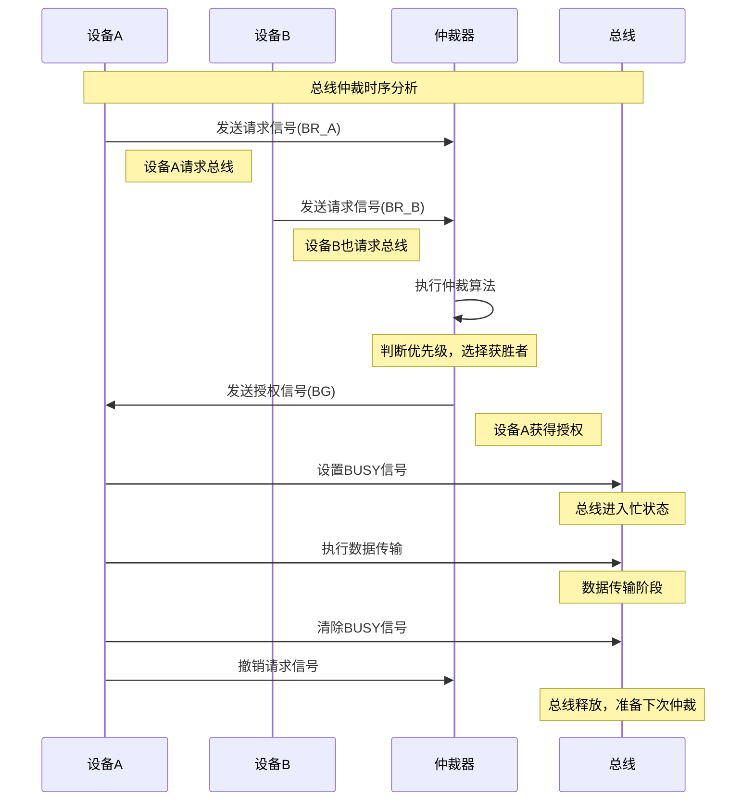
```mermaid
sequenceDiagram
    participant DevA as 设备A
    participant DevB as 设备B
    participant Arb as 仲裁器
    participant Bus as 总线
    
    note over DevA,Bus: 总线仲裁时序分析
    
    DevA->>Arb: 发送请求信号(BR_A)
    note right of DevA: 设备A请求总线
    
    DevB->>Arb: 发送请求信号(BR_B)
    note right of DevB: 设备B也请求总线
    
    Arb->>Arb: 执行仲裁算法
    note over Arb: 判断优先级，选择获胜者
    
    Arb->>DevA: 发送授权信号(BG)
    note right of Arb: 设备A获得授权
    
    DevA->>Bus: 设置BUSY信号
    note over Bus: 总线进入忙状态
    
    DevA->>Bus: 执行数据传输
    note over Bus: 数据传输阶段
    
    DevA->>Bus: 清除BUSY信号
    DevA->>Arb: 撤销请求信号
    note over Bus: 总线释放，准备下次仲裁
```

**信号功能定义表：**

| 信号名称 | 方向 | 功能描述 | 电平定义 |
|----------|------|----------|----------|
| **BR** | 设备→仲裁器 | 总线请求信号 | 高电平=请求 |
| **BG** | 仲裁器→设备 | 总线授权信号 | 高电平=授权 |
| **BUSY** | 设备→所有 | 总线忙信号 | 高电平=忙碌 |
| **AS** | 主设备→从设备 | 地址选通信号 | 高电平=地址有效 |
| **DS** | 主设备→从设备 | 数据选通信号 | 高电平=数据有效 |

### 3.2 集中式仲裁方法

#### 3.2.1 链式查询仲裁技术

**链式仲裁结构图：**

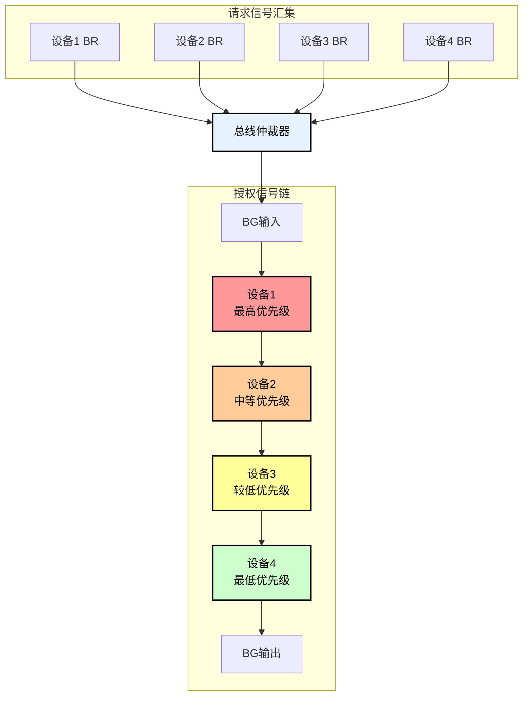
```mermaid
graph TD
    Arbitrator[总线仲裁器]
    
    subgraph requests ["请求信号汇集"]
        BR1[设备1 BR]
        BR2[设备2 BR] 
        BR3[设备3 BR]
        BR4[设备4 BR]
    end
    
    subgraph chain ["授权信号链"]
        BG_IN[BG输入]
        Device1[设备1<br/>最高优先级]
        Device2[设备2<br/>中等优先级]
        Device3[设备3<br/>较低优先级]
        Device4[设备4<br/>最低优先级]
        BG_OUT[BG输出]
    end
    
    BR1 --> Arbitrator
    BR2 --> Arbitrator  
    BR3 --> Arbitrator
    BR4 --> Arbitrator
    
    Arbitrator --> BG_IN
    BG_IN --> Device1
    Device1 --> Device2
    Device2 --> Device3
    Device3 --> Device4
    Device4 --> BG_OUT
    
    style Device1 fill:#ff9999,stroke:#000,stroke-width:2px,color:#000
    style Device2 fill:#ffcc99,stroke:#000,stroke-width:2px,color:#000
    style Device3 fill:#ffff99,stroke:#000,stroke-width:2px,color:#000
    style Device4 fill:#ccffcc,stroke:#000,stroke-width:2px,color:#000
    style Arbitrator fill:#e6f3ff,stroke:#000,stroke-width:2px,color:#000
```

**链式仲裁工作时序：**

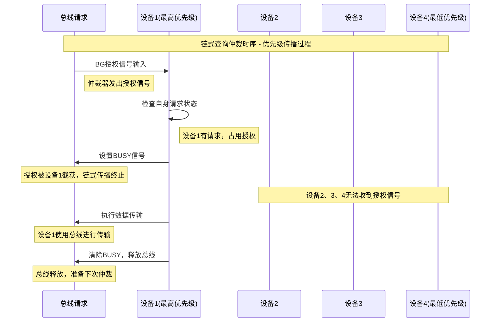
```mermaid
sequenceDiagram
    participant Bus as 总线请求
    participant Dev1 as 设备1(最高优先级)
    participant Dev2 as 设备2
    participant Dev3 as 设备3
    participant Dev4 as 设备4(最低优先级)
    
    note over Bus,Dev4: 链式查询仲裁时序 - 优先级传播过程
    
    Bus->>Dev1: BG授权信号输入
    note right of Bus: 仲裁器发出授权信号
    
    Dev1->>Dev1: 检查自身请求状态
    note right of Dev1: 设备1有请求，占用授权
    
    Dev1->>Bus: 设置BUSY信号
    note over Bus: 授权被设备1截获，链式传播终止
    
    note over Dev2,Dev4: 设备2、3、4无法收到授权信号
    
    Dev1->>Bus: 执行数据传输
    note over Bus: 设备1使用总线进行传输
    
    Dev1->>Bus: 清除BUSY，释放总线
    note over Bus: 总线释放，准备下次仲裁
```

**链式仲裁传播延迟分析：**

| 阶段 | 时间点 | 操作 | 延迟累计 |
|------|--------|------|----------|
| **t1** | 传播延迟 | 授权信号从仲裁器到设备1 | $t_d$ |
| **t2** | 检测延迟 | 设备1检测请求并占用授权 | $t_d + t_c$ |
| **t3** | 截断效应 | 后续设备无法收到授权 | - |
| **t4** | 授权时间 | 设备1获得总线使用权 | $t_d + t_c + t_a$ |

**性能特征分析：**

| 技术指标 | 链式查询特征 | 计算公式 | 性能影响 |
|----------|-------------|----------|----------|
| **响应延迟** | 与设备位置有关 | $T = n \times t_d$ | 后级设备延迟大 |
| **硬件开销** | 最小 | $O(1)$ | 成本效益高 |
| **扩展性** | 优秀 | 添加设备简单 | 易于维护 |
| **公平性** | 差 | 固定优先级 | 可能饥饿 |

#### 3.2.2 计数器查询仲裁技术

**轮询仲裁结构图：**

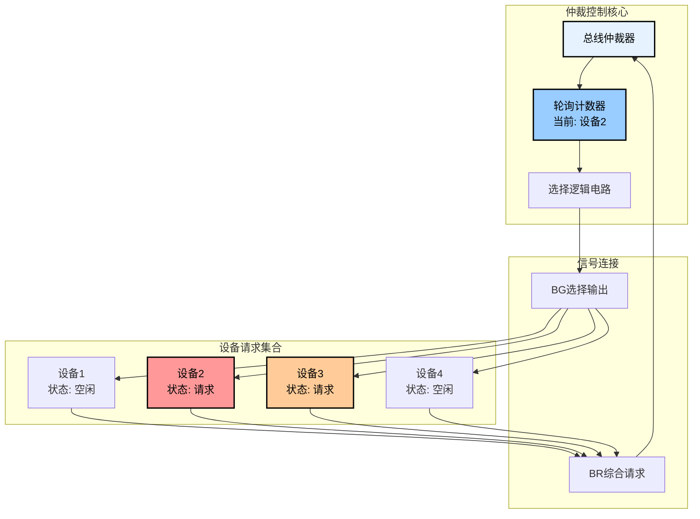
```mermaid
graph TD
    subgraph core ["仲裁控制核心"]
        Arbitrator[总线仲裁器]
        Counter[轮询计数器<br/>当前: 设备2]
        Logic[选择逻辑电路]
    end
    
    subgraph devices ["设备请求集合"]
        Dev1[设备1<br/>状态: 空闲]
        Dev2[设备2<br/>状态: 请求]
        Dev3[设备3<br/>状态: 请求]
        Dev4[设备4<br/>状态: 空闲]
    end
    
    subgraph signals ["信号连接"]
        BR_All[BR综合请求]
        BG_Select[BG选择输出]
    end
    
    Dev1 --> BR_All
    Dev2 --> BR_All
    Dev3 --> BR_All  
    Dev4 --> BR_All
    
    BR_All --> Arbitrator
    Arbitrator --> Counter
    Counter --> Logic
    Logic --> BG_Select
    
    BG_Select --> Dev1
    BG_Select --> Dev2
    BG_Select --> Dev3
    BG_Select --> Dev4
    
    style Dev2 fill:#ff9999,stroke:#000,stroke-width:2px,color:#000
    style Dev3 fill:#ffcc99,stroke:#000,stroke-width:2px,color:#000
    style Counter fill:#99ccff,stroke:#000,stroke-width:2px,color:#000
    style Arbitrator fill:#e6f3ff,stroke:#000,stroke-width:2px,color:#000
```

**轮询算法工作流程：**

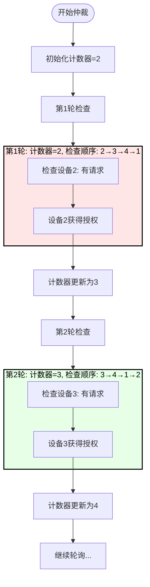
```mermaid
flowchart TD
    Start([开始仲裁]) --> Init[初始化计数器=2]
    Init --> Round1[第1轮检查]
    
    subgraph round1 ["第1轮: 计数器=2, 检查顺序: 2→3→4→1"]
        Check2[检查设备2: 有请求]
        Assign2[设备2获得授权]
        Check2 --> Assign2
    end
    
    Round1 --> round1
    Assign2 --> Update1[计数器更新为3]
    Update1 --> Round2[第2轮检查]
    
    subgraph round2 ["第2轮: 计数器=3, 检查顺序: 3→4→1→2"]
        Check3[检查设备3: 有请求]
        Assign3[设备3获得授权]
        Check3 --> Assign3
    end
    
    Round2 --> round2
    Assign3 --> Update2[计数器更新为4]
    Update2 --> Continue[继续轮询...]
    
    style round1 fill:#ffe6e6,stroke:#000,stroke-width:2px,color:#000
    style round2 fill:#e6ffe6,stroke:#000,stroke-width:2px,color:#000
```

**轮询仲裁状态转换表：**

| 轮次 | 计数器值 | 检查顺序 | 设备状态(1/2/3/4) | 获胜设备 | 下轮计数器 |
|------|----------|----------|-------------------|----------|------------|
| **1** | 2 | 2→3→4→1 | 0/1/1/0 | 设备2 | 3 |
| **2** | 3 | 3→4→1→2 | 0/0/1/0 | 设备3 | 4 |
| **3** | 4 | 4→1→2→3 | 1/0/0/0 | 设备1 | 1 |
| **4** | 1 | 1→2→3→4 | 0/1/0/1 | 设备2 | 2 |

**公平性分析：**
- ✓ **完全公平**：每个设备都有相等的获得总线机会
- ✓ **无饥饿现象**：任何设备最多等待 n-1 轮
- ✓ **负载均衡**：长期运行下各设备使用率趋于相等

#### 3.2.3 独立请求仲裁技术

**并行仲裁结构图：**

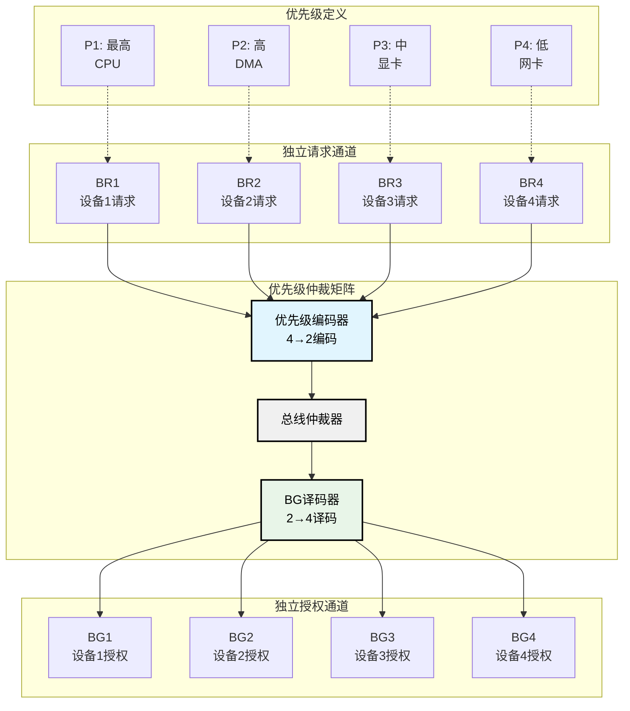
```mermaid
graph TD
    subgraph matrix ["优先级仲裁矩阵"]
        Arbitrator[总线仲裁器]
        Priority[优先级编码器<br/>4→2编码]
        Decoder[BG译码器<br/>2→4译码]
    end
    
    subgraph request ["独立请求通道"]
        BR1[BR1<br/>设备1请求]
        BR2[BR2<br/>设备2请求] 
        BR3[BR3<br/>设备3请求]
        BR4[BR4<br/>设备4请求]
    end
    
    subgraph grant ["独立授权通道"]
        BG1[BG1<br/>设备1授权]
        BG2[BG2<br/>设备2授权]
        BG3[BG3<br/>设备3授权] 
        BG4[BG4<br/>设备4授权]
    end
    
    subgraph priority ["优先级定义"]
        P1[P1: 最高<br/>CPU]
        P2[P2: 高<br/>DMA]
        P3[P3: 中<br/>显卡]
        P4[P4: 低<br/>网卡]
    end
    
    BR1 --> Priority
    BR2 --> Priority
    BR3 --> Priority
    BR4 --> Priority
    
    Priority --> Arbitrator
    Arbitrator --> Decoder
    
    Decoder --> BG1
    Decoder --> BG2
    Decoder --> BG3
    Decoder --> BG4
    
    P1 -.-> BR1
    P2 -.-> BR2
    P3 -.-> BR3
    P4 -.-> BR4
    
    style Priority fill:#e1f5fe,stroke:#000,stroke-width:2px,color:#000
    style Decoder fill:#e8f5e8,stroke:#000,stroke-width:2px,color:#000
    style Arbitrator fill:#f0f0f0,stroke:#000,stroke-width:2px,color:#000
```

**优先级编码真值表：**

| BR4 | BR3 | BR2 | BR1 | 输出编码 | 获胜设备 | 仲裁时间 |
|-----|-----|-----|-----|----------|----------|----------|
| 0   | 0   | 0   | 0   | 00       | 无       | 0        |
| 0   | 0   | 0   | 1   | 01       | 设备1    | 1Δt      |
| 0   | 0   | 1   | X   | 10       | 设备2    | 1Δt      |
| 0   | 1   | X   | X   | 11       | 设备3    | 1Δt      |
| 1   | X   | X   | X   | 00       | 设备4    | 1Δt      |

**注释说明：**
- X表示无关项（Don't Care），可以为0或1
- 按优先级顺序：BR1 > BR2 > BR3 > BR4
- 当多个设备同时请求时，优先级高的设备获得总线

**性能对比分析：**

```mermaid
graph LR
    subgraph "仲裁方式性能对比"
        A[链式查询<br/>延迟: O(n)]
        B[计数器查询<br/>延迟: O(log n)]
        C[独立请求<br/>延迟: O(1)]
    end
    
    subgraph "性能指标"
        D[响应速度]
        E[硬件复杂度]
        F[公平性]
        G[扩展性]
    end
    
    A -.-> D
    B -.-> D
    C -.-> D
    
    style C fill:#90EE90,stroke:#000,stroke-width:2px,color:#000
    style B fill:#FFE4B5,stroke:#000,stroke-width:2px,color:#000
    style A fill:#FFB6C1,stroke:#000,stroke-width:2px,color:#000
```

### 3.3 分布式仲裁方式

#### 3.3.1 自举分布式仲裁

**基本思想**：
- 不设置中央仲裁器
- 各设备通过协商获得总线控制权
- 设备自己判断是否获得使用权

**实现方法**：
1. **冲突检测法**：设备发送请求后检测冲突
2. **令牌传递法**：通过令牌环传递控制权
3. **时间片分配法**：按时间片轮流使用总线

**技术学习重点**：
- 分布式仲裁的工作原理
- 与集中式仲裁的比较
- 适用场景分析

### 3.4 总线仲裁方式对比

| 仲裁方式       | 结构复杂度  | 响应速度   | 优先级特点  | 扩展性   | 硬件开销  | 适用场景   |
|----------------|-------------|------------|-------------|----------|-----------|------------|
| **链式查询**   | 简单        | 慢         | 固定优先级  | 好       | 低        | 低成本系统 |
| **计数器查询** | 中等        | 中等       | 可变优先级  | 好       | 中等      | 一般系统   |
| **独立请求**   | 复杂        | 快         | 灵活优先级  | 差       | 高        | 高性能系统 |
| **分布式仲裁** | 复杂        | 中等       | 协商决定    | 好       | 中等      | 分布式系统 |

#### 仲裁性能分析

**仲裁延迟计算**：

对于链式查询仲裁：
$$T_{\text{仲裁}} = n \times t_{\text{门延迟}} + t_{\text{传播延迟}}$$

其中：
- $n$ 是设备数量
- $t_{\text{门延迟}}$ 是每个逻辑门的延迟
- $t_{\text{传播延迟}}$ 是信号传播延迟

**例题4.1**：某系统有8个设备采用链式仲裁，门延迟为2ns，传播延迟为1ns，计算最坏情况下的仲裁时间。

**解答**：
- 最坏情况：最低优先级设备(设备8)请求总线
- 仲裁时间：$T = 8 \times 2ns + 1ns = 17ns$

---

## 4. 总线操作时序控制

### 4.1 同步总线时序设计

#### 4.1.1 同步总线基本原理

> **同步总线** 采用统一的时钟信号协调所有总线操作，所有信号变化都与时钟边沿严格同步，确保时序关系的确定性和可预测性。

**同步控制机制图：**

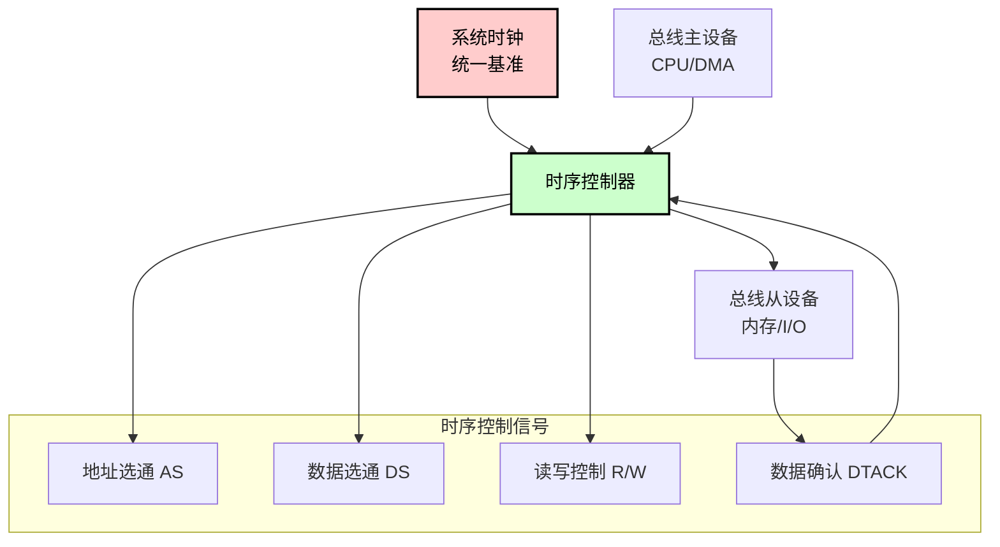
```mermaid
graph TD
    Clock[系统时钟<br/>统一基准]
    Master[总线主设备<br/>CPU/DMA]
    Slave[总线从设备<br/>内存/I/O]
    Controller[时序控制器]
    
    subgraph "时序控制信号"
        AS[地址选通 AS]
        DS[数据选通 DS]
        RW[读写控制 R/W]
        DTACK[数据确认 DTACK]
    end
    
    Clock --> Controller
    Controller --> AS
    Controller --> DS  
    Controller --> RW
    
    Master --> Controller
    Controller --> Slave
    Slave --> DTACK
    DTACK --> Controller
    
    style Clock fill:#ffcccc,stroke:#000,stroke-width:2px,color:#000
    style Controller fill:#ccffcc,stroke:#000,stroke-width:2px,color:#000
```

#### 4.1.2 同步总线读操作时序

**同步总线读操作时序图：**

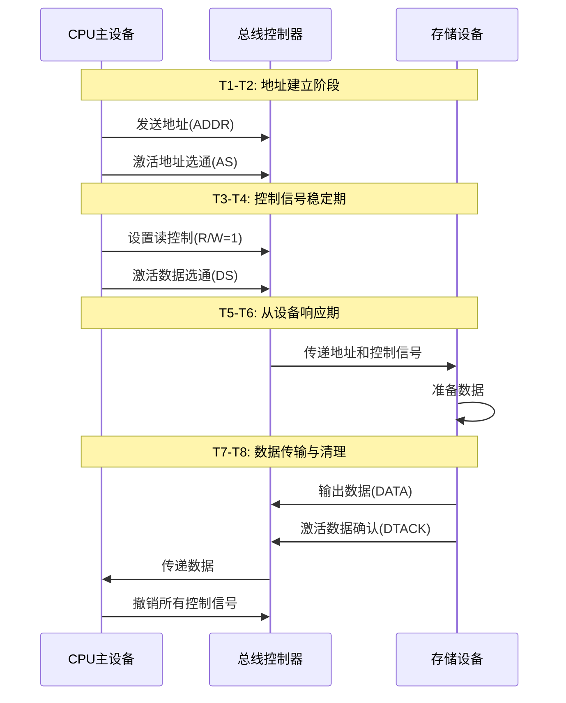
```mermaid
sequenceDiagram
    participant CPU as CPU主设备
    participant Bus as 总线控制器  
    participant Mem as 存储设备
    
    note over CPU,Mem: T1-T2: 地址建立阶段
    CPU->>Bus: 发送地址(ADDR)
    CPU->>Bus: 激活地址选通(AS)
    
    note over CPU,Mem: T3-T4: 控制信号稳定期
    CPU->>Bus: 设置读控制(R/W=1)
    CPU->>Bus: 激活数据选通(DS)
    
    note over CPU,Mem: T5-T6: 从设备响应期
    Bus->>Mem: 传递地址和控制信号
    Mem->>Mem: 准备数据
    
    note over CPU,Mem: T7-T8: 数据传输与清理
    Mem->>Bus: 输出数据(DATA)
    Mem->>Bus: 激活数据确认(DTACK)
    Bus->>CPU: 传递数据
    CPU->>Bus: 撤销所有控制信号
```

**时序约束条件表：**

| 时序参数 | 最小值 | 典型值 | 最大值 | 说明 |
|----------|--------|--------|--------|------|
| **地址建立时间** | 10ns | 15ns | 20ns | 地址信号稳定所需时间 |
| **数据访问时间** | 60ns | 80ns | 100ns | 从地址有效到数据有效 |
| **数据保持时间** | 5ns | 10ns | 15ns | 数据信号保持时间 |
| **控制信号宽度** | 20ns | 30ns | 40ns | 控制信号最小脉宽 |

#### 4.1.3 同步总线写操作时序

**同步总线写操作时序图：**

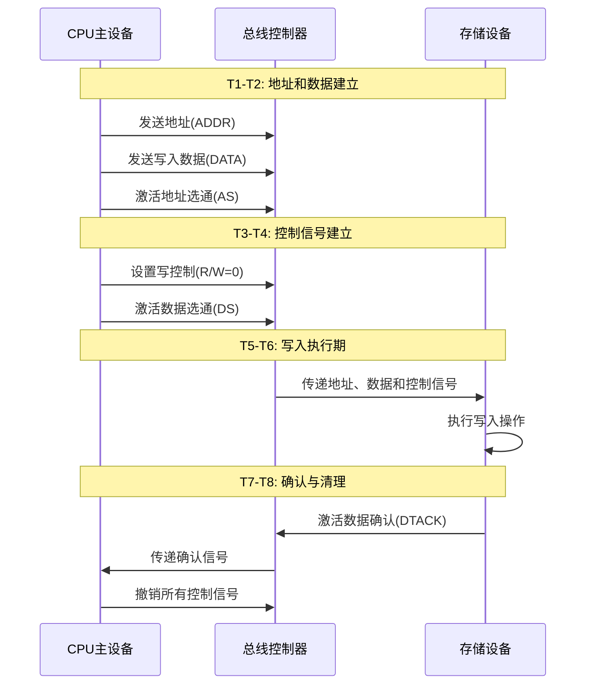
```mermaid
sequenceDiagram
    participant CPU as CPU主设备
    participant Bus as 总线控制器
    participant Mem as 存储设备
    
    note over CPU,Mem: T1-T2: 地址和数据建立
    CPU->>Bus: 发送地址(ADDR)
    CPU->>Bus: 发送写入数据(DATA)
    CPU->>Bus: 激活地址选通(AS)
    
    note over CPU,Mem: T3-T4: 控制信号建立
    CPU->>Bus: 设置写控制(R/W=0)
    CPU->>Bus: 激活数据选通(DS)
    
    note over CPU,Mem: T5-T6: 写入执行期
    Bus->>Mem: 传递地址、数据和控制信号
    Mem->>Mem: 执行写入操作
    
    note over CPU,Mem: T7-T8: 确认与清理
    Mem->>Bus: 激活数据确认(DTACK)
    Bus->>CPU: 传递确认信号
    CPU->>Bus: 撤销所有控制信号
```

**写操作时序约束：**

| 约束参数 | 最小值 | 说明 | 违反后果 |
|----------|--------|------|----------|
| **地址建立时间 (Tas)** | ≥ 10ns | 地址信号稳定时间 | 地址译码错误 |
| **数据建立时间 (Tds)** | ≥ 15ns | 写数据稳定时间 | 写入数据错误 |
| **保持时间 (Th)** | ≥ 5ns | 信号保持时间 | 时序竞争 |
| **传播延迟 (Tpd)** | ≤ 20ns | 信号传播时间 | 同步失效 |

### 4.2 异步总线握手协议

#### 4.2.1 异步总线基本原理

> **异步总线** 不依赖统一时钟，通过握手信号协调设备间通信，能够适应不同速度设备，提供更大的设计灵活性。

**异步握手协议类型对比：**

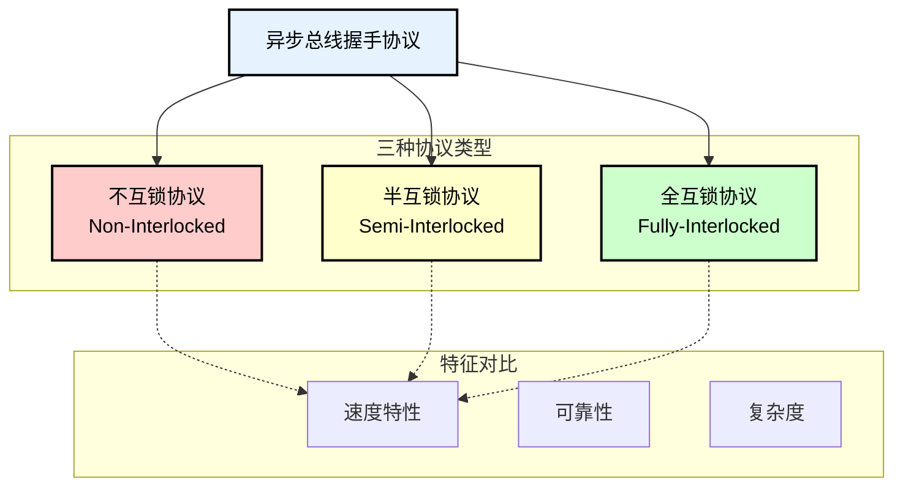
```mermaid
graph TD
    AsyncBus[异步总线握手协议]
    
    subgraph protocols ["三种协议类型"]
        NoLock[不互锁协议<br/>Non-Interlocked]
        SemiLock[半互锁协议<br/>Semi-Interlocked]
        FullLock[全互锁协议<br/>Fully-Interlocked]
    end
    
    subgraph features ["特征对比"]
        Speed[速度特性]
        Reliability[可靠性]
        Complexity[复杂度]
    end
    
    AsyncBus --> NoLock
    AsyncBus --> SemiLock
    AsyncBus --> FullLock
    
    NoLock -.-> Speed
    SemiLock -.-> Speed
    FullLock -.-> Speed
    
    style NoLock fill:#ffcccc,stroke:#000,stroke-width:2px,color:#000
    style SemiLock fill:#ffffcc,stroke:#000,stroke-width:2px,color:#000
    style FullLock fill:#ccffcc,stroke:#000,stroke-width:2px,color:#000
    style AsyncBus fill:#e6f3ff,stroke:#000,stroke-width:2px,color:#000
```

#### 4.2.2 不互锁协议（Non-Interlocked）

**工作机制特点：**
- 主设备发出请求后，经过固定延迟时间读取数据
- 从设备在固定时间内必须完成响应
- 最简单但可靠性较低

**不互锁协议时序图：**

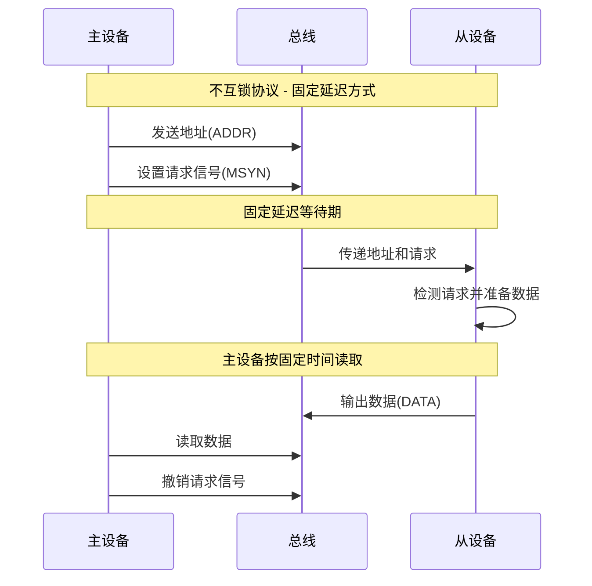
```mermaid
sequenceDiagram
    participant Master as 主设备
    participant Bus as 总线
    participant Slave as 从设备
    
    note over Master,Slave: 不互锁协议 - 固定延迟方式
    
    Master->>Bus: 发送地址(ADDR)
    Master->>Bus: 设置请求信号(MSYN)
    
    note over Master,Slave: 固定延迟等待期
    Bus->>Slave: 传递地址和请求
    Slave->>Slave: 检测请求并准备数据
    
    note over Master,Slave: 主设备按固定时间读取
    Slave->>Bus: 输出数据(DATA)
    Master->>Bus: 读取数据
    Master->>Bus: 撤销请求信号
```

**不互锁协议特征分析：**

| 特征维度 | 描述 | 优势 | 劣势 |
|----------|------|------|------|
| **实现复杂度** | 最简单 | 硬件成本低 | 灵活性差 |
| **速度性能** | 最快 | 无握手开销 | 必须等待最慢设备 |
| **可靠性** | 最差 | - | 无错误检测机制 |
| **适用场景** | 同质化系统 | 设备特性一致时高效 | 异构环境不适用 |

#### 4.2.3 半互锁协议（Semi-Interlocked）

**工作机制特点：**
- 从设备用应答信号通知主设备数据已准备好
- 主设备收到应答后撤销请求，但不等待从设备撤销应答
- 平衡了速度和可靠性

**半互锁协议时序图：**

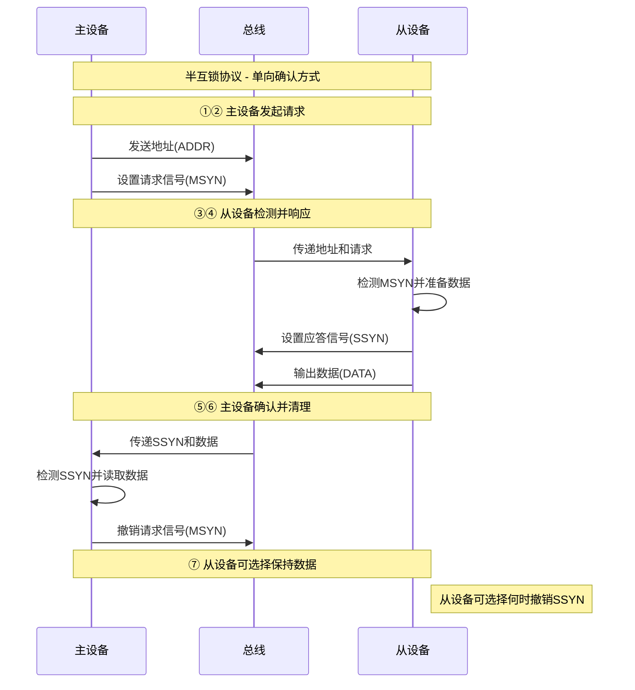
```mermaid
sequenceDiagram
    participant Master as 主设备
    participant Bus as 总线
    participant Slave as 从设备
    
    note over Master,Slave: 半互锁协议 - 单向确认方式
    
    note over Master,Slave: ①② 主设备发起请求
    Master->>Bus: 发送地址(ADDR)
    Master->>Bus: 设置请求信号(MSYN)
    
    note over Master,Slave: ③④ 从设备检测并响应
    Bus->>Slave: 传递地址和请求
    Slave->>Slave: 检测MSYN并准备数据
    Slave->>Bus: 设置应答信号(SSYN)
    Slave->>Bus: 输出数据(DATA)
    
    note over Master,Slave: ⑤⑥ 主设备确认并清理
    Bus->>Master: 传递SSYN和数据
    Master->>Master: 检测SSYN并读取数据
    Master->>Bus: 撤销请求信号(MSYN)
    
    note over Master,Slave: ⑦ 从设备可选择保持数据
    note right of Slave: 从设备可选择何时撤销SSYN
```

**半互锁协议流程分析：**

| 步骤 | 主设备行为 | 从设备行为 | 说明 |
|------|------------|------------|------|
| **①②** | 发起请求 | 等待请求 | 主设备主动发起 |
| **③④** | 等待响应 | 检测并响应 | 从设备被动响应 |
| **⑤⑥** | 确认并清理 | 保持状态 | 单向确认机制 |
| **⑦** | 完成传输 | 自主清理 | 部分互锁保护 |

#### 4.2.4 全互锁协议（Fully-Interlocked）

**工作机制特点：**
- 完整的四次握手过程
- 主设备等待从设备撤销应答信号后才完成传输
- 最高可靠性但速度较慢

**全互锁协议时序图：**

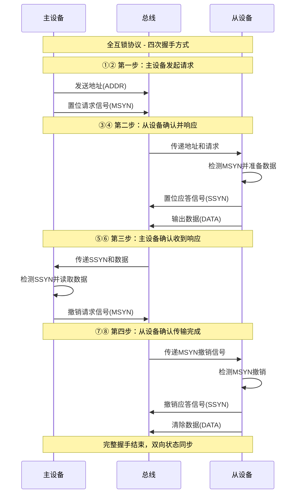
```mermaid
sequenceDiagram
    participant Master as 主设备
    participant Bus as 总线
    participant Slave as 从设备
    
    note over Master,Slave: 全互锁协议 - 四次握手方式
    
    note over Master,Slave: ①② 第一步：主设备发起请求
    Master->>Bus: 发送地址(ADDR)
    Master->>Bus: 置位请求信号(MSYN)
    
    note over Master,Slave: ③④ 第二步：从设备确认并响应
    Bus->>Slave: 传递地址和请求
    Slave->>Slave: 检测MSYN并准备数据
    Slave->>Bus: 置位应答信号(SSYN)
    Slave->>Bus: 输出数据(DATA)
    
    note over Master,Slave: ⑤⑥ 第三步：主设备确认收到响应
    Bus->>Master: 传递SSYN和数据
    Master->>Master: 检测SSYN并读取数据
    Master->>Bus: 撤销请求信号(MSYN)
    
    note over Master,Slave: ⑦⑧ 第四步：从设备确认传输完成
    Bus->>Slave: 传递MSYN撤销信号
    Slave->>Slave: 检测MSYN撤销
    Slave->>Bus: 撤销应答信号(SSYN)
    Slave->>Bus: 清除数据(DATA)
    
    note over Master,Slave: 完整握手结束，双向状态同步
```

**全互锁协议可靠性分析：**

| 握手阶段 | 主设备状态 | 从设备状态 | 可靠性保证 |
|----------|------------|------------|------------|
| **第1步** | 发起请求 | 等待检测 | 请求明确发送 |
| **第2步** | 等待确认 | 响应请求 | 数据准备确认 |
| **第3步** | 确认接收 | 等待撤销 | 数据接收确认 |
| **第4步** | 等待清理 | 完成清理 | 传输完成确认 |

**协议优势：**
- **双向确认机制**：每个阶段都有明确的确认
- **完整状态同步**：设备状态完全一致
- **错误检测能力强**：任何阶段异常都能检测
- **适用关键应用**：最高可靠性保证

#### 4.2.5 握手协议性能对比分析

**三种协议综合对比表：**

| 对比维度 | 不互锁协议 | 半互锁协议 | 全互锁协议 |
|----------|------------|------------|------------|
| **握手步骤** | 1步 | 2步 | 4步 |
| **信号线数** | 最少 | 中等 | 最多 |
| **传输延迟** | 最小 | 中等 | 最大 |
| **可靠性** | 低 | 中 | 高 |
| **错误检测** | 无 | 部分 | 完整 |
| **设备兼容** | 差 | 好 | 最好 |
| **实现复杂度** | 简单 | 中等 | 复杂 |
| **功耗** | 低 | 中 | 高 |
| **应用场景** | 高速缓存 | 一般I/O | 关键系统 |

**性能分析图表：**

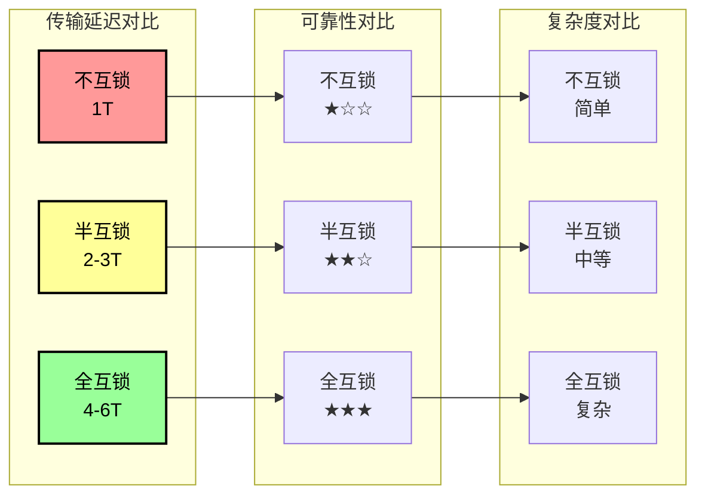
```mermaid
graph LR
    subgraph "传输延迟对比"
        A[不互锁<br/>1T]
        B[半互锁<br/>2-3T]  
        C[全互锁<br/>4-6T]
    end
    
    subgraph "可靠性对比"
        D[不互锁<br/>★☆☆]
        E[半互锁<br/>★★☆]
        F[全互锁<br/>★★★]
    end
    
    subgraph "复杂度对比"
        G[不互锁<br/>简单]
        H[半互锁<br/>中等]
        I[全互锁<br/>复杂]
    end
    
    A --> D --> G
    B --> E --> H  
    C --> F --> I
    
    style A fill:#ff9999,stroke:#000,stroke-width:2px,color:#000
    style B fill:#ffff99,stroke:#000,stroke-width:2px,color:#000
    style C fill:#99ff99,stroke:#000,stroke-width:2px,color:#000
```

### 4.3 时序性能分析方法

#### 同步总线
-   **优点**:
    -   **时序关系明确**: 所有操作都由统一的时钟信号驱动，信号之间的时序关系固定，控制逻辑和接口电路设计相对简单。
    -   **设计规整**: 模块化和同步化设计使得系统调试和验证更容易。
-   **缺点**:
    -   **速度受限于最慢设备**: 整个总线的时钟频率必须迁就总线上速度最慢的设备，无法充分发挥高速设备的性能。
    -   **效率较低**: 对于速度差异大的设备，高速设备需要插入等待周期来与低速设备同步，造成总线时间浪费。
-   **适用场景**:
    -   设备速度差异不大的系统。
    -   早期的计算机系统或一些结构简单的嵌入式系统。

#### 异步总线
-   **优点**:
    -   **适应不同速度的设备**: 不使用统一时钟，通过"握手"协议进行通信，允许每个设备按自身速度工作，灵活性高。
    -   **系统扩展性好**: 增加或更换不同速度的设备对总线影响较小。
    -   **平均效率高**: 充分发挥高速设备的性能，系统整体效率更高。
-   **缺点**:
    -   **控制复杂**: 需要实现握手协议，控制逻辑比同步总线复杂，信号线也可能更多。
    -   **可靠性设计要求高**: 需要精确处理请求和应答信号，以避免时序错误。
-   **适用场合**:
    -   现代计算机系统中连接速度差异悬殊的各类设备的标准方式。
    -   系统规模较大，设备种类繁多的场合。

## 5. 总线性能分析

### 5.1 总线性能指标

#### 1. 总线带宽（Bus Bandwidth）

> **总线带宽** 是指总线在单位时间内能够传输的最大数据量，通常用MB/s或GB/s表示。

**计算公式**：
$$\text{总线带宽} = \text{总线宽度} \times \text{总线频率}$$

**例题5.1**：某计算机系统采用64位数据总线，总线频率为200MHz，每个总线周期可传输一次数据。计算：
1. 理论最大带宽
2. 若考虑总线利用率为75%，求有效带宽
3. 若传输1MB数据，需要多少时间？

**解答**：
1. **理论最大带宽计算**：
- 总线宽度：64位 = 8字节
   - 每秒传输次数：200MHz = 200×10⁶次/秒
   - 理论带宽：$8 \times 200 \times 10^6 = 1600MB/s = 1.6GB/s$

2. **有效带宽计算**：
   - 有效带宽：$1600MB/s \times 75\% = 1200MB/s$

3. **传输时间计算**：
   - 传输时间：$\frac{1MB}{1200MB/s} = \frac{1}{1200}s ≈ 0.83ms$

#### 2. 总线利用率（Bus Utilization）

> **总线利用率** 是指总线实际传输数据的时间占总时间的比例。

**影响因素**：
- 总线仲裁时间
- 地址传输时间
- 数据传输时间
- 总线空闲时间

**计算方法**：
$$\text{总线利用率} = \frac{\text{数据传输时间}}{\text{总线周期时间}} \times 100\%$$

#### 3. 有效带宽（Effective Bandwidth）

> **有效带宽** 是考虑各种开销后的实际数据传输率。

$$\text{有效带宽} = \text{理论带宽} \times \text{总线利用率}$$

### 5.2 影响总线性能的因素

#### 1. 总线仲裁开销

**仲裁时间分析**:
- **链式仲裁**: 仲裁时间 = 设备数 × 门延迟
- **计数器仲裁**: 仲裁时间 = log₂(设备数) × 门延迟
- **独立请求仲裁**: 仲裁时间 = 常数

**例题5.2**：某系统有8个设备，采用链式仲裁，每个门延迟2ns，计算最坏情况下的仲裁时间。

**解答**：
最坏情况是最低优先级设备请求总线：
仲裁时间 = 8 × 2ns = 16ns

#### 2. 总线操作开销

**同步总线开销**：
```
读操作时间 = 地址建立时间 + 数据访问时间 + 数据保持时间
写操作时间 = 地址建立时间 + 数据建立时间 + 写信号时间
```

**异步总线开销**：
```
操作时间 = 请求时间 + 响应时间 + 确认时间 + 恢复时间
```

#### 3. 总线负载效应

**负载对性能的影响**：
- 连接设备数量增加
- 总线驱动能力下降
- 信号传播延迟增大
- 噪声干扰增强

### 5.3 总线性能优化策略

#### 1. 总线分级优化

**策略**：
- 将高速设备连接到高速总线
- 将低速设备连接到低速总线
- 使用总线桥连接不同层次的总线

**优势**：
- 避免高速设备被低速设备拖累
- 提高整体系统性能
- 降低总线冲突概率

#### 2. 总线缓冲优化

**缓冲技术**:
- **写缓冲**: CPU写数据时先写入缓冲区
- **读缓冲**: 预读取可能需要的数据
- **突发传输**: 一次传输多个数据

**效果**：
- 减少CPU等待时间
- 提高总线利用率
- 改善系统响应性能

#### 3. 总线仲裁优化

**动态优先级**：
- 根据设备的实时需求调整优先级
- 防止低优先级设备长期等待
- 提高系统公平性

**分时复用**：
- 将总线时间分割成时间片
- 按轮询方式分配给各设备
- 保证每个设备都有访问机会

## 6. 典型总线标准

> 现代计算机系统中采用了多种总线标准，每种标准都有其特定的应用场景和技术特点。理解这些标准的发展脉络和技术差异，对于系统设计和性能优化具有重要意义。

### 6.1 系统总线标准

#### 1. ISA总线（Industry Standard Architecture）

**技术特点**：
- 数据位宽：16位
- 地址位宽：24位
- 时钟频率：8MHz
- 带宽：16MB/s

**应用场景**：
- 早期PC机标准总线
- 连接扩展卡和外设
- 现已被PCI总线取代

#### 2. PCI总线（Peripheral Component Interconnect）

**技术特点**：
- 数据位宽：32位/64位
- 时钟频率：33MHz/66MHz
- 带宽：132MB/s - 528MB/s
- 支持即插即用

**工作机制**：
```mermaid
graph TD
    A[CPU] --> B[北桥芯片]
    B --> C[内存控制器]
    B --> D[AGP/PCI-E接口]
    B --> E[南桥芯片]
    E --> F[USB控制器]
    E --> G[SATA控制器]
    E --> H[PCI总线]
    H --> I[扩展卡槽]
```

#### 3. PCIe总线（PCI Express）

**技术特点**：
- 串行点对点连接
- 差分信号传输
- 支持多通道并行
- 向下兼容PCI

**性能对比**：

| 标准     | 通道数   | 频率    | 双向带宽   |
|----------|----------|---------|------------|
| PCIe 1.0 | x1       | 2.5GHz  | 0.5GB/s    |
| PCIe 2.0 | x1       | 5.0GHz  | 1.0GB/s    |
| PCIe 3.0 | x1       | 8.0GHz  | 2.0GB/s    |
| PCIe 4.0 | x1       | 16.0GHz | 4.0GB/s    |

### 6.2 I/O总线标准

#### 1. USB总线（Universal Serial Bus）

**版本演进**:
- **USB 1.1**: 低速1.5Mbps，全速12Mbps
- **USB 2.0**: 高速480Mbps
- **USB 3.0**: 超高速5Gbps
- **USB 3.1**: 超高速+10Gbps

**拓扑结构**：
```mermaid
graph TD
    A[主机控制器] --> B[根集线器]
    B --> C[集线器1]
    B --> D[集线器2]
    C --> E[设备1]
    C --> F[设备2]
    D --> G[设备3]
    D --> H[集线器3]
    H --> I[设备4]
    H --> J[设备5]
```

#### 2. SATA总线（Serial ATA）

**技术特点**：
- 串行差分信号
- 点对点连接
- 热插拔支持
- 命令队列

**性能规格**：

| 版本     | 速率    | 带宽    | 编码效率   |
|----------|---------|---------|------------|
| SATA 1.0 | 1.5Gbps | 150MB/s | 8b/10b     |
| SATA 2.0 | 3.0Gbps | 300MB/s | 8b/10b     |
| SATA 3.0 | 6.0Gbps | 600MB/s | 8b/10b     |

## 7. 典型例题

### 7.1 总线结构分析题

**【真题示例】** 某计算机系统采用三总线结构，CPU总线工作频率为400MHz，内存总线工作频率为200MHz，I/O总线工作频率为100MHz。假设CPU执行一条指令需要：取指令1次、取操作数1次、存结果1次。

1. 计算单总线结构下的指令执行时间
2. 计算三总线结构下的指令执行时间
3. 分析性能提升比例

**解答思路**：

**第1问**：单总线结构
- 所有操作都通过同一条总线，频率为100MHz（最慢设备）
- 每次内存访问时间：1/100MHz = 10ns
- 指令执行时间：3 × 10ns = 30ns

**第2问**：三总线结构
- 取指令：通过CPU-内存总线，时间1/200MHz = 5ns
- 取操作数：通过CPU-内存总线，时间5ns
- 存结果：通过CPU-内存总线，时间5ns
- 指令执行时间：3 × 5ns = 15ns

**第3问**：性能提升
- 性能提升比例：30ns/15ns = 2倍

### 7.2 总线仲裁计算题

**【真题示例】** 某系统有4个设备连接到总线上，采用链式查询仲裁方式，优先级从高到低为：设备1 > 设备2 > 设备3 > 设备4。门延迟为2ns，总线传输一个数据需要40ns。

现在各设备的总线请求情况如下：
- t=0时刻：设备2、设备4同时请求
- t=20ns时刻：设备1请求
- t=60ns时刻：设备3请求

画出总线使用时序图。

**解答步骤**：

1. **t=0时刻**：设备2、4同时请求
   - 仲裁时间：2ns（设备2优先级高，立即获得）
   - 设备2使用总线：2ns-42ns

2. **t=20ns时刻**：设备1请求
   - 等待设备2完成：42ns
   - 仲裁时间：2ns
   - 设备1使用总线：44ns-84ns

3. **t=42ns时刻**：设备2释放，设备4等待中
   - 但设备1优先级更高，设备4继续等待

4. **t=60ns时刻**：设备3请求
   - 等待设备1完成

5. **t=84ns时刻**：设备1完成
   - 仲裁设备3、4：设备3优先级高
   - 设备3使用总线：86ns-126ns

6. **t=126ns时刻**：设备3完成
   - 设备4最终获得总线：128ns-168ns

### 7.3 总线性能优化题

**【典型题目】** 某计算机系统的总线参数如下：
- 数据总线宽度：32位
- 地址总线宽度：32位
- 总线时钟频率：200MHz
- 每次总线操作需要4个时钟周期

计算：
1. 理论最大带宽
2. 考虑地址传输开销的有效带宽
3. 若采用突发传输（一次地址传输，连续传输4个数据），计算突发传输的有效带宽

**解答**：

**第1问**：理论最大带宽
- 每个时钟周期传输32位 = 4字节
- 理论带宽：4字节 × 200MHz = 800MB/s

**第2问**：考虑地址开销的有效带宽
- 每次操作：地址传输（4周期）+ 数据传输（4周期）= 8周期
- 数据传输效率：4/8 = 50%
- 有效带宽：800MB/s × 50% = 400MB/s

**第3问**：突发传输的有效带宽
- 每次突发：地址传输（4周期）+ 数据传输（4×4=16周期）= 20周期
- 数据传输效率：16/20 = 80%
- 突发有效带宽：800MB/s × 80% = 640MB/s
