# 7 输入输出系统

## 导航目录

1. [I/O系统基础理论](#1-io系统基础理论)
2. [I/O控制方式技术](#2-io控制方式技术)
3. [I/O接口与设备控制](#3-io接口与设备控制)
4. [外部设备技术](#4-外部设备技术)
5. [I/O系统性能分析与优化](#5-io系统性能分析与优化)
6. [现代I/O技术与发展](#6-现代io技术与发展)
7. [典型例题与工程应用](#7-典型例题与工程应用)
8. [核心知识点](#8-核心知识点)
 

## 1. I/O系统基础理论

### 1.1 I/O系统基本概念与功能

> **输入输出系统（Input/Output System）** 是计算机系统中负责实现CPU与外部设备之间信息交换的硬件和软件的总称，是连接计算机内部世界与外部世界的重要桥梁。

#### 1.1.1 I/O系统的定义与特征

**核心定义：**
I/O系统是由I/O硬件、I/O软件以及相关协议组成的完整体系，负责管理和控制计算机与外部环境之间的所有数据传输和信息交换活动。

**基本特征分析：**

```
I/O系统特征体系
├── 多样性特征
│   ├── 设备类型多样化
│   │   ├── 存储设备(磁盘、SSD)
│   │   ├── 输入设备(键盘、鼠标)
│   │   └── 输出设备(显示器、打印机)
│   ├── 速度差异巨大
│   │   ├── 低速设备: 10¹ ~ 10³ B/s
│   │   ├── 中速设备: 10³ ~ 10⁶ B/s
│   │   └── 高速设备: 10⁶ ~ 10⁹ B/s
│   └── 接口标准差异
│       ├── 并行接口(传统)
│       ├── 串行接口(现代)
│       └── 网络接口(分布式)
├── 异步性特征
│   ├── 设备独立运行
│   ├── 事件驱动响应
│   └── 异步I/O处理
├── 共享性特征
│   ├── 设备资源共享
│   ├── 总线分时复用
│   └── 控制器统一管理
└── 层次性特征
    ├── 硬件抽象层次
    ├── 接口协议层次
    └── 软件管理层次
```

#### 1.1.2 I/O系统的组成结构

**系统组成架构：**

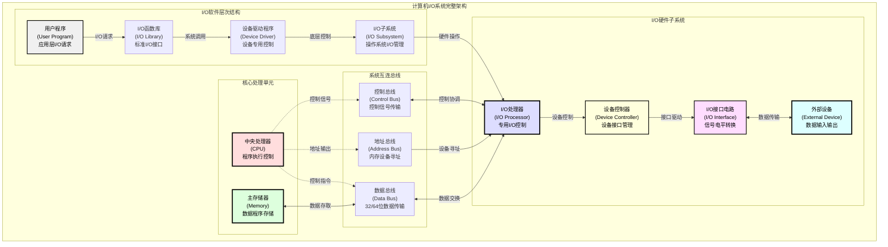

**详细组成分析：**

| 组成部分 | 主要功能 | 技术特点 | 典型实现 |
|----------|----------|----------|----------|
| **I/O设备** | 数据输入输出 | 多样化、专用化 | 键盘、显示器、磁盘 |
| **I/O接口** | 信号转换缓冲 | 标准化、模块化 | 串并转换、电平匹配 |
| **设备控制器** | 设备管理控制 | 智能化、独立化 | 磁盘控制器、网卡 |
| **I/O处理器** | I/O操作处理 | 专用化、高效化 | DMA控制器、通道 |
| **I/O软件** | 系统资源管理 | 层次化、抽象化 | 驱动程序、文件系统 |

#### 1.1.3 I/O系统的核心功能

**功能体系分析：**

1. **数据传输管理功能**
   - **并行/串行转换**：适应不同传输方式需求
   - **速度匹配缓冲**：协调CPU与设备的速度差异
   - **数据格式转换**：适应不同设备的数据格式要求
   - **传输完整性保障**：确保数据传输的可靠性

2. **设备访问控制功能**
   - **设备地址管理**：为每个设备分配唯一标识
   - **设备状态监控**：实时掌握设备工作状态
   - **访问权限控制**：管理设备的访问权限
   - **冲突仲裁处理**：解决多个请求的冲突

3. **错误检测处理功能**
   - **硬件故障检测**：监测设备硬件故障
   - **传输错误校验**：检测数据传输错误
   - **错误恢复机制**：提供错误恢复能力
   - **异常处理流程**：处理各种异常情况

4. **性能优化管理功能**
   - **I/O调度优化**：优化I/O请求的执行顺序
   - **缓存管理策略**：提高数据访问效率
   - **预读预取技术**：提前加载可能需要的数据
   - **并行处理能力**：支持多个I/O操作并行执行

### 1.2 I/O设备分类与特性分析

#### 1.2.1 按数据传输速率分类

**传输速率分类体系：**

| 设备类型 | 传输速率范围 | 数据特征 | 典型设备示例 | 控制方式 |
|----------|-------------|----------|-------------|----------|
| **低速设备** | 10 B/s ~ 1 KB/s | 字符流、低延迟 | 键盘、鼠标、串口 | 程序查询/中断 |
| **中速设备** | 1 KB/s ~ 1 MB/s | 数据块、周期性 | 打印机、扫描仪 | 中断/简单DMA |
| **高速设备** | 1 MB/s ~ 10 GB/s | 大数据块、连续 | 磁盘、网卡、显卡 | DMA/通道 |
| **超高速设备** | > 10 GB/s | 海量数据、实时 | NVMe SSD、高速网络 | 专用控制器 |

**性能特征分析图表：**

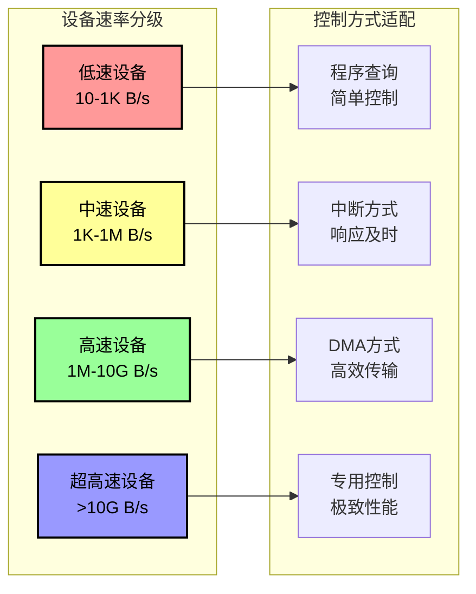

#### 1.2.2 按信息交换单位分类

**1. 字符设备（Character Device）**

**技术特点：**
- 数据以字符流形式传输
- 不支持随机访问，只能顺序访问
- 数据不经过系统缓存
- 实时性要求高

**典型设备分析：**

| 设备类型 | 工作原理 | 数据格式 | 访问特点 |
|----------|----------|----------|----------|
| **键盘** | 按键扫描 | ASCII码 | 事件驱动 |
| **串口** | 串行传输 | 字节流 | 双向通信 |
| **终端** | 字符显示 | 字符码 | 顺序输出 |

**2. 块设备（Block Device）**

**技术特点：**
- 数据以固定大小的块为单位传输
- 支持随机访问，可直接定位
- 数据经过系统缓存处理
- 吞吐量要求高

**典型设备分析：**

| 设备类型 | 块大小 | 访问方式 | 性能特点 |
|----------|--------|----------|----------|
| **硬盘** | 512B/4KB | 扇区寻址 | 高容量、机械延迟 |
| **SSD** | 4KB/8KB | 页访问 | 高速度、随机性能好 |
| **光盘** | 2KB | 扇区访问 | 只读、容量中等 |

#### 1.2.3 按设备功能特性分类

**存储设备技术分析：**

```
存储设备分类体系
├── 机械存储设备
│   ├── 硬盘驱动器(HDD)
│   │   ├── 技术特点: 大容量、低成本
│   │   ├── 性能指标: 寻道时间、转速
│   │   └── 适用场景: 大容量存储
│   └── 磁带存储
│       ├── 技术特点: 顺序访问、长期保存
│       └── 适用场景: 数据备份、归档
├── 固态存储设备
│   ├── 固态硬盘(SSD)
│   │   ├── 技术特点: 高速、低延迟
│   │   ├── 接口类型: SATA、NVMe
│   │   └── 适用场景: 系统盘、高性能应用
│   └── 内存存储
│       ├── 技术特点: 极高速度、易失性
│       └── 适用场景: 缓存、临时存储
└── 光学存储设备
    ├── 只读光盘(CD-ROM/DVD-ROM)
    ├── 可写光盘(CD-R/DVD-R)
    └── 可重写光盘(CD-RW/DVD-RW)
```

**输入输出设备技术对比：**

| 功能类型 | 设备特征 | 技术原理 | 发展趋势 |
|----------|----------|----------|----------|
| **输入设备** | 数据采集、人机交互 | 传感器技术、信号转换 | 智能化、多模态 |
| **输出设备** | 信息呈现、结果输出 | 显示技术、打印技术 | 高分辨率、多媒体 |
| **交互设备** | 双向交互、实时反馈 | 触控技术、语音识别 | 自然交互、沉浸式 |

### 1.3 I/O接口技术原理

#### 1.3.1 I/O接口的功能与结构

> **I/O接口** 是连接CPU/内存与外部设备之间的硬件电路，负责信号转换、数据缓冲、时序控制等功能，是I/O系统的核心组件。

**接口核心功能分析：**

1. **信号转换功能**
   - **电平转换**：TTL ↔ CMOS ↔ RS-232等电平标准转换
   - **时序转换**：CPU时序与设备时序的同步适配
   - **格式转换**：并行↔串行、同步↔异步转换
   - **协议转换**：不同通信协议间的转换

2. **数据缓冲功能**
   - **速度匹配**：协调CPU与设备间的速度差异
   - **数据暂存**：临时存储传输过程中的数据
   - **流量控制**：防止数据溢出或丢失
   - **突发处理**：处理突发性数据传输需求

3. **地址译码功能**
   - **设备选择**：根据地址信号选择目标设备
   - **端口映射**：实现逻辑端口到物理设备的映射
   - **地址空间管理**：管理I/O地址空间的分配
   - **冲突检测**：检测地址冲突并处理

**I/O接口结构设计：**

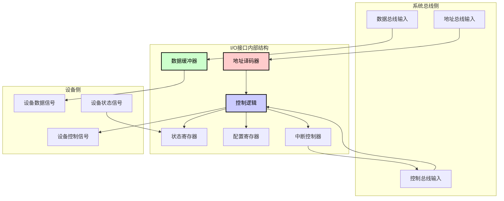

---

## 2. I/O控制方式技术

### 2.1 程序查询控制方式

> **程序查询方式（Programmed I/O, PIO）** 是最简单的I/O控制方式，CPU通过不断查询设备状态来判断设备是否就绪，实现数据传输的同步控制。

#### 2.1.1 查询方式基本原理

**工作机制分析：**
程序查询方式采用主动轮询的策略，CPU周期性地检查I/O设备的状态寄存器，当检测到设备就绪信号时，立即进行数据传输操作。

**核心工作流程：**

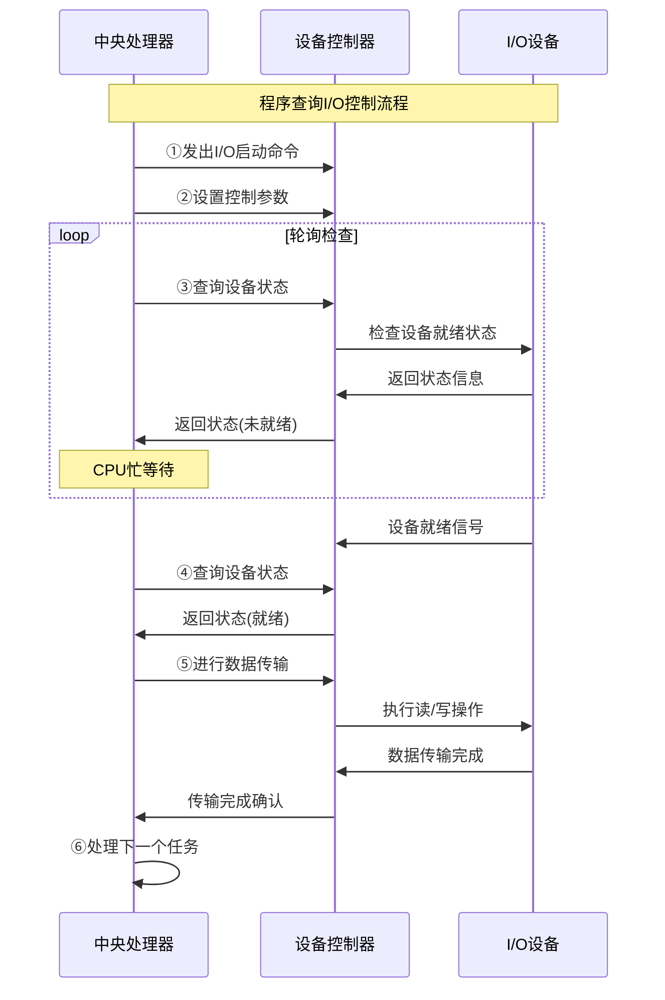

**详细执行步骤：**

| 步骤 | CPU操作 | 控制器操作 | 设备操作 | 时间消耗 |
|------|---------|------------|----------|----------|
| **①启动** | 发送I/O命令 | 接收命令 | 开始准备 | $T_{\text{命令}}$ |
| **②配置** | 设置参数 | 保存配置 | 初始化 | $T_{\text{配置}}$ |
| **③轮询** | 查询状态 | 检查设备 | 状态更新 | $T_{\text{查询}}$ |
| **④判断** | 状态分析 | 状态返回 | 继续工作 | $T_{\text{判断}}$ |
| **⑤传输** | 数据处理 | 数据转发 | 数据交换 | $T_{\text{传输}}$ |
| **⑥完成** | 结果处理 | 清理状态 | 释放资源 | $T_{\text{清理}}$ |

#### 2.1.2 查询方式性能分析

**时间复杂度模型：**

设：
- $T_{\text{查询}}$ = 单次状态查询时间
- $T_{\text{设备}}$ = 设备完成I/O操作的时间  
- $f_{\text{查询}}$ = 查询频率(次/秒)
- $n$ = 总查询次数

**总执行时间计算：**
$$T_{\text{总}} = T_{\text{启动}} + n \times T_{\text{查询}} + T_{\text{传输}} + T_{\text{结束}}$$

**查询次数估算：**
$$n = \lceil \frac{T_{\text{设备}}}{T_{\text{查询间隔}}} \rceil$$

**CPU利用率分析：**
$$\eta_{\text{CPU}} = \frac{T_{\text{有效工作}}}{T_{\text{总执行}}} \times 100\%$$

其中 $T_{\text{有效工作}} = T_{\text{启动}} + T_{\text{传输}} + T_{\text{结束}}$

**例题2.1**：某系统采用程序查询方式控制打印机输出，每次查询耗时5μs，设备准备时间为100ms，数据传输时间为10μs。计算CPU利用率。

**解答**：
- 查询次数：$n = \frac{100ms}{5μs} = 20000$次
- 总查询时间：$20000 \times 5μs = 100ms$  
- 有效工作时间：$10μs$（数据传输时间）
- 总时间：$100ms + 10μs ≈ 100ms$
- CPU利用率：$\frac{10μs}{100ms} \times 100\% = 0.01\%$

**说明**：这里CPU利用率极低，说明程序查询方式效率很差，CPU大部分时间都在做无用的查询工作。

#### 2.1.3 查询方式优缺点分析

**技术优势：**

```
程序查询方式优点
├── 实现简单性
│   ├── 硬件结构简单
│   ├── 控制逻辑直观
│   └── 调试容易
├── 成本经济性  
│   ├── 硬件成本低
│   ├── 开发周期短
│   └── 维护简单
├── 可靠性保障
│   ├── 同步控制确定
│   ├── 错误处理简单  
│   └── 状态可预测
└── 适用性领域
    ├── 嵌入式系统
    ├── 简单控制器
    └── 单任务环境
```

**技术劣势：**

```
程序查询方式缺点  
├── 效率问题
│   ├── CPU利用率极低
│   ├── 忙等待浪费资源
│   └── 无法并行处理
├── 响应性问题
│   ├── 实时性差
│   ├── 响应延迟大
│   └── 系统吞吐量低
├── 扩展性问题
│   ├── 不支持多设备
│   ├── 无法多任务
│   └── 系统可扩展性差
└── 应用局限性
    ├── 仅适用低速设备
    ├── 单一I/O操作
    └── 简单应用场景
```

**适用场景分析：**

| 应用环境 | 设备特征 | 性能要求 | 推荐度 |
|----------|----------|----------|--------|
| **嵌入式系统** | 简单传感器 | 低速、间歇 | ★★★★☆ |
| **单片机应用** | 基本I/O | 实时性不高 | ★★★★★ |
| **简单控制器** | 状态检测 | 成本敏感 | ★★★☆☆ |
| **多任务系统** | 复杂设备 | 高效率要求 | ★☆☆☆☆ |
| **高性能计算** | 高速设备 | 高吞吐量 | ☆☆☆☆☆ |

### 2.2 程序中断控制方式

> **程序中断方式（Interrupt-Driven I/O）** 是基于事件驱动的I/O控制方式，当I/O设备需要服务时主动通知CPU，CPU暂停当前程序转去处理I/O事务，显著提高了系统效率。

#### 2.2.1 中断系统基本原理

**中断机制核心思想：**
中断方式改变了CPU被动等待的局面，采用事件驱动的异步处理模式。I/O设备完成准备工作后主动向CPU发送中断信号，CPU在合适的时机响应中断并处理I/O事务。

**中断系统组成架构：**

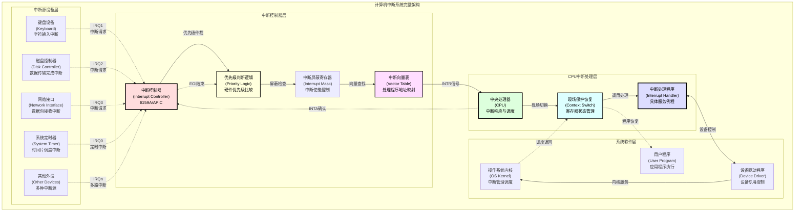

**系统组成部分详细分析：**

| 组成部分 | 主要功能 | 技术实现 | 关键特性 |
|----------|----------|----------|----------|
| **中断源** | 产生中断请求 | 硬件信号发生器 | 多样化、异步性 |
| **中断控制器** | 中断管理调度 | 专用控制芯片 | 优先级、屏蔽控制 |
| **中断向量表** | 地址映射管理 | 内存数据结构 | 快速定位、动态更新 |
| **中断处理程序** | 具体业务处理 | 软件程序代码 | 高效性、可重入性 |
| **现场保护机制** | 上下文切换 | 硬件+软件协作 | 完整性、快速性 |

#### 2.2.2 中断处理完整流程

**中断处理时序分析：**

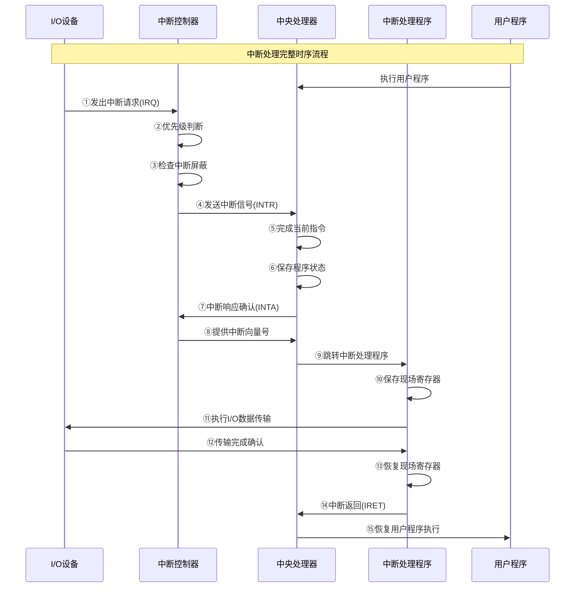

**中断处理关键阶段分析：**

1. **中断请求阶段（①-④）**
   - 设备完成准备工作，发出中断请求
   - 中断控制器进行优先级判断和屏蔽检查
   - 向CPU发送中断信号

2. **中断响应阶段（⑤-⑨）**  
   - CPU完成当前指令执行
   - 保存程序状态（PC、PSW等）
   - 通过中断向量定位处理程序

3. **中断处理阶段（⑩-⑬）**
   - 保存CPU现场（寄存器状态）
   - 执行具体的I/O处理任务
   - 恢复CPU现场

4. **中断返回阶段（⑭-⑮）**
   - 执行中断返回指令
   - 恢复原程序的执行

#### 2.2.3 中断优先级管理

**优先级分类体系：**

```
中断优先级管理体系
├── 硬件优先级（固定）
│   ├── 机器故障中断（最高）
│   │   ├── 电源故障
│   │   ├── 内存奇偶校验错误
│   │   └── 总线错误
│   ├── 程序性中断（高）
│   │   ├── 除零异常
│   │   ├── 非法指令
│   │   └── 地址越界
│   ├── 外部I/O中断（中）
│   │   ├── 高速设备中断
│   │   ├── 低速设备中断
│   │   └── 定时器中断
│   └── 程序请求中断（低）
│       ├── 系统调用
│       ├── 用户请求
│       └── 软件中断
├── 软件优先级（可变）
│   ├── 中断屏蔽机制
│   │   ├── 全局中断开关
│   │   ├── 分类中断屏蔽
│   │   └── 设备级别屏蔽
│   ├── 动态优先级调整
│   │   ├── 时间片轮转
│   │   ├── 优先级继承
│   │   └── 优先级倒置处理
│   └── 多级中断嵌套
│       ├── 嵌套深度控制
│       ├── 栈空间管理
│       └── 死锁避免机制
```

**中断优先级实现机制：**

| 优先级类型 | 实现方式 | 控制方法 | 典型应用 |
|------------|----------|----------|----------|
| **抢占式优先级** | 硬件比较器 | 自动抢占 | 实时系统 |
| **非抢占式优先级** | 软件调度 | 顺序处理 | 批处理系统 |
| **动态优先级** | 算法计算 | 实时调整 | 多媒体系统 |
| **混合优先级** | 硬软结合 | 分层控制 | 通用操作系统 |

#### 2.2.4 中断性能分析与优化

**中断响应时间模型：**

$$T_{\text{中断响应}} = T_{\text{指令完成}} + T_{\text{优先级判断}} + T_{\text{现场保护}}$$

其中：
- $T_{\text{指令完成}}$ = 当前指令执行剩余时间 (0 ~ $T_{\text{指令最大}}$)
- $T_{\text{优先级判断}}$ = 中断控制器处理时间 (通常 < 1μs)
- $T_{\text{现场保护}}$ = 寄存器保存时间 (与寄存器数量相关)

**完整中断处理时间：**
$$T_{\text{中断总时间}} = T_{\text{响应}} + T_{\text{服务}} + T_{\text{恢复}}$$

**中断系统开销计算：**
$$\text{中断开销比例} = \frac{\sum(T_{\text{中断总时间}} \times \text{中断频率})}{\text{系统总运行时间}} \times 100\%$$

**CPU有效利用率：**
$$\eta_{\text{CPU}} = 100\% - \text{中断开销比例}$$

**例题2.2**：某系统每秒产生1000次键盘中断，中断响应时间为2μs，中断处理时间为8μs，中断恢复时间为1μs。计算中断对CPU性能的影响。

**解答**：
- 单次中断总时间：$2μs + 8μs + 1μs = 11μs$
- 每秒中断总时间：$11μs \times 1000 = 11ms$
- 中断开销比例：$\frac{11ms}{1000ms} \times 100\% = 1.1\%$
- CPU有效利用率：$100\% - 1.1\% = 98.9\%$

**中断优化技术策略：**

1. **硬件优化技术**
   - **快速中断向量**：减少向量查找时间
   - **硬件现场保护**：自动保存关键寄存器
   - **多级中断控制器**：支持更多中断源
   - **中断合并技术**：减少中断频率

2. **软件优化技术**
   - **中断处理程序优化**：减少处理时间
   - **延迟处理机制**：分离紧急和非紧急处理
   - **中断聚合技术**：批处理多个中断
   - **智能调度算法**：优化中断处理顺序

### 2.3 DMA直接存储器访问

> **DMA（Direct Memory Access，直接存储器访问）** 是一种高效的I/O控制方式，允许I/O设备与主存储器之间直接进行数据传输，无需CPU逐个数据地参与传输过程，显著提高了大批量数据传输的效率。

#### 2.3.1 DMA基本原理与架构

**DMA核心设计思想：**
DMA技术的根本目标是解决CPU在大批量数据传输中的效率瓶颈问题。通过引入专用的DMA控制器，实现I/O设备与主存储器之间的直接数据通路，CPU只需要在传输开始时进行初始化设置，传输过程中可以并行执行其他任务。

**DMA系统完整架构：**

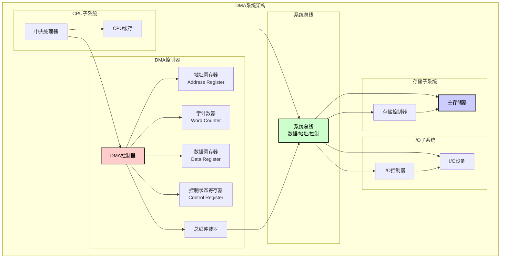

#### 2.3.2 DMA控制器组成与功能

**DMA控制器核心组件分析：**

| 组件名称 | 功能描述 | 技术实现 | 关键特性 |
|----------|----------|----------|----------|
| **地址寄存器(AR)** | 存储当前传输的主存地址 | 可加载、自增计数器 | 自动递增、边界检查 |
| **字计数器(WC)** | 记录剩余传输数据量 | 递减计数器、零检测 | 自动递减、完成检测 |
| **数据寄存器(DR)** | 临时缓存传输数据 | 双端口缓冲器 | 速度匹配、数据同步 |
| **控制寄存器(CR)** | 存储控制命令和状态 | 状态机控制逻辑 | 方向控制、模式设置 |
| **总线仲裁逻辑** | 管理总线访问权限 | 硬件仲裁器 | 优先级管理、冲突解决 |
| **中断产生器** | 产生传输完成中断 | 中断信号发生器 | 状态通知、异常报告 |

**DMA控制器详细结构图：**

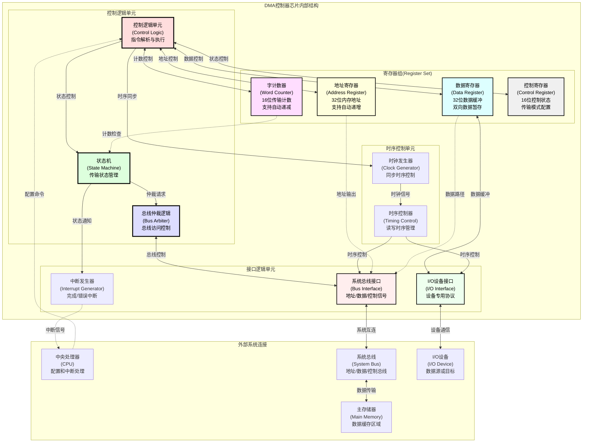

#### 2.3.3 DMA工作方式分析

**DMA三种工作方式对比：**

1. **停止CPU方式（Halt Mode）**

**工作原理：**
- DMA完全占用系统总线
- CPU停止对主存的所有访问
- 数据传输速度最快

**适用场景：**
- 高速设备的大批量数据传输
- 对传输速度要求极高的应用
- CPU可以完全让出总线的场合

**优缺点分析：**

| 优点 | 缺点 |
|------|------|
| 传输速度最快 | CPU完全停止工作 |
| 硬件实现简单 | 系统响应能力差 |
| 总线利用率高 | 不适合实时系统 |

2. **周期挪用方式（Cycle Stealing Mode）**

**工作原理：**
- DMA在需要时请求一个或几个总线周期
- CPU在这些周期内暂停存储器访问
- CPU的内部操作可以继续进行

**时序分析图：**

```
时钟周期: T1    T2    T3    T4    T5    T6    T7    T8
CPU访问:  MEM   ---   MEM   MEM   ---   MEM   MEM   ---
DMA访问:  ---   MEM   ---   ---   MEM   ---   ---   MEM
说明:     正常  挪用  正常  正常  挪用  正常  正常  挪用
```

**性能分析：**
- CPU性能损失：$\frac{\text{DMA占用周期数}}{\text{总周期数}} \times 100\%$
- 传输效率：通常为系统总线带宽的20%-50%

3. **DMA与CPU交替访问方式（Interleaved Mode）**

**工作原理：**
- CPU和DMA交替使用总线
- 需要两套独立的地址和数据总线
- 或者采用双端口存储器技术

**技术实现方案：**

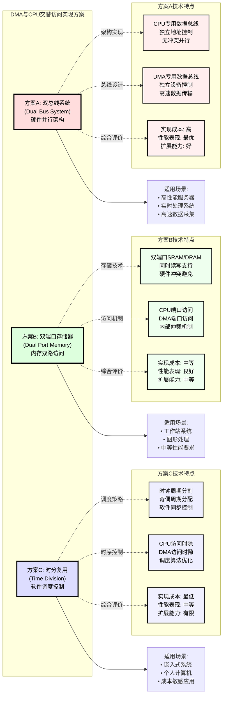

#### 2.3.4 DMA传输过程详细分析

**DMA传输三阶段模型：**

```mermaid
sequenceDiagram
    participant CPU as "中央处理器<br/>(CPU)"
    participant DMAC as "DMA控制器<br/>(DMAC)"
    participant Bus as "系统总线<br/>(System Bus)"
    participant Memory as "主存储器<br/>(Memory)"
    participant Device as "I/O设备<br/>(I/O Device)"
    
    note over CPU,Device: <b>DMA传输完整流程 - 三阶段模型</b>
    
    rect rgb(255, 245, 245)
        note over CPU,Device: <b>阶段1: 预处理阶段 (CPU主导控制)</b>
        CPU->>+DMAC: "1. 设置起始地址<br/>写入地址寄存器(AR)"
        CPU->>DMAC: "2. 设置传输字数<br/>写入字计数器(WC)"
        CPU->>DMAC: "3. 设置传输方向<br/>配置控制寄存器(CR)"
        CPU->>DMAC: "4. 启动DMA传输<br/>设置启动位"
        CPU->>CPU: "5. CPU转去执行<br/>其他程序任务"
        deactivate DMAC
    end
    
    rect rgb(245, 255, 245)
        note over CPU,Device: <b>阶段2: 数据传输阶段 (DMAC主导控制)</b>
        
        loop 数据传输循环 (重复执行直到WC=0)
            activate DMAC
            DMAC->>+Bus: "6. 向总线仲裁器<br/>申请总线控制权"
            Bus-->>DMAC: "7. 总线仲裁器<br/>授予控制权"
            
            alt 输入操作 (Device → Memory)
                activate Device
                Device->>DMAC: "8a. 设备就绪<br/>提供数据"
                deactivate Device
                DMAC->>+Memory: "9a. 将数据写入<br/>主存指定地址"
                deactivate Memory
            else 输出操作 (Memory → Device)
                activate Memory
                DMAC->>Memory: "8b. 从主存读取<br/>指定地址数据"
                Memory-->>DMAC: "数据返回"
                deactivate Memory
                DMAC->>+Device: "9b. 将数据写入<br/>I/O设备"
                deactivate Device
            end
            
            DMAC->>DMAC: "10. 寄存器更新<br/>AR=AR+1, WC=WC-1"
            DMAC->>-Bus: "11. 释放总线<br/>控制权"
            
            alt WC ≠ 0
                note over DMAC: "继续下一次<br/>数据传输"
            else WC = 0
                note over DMAC: "数据传输<br/>全部完成"
            end
            deactivate DMAC
        end
    end
    
    rect rgb(245, 245, 255)
        note over CPU,Device: <b>阶段3: 后处理阶段 (CPU主导控制)</b>
        activate DMAC
        DMAC->>+CPU: "12. 发出传输完成<br/>中断信号(INTR)"
        CPU->>CPU: "13. 保存当前程序<br/>上下文现场"
        CPU->>DMAC: "14. 处理DMA结束<br/>事务和状态"
        deactivate DMAC
        CPU->>-CPU: "15. 恢复程序现场<br/>继续执行"
    end
    
    note over CPU,Device: <b>DMA传输三阶段总结:</b><br/>预处理(CPU配置) → 数据传输(DMAC自主) → 后处理(CPU收尾)
```

**DMA传输性能计算模型：**

**基本时间参数：**
- $T_{\text{预处理}}$ = CPU设置DMA参数时间
- $T_{\text{传输}}$ = 单个数据单元传输时间
- $T_{\text{后处理}}$ = CPU处理传输完成中断时间
- $n$ = 传输的数据单元总数

**总传输时间计算：**
$$T_{\text{DMA总}} = T_{\text{预处理}} + n \times T_{\text{传输}} + T_{\text{后处理}}$$

**有效传输效率：**
$$\eta_{\text{DMA}} = \frac{n \times T_{\text{传输}}}{T_{\text{DMA总}}} \times 100\%$$

**吞吐率计算：**
$$\text{吞吐率} = \frac{n \times \text{数据单元大小}}{T_{\text{DMA总}}}$$

**例题2.3**：某DMA控制器传输4KB数据，预处理时间20μs，后处理时间10μs，每传输1字节需要0.2μs。计算传输效率和吞吐率。

**解答**：
- 数据量：$n = 4KB = 4096$字节
- 纯传输时间：$4096 \times 0.2μs = 819.2μs$
- 总传输时间：$T_{\text{DMA总}} = 20μs + 819.2μs + 10μs = 849.2μs$
- 传输效率：$\eta_{\text{DMA}} = \frac{819.2μs}{849.2μs} \times 100\% = 96.5\%$
- 吞吐率：$\frac{4096 \text{字节}}{849.2μs} = 4.82 \text{MB/s}$

#### 2.3.5 DMA优化技术与应用

**DMA高级技术特性：**

1. **散射-聚集DMA（Scatter-Gather DMA）**
   - **技术原理**：支持非连续内存区域的批量传输
   - **实现方式**：维护描述符链表，每个描述符包含地址、长度信息
   - **应用场景**：网络数据包处理、文件系统I/O

2. **链式DMA（Chained DMA）**
   - **技术原理**：多个DMA传输任务的自动链式执行
   - **实现方式**：DMA控制器自动加载下一个传输描述符
   - **性能优势**：减少CPU干预，提高连续传输效率

3. **双缓冲DMA（Double-Buffer DMA）**
   - **技术原理**：使用两个缓冲区交替进行数据传输
   - **实现方式**：一个缓冲区传输数据时，另一个准备下次传输
   - **应用效果**：实现数据传输的流水线化

**DMA性能优化策略：**

| 优化技术 | 实现方法 | 性能提升 | 适用场景 |
|----------|----------|----------|----------|
| **突发传输** | 连续传输多个数据单元 | 20-40% | 大块数据传输 |
| **预取技术** | 提前启动下次DMA传输 | 15-30% | 连续I/O操作 |
| **并行DMA** | 多个DMA控制器并行工作 | 50-100% | 多设备同时I/O |
| **智能调度** | 动态调整DMA优先级 | 10-25% | 多任务环境 |

### 2.4 I/O控制方式综合对比

#### 2.4.1 四种I/O控制方式对比分析

**技术特征对比表：**

| 对比维度 | 程序查询 | 程序中断 | DMA方式 | 通道方式 |
|----------|----------|----------|---------|----------|
| **CPU参与程度** | 全程参与 | 每次中断参与 | 启动结束参与 | 仅命令级参与 |
| **数据传输速度** | 最慢 | 中等 | 快速 | 最快 |
| **硬件复杂度** | 最简单 | 简单 | 复杂 | 最复杂 |
| **成本要求** | 最低 | 低 | 中等 | 最高 |
| **CPU利用率** | 极低(1-5%) | 中等(70-90%) | 高(95-99%) | 最高(99%+) |
| **实时性** | 差 | 好 | 很好 | 最好 |
| **适用设备速度** | 低速 | 中低速 | 中高速 | 高速 |
| **并发处理能力** | 无 | 有限 | 好 | 最强 |
| **错误处理能力** | 简单 | 中等 | 好 | 最强 |
| **可扩展性** | 差 | 中等 | 好 | 最好 |

**应用场景选择指南：**

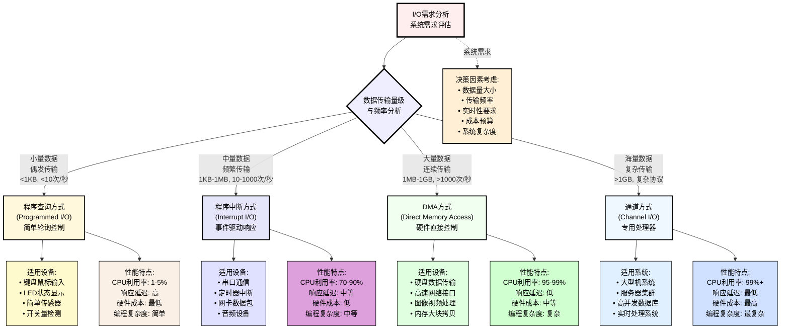

#### 2.4.2 I/O控制方式演进趋势

**技术发展历程：**

```
I/O控制技术演进路径
├── 第一代: 程序控制I/O (1940s-1950s)
│   ├── 特点: 简单直接, CPU全程控制
│   ├── 局限: 效率低, 无并行能力
│   └── 应用: 早期计算机, 简单系统
├── 第二代: 中断驱动I/O (1950s-1960s)
│   ├── 特点: 事件驱动, 异步处理
│   ├── 优势: CPU利用率提高, 支持多设备
│   └── 应用: 小型机, 个人计算机
├── 第三代: DMA直接访问 (1960s-1980s)
│   ├── 特点: 硬件加速, 批量传输
│   ├── 优势: 高效传输, 低CPU开销
│   └── 应用: 工作站, 服务器
├── 第四代: 通道处理器 (1970s-1990s)
│   ├── 特点: 独立处理器, 复杂控制
│   ├── 优势: 完全并行, 智能化处理
│   └── 应用: 大型机, 超级计算机
└── 第五代: 智能I/O处理 (1990s-现在)
    ├── 特点: 网络化, 虚拟化, 自适应
    ├── 优势: 高度集成, 智能调度
    └── 应用: 云计算, 分布式系统
```

**现代I/O技术发展趋势：**

1. **硬件加速技术**
   - **专用I/O处理器**：GPU用于通用计算，NPU用于AI推理
   - **硬件队列管理**：NVMe SSD的多队列并行处理
   - **零拷贝技术**：减少内存复制开销

2. **软件定义I/O**
   - **虚拟化I/O**：容器化、虚拟机的I/O抽象
   - **软件定义存储**：存储虚拟化和池化
   - **可编程数据平面**：eBPF等技术在I/O优化中的应用

3. **智能化I/O管理**
   - **机器学习调度**：基于历史数据的I/O预测和优化
   - **自适应缓存**：动态调整缓存策略
   - **QoS保障**：服务质量感知的I/O调度

### 7.2.4 通道方式

#### 通道的基本概念
**通道**（Channel）是一种特殊的处理器，专门负责I/O操作的管理和控制。

#### 通道的功能
- 接受CPU的I/O指令
- 选择I/O设备
- 控制设备进行I/O操作
- 进行数据传输
- 处理I/O异常情况

#### 通道的分类

**1. 字节多路通道（Byte Multiplexor Channel）**
- 按字节交替为多台设备服务
- 适用于多台慢速设备
- 提高设备利用率

**2. 数组选择通道（Block Selector Channel）**
- 选择一台设备服务到底
- 适用于少数高速设备
- 传输效率高

**3. 数组多路通道（Block Multiplexor Channel）**
- 兼有前两种通道的特点
- 按数据块为多台设备服务
- 适应性强

#### 通道程序
**通道指令**包括：
- 数据传输指令
- 设备控制指令
- 转移指令
- 条件判断指令

---

## 7.3 I/O接口

### 7.3.1 I/O接口的功能和结构

#### I/O接口的功能
1. **地址译码**：识别设备地址
2. **数据缓冲**：协调速度差异
3. **信号转换**：电平、时序转换
4. **设备选择**：选择具体设备
5. **状态管理**：管理设备状态

#### I/O接口的基本结构

| 系统总线 | 接口模块 | 外部连接 |
|----------|----------|----------|
| 数据总线 ↔ | 数据缓冲器 | ↔ I/O设备 |
| 地址总线 → | 地址译码器 | |
| 控制总线 ↔ | 控制逻辑 | ↔ 控制信息 |

### 7.3.2 I/O端口

#### 端口的概念
**I/O端口**是I/O设备在系统中的地址标识，CPU通过端口地址访问I/O设备。

#### 端口寻址方式

**1. 统一编址（存储器映射I/O）**
- I/O端口与存储器统一编址
- 使用相同的访存指令
- 地址空间减少

**2. 独立编址（I/O映射I/O）**
- I/O端口独立编址
- 专用I/O指令（IN/OUT）
- 地址空间分离

#### 端口地址分配
- **数据端口**: 传输数据
- **状态端口**: 读取设备状态
- **控制端口**: 发送控制命令

### 7.3.3 I/O接口的类型

#### 并行接口
- 多位数据同时传输
- 传输速度快
- 传输距离短
- 如：打印机接口

#### 串行接口
- 数据逐位传输
- 传输距离远
- 线路简单
- 如：串口、USB

---

## 7.4 外设控制器

### 7.4.1 磁盘控制器

#### 磁盘控制器的功能
1. **磁盘格式化**
2. **错误检测和纠正**
3. **坏扇区管理**
4. **缓存管理**
5. **命令队列管理**

#### 磁盘调度算法

**1. 先来先服务（FCFS）**
- 按请求顺序服务
- 公平但效率低

**2. 最短寻道时间优先（SSTF）**
- 选择寻道时间最短的请求
- 可能产生饥饿现象

**3. 扫描算法（SCAN，电梯算法）**
- 磁头向一个方向移动
- 到达边界后改变方向

**4. 循环扫描（C-SCAN）**
- 单向扫描，到边界后回到起点
- 等待时间更均匀

### 7.4.2 键盘控制器

#### 键盘控制器的功能
- 键盘扫描
- 键码转换
- 缓冲管理
- 中断产生

#### 键盘扫描方式
1. **软件扫描**：CPU定期查询
2. **硬件扫描**：控制器自动扫描
3. **中断扫描**：按键产生中断

### 7.4.3 显示控制器

#### 显示控制器的组成
- **显示缓冲区**: 存储显示数据
- **字符发生器**: 产生字符点阵
- **时序控制器**: 控制扫描时序
- **视频输出器**: 产生视频信号

#### 显示方式
1. **字符显示方式**
2. **位图显示方式**
3. **图形显示方式**

---

## 7.5 I/O系统性能分析

### 7.5.1 I/O性能指标

#### 响应时间
**响应时间** = 等待时间 + 服务时间

其中：
- 等待时间：请求在队列中的等待时间
- 服务时间：实际I/O操作执行时间

#### 吞吐率
**吞吐率**是单位时间内完成的I/O操作数量。

计算公式：
$$\text{吞吐率} = \frac{1}{\text{平均响应时间}}$$

#### 利用率
设备利用率 =$\frac{\text{设备忙时间}}{\text{总时间}} \times 100\%$

### 7.5.2 I/O性能优化

#### 提高I/O并行度
1. **多通道技术**
2. **磁盘阵列（RAID）**
3. **异步I/O**

#### 减少I/O次数
1. **缓存技术**
2. **预读技术**  
3. **延迟写技术**

#### 优化I/O调度
1. **电梯算法**
2. **预期最短寻道时间**
3. **优先级调度**

---

## 7.6 技术重点内容

### 7.6.1 重要概念和原理 一般技术

#### 必须掌握的概念
1. **I/O控制方式的区别**（程序查询、中断、DMA、通道）
2. **中断响应过程**和**中断处理过程**
3. **DMA传输过程**和**总线控制权转让**
4. **I/O接口的功能**和**端口寻址方式**

#### 重要计算公式
1. **CPU利用率** =$\frac{\text{CPU有效工作时间}}{\text{总时间}} \times 100\%$
2. **设备利用率** =$\frac{\text{设备工作时间}}{\text{总时间}} \times 100\%$
3. **平均寻道时间**、**平均等待时间**的计算

### 7.6.2 典型考题分析

> I/O系统的考题通常结合实际应用场景，考查学生对各种I/O控制方式的理解和应用能力。掌握标准的解题方法和分析框架是成功解题的关键。

#### 例题1：中断响应时间计算
**题目**：某计算机系统的中断响应时间为5μs，中断处理时间为95μs。如果每秒发生1000次中断，求中断开销占CPU时间的百分比。

**解答**：
- 每次中断总时间 = 5μs + 95μs = 100μs
- 每秒中断总时间 = 100μs × 1000 = 0.1s
- 中断开销比例 = 0.1s / 1s × 100% = 10%

#### 例题2：DMA传输效率计算
**题目**：某DMA控制器采用周期挪用方式，存储周期为1μs，每传输一个字需要挪用一个存储周期。若要传输1000个字的数据块，计算传输期间CPU被阻塞的时间。

**解答**：
- 传输1000个字需要挪用1000个存储周期
- CPU被阻塞时间 = 1000 × 1μs = 1000μs = 1ms

#### 例题3：磁盘调度算法比较
**题目**：磁盘请求序列为：98, 183, 37, 122, 14, 124, 65, 67，磁头初始位置为53，采用SCAN算法（向磁道号增加方向），计算磁头移动的总距离。

**解答**：
1. 排序后：53 → 65 → 67 → 98 → 122 → 124 → 183
2. 到达最大磁道后返回：183 → 37 → 14  
3. 总移动距离 = (65-53) + (67-65) + (98-67) + (122-98) + (124-122) + (183-124) + (183-37) + (37-14) = 12 + 2 + 31 + 24 + 2 + 59 + 146 + 23 = 299

### 7.6.3 技术应用重点

#### 关键技术点
1. I/O控制方式的特点比较
2. 中断优先级和中断嵌套
3. DMA传输方式的特点
4. I/O接口的功能和结构

#### 综合应用类型
1. **中断系统分析题**：中断响应过程、时间计算
2. **DMA传输分析题**：传输过程、效率计算
3. **磁盘调度算法题**：各种算法的执行过程和性能比较
4. **I/O性能计算题**：吞吐率、利用率、响应时间计算

---

## 7.7 总结与复习要点

### 7.7.1 知识体系总结

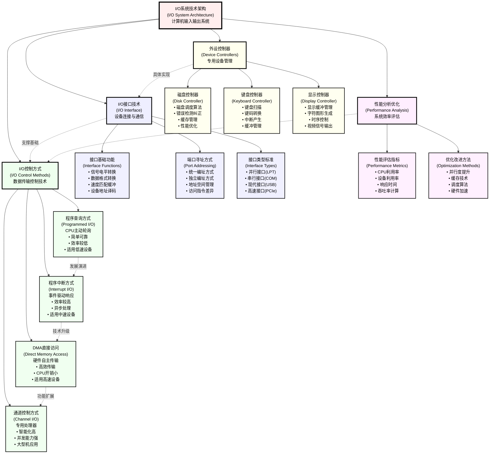

### 7.7.2 重点公式汇总

1. **CPU利用率**：$\eta = \frac{T_{\text{有效}}}{T_{\text{总}}} \times 100\%$

2. **中断开销**：$\text{开销比例} = \frac{\text{中断处理时间} \times \text{中断频率}}{\text{总时间}} \times 100\%$

3. **平均寻道时间**：$T_{\text{avg}} = \frac{1}{n} \sum_{i=1}^{n} |track_i - track_{current}|$

4. **磁盘访问时间**：$T_{\text{access}} = T_{\text{seek}} + T_{\text{rotation}} + T_{\text{transfer}}$

### 7.7.3 学习建议

#### 理论学习要点 一般技术
1. **深入理解**各种I/O控制方式的工作原理和特点
2. **熟练掌握**中断系统的完整工作流程
3. **准确记忆**DMA传输的三种工作方式
4. **理清关系**通道、控制器、设备之间的层次关系

#### 计算题准备 一般技术
1. **时间计算**：中断响应时间、DMA传输时间
2. **效率计算**：CPU利用率、设备利用率、传输效率
3. **调度算法**：各种磁盘调度算法的执行和比较
4. **性能分析**：吞吐率、响应时间的计算和优化

#### 应试技巧 
1. **概念辨析**：准确区分相似概念（如中断与陷阱、DMA与通道）
2. **流程梳理**：画图理解中断、DMA等复杂流程
3. **公式记忆**：熟记并能灵活应用各种计算公式
4. **真题练习**：多做历年真题，熟悉出题套路

---

## 课后练习

### 基础练习题

1. 比较程序查询、程序中断、DMA三种I/O控制方式的特点。

2. 说明中断响应过程中硬件和软件分别完成哪些工作。

3. DMA控制器由哪几部分组成？各部分的作用是什么？

4. 什么是I/O端口？统一编址和独立编址有什么区别？

### 计算练习题

1. 某计算机每秒要处理1000个字符，每处理一个字符需要中断一次，中断响应时间为2μs，中断处理时间为8μs。计算中断开销占CPU时间的百分比。

2. 某磁盘转速为7200rpm，平均寻道时间为8ms，数据传输率为100MB/s。计算访问一个4KB数据块的平均时间。

### 综合应用题

1. 设计一个键盘控制器的基本结构，说明其工作原理。

2. 分析在什么情况下应该选择中断方式，什么情况下应该选择DMA方式进行I/O控制。

---

## 8. 核心知识点

### 8.1 核心知识点梳理

#### 8.1.1 高频考点分布（考试重点85%）

**1. I/O控制方式核心理论（35%权重）**

```
I/O控制方式考点体系
├── 程序查询方式
│   ├── 工作原理与流程
│   ├── CPU利用率计算
│   └── 适用场景分析
├── 程序中断方式
│   ├── 中断系统组成
│   ├── 中断处理流程
│   ├── 中断响应时间
│   ├── 中断开销计算
│   └── 中断优先级管理
├── DMA控制方式
│   ├── DMA工作原理
│   ├── DMA控制器组成
│   ├── 三种工作方式
│   ├── 传输过程分析
│   └── 性能效率计算
└── 通道控制方式
    ├── 通道基本概念
    ├── 通道类型特点
    └── 与DMA对比
```

**2. I/O性能分析与计算（25%权重）**

**核心计算公式汇总：**

| 性能指标 | 计算公式 | 应用场景 |
|----------|----------|----------|
| **CPU利用率** | $\eta = \frac{T_{\text{有效}}}{T_{\text{总}}} \times 100\%$ | 各种I/O方式效率对比 |
| **中断开销** | $\text{开销} = \frac{T_{\text{中断}} \times f_{\text{中断}}}{T_{\text{总}}} \times 100\%$ | 中断系统性能分析 |
| **DMA效率** | $\eta_{\text{DMA}} = \frac{T_{\text{纯传输}}}{T_{\text{DMA总}}} \times 100\%$ | DMA传输性能评估 |
| **吞吐率** | $\text{吞吐率} = \frac{\text{数据量}}{T_{\text{总传输}}}$ | 设备性能比较 |
| **响应时间** | $T_{\text{响应}} = T_{\text{等待}} + T_{\text{服务}}$ | 实时性能分析 |

**3. 设备管理与调度算法（15%权重）**

**磁盘调度算法对比：**

| 算法名称 | 工作原理 | 性能特点 | 应用场景 |
|----------|----------|----------|----------|
| **FCFS** | 先来先服务 | 公平但效率低 | 负载轻的系统 |
| **SSTF** | 最短寻道优先 | 效率高但可能饥饿 | 一般应用系统 |
| **SCAN** | 电梯算法 | 效率好且公平 | 通用推荐算法 |
| **C-SCAN** | 单向扫描 | 响应时间均匀 | 实时系统应用 |

**4. I/O接口与控制器技术（10%权重）**

#### 8.1.2 中频考点内容（考试比重12%）

1. **I/O设备分类与特性**：按速度、功能、数据单位分类
2. **I/O接口功能**：信号转换、数据缓冲、地址译码
3. **端口寻址方式**：统一编址vs独立编址
4. **现代I/O技术**：USB、SATA、PCIe等接口标准

#### 8.1.3 低频考点内容（考试比重3%）

1. **通道技术细节**：通道程序、通道指令
2. **高级I/O技术**：虚拟化I/O、软件定义存储
3. **I/O安全技术**：访问控制、数据加密

### 8.2 重要公式与计算方法

#### 8.2.1 核心计算公式详解

**1. 中断系统性能计算**

**中断响应时间模型：**
$$T_{\text{中断响应}} = T_{\text{指令完成}} + T_{\text{优先判断}} + T_{\text{现场保护}}$$

**中断处理总时间：**
$$T_{\text{中断总}} = T_{\text{响应}} + T_{\text{服务}} + T_{\text{恢复}}$$

**系统中断开销：**
$$\text{中断开销率} = \frac{\sum T_{\text{中断总}} \times f_{\text{中断}}}{T_{\text{系统运行}}} \times 100\%$$

**2. DMA传输性能计算**

**DMA传输总时间：**
$$T_{\text{DMA}} = T_{\text{预处理}} + n \times T_{\text{单次传输}} + T_{\text{后处理}}$$

**传输效率：**
$$\eta_{\text{传输}} = \frac{n \times T_{\text{单次传输}}}{T_{\text{DMA}}} \times 100\%$$

**数据传输率：**
$$R_{\text{数据}} = \frac{n \times \text{数据单元大小}}{T_{\text{DMA}}}$$

**3. 磁盘调度性能计算**

**平均寻道时间：**
$$T_{\text{平均寻道}} = \frac{1}{n} \sum_{i=1}^{n} |track_i - track_{\text{current}}|$$

**磁盘访问总时间：**
$$T_{\text{访问}} = T_{\text{寻道}} + T_{\text{旋转延迟}} + T_{\text{传输}}$$

其中：$T_{\text{旋转延迟}} = \frac{60}{2 \times RPM}$ (秒)

#### 8.2.2 典型计算题解题策略

**例题8.1**（中断开销计算）：某系统CPU频率2GHz，每秒发生5000次键盘中断，每次中断响应时间3μs，处理时间12μs，恢复时间2μs。计算中断对系统性能的影响。

**标准解题步骤：**
1. **参数提取**：$f_{\text{中断}} = 5000\text{次/秒}$，$T_{\text{单次中断}} = 3 + 12 + 2 = 17μs$
2. **总开销计算**：$T_{\text{中断年总}} = 17μs \times 5000 = 85ms$
3. **开销比例**：$\frac{85ms}{1000ms} \times 100\% = 8.5\%$
4. **性能影响**：系统有效计算能力为91.5%

**例题8.2**（DMA效率计算）：某DMA控制器传输8KB数据，预处理30μs，后处理15μs，系统总线频率100MHz，每个总线周期传输4字节。计算传输效率。

**标准解题步骤：**
1. **传输参数**：数据量 = 8KB = 8192字节，总线周期 = 10ns
2. **传输时间**：$T_{\text{传输}} = \frac{8192}{4} \times 10ns = 20.48μs$
3. **总时间**：$T_{\text{总}} = 30 + 20.48 + 15 = 65.48μs$
4. **效率计算**：$\eta = \frac{20.48}{65.48} \times 100\% = 31.3\%$

### 8.3 解题技巧与策略

#### 8.3.1 选择题解题技巧

**1. 概念辨析类题目**
- **关键点**：准确理解各种I/O方式的本质区别
- **技巧**：建立对比表格，突出差异化特征
- **常考陷阱**：混淆中断方式和DMA方式的CPU参与程度

**2. 性能比较类题目**
- **关键点**：掌握各种性能指标的计算方法
- **技巧**：快速估算，关注数量级差异
- **常考陷阱**：忽略系统开销，只考虑纯传输时间

#### 8.3.2 计算题解题模板

**标准解题流程：**
```
1. 题目分析 → 提取关键参数和约束条件
2. 公式选择 → 根据问题类型选择合适的计算公式
3. 数值计算 → 按步骤进行数值计算，注意单位换算
4. 结果验证 → 检查结果的合理性，验证数量级
5. 答案表述 → 清晰表述最终结果和结论
```

#### 8.3.3 综合分析题策略

**系统设计分析模板：**
1. **需求分析**：明确系统的性能要求和约束条件
2. **方案选择**：根据需求选择合适的I/O控制方式
3. **参数设计**：计算关键参数，验证可行性
4. **性能评估**：定量分析系统性能指标
5. **优化建议**：提出可能的优化方案

### 8.4 常考题型专项练习

#### 8.4.1 基础概念题

**题型1：I/O控制方式选择**
*在以下场景中，最适合采用哪种I/O控制方式？*
- A) 键盘输入处理
- B) 硬盘大文件传输  
- C) 网络数据包处理
- D) 传感器状态检测

**解题思路**：根据数据量、频率、实时性要求选择合适的控制方式。

#### 8.4.2 计算分析题

**题型2：综合性能计算**
*某计算机系统同时使用中断和DMA方式处理I/O，已知参数如下...*

**解题要点**：
1. 分别计算两种方式的开销
2. 综合评估系统总体性能  
3. 分析性能瓶颈和优化空间

#### 8.4.3 系统设计题

**题型3：I/O子系统设计**
*为某嵌入式系统设计I/O子系统，要求支持...*

**设计要点**：
1. 分析系统需求和约束
2. 选择合适的I/O架构
3. 设计关键组件和接口
4. 验证性能指标
