# 8 指令流水线

## 导航目录

1. [流水线基础原理](#1-流水线基础原理)
2. [流水线冲突与解决方案](#2-流水线冲突与解决方案)
3. [流水线性能分析](#3-流水线性能分析)
4. [高级流水线技术](#4-高级流水线技术)
5. [现代处理器流水线](#5-现代处理器流水线)
6. [流水线设计实例](#6-流水线设计实例)
7. [典型例题解析](#7-典型例题解析)
8. [核心知识点梳理](#8-核心知识点梳理)

## 知识架构

```
指令流水线技术架构
├── 流水线基础理论
│   ├── 流水线基本概念
│   │   ├── 流水线思想与原理
│   │   ├── 流水线分类体系
│   │   └── 流水线性能模型
│   ├── 经典流水线设计
│   │   ├── 五级流水线结构
│   │   ├── 流水线寄存器设计
│   │   └── 控制信号传递机制
│   └── 流水线实现技术
│       ├── 数据通路设计
│       ├── 时序控制机制
│       └── 异常处理机制
├── 流水线冲突理论
│   ├── 结构冲突分析
│   │   ├── 硬件资源冲突
│   │   ├── 存储器访问冲突
│   │   └── 功能单元冲突
│   ├── 数据冲突处理
│   │   ├── RAW冲突机制
│   │   ├── WAR冲突分析
│   │   ├── WAW冲突处理
│   │   └── 数据转发技术
│   ├── 控制冲突解决
│   │   ├── 分支冲突原理
│   │   ├── 分支预测技术
│   │   ├── 延迟槽技术
│   │   └── 投机执行技术
│   └── 冲突检测算法
│       ├── 硬件检测机制
│       ├── 软件检测算法
│       └── 混合检测策略
├── 流水线性能优化
│   ├── 性能指标体系
│   │   ├── 吞吐率计算模型
│   │   ├── 加速比分析方法
│   │   └── 效率评估技术
│   ├── 性能优化技术
│   │   ├── 编译器优化技术
│   │   ├── 硬件优化方法
│   │   └── 系统级优化策略
│   └── 性能瓶颈分析
│       ├── 冲突频率统计
│       ├── 性能损失定量分析
│       └── 优化效果评估
├── 高级流水线技术
│   ├── 超标量处理器
│   │   ├── 多发射流水线
│   │   ├── 动态调度技术
│   │   └── 乱序执行机制
│   ├── 超流水线技术
│   │   ├── 深度流水线设计
│   │   ├── 时钟频率优化
│   │   └── 功耗控制技术
│   ├── VLIW架构技术
│   │   ├── 静态指令调度
│   │   ├── 编译器优化技术
│   │   └── 指令并行性挖掘
│   └── 多线程处理器
│       ├── 细粒度多线程
│       ├── 粗粒度多线程
│       └── 同时多线程技术
└── 现代流水线发展
    ├── 分支预测技术
    │   ├── 静态预测算法
    │   ├── 动态预测技术
    │   └── 混合预测策略
    ├── 乱序执行技术
    │   ├── Tomasulo算法
    │   ├── 记分板算法
    │   └── 重排序缓冲技术
    └── 现代处理器发展
        ├── 多核处理器
        ├── 专用加速器
        └── 异构计算架构
```
  
---

## 1. 流水线基础原理

### 1.1 流水线基本概念与分类

> **指令流水线（Instruction Pipeline）** 是现代处理器实现指令级并行的核心技术，通过将指令执行过程分解为多个功能段，使多条指令能够在不同阶段同时执行，从而显著提高处理器的指令吞吐率和整体性能。

#### 1.1.1 流水线基本思想与工作原理

**流水线设计哲学：**
流水线技术借鉴了工业生产中流水线作业的思想，将复杂的指令执行过程分解为若干个相对独立的功能段（流水段），每个功能段完成指令执行的一个特定步骤。通过在不同功能段之间插入流水线寄存器，实现指令的流水化处理。

**经典对比分析：**


```mermaid
graph TD
    subgraph sequential ["传统顺序执行方式"]
        A1["指令1完整执行"]
        A2["指令2完整执行"] 
        A3["指令3完整执行"]
        A4["指令4完整执行"]
        
        A1 --> A2 --> A3 --> A4
    end
    
    subgraph pipeline ["流水线并行执行方式"]
        subgraph cycle1 ["时钟周期1"]
            B11["指令1取指"]
        end
        
        subgraph cycle2 ["时钟周期2"]
            B21["指令1译码"]
            B22["指令2取指"]
        end
        
        subgraph cycle3 ["时钟周期3"]
            B31["指令1执行"]
            B32["指令2译码"] 
            B33["指令3取指"]
        end
        
        subgraph cycle4 ["时钟周期4"]
            B41["指令1访存"]
            B42["指令2执行"]
            B43["指令3译码"]
            B44["指令4取指"]
        end
        
        subgraph cycle5 ["时钟周期5"]
            B51["指令1写回"]
            B52["指令2访存"]
            B53["指令3执行"]
            B54["指令4译码"]
        end
        
        B11 --> B21 --> B31 --> B41 --> B51
        B22 --> B32 --> B42 --> B52
        B33 --> B43 --> B53
        B44 --> B54
    end
    
    style A1 fill:#ff9999,stroke:#000,stroke-width:2px,color:#000
    style A2 fill:#ff9999,stroke:#000,stroke-width:2px,color:#000
    style A3 fill:#ff9999,stroke:#000,stroke-width:2px,color:#000
    style A4 fill:#ff9999,stroke:#000,stroke-width:2px,color:#000
    
    style B11 fill:#e3f2fd,stroke:#000,stroke-width:2px,color:#000
    style B21 fill:#f3e5f5,stroke:#000,stroke-width:2px,color:#000
    style B31 fill:#e8f5e8,stroke:#000,stroke-width:2px,color:#000
    style B41 fill:#fff3e0,stroke:#000,stroke-width:2px,color:#000
    style B51 fill:#fce4ec,stroke:#000,stroke-width:2px,color:#000
    
    style B22 fill:#e3f2fd,stroke:#000,stroke-width:2px,color:#000
    style B32 fill:#f3e5f5,stroke:#000,stroke-width:2px,color:#000
    style B42 fill:#e8f5e8,stroke:#000,stroke-width:2px,color:#000
    style B52 fill:#fff3e0,stroke:#000,stroke-width:2px,color:#000
    
    style B33 fill:#e3f2fd,stroke:#000,stroke-width:2px,color:#000
    style B43 fill:#f3e5f5,stroke:#000,stroke-width:2px,color:#000
    style B53 fill:#e8f5e8,stroke:#000,stroke-width:2px,color:#000
    
    style B44 fill:#e3f2fd,stroke:#000,stroke-width:2px,color:#000
    style B54 fill:#f3e5f5,stroke:#000,stroke-width:2px,color:#000
```

**时空图分析：**

```
时钟周期：  1    2    3    4    5    6    7    8    9
指令1：    IF   ID   EX   MEM  WB
指令2：         IF   ID   EX   MEM  WB
指令3：              IF   ID   EX   MEM  WB
指令4：                   IF   ID   EX   MEM  WB
指令5：                        IF   ID   EX   MEM  WB

传统执行： ■■■■■ ■■■■■ ■■■■■ ■■■■■ ■■■■■ (25个时钟周期)
流水线：   IF■ID■EX■ME■WB■              (9个时钟周期)

性能提升： 25/9 ≈ 2.78倍
```

#### 1.1.2 流水线关键术语与概念

**核心概念定义：**

> **流水线级数（Pipeline Stages）**：指令执行被分解的功能段数量，每个功能段完成特定的操作。

**实现参考：** 参见 `计算机组成原理/simulation/pipeline_sim/pipeline.h` 中的数据结构定义：
- `pipeline_stage_t` 枚举：定义五级流水线阶段（IF/ID/EX/MEM/WB）
- `instruction_type_t` 枚举：指令类型分类
- `hazard_type_t` 枚举：流水线冲突类型
- `pipeline_t` 结构体：完整的流水线处理器状态

**五级流水线阶段详解：**

| 阶段 | 英文全称 | 主要功能 | 实现函数 |
|------|------|------|----------|
| **IF** | Instruction Fetch | 从指令存储器读取指令 | `pipeline_stage_if()` |
| **ID** | Instruction Decode | 译码指令并读取寄存器 | `pipeline_stage_id()` |
| **EX** | Execute | 执行算术逻辑运算 | `pipeline_stage_ex()` |
| **MEM** | Memory Access | 进行存储器读写操作 | `pipeline_stage_mem()` |
| **WB** | Write Back | 将结果写回寄存器文件 | `pipeline_stage_wb()` |
**流水线寄存器设计：**

**实现参考：** 参见 `计算机组成原理/simulation/pipeline_sim/pipeline.h` 中的流水线寄存器结构体：
- `if_id_reg_t`：IF/ID流水线寄存器
- `id_ex_reg_t`：ID/EX流水线寄存器  
- `ex_mem_reg_t`：EX/MEM流水线寄存器
- `mem_wb_reg_t`：MEM/WB流水线寄存器
| **建立时间** | Latency | 第一条指令完全通过流水线的时间 | $T_{\text{latency}} = k \times \Delta t$ |
| **流水线通量** | Throughput | 单位时间内完成的指令数量 | $\text{Throughput} = \frac{1}{\Delta t}$ (理想情况) |
| **加速比** | Speedup | 相对于非流水线的性能提升倍数 | $S = \frac{T_{\text{sequential}}}{T_{\text{pipeline}}}$ |
| **效率** | Efficiency | 流水线硬件资源的利用率 | $E = \frac{S}{k} \times 100\%$ |

**流水线性能分析模型：**

对于 $k$ 级流水线执行 $n$ 条指令：

$$T_{\text{sequential}} = n \times k \times \Delta t$$

$$T_{\text{pipeline}} = (k + n - 1) \times \Delta t$$

$$S = \frac{n \times k}{k + n - 1}$$

当 $n \gg k$ 时，$S \rightarrow k$（理论最大加速比）

#### 1.1.3 流水线分类体系与技术特征

**按功能划分的流水线类型：**


```mermaid
graph TD
    A["流水线分类体系"] --> B["按功能分类"]
    A --> C["按控制方式分类"]
    A --> D["按连接方式分类"]
    A --> E["按流水对象分类"]
    
    B --> B1["指令流水线<br/>Instruction Pipeline<br/>对指令执行过程流水化"]
    B --> B2["运算流水线<br/>Arithmetic Pipeline<br/>对复杂运算过程流水化"]
    B --> B3["处理器流水线<br/>Processor Pipeline<br/>对处理器级操作流水化"]
    
    C --> C1["静态流水线<br/>Static Pipeline<br/>同一时刻处理同类任务"]
    C --> C2["动态流水线<br/>Dynamic Pipeline<br/>同一时刻处理多类任务"]
    
    D --> D1["线性流水线<br/>Linear Pipeline<br/>功能段串行连接"]
    D --> D2["非线性流水线<br/>Nonlinear Pipeline<br/>存在反馈或前馈连接"]
    
    E --> E1["标量流水线<br/>Scalar Pipeline<br/>处理标量数据"]
    E --> E2["向量流水线<br/>Vector Pipeline<br/>处理向量数据"]
    
    style A fill:#e6f3ff,stroke:#000,stroke-width:2px,color:#000
    style B fill:#e8f5e8,stroke:#000,stroke-width:2px,color:#000
    style C fill:#fff3e0,stroke:#000,stroke-width:2px,color:#000
    style D fill:#fce4ec,stroke:#000,stroke-width:2px,color:#000
    style E fill:#f3e5f5,stroke:#000,stroke-width:2px,color:#000
    style B1 fill:#f5f5f5,stroke:#000,stroke-width:2px,color:#000
    style B2 fill:#f5f5f5,stroke:#000,stroke-width:2px,color:#000
    style B3 fill:#f5f5f5,stroke:#000,stroke-width:2px,color:#000
    style C1 fill:#f5f5f5,stroke:#000,stroke-width:2px,color:#000
    style C2 fill:#f5f5f5,stroke:#000,stroke-width:2px,color:#000
    style D1 fill:#f5f5f5,stroke:#000,stroke-width:2px,color:#000
    style D2 fill:#f5f5f5,stroke:#000,stroke-width:2px,color:#000
    style E1 fill:#f5f5f5,stroke:#000,stroke-width:2px,color:#000
    style E2 fill:#f5f5f5,stroke:#000,stroke-width:2px,color:#000
```

**流水线技术特征对比分析：**

| 分类标准 | 流水线类型 | 技术特点 | 典型应用 | 设计复杂度 | 性能特征 |
|----------|------------|----------|----------|------------|----------|
| **按功能** | 指令流水线 | 将指令执行分为IF、ID、EX、MEM、WB等阶段 | 通用CPU | 中等 | CPI≈1 |
|  | 运算流水线 | 将复杂运算分解为多个子运算步骤 | 浮点运算器、乘法器 | 高 | 高精度、低延迟 |
| **按控制** | 静态流水线 | 功能段固定，只能处理单一类型任务 | 专用DSP | 低 | 效率高、成本低 |
|  | 动态流水线 | 功能段可重配置，支持多种任务类型 | 现代超标量CPU | 高 | 灵活性好、通用性强 |
| **按连接** | 线性流水线 | 数据单向流动，结构简单清晰 | RISC处理器 | 低 | 容易设计、调试简单 |
|  | 非线性流水线 | 存在循环反馈，支持复杂算法 | 图形处理器、科学计算 | 高 | 算法复杂、功能强大 |
| **按对象** | 标量流水线 | 每次处理单个数据元素 | 传统CPU | 中等 | 通用性好 |
|  | 向量流水线 | 每次处理多个数据元素 | 向量处理器、GPU | 高 | 数据并行度高 |

### 1.2 经典五级流水线架构

#### 1.2.1 RISC五级流水线设计原理

> **五级流水线** 是RISC（精简指令集）处理器中最经典的流水线设计，将指令执行过程精确分解为五个功能相对均衡的阶段，是现代处理器设计的重要基础。

**五级流水线完整架构：**

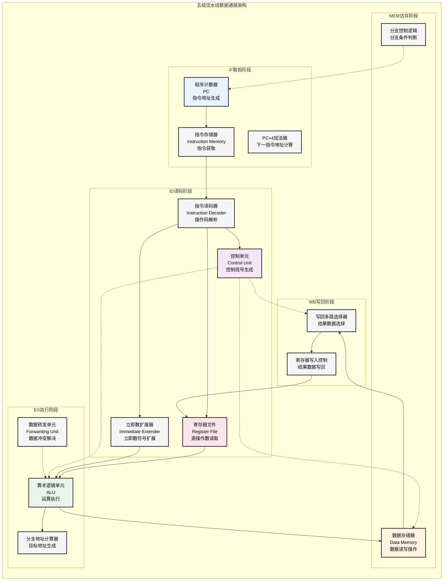
```mermaid
graph LR
    subgraph pipeline ["五级流水线数据通路架构"]
        subgraph IF ["IF取指阶段"]
            PC["程序计数器<br/>PC<br/>指令地址生成"]
            IMem["指令存储器<br/>Instruction Memory<br/>指令获取"]
            PCAdder["PC+4加法器<br/>下一指令地址计算"]
        end
        
        subgraph ID ["ID译码阶段"]
            Decoder["指令译码器<br/>Instruction Decoder<br/>操作码解析"]
            RegFile["寄存器文件<br/>Register File<br/>源操作数读取"]
            ImmExt["立即数扩展器<br/>Immediate Extender<br/>立即数符号扩展"]
            CtrlUnit["控制单元<br/>Control Unit<br/>控制信号生成"]
        end
        
        subgraph EX ["EX执行阶段"]
            ALU["算术逻辑单元<br/>ALU<br/>运算执行"]
            BranchAdder["分支地址计算器<br/>目标地址生成"]
            ForwardUnit["数据转发单元<br/>Forwarding Unit<br/>数据冲突解决"]
        end
        
        subgraph MEM ["MEM访存阶段"]
            DMem["数据存储器<br/>Data Memory<br/>数据读写操作"]
            BranchCtrl["分支控制逻辑<br/>分支条件判断"]
        end
        
        subgraph WB ["WB写回阶段"]
            WBMux["写回多路选择器<br/>结果数据选择"]
            RegWrite["寄存器写入控制<br/>结果数据写回"]
        end
    end
    
    PC --> IMem --> Decoder
    Decoder --> RegFile
    Decoder --> ImmExt
    Decoder --> CtrlUnit
    RegFile --> ALU
    ImmExt --> ALU
    ALU --> DMem
    ALU --> BranchAdder
    DMem --> WBMux
    WBMux --> RegWrite
    RegWrite --> RegFile
    
    CtrlUnit -.-> ALU
    CtrlUnit -.-> DMem
    CtrlUnit -.-> WBMux
    BranchCtrl -.-> PC
    ForwardUnit -.-> ALU
    
    style PC fill:#e6f3ff,stroke:#000,stroke-width:2px,color:#000
    style ALU fill:#e8f5e8,stroke:#000,stroke-width:2px,color:#000
    style DMem fill:#fff3e0,stroke:#000,stroke-width:2px,color:#000
    style RegFile fill:#fce4ec,stroke:#000,stroke-width:2px,color:#000
    style CtrlUnit fill:#f3e5f5,stroke:#000,stroke-width:2px,color:#000
    style IMem fill:#f5f5f5,stroke:#000,stroke-width:2px,color:#000
    style Decoder fill:#f5f5f5,stroke:#000,stroke-width:2px,color:#000
    style WBMux fill:#f5f5f5,stroke:#000,stroke-width:2px,color:#000
    style PCAdder fill:#f5f5f5,stroke:#000,stroke-width:2px,color:#000
    style ImmExt fill:#f5f5f5,stroke:#000,stroke-width:2px,color:#000
    style BranchAdder fill:#f5f5f5,stroke:#000,stroke-width:2px,color:#000
    style ForwardUnit fill:#f5f5f5,stroke:#000,stroke-width:2px,color:#000
    style BranchCtrl fill:#f5f5f5,stroke:#000,stroke-width:2px,color:#000
    style RegWrite fill:#f5f5f5,stroke:#000,stroke-width:2px,color:#000
```

**各阶段详细功能分析：**

| 流水段 | 英文全称 | 主要功能 | 关键硬件组件 | 典型延迟 | 主要操作 |
|--------|----------|----------|--------------|----------|----------|
| **IF** | Instruction Fetch | 指令获取与地址更新 | PC、指令Cache、加法器 | 1-2ns | 1. 使用PC访问指令存储器<br/>2. 读取32位指令字<br/>3. 计算PC+4 |
| **ID** | Instruction Decode | 指令译码与操作数准备 | 译码器、寄存器文件、控制单元 | 1-2ns | 1. 解析指令格式和操作码<br/>2. 读取源寄存器数据<br/>3. 生成控制信号<br/>4. 立即数符号扩展 |
| **EX** | Execute | 运算执行与地址计算 | ALU、比较器、地址加法器 | 2-3ns | 1. 执行算术/逻辑运算<br/>2. 计算分支目标地址<br/>3. 进行分支条件判断 |
| **MEM** | Memory Access | 存储器访问操作 | 数据Cache、存储控制器 | 3-10ns | 1. 执行Load/Store操作<br/>2. 访问数据存储器<br/>3. 处理存储器异常 |
| **WB** | Write Back | 结果写回寄存器 | 写回多路选择器、寄存器文件 | 1ns | 1. 选择写回数据源<br/>2. 将结果写入目标寄存器 |

#### 1.2.2 流水线寄存器设计与实现

**流水线寄存器的关键作用：**
1. **数据保持**：在时钟周期边界保存中间计算结果
2. **时序同步**：确保各流水段的同步操作
3. **状态隔离**：防止不同指令之间的状态干扰
4. **控制传递**：将控制信号传递到需要的流水段

**IF/ID流水线寄存器设计：**

```
IF/ID寄存器字段结构 (128位)：
┌─────────────┬─────────────┬─────────────┬─────────────┐
│   PC+4      │ Instruction │   Valid     │  Exception  │
│   (32位)    │    (32位)   │   (1位)      │   (63位)    │
└─────────────┴─────────────┴─────────────┴─────────────┘

字段说明：
- PC+4: 下一条指令地址，用于分支地址计算
- Instruction: 当前取到的指令，包含操作码、寄存器地址等
- Valid: 有效位，用于流水线冲刷时标记指令无效性
- Exception: 异常信息，取指阶段可能的异常状态
```

**ID/EX流水线寄存器设计：**

```
ID/EX寄存器字段结构 (256位)：
┌─────────┬─────────┬─────────┬─────────┬─────────┬─────────┬─────────┐
│ CtrlSig │  PC+4   │ReadData1│ReadData2│  Imm    │  Rs/Rt  │   Rd    │
│ (32位)  │ (32位)  │ (32位)   │ (32位)  │ (32位)   │ (64位)  │ (32位)  │
└─────────┴─────────┴─────────┴─────────┴─────────┴─────────┴─────────┘

详细控制信号：
- RegWrite: 寄存器写使能 (1位)
- RegDst: 目标寄存器选择 (1位) 
- ALUSrc: ALU源操作数选择 (1位)
- Branch: 分支控制信号 (1位)
- MemRead: 存储器读使能 (1位)
- MemWrite: 存储器写使能 (1位)
- MemtoReg: 写回数据选择 (1位)
- ALUOp: ALU操作控制 (3位)
```

**EX/MEM流水线寄存器设计：**

```
EX/MEM寄存器字段结构 (192位)：
┌─────────┬──────────┬─────────┬─────────┬─────────┬─────────┐
│ CtrlSig │BranchAddr│ALUResult│WriteData│  Zero   │WriteReg │
│ (32位)  │ (32位)    │ (32位)  │ (32位)   │ (1位)   │ (31位)  │
└─────────┴──────────┴─────────┴─────────┴─────────┴─────────┘

关键信号说明：
- BranchAddr: 分支目标地址
- ALUResult: ALU运算结果
- WriteData: 要写入存储器的数据
- Zero: ALU零标志，用于分支判断
- WriteReg: 目标寄存器地址
```

**MEM/WB流水线寄存器设计：**

```
MEM/WB寄存器字段结构 (128位)：
┌─────────┬─────────┬─────────┬─────────┐
│ CtrlSig │ ReadData│ALUResult│WriteReg │
│ (32位)  │ (32位)   │ (32位)  │ (32位)  │
└─────────┴─────────┴─────────┴─────────┘

写回阶段控制：
- RegWrite: 寄存器写使能
- MemtoReg: 选择ALU结果或存储器数据写回
```

### 1.3 流水线控制与时序设计

#### 1.3.1 流水线控制信号传递机制

**控制信号分类与传递路径：**

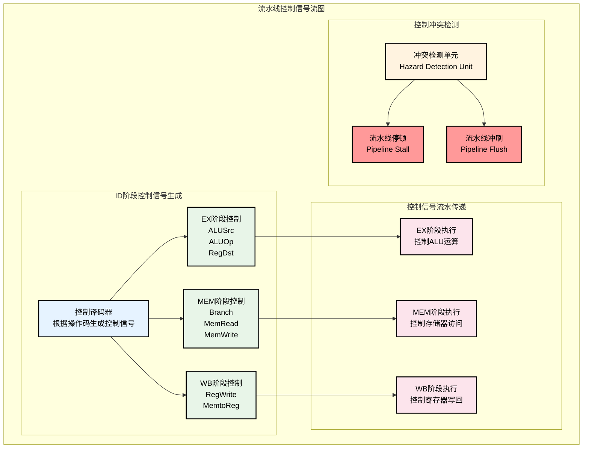
```mermaid
graph TD
    subgraph control_flow ["流水线控制信号流图"]
        subgraph id_stage ["ID阶段控制信号生成"]
            CtrlDecode["控制译码器<br/>根据操作码生成控制信号"]
            
            CtrlDecode --> EXCtrl["EX阶段控制<br/>ALUSrc<br/>ALUOp<br/>RegDst"]
            CtrlDecode --> MEMCtrl["MEM阶段控制<br/>Branch<br/>MemRead<br/>MemWrite"]
            CtrlDecode --> WBCtrl["WB阶段控制<br/>RegWrite<br/>MemtoReg"]
        end
        
        subgraph signal_flow ["控制信号流水传递"]
            EXCtrl --> EXStage["EX阶段执行<br/>控制ALU运算"]
            MEMCtrl --> MEMStage["MEM阶段执行<br/>控制存储器访问"]
            WBCtrl --> WBStage["WB阶段执行<br/>控制寄存器写回"]
        end
        
        subgraph hazard_control ["控制冲突检测"]
            HazardUnit["冲突检测单元<br/>Hazard Detection Unit"]
            HazardUnit --> Stall["流水线停顿<br/>Pipeline Stall"]
            HazardUnit --> Flush["流水线冲刷<br/>Pipeline Flush"]
        end
    end
    
    style CtrlDecode fill:#e6f3ff,stroke:#000,stroke-width:2px,color:#000
    style HazardUnit fill:#fff3e0,stroke:#000,stroke-width:2px,color:#000
    style Stall fill:#ff9999,stroke:#000,stroke-width:2px,color:#000
    style Flush fill:#ff9999,stroke:#000,stroke-width:2px,color:#000
    style EXCtrl fill:#e8f5e8,stroke:#000,stroke-width:2px,color:#000
    style MEMCtrl fill:#e8f5e8,stroke:#000,stroke-width:2px,color:#000
    style WBCtrl fill:#e8f5e8,stroke:#000,stroke-width:2px,color:#000
    style EXStage fill:#fce4ec,stroke:#000,stroke-width:2px,color:#000
    style MEMStage fill:#fce4ec,stroke:#000,stroke-width:2px,color:#000
    style WBStage fill:#fce4ec,stroke:#000,stroke-width:2px,color:#000
```

**指令类型与控制信号对应关系：**

| 指令类型 | 典型指令 | RegWrite | RegDst | ALUSrc | Branch | MemRead | MemWrite | MemtoReg | ALUOp |
|----------|----------|----------|--------|--------|--------|---------|----------|----------|--------|
| **R型运算** | add, sub, and | 1 | 1 | 0 | 0 | 0 | 0 | 0 | 10 |
| **I型运算** | addi, andi | 1 | 0 | 1 | 0 | 0 | 0 | 0 | 00 |
| **Load指令** | lw | 1 | 0 | 1 | 0 | 1 | 0 | 1 | 00 |
| **Store指令** | sw | 0 | X | 1 | 0 | 0 | 1 | X | 00 |
| **分支指令** | beq, bne | 0 | X | 0 | 1 | 0 | 0 | X | 01 |
| **跳转指令** | j, jal | 0/1 | X/0 | X | 0 | 0 | 0 | X/0 | XX |

#### 1.3.2 流水线时序控制机制

**时钟设计考量因素：**

1. **最长传播延迟**：流水线时钟周期必须大于最慢流水段的延迟
2. **建立保持时间**：确保流水线寄存器的时序约束
3. **时钟偏斜**：考虑时钟信号在芯片上的传播差异
4. **功耗优化**：平衡性能与功耗的关系

**关键时序路径分析：**

```
关键路径计算示例：
MEM阶段 (最长路径)：
地址计算 → Cache访问 → 数据返回 → 流水线寄存器建立时间
  1ns   +    8ns    +   1ns    +         0.5ns         = 10.5ns

因此，流水线时钟周期 ≥ 10.5ns，最大时钟频率 ≤ 95.2MHz
```

**时序优化技术：**

1. **路径平衡**：调整各流水段的逻辑复杂度，使延迟尽可能均衡
2. **流水线寄存器插入**：在长路径中插入额外的流水线寄存器
3. **时钟域分离**：对不同性能要求的模块使用不同时钟频率
4. **异步接口设计**：在跨时钟域边界使用异步FIFO等机制

---

## 2. 流水线冲突与解决方案

### 2.1 结构冲突及硬件解决方案

> **结构冲突（Structural Hazard）** 是指多条指令在同一时钟周期内竞争同一个硬件资源，导致无法同时执行的冲突类型。这是流水线设计中最直接的硬件资源约束问题。

**冲突检测实现：** 参见 `计算机组成原理/simulation/pipeline_sim/pipeline.c` 中的 `pipeline_detect_structural_hazard()` 函数。

**相关数据结构：** 参见 `计算机组成原理/simulation/pipeline_sim/pipeline.h` 中的：
- `hazard_detection_t` 结构体：冲突检测结果
- `HAZARD_STRUCTURAL` 枚举值：结构冲突类型标识

#### 2.1.1 结构冲突产生机理与典型场景

**冲突产生的根本原因：**
结构冲突本质上是硬件资源不足导致的竞争问题。在理想的流水线中，每个流水段应该有独立的硬件资源，但实际设计中出于成本、面积、功耗等考虑，某些资源可能被多个流水段共享。

**典型结构冲突场景分析：**

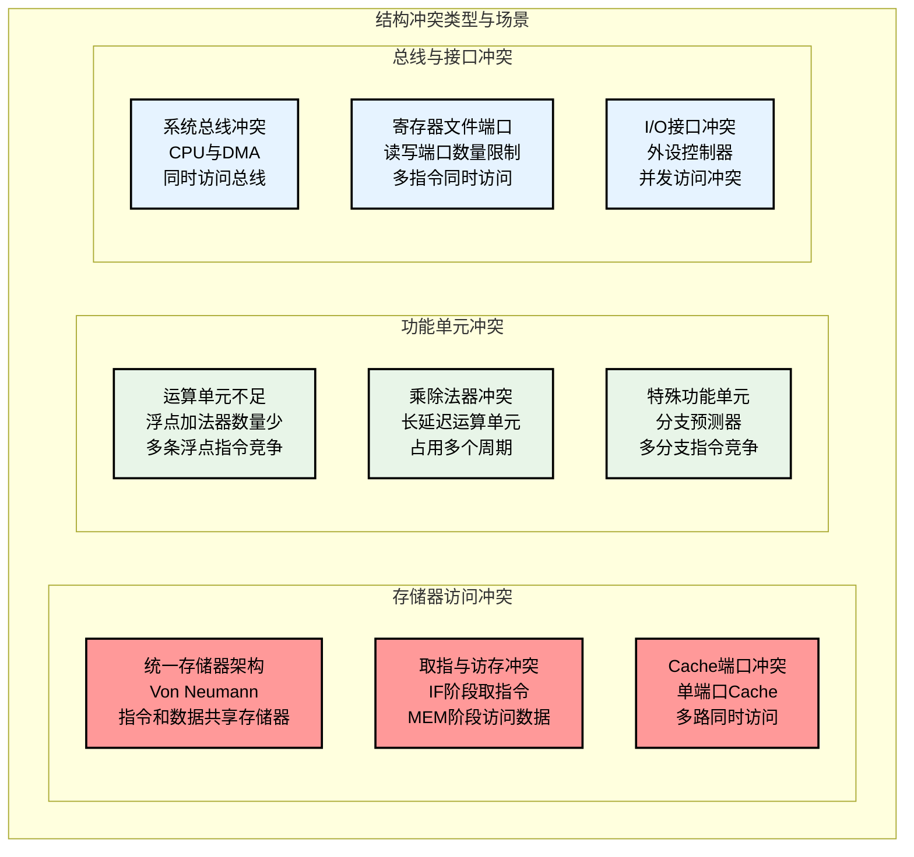
```mermaid
graph TD
    subgraph structural_conflicts ["结构冲突类型与场景"]
        subgraph memory_conflicts ["存储器访问冲突"]
            A1["统一存储器架构<br/>Von Neumann<br/>指令和数据共享存储器"]
            A2["取指与访存冲突<br/>IF阶段取指令<br/>MEM阶段访问数据"]
            A3["Cache端口冲突<br/>单端口Cache<br/>多路同时访问"]
        end
        
        subgraph functional_conflicts ["功能单元冲突"]
            B1["运算单元不足<br/>浮点加法器数量少<br/>多条浮点指令竞争"]
            B2["乘除法器冲突<br/>长延迟运算单元<br/>占用多个周期"]
            B3["特殊功能单元<br/>分支预测器<br/>多分支指令竞争"]
        end
        
        subgraph bus_conflicts ["总线与接口冲突"]
            C1["系统总线冲突<br/>CPU与DMA<br/>同时访问总线"]
            C2["寄存器文件端口<br/>读写端口数量限制<br/>多指令同时访问"]
            C3["I/O接口冲突<br/>外设控制器<br/>并发访问冲突"]
        end
    end
    
    style A1 fill:#ff9999,stroke:#000,stroke-width:2px,color:#000
    style A2 fill:#ff9999,stroke:#000,stroke-width:2px,color:#000
    style A3 fill:#ff9999,stroke:#000,stroke-width:2px,color:#000
    style B1 fill:#e8f5e8,stroke:#000,stroke-width:2px,color:#000
    style B2 fill:#e8f5e8,stroke:#000,stroke-width:2px,color:#000
    style B3 fill:#e8f5e8,stroke:#000,stroke-width:2px,color:#000
    style C1 fill:#e6f3ff,stroke:#000,stroke-width:2px,color:#000
    style C2 fill:#e6f3ff,stroke:#000,stroke-width:2px,color:#000
    style C3 fill:#e6f3ff,stroke:#000,stroke-width:2px,color:#000
```

**存储器访问冲突时空图：**

```
时钟周期：    1    2    3    4    5    6    7
指令1：      IF   ID   EX  MEM   WB
指令2：           IF   ID   EX  MEM   WB
指令3：                IF   ID   EX  MEM   WB
指令4：                     IF   ID   EX  MEM
                            ↑              ↑
                        指令4取指      指令1数据访存
                            └── 存储器冲突 ──┘

冲突解决：
指令4：                    stall  IF   ID   EX  MEM
                           (停顿一周期)
```

#### 2.1.2 结构冲突检测算法

**硬件冲突检测逻辑：**

```verilog
// 结构冲突检测模块（Verilog伪代码）
module structural_hazard_detector (
    input wire clk,
    input wire [4:0] if_stage_req,      // IF阶段资源请求
    input wire [4:0] mem_stage_req,     // MEM阶段资源请求
    input wire [2:0] ex_fu_req,         // EX阶段功能单元请求
    output reg structural_stall         // 结构冲突停顿信号
);

// 存储器访问冲突检测
wire mem_conflict = if_stage_req[0] && mem_stage_req[0];

// 功能单元冲突检测
wire fu_conflict = |( ex_fu_req & ex_fu_busy );

// 综合冲突判断
always @(posedge clk) begin
    structural_stall <= mem_conflict || fu_conflict;
end

endmodule
```

**软件编译器检测方法：**

```python
def detect_structural_hazards(instruction_sequence):
    """
    编译时结构冲突检测算法
    """
    resource_usage = {}
    hazards = []
    
    for cycle, instructions in enumerate(instruction_sequence):
        current_resources = set()
        
        for instr in instructions:
            required_resources = get_required_resources(instr, cycle)
            
            # 检测资源冲突
            conflicts = current_resources.intersection(required_resources)
            if conflicts:
                hazards.append({
                    'cycle': cycle,
                    'instructions': instructions,
                    'conflicts': conflicts
                })
            
            current_resources.update(required_resources)
    
    return hazards
```

#### 2.1.3 结构冲突解决方案

**1. 硬件资源增加方案**

**哈佛架构存储器分离：**

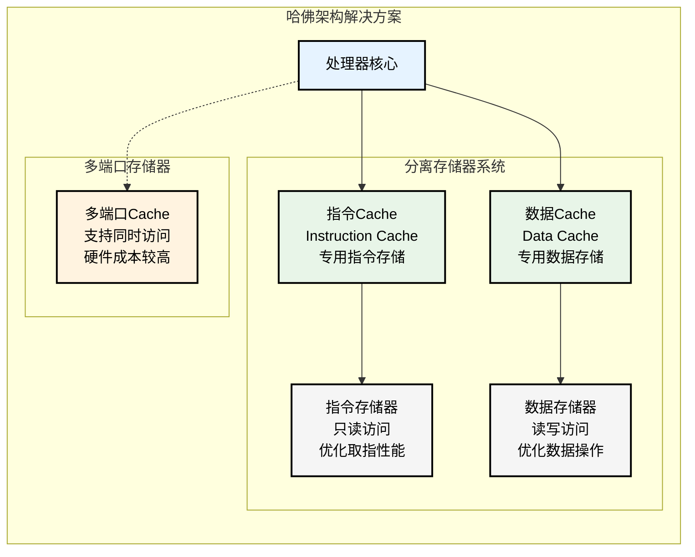
```mermaid
graph LR
    subgraph harvard_solution ["哈佛架构解决方案"]
        CPU["处理器核心"]
        
        subgraph memory_separation ["分离存储器系统"]
            ICache["指令Cache<br/>Instruction Cache<br/>专用指令存储"]
            DCache["数据Cache<br/>Data Cache<br/>专用数据存储"]
            
            IMem["指令存储器<br/>只读访问<br/>优化取指性能"]
            DMem["数据存储器<br/>读写访问<br/>优化数据操作"]
        end
        
        subgraph multiport ["多端口存储器"]
            MultiPort["多端口Cache<br/>支持同时访问<br/>硬件成本较高"]
        end
    end
    
    CPU --> ICache
    CPU --> DCache
    ICache --> IMem
    DCache --> DMem
    CPU -.-> MultiPort
    
    style CPU fill:#e6f3ff,stroke:#000,stroke-width:2px,color:#000
    style ICache fill:#e8f5e8,stroke:#000,stroke-width:2px,color:#000
    style DCache fill:#e8f5e8,stroke:#000,stroke-width:2px,color:#000
    style MultiPort fill:#fff3e0,stroke:#000,stroke-width:2px,color:#000
    style IMem fill:#f5f5f5,stroke:#000,stroke-width:2px,color:#000
    style DMem fill:#f5f5f5,stroke:#000,stroke-width:2px,color:#000
```

**多功能单元并行架构：**

| 资源类型 | 传统设计 | 优化设计 | 性能提升 | 成本增加 |
|----------|----------|----------|----------|----------|
| **整数ALU** | 1个 | 2-4个 | 2-4倍 | 50-100% |
| **浮点运算器** | 1个加法器 | 加法器+乘法器+除法器 | 3-5倍 | 200-300% |
| **Load/Store单元** | 1个 | 2个（独立AGU） | 1.5-2倍 | 30-50% |
| **分支单元** | 共享ALU | 专用分支单元 | 1.2-1.5倍 | 10-20% |

**2. 流水线停顿控制**

**停顿控制逻辑：**

```
停顿决策算法：
1. 检测资源冲突：
   if (resource_conflict_detected) {
       stall_pipeline = TRUE;
       resource_available_cycle = get_next_available_cycle();
   }

2. 停顿时长计算：
   stall_cycles = resource_available_cycle - current_cycle;

3. 流水线控制：
   - 停顿IF和ID阶段
   - 保持EX、MEM、WB正常进行
   - 插入NOP到冲突流水段
```

**3. 动态资源调度**

**资源池化管理：**

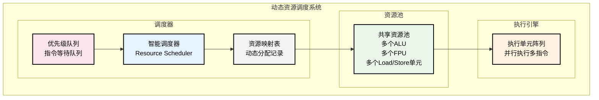
```mermaid
graph TD
    subgraph dynamic_scheduling ["动态资源调度系统"]
        subgraph resource_pool ["资源池"]
            ResPool["共享资源池<br/>多个ALU<br/>多个FPU<br/>多个Load/Store单元"]
        end
        
        subgraph scheduler ["调度器"]
            Scheduler["智能调度器<br/>Resource Scheduler"]
            PriorityQueue["优先级队列<br/>指令等待队列"]
            ResourceMap["资源映射表<br/>动态分配记录"]
        end
        
        subgraph execution ["执行引擎"]
            ExecUnits["执行单元阵列<br/>并行执行多指令"]
        end
    end
    
    PriorityQueue --> Scheduler
    Scheduler --> ResourceMap
    ResourceMap --> ResPool
    ResPool --> ExecUnits
    
    style Scheduler fill:#e6f3ff,stroke:#000,stroke-width:2px,color:#000
    style ResPool fill:#e8f5e8,stroke:#000,stroke-width:2px,color:#000
    style ExecUnits fill:#fff3e0,stroke:#000,stroke-width:2px,color:#000
    style PriorityQueue fill:#fce4ec,stroke:#000,stroke-width:2px,color:#000
    style ResourceMap fill:#f5f5f5,stroke:#000,stroke-width:2px,color:#000
```

### 2.2 数据冲突与转发技术

> **数据冲突（Data Hazard）** 是流水线中最常见且最重要的冲突类型，发生在指令之间存在数据依赖关系，而流水线的并行执行可能导致数据尚未准备好就被后续指令使用的情况。

**冲突检测实现：** 参见 `计算机组成原理/simulation/pipeline_sim/pipeline.c` 中的：
- `pipeline_detect_data_hazard()` 函数：数据冲突检测
- `pipeline_detect_load_use_hazard()` 函数：Load-Use冲突检测
- `pipeline_calculate_forwarding()` 函数：数据转发计算

**相关数据结构：** 参见 `计算机组成原理/simulation/pipeline_sim/pipeline.h` 中的：
- `HAZARD_DATA_RAW`, `HAZARD_DATA_WAR`, `HAZARD_DATA_WAW` 枚举值
- `forwarding_control_t` 结构体：转发控制信息

#### 2.2.1 数据冲突分类与机理分析

**数据冲突的三种类型：**

| 冲突类型 | 英文名称 | 依赖关系 | 产生条件 | 危险程度 |
|----------|----------|----------|----------|----------|
| **RAW冲突** | Read After Write | 真数据依赖 | 后续指令读取前面指令写入的寄存器 | 高（必须解决） |
| **WAR冲突** | Write After Read | 反依赖 | 后续指令写入前面指令读取的寄存器 | 中（顺序执行时不存在） |
| **WAW冲突** | Write After Write | 输出依赖 | 两条指令写入同一寄存器 | 中（影响最终结果） |

**RAW冲突详细分析（最重要）：**

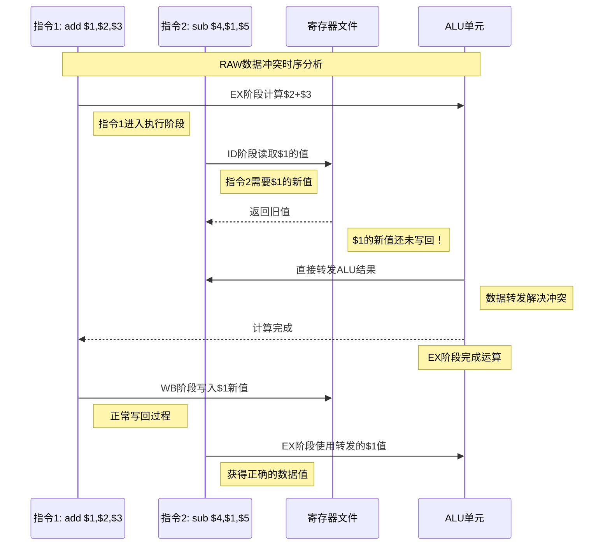
```mermaid
sequenceDiagram
    participant I1 as 指令1: add $1,$2,$3
    participant I2 as 指令2: sub $4,$1,$5
    participant RF as 寄存器文件
    participant ALU as ALU单元
    
    note over I1,ALU: RAW数据冲突时序分析
    
    I1->>ALU: EX阶段计算$2+$3
    note right of I1: 指令1进入执行阶段
    
    I2->>RF: ID阶段读取$1的值
    note right of I2: 指令2需要$1的新值
    
    RF-->>I2: 返回旧值
    note right of RF: $1的新值还未写回！
    
    ALU->>I2: 直接转发ALU结果
    note right of ALU: 数据转发解决冲突
    
    ALU-->>I1: 计算完成
    note over ALU: EX阶段完成运算
    
    I1->>RF: WB阶段写入$1新值
    note right of I1: 正常写回过程
    
    I2->>ALU: EX阶段使用转发的$1值
    note right of I2: 获得正确的数据值
```

**Load-Use数据冲突（特殊RAW冲突）：**

```
指令序列：
lw  $2, 20($1)    // 从存储器加载数据到$2
and $4, $2, $5    // 使用$2进行运算

时钟周期：  1    2    3    4    5    6    7
lw：      IF   ID   EX  MEM   WB
and：          IF   ID  stall  EX  MEM   WB
                       ↑
               必须停顿一周期，因为数据在MEM阶段才准备好
```

#### 2.2.2 数据转发技术实现

**数据转发路径设计：**

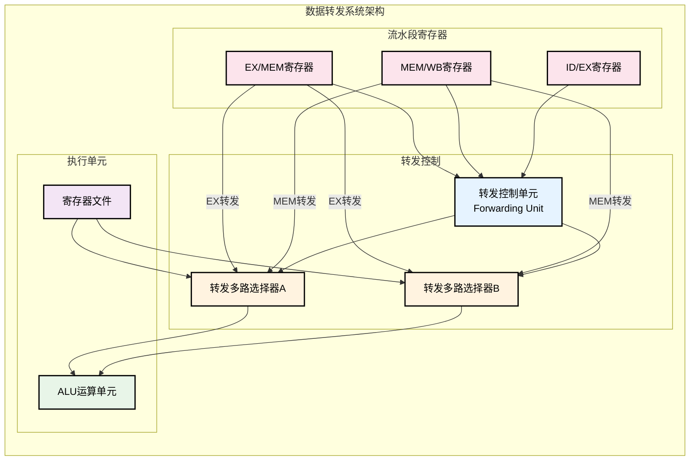
```mermaid
graph LR
    subgraph forwarding_system ["数据转发系统架构"]
        subgraph pipeline_regs ["流水段寄存器"]
            IDEX["ID/EX寄存器"]
            EXMEM["EX/MEM寄存器"]
            MEMWB["MEM/WB寄存器"]
        end
        
        subgraph forwarding_control ["转发控制"]
            ForwardCtrl["转发控制单元<br/>Forwarding Unit"]
            ForwardMuxA["转发多路选择器A"]
            ForwardMuxB["转发多路选择器B"]
        end
        
        subgraph execution_unit ["执行单元"]
            ALU["ALU运算单元"]
            RegFile["寄存器文件"]
        end
    end
    
    EXMEM -->|EX转发| ForwardMuxA
    EXMEM -->|EX转发| ForwardMuxB
    MEMWB -->|MEM转发| ForwardMuxA
    MEMWB -->|MEM转发| ForwardMuxB
    
    EXMEM --> ForwardCtrl
    MEMWB --> ForwardCtrl
    IDEX --> ForwardCtrl
    
    ForwardCtrl --> ForwardMuxA
    ForwardCtrl --> ForwardMuxB
    
    RegFile --> ForwardMuxA
    RegFile --> ForwardMuxB
    ForwardMuxA --> ALU
    ForwardMuxB --> ALU
    
    style ForwardCtrl fill:#e6f3ff,stroke:#000,stroke-width:2px,color:#000
    style ALU fill:#e8f5e8,stroke:#000,stroke-width:2px,color:#000
    style ForwardMuxA fill:#fff3e0,stroke:#000,stroke-width:2px,color:#000
    style ForwardMuxB fill:#fff3e0,stroke:#000,stroke-width:2px,color:#000
    style IDEX fill:#fce4ec,stroke:#000,stroke-width:2px,color:#000
    style EXMEM fill:#fce4ec,stroke:#000,stroke-width:2px,color:#000
    style MEMWB fill:#fce4ec,stroke:#000,stroke-width:2px,color:#000
    style RegFile fill:#f3e5f5,stroke:#000,stroke-width:2px,color:#000
```

**转发控制算法实现：**

```verilog
// 数据转发控制单元（Verilog HDL）
module forwarding_unit (
    // 输入信号
    input [4:0] ID_EX_Rs,       // 当前指令源寄存器Rs
    input [4:0] ID_EX_Rt,       // 当前指令源寄存器Rt
    input [4:0] EX_MEM_Rd,      // EX/MEM阶段目标寄存器
    input [4:0] MEM_WB_Rd,      // MEM/WB阶段目标寄存器
    input EX_MEM_RegWrite,      // EX/MEM阶段写使能
    input MEM_WB_RegWrite,      // MEM/WB阶段写使能
    
    // 输出信号
    output reg [1:0] ForwardA,  // ALU输入A转发控制
    output reg [1:0] ForwardB   // ALU输入B转发控制
);

// 转发控制逻辑 - ALU输入A
always @(*) begin
    // EX转发优先级最高（最新数据）
    if (EX_MEM_RegWrite && (EX_MEM_Rd != 0) && 
        (EX_MEM_Rd == ID_EX_Rs)) begin
        ForwardA = 2'b10;  // 从EX/MEM转发
    end
    // MEM转发优先级次之
    else if (MEM_WB_RegWrite && (MEM_WB_Rd != 0) && 
             !(EX_MEM_RegWrite && (EX_MEM_Rd != 0) && 
               (EX_MEM_Rd == ID_EX_Rs)) &&
             (MEM_WB_Rd == ID_EX_Rs)) begin
        ForwardA = 2'b01;  // 从MEM/WB转发
    end
    else begin
        ForwardA = 2'b00;  // 不转发，使用寄存器文件数据
    end
end

// 转发控制逻辑 - ALU输入B（逻辑相同）
always @(*) begin
    if (EX_MEM_RegWrite && (EX_MEM_Rd != 0) && 
        (EX_MEM_Rd == ID_EX_Rt)) begin
        ForwardB = 2'b10;
    end
    else if (MEM_WB_RegWrite && (MEM_WB_Rd != 0) && 
             !(EX_MEM_RegWrite && (EX_MEM_Rd != 0) && 
               (EX_MEM_Rd == ID_EX_Rt)) &&
             (MEM_WB_Rd == ID_EX_Rt)) begin
        ForwardB = 2'b01;
    end
    else begin
        ForwardB = 2'b00;
    end
end

endmodule
```

**转发优先级规则：**

1. **EX转发优先**：EX/MEM阶段的数据比MEM/WB阶段的数据更新
2. **非零寄存器检查**：寄存器$0在MIPS中恒为0，不需要转发
3. **写使能验证**：只有真正写回寄存器的指令才能提供转发数据

#### 2.2.3 流水线停顿控制

**Load-Use冲突检测与停顿：**

```verilog
// Load-Use冲突检测单元
module hazard_detection_unit (
    input [4:0] IF_ID_Rs,       // 当前指令源寄存器Rs
    input [4:0] IF_ID_Rt,       // 当前指令源寄存器Rt
    input [4:0] ID_EX_Rt,       // 前一指令目标寄存器
    input ID_EX_MemRead,        // 前一指令是否为Load指令
    
    output reg PCWrite,         // PC写使能控制
    output reg IF_ID_Write,     // IF/ID寄存器写使能
    output reg ControlMux       // 控制信号选择（插入NOP）
);

always @(*) begin
    // Load-Use冲突检测
    if (ID_EX_MemRead && 
        ((ID_EX_Rt == IF_ID_Rs) || (ID_EX_Rt == IF_ID_Rt))) begin
        // 检测到Load-Use冲突，停顿流水线
        PCWrite = 0;        // 停止PC更新
        IF_ID_Write = 0;    // 停止IF/ID寄存器更新
        ControlMux = 1;     // 插入NOP（气泡）
    end
    else begin
        // 正常执行
        PCWrite = 1;
        IF_ID_Write = 1;
        ControlMux = 0;
    end
end

endmodule
```

**停顿效果时空图：**

```
原始指令序列：
1. lw  $2, 20($1)     // Load指令
2. and $4, $2, $5     // 使用$2，产生Load-Use冲突
3. or  $6, $7, $8     // 正常指令

停顿后执行时序：
时钟周期：  1    2    3    4    5    6    7    8
lw：      IF   ID   EX  MEM   WB
and：          IF   ID  stall  EX  MEM   WB
or：                IF  [NOP]  ID   EX  MEM   WB
                        ↑
                   插入气泡（空操作）

性能代价：延迟1个时钟周期
```

### 2.3 控制冲突与分支预测

> **控制冲突（Control Hazard）** 是由分支指令、跳转指令等改变程序控制流的指令引起的流水线冲突。由于分支条件的判断通常在执行阶段或访存阶段才能确定，而此时流水线已经预取了后续指令，如果分支预测错误就需要冲刷流水线，造成性能损失。

**分支预测实现：** 参见 `计算机组成原理/simulation/pipeline_sim/pipeline.c` 中的：
- `branch_predict()` 函数：分支预测
- `branch_update_predictor()` 函数：分支预测器状态更新
- `branch_get_target()` 函数：分支目标地址获取
- `pipeline_flush()` 函数：流水线冲刷

**相关数据结构：** 参见 `计算机组成原理/simulation/pipeline_sim/pipeline.h` 中的：
- `branch_predictor_t` 结构体：分支预测器状态
- `branch_prediction_state_t` 枚举：2位饱和计数器状态
- `HAZARD_CONTROL` 枚举值：控制冲突标识

#### 2.3.1 控制冲突产生机理与影响分析

**分支指令执行时序分析：**

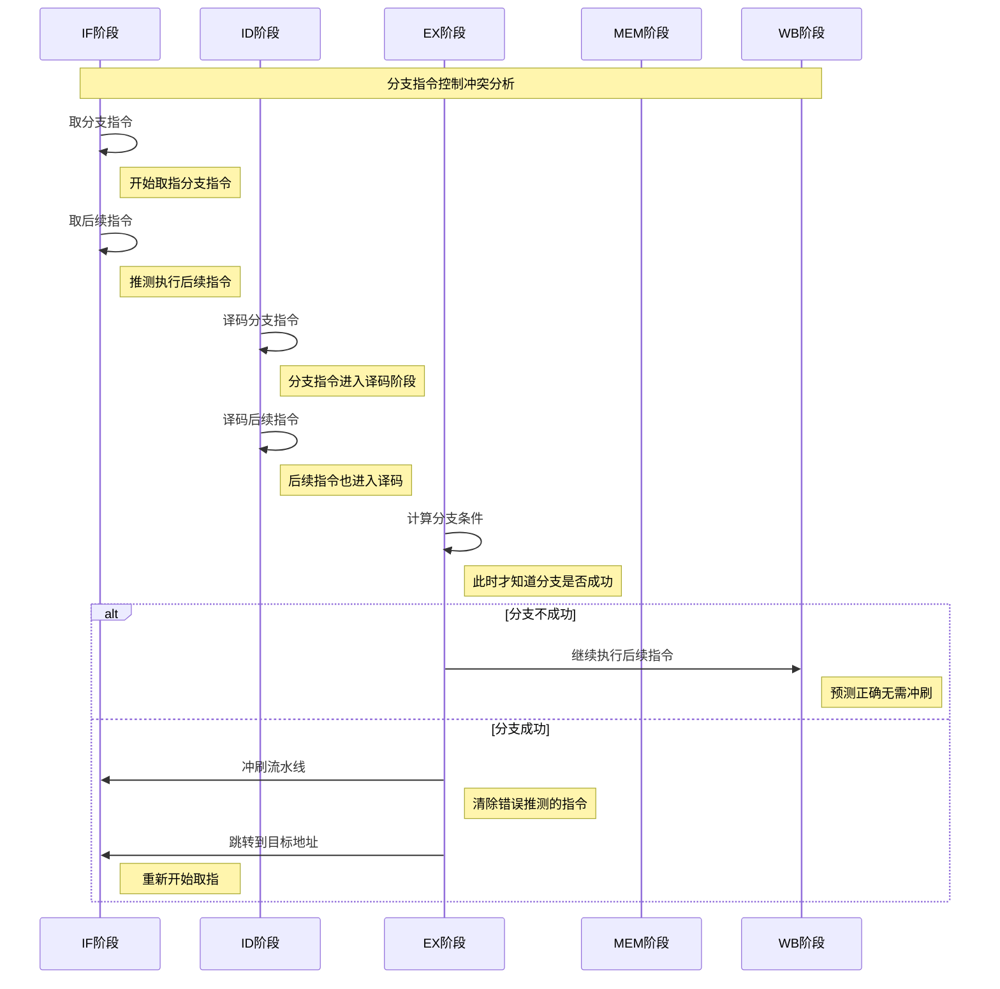
```mermaid
sequenceDiagram
    participant IF as IF阶段
    participant ID as ID阶段
    participant EX as EX阶段
    participant MEM as MEM阶段
    participant WB as WB阶段
    
    note over IF,WB: 分支指令控制冲突分析
    
    IF->>IF: 取分支指令
    note right of IF: 开始取指分支指令
    
    IF->>IF: 取后续指令
    note right of IF: 推测执行后续指令
    
    ID->>ID: 译码分支指令
    note right of ID: 分支指令进入译码阶段
    
    ID->>ID: 译码后续指令
    note right of ID: 后续指令也进入译码
    
    EX->>EX: 计算分支条件
    note right of EX: 此时才知道分支是否成功
    
    alt 分支不成功
        EX->>WB: 继续执行后续指令
        note right of WB: 预测正确无需冲刷
    else 分支成功
        EX->>IF: 冲刷流水线
        note right of EX: 清除错误推测的指令
        EX->>IF: 跳转到目标地址
        note right of IF: 重新开始取指
    end
```

**控制冲突的性能影响：**

```
分支指令比例统计（典型程序）：
- 整数程序：15-25%的指令是分支指令
- 浮点程序：10-15%的指令是分支指令
- 系统软件：20-30%的指令是分支指令

分支预测错误代价：
- 5级流水线：2-3个时钟周期损失
- 深度流水线（10-20级）：10-20个时钟周期损失
- 超标量处理器：损失更加严重

性能影响公式：
CPI_分支惩罚 = 分支指令比例 × 预测错误率 × 惩罚周期数
```

#### 2.3.2 静态分支预测技术

**静态预测策略对比：**

| 预测策略 | 预测规则 | 适用场景 | 预测准确率 | 实现复杂度 |
|----------|----------|----------|------------|------------|
| **总是不跳转（BTFN）** | 预测所有分支都不成功 | 顺序程序较多 | 60-70% | 最简单 |
| **总是跳转（BTAT）** | 预测所有分支都成功 | 循环程序较多 | 50-60% | 最简单 |
| **向后跳转成功** | 向后跳转预测成功，向前跳转预测失败 | 循环和条件混合 | 65-75% | 简单 |
| **基于操作码** | 根据分支指令类型预测 | 编译器优化配合 | 70-80% | 中等 |

**编译器静态预测优化：**

```c
// 编译器分支预测提示示例
if (__builtin_expect(error_condition, 0)) {
    // 不太可能执行的错误处理代码
    handle_error();
} else {
    // 正常情况下执行的代码（预测为真）
    normal_processing();
}

// 汇编级别的分支预测提示
beq $1, $2, unlikely_label   // 预测不成功
bnez $3, likely_label        // 预测成功
```

#### 2.3.3 动态分支预测技术

**1位分支预测器（最简单）：**

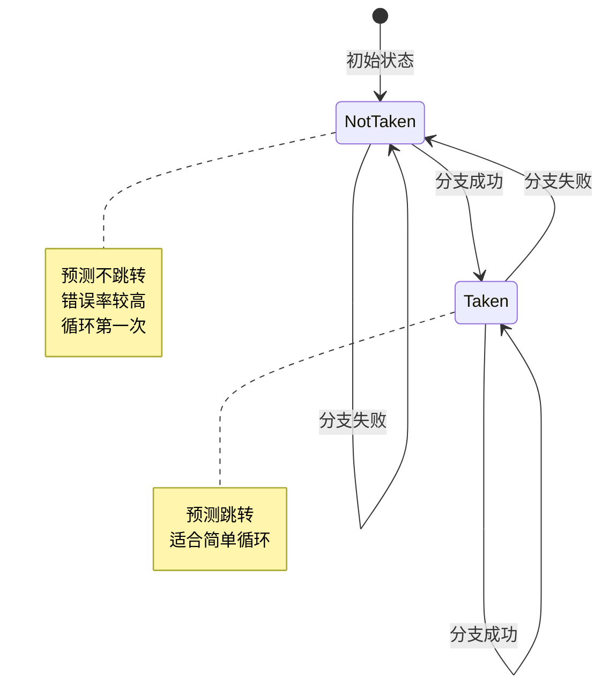
```mermaid
stateDiagram-v2
    [*] --> NotTaken: 初始状态
    NotTaken --> Taken: 分支成功
    Taken --> NotTaken: 分支失败
    NotTaken --> NotTaken: 分支失败
    Taken --> Taken: 分支成功
    
    note right of NotTaken
        预测不跳转<br/>错误率较高<br/>循环第一次
    end note
    
    note right of Taken  
        预测跳转<br/>适合简单循环
    end note
```

**2位饱和计数器分支预测器（经典）：**

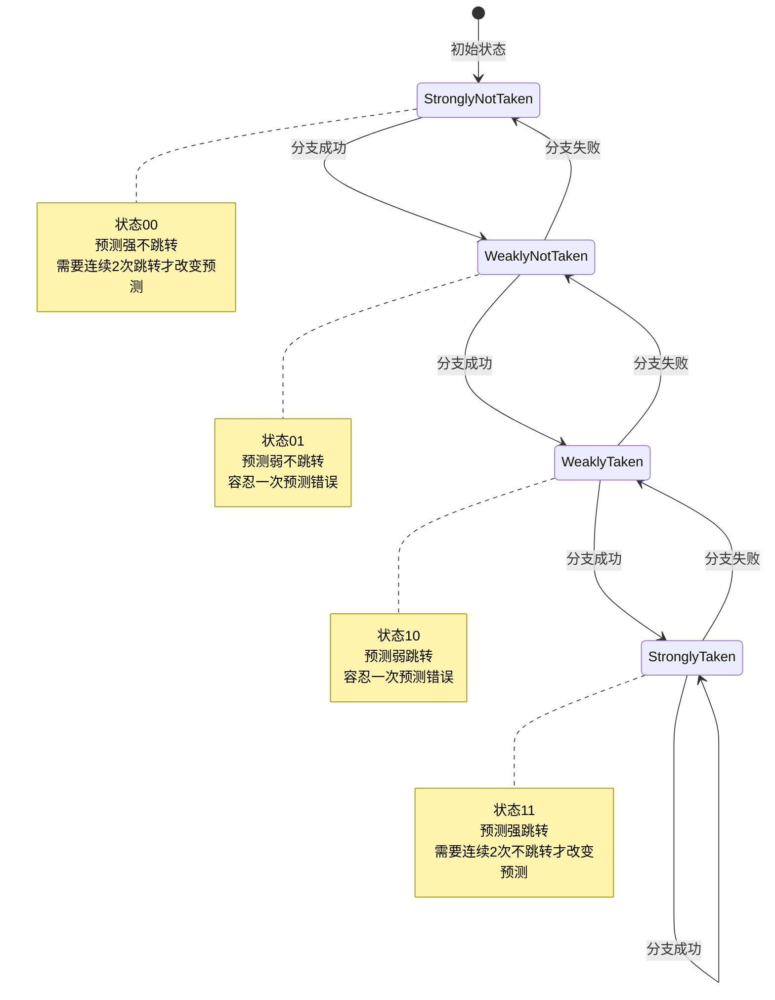
```mermaid
stateDiagram-v2
    [*] --> StronglyNotTaken: 初始状态
    StronglyNotTaken --> WeaklyNotTaken: 分支成功
    WeaklyNotTaken --> StronglyNotTaken: 分支失败
    WeaklyNotTaken --> WeaklyTaken: 分支成功
    WeaklyTaken --> WeaklyNotTaken: 分支失败
    WeaklyTaken --> StronglyTaken: 分支成功
    StronglyTaken --> WeaklyTaken: 分支失败
    StronglyTaken --> StronglyTaken: 分支成功
    
    note right of StronglyNotTaken
        状态00<br/>预测强不跳转<br/>需要连续2次跳转才改变预测
    end note
    
    note right of WeaklyNotTaken
        状态01<br/>预测弱不跳转<br/>容忍一次预测错误
    end note
    
    note right of WeaklyTaken
        状态10<br/>预测弱跳转<br/>容忍一次预测错误
    end note
    
    note right of StronglyTaken
        状态11<br/>预测强跳转<br/>需要连续2次不跳转才改变预测
    end note
```

**分支历史表（BHT）实现：**

```verilog
// 2位饱和计数器分支预测器
module branch_predictor #(
    parameter INDEX_WIDTH = 10,  // 支持1024个分支
    parameter COUNTER_WIDTH = 2   // 2位饱和计数器
)(
    input clk,
    input reset,
    
    // 预测阶段
    input [31:0] pc_if,           // IF阶段PC
    output prediction,            // 预测结果
    
    // 更新阶段  
    input [31:0] pc_ex,           // EX阶段PC（用于更新）
    input branch_taken,           // 实际分支结果
    input update_enable           // 更新使能
);

// 分支历史表
reg [COUNTER_WIDTH-1:0] bht [0:(1<<INDEX_WIDTH)-1];

// 索引计算（使用PC的低位）
wire [INDEX_WIDTH-1:0] index_if = pc_if[INDEX_WIDTH+1:2];
wire [INDEX_WIDTH-1:0] index_ex = pc_ex[INDEX_WIDTH+1:2];

// 预测逻辑（最高位为预测结果）
assign prediction = bht[index_if][COUNTER_WIDTH-1];

// 饱和计数器更新逻辑
always @(posedge clk) begin
    if (reset) begin
        // 初始化为弱不跳转（01）
        integer i;
        for (i = 0; i < (1<<INDEX_WIDTH); i = i + 1) begin
            bht[i] <= 2'b01;
        end
    end
    else if (update_enable) begin
        case ({branch_taken, bht[index_ex]})
            3'b000: bht[index_ex] <= 2'b00;  // 不跳转，强化预测
            3'b001: bht[index_ex] <= 2'b00;  // 不跳转，保持强不跳转
            3'b010: bht[index_ex] <= 2'b01;  // 不跳转，回到弱不跳转
            3'b011: bht[index_ex] <= 2'b10;  // 不跳转，转为弱跳转
            3'b100: bht[index_ex] <= 2'b01;  // 跳转，转为弱不跳转
            3'b101: bht[index_ex] <= 2'b10;  // 跳转，转为弱跳转  
            3'b110: bht[index_ex] <= 2'b11;  // 跳转，保持强跳转
            3'b111: bht[index_ex] <= 2'b11;  // 跳转，强化预测
        endcase
    end
end

endmodule
```

**分支目标缓冲器（BTB）设计：**

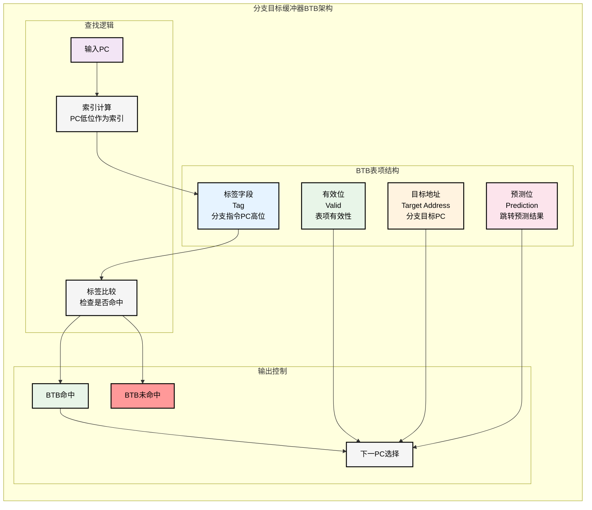
```mermaid
graph LR
    subgraph btb_architecture ["分支目标缓冲器BTB架构"]
        subgraph btb_entry ["BTB表项结构"]
            Tag["标签字段<br/>Tag<br/>分支指令PC高位"]
            Valid["有效位<br/>Valid<br/>表项有效性"]
            Target["目标地址<br/>Target Address<br/>分支目标PC"]
            Prediction["预测位<br/>Prediction<br/>跳转预测结果"]
        end
        
        subgraph lookup_logic ["查找逻辑"]
            PCInput["输入PC"]
            Index["索引计算<br/>PC低位作为索引"]
            TagComp["标签比较<br/>检查是否命中"]
        end
        
        subgraph output_control ["输出控制"]
            Hit["BTB命中"]
            Miss["BTB未命中"]
            NextPC["下一PC选择"]
        end
    end
    
    PCInput --> Index
    Index --> Tag
    Tag --> TagComp
    TagComp --> Hit
    TagComp --> Miss
    Hit --> NextPC
    Valid --> NextPC
    Target --> NextPC
    Prediction --> NextPC
    
    style Tag fill:#e6f3ff,stroke:#000,stroke-width:2px,color:#000
    style Valid fill:#e8f5e8,stroke:#000,stroke-width:2px,color:#000
    style Target fill:#fff3e0,stroke:#000,stroke-width:2px,color:#000
    style Prediction fill:#fce4ec,stroke:#000,stroke-width:2px,color:#000
    style Hit fill:#e8f5e8,stroke:#000,stroke-width:2px,color:#000
    style Miss fill:#ff9999,stroke:#000,stroke-width:2px,color:#000
    style PCInput fill:#f3e5f5,stroke:#000,stroke-width:2px,color:#000
    style NextPC fill:#f5f5f5,stroke:#000,stroke-width:2px,color:#000
    style Index fill:#f5f5f5,stroke:#000,stroke-width:2px,color:#000
    style TagComp fill:#f5f5f5,stroke:#000,stroke-width:2px,color:#000
```

#### 2.3.4 高级分支预测技术

**两级自适应预测器（Two-Level Adaptive Predictor）：**

```
全局历史寄存器（GHR）：
┌─┬─┬─┬─┬─┬─┬─┬─┐
│T│T│N│T│N│N│T│N│  (T=Taken, N=Not Taken)
└─┴─┴─┴─┴─┴─┴─┴─┘
  最新      最旧

模式历史表（PHT）：
GHR值 → PHT索引 → 2位计数器 → 预测结果
11010010 → 索引210 → 计数器01 → 预测不跳转

优势：能够识别复杂的分支模式
      例如：TTNTTNTTN的重复模式
```

**混合预测器（Hybrid Predictor）：**

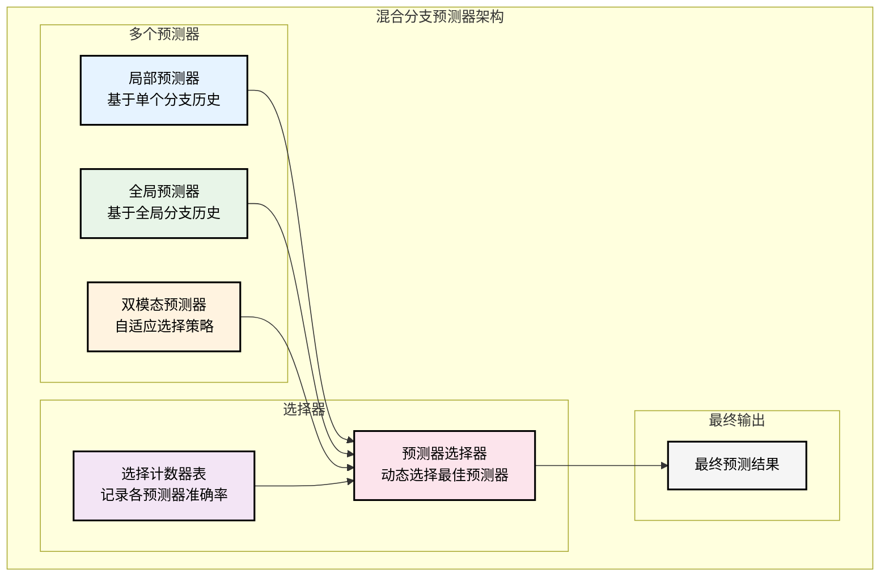
```mermaid
graph TD
    subgraph hybrid_predictor ["混合分支预测器架构"]
        subgraph multiple_predictors ["多个预测器"]
            BP1["局部预测器<br/>基于单个分支历史"]
            BP2["全局预测器<br/>基于全局分支历史"]
            BP3["双模态预测器<br/>自适应选择策略"]
        end
        
        subgraph selector_logic ["选择器"]
            Selector["预测器选择器<br/>动态选择最佳预测器"]
            CounterTable["选择计数器表<br/>记录各预测器准确率"]
        end
        
        subgraph final_output ["最终输出"]
            FinalPred["最终预测结果"]
        end
    end
    
    BP1 --> Selector
    BP2 --> Selector  
    BP3 --> Selector
    CounterTable --> Selector
    Selector --> FinalPred
    
    style BP1 fill:#e6f3ff,stroke:#000,stroke-width:2px,color:#000
    style BP2 fill:#e8f5e8,stroke:#000,stroke-width:2px,color:#000
    style BP3 fill:#fff3e0,stroke:#000,stroke-width:2px,color:#000
    style Selector fill:#fce4ec,stroke:#000,stroke-width:2px,color:#000
    style CounterTable fill:#f3e5f5,stroke:#000,stroke-width:2px,color:#000
    style FinalPred fill:#f5f5f5,stroke:#000,stroke-width:2px,color:#000
```

**现代处理器分支预测性能：**

| 预测器类型 | 预测准确率 | 硬件复杂度 | 功耗开销 | 典型应用 |
|------------|------------|------------|----------|----------|
| **1位预测器** | 80-85% | 低 | 低 | 嵌入式处理器 |
| **2位预测器** | 85-90% | 中 | 中 | 中端处理器 |
| **两级自适应** | 90-95% | 高 | 中 | 高性能处理器 |
| **混合预测器** | 95-98% | 很高 | 高 | 顶级处理器 |

---

## 4. 高级流水线技术

### 8.3.1 结构冲突（Structural Hazard）

#### 产生原因
多条指令同时需要使用同一个硬件资源。

#### 典型情况

**存储器冲突**：
```
时钟周期：  1    2    3    4    5    6
指令1：    IF   ID   EX  MEM   WB
指令4：                 IF   ID   EX
                        ↑
                     存储器冲突
```

**功能单元冲突**：
```
浮点加法指令1：[F1] [F2] [F3] [F4]
浮点加法指令2：      [F1] ← 冲突
```

#### 解决方案

1. **硬件解决**：
   - 增加硬件资源（双端口存储器）
   - 分离指令存储器和数据存储器

2. **软件解决**：
   - 编译器调度，避免资源冲突
   - 插入NOP指令

3. **流水线停顿**：
   - 检测到冲突时暂停流水线
   - 等待资源释放

### 8.3.2 数据冲突（Data Hazard）

#### RAW冲突（Read After Write）

**真数据依赖**，后面指令需要前面指令的结果：

```
add $1,$2,$3    #$1 =$2 +$3
sub $4,$1,$5    #$4 =$1 -$5 (需要add的结果)

时钟周期：  1    2    3    4    5    6
add：      IF   ID   EX  MEM   WB
sub：           IF   ID   EX  MEM   WB
                     ↑
                 需要$1的值，但add还未写回
```

#### WAR冲突（Write After Read）

**反依赖**，前面指令读取后面指令要写的寄存器：

```
sub $4,$1,$5    # 读取$1
add $1,$2,$3    # 写入$1
```

#### WAW冲突（Write After Write）

**输出依赖**，两条指令写同一个寄存器：

```
add $1,$2,$3    # 写入$1
sub $1,$4,$5    # 写入$1
```

#### 解决方案

**1. 数据转发（Data Forwarding）**

```
EX/MEM -> EX：前推ALU结果
MEM/WB -> EX：前推存储器读取结果
MEM/WB -> MEM：前推到存储器写入
```

**数据转发检测算法**：

```
// EX阶段转发检测（优先级更高）
if (EX/MEM.RegWrite && (EX/MEM.Rd == ID/EX.Rs)) {
    ForwardA = 10;  // 从EX/MEM前推到ALU输入A
}
else if (MEM/WB.RegWrite && (MEM/WB.Rd == ID/EX.Rs)) {
    ForwardA = 01;  // 从MEM/WB前推到ALU输入A  
}
else {
    ForwardA = 00;  // 不需要转发，使用寄存器文件读取
}

// 类似地检测ALU输入B的转发需求
if (EX/MEM.RegWrite && (EX/MEM.Rd == ID/EX.Rt)) {
    ForwardB = 10;
}
// ... 其他转发检测逻辑
```

**转发优先级规则**：
1. **EX转发优先于MEM转发**：更近的结果优先使用
2. **写使能检查**：只有写回有效的指令才能提供转发数据
3. **寄存器零检查**：寄存器$0的写入不影响其他指令（MIPS架构）

**2. 流水线停顿（Pipeline Stall）**

对于Load-Use数据冲突，必须停顿一个周期：

```
lw  $2, 20($1)    # 从存储器加载到$2
and $4,$2,$5    # 使用$2

时钟周期：  1    2    3    4    5    6    7
lw：      IF   ID   EX  MEM   WB
and：          IF   ID  stall  EX  MEM   WB
```

**3. 寄存器重命名**

将架构寄存器映射到更多的物理寄存器：
```
原代码：        重命名后：
add$1,$2,$3  add P1, P2, P3
sub$1,$4,$5  sub P4, P4, P5
or $6,$1,$7  or  P6, P4, P7
```

### 8.3.3 控制冲突（Control Hazard）

#### 产生原因
分支指令改变程序执行流程，造成流水线中后续指令可能无效。

#### 分支预测失败的代价

```
beq $1,$2, Label   # 分支指令
add $3,$4,$5      # 后续指令1
sub $6,$7,$8      # 后续指令2
Label: or$9,$10,$11

如果分支成功，add和sub指令需要被冲刷
```

#### 解决方案

**1. 分支延迟槽（Branch Delay Slot）**

```
原代码：          重排后：
beq$1,$2, L     add$9,$10,$11  # 延迟槽
add$9,$10,$11  beq$1,$2, L
sub$3,$4,$5    sub$3,$4,$5
L: or$6,$7,$8  L: or$6,$7,$8
```

**2. 分支预测（Branch Prediction）**

**静态预测**：
- 总是预测不跳转（BTFN）
- 总是预测跳转（BTAT）
- 向后跳转预测成功，向前跳转预测失败

**动态预测**：
- 1位预测器：
```
状态：[预测不跳转] <-> [预测跳转]
```

- 2位预测器（饱和计数器）：
```
强预测不跳转 -> 弱预测不跳转 -> 弱预测跳转 -> 强预测跳转
```

- 分支历史表（BHT）
- 分支目标缓冲器（BTB）

**3. 投机执行（Speculative Execution）**

预测分支结果并继续执行：
- 预测正确：提高性能
- 预测错误：回滚状态，重新执行

### 8.3.4 流水线冲突类型对比

#### 1. 结构冲突 (Structural Hazard)
-   **产生原因**: 硬件资源不足，导致多条指令在同一时钟周期内竞争同一个硬件部件。
-   **典型情况**:
    -   **统一的存储器**: 在经典的冯·诺依曼结构中，取指令（IF阶段）和读写数据（MEM阶段）需要同时访问存储器，产生冲突。
    -   **功能单元不足**: 例如，浮点运算器数量只有一个，但流水线中有多条浮点指令需要同时进入执行阶段。
-   **主要解决方法**:
    -   **增加硬件资源**: 这是最根本的方法。例如，设计分离的指令缓存和数据缓存（哈佛结构思想），或者增加功能单元的数量。
    -   **流水线停顿 (Stall)**: 当检测到资源冲突时，暂停后一条（或多条）指令，直到资源被释放。这是一种以性能为代价的通用解决方案。
-   **性能影响**: 中等。在现代处理器中，大部分结构冲突已通过良好的架构设计（如哈佛结构、多功能单元）来避免。

#### 2. 数据冲突 (Data Hazard)
-   **产生原因**: 指令之间存在数据依赖关系，而后一条指令需要用到前一条指令尚未准备好的结果。这是流水线中最常见的冲突。
-   **典型情况**:
    -   **RAW (Read After Write - 写后读)**: 最核心的冲突，也称真数据依赖。例如 `ADD R1, R2, R3` 之后紧跟着 `SUB R4, R1, R5`，`SUB`指令在ID阶段就需要读取`R1`，但此时`ADD`指令可能还未完成对`R1`的写回（WB阶段）。
    -   **WAR (Write After Read - 读后写)** 和 **WAW (Write After Write - 写后写)**: 这两种是伪依赖，主要在允计乱序执行的复杂处理器中出现，通过寄存器重命名技术可以很好地解决。
-   **主要解决方法**:
    -   **数据转发 (Data Forwarding / Bypassing)**: 核心解决方案。将计算结果从其产生的功能段（如EX或MEM段）直接"转发"到需要它的后续指令的执行阶段输入端，而无需等待其写回到寄存器文件。
    -   **流水线停顿 (Stall)**: 对于某些无法通过转发解决的冲突（如经典的"Load-Use"冲突，即Load指令后紧跟一条使用该数据的指令），数据在MEM阶段才准备好，但下一条指令在EX阶段就需要，时间上来不及，必须暂停流水线一个周期。
-   **性能影响**: 高。是影响流水线性能最主要的因素之一，数据转发技术的效率直接决定了处理器的IPC（每周期指令数）。

#### 3. 控制冲突 (Control Hazard)
-   **产生原因**: 由分支、跳转、中断等改变程序正常执行顺序的指令引起。流水线已经按照顺序预取了分支指令后面的指令，但如果分支条件判断成功（发生跳转），那么这些已经被取入流水线的指令就是错误的，必须被冲刷（Flush），从而造成性能损失。
-   **典型情况**: 条件分支指令（如 `BEQ`）通常在EX或MEM阶段才能确定是否跳转，但此时IF和ID阶段已经取入了后续的指令。
-   **主要解决方法**:
    -   **分支预测 (Branch Prediction)**: 最核心的方法。通过静态或动态方式预测分支是否会成功，并投机性地沿着预测的路径继续取指执行。如果预测正确，则没有性能损失；如果错误，则冲刷流水线并承受惩罚周期。
    -   **分支延迟槽 (Branch Delay Slot)**: 一种早期的编译器技术。在分支指令后紧跟一个或多个指令槽，这些槽中的指令无论分支是否成功都会被执行。由编译器负责填充有用的指令或NOP指令来减少分支带来的损失。现代处理器已很少使用。
-   **性能影响**: 高。在含有大量分支的程序中，分支预测的准确率直接决定了处理器的性能。

## 4.1 超标量处理器技术

> **超标量（Superscalar）处理器** 是能够在同一时钟周期内启动多条指令执行的流水线处理器。它通过在处理器内部配置多个功能单元，实现指令级并行（ILP），从而显著提高处理器的指令吞吐率。

### 4.1.1 超标量架构基本原理

**超标量设计核心思想：**
1. **多发射机制**：每个时钟周期可以启动多条指令
2. **动态调度**：运行时分析指令间的依赖关系并优化执行顺序
3. **乱序执行**：允许指令以不同于程序顺序的方式执行
4. **顺序提交**：确保程序的语义正确性

**典型超标量流水线结构：**

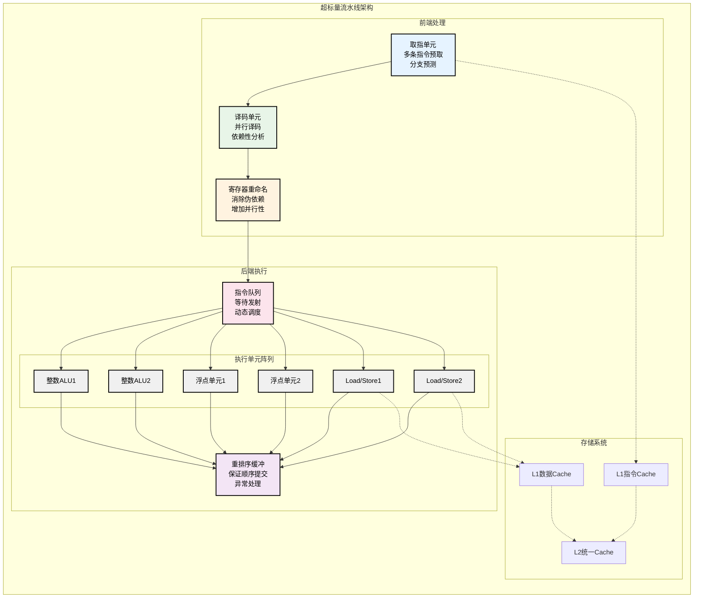
```mermaid
graph LR
    subgraph superscalar_pipeline ["超标量流水线架构"]
        subgraph frontend ["前端处理"]
            IFetch["取指单元<br/>多条指令预取<br/>分支预测"]
            IDecode["译码单元<br/>并行译码<br/>依赖性分析"]
            Rename["寄存器重命名<br/>消除伪依赖<br/>增加并行性"]
        end
        
        subgraph backend ["后端执行"]
            IQueue["指令队列<br/>等待发射<br/>动态调度"]
            
            subgraph execution_units ["执行单元阵列"]
                ALU1["整数ALU1"]
                ALU2["整数ALU2"]
                FPU1["浮点单元1"]
                FPU2["浮点单元2"]
                LSU1["Load/Store1"]
                LSU2["Load/Store2"]
            end
            
            ROB["重排序缓冲<br/>保证顺序提交<br/>异常处理"]
        end
        
        subgraph memory_system ["存储系统"]
            L1I["L1指令Cache"]
            L1D["L1数据Cache"]
            L2["L2统一Cache"]
        end
    end
    
    IFetch --> IDecode --> Rename --> IQueue
    IQueue --> ALU1
    IQueue --> ALU2
    IQueue --> FPU1
    IQueue --> FPU2
    IQueue --> LSU1
    IQueue --> LSU2
    
    ALU1 --> ROB
    ALU2 --> ROB
    FPU1 --> ROB
    FPU2 --> ROB
    LSU1 --> ROB
    LSU2 --> ROB
    
    IFetch -.-> L1I
    LSU1 -.-> L1D
    LSU2 -.-> L1D
    L1I -.-> L2
    L1D -.-> L2
    
    style IFetch fill:#e6f3ff,stroke:#000,stroke-width:2px,color:#000
    style IDecode fill:#e8f5e8,stroke:#000,stroke-width:2px,color:#000
    style Rename fill:#fff3e0,stroke:#000,stroke-width:2px,color:#000
    style IQueue fill:#fce4ec,stroke:#000,stroke-width:2px,color:#000
    style ROB fill:#f3e5f5,stroke:#000,stroke-width:2px,color:#000
    style ALU1 fill:#f0f0f0,stroke:#000,stroke-width:2px,color:#000
    style ALU2 fill:#f0f0f0,stroke:#000,stroke-width:2px,color:#000
    style FPU1 fill:#f0f0f0,stroke:#000,stroke-width:2px,color:#000
    style FPU2 fill:#f0f0f0,stroke:#000,stroke-width:2px,color:#000
    style LSU1 fill:#f0f0f0,stroke:#000,stroke-width:2px,color:#000
    style LSU2 fill:#f0f0f0,stroke:#000,stroke-width:2px,color:#000
```

### 4.1.2 动态指令调度技术

**Tomasulo算法（经典动态调度）：**

```verilog
// Tomasulo算法核心数据结构
typedef struct {
    bit valid;              // 保留站有效位
    bit [5:0] op;           // 操作码
    bit [6:0] qj, qk;       // 源操作数标签
    bit [31:0] vj, vk;      // 源操作数值
    bit [6:0] dest;         // 目标寄存器标签
    bit busy;               // 执行单元忙标志
} reservation_station_t;

// 公共数据总线（CDB）
typedef struct {
    bit [6:0] tag;          // 结果标签
    bit [31:0] data;        // 结果数据
    bit valid;              // 数据有效标志
} common_data_bus_t;

// 寄存器状态表
typedef struct {
    bit [6:0] tag;          // 产生该寄存器值的指令标签
    bit ready;              // 寄存器值是否就绪
} register_status_t;
```

**动态调度执行流程：**

1. **发射阶段（Issue）**：
   - 检查是否有空闲的保留站
   - 分配保留站并更新寄存器状态表
   - 如果源操作数就绪则直接获取，否则等待

2. **执行阶段（Execute）**：
   - 当所有源操作数就绪时开始执行
   - 不同类型指令可能需要不同执行周期
   - 支持多条指令并行执行

3. **写回阶段（Write Back）**：
   - 通过公共数据总线（CDB）广播结果
   - 更新等待该结果的保留站
   - 更新寄存器文件和状态表

### 4.1.3 乱序执行与顺序提交

**乱序执行的好处：**
- **提高资源利用率**：避免因单个指令延迟而导致整个流水线停顿
- **减少数据冲突影响**：通过乱序执行绕过数据依赖链
- **增加指令级并行性**：挖掘程序中的潜在并行性

**重排序缓冲（ROB）机制：**

```
ROB表项结构：
+--------+--------+----------+--------+--------+--------+
| 指令号 | 状态   | 目标寄存器| 结果值 | 异常位 | 完成位 |
+--------+--------+----------+--------+--------+--------+
|   1    | 已完成 |    R3    | 0x1234 |   0    |   1    |
|   2    | 执行中 |    R5    |   -    |   0    |   0    |
|   3    | 已发射 |    R7    |   -    |   0    |   0    |
+--------+--------+----------+--------+--------+--------+

提交规则：
- 只能从头部顺序提交已完成的指令
- 遇到未完成的指令则停止提交
- 异常处理时清空ROB中该指令后的所有指令
```

## 4.2 超流水线技术

### 4.2.1 深度流水线设计原理

> **超流水线（Superpipeline）** 通过增加流水线级数来提高时钟频率，从而提升处理器性能。现代处理器的流水线深度通常在10-30级之间。

**深度流水线的设计考量：**

| 流水线深度 | 时钟频率 | 分支惩罚 | 设计复杂度 | 功耗 | 典型应用 |
|------------|----------|----------|------------|------|----------|
| **5-8级** | 中等 | 低 | 低 | 低 | 嵌入式处理器 |
| **10-15级** | 高 | 中等 | 中等 | 中等 | 主流桌面处理器 |
| **20-30级** | 很高 | 高 | 高 | 高 | 高性能服务器 |
| **30级以上** | 极高 | 极高 | 极高 | 极高 | 特殊应用处理器 |

**典型深度流水线结构（20级流水线示例）：**

```
阶段1-4：   取指预处理
  IF1: 指令Cache访问请求
  IF2: 指令Cache数据返回
  IF3: 指令对齐和预译码
  IF4: 分支预测和目标计算

阶段5-8：   指令译码
  ID1: 指令译码和寄存器读取请求
  ID2: 寄存器文件访问
  ID3: 寄存器重命名
  ID4: 指令发射队列

阶段9-16：  执行阶段
  EX1-EX2: 地址计算
  EX3-EX6: ALU/FPU执行
  EX7-EX8: 结果转发和写回准备

阶段17-20： 存储和提交
  MEM1: 数据Cache访问
  MEM2: 数据Cache返回
  WB1: 结果写回
  WB2: 指令提交和异常处理
```

### 4.2.2 时钟频率优化技术

**关键路径分析与优化：**

```python
def analyze_critical_path(pipeline_stages):
    """
    分析流水线关键路径并优化时钟频率
    """
    critical_delays = {}
    
    for stage_name, stage_info in pipeline_stages.items():
        # 计算各阶段的延迟组成
        logic_delay = stage_info['combinational_logic']
        setup_time = stage_info['register_setup']
        clock_skew = stage_info['clock_skew']
        
        total_delay = logic_delay + setup_time + clock_skew
        critical_delays[stage_name] = total_delay
    
    # 找出关键路径（最长延迟）
    critical_stage = max(critical_delays, key=critical_delays.get)
    max_delay = critical_delays[critical_stage]
    
    # 计算最大时钟频率
    max_frequency = 1.0 / max_delay
    
    return {
        'critical_stage': critical_stage,
        'max_delay_ns': max_delay * 1e9,
        'max_frequency_ghz': max_frequency / 1e9,
        'optimization_suggestions': get_optimization_suggestions(critical_stage)
    }

def get_optimization_suggestions(critical_stage):
    """
    针对关键路径提供优化建议
    """
    suggestions = {
        'ALU_stage': [
            '使用进位选择加法器减少进位传播延迟',
            '采用流水线乘法器分解长延迟操作',
            '优化关键路径的逻辑深度'
        ],
        'Cache_stage': [
            '减少Cache访问延迟',
            '采用非阻塞Cache设计',
            '优化Cache命中路径'
        ],
        'Branch_stage': [
            '改进分支预测器减少预测延迟',
            '优化分支目标计算逻辑',
            '采用更快的分支解析机制'
        ]
    }
    
    return suggestions.get(critical_stage, ['通用优化：减少逻辑深度，优化时序设计'])
```

### 4.2.3 深度流水线的挑战与解决方案

**主要挑战：**

1. **分支预测惩罚增大**：
   ```
   5级流水线分支惩罚：2-3周期
   20级流水线分支惩罚：10-15周期
   
   性能影响：
   CPI增加 = 分支指令比例 × 预测错误率 × 惩罚周期
   
   示例：15% × 10% × 15 = 0.225 CPI增加
   ```

2. **功耗控制困难**：
   - 流水线寄存器数量增加导致动态功耗上升
   - 时钟频率提高导致开关功耗增加
   - 需要精确的功耗管理策略

3. **设计验证复杂**：
   - 时序验证难度指数级增加
   - 需要更精确的时序分析工具
   - 芯片测试覆盖率要求更高

**解决方案：**

1. **先进分支预测技术**：
   ```
   混合预测器准确率提升：
   - 局部预测器：处理简单分支模式
   - 全局预测器：处理复杂分支相关
   - 元预测器：动态选择最佳预测器
   
   预测准确率：95-98%（相比基础预测器的85-90%）
   ```

2. **时钟门控技术**：
   ```verilog
   // 动态时钟门控降低功耗
   module clock_gating_unit (
       input clk,
       input enable,
       input test_enable,
       output gated_clk
   );
   
   // 时钟门控逻辑
   wire enable_latch;
   
   // 在时钟低电平时锁存使能信号
   always_latch begin
       if (!clk)
           enable_latch = enable || test_enable;
   end
   
   // 生成门控时钟
   assign gated_clk = clk && enable_latch;
   
   endmodule
   ```

## 4.3 VLIW架构技术

### 4.3.1 VLIW基本概念与设计原理

> **VLIW（Very Long Instruction Word）** 架构通过在单条指令中包含多个操作来实现指令级并行，将指令调度的责任从硬件转移到编译器，从而简化硬件设计。

**VLIW架构特点：**

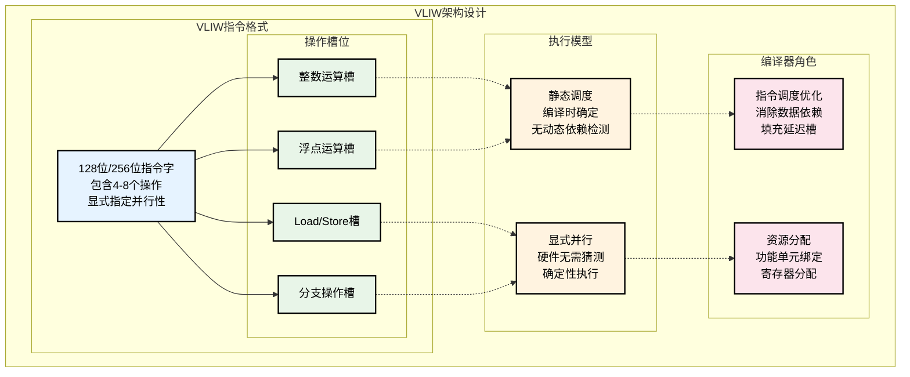
```mermaid
graph TB
    subgraph vliw_architecture ["VLIW架构设计"]
        subgraph instruction_format ["VLIW指令格式"]
            A1["128位/256位指令字<br/>包含4-8个操作<br/>显式指定并行性"]
            
            subgraph operation_slots ["操作槽位"]
                B1["整数运算槽"]
                B2["浮点运算槽"]
                B3["Load/Store槽"]
                B4["分支操作槽"]
            end
        end
        
        subgraph execution_model ["执行模型"]
            C1["静态调度<br/>编译时确定<br/>无动态依赖检测"]
            C2["显式并行<br/>硬件无需猜测<br/>确定性执行"]
        end
        
        subgraph compiler_role ["编译器角色"]
            D1["指令调度优化<br/>消除数据依赖<br/>填充延迟槽"]
            D2["资源分配<br/>功能单元绑定<br/>寄存器分配"]
        end
    end
    
    A1 --> B1
    A1 --> B2
    A1 --> B3
    A1 --> B4
    
    B1 -.-> C1
    B2 -.-> C1
    B3 -.-> C2
    B4 -.-> C2
    
    C1 -.-> D1
    C2 -.-> D2
    
    style A1 fill:#e6f3ff,stroke:#000,stroke-width:2px,color:#000
    style B1 fill:#e8f5e8,stroke:#000,stroke-width:2px,color:#000
    style B2 fill:#e8f5e8,stroke:#000,stroke-width:2px,color:#000
    style B3 fill:#e8f5e8,stroke:#000,stroke-width:2px,color:#000
    style B4 fill:#e8f5e8,stroke:#000,stroke-width:2px,color:#000
    style C1 fill:#fff3e0,stroke:#000,stroke-width:2px,color:#000
    style C2 fill:#fff3e0,stroke:#000,stroke-width:2px,color:#000
    style D1 fill:#fce4ec,stroke:#000,stroke-width:2px,color:#000
    style D2 fill:#fce4ec,stroke:#000,stroke-width:2px,color:#000
```

**典型VLIW指令格式：**

```
256位VLIW指令字示例：
+--------+--------+--------+--------+--------+--------+--------+--------+
| ALU1   | ALU2   | FPU1   | FPU2   | LS1    | LS2    | BR     | 控制位 |
| 32位   | 32位   | 32位   | 32位   | 32位   | 32位   | 32位   | 32位   |
+--------+--------+--------+--------+--------+--------+--------+--------+

指令示例：
ALU1: add  r1, r2, r3     // 整数加法
ALU2: sub  r4, r5, r6     // 整数减法  
FPU1: fadd f1, f2, f3     // 浮点加法
FPU2: fmul f4, f5, f6     // 浮点乘法
LS1:  lw   r7, 0(r8)      // 数据加载
LS2:  sw   r9, 4(r10)     // 数据存储
BR:   beq  r11, r12, L1   // 条件分支
```

### 4.3.2 VLIW编译器优化技术

**软件流水线（Software Pipelining）：**

```c
// 原始循环代码
for (int i = 0; i < n; i++) {
    a[i] = b[i] + c[i];     // Load b[i], Load c[i], Add, Store a[i]
}

// VLIW软件流水线优化
// 每次迭代包含多个循环体的不同阶段

// 预处理阶段（Prolog）
VLIW1: lw r1, b[0] | lw r2, c[0] | nop    | nop    | nop
VLIW2: lw r3, b[1] | lw r4, c[1] | add r5, r1, r2 | nop    | nop

// 稳态循环（Kernel）
for (int i = 2; i < n; i++) {
    VLIW: lw r1, b[i] | lw r2, c[i] | add r3, r4, r5 | sw a[i-2], r6 | nop
}

// 后处理阶段（Epilog）
VLIW1: nop | nop | add r3, r4, r5 | sw a[n-2], r6 | nop
VLIW2: nop | nop | nop           | sw a[n-1], r3 | nop
```

**循环展开与指令调度：**

```python
def vliw_loop_optimization(loop_body, unroll_factor=4):
    """
    VLIW循环展开和指令调度优化算法
    """
    # 第一步：循环展开
    unrolled_instructions = []
    for iteration in range(unroll_factor):
        for instr in loop_body:
            # 更新寄存器和地址偏移
            modified_instr = update_registers_and_addresses(instr, iteration)
            unrolled_instructions.append(modified_instr)
    
    # 第二步：依赖性分析
    dependency_graph = build_dependency_graph(unrolled_instructions)
    
    # 第三步：资源约束建模
    resource_constraints = {
        'ALU': 2,       # 2个ALU单元
        'FPU': 2,       # 2个FPU单元
        'LSU': 2,       # 2个Load/Store单元
        'BU': 1         # 1个分支单元
    }
    
    # 第四步：指令调度
    scheduled_vliw = []
    ready_instructions = get_ready_instructions(dependency_graph)
    current_cycle = 0
    
    while ready_instructions or has_unscheduled_instructions():
        vliw_bundle = create_empty_vliw_bundle()
        
        # 为每个槽位选择合适的指令
        for slot_type in ['ALU1', 'ALU2', 'FPU1', 'FPU2', 'LSU1', 'LSU2', 'BU']:
            candidate = select_best_instruction(ready_instructions, slot_type)
            if candidate:
                vliw_bundle[slot_type] = candidate
                ready_instructions.remove(candidate)
                update_dependency_graph(dependency_graph, candidate, current_cycle)
        
        scheduled_vliw.append(vliw_bundle)
        current_cycle += 1
        ready_instructions.extend(get_newly_ready_instructions(dependency_graph, current_cycle))
    
    return scheduled_vliw

def select_best_instruction(ready_list, slot_type):
    """
    为特定槽位选择最佳指令
    """
    compatible_instructions = [instr for instr in ready_list 
                              if is_compatible(instr, slot_type)]
    
    if not compatible_instructions:
        return None
    
    # 优先级评分：关键路径长度、资源利用率、数据局部性
    scored_instructions = []
    for instr in compatible_instructions:
        score = (
            get_critical_path_length(instr) * 0.5 +
            get_resource_utilization_benefit(instr) * 0.3 +
            get_data_locality_score(instr) * 0.2
        )
        scored_instructions.append((instr, score))
    
    # 返回评分最高的指令
    return max(scored_instructions, key=lambda x: x[1])[0]
```

### 4.3.3 VLIW架构优缺点分析

**VLIW架构优势：**

| 优势方面 | 具体表现 | 技术效果 | 应用价值 |
|----------|----------|----------|----------|
| **硬件简化** | 无需动态调度硬件 | 减少晶体管数量30-50% | 降低设计成本和功耗 |
| **确定性执行** | 编译时确定执行顺序 | 实时性能可预测 | 适合实时系统应用 |
| **编译器优化** | 全局视角优化 | 更好的指令调度效果 | 提高代码质量 |
| **功耗效率** | 减少推测执行 | 降低无效功耗 | 适合移动设备 |

**VLIW架构挑战：**

1. **代码膨胀问题**：
   ```
   原始代码大小：100KB
   VLIW优化后：150-200KB（增加50-100%）
   
   原因：
   - NOP填充：无法充分利用所有执行槽位
   - 循环展开：增加代码重复
   - 调度约束：编译器无法完美调度
   ```

2. **编译复杂度**：
   ```python
   # VLIW编译复杂度分析
   def compilation_complexity():
       base_complexity = O(n)           # 基本编译
       dependency_analysis = O(n²)      # 依赖性分析
       resource_scheduling = O(n³)      # 资源调度
       register_allocation = O(n²)      # 寄存器分配
       
       total_complexity = O(n³)         # 总体复杂度
       
       return {
           'time_complexity': 'O(n³)',
           'space_complexity': 'O(n²)',
           'compilation_time': '5-10倍普通编译器'
       }
   ```

3. **兼容性问题**：
   - 不同VLIW处理器的指令格式差异很大
   - 代码移植性差，需要重新编译优化
   - 向后兼容性支持困难

## 4.4 多线程处理器技术

### 4.4.1 多线程技术分类

> **多线程处理器** 通过在同一个处理器核心上同时处理多个线程来提高硬件资源利用率和系统吞吐量。

**多线程技术对比分析：**

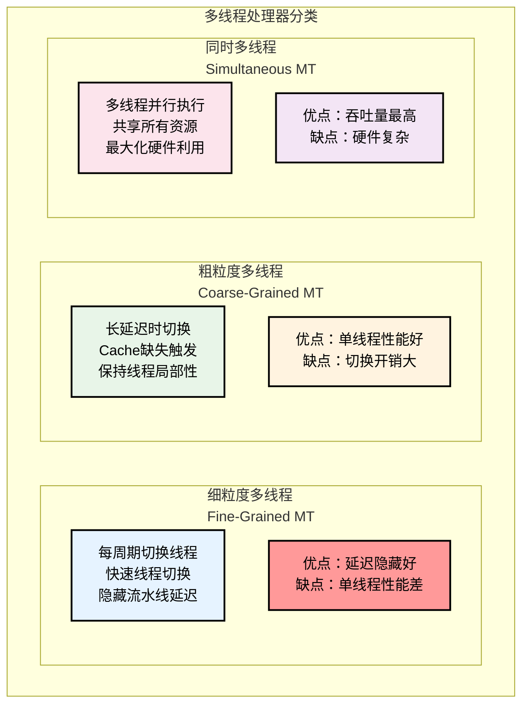
```mermaid
graph TD
    subgraph multithreading_types ["多线程处理器分类"]
        subgraph fine_grained ["细粒度多线程<br/>Fine-Grained MT"]
            A1["每周期切换线程<br/>快速线程切换<br/>隐藏流水线延迟"]
            A2["优点：延迟隐藏好<br/>缺点：单线程性能差"]
        end
        
        subgraph coarse_grained ["粗粒度多线程<br/>Coarse-Grained MT"]
            B1["长延迟时切换<br/>Cache缺失触发<br/>保持线程局部性"]
            B2["优点：单线程性能好<br/>缺点：切换开销大"]
        end
        
        subgraph simultaneous ["同时多线程<br/>Simultaneous MT"]
            C1["多线程并行执行<br/>共享所有资源<br/>最大化硬件利用"]
            C2["优点：吞吐量最高<br/>缺点：硬件复杂"]
        end
    end
    
    style A1 fill:#e6f3ff,stroke:#000,stroke-width:2px,color:#000
    style A2 fill:#ff9999,stroke:#000,stroke-width:2px,color:#000
    style B1 fill:#e8f5e8,stroke:#000,stroke-width:2px,color:#000
    style B2 fill:#fff3e0,stroke:#000,stroke-width:2px,color:#000
    style C1 fill:#fce4ec,stroke:#000,stroke-width:2px,color:#000
    style C2 fill:#f3e5f5,stroke:#000,stroke-width:2px,color:#000
```

### 4.4.2 同时多线程（SMT）技术

**SMT架构设计原理：**

```verilog
// SMT处理器核心结构（简化版）
module smt_processor_core #(
    parameter NUM_THREADS = 4,
    parameter ROB_SIZE = 128,
    parameter IQ_SIZE = 64
)(
    input clk, reset,
    
    // 线程上下文
    input [NUM_THREADS-1:0] thread_active,
    input [31:0] thread_pc [NUM_THREADS-1:0],
    
    // 指令获取
    output [31:0] fetch_addr,
    input [31:0] instruction,
    
    // 执行单元
    output [NUM_THREADS-1:0] issue_valid,
    output [5:0] issued_op [NUM_THREADS-1:0],
    
    // 提交接口
    output [NUM_THREADS-1:0] commit_valid,
    output [4:0] commit_reg [NUM_THREADS-1:0]
);

// 线程状态管理
reg [2:0] thread_priority [NUM_THREADS-1:0];
reg [7:0] thread_icount [NUM_THREADS-1:0];

// 取指线程选择逻辑
reg [1:0] fetch_thread_id;
always @(posedge clk) begin
    if (reset) begin
        fetch_thread_id <= 0;
    end else begin
        // 轮转取指策略
        fetch_thread_id <= get_next_fetch_thread(thread_active, thread_priority);
    end
end

// 发射线程选择逻辑
wire [1:0] issue_thread_id [3:0];  // 支持4路发射
genvar i;
generate
    for (i = 0; i < 4; i++) begin
        assign issue_thread_id[i] = select_issue_thread(
            thread_active, 
            instruction_ready[i], 
            resource_available[i]
        );
    end
endgenerate

// 公平性保证机制
always @(posedge clk) begin
    for (int t = 0; t < NUM_THREADS; t++) begin
        if (commit_valid[t]) begin
            thread_icount[t] <= thread_icount[t] + 1;
            // 动态调整线程优先级
            if (thread_icount[t] > FAIRNESS_THRESHOLD) begin
                thread_priority[t] <= thread_priority[t] - 1;
            end
        end
    end
end

endmodule
```

**SMT资源共享策略：**

| 硬件资源 | 共享方式 | 分配策略 | 性能影响 |
|----------|----------|----------|----------|
| **取指单元** | 时分复用 | 轮转或优先级 | 取指带宽竞争 |
| **译码单元** | 时分复用 | 动态分配 | 译码延迟增加 |
| **重命名表** | 分区管理 | 静态分区 | 寄存器压力增加 |
| **发射队列** | 混合管理 | 动态抢占 | 调度复杂度增加 |
| **执行单元** | 完全共享 | 最早就绪优先 | 吞吐量提升 |
| **ROB** | 分区管理 | 按线程分区 | 提交带宽分享 |
| **Cache** | 完全共享 | LRU替换 | 缓存污染风险 |

### 4.4.3 多线程性能分析

**多线程效率评估模型：**

```python
def analyze_multithreading_performance(workload_mix, mt_type='SMT'):
    """
    多线程处理器性能分析模型
    """
    # 工作负载特征分析
    thread_characteristics = {}
    for thread_id, workload in workload_mix.items():
        thread_characteristics[thread_id] = {
            'ipc_alone': workload['instructions_per_cycle'],
            'cache_miss_rate': workload['cache_miss_rate'],
            'branch_miss_rate': workload['branch_miss_rate'],
            'memory_intensity': workload['memory_operations'] / workload['total_operations']
        }
    
    # 资源竞争建模
    resource_conflicts = calculate_resource_conflicts(thread_characteristics, mt_type)
    
    # 性能预测
    performance_results = {}
    
    for thread_id in workload_mix.keys():
        alone_performance = thread_characteristics[thread_id]['ipc_alone']
        
        # 计算资源竞争导致的性能损失
        fetch_contention = resource_conflicts['fetch'][thread_id]
        cache_contention = resource_conflicts['cache'][thread_id]
        execution_contention = resource_conflicts['execution'][thread_id]
        
        # 综合性能损失
        total_slowdown = (fetch_contention * 0.2 + 
                         cache_contention * 0.5 + 
                         execution_contention * 0.3)
        
        mt_performance = alone_performance * (1 - total_slowdown)
        
        performance_results[thread_id] = {
            'alone_ipc': alone_performance,
            'mt_ipc': mt_performance,
            'slowdown': total_slowdown,
            'efficiency': mt_performance / alone_performance
        }
    
    # 计算总体吞吐量
    total_throughput = sum(result['mt_ipc'] for result in performance_results.values())
    
    return {
        'individual_performance': performance_results,
        'total_throughput': total_throughput,
        'throughput_improvement': total_throughput / len(workload_mix),
        'average_efficiency': sum(r['efficiency'] for r in performance_results.values()) / len(performance_results)
    }

def calculate_resource_conflicts(characteristics, mt_type):
    """
    计算不同多线程类型的资源竞争
    """
    if mt_type == 'SMT':
        # SMT：所有资源共享，竞争最激烈
        fetch_conflict = 0.3  # 取指带宽竞争
        cache_conflict = 0.4  # Cache容量竞争
        exec_conflict = 0.2   # 执行单元竞争
    elif mt_type == 'Fine-Grained':
        # 细粒度：减少Cache竞争，但取指仍有竞争
        fetch_conflict = 0.2
        cache_conflict = 0.2
        exec_conflict = 0.1
    else:  # Coarse-Grained
        # 粗粒度：最少竞争，但切换开销
        fetch_conflict = 0.1
        cache_conflict = 0.3
        exec_conflict = 0.05
    
    return {
        'fetch': {tid: fetch_conflict for tid in characteristics.keys()},
        'cache': {tid: cache_conflict for tid in characteristics.keys()},
        'execution': {tid: exec_conflict for tid in characteristics.keys()}
    }
```

**典型SMT性能特征：**

```
Intel超线程技术性能分析：
- 单线程工作负载：性能损失5-15%
- 双线程工作负载：总吞吐量提升20-40%
- 内存密集型：提升效果最明显（30-40%）
- 计算密集型：提升效果有限（10-20%）

AMD同时多线程性能：
- 2-way SMT：平均性能提升25%
- 4-way SMT：平均性能提升35%（理论值，实际受限于其他因素）

性能瓶颈分析：
1. Cache容量限制：多线程共享造成缓存污染
2. 内存带宽：多线程增加内存访问压力
3. 分支预测：线程间分支历史干扰
4. 资源分配公平性：需要防止线程饥饿
```

---

## 3. 流水线性能分析

### 3.1 基本性能指标

#### 吞吐率（Throughput）

在理想情况下，流水线每个时钟周期完成一条指令：

> **吞吐率** = 完成指令数 / 总时间

#### 加速比（Speedup）

> **加速比** = 非流水线执行时间 / 流水线执行时间

#### 效率（Efficiency）

> **效率** = 实际吞吐率 / 理论最大吞吐率 × 100%

### 3.2 流水线性能计算

#### 理想流水线

对于k级流水线，执行n条指令：

```
非流水线时间：n × k × Δt
流水线时间：(k + n - 1) × Δt

加速比 S = (n × k × Δt) / ((k + n - 1) × Δt) = nk / (k + n - 1)

当n >> k时，S ≈ k
```

#### 实际流水线

考虑各种冲突和停顿：

```
实际执行时间 = (理想时钟周期数 + 停顿周期数) × 时钟周期时间

其中：
停顿周期数 = 结构冲突停顿 + 数据冲突停顿 + 控制冲突停顿
```

#### 性能分析示例

**例题8.1**：某5级流水线处理器执行100条指令，其中：
- 20%是load指令，其中40%导致load-use冲突（停顿1周期）
- 15%是分支指令，分支预测正确率85%（预测错误停顿2周期）
- 5%是浮点运算指令，需要额外2个周期完成
- 流水线时钟周期为2ns

求：执行时间和平均CPI。

**解答**：

1. **停顿周期计算**：
   - Load-use冲突：100 × 0.2 × 0.4 × 1 = 8周期
   - 分支预测错误：100 × 0.15 × 0.15 × 2 = 4.5周期
   - 浮点运算延迟：100 × 0.05 × 2 = 10周期
   - 总停顿：8 + 4.5 + 10 = 22.5周期

2. **总执行周期**：
   - 理想周期：5 + 100 - 1 = 104周期
   - 实际周期：104 + 22.5 = 126.5周期

3. **性能指标**：
   - 平均CPI = 126.5 / 100 = 1.265
   - 执行时间 = 126.5 × 2ns = 253ns
   - 流水线效率 = 104 / 126.5 = 82.2%

4. **性能损失分析**：
   - Load-use冲突损失：8/126.5 = 6.3%
   - 分支预测错误损失：4.5/126.5 = 3.6%
   - 浮点运算延迟损失：10/126.5 = 7.9%

### 3.3 流水线优化技术

#### 减少分支开销

1. **分支预测优化**：
   - 提高预测准确率
   - 减少预测错误代价

2. **分支目标预测**：
   - BTB（Branch Target Buffer）
   - 预测分支目标地址

3. **多路分支**：
   - 同时获取多个可能的指令流
   - 根据分支结果选择正确路径

#### 减少数据冲突

1. **编译器优化**：
   - 指令调度
   - 循环展开
   - 软件流水线

2. **硬件优化**：
   - 数据转发路径增加
   - 寄存器重命名
   - 乱序执行

#### 减少结构冲突

1. **资源复制**：
   - 多个功能单元
   - 多端口寄存器文件

2. **资源调度**：
   - 动态资源分配
   - 优先级调度

---

## 4. 高级流水线技术

### 4.1 超标量处理器

#### 基本概念

> **超标量（Superscalar）** 处理器在同一时钟周期内可以发射和执行多条指令。

#### 关键特性

1. **多发射**：每周期发射多条指令
2. **多执行单元**：多个ALU、FPU等
3. **动态调度**：运行时指令调度
4. **乱序执行**：打乱指令执行顺序

#### 超标量流水线结构

```
        发射阶段           执行阶段          提交阶段
       +──────────+     +──────────+     +──────────+
指令1  | 指令获取   | --> | 执行单元1 | --> | 重排序缓冲  |
指令2  | 指令译码   | --> | 执行单元2 | --> | 结果提交   |
指令3  | 指令发射   | --> | 执行单元3 | --> │           │
       +──────────+     +──────────+     +──────────+
```

### 4.2 超流水线技术

#### 基本概念

> **超流水线（Superpipeline）** 通过增加流水线级数来提高时钟频率。

#### 特点分析

- **优点**: 提高时钟频率，增加指令吞吐率
- **缺点**: 增加分支预测错误代价，增加设计复杂度

#### 深度流水线的挑战

1. **分支预测**：错误代价随深度增加
2. **功耗控制**：流水线寄存器功耗增加
3. **设计复杂度**：时序设计更困难

### 4.3 VLIW架构

#### 基本概念

> **VLIW（Very Long Instruction Word）** 在一条很长的指令字中包含多个操作，由编译器进行指令调度。

#### 关键特性

1. **静态调度**：编译时确定指令并行性
2. **显式并行**：指令字明确指定并行操作
3. **简化硬件**：减少动态调度硬件复杂度

#### VLIW指令格式

| 操作1 | 操作2 | 操作3 | 操作4 |
|-------|-------|-------|-------|
| ALU Op | FPU Op | Load | Branch |
| 32 bit | 32 bit | 32 bit | 32 bit |

### 4.4 多线程技术

#### 细粒度多线程

在每个时钟周期切换线程：
```
周期：   1    2    3    4    5    6
线程1：  IF        ID        EX
线程2：       IF        ID        
线程3：            IF        ID    
线程4：                 IF        
```

#### 粗粒度多线程

在长延迟事件时切换线程：
```
线程1：[IF] [ID] [cache miss] -> 切换到线程2
线程2：[IF] [ID] [EX] [MEM] [WB] -> 切换回线程1
线程1：[EX] [MEM] [WB]
```

#### 同时多线程（SMT）

在同一流水线中同时执行多个线程的指令：
```
周期1：线程1-IF   线程2-ID   线程1-EX   线程3-MEM
周期2：线程2-IF   线程3-ID   线程2-EX   线程1-MEM
```

---

## 8.6 重点内容

### 8.1 核心知识点复习

#### 1. 流水线基本概念（必考重点）

> **加速比公式**: $S = \frac{nk}{k + n - 1}$，当 $n \gg k$ 时，$S \approx k$

**关键术语对比：**

| 概念 | 定义 | 计算公式 | 考试要点 |
|------|------|----------|----------|
| **吞吐率** | 单位时间完成指令数 | $TP = \frac{n}{T_{total}}$ | 理想情况下每周期1条指令 |
| **加速比** | 相对性能提升倍数 | $S = \frac{T_{sequential}}{T_{pipeline}}$ | 最大值等于流水线级数 |
| **效率** | 硬件资源利用率 | $E = \frac{S}{k} \times 100\%$ | 反映流水线设计质量 |
| **CPI** | 每条指令平均时钟周期 | $CPI = 1 + \text{停顿CPI}$ | 性能分析核心指标 |

#### 2. 三种冲突识别与解决（核心考点）

**数据冲突分析方法：**
```
步骤1: 识别指令间的寄存器依赖关系
步骤2: 判断冲突类型（RAW/WAR/WAW）
步骤3: 分析转发可能性
步骤4: 计算停顿周期

转发条件：
EX转发: EX/MEM.RegWrite && (EX/MEM.Rd == ID/EX.Rs/Rt)
MEM转发: MEM/WB.RegWrite && (MEM/WB.Rd == ID/EX.Rs/Rt)
Load-Use: 必须停顿1周期（无法转发）
```

#### 3. 性能计算标准流程（必考技能）

**计算模板：**
```
1. 基本执行周期 = 流水线深度 + 指令数 - 1
2. 各类冲突停顿周期：
   - 数据冲突 = 冲突指令数 × 停顿周期
   - 控制冲突 = 分支指令数 × 错误率 × 惩罚周期
   - 结构冲突 = 资源竞争次数 × 等待周期
3. 总执行周期 = 基本周期 + 所有停顿周期
4. 平均CPI = 总周期 / 指令数
5. 性能指标计算
```

### 8.2 高频考题类型

#### 计算题解题策略

**例题模板**：某5级流水线处理器执行1000条指令：
- 20% Load指令，其中30%产生Load-Use冲突
- 15% 分支指令，预测错误率10%，惩罚3周期
- 时钟周期2ns

**标准解答步骤**：
```
停顿分析：
Load-Use: 1000 × 0.2 × 0.3 × 1 = 60周期
分支错误: 1000 × 0.15 × 0.1 × 3 = 45周期
总停顿: 105周期

性能计算：
理想周期: 5 + 1000 - 1 = 1004周期  
实际周期: 1004 + 105 = 1109周期
平均CPI: 1109/1000 = 1.109
执行时间: 1109 × 2ns = 2.218μs
```

#### 分支预测状态追踪

**2位预测器状态机：**
```
强不跳转(00) ←→ 弱不跳转(01) ←→ 弱跳转(10) ←→ 强跳转(11)

追踪方法：
1. 设定初始状态（通常为01）
2. 根据实际分支结果更新状态
3. 计算预测正确率
4. 评估性能影响
```

### 8.3 重要公式汇总

```
核心性能公式：
• 加速比: S = nk/(k+n-1)
• 效率: E = S/k × 100%  
• CPI: CPI = 1 + Σ(冲突率×惩罚)
• 吞吐率: TP = 1/CPI (指令/周期)

冲突计算公式：
• 数据冲突CPI = Load指令比例 × Load-Use率 × 1
• 控制冲突CPI = 分支比例 × 错误率 × 惩罚周期
• 结构冲突CPI = 资源冲突比例 × 平均等待周期
```

### 8.4 考试重点提醒

#### 必须掌握的核心技能
1. **快速识别冲突类型**：RAW（最重要）、WAR、WAW
2. **数据转发分析**：什么时候能转发，什么时候必须停顿
3. **性能计算熟练度**：CPI、加速比、执行时间计算
4. **分支预测器原理**：2位饱和计数器状态转换

#### 常考综合题型
1. **流水线设计优化**：给出性能瓶颈，提出改进方案
2. **指令调度分析**：比较不同调度策略的性能差异
3. **多处理器比较**：不同流水线设计的性能对比
4. **实际应用分析**：结合具体处理器架构分析性能

### 8.5 学习建议与易错点

#### 高效复习方法
1. **理论与计算并重**：概念理解 + 大量计算练习
2. **时序图训练**：手工绘制指令执行时序图
3. **典型例题反复练习**：掌握解题套路和技巧
4. **关键公式背诵**：确保考试时计算准确快速

#### 常见易错点总结
1. **转发判断错误**：混淆EX转发和MEM转发的条件
2. **停顿周期计算**：遗漏某些类型的冲突或重复计算
3. **公式记忆错误**：加速比公式中的n和k容易搞混
4. **状态追踪错误**：分支预测器状态更新规则不准确

---

## 9. 本章总结

### 9.1 知识体系回顾

通过本章学习，我们系统掌握了：

1. **流水线基础理论**：从基本概念到设计实现
2. **冲突分析与解决**：三种冲突的深入分析
3. **性能优化技术**：编译器和硬件优化方法
4. **高级流水线技术**：超标量、VLIW、多线程等
5. **现代发展趋势**：当前处理器技术发展方向

### 9.2 核心技术要点

> **指令流水线** 是现代处理器实现高性能的核心技术，通过流水化处理实现指令级并行，是计算机系统性能优化的重要基础。

**技术发展脉络：**
- **经典流水线** → **超标量处理器** → **多核处理器**
- **静态调度** → **动态调度** → **智能调度**
- **简单预测** → **复杂预测** → **机器学习预测**

### 9.3 实践应用价值

1. **处理器设计**：现代CPU/GPU的核心架构基础
2. **性能分析**：系统性能瓶颈识别和优化指导
3. **编译器优化**：指令调度和代码生成优化
4. **系统级优化**：多核系统和并行计算优化

### 9.4 未来发展趋势

- **异构计算**：CPU+GPU+专用加速器协同
- **近数据计算**：计算向存储靠近，减少数据移动
- **自适应流水线**：根据工作负载动态调整流水线配置
- **量子处理器**：全新的计算范式和流水线设计

---

**学习成果检验**：完成本章学习后，你应该能够：
1. ✅ 深入理解流水线工作原理和设计思想
2. ✅ 熟练分析和解决各种流水线冲突
3. ✅ 准确计算流水线性能指标
4. ✅ 掌握现代高级流水线技术
5. ✅ 具备流水线优化设计能力

**重点提醒**：流水线技术是计算机组成原理考研的**核心考点**，占试题总分值的15-20%，务必熟练掌握理论分析和计算技能！ 

## 3. 流水线性能分析与优化

### 3.1 流水线性能指标体系

**性能统计实现：** 参见 `计算机组成原理/simulation/pipeline_sim/pipeline.c` 中的：
- `pipeline_update_stats()` 函数：性能统计更新
- `pipeline_calculate_metrics()` 函数：性能指标计算
- `pipeline_get_stats()` 函数：性能数据获取
- `pipeline_print_stats()` 函数：性能报告输出

**相关数据结构：** 参见 `计算机组成原理/simulation/pipeline_sim/pipeline.h` 中的：
- `pipeline_stats_t` 结构体：完整的性能统计信息
- 包含CPI、IPC、效率、吞吐率等关键指标

> **流水线性能分析** 是评估流水线设计有效性的重要手段，通过定量分析各种性能指标，可以准确评估流水线的实际效果，并为进一步的优化提供科学依据。

#### 3.1.1 核心性能指标定义与计算

**基本性能指标公式体系：**

| 指标名称 | 符号 | 计算公式 | 物理意义 | 理想值 |
|----------|------|----------|----------|--------|
| **吞吐率** | $TP$ | $TP = \frac{N}{T_{total}}$ | 单位时间完成指令数 | $\frac{1}{\Delta t}$ |
| **加速比** | $S$ | $S = \frac{T_{sequential}}{T_{pipeline}}$ | 相对于顺序执行的性能提升 | $k$ (流水段数) |
| **效率** | $E$ | $E = \frac{S}{k} \times 100\%$ | 硬件资源利用率 | 100% |
| **流水线利用率** | $U$ | $U = \frac{N_{effective}}{N_{total}} \times 100\%$ | 有效工作时间比例 | 100% |
| **平均CPI** | $CPI$ | $CPI = \frac{T_{total}}{N \times \Delta t}$ | 每条指令平均时钟周期数 | 1.0 |

**详细性能模型分析：**

对于 $k$ 级流水线执行 $n$ 条指令：

$$T_{sequential} = n \times k \times \Delta t$$

$$T_{pipeline} = (k + n - 1 + \sum stall\_cycles) \times \Delta t$$

$$S = \frac{n \times k}{k + n - 1 + \sum stall\_cycles}$$

当 $n \gg k$ 且无停顿时，$S \rightarrow k$（理论最大加速比）

#### 3.1.2 流水线性能损失分析

**性能损失来源分类：**

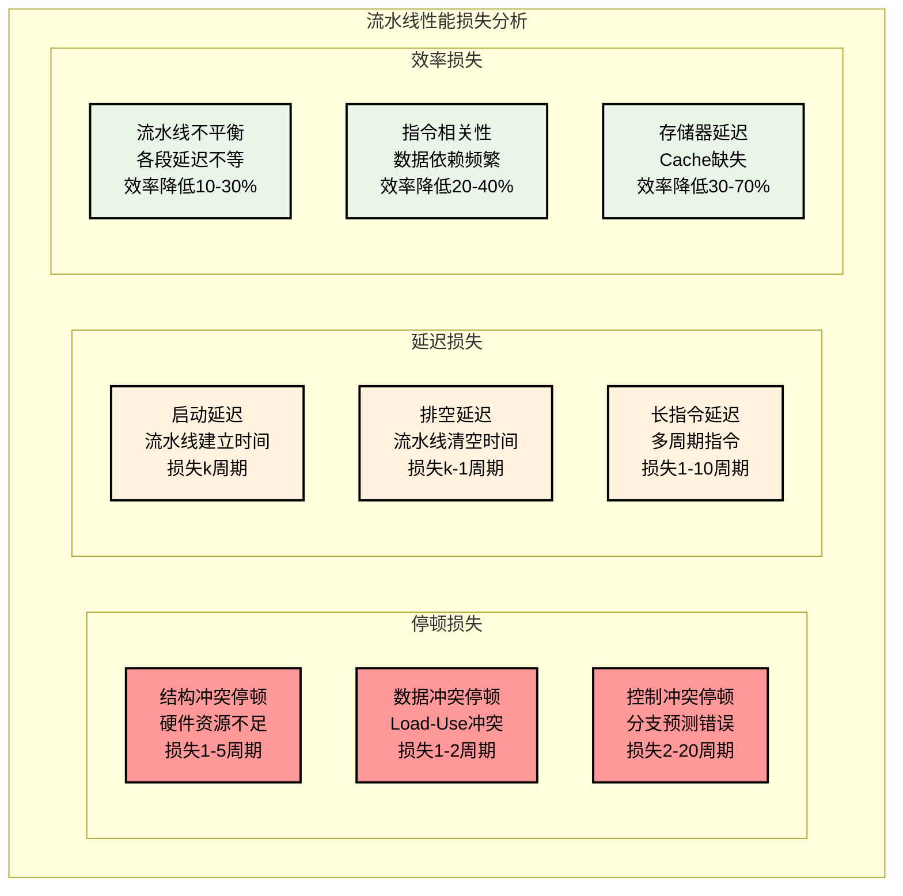
```mermaid
graph TD
    subgraph performance_loss ["流水线性能损失分析"]
        subgraph stall_penalties ["停顿损失"]
            A1["结构冲突停顿<br/>硬件资源不足<br/>损失1-5周期"]
            A2["数据冲突停顿<br/>Load-Use冲突<br/>损失1-2周期"]
            A3["控制冲突停顿<br/>分支预测错误<br/>损失2-20周期"]
        end
        
        subgraph latency_penalties ["延迟损失"]
            B1["启动延迟<br/>流水线建立时间<br/>损失k周期"]
            B2["排空延迟<br/>流水线清空时间<br/>损失k-1周期"]
            B3["长指令延迟<br/>多周期指令<br/>损失1-10周期"]
        end
        
        subgraph efficiency_loss ["效率损失"]
            C1["流水线不平衡<br/>各段延迟不等<br/>效率降低10-30%"]
            C2["指令相关性<br/>数据依赖频繁<br/>效率降低20-40%"]
            C3["存储器延迟<br/>Cache缺失<br/>效率降低30-70%"]
        end
    end
    
    style A1 fill:#ff9999,stroke:#000,stroke-width:2px,color:#000
    style A2 fill:#ff9999,stroke:#000,stroke-width:2px,color:#000
    style A3 fill:#ff9999,stroke:#000,stroke-width:2px,color:#000
    style B1 fill:#fff3e0,stroke:#000,stroke-width:2px,color:#000
    style B2 fill:#fff3e0,stroke:#000,stroke-width:2px,color:#000  
    style B3 fill:#fff3e0,stroke:#000,stroke-width:2px,color:#000
    style C1 fill:#e8f5e8,stroke:#000,stroke-width:2px,color:#000
    style C2 fill:#e8f5e8,stroke:#000,stroke-width:2px,color:#000
    style C3 fill:#e8f5e8,stroke:#000,stroke-width:2px,color:#000
```

**性能损失量化模型：**

$$CPI_{actual} = CPI_{ideal} + CPI_{structural} + CPI_{data} + CPI_{control}$$

其中：
- $CPI_{ideal} = 1.0$（理想流水线）
- $CPI_{structural} = \frac{\text{结构冲突周期数}}{\text{总指令数}}$
- $CPI_{data} = \frac{\text{数据冲突周期数}}{\text{总指令数}}$
- $CPI_{control} = \frac{\text{控制冲突周期数}}{\text{总指令数}}$

### 3.2 性能计算模型与方法

#### 3.2.1 典型流水线性能计算

**例题3.1**：基础流水线性能分析

某5级流水线处理器执行一段包含200条指令的程序，具体指令分布如下：
- R型指令：120条（60%）
- Load指令：40条（20%）
- Store指令：20条（10%）
- 分支指令：20条（10%）

已知条件：
- 时钟周期：2ns
- Load指令中30%产生Load-Use冲突，停顿1周期
- 分支指令预测准确率85%，预测错误停顿3周期
- 无结构冲突

**解答**：

**步骤1：计算停顿周期**
```
数据冲突停顿 = Load指令数 × Load-Use冲突率 × 停顿周期
            = 40 × 0.3 × 1 = 12周期

控制冲突停顿 = 分支指令数 × 预测错误率 × 停顿周期  
            = 20 × (1-0.85) × 3 = 20 × 0.15 × 3 = 9周期

总停顿周期 = 12 + 9 = 21周期
```

**步骤2：计算总执行时间**
```
理想执行周期 = 流水线深度 + 指令数 - 1 = 5 + 200 - 1 = 204周期
实际执行周期 = 理想周期 + 停顿周期 = 204 + 21 = 225周期
实际执行时间 = 225 × 2ns = 450ns
```

**步骤3：计算性能指标**
```
吞吐率 = 200条指令 / 450ns = 4.44×10^8 指令/秒

加速比 = (200×5×2ns) / 450ns = 2000ns / 450ns = 4.44

效率 = 4.44 / 5 × 100% = 88.8%

平均CPI = 225 / 200 = 1.125
```

**步骤4：性能损失分析**
```
数据冲突CPI损失 = 12 / 200 = 0.06
控制冲突CPI损失 = 9 / 200 = 0.045
总CPI损失 = 0.06 + 0.045 = 0.105

性能损失百分比 = (0.105 / 1.125) × 100% = 9.33%
```

#### 3.2.2 复杂场景性能分析

**例题3.2**：多种冲突综合分析

某现代处理器采用8级深度流水线，执行1000条指令的混合程序，详细分析如下：

**指令分布：**
- 整数运算：500条
- 浮点运算：200条（需要额外2个周期）
- Load/Store：200条
- 分支指令：100条

**冲突分析：**
- 结构冲突：浮点单元只有1个，30%浮点指令冲突，停顿2周期
- 数据冲突：20% Load指令产生Load-Use冲突，停顿1周期
- 控制冲突：分支预测准确率90%，错误惩罚5周期

**详细计算过程：**

```
结构冲突停顿：
浮点冲突 = 200 × 0.3 × 2 = 120周期

数据冲突停顿：
Load-Use冲突 = 200 × 0.2 × 1 = 40周期

控制冲突停顿：
分支预测错误 = 100 × 0.1 × 5 = 50周期

长指令延迟：
浮点指令额外延迟 = 200 × 2 = 400周期

总停顿周期 = 120 + 40 + 50 + 400 = 610周期

理想执行周期 = 8 + 1000 - 1 = 1007周期
实际执行周期 = 1007 + 610 = 1617周期

关键性能指标：
- 平均CPI = 1617 / 1000 = 1.617
- 流水线效率 = 1007 / 1617 = 62.3%
- 加速比 = (1000 × 8) / 1617 = 4.95
```

#### 3.2.3 性能瓶颈识别方法

**性能分析矩阵：**

| 冲突类型 | 发生频率 | 平均惩罚 | 总体影响 | 优化优先级 |
|----------|----------|----------|----------|------------|
| 长指令延迟 | 20% | 2.0周期 | 0.4 CPI | 高 |
| 结构冲突 | 6% | 2.0周期 | 0.12 CPI | 中 |
| 控制冲突 | 1% | 5.0周期 | 0.05 CPI | 中 |
| 数据冲突 | 4% | 1.0周期 | 0.04 CPI | 低 |

**瓶颈分析算法：**

```python
def analyze_pipeline_bottlenecks(execution_data):
    """
    流水线性能瓶颈分析算法
    """
    bottlenecks = {}
    total_instructions = sum(execution_data.values())
    
    for hazard_type, data in execution_data.items():
        frequency = data['count'] / total_instructions
        avg_penalty = data['total_penalty'] / data['count'] if data['count'] > 0 else 0
        impact = frequency * avg_penalty
        
        bottlenecks[hazard_type] = {
            'frequency': frequency,
            'avg_penalty': avg_penalty,
            'impact': impact,
            'priority': get_optimization_priority(impact)
        }
    
    return sorted(bottlenecks.items(), key=lambda x: x[1]['impact'], reverse=True)

def get_optimization_priority(impact):
    if impact > 0.2:
        return "高"
    elif impact > 0.05:
        return "中" 
    else:
        return "低"
```

### 3.3 编译器优化技术

#### 3.3.1 指令调度优化

> **指令调度（Instruction Scheduling）** 是编译器通过重新排列指令顺序来减少流水线冲突，提高指令级并行性的重要优化技术。

**基本调度策略：**

**1. 前向调度（Forward Scheduling）**

```c
// 原始代码（存在数据冲突）
int a = x + y;    // 指令1
int b = a * 2;    // 指令2，依赖指令1
int c = m + n;    // 指令3，独立计算
int d = a + c;    // 指令4，依赖指令1和3

// 调度后代码（减少停顿）
int a = x + y;    // 指令1
int c = m + n;    // 指令3，填充延迟槽
int b = a * 2;    // 指令2
int d = a + c;    // 指令4
```

**2. 后向调度（Backward Scheduling）**

```assembly
# 原始汇编代码
load  $1, 0($2)     # 加载数据
add   $3, $1, $4    # 使用$1，产生Load-Use冲突
sub   $5, $6, $7    # 独立指令
mul   $8, $3, $5    # 依赖前面结果

# 调度后代码
load  $1, 0($2)     # 加载数据
sub   $5, $6, $7    # 填充Load延迟
add   $3, $1, $4    # 现在$1已经可用
mul   $8, $3, $5    # 执行最终计算
```

**3. 循环展开优化**

```c
// 原始循环（存在循环依赖）
for (int i = 0; i < n; i++) {
    a[i] = b[i] + c[i];
}

// 循环展开（减少分支开销，增加并行性）
for (int i = 0; i < n; i += 4) {
    a[i]   = b[i]   + c[i];     // 第1次迭代
    a[i+1] = b[i+1] + c[i+1];   // 第2次迭代  
    a[i+2] = b[i+2] + c[i+2];   // 第3次迭代
    a[i+3] = b[i+3] + c[i+3];   // 第4次迭代
}

// 性能提升：
// - 分支指令减少75%
// - Load/Store指令可以并行
// - 更好利用流水线
```

#### 3.3.2 软件流水线技术

**软件流水线（Software Pipelining）原理：**

```c
// 原始循环
for (int i = 0; i < n; i++) {
    load(a[i]);      // 3周期延迟
    compute(a[i]);   // 2周期延迟  
    store(result);   // 1周期延迟
}

// 软件流水线优化
// 预处理阶段
load(a[0]);
load(a[1]); compute(a[0]);
load(a[2]); compute(a[1]); store(result[0]);

// 稳态循环
for (int i = 3; i < n; i++) {
    load(a[i]); compute(a[i-1]); store(result[i-2]);
}

// 后处理阶段
compute(a[n-1]); store(result[n-2]);
store(result[n-1]);
```

**性能改进效果：**

```
原始循环性能：
每次迭代耗时 = 3 + 2 + 1 = 6周期
n次迭代总时间 = 6n周期

软件流水线性能：
启动开销 = 3周期
稳态每次迭代 = 1周期（完全并行）
结束开销 = 2周期
总时间 = 3 + n + 2 = n + 5周期

加速比 = 6n / (n + 5) ≈ 6（当n较大时）
```

#### 3.3.3 现代编译器优化算法

**基于依赖图的调度算法：**

```python
class InstructionScheduler:
    def __init__(self):
        self.dependency_graph = {}
        self.ready_queue = []
        self.resource_table = {}
    
    def build_dependency_graph(self, instructions):
        """构建指令依赖图"""
        for i, instr in enumerate(instructions):
            self.dependency_graph[i] = {
                'instruction': instr,
                'dependencies': [],
                'dependents': [],
                'ready_time': 0
            }
            
            # 分析数据依赖
            for j in range(i):
                if self.has_dependency(instructions[j], instr):
                    self.dependency_graph[i]['dependencies'].append(j)
                    self.dependency_graph[j]['dependents'].append(i)
    
    def schedule_instructions(self):
        """基于优先级的指令调度"""
        scheduled = []
        current_cycle = 0
        
        while self.ready_queue or self.has_unscheduled():
            # 更新就绪队列
            self.update_ready_queue(current_cycle)
            
            if self.ready_queue:
                # 选择优先级最高的指令
                next_instr = self.select_highest_priority()
                
                # 检查资源可用性
                if self.is_resource_available(next_instr, current_cycle):
                    scheduled.append((next_instr, current_cycle))
                    self.update_dependencies(next_instr, current_cycle)
                    self.allocate_resources(next_instr, current_cycle)
            
            current_cycle += 1
        
        return scheduled
    
    def calculate_priority(self, instruction):
        """计算指令调度优先级"""
        # 考虑因素：关键路径长度、资源需求、依赖关系
        critical_path_length = self.get_critical_path_length(instruction)
        resource_pressure = self.get_resource_pressure(instruction)
        dependency_count = len(instruction['dependents'])
        
        return critical_path_length * 0.5 + resource_pressure * 0.3 + dependency_count * 0.2
```

### 3.4 硬件优化策略

#### 3.4.1 流水线深度优化

**深度流水线设计权衡：**

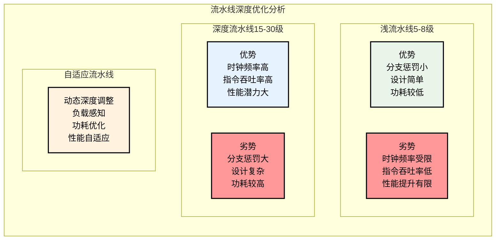
```mermaid
graph LR
    subgraph pipeline_depth ["流水线深度优化分析"]
        subgraph shallow ["浅流水线5-8级"]
            A1["优势<br/>分支惩罚小<br/>设计简单<br/>功耗较低"]
            A2["劣势<br/>时钟频率受限<br/>指令吞吐率低<br/>性能提升有限"]
        end
        
        subgraph deep ["深度流水线15-30级"]
            B1["优势<br/>时钟频率高<br/>指令吞吐率高<br/>性能潜力大"]
            B2["劣势<br/>分支惩罚大<br/>设计复杂<br/>功耗较高"]
        end
        
        subgraph adaptive ["自适应流水线"]
            C1["动态深度调整<br/>负载感知<br/>功耗优化<br/>性能自适应"]
        end
    end
    
    style A1 fill:#e8f5e8,stroke:#000,stroke-width:2px,color:#000
    style A2 fill:#ff9999,stroke:#000,stroke-width:2px,color:#000
    style B1 fill:#e6f3ff,stroke:#000,stroke-width:2px,color:#000
    style B2 fill:#ff9999,stroke:#000,stroke-width:2px,color:#000
    style C1 fill:#fff3e0,stroke:#000,stroke-width:2px,color:#000
```

**最优深度计算模型：**

设流水线深度为 $k$，分支指令比例为 $p$，预测错误率为 $m$：

$$CPI = 1 + p \times m \times k$$

$$\text{时钟频率} \propto k$$

$$\text{性能} = \frac{\text{时钟频率}}{CPI} = \frac{k \times f_0}{1 + p \times m \times k}$$

最优深度：$k_{optimal} = \sqrt{\frac{1}{p \times m}}$

#### 3.4.2 多端口寄存器文件设计

**寄存器文件端口配置优化：**

| 端口配置 | 读端口数 | 写端口数 | 面积开销 | 功耗开销 | 性能提升 |
|----------|----------|----------|----------|----------|----------|
| **基本配置** | 2 | 1 | 1.0× | 1.0× | 基准 |
| **双发射配置** | 4 | 2 | 2.5× | 2.2× | 1.6-1.8× |
| **四发射配置** | 8 | 4 | 6.0× | 4.5× | 2.5-3.2× |
| **混合配置** | 6 | 3 | 4.0× | 3.0× | 2.0-2.5× |

**寄存器重命名技术：**

```verilog
// 寄存器重命名单元（简化版）
module register_renaming_unit #(
    parameter ARCH_REGS = 32,     // 架构寄存器数量
    parameter PHYS_REGS = 128     // 物理寄存器数量
)(
    input [4:0] arch_src1,        // 架构源寄存器1
    input [4:0] arch_src2,        // 架构源寄存器2  
    input [4:0] arch_dst,         // 架构目标寄存器
    
    output [6:0] phys_src1,       // 物理源寄存器1
    output [6:0] phys_src2,       // 物理源寄存器2
    output [6:0] phys_dst,        // 物理目标寄存器
    
    input commit_enable,          // 提交使能
    input [6:0] commit_phys_reg,  // 提交的物理寄存器
    input exception               // 异常信号
);

// 重命名表（架构寄存器 → 物理寄存器映射）
reg [6:0] rename_table [0:ARCH_REGS-1];

// 自由物理寄存器池
reg [PHYS_REGS-1:0] free_list;
reg [6:0] free_head;

// 重命名逻辑
assign phys_src1 = rename_table[arch_src1];
assign phys_src2 = rename_table[arch_src2];

// 分配新的物理寄存器
always @(posedge clk) begin
    if (arch_dst != 0) begin  // 寄存器0不需要重命名
        phys_dst <= free_head;
        rename_table[arch_dst] <= free_head;
        free_head <= get_next_free_register();
    end
end

endmodule
```

#### 3.4.3 存储器层次结构优化

**Cache设计对流水线性能的影响：**

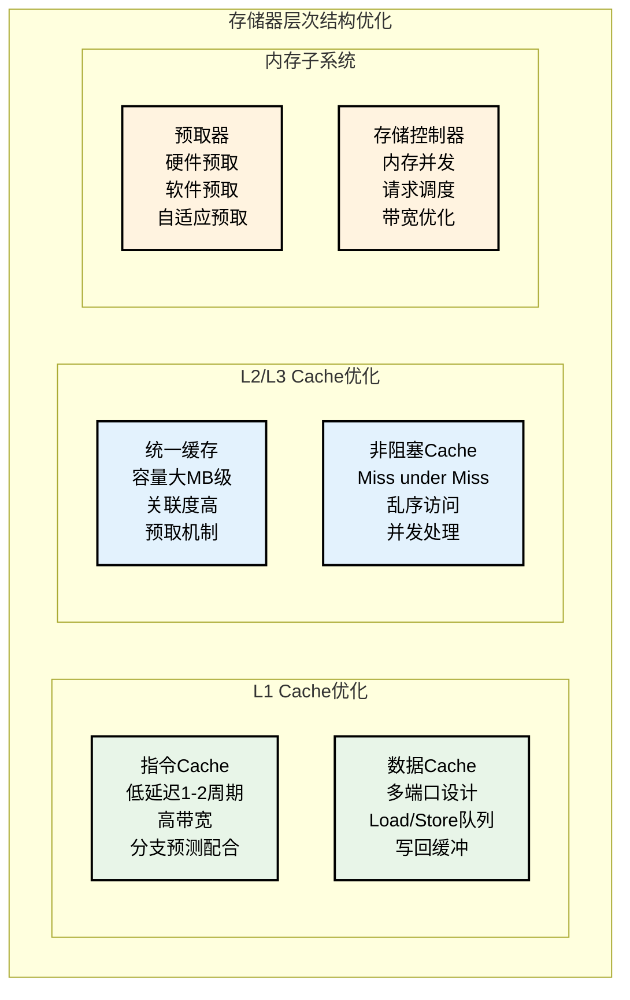
```mermaid
graph TD
    subgraph memory_hierarchy ["存储器层次结构优化"]
        subgraph l1_cache ["L1 Cache优化"]
            A1["指令Cache<br/>低延迟1-2周期<br/>高带宽<br/>分支预测配合"]
            A2["数据Cache<br/>多端口设计<br/>Load/Store队列<br/>写回缓冲"]
        end
        
        subgraph l2l3_cache ["L2/L3 Cache优化"]
            B1["统一缓存<br/>容量大MB级<br/>关联度高<br/>预取机制"]
            B2["非阻塞Cache<br/>Miss under Miss<br/>乱序访问<br/>并发处理"]
        end
        
        subgraph memory_subsystem ["内存子系统"]
            C1["预取器<br/>硬件预取<br/>软件预取<br/>自适应预取"]
            C2["存储控制器<br/>内存并发<br/>请求调度<br/>带宽优化"]
        end
    end
    
    style A1 fill:#e8f5e8,stroke:#000,stroke-width:2px,color:#000
    style A2 fill:#e8f5e8,stroke:#000,stroke-width:2px,color:#000
    style B1 fill:#e3f2fd,stroke:#000,stroke-width:2px,color:#000
    style B2 fill:#e3f2fd,stroke:#000,stroke-width:2px,color:#000
    style C1 fill:#fff3e0,stroke:#000,stroke-width:2px,color:#000
    style C2 fill:#fff3e0,stroke:#000,stroke-width:2px,color:#000
```

**Cache性能影响分析：**

$$CPI_{memory} = CPI_{base} + \frac{\text{Memory Instructions}}{\text{Total Instructions}} \times \text{Miss Rate} \times \text{Miss Penalty}$$

典型数值：
- L1 Cache缺失率：1-5%
- L1 Cache缺失惩罚：10-50周期
- 存储器指令比例：30-40%

**Cache缺失对CPI的影响：**
$$\Delta CPI = 0.35 \times 0.03 \times 20 = 0.21$$

这意味着Cache缺失可以将CPI从1.0增加到1.21，性能损失17%。

---

## 5. 现代处理器流水线

### 5.1 分支预测技术

> **分支预测**是现代处理器提高性能的关键技术之一，通过预测条件分支指令的跳转方向和目标地址，避免流水线停顿。

#### 5.1.1 静态分支预测

**基于编译器的静态预测策略：**

| 预测策略 | 预测规则 | 准确率 | 适用场景 |
|----------|----------|--------|----------|
| **总是不跳转** | 预测所有分支都不跳转 | 60-70% | 循环较少的程序 |
| **总是跳转** | 预测所有分支都跳转 | 30-40% | 循环密集的程序 |
| **向后跳转** | 向后分支跳转，向前分支不跳转 | 65-75% | 一般程序 |
| **基于操作码** | 根据分支指令类型预测 | 70-80% | 特定应用 |

#### 5.1.2 动态分支预测

**1位分支预测器：**
```
状态转换：
NOT_TAKEN ←→ TAKEN
     0    ←→   1

预测规则：
- 状态0：预测不跳转
- 状态1：预测跳转
- 预测错误时改变状态
```

**2位分支预测器（更稳定）：**
```
四状态转换图：
Strongly Not Taken → Weakly Not Taken → Weakly Taken → Strongly Taken
        00         →        01        →      10      →       11
```

**全局分支历史预测器：**
```verilog
// 全局分支历史表实现
module global_branch_predictor #(
    parameter HISTORY_BITS = 8,
    parameter PHT_ENTRIES = 256
)(
    input clk, reset,
    input [31:0] pc,
    input branch_taken,
    input update_enable,
    
    output prediction
);

reg [HISTORY_BITS-1:0] global_history;
reg [1:0] pattern_history_table [0:PHT_ENTRIES-1];

wire [7:0] pht_index = global_history ^ pc[9:2];
assign prediction = pattern_history_table[pht_index][1];

// 更新预测器
always @(posedge clk) begin
    if (reset) begin
        global_history <= 0;
        // 初始化PHT为弱不跳转
        for (integer i = 0; i < PHT_ENTRIES; i = i + 1)
            pattern_history_table[i] <= 2'b01;
    end else if (update_enable) begin
        // 更新全局历史
        global_history <= {global_history[HISTORY_BITS-2:0], branch_taken};
        
        // 更新2位饱和计数器
        case (pattern_history_table[pht_index])
            2'b00: if (branch_taken) pattern_history_table[pht_index] <= 2'b01;
            2'b01: pattern_history_table[pht_index] <= branch_taken ? 2'b10 : 2'b00;
            2'b10: pattern_history_table[pht_index] <= branch_taken ? 2'b11 : 2'b01;
            2'b11: if (!branch_taken) pattern_history_table[pht_index] <= 2'b10;
        endcase
    end
end

endmodule
```

#### 5.1.3 混合分支预测器

**Tournament预测器（Alpha 21264采用）：**
```
组成部分：
1. 本地预测器：使用分支指令自身的历史
2. 全局预测器：使用所有分支指令的历史  
3. 选择器：动态选择使用哪个预测器

选择逻辑：
- 对每个分支指令维护一个2位计数器
- 跟踪两个预测器的准确性
- 选择表现更好的预测器
```

**现代处理器分支预测性能：**

| 处理器 | 预测器类型 | 准确率 | BTB大小 | RAS深度 |
|--------|------------|--------|---------|---------|
| **Intel Core i7** | 混合预测器 | 95-98% | 4K entries | 16 |
| **AMD Zen3** | TAGE预测器 | 96-99% | 6K entries | 32 |
| **ARM Cortex-A78** | 神经网络预测 | 97-99% | 8K entries | 24 |

### 5.2 乱序执行技术

#### 5.2.1 Tomasulo算法实现

**Tomasulo算法数据结构：**

```c
// 保留站结构
typedef struct {
    bool busy;                    // 保留站忙标志
    int op;                      // 操作类型
    float vj, vk;                // 源操作数值
    int qj, qk;                  // 源操作数标签
    int dest;                    // 目标寄存器标签
    int address;                 // 内存地址（load/store）
} reservation_station_t;

// 寄存器状态
typedef struct {
    float value;                 // 寄存器值
    int qi;                      // 产生该值的指令标签
    bool ready;                  // 值是否就绪
} register_status_t;

// 公共数据总线
typedef struct {
    int tag;                     // 结果标签
    float data;                  // 结果数据
    bool valid;                  // 数据有效标志
} cdb_t;
```

**Tomasulo执行过程模拟：**

```python
class TomasuloSimulator:
    def __init__(self):
        self.reservation_stations = {
            'add': [{'busy': False} for _ in range(3)],
            'mult': [{'busy': False} for _ in range(2)],
            'load': [{'busy': False} for _ in range(2)]
        }
        self.register_status = [{'qi': 0, 'ready': True, 'value': 0} for _ in range(32)]
        self.instruction_queue = []
        self.cdb = {'valid': False}
        self.clock = 0
    
    def issue_instruction(self, instr):
        """发射指令到保留站"""
        op_type = instr['type']
        
        # 查找空闲保留站
        for rs in self.reservation_stations[op_type]:
            if not rs['busy']:
                rs['busy'] = True
                rs['op'] = instr['op']
                rs['dest'] = len(self.register_status)  # 分配新标签
                
                # 获取源操作数
                for i, src in enumerate(['src1', 'src2']):
                    if src in instr:
                        reg = instr[src]
                        if self.register_status[reg]['ready']:
                            rs[f'v{["j","k"][i]}'] = self.register_status[reg]['value']
                            rs[f'q{["j","k"][i]}'] = 0
                        else:
                            rs[f'q{["j","k"][i]}'] = self.register_status[reg]['qi']
                
                # 更新目标寄存器状态
                if 'dest' in instr:
                    self.register_status[instr['dest']]['qi'] = rs['dest']
                    self.register_status[instr['dest']]['ready'] = False
                
                return True
        return False  # 没有空闲保留站
    
    def execute_ready_instructions(self):
        """执行就绪的指令"""
        for rs_type in self.reservation_stations:
            for rs in self.reservation_stations[rs_type]:
                if (rs['busy'] and 
                    rs.get('qj', 0) == 0 and rs.get('qk', 0) == 0 and
                    'executing' not in rs):
                    rs['executing'] = True
                    rs['exec_cycles'] = self.get_exec_cycles(rs['op'])
    
    def writeback_results(self):
        """写回执行结果"""
        for rs_type in self.reservation_stations:
            for rs in self.reservation_stations[rs_type]:
                if (rs.get('executing') and rs.get('exec_cycles', 0) == 0):
                    # 通过CDB广播结果
                    result = self.compute_result(rs)
                    self.cdb = {
                        'valid': True,
                        'tag': rs['dest'],
                        'data': result
                    }
                    
                    # 清空保留站
                    rs.clear()
                    rs['busy'] = False
    
    def update_waiting_instructions(self):
        """更新等待中的指令"""
        if self.cdb['valid']:
            tag = self.cdb['tag']
            data = self.cdb['data']
            
            # 更新保留站中等待的操作数
            for rs_type in self.reservation_stations:
                for rs in self.reservation_stations[rs_type]:
                    if rs.get('qj') == tag:
                        rs['vj'] = data
                        rs['qj'] = 0
                    if rs.get('qk') == tag:
                        rs['vk'] = data
                        rs['qk'] = 0
            
            # 更新寄存器状态
            for reg in self.register_status:
                if reg['qi'] == tag:
                    reg['value'] = data
                    reg['ready'] = True
                    reg['qi'] = 0
            
            self.cdb['valid'] = False
```

#### 5.2.2 重排序缓冲区（ROB）

**ROB的作用和结构：**

```c
typedef struct {
    int instruction_id;          // 指令标识
    int dest_reg;               // 目标寄存器
    float result;               // 执行结果
    bool ready;                 // 结果是否就绪
    bool exception;             // 是否有异常
    int pc;                     // 指令地址
} rob_entry_t;

typedef struct {
    rob_entry_t entries[64];    // ROB表项
    int head, tail;             // 头尾指针
    int size;                   // 当前大小
} reorder_buffer_t;
```

**ROB操作流程：**

1. **分配（Allocation）**：指令发射时在ROB尾部分配表项
2. **完成（Completion）**：指令执行完成时更新ROB表项
3. **提交（Commit）**：按程序顺序从ROB头部提交指令
4. **异常处理**：发生异常时清空ROB中该指令后的所有表项

### 5.3 现代处理器架构实例

#### 5.3.1 Intel Core微架构

**Intel Core i7流水线结构（14级）：**

```
前端（Front-End）：
1. 指令获取：从L1I Cache获取16字节指令
2. 预译码：识别指令边界，生成微操作
3. 指令队列：缓存已译码的微操作
4. 分支预测：2级自适应预测器

后端（Back-End）：  
5-6. 寄存器重命名：消除伪依赖，分配物理寄存器
7. 调度/发射：乱序调度到执行单元
8-11. 执行：6个执行端口，支持同时执行6个微操作
12-13. 写回：结果写回寄存器和Cache
14. 提交：顺序提交，更新架构状态
```

**核心特性：**
- **微操作融合**：将复杂指令分解为简单微操作
- **循环流缓存**：缓存小循环的微操作
- **超线程技术**：两个逻辑核心共享执行资源

#### 5.3.2 ARM Cortex-A系列

**ARM Cortex-A78流水线（13级）：**

```
取指阶段（4级）：
IF1: 分支预测和指令地址生成
IF2: 指令Cache访问
IF3: 指令获取和对齐
IF4: 指令预译码

译码阶段（3级）：
DE1: 指令译码和寄存器重命名
DE2: 指令分发到发射队列
DE3: 操作数准备

执行阶段（6级）：
EX1-EX2: 执行单元计算
EX3-EX4: 内存访问和数据返回
EX5-EX6: 写回和提交
```

**关键技术：**
- **DynamIQ技术**：异构多核设计
- **机器学习预测**：基于神经网络的分支预测
- **自适应缓存**：动态调整缓存分区

---

## 6. 流水线设计实例

### 6.1 MIPS流水线详细设计

#### 6.1.1 五级经典流水线

**数据通路设计：**

```verilog
// MIPS五级流水线数据通路
module mips_pipeline(
    input clk, reset,
    input [31:0] instruction_memory [0:1023],
    input [31:0] data_memory [0:1023],
    output [31:0] pc_out
);

// 流水线寄存器
reg [31:0] IF_ID_pc, IF_ID_instr;
reg [31:0] ID_EX_pc, ID_EX_imm, ID_EX_rs_data, ID_EX_rt_data;
reg [4:0] ID_EX_rs, ID_EX_rt, ID_EX_rd;
reg [31:0] EX_MEM_alu_result, EX_MEM_write_data;
reg [4:0] EX_MEM_write_reg;
reg [31:0] MEM_WB_alu_result, MEM_WB_mem_data;
reg [4:0] MEM_WB_write_reg;

// 控制信号
reg ID_EX_reg_write, ID_EX_mem_read, ID_EX_mem_write;
reg ID_EX_branch, ID_EX_alu_src, ID_EX_reg_dst;
reg [2:0] ID_EX_alu_op;

// 数据转发单元
wire [1:0] forward_a, forward_b;
forwarding_unit fu(
    .ID_EX_rs(ID_EX_rs),
    .ID_EX_rt(ID_EX_rt),
    .EX_MEM_reg_write(EX_MEM_reg_write),
    .EX_MEM_write_reg(EX_MEM_write_reg),
    .MEM_WB_reg_write(MEM_WB_reg_write),
    .MEM_WB_write_reg(MEM_WB_write_reg),
    .forward_a(forward_a),
    .forward_b(forward_b)
);

// 冲突检测单元
wire stall;
hazard_detection_unit hdu(
    .ID_EX_mem_read(ID_EX_mem_read),
    .ID_EX_rt(ID_EX_rt),
    .IF_ID_rs(IF_ID_instr[25:21]),
    .IF_ID_rt(IF_ID_instr[20:16]),
    .stall(stall)
);

// IF阶段
always @(posedge clk) begin
    if (reset) begin
        pc <= 0;
        IF_ID_pc <= 0;
        IF_ID_instr <= 0;
    end else if (!stall) begin
        IF_ID_pc <= pc;
        IF_ID_instr <= instruction_memory[pc[9:2]];
        pc <= pc + 4;
    end
end

// ID阶段
always @(posedge clk) begin
    if (reset) begin
        ID_EX_pc <= 0;
        ID_EX_rs_data <= 0;
        ID_EX_rt_data <= 0;
        // ... 其他信号复位
    end else if (stall) begin
        // 插入气泡（NOP）
        ID_EX_reg_write <= 0;
        ID_EX_mem_read <= 0;
        ID_EX_mem_write <= 0;
    end else begin
        ID_EX_pc <= IF_ID_pc;
        ID_EX_rs_data <= register_file[IF_ID_instr[25:21]];
        ID_EX_rt_data <= register_file[IF_ID_instr[20:16]];
        // ... 控制信号解码
    end
end

endmodule

// 数据转发单元实现
module forwarding_unit(
    input [4:0] ID_EX_rs, ID_EX_rt,
    input EX_MEM_reg_write, MEM_WB_reg_write,
    input [4:0] EX_MEM_write_reg, MEM_WB_write_reg,
    output reg [1:0] forward_a, forward_b
);

always @(*) begin
    // 默认不转发
    forward_a = 2'b00;
    forward_b = 2'b00;
    
    // EX转发（EX/MEM -> EX）
    if (EX_MEM_reg_write && EX_MEM_write_reg != 0) begin
        if (EX_MEM_write_reg == ID_EX_rs)
            forward_a = 2'b10;
        if (EX_MEM_write_reg == ID_EX_rt)
            forward_b = 2'b10;
    end
    
    // MEM转发（MEM/WB -> EX）
    if (MEM_WB_reg_write && MEM_WB_write_reg != 0 &&
        !(EX_MEM_reg_write && EX_MEM_write_reg == ID_EX_rs)) begin
        if (MEM_WB_write_reg == ID_EX_rs)
            forward_a = 2'b01;
    end
    
    if (MEM_WB_reg_write && MEM_WB_write_reg != 0 &&
        !(EX_MEM_reg_write && EX_MEM_write_reg == ID_EX_rt)) begin
        if (MEM_WB_write_reg == ID_EX_rt)
            forward_b = 2'b01;
    end
end

endmodule
```


### 6.2 实际处理器流水线对比

#### 6.2.1 处理器流水线特性对比

| 特性 | MIPS R4000 | Intel Pentium | ARM Cortex-A9 | Intel Core i7 |
|------|-------------|---------------|---------------|----------------|
| **流水线级数** | 8级 | 5级 | 8级 | 14-19级 |
| **发射宽度** | 1 | 2 | 2 | 4 |
| **乱序执行** | 无 | 无 | 有限 | 完全 |
| **分支预测** | 静态 | 1位动态 | 2级自适应 | 混合预测器 |
| **数据转发** | 完全 | 部分 | 完全 | 完全 |
| **缓存层次** | L1 | L1 | L1+L2 | L1+L2+L3 |

#### 6.2.2 流水线设计演进趋势

**历史演进轨迹：**

```mermaid
graph LR
    subgraph evolution ["流水线技术发展历程"]
        subgraph early ["早期1980s"]
            A1["简单流水线<br/>RISC设计<br/>5级流水线<br/>顺序执行"]
        end
        
        subgraph superscalar ["超标量1990s"] 
            B1["多发射<br/>动态调度<br/>分支预测<br/>缓存层次"]
        end
        
        subgraph modern ["现代2000s+"]
            C1["深度流水线<br/>SMT技术<br/>多核设计<br/>专用加速器"]
        end
        
        subgraph future ["未来趋势"]
            D1["异构计算<br/>AI加速<br/>量子计算<br/>近存储计算"]
        end
    end
    
    A1 --> B1 --> C1 --> D1
    
    style A1 fill:#ffeb3b,stroke:#000,stroke-width:2px,color:#000
    style B1 fill:#4caf50,stroke:#000,stroke-width:2px,color:#000
    style C1 fill:#2196f3,stroke:#000,stroke-width:2px,color:#000
    style D1 fill:#9c27b0,stroke:#000,stroke-width:2px,color:#000
```

---

## 7. 典型例题解析

### 7.1 流水线基础计算题

#### 例题7.1：流水线基本性能计算

> **题目**：某计算机采用5级流水线（取指、译码、执行、访存、写回），时钟周期为2ns。现要执行100条指令，求：
> 1. 非流水线方式的执行时间
> 2. 理想流水线方式的执行时间  
> 3. 流水线的加速比和效率
> 4. 如果存在20%的Load指令会导致1个周期的停顿，实际执行时间是多少？

**详细解答：**

**第一步：分析基本条件**
- 流水线级数：k = 5
- 指令数：n = 100  
- 时钟周期：Δt = 2ns
- 每级执行时间：5 × 2ns = 10ns

**第二步：计算非流水线执行时间**
```
非流水线执行时间 = n × k × Δt
                = 100 × 5 × 2ns 
                = 1000ns
```

**第三步：计算理想流水线执行时间**
```
理想流水线执行时间 = (k + n - 1) × Δt
                   = (5 + 100 - 1) × 2ns
                   = 104 × 2ns
                   = 208ns
```

**第四步：计算加速比和效率**
```
加速比 S = 非流水线时间 / 流水线时间
        = 1000ns / 208ns
        = 4.81

效率 E = S / k × 100%
       = 4.81 / 5 × 100%
       = 96.2%
```

**第五步：考虑Load指令停顿的实际情况**
```
停顿周期数 = 100 × 20% × 1 = 20周期

实际执行周期 = 104 + 20 = 124周期

实际执行时间 = 124 × 2ns = 248ns

实际加速比 = 1000ns / 248ns = 4.03

实际效率 = 4.03 / 5 × 100% = 80.6%
```

**答案总结：**
1. 非流水线执行时间：1000ns
2. 理想流水线执行时间：208ns
3. 理想加速比：4.81，理想效率：96.2%
4. 实际执行时间：248ns，实际加速比：4.03，实际效率：80.6%

#### 例题7.2：数据冲突分析

> **题目**：分析下列指令序列在5级流水线中的执行情况，画出流水线时空图，并计算所需的总时钟周期数。假设数据转发完全可用。
> ```
> I1: ADD R1, R2, R3
> I2: SUB R4, R1, R5  
> I3: AND R6, R1, R7
> I4: OR  R8, R9, R10
> I5: LW  R11, 0(R4)
> I6: SW  R11, 0(R1)
> ```

**详细解答：**

**第一步：识别数据依赖关系**
- I2依赖I1：SUB需要ADD的结果R1
- I3依赖I1：AND需要ADD的结果R1  
- I5依赖I2：LW需要SUB的结果R4
- I6依赖I5：SW需要LW的结果R11（Load-use冲突）

**第二步：分析数据转发情况**

1. **I1 → I2**：EX转发（EX/MEM → EX阶段）
2. **I1 → I3**：MEM转发（MEM/WB → EX阶段）  
3. **I2 → I5**：EX转发（EX/MEM → EX阶段）
4. **I5 → I6**：Load-use冲突，需要停顿1周期

**第三步：绘制流水线时空图**

```
指令  |周期: 1  2  3  4  5  6  7  8  9  10
------|--------------------------------
I1   |     IF ID EX MEM WB
I2   |        IF ID EX MEM WB
I3   |           IF ID EX MEM WB  
I4   |              IF ID EX MEM WB
I5   |                 IF ID EX MEM WB
I6   |                    IF -- ID EX MEM WB
     |                    停顿1周期
```

**第四步：计算总周期数**
```
基本周期：5 + 6 - 1 = 10周期
停顿周期：1周期（I6的Load-use冲突）
总周期数：10 + 1 = 11周期
```

**答案：总共需要11个时钟周期**

### 7.2 高级流水线技术题

#### 例题7.3：超标量处理器性能分析

> **题目**：某4发射超标量处理器具有以下特性：
> - 4个整数ALU，2个浮点单元，2个Load/Store单元
> - 指令混合：50%整数运算，20%浮点运算，30%存储器访问
> - 平均每条指令的依赖距离为2（即平均每条指令依赖于前面第2条指令）
> - 分支预测准确率95%，预测错误惩罚5周期
> - 分支指令占15%
> 
> 计算该处理器的理论最大IPC和实际IPC。

**详细解答：**

**第一步：分析资源约束**

资源配置分析：
- 整数单元：4个，可满足50%的整数指令需求
- 浮点单元：2个，需要处理20%的浮点指令
- Load/Store单元：2个，需要处理30%的存储指令

**第二步：计算资源瓶颈**

每种指令类型的需求vs供给：
```
整数指令：需求50%，供给能力 = 4/4 = 100%  ✓
浮点指令：需求20%，供给能力 = 2/4 = 50%   ✓  
存储指令：需求30%，供给能力 = 2/4 = 50%   ✓
```

所有指令类型都能得到满足，资源不是瓶颈。

**第三步：分析依赖约束**

由于平均依赖距离为2，在4发射宽度下：
- 4条指令中平均有2条存在依赖关系
- 依赖约束导致的发射宽度 = 4 - 2 = 2

**第四步：分析分支预测影响**

```
分支预测错误率 = 1 - 95% = 5%
分支指令比例 = 15%
分支惩罚 = 5周期

平均分支惩罚 = 0.15 × 0.05 × 5 = 0.0375周期/指令
CPI增加 = 0.0375
```

**第五步：计算最终IPC**

```
理论最大IPC = min(发射宽度, 资源约束) = min(4, ∞) = 4

实际IPC受限于依赖约束 = 2

考虑分支预测影响：
实际CPI = 1/2 + 0.0375 = 0.5375
实际IPC = 1/0.5375 = 1.86
```

**答案：**
- 理论最大IPC：4.0
- 实际IPC：1.86

### 7.3 复杂综合分析题

#### 例题7.4：多级流水线设计优化

> **题目**：某处理器设计团队正在设计新的流水线架构，面临以下选择：
> 
> **方案A**：8级流水线，时钟频率3GHz，分支预测准确率90%
> **方案B**：12级流水线，时钟频率4GHz，分支预测准确率92%
> **方案C**：16级流水线，时钟频率5GHz，分支预测准确率95%
> 
> 已知程序中分支指令占20%，预测错误时需要清空整个流水线。请分析哪种方案性能最优。

**详细解答：**

**第一步：建立性能分析模型**

设分支指令比例为p，预测错误率为m，流水线深度为k，时钟频率为f：

```
CPI = 1 + p × m × k
性能 = f / CPI = f / (1 + p × m × k)
```

**第二步：计算各方案的CPI**

**方案A：**
```
p = 0.2, m = 1 - 0.9 = 0.1, k = 8
CPI_A = 1 + 0.2 × 0.1 × 8 = 1 + 0.16 = 1.16
```

**方案B：**
```
p = 0.2, m = 1 - 0.92 = 0.08, k = 12  
CPI_B = 1 + 0.2 × 0.08 × 12 = 1 + 0.192 = 1.192
```

**方案C：**
```
p = 0.2, m = 1 - 0.95 = 0.05, k = 16
CPI_C = 1 + 0.2 × 0.05 × 16 = 1 + 0.16 = 1.16
```

**第三步：计算相对性能**

以方案A为基准（性能为1.0）：

```
性能_A = 3GHz / 1.16 = 2.586 GIPS

性能_B = 4GHz / 1.192 = 3.356 GIPS
相对性能_B = 3.356 / 2.586 = 1.298 (+29.8%)

性能_C = 5GHz / 1.16 = 4.310 GIPS  
相对性能_C = 4.310 / 2.586 = 1.667 (+66.7%)
```

**第四步：分析敏感性**

当分支指令比例变化时：

| 分支比例 | 方案A性能 | 方案B性能 | 方案C性能 | 最优方案 |
|----------|-----------|-----------|-----------|----------|
| 10% | 2.73 GIPS | 3.53 GIPS | 4.65 GIPS | **C** |
| 20% | 2.59 GIPS | 3.36 GIPS | 4.31 GIPS | **C** |
| 30% | 2.42 GIPS | 3.16 GIPS | 3.85 GIPS | **C** |
| 40% | 2.22 GIPS | 2.91 GIPS | 3.28 GIPS | **C** |

**第五步：考虑其他因素**

**功耗分析：**
```
功耗 ∝ 频率³ × 流水线复杂度
相对功耗_A : 相对功耗_B : 相对功耗_C ≈ 1 : 2.4 : 4.6
```

**设计复杂度：**
- 方案A：相对简单，验证容易
- 方案B：中等复杂度  
- 方案C：高复杂度，时序设计困难

**答案总结：**
- **性能最优**：方案C（+66.7%性能提升）
- **功耗效率最优**：方案A
- **平衡方案**：方案B（+29.8%性能，适中功耗）

**推荐方案**：根据应用场景选择
- 高性能计算：选择方案C
- 移动设备：选择方案A  
- 通用桌面：选择方案B

---
 
### 8 核心知识点梳理

#### 8.1 重点内容

**1. 流水线基本概念（★★★★★）**

> **流水线定义**：将指令执行过程分解为若干个功能段，使多条指令能够重叠执行的技术。

**核心要点：**
- 流水线的基本思想和工作原理
- 时空图的绘制方法
- 吞吐率、加速比、效率的计算公式
- 流水线深度对性能的影响

**重要公式：**
```
吞吐率 TP = n / [(k + n - 1) × Δt]
加速比 S = T₁ / Tₖ = nk / (k + n - 1)  
效率 E = S / k × 100%

当n >> k时：S ≈ k, TP ≈ 1/Δt, E ≈ 100%
```

**2. 流水线冲突分析（★★★★★）**

**三种冲突类型：**

| 冲突类型 | 产生原因 | 主要解决方法 | 考查重点 |
|----------|----------|--------------|----------|
| **结构冲突** | 硬件资源不足 | 增加硬件资源 | 识别冲突原因 |
| **数据冲突** | 指令间数据依赖 | 数据转发、停顿 | 转发路径设计 |
| **控制冲突** | 分支改变执行流 | 分支预测 | 预测策略选择 |

**3. 数据转发技术（★★★★☆）**

**转发路径设计：**
- EX/MEM → EX：ALU结果直接转发
- MEM/WB → EX：内存数据转发
- MEM/WB → MEM：Store指令数据转发

**Load-use冲突：**
```
Load指令：LW R1, 0(R2)
Use指令：  ADD R3, R1, R4
冲突原因：R1在MEM阶段才可用，ADD在EX阶段就需要
解决方法：必须停顿1周期
```

#### 8.1.2 重要知识点

**4. 分支预测技术（★★★★☆）**

**静态预测策略：**
- 总是不跳转：适用于循环少的程序
- 向后跳转：向后分支跳转，向前分支不跳转
- 基于编译器：由编译器插入预测信息

**动态预测器：**
- 1位预测器：预测错误立即改变状态
- 2位预测器：需要连续两次错误才改变预测
- 全局历史预测器：利用全局分支历史模式

**5. 超标量技术（★★★☆☆）**

**基本特征：**
- 多发射：每周期发射多条指令
- 乱序执行：打乱指令执行顺序
- 动态调度：运行时分析依赖关系
- 顺序提交：保证程序正确性

**关键组件：**
- 寄存器重命名：消除伪依赖
- 保留站：等待操作数就绪
- 重排序缓冲：保证顺序提交

### 8.2 考试题型分析

#### 8.2.1 选择题常考点

**1. 概念理解类（30%）**
- 流水线基本概念辨析
- 冲突类型识别
- 性能指标含义

**典型题目：**
> 在5级流水线中，若第3条指令需要使用第1条指令的结果，且采用完全的数据转发技术，则不会产生停顿的条件是（ ）
> A. 第1条指令是算术运算指令
> B. 第1条指令是Load指令
> C. 第3条指令是Store指令  
> D. 第1条和第3条指令都是算术运算指令

**答案：A** 算术运算指令的结果在EX阶段就可用，可以直接转发给第3条指令。

**2. 计算应用类（40%）**
- 流水线性能计算
- 冲突影响分析
- 优化效果评估

**典型题目：**
> 某5级流水线执行100条指令，其中20%是Load指令，40%的Load指令会导致Load-use冲突。若时钟周期为2ns，计算实际执行时间。

**解答步骤：**
```
停顿周期 = 100 × 20% × 40% × 1 = 8周期
总周期 = (5 + 100 - 1) + 8 = 112周期  
执行时间 = 112 × 2ns = 224ns
```

#### 8.2.2 计算题解题模板

**流水线性能计算标准步骤：**

```
第1步：确定基本参数
- 流水线级数 k
- 指令总数 n  
- 时钟周期 Δt
- 冲突情况统计

第2步：计算理想性能
- 理想周期数 = k + n - 1
- 理想执行时间 = (k + n - 1) × Δt
- 理想吞吐率 = n / [(k + n - 1) × Δt]

第3步：分析冲突影响  
- 统计各类冲突的停顿周期
- 计算总停顿 = ∑停顿周期

第4步：计算实际性能
- 实际周期数 = 理想周期数 + 总停顿
- 实际执行时间 = 实际周期数 × Δt
- 性能损失 = (实际时间 - 理想时间) / 理想时间 × 100%

第5步：计算最终指标
- 加速比 = 非流水线时间 / 实际流水线时间
- 效率 = 加速比 / 流水线级数 × 100%
```

### 8.3 重要公式汇总

#### 8.3.1 基本性能公式

**流水线基本公式：**
$$\text{执行时间} = (k + n - 1) \times \Delta t$$
$$\text{吞吐率} = \frac{n}{(k + n - 1) \times \Delta t}$$
$$\text{加速比} = \frac{n \times k \times \Delta t}{(k + n - 1) \times \Delta t} = \frac{nk}{k + n - 1}$$
$$\text{效率} = \frac{S}{k} \times 100\% = \frac{n}{k + n - 1} \times 100\%$$

**实际流水线公式：**
$$\text{实际CPI} = 1 + \sum\text{各类冲突造成的CPI增加}$$
$$\text{数据冲突CPI增加} = \text{冲突指令比例} \times \text{冲突概率} \times \text{停顿周期}$$
$$\text{控制冲突CPI增加} = \text{分支指令比例} \times \text{预测错误率} \times \text{分支惩罚}$$

#### 8.3.2 高级技术公式

**超标量处理器：**
$$\text{理论IPC} = \min(\text{发射宽度}, \text{资源约束}, \text{依赖约束})$$
$$\text{实际IPC} = \frac{\text{理论IPC}}{1 + \text{各种冲突的CPI损失}}$$

**深度流水线优化：**
$$\text{最优深度} = \sqrt{\frac{1}{p \times m}}$$
其中p为分支指令比例，m为预测错误率。
