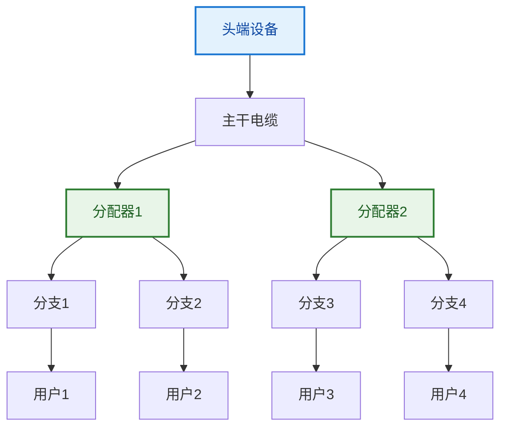

# 2.4 基带频带宽带传输技术

## 导航目录

1. [传输技术概述](#1-传输技术概述)
2. [基带传输技术](#2-基带传输技术)
3. [频带传输技术](#3-频带传输技术)
4. [宽带传输技术](#4-宽带传输技术)
5. [传输技术对比](#5-传输技术对比)
6. [应用场景分析](#6-应用场景分析)

## 知识架构

```
传输技术体系
├── 基带传输
│   ├── 数字信号直接传输
│   ├── 码元直接表示
│   ├── 低通信道特性
│   └── 局域网应用
├── 频带传输
│   ├── 载波调制技术
│   ├── 信号频谱搬移
│   ├── 带通信道特性
│   └── 远距离传输
├── 宽带传输
│   ├── 频分复用技术
│   ├── 多路并行传输
│   ├── 高速数据传输
│   └── 现代网络应用
└── 技术选择
    ├── 距离因素
    ├── 带宽需求
    ├── 成本考虑
    └── 性能要求
```

---

## 1. 传输技术概述

### 1.1 信号传输分类

> **信号传输技术**：根据信号在信道中的频谱特性和传输方式，可分为基带传输、频带传输和宽带传输三大类。

#### 传输方式基本概念

| 传输方式 | 信号特性 | 频谱范围 | 典型应用 | 传输距离 |
|----------|----------|----------|----------|----------|
| **基带传输** | 原始数字信号 | 0Hz附近 | 局域网 | 短距离 |
| **频带传输** | 调制信号 | 载波频率附近 | 调制解调器 | 中长距离 |
| **宽带传输** | 多路复用信号 | 宽频带范围 | 光纤网络 | 任意距离 |

### 1.2 信道特性分析

#### 信道类型对应关系

**1. 低通信道（基带信道）**
- **特性**：允许从0Hz开始的低频信号通过
- **应用**：双绞线、同轴电缆短距离传输
- **传输方式**：基带传输

**2. 带通信道（频带信道）**
- **特性**：只允许某个频带范围内的信号通过
- **应用**：电话线、无线信道
- **传输方式**：频带传输

**3. 宽带信道**
- **特性**：具有很大的带宽，支持高速传输
- **应用**：光纤、同轴电缆长距离传输
- **传输方式**：宽带传输

---

## 2. 基带传输技术

### 2.1 基带传输原理

> **基带传输（Baseband Transmission）**：将数字信号的每个码元直接用两种不同的电压来表示，然后送到线路上去传输。

#### 基带信号特征

**频谱特性**：
```
基带信号频谱特征
├── 主要能量集中在0Hz附近
├── 频谱从0Hz开始，向高频扩展
├── 理论上频谱无限宽
└── 实际传输需要限制带宽
```

**编码方式回顾**：
- **不归零编码（NRZ）**：高低电平直接表示1和0
- **曼彻斯特编码**：电平跳变表示数据
- **差分曼彻斯特编码**：跳变时刻表示数据

### 2.2 基带传输系统

#### 典型基带传输系统框图


#### 关键技术要点

**1. 发送滤波器设计**
- **目的**：限制信号频谱，减少干扰
- **类型**：升余弦滤波器、根升余弦滤波器
- **权衡**：带宽限制 vs 符号间干扰

**2. 判决器设计**
```python
def optimal_threshold_detection():
    """最优门限判决算法"""
    # 假设信号电平为+V和-V，噪声为高斯白噪声
    threshold = 0  # 最优门限为0
    
    def decide(received_signal):
        if received_signal > threshold:
            return 1
        else:
            return 0
    
    return decide
```

**3. 时钟恢复**
- **必要性**：同步接收端采样时刻
- **方法**：位同步电路、锁相环（PLL）
- **挑战**：连续相同码元时的时钟维持

### 2.3 基带传输性能

#### 误码率分析

**高斯信道中的误码率**：
$$P_e = Q\left(\sqrt{\frac{E_b}{N_0}}\right)$$

其中：
- $E_b$：每比特信号能量
- $N_0$：噪声功率谱密度
- $Q(x)$：互补误差函数

**信噪比要求**：
| 目标误码率 | 所需SNR | 应用场景 |
|-----------|---------|----------|
| $10^{-3}$ | 6.8 dB | 话音传输 |
| $10^{-6}$ | 10.5 dB | 数据传输 |
| $10^{-9}$ | 12.8 dB | 高质量数据 |

---

## 3. 频带传输技术

### 3.1 频带传输原理

> **频带传输（Passband Transmission）**：将基带信号的频谱搬移到较高的频段，以便在带通信道上传输。

#### 调制的必要性

**为什么需要调制**：
1. **信道匹配**：基带信号无法直接在带通信道传输
2. **天线效率**：天线长度与波长成正比
3. **频谱利用**：多个信号可共享同一物理信道
4. **传输距离**：高频信号传输特性更好

### 3.2 数字调制技术

#### 三种基本调制方式

**1. 幅移键控（ASK - Amplitude Shift Keying）**

> **ASK调制**：用载波的不同幅度来表示数字信息。

**数学表达式**：
$$s_{ASK}(t) = \begin{cases}
A\cos(2\pi f_c t) & \text{发送"1"} \\
0 & \text{发送"0"}
\end{cases}$$

**特点分析**：
- **优点**：实现简单，对频率稳定性要求低
- **缺点**：抗噪声性能差，功率利用率低
- **应用**：光纤通信、简单的无线系统

**2. 频移键控（FSK - Frequency Shift Keying）**

> **FSK调制**：用载波的不同频率来表示数字信息。

**数学表达式**：
$$s_{FSK}(t) = \begin{cases}
A\cos(2\pi f_1 t) & \text{发送"1"} \\
A\cos(2\pi f_2 t) & \text{发送"0"}
\end{cases}$$

**关键参数**：
- **频率偏移**：$\Delta f = |f_1 - f_2|$
- **调制指数**：$h = \frac{\Delta f \cdot T}{2}$（T为码元周期）

**3. 相移键控（PSK - Phase Shift Keying）**

> **PSK调制**：用载波的不同相位来表示数字信息。

**二进制PSK（BPSK）**：
$$s_{BPSK}(t) = \begin{cases}
A\cos(2\pi f_c t) & \text{发送"1"} \\
A\cos(2\pi f_c t + \pi) = -A\cos(2\pi f_c t) & \text{发送"0"}
\end{cases}$$

#### 高级调制技术

**正交幅度调制（QAM）**：
```
QAM调制原理
├── 同时调制幅度和相位
├── 提高频谱效率
├── 星座图表示方法
└── 广泛应用于高速通信
```

**QAM星座图示例（16-QAM）**：
```
16-QAM星座图
    Q
    │
  ●─┼─●  +3
    │
  ●─┼─●  +1
────┼──── I
  ●─┼─●  -1
    │
  ●─┼─●  -3
    │
 -3 -1 +1 +3
```

### 3.3 调制解调器

#### 调制解调器工作原理

**调制器（Modulator）**：


**解调器（Demodulator）**：


---

## 4. 宽带传输技术

### 4.1 宽带传输概念

> **宽带传输（Broadband Transmission）**：使用频分复用技术，在一个宽带信道上同时传输多个数据流。

#### 宽带传输特征

**技术特点**：
- **频分复用**：不同信号占用不同频段
- **模拟传输**：信号以模拟形式在信道中传输
- **双向传输**：上行和下行使用不同频段
- **高带宽利用率**：充分利用信道容量

### 4.2 频分复用技术

#### FDM基本原理

**频谱分配示例**：
```
宽带同轴电缆频谱分配
─────────────────────────────────────────→ 频率
5-42MHz    54-88MHz   174-216MHz   470-890MHz
  ↑           ↑           ↑            ↑
上行数据    VHF低段     VHF高段      UHF段
传输       电视频道    电视频道     电视频道
```

#### 宽带网络拓扑

**树型拓扑结构**：


### 4.3 现代宽带技术

#### 光纤宽带

**波分复用（WDM）**：
- **原理**：不同波长的光信号在同一根光纤中传输
- **容量**：可支持数百个波长信道
- **应用**：骨干网络、城域网

**密集波分复用（DWDM）**：
```
DWDM系统示例
├── 工作波长：1530-1565nm（C波段）
├── 信道间隔：0.8nm（100GHz）
├── 信道数量：40-80个
└── 单信道速率：2.5Gbps-100Gbps
```

#### 同轴电缆宽带

**电缆调制解调器（Cable Modem）**：
- **上行频段**：5-42MHz
- **下行频段**：550-750MHz
- **数据速率**：下行数十Mbps，上行数Mbps

---

## 5. 传输技术对比

### 5.1 技术性能对比

| 特性 | 基带传输 | 频带传输 | 宽带传输 |
|------|----------|----------|----------|
| **信号形式** | 数字信号 | 调制信号 | 多路复用信号 |
| **频谱利用** | 整个信道 | 载波附近 | 频分多路 |
| **传输距离** | 短（<1km） | 中等（数km） | 长（无限制） |
| **抗干扰性** | 较好 | 中等 | 好 |
| **实现复杂度** | 简单 | 中等 | 复杂 |
| **成本** | 低 | 中等 | 高 |

### 5.2 适用场景分析

#### 距离与技术选择

**传输距离决策树**：
```
传输距离选择
├── 100m以内
│   ├── 首选：基带传输
│   ├── 介质：双绞线、同轴电缆
│   └── 应用：局域网、设备互连
├── 100m-10km
│   ├── 首选：频带传输
│   ├── 介质：电话线、无线
│   └── 应用：城域网、用户接入
└── 10km以上
    ├── 首选：宽带传输
    ├── 介质：光纤、卫星
    └── 应用：广域网、骨干网
```

---

## 6. 应用场景分析

### 6.1 以太网中的基带传输

#### 经典以太网标准

| 标准 | 传输速率 | 介质 | 最大距离 | 编码方式 |
|------|----------|------|----------|----------|
| **10BASE-T** | 10Mbps | 双绞线 | 100m | 曼彻斯特 |
| **100BASE-TX** | 100Mbps | 双绞线 | 100m | 4B/5B+MLT-3 |
| **1000BASE-T** | 1Gbps | 双绞线 | 100m | 8B/10B+PAM-5 |

### 6.2 调制解调器中的频带传输

#### 电话线上网发展历程

**技术演进**：
```
电话线接入技术发展
├── 56K Modem
│   ├── 调制方式：QAM
│   ├── 速率：56Kbps下行，33.6Kbps上行
│   └── 频段：300-3400Hz
├── ISDN
│   ├── 技术：数字信号
│   ├── 速率：128Kbps（2B+D）
│   └── 特点：端到端数字连接
└── ADSL
    ├── 技术：DMT调制
    ├── 速率：下行数Mbps，上行数百Kbps
    └── 频段：0-1.1MHz
```

### 6.3 现代宽带应用

#### 5G网络频谱应用

**5G频段分配**：
```
5G频谱资源
├── Sub-6GHz频段
│   ├── 范围：3.3-5GHz
│   ├── 特点：覆盖广，穿透强
│   └── 应用：广域覆盖
├── 毫米波频段
│   ├── 范围：24-40GHz
│   ├── 特点：带宽大，距离短
│   └── 应用：热点覆盖
└── 载波聚合
    ├── 技术：多频段同时使用
    ├── 目的：提高总吞吐量
    └── 实现：宽带传输理念
```

---

## 总结

三种传输技术各有特点和适用场景：

### 技术选择原则

1. **基带传输**：短距离、高质量、低成本的首选
2. **频带传输**：中等距离、现有带通信道的有效利用
3. **宽带传输**：长距离、高容量、多业务的理想选择

### 发展趋势

- **基带传输**：向更高速率、更远距离发展
- **频带传输**：向更高阶调制、更好性能演进
- **宽带传输**：向更密集复用、更大容量迈进

现代通信系统往往综合运用多种传输技术，根据具体需求和约束条件选择最适合的技术方案。 