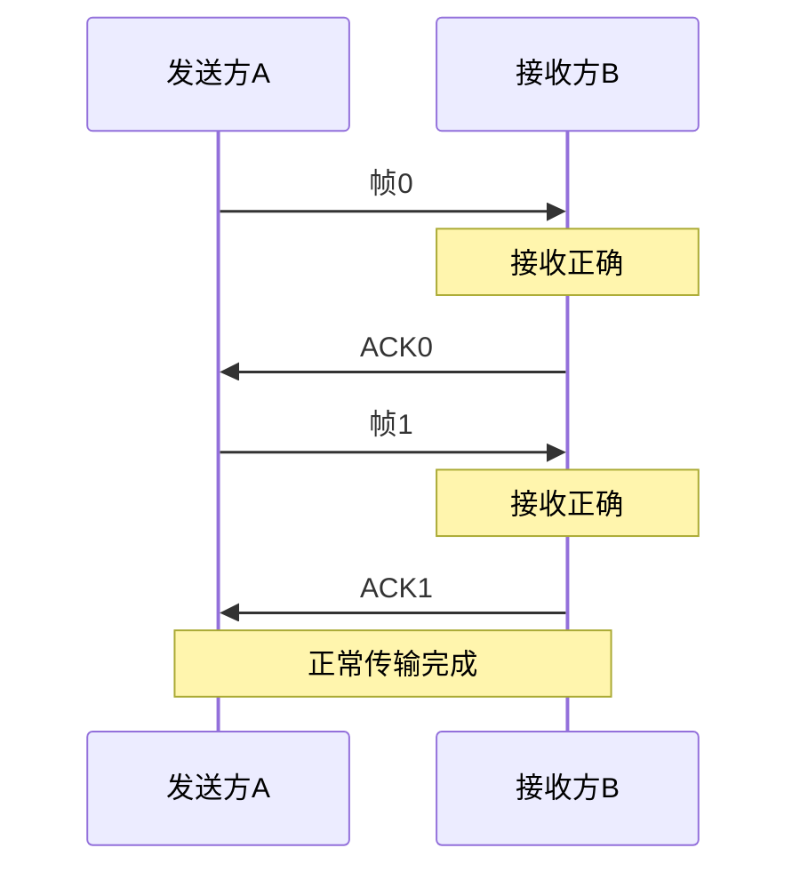
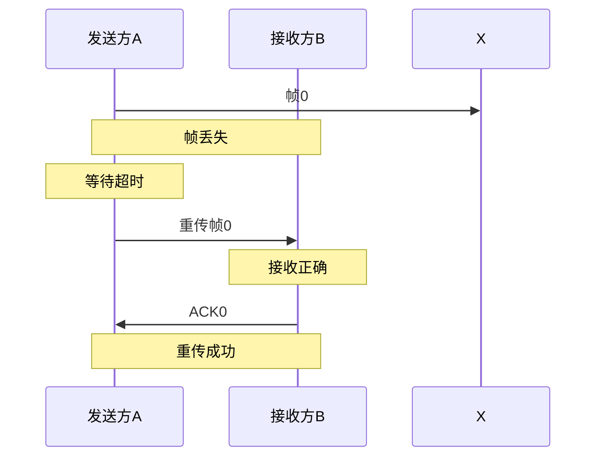
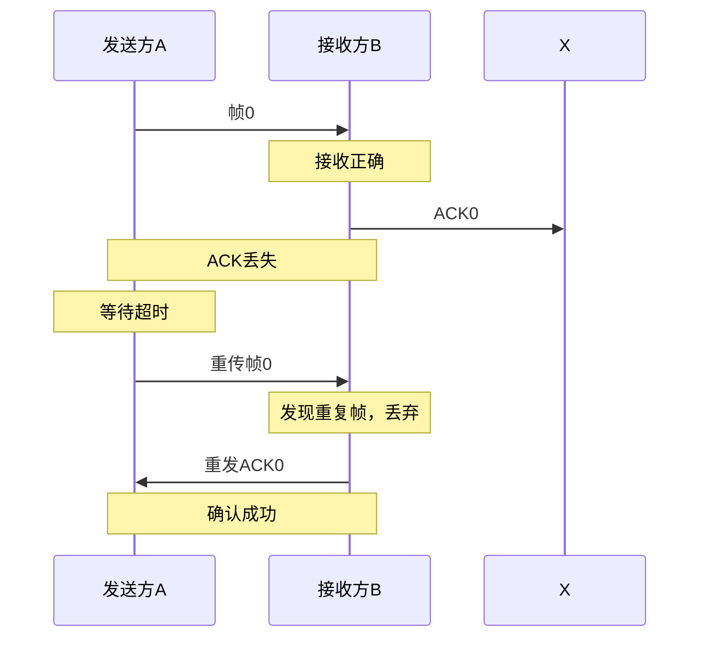
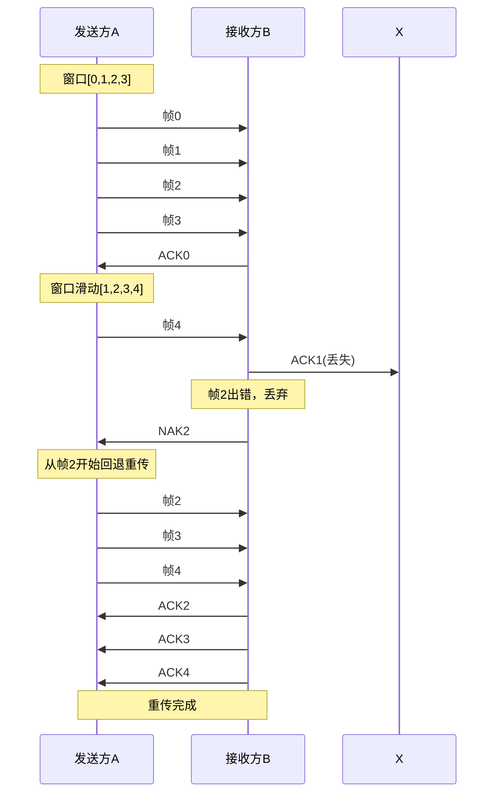
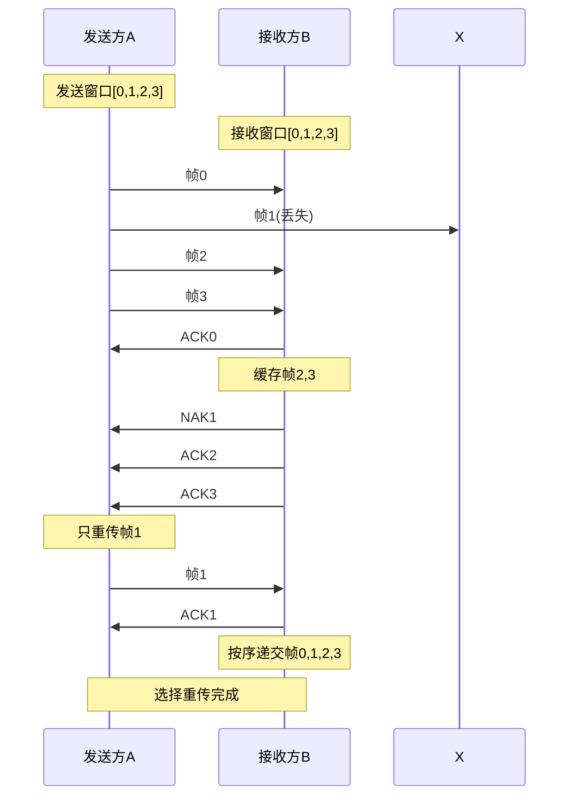
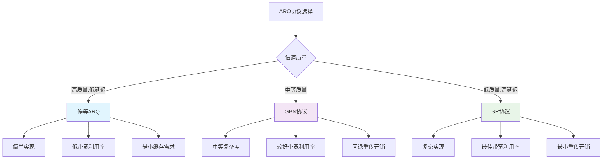

# 3.1 数据链路层基础理论

## 目录

### 基础理论篇
1. [数据链路层概述与理解](#1-数据链路层概述与理解)
2. [帧封装技术详解](#2-帧封装技术详解)

### 差错控制篇
3. [差错控制理论基础](#3-差错控制理论基础)
4. [CRC循环冗余校验深度解析](#4-crc循环冗余校验深度解析)
5. [海明码纠错技术](#5-海明码纠错技术)

### 可靠传输篇
6. [ARQ协议理论基础](#6-arq协议理论基础)
7. [滑动窗口机制详解](#7-滑动窗口机制详解)
8. [协议性能分析与计算](#8-协议性能分析与计算)

---

## 1. 数据链路层概述与理解

### 1.1 快速定位

**位置**：OSI模型第2层，在物理层和网络层之间

**核心作用**：在直连的两个节点间提供可靠数据传输

**主要功能**：
1. **帧封装**：把网络层数据包装成帧
2. **差错控制**：检测和纠正传输错误  
3. **流量控制**：控制发送速率
4. **访问控制**：管理共享介质访问

### 1.2 基本术语

- **节点**：实现数据链路层的设备
- **链路**：连接相邻节点的物理通道
- **数据链路**：链路 + 两端节点
- **帧**：数据链路层的数据单元

**层次关系**：
```
物理层：比特流 01011010...
数据链路层：帧 [头部|数据|尾部]
网络层：数据包
```

### 1.3 数据链路层服务类型

> **数据链路层**：为网络层提供服务，负责相邻节点间的可靠数据传输。

**基本工作过程**：
1. **帧封装**：将网络层数据包封装成帧
2. **差错控制**：检测和纠正传输错误
3. **流量控制**：管理发送和接收速率
4. **介质访问**：控制对共享介质的访问

**三种服务类型**：

1. **无确认无连接服务**
   - 发送后不管结果
   - 适用：高质量信道（本地网络）
   - 代表：以太网

2. **有确认无连接服务**  
   - 需要接收确认，但不建立连接
   - 适用：中等质量信道（无线网络）
   - 代表：WiFi

3. **有确认有连接服务**
   - 建立连接，全程可靠传输
   - 适用：低质量信道（广域网络）
   - 代表：PPP协议

**选择原则**：
- 信道质量好 → 无确认无连接
- 信道质量中等 → 有确认无连接
- 信道质量差 → 有确认有连接

---

## 2. 帧封装技术详解

### 2.1 帧的基本结构

> **帧结构**：数据链路层协议数据单元的标准格式。

**通用帧格式**：
```

│ 帧开始符 │  帧头部  │  数据部分 │  帧尾部  │ 帧结束符 │
│   SOF   │ Header  │  Data   │ Trailer │   EOF   │

```

**各部分功能**：
- **帧开始符（SOF）**：标识帧的开始位置
- **帧头部**：包含控制信息（地址、类型、序号等）
- **数据部分**：来自上层的有效载荷
- **帧尾部**：包含校验信息（CRC等）
- **帧结束符（EOF）**：标识帧的结束位置

### 2.2 帧定界方法详解

#### 方法一：字符计数法

**基本思想**：在帧头部明确指明帧内字符数。

**实现示例**：
```
┌───┬─────────┬──────────────┐
│ 5 │ A B C D │      E       │
└───┴─────────┴──────────────┘
  ↑      ↑           ↑
字符数  数据部分   下一帧开始
```

**优缺点分析**：
- **优点**：简单直观，处理高效
- **缺点**：一旦计数字段出错，后续帧都会错位

#### 方法二：字符填充法

**基本思想**：使用特殊字符标识帧边界，对数据中的相同字符进行转义。

**实现机制**：
```
发送过程：
原始数据：A DLE B
添加边界：DLE STX A DLE B DLE ETX
字符填充：DLE STX A DLE DLE B DLE ETX
最终发送：[DLE STX] A DLE DLE B [DLE ETX]

接收过程：
接收：DLE STX A DLE DLE B DLE ETX
去填充：DLE STX A DLE B DLE ETX  
去边界：A DLE B
提取数据：A DLE B
```

**控制字符**：
- **DLE（Data Link Escape）**：数据链路转义符
- **STX（Start of Text）**：正文开始符
- **ETX（End of Text）**：正文结束符

#### 方法三：比特填充法

**基本思想**：使用特定比特模式作为标志，对数据中的相同模式进行填充。

**HDLC标志字段**：`01111110`

**填充规则**：
- 发送时：遇到连续5个1后插入一个0
- 接收时：遇到连续5个1后的0则删除

**示例过程**：
```
原始数据：  0111111010111110
填充后：    01111101010111101010
接收还原：  0111111010111110
```

### 2.3 透明传输技术

> **透明传输**：数据链路层对用户数据的内容不加任何限制，用户可以传输任意比特组合。

**透明传输的重要性**：
1. **协议无关性**：上层协议可以是任意格式
2. **数据完整性**：保证传输数据的完全一致
3. **通用性**：适用于各种类型的数据

**实现透明传输的方法**：
- **字符填充法**：处理ASCII文本数据
- **比特填充法**：处理任意二进制数据
- **物理编码法**：在物理层实现（如曼彻斯特编码）

---

## 3. 差错控制理论基础

### 3.1 差错产生的原因

**外界干扰源**：
- **热噪声**：电阻等器件产生的随机噪声
- **冲击噪声**：雷电、电机等产生的突发干扰
- **串扰**：相邻信号线间的耦合干扰
- **衰落**：信号在传输中的功率损失

**差错类型分类**：
- **随机差错**：噪声引起的孤立比特错误
- **突发差错**：干扰引起的连续比特错误

### 3.2 差错控制策略

**基本策略分类**：
1. **检错重传（ARQ）**：检测错误后请求重传
2. **前向纠错（FEC）**：检测并纠正错误
3. **混合纠错（HEC）**：结合检错和纠错

**选择策略的考虑因素**：
- **信道质量**：好信道用ARQ，差信道用FEC
- **实时性要求**：实时应用偏好FEC
- **带宽开销**：ARQ开销小，FEC开销大
- **复杂度**：ARQ实现简单，FEC复杂

### 3.3 差错控制的数学基础

**码字理论**：
- **信息位（k）**：原始数据位数
- **校验位（r）**：附加校验位数  
- **码字长度（n）**：总长度，$n = k + r$
- **码率（R）**：信息效率，$R = k/n$

**汉明距离**：
两个等长码字对应位置不同的位数。

**最小汉明距离（ $d_{min}$ ）**：
码表中任意两个码字的最小汉明距离。

**纠检错能力**：
- 检测 $t$ 位错误： $d_{min} ≥ t + 1$
- 纠正 $t$ 位错误： $d_{min} ≥ 2t + 1$
- 纠正 $t_1$ 位、检测 $t_2$ 位错误： $d_{min} ≥ t_1 + t_2 + 1$ （ $t_2 > t_1$ ）

---

## 4. CRC循环冗余校验深度解析

### 4.1 CRC的数学基础

> **CRC（Cyclic Redundancy Check）**：基于模2除法的差错检测码，具有很强的检错能力。

**多项式表示法**：
```
数据：1001101 ←→ 多项式：x⁶ + x³ + x² + 1
生成多项式：1011 ←→ G(x) = x³ + x + 1
```

### 4.2 CRC编码过程详解

**编码算法**：
1. 设数据为 $M(x)$ ，生成多项式为 $G(x)$ ，生成多项式位数为 $r+1$
2. 计算 $x^r \cdot M(x)$ （相当于数据左移 $r$ 位）
3. 计算 $x^r \cdot M(x) \div G(x)$ 的余式 $R(x)$
4. 发送码字为 $T(x) = x^r \cdot M(x) + R(x)$

**实际计算示例**：
```
数据M：1001101（7位）
生成多项式G：1011（4位，r=3）

第一步：数据左移3位
1001101000

第二步：模2除法
         1000111
       ____________
1011 ) 1001101000
       1011
       ----
       0101
       0000
       ----
       1010
       1011
       ----
       0011
       0000
       ----
       0110
       0000
       ----
       1100
       1011
       ----
       1110
       1011
       ----
       1010
       1011
       ----
       0010
       0000
       ----
       010

余式R：010

第三步：构造发送码字
T = 1001101000 + 010 = 1001101010
```

### 4.3 CRC校验过程

**接收端校验**：
1. 接收到码字 $T'(x)$
2. 计算 $T'(x) \div G(x)$ 的余式 $S(x)$
3. 如果 $S(x) = 0$ ，无差错；否则有差错

**校验示例**：
```
接收码字：1001101010
生成多项式：1011

模2除法：
         1000111
       ____________
1011 | 1001101010
       1011
       ----
       0101
       0000
       ----
       1010
       1011
       ----
       0011
       0000
       ----
       0110
       0000
       ----
       1100
       1011
       ----
       1110
       1011
       ----
       1010
       1011
       ----
       0000

余式为000，无差错
```

### 4.4 常用CRC标准

**CRC-16**：
- 生成多项式： $G(x) = x^{16} + x^{15} + x^2 + 1$
- 二进制：11000000000000101
- 应用：IBM SDLC、USB等

**CRC-32**：
- 生成多项式： $G(x) = x^{32} + x^{26} + x^{23} + ... + x + 1$
- 应用：以太网、ZIP、PNG等

**CRC-CCITT**：
- 生成多项式： $G(x) = x^{16} + x^{12} + x^5 + 1$  
- 二进制：10001000000100001
- 应用：X.25、HDLC等

### 4.5 CRC检错能力分析

**CRC的检错能力**：
1. **所有单比特错误**：100%检出
2. **所有双比特错误**：100%检出（当 $G(x)$ 有偶数项时）
3. **奇数个比特错误**：100%检出（当 $G(x)$ 包含因子 $(x+1)$ 时）
4. **长度≤r的突发错误**：100%检出
5. **长度=r+1的突发错误**： $1-2^{-r}$ 的概率检出
6. **长度>r+1的突发错误**： $1-2^{-r}$ 的概率检出

---

## 5. 海明码纠错技术

### 5.1 海明码的设计思想

> **海明码（Hamming Code）**：能够纠正单比特错误的线性分组码，由校验位的位置设计实现错误定位。

**设计原理**：
通过巧妙安排校验位的位置，使得错误的位置能够用校验位的组合直接表示出来。

### 5.2 海明码编码过程

**校验位数量确定**：
对于 $k$ 位信息，需要 $r$ 位校验位，满足：
$$2^r ≥ k + r + 1$$

**校验位位置规律**：
校验位位置在 $2^0, 2^1, 2^2, ..., 2^{r-1}$ ，即第1, 2, 4, 8, 16, ...位。

**编码示例（7,4海明码）**：
```
信息位：1010
位置：   3456 (二进制位置)

海明码位置安排：
位置： 1  2  3  4  5  6  7
类型： P1 P2 D1 P3 D2 D3 D4
数据： ?  ?  1  ?  0  1  0

校验位计算：
P1 = D1 ⊕ D2 ⊕ D4 = 1 ⊕ 0 ⊕ 0 = 1
P2 = D1 ⊕ D3 ⊕ D4 = 1 ⊕ 1 ⊕ 0 = 0  
P3 = D2 ⊕ D3 ⊕ D4 = 0 ⊕ 1 ⊕ 0 = 1

海明码：1011010
```

### 5.3 海明码校验过程

**校验计算**：
```
接收码字：1011010

校验计算：
S1 = P1 ⊕ D1 ⊕ D2 ⊕ D4 = 1 ⊕ 1 ⊕ 0 ⊕ 0 = 0
S2 = P2 ⊕ D1 ⊕ D3 ⊕ D4 = 0 ⊕ 1 ⊕ 1 ⊕ 0 = 0
S3 = P3 ⊕ D2 ⊕ D3 ⊕ D4 = 1 ⊕ 0 ⊕ 1 ⊕ 0 = 0

校验子：S = S3S2S1 = 000

错误位置：000 = 0，无错误
```

**错误纠正示例**：
```
发送码字：1011010
接收码字：1010010（第3位错误）

校验计算：
S1 = P1 ⊕ D1 ⊕ D2 ⊕ D4 = 1 ⊕ 0 ⊕ 0 ⊕ 0 = 1
S2 = P2 ⊕ D1 ⊕ D3 ⊕ D4 = 0 ⊕ 0 ⊕ 1 ⊕ 0 = 1
S3 = P3 ⊕ D2 ⊕ D3 ⊕ D4 = 1 ⊕ 0 ⊕ 1 ⊕ 0 = 0

校验子：S = S3S2S1 = 011 = 3

错误位置：第3位
纠正：第3位取反，1010010 → 1011010
```

---

## 6. ARQ协议理论基础

### 6.1 ARQ协议概述

> **ARQ（Automatic Repeat reQuest）**：自动重传请求协议，是实现可靠数据传输的重要机制。

**基本原理**：
1. 发送方发送数据帧并等待确认
2. 接收方正确接收后发送ACK确认
3. 发送方未收到确认则超时重传
4. 通过序号机制处理重复帧

### 6.2 停等ARQ协议详解

**协议原理**：
每发送一个帧都要等待对方的确认，收到确认后才能发送下一个帧。

**正常工作流程**：



**超时重传机制**：



**确认丢失处理**：



### 6.3 停等ARQ性能分析

**信道利用率公式**：
$$η = \frac{1}{1 + 2a}$$

其中：$a = \frac{T_{prop}}{T_{trans}}$

**参数说明**：
- $η$：信道利用率
- $T_{prop}$：传播延迟
- $T_{trans}$：传输延迟
- $a$：归一化传播延迟

**性能计算示例**：
```
网络参数：
- 传播延迟：10ms
- 帧长：1000bits
- 传输速率：1Mbps

计算：
T_trans = 1000/1,000,000 = 1ms
a = 10/1 = 10
η = 1/(1+2×10) = 4.76%
```

---

## 7. 滑动窗口机制详解

### 7.1 滑动窗口基本概念

> **滑动窗口**：发送方可以连续发送多个帧而不必等待每个帧的确认，提高信道利用率。

**窗口参数**：
- **发送窗口大小（$W_T$）**：发送方能连续发送的最大帧数
- **接收窗口大小（$W_R$）**：接收方能缓存的最大帧数

### 7.2 回退N帧（GBN）协议

**基本原理**：
- 发送窗口大小 > 1，接收窗口大小 = 1
- 接收方只按序接收帧
- 出错时从出错帧开始重传所有后续帧

**GBN工作示例**：



**累积确认机制**：
- ACK n 表示正确接收了n号帧及之前的所有帧
- 接收方对失序帧一律丢弃，重复发送最后一个正确帧的ACK

### 7.3 选择重传（SR）协议

**基本原理**：
- 发送窗口大小 > 1，接收窗口大小 > 1
- 接收方可以接收失序帧并缓存
- 只重传出错的帧

**SR工作示例**：



**选择确认机制**：
- 每个帧单独确认
- 接收方维护接收缓存区
- 发送方只重传未确认的帧

### 7.4 窗口大小的选择

**GBN协议窗口大小**：
$$W_T ≤ 2^m - 1$$

其中$m$是序号位数。

**SR协议窗口大小**：
$$W_T + W_R ≤ 2^m$$

且通常$W_T = W_R$，所以：
$$W_T = W_R ≤ 2^{m-1}$$

**窗口大小选择示例**：
```
序号位数m=3，序号范围0-7

GBN协议：W_T ≤ 7
SR协议：W_T = W_R ≤ 4
```

---

## 8. 协议性能分析与计算

### 8.1 信道利用率分析

**停等ARQ**：
$$η_{stop} = \frac{1}{1 + 2a}$$

**GBN协议（有差错）**：
设误帧率为 $P$ ，出错时需要重传 $W$ 个帧：
$$η_{GBN} = \frac{(1-P)}{1 + 2a + P \cdot W \cdot \frac{1}{1-P}}$$

简化后：
$$η_{GBN} ≈ \frac{(1-P)W}{1 + 2a} \quad \text{（当P较小时）}$$

**SR协议（无差错）**：
$$η_{SR} = \begin{cases}
1 & \text{if } W ≥ 1 + 2a \\
\frac{W}{1 + 2a} & \text{if } W < 1 + 2a
\end{cases}$$

**GBN协议（无差错）**：
$$η_{GBN} = \begin{cases}
1 & \text{if } W ≥ 1 + 2a \\
\frac{W}{1 + 2a} & \text{if } W < 1 + 2a
\end{cases}$$

**详细推导**：
- 成功传输概率：$(1-P)$
- 出错时重传开销：$P \cdot W$个帧
- 考虑重传后的总开销影响

### 8.2 有差错信道的性能分析

**误帧率对性能的影响**：
设误帧率为 $P$ ，则：

**停等ARQ**：
$$η_{stop} = \frac{1-P}{1 + 2a}$$

**GBN协议**：
$$η_{GBN} = \frac{(1-P)W}{1 + 2a}$$

**SR协议**：
$$η_{SR} = (1-P) \cdot η_{SR\_无差错}$$

### 8.3 综合性能比较

**协议特点对比**：

| 协议 | 发送窗口 | 接收窗口 | 重传开销 | 缓存需求 | 实现复杂度 |
|------|----------|----------|----------|----------|------------|
| 停等ARQ | 1 | 1 | 最小 | 最小 | 简单 |
| GBN | >1 | 1 | 较大 | 中等 | 中等 |
| SR | >1 | >1 | 最小 | 最大 | 复杂 |

**适用场景**：
- **停等ARQ**：低速、短距离网络
- **GBN**：中等性能要求的网络  
- **SR**：高速、长距离网络

**协议性能对比图**：



**性能曲线对比**：

```mermaid
graph LR
    subgraph "信道利用率 vs 窗口大小"
        A[窗口大小W] --> B[停等ARQ: η=1/(1+2a)]
        A --> C[GBN: η=W/(1+2a)]  
        A --> D[SR: η=W/(1+2a)]
    end
    
    style B fill:#ffcdd2
    style C fill:#f8bbd9
    style D fill:#c8e6c9
```

---

## 学习总结

### 核心知识框架

**理论基础三大支柱**：
1. **帧封装技术**：解决数据格式化和边界识别
2. **差错控制技术**：保证数据传输的可靠性
3. **流量控制技术**：匹配发送和接收能力

### 重要公式汇总

**差错控制**：
- 汉明距离：$d_{min} ≥ 2t + 1$（纠正t位错误）
- 海明码校验位：$2^r ≥ k + r + 1$

**ARQ协议**：
- 停等ARQ利用率：$η = \frac{1-P}{1 + 2a}$
- 窗口大小约束：GBN $W ≤ 2^m-1$，SR $W ≤ 2^{m-1}$

 
