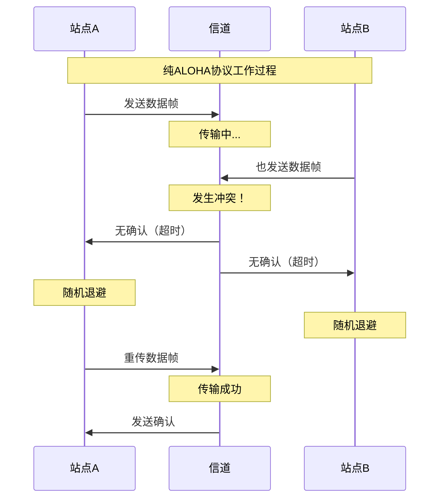
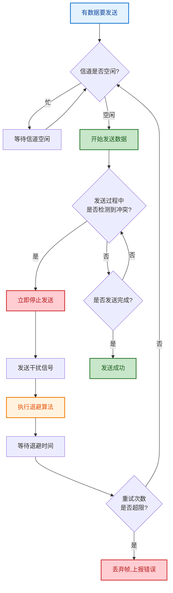
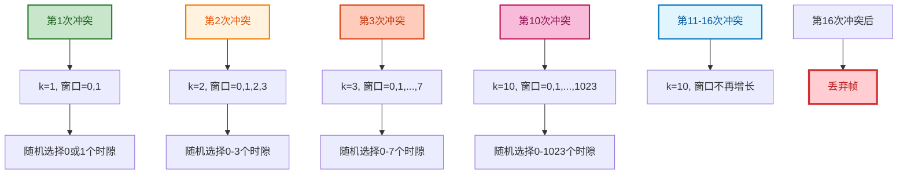
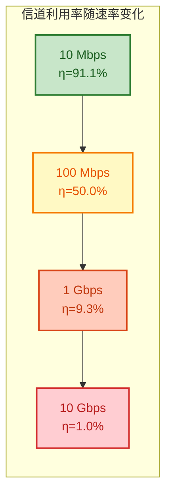
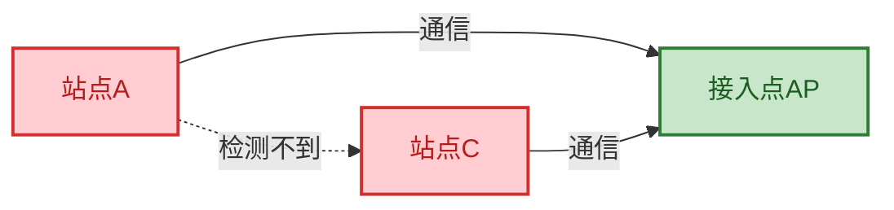
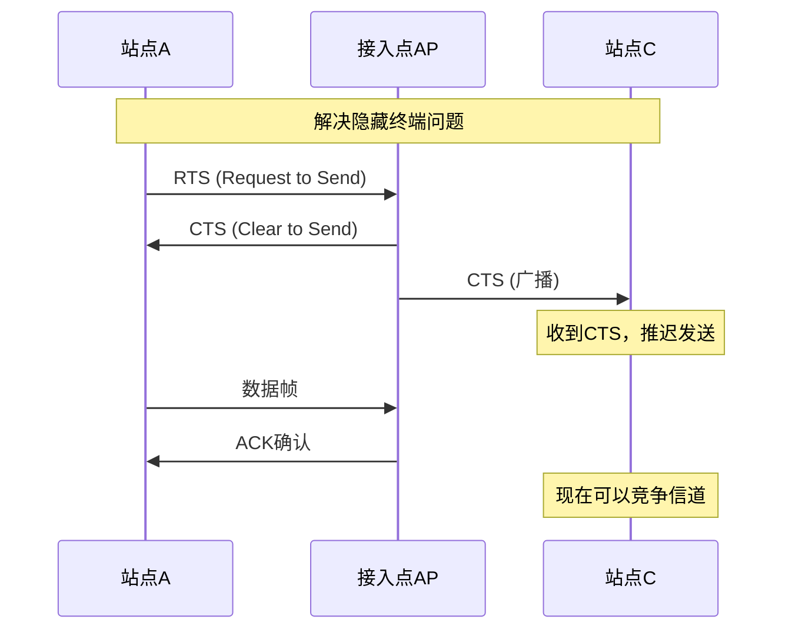
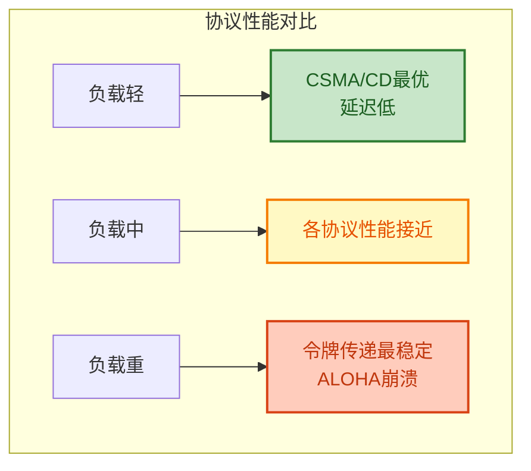
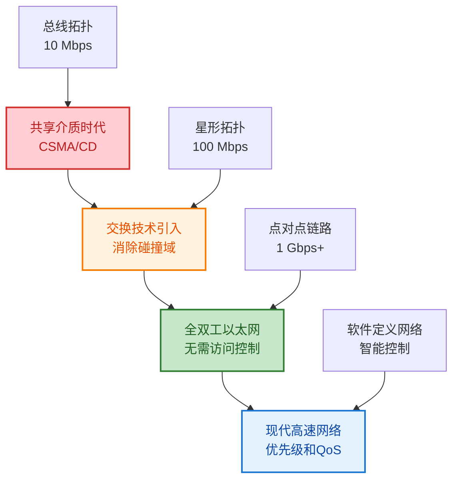
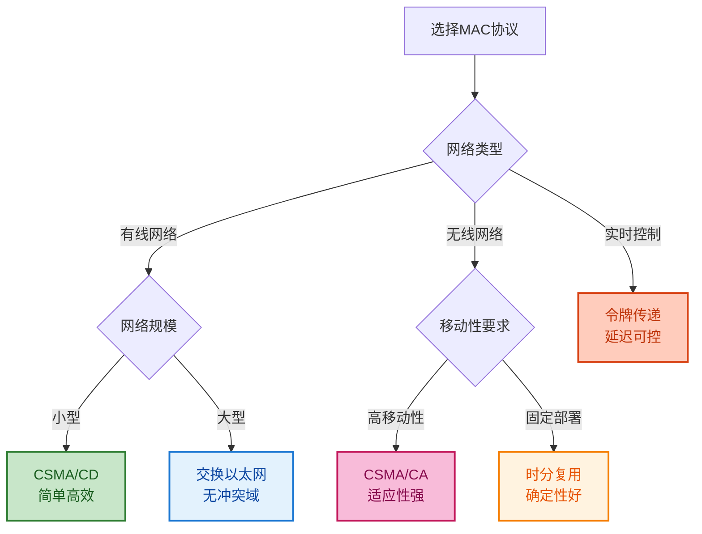

# 3.2 CSMA/CD与介质访问控制

## 目录

### 基础理论篇
1. [介质访问控制概述与理解](#1-介质访问控制概述与理解)
2. [随机访问协议发展历程](#2-随机访问协议发展历程)

### 核心技术篇
3. [CSMA/CD协议深度解析](#3-csmacd协议深度解析)
4. [二进制指数退避算法](#4-二进制指数退避算法)
5. [最小帧长约束与性能分析](#5-最小帧长约束与性能分析)

### 扩展应用篇
6. [无线网络访问控制技术](#6-无线网络访问控制技术)
7. [协议性能对比与技术演进](#7-协议性能对比与技术演进)

---

## 1. 介质访问控制概述与理解

### 1.1 快速定位

**核心问题**：当多个设备共享同一个传输介质时，如何有序地进行数据传输？

**主要挑战**：
1. **信道竞争**：多个站点同时尝试发送数据
2. **冲突检测**：快速发现传输冲突
3. **公平性保证**：确保各站点公平访问
4. **效率优化**：最大化信道利用率

### 1.2 CSMA/CD协议核心概念

> **CSMA/CD**：载波监听多址接入/冲突检测协议，解决多站点共享总线的访问控制问题。

**基本原理**：
- **载波监听（CS）**：发送前检测信道状态
- **多址接入（MA）**：多个站点共享同一信道
- **冲突检测（CD）**：发送中检测并处理冲突

**核心特点**：
1. **发送前先听**：避免不必要的冲突
2. **边发边听**：及时发现信号冲突
3. **快速停止**：检测到冲突立即停止
4. **随机退避**：避免重复冲突循环
**CSMA/CD基本工作过程**：

**步骤1：载波监听**
- 发送前检测信道状态
- 确认信道空闲后开始发送

**步骤2：正常发送**
- 开始发送数据帧
- 电信号沿总线传播

**步骤3：冲突检测**
- 发送中持续监听信道
- 检测是否发生信号冲突

**步骤4：冲突处理**
- 发现冲突立即停止发送
- 发送干扰信号通知其他站点
- 执行二进制指数退避算法

**步骤5：重传处理**
- 等待随机退避时间
- 重新进行载波监听
- 重新发送数据帧

### 1.3 介质访问控制方法分类

> **介质访问控制（MAC）**：管理多个设备对共享传输介质访问的协议和机制。

**静态分配方法**：
- **频分复用（FDMA）**：不同频率分给不同用户
- **时分复用（TDMA）**：不同时间分给不同用户  
- **码分复用（CDMA）**：不同编码分给不同用户

**动态分配方法**：
- **竞争型协议**：ALOHA、CSMA、CSMA/CD
- **无竞争协议**：令牌传递、令牌环
- **混合型协议**：预约系统、轮询协议

---

## 2. 随机访问协议发展历程

### 2.1 纯ALOHA协议

> **ALOHA协议**：最早的随机访问协议，用户想发送时立即发送，发生冲突时随机延迟后重传。

**工作原理**：


**性能分析**：
- 吞吐量公式：$S = G \cdot e^{-2G}$
- 最大吞吐量：$S_{max} = \frac{1}{2e} ≈ 0.184$（当 $G = 0.5$ 时）

**弱点**：效率太低，只有18.4%的理论最大吞吐量

### 2.2 时隙ALOHA协议

**改进思想**：将时间划分为离散时隙，只允许在时隙开始时发送。

**性能提升**：
- 吞吐量公式：$S = G \cdot e^{-G}$  
- 最大吞吐量：$S_{max} = \frac{1}{e} ≈ 0.368$（当 $G = 1$ 时）
- 比纯ALOHA提高一倍

### 2.3 CSMA协议族的发展

**载波监听多址接入（CSMA）**：
在ALOHA基础上增加载波监听机制，发送前先检测信道。

**CSMA协议变种**：
1. **1-坚持CSMA**：信道空闲立即发送
2. **非坚持CSMA**：信道忙时随机退避
3. **p-坚持CSMA**：信道空闲时以概率p发送

---

## 3. CSMA/CD协议深度解析

> **载波监听多址接入/冲突检测（CSMA/CD）**：在CSMA基础上增加冲突检测能力，是经典以太网的核心协议。

### 3.1 协议组成解析

**CSMA/CD = CS + MA + CD**：
- **CS（Carrier Sense）**：载波监听 - 发送前先听
- **MA（Multiple Access）**：多址接入 - 多站点共享
- **CD（Collision Detection）**：冲突检测 - 边发边听

### 3.2 载波监听机制详解

**监听原理**：
通过检测物理信道上的电信号强度判断信道状态。

**判断标准**：
```
信号功率 > 阈值  →  信道忙（有载波）
信号功率 ≤ 阈值  →  信道空闲（无载波）
```

**监听类型**：
1. **发送前监听**：避免冲突
2. **发送中监听**：检测冲突

### 3.3 冲突检测机制详解

**检测原理**：
发送站点将自己发送的信号与从信道接收的信号进行比较。

**检测方法**：
```
正常情况：发送信号 = 接收信号  →  无冲突
冲突情况：发送信号 ≠ 接收信号  →  检测到冲突
```

**物理实现**：
- **电压比较法**：比较发送与接收的电压幅度
- **差分检测法**：检测信号的差分特性变化

### 3.4 CSMA/CD完整工作流程



### 3.5 冲突检测窗口

**概念定义**：
> **冲突检测窗口**：从开始发送到能够检测到所有可能冲突的时间窗口。

**计算公式**：
$$冲突检测窗口 = 2τ$$

其中： $τ$ 是网络的单程最大传播延迟

**物理意义**：
- 最坏情况：A开始发送，B在信号到达前 $ε$ 时间也开始发送
- 冲突信号返回A需要 $2τ - ε$ 时间
- 为保证检测到冲突，发送时间必须 > $2τ$

---

## 4. 二进制指数退避算法

### 4.1 算法设计思想

**核心目标**：
1. **避免重复冲突**：冲突后不能立即重试
2. **自适应负载**：网络拥塞时退避时间更长
3. **保证公平性**：各站点获得相同的竞争机会
4. **防止崩溃**：避免网络拥塞雪崩

### 4.2 算法详细规则

**参数定义**：
- **基本时隙**：$T_{slot} = 2τ$（往返传播延迟）
- **最大重传次数**：16次
- **最大退避指数**：10

**算法实现**：
```python
def binary_exponential_backoff(collision_count):
    """二进制指数退避算法实现"""
    
    # 步骤1：检查重传次数限制
    if collision_count > 16:
        return "丢弃帧，报告上层协议错误"
    
    # 步骤2：确定退避指数
    k = min(collision_count, 10)
    
    # 步骤3：计算退避窗口大小
    window_size = 2**k
    
    # 步骤4：随机选择退避时隙数
    backoff_slots = random.randint(0, window_size - 1)
    
    # 步骤5：计算实际退避时间
    backoff_time = backoff_slots * slot_time
    
    return backoff_time
```

### 4.3 退避过程详细示例

**逐次冲突的退避演化**：



**退避时间计算示例**：
```
网络参数：
- 网络最大传播延迟τ = 25μs
- 时隙时间 = 2τ = 50μs

第1次冲突：k=1
- 退避窗口：{0, 1}
- 假设随机选择：1
- 退避时间：1 × 50μs = 50μs

第2次冲突：k=2  
- 退避窗口：{0, 1, 2, 3}
- 假设随机选择：2
- 退避时间：2 × 50μs = 100μs

第3次冲突：k=3
- 退避窗口：{0, 1, 2, 3, 4, 5, 6, 7}
- 假设随机选择：5
- 退避时间：5 × 50μs = 250μs
```

### 4.4 算法特性分析

**自适应特性**：
- **轻负载**：冲突少 → 退避时间短 → 快速响应
- **重负载**：冲突多 → 退避时间长 → 避免拥塞

**公平性保证**：
- 所有站点使用相同算法参数
- 退避时间完全随机选择
- 长期统计下机会均等

**稳定性机制**：
- 退避窗口指数级增长
- 设置最大退避指数防止过长等待
- 超过最大重传次数后放弃

---

## 5. 最小帧长约束与性能分析

### 5.1 最小帧长的物理必要性

**问题分析**：
如果数据帧太短，在冲突检测窗口（ $2τ$ ）内就发送完毕，发送方无法检测到可能的冲突。

**解决思路**：
设置最小帧长，确保帧的发送时间大于冲突检测窗口。

### 5.2 最小帧长推导过程

**推导步骤**：

1. **建立约束条件**：
   $$T_{frame} > 2τ$$

2. **转换为帧长约束**：
   $$\frac{L_{frame}}{C} > 2τ$$

3. **得到最小帧长**：
   $$L_{min} = 2τ \cdot C$$

**公式说明**：
- $L_{min}$ ：最小帧长（bits）
- $τ$ ：单程最大传播延迟（s）  
- $C$ ：信道传输速率（bps）

### 5.3 实际网络计算实例

**经典10BASE-T以太网**：
```
网络参数：
- 最大网段长度：100m
- 信号传播速度：2×10⁸ m/s
- 传输速率：10 Mbps

理论计算：
τ = 100 / (2×10⁸) = 0.5 μs
L_min = 2 × 0.5×10⁻⁶ × 10×10⁶ = 10 bits

实际考虑因素：
- 中继器处理延迟：每个中继器约 10bit 延迟
- 电缆传播延迟：实际传播速度约 0.65c
- 检测电路延迟：约 4bit 延迟  
- 安全余量：预留约 40% 余量

最终标准：512 bits = 64 bytes
```

**不同以太网标准对比**：

| 以太网类型 | 传输速率 | 最大网络直径 | 理论最小帧长 | 标准最小帧长 |
|-----------|----------|-------------|-------------|-------------|
| 10BASE-T | 10 Mbps | 200m | 20 bits | 512 bits |
| 100BASE-T | 100 Mbps | 200m | 200 bits | 512 bits |
| 1000BASE-T | 1 Gbps | 200m | 2000 bits | 512 bits* |

*注：1000BASE-T 使用载波扩展技术保持兼容性

### 5.4 信道利用率分析

**利用率公式推导**：

设有用数据传输时间为 $T_{data}$ ，总的传输周期为 $T_{total}$ ，则：

$$η = \frac{T_{data}}{T_{total}}$$

在最理想情况下（无冲突）：
$$T_{total} = T_{data} + 2τ$$

因此：
$$η = \frac{T_{data}}{T_{data} + 2τ} = \frac{1}{1 + \frac{2τ}{T_{data}}}$$

定义归一化传播延迟：
$$a = \frac{τ}{T_{data}}$$

最终得到：
$$η = \frac{1}{1 + 2a}$$

### 5.5 性能计算详细实例

**实例1：低速以太网（10 Mbps）**
```
网络配置：
- 传输速率：10 Mbps
- 网络直径：500m  
- 传播速度：2×10⁸ m/s
- 最小帧长：512 bits

计算过程：
τ = 500 / (2×10⁸) = 2.5 μs
T_frame = 512 / (10×10⁶) = 51.2 μs
a = 2.5 / 51.2 = 0.049
η = 1 / (1 + 2×0.049) = 91.1%

结论：低速网络中CSMA/CD效率很高
```

**实例2：高速以太网（1 Gbps）**
```
网络配置：
- 传输速率：1 Gbps
- 网络直径：500m（相同网络）
- 传播速度：2×10⁸ m/s  
- 最小帧长：512 bits

计算过程：
τ = 2.5 μs（不变）
T_frame = 512 / (1×10⁹) = 0.512 μs
a = 2.5 / 0.512 = 4.88
η = 1 / (1 + 2×4.88) = 9.3%

结论：高速网络中CSMA/CD效率急剧下降
```

**性能对比图**：



---

## 6. 无线网络访问控制技术

### 6.1 CSMA/CA协议概述

> **载波监听多址接入/冲突避免（CSMA/CA）**：无线网络中的访问控制协议，由于无线环境难以实现冲突检测，采用冲突避免策略。

### 6.2 CSMA/CA与CSMA/CD的本质区别

**为什么无线网络难以检测冲突**：
1. **信号衰减严重**：无线信号随距离快速衰减
2. **发送功率强大**：发送信号比接收信号强得多
3. **半双工特性**：同一时刻只能发送或接收
4. **隐藏终端问题**：不是所有站点都能互相听到

**协议对比**：

| 特征 | CSMA/CD | CSMA/CA |
|------|---------|---------|
| **冲突处理策略** | 检测后处理 | 预先避免 |
| **确认机制** | 不需要 | 需要ACK |
| **RTS/CTS** | 不使用 | 可选使用 |
| **退避时机** | 冲突后 | 每次发送前 |
| **适用环境** | 有线网络 | 无线网络 |

### 6.3 隐藏终端与暴露终端问题

**隐藏终端问题**：


**RTS/CTS解决方案**：


---

## 7. 协议性能对比与技术演进

### 7.1 各类MAC协议性能对比

**协议特性综合对比**：

| 协议类型 | 最大吞吐量 | 平均延迟 | 延迟确定性 | 公平性 | 复杂度 | 适用场景 |
|---------|------------|----------|------------|--------|--------|----------|
| **纯ALOHA** | 18.4% | 高 | 差 | 好 | 低 | 简单终端网络 |
| **时隙ALOHA** | 36.8% | 中高 | 差 | 好 | 低 | 卫星通信 |
| **CSMA/CD** | ~100% | 低 | 中 | 好 | 中 | 有线局域网 |
| **CSMA/CA** | 60-80% | 中 | 差 | 中 | 高 | 无线局域网 |
| **令牌传递** | 90%+ | 中 | 好 | 优 | 高 | 实时控制网络 |

### 7.2 性能曲线分析

**吞吐量随负载变化曲线**：



### 7.3 现代网络技术演进

**从共享到交换的演进**：



**技术演进驱动因素**：
1. **速率提升**：CSMA/CD在高速下效率急剧下降
2. **拓扑变化**：从总线型向星形交换式发展
3. **应用需求**：多媒体应用需要QoS保证
4. **成本下降**：交换设备成本大幅降低

### 7.4 协议选择指导原则

**选择决策树**：



---

## 学习总结

### 核心知识框架

**技术发展脉络**：
1. **ALOHA时代**：随机访问的起源
2. **CSMA改进**：引入载波监听机制  
3. **CSMA/CD完善**：增加冲突检测能力
4. **CSMA/CA扩展**：适应无线环境
5. **交换时代**：消除共享介质竞争

### 重要公式汇总

**随机访问协议**：
- 纯ALOHA：$S = G \cdot e^{-2G}$ ， $S_{max} = 0.184$
- 时隙ALOHA：$S = G \cdot e^{-G}$ ， $S_{max} = 0.368$

**CSMA/CD协议**：
- 最小帧长：$L_{min} = 2τ \cdot C$
- 信道利用率：$η = \frac{1}{1 + 2a}$ ，其中 $a = \frac{τ}{T_{frame}}$
- 冲突检测窗口：$T_{window} = 2τ$

**二进制指数退避**：
- 退避窗口：$W = 2^k$ ，其中 $k = \min(冲突次数, 10)$
- 退避时间：$T_{backoff} = random(0, W-1) \times T_{slot}$

### 重点提醒

**必须掌握的核心内容**：
- CSMA/CD协议完整工作流程
- 二进制指数退避算法详细过程
- 最小帧长约束的物理原理和计算方法
- 信道利用率分析和性能计算
- 各种MAC协议的适用场景和选择原则

**常见考点**：
- 冲突检测窗口与最小帧长关系
- 不同网络参数下的性能计算
- CSMA/CD与CSMA/CA的区别
- 隐藏终端问题及解决方案
- 协议性能对比分析

 