# 3.3 以太网与现代局域网技术

## 目录

### 基础理论篇
1. [以太网概述与发展历程](#1-以太网概述与发展历程)
2. [以太网帧格式与MAC地址技术](#2-以太网帧格式与mac地址技术)

### 核心技术篇
3. [交换式以太网技术](#3-交换式以太网技术)
4. [VLAN技术深度解析](#4-vlan技术深度解析)
5. [生成树协议与网络冗余](#5-生成树协议与网络冗余)

### 扩展应用篇
6. [现代局域网性能优化](#6-现代局域网性能优化)
7. [故障排除与网络维护](#7-故障排除与网络维护)

---

## 1. 以太网概述与发展历程

### 1.1 快速定位

**核心定义**：以太网（Ethernet）是目前应用最广泛的局域网技术

**技术特点**：
1. **简单高效**：即插即用的网络连接
2. **成本低廉**：大规模商用降低成本
3. **标准化程度高**：IEEE 802.3系列标准
4. **可扩展性强**：从10Mbps到400Gbps

### 1.2 以太网技术发展概述

**三个主要发展阶段**：

**第一阶段：共享式以太网（1980-1995）**
- 总线型拓扑结构
- 所有设备共享带宽
- 使用CSMA/CD访问控制
- 存在碰撞域问题

**第二阶段：交换式以太网（1995-2005）**
- 星形拓扑结构
- 每端口独享带宽
- MAC地址学习转发
- 碰撞域隔离

**第三阶段：全双工以太网（2005至今）**
- 点对点全双工连接
- 同时发送接收数据
- 支持QoS和流量控制
- 智能网络管理

### 1.3 以太网标准演进

> **以太网标准**：由IEEE 802.3工作组制定的局域网标准系列。

**技术发展时间线**：

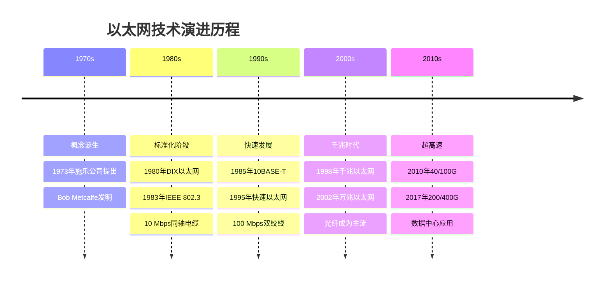

**标准命名规则**：
```
格式：<速率>BASE<信号><参数>

组成解析：
- 速率：10/100/1000/10000（Mbps）
- BASE：基带传输（相对于BROAD宽带）
- 信号：T(双绞线)/F(光纤)/数字(同轴电缆段长)
- 参数：特殊技术特征
```

**主要标准对比**：

| 标准名称 | 传输速率 | 传输介质 | 最大距离 | 应用场景 |
|---------|----------|----------|----------|----------|
| 10BASE-T | 10 Mbps | 双绞线 | 100m | 传统办公网 |
| 100BASE-TX | 100 Mbps | 双绞线 | 100m | 快速以太网 |
| 1000BASE-T | 1 Gbps | 双绞线 | 100m | 千兆桌面 |
| 10GBASE-T | 10 Gbps | 双绞线 | 100m | 高速桌面 |
| 1000BASE-SX | 1 Gbps | 多模光纤 | 550m | 楼宇骨干 |
| 10GBASE-SR | 10 Gbps | 多模光纤 | 300m | 数据中心 |

### 1.4 技术架构核心演进

**三大发展阶段**：

**第一阶段：共享介质时代（1980-1995）**
```
核心特征：
- 总线型/环型拓扑
- 半双工通信方式
- CSMA/CD访问控制
- 单一碰撞域

技术限制：
- 带宽共享导致性能下降
- 碰撞域扩大影响效率
- 故障传播影响整网
- 安全性较差
```

**第二阶段：交换技术时代（1995-2005）**
```
核心特征：
- 星形拓扑结构
- 独享端口带宽
- MAC地址学习转发
- 碰撞域隔离

技术优势：
- 性能线性提升
- 故障域隔离
- 安全性增强
- 易于管理维护
```

**第三阶段：全双工智能时代（2005至今）**
```
核心特征：
- 点对点全双工连接
- 流量控制机制
- QoS服务质量
- 网络管理智能化

技术优势：
- 带宽效率最大化
- 延迟最小化
- 服务质量保证
- 智能化运维
```

### 1.5 为什么选择以太网

**与其他局域网技术对比**：

**早期竞争技术**：
- **令牌环（Token Ring）**：确定性访问，但复杂昂贵
- **FDDI**：高速光纤，但成本太高
- **ATM**：QoS优秀，但过于复杂

**以太网胜出的关键因素**：
1. **成本优势**：大规模生产降低成本
2. **技术简单**：即插即用，易于部署
3. **标准开放**：多厂商支持，兼容性好
4. **持续演进**：不断适应新需求

---

## 2. 以太网帧格式与MAC地址技术

### 2.1 快速定位

**核心内容**：以太网数据传输的基本单位和设备标识机制

**主要组成**：
1. **帧格式**：数据包装和传输的标准格式
2. **MAC地址**：设备在网络中的唯一标识
3. **校验机制**：保证数据传输的可靠性
4. **性能分析**：评估网络传输效率

### 2.2 以太网帧处理机制

**帧处理四个主要过程**：

**1. 帧封装过程**
- 上层协议下传数据
- 添加以太网帧头
- 填入目标和源MAC地址
- 计算并添加FCS校验码

**2. MAC地址处理**
- 48位全球唯一标识
- 支持单播、组播、广播
- I/G和U/L位控制地址类型
- 交换机维护MAC地址表

**3. 帧转发过程**
- 接收帧并检查目标MAC
- 查询MAC地址表
- 确定转发端口
- 更新地址学习表

**4. 差错检测**
- 计算CRC-32校验码
- 验证帧完整性
- 校验失败则丢弃帧

### 2.3 以太网帧格式深度解析

> **以太网帧**：以太网传输的基本数据单位，包含完整的地址、控制和数据信息。

**两种主要格式对比**：

**DIX Ethernet v2帧格式**：
```
DIX以太网v2帧格式（64-1518字节）
前导码(56) + 帧起始定界符SFD(8)                     
────────────────────────────────────────────────────────────────
                     目的MAC地址(48)                        
────────────────────────────────────────────────────────────────
                      源MAC地址(48)           
────────────────────────────────────────────────────────────────
                        类型(16)                             
────────────────────────────────────────────────────────────────
                            
                     数据载荷                               
                   (46-1500字节)                              

────────────────────────────────────────────────────────────────
                   帧校验序列FCS(32)                          
────────────────────────────────────────────────────────────────
```

**IEEE 802.3帧格式**：
```
IEEE 802.3帧格式（64-1518字节）
前导码(56) + 帧起始定界符SFD(8)                     
────────────────────────────────────────────────────────────────
                     目的MAC地址(48)                        
────────────────────────────────────────────────────────────────
                      源MAC地址(48)           
────────────────────────────────────────────────────────────────
                         长度(16)                             
────────────────────────────────────────────────────────────────
                         LLC头部(24)                             
────────────────────────────────────────────────────────────────
                            
                     数据载荷                               
                   (43-1497字节)                              

────────────────────────────────────────────────────────────────
                   帧校验序列FCS(32)                          
────────────────────────────────────────────────────────────────
```

**帧格式选择判断**：
```
类型/长度字段值：
- ≥ 1536 (0x0600) → DIX格式，表示上层协议类型
- ≤ 1500          → IEEE 802.3格式，表示数据长度
```

### 2.4 各字段详细技术解析

**前导码和帧起始定界符**：
- **前导码**：7字节 `10101010...` ，用于时钟同步
- **SFD**：1字节 `10101011` ，标识帧开始

**MAC地址字段结构**：
```
48位MAC地址结构：
┌──────────────┬──────────────┬──────────────┐
│    字节1     │   字节2-3    │   字节4-6    │
│ I/G | U/L |XX│      OUI     │  厂商分配    │
└──────────────┴──────────────┴──────────────┘

I/G位：0=单播，1=组播/广播
U/L位：0=全局唯一，1=本地管理
OUI：组织唯一标识符（24位）
厂商分配：设备唯一标识（24位）
```

**常用协议类型值**：
```
0x0800: IPv4数据包
0x0806: ARP协议
0x86DD: IPv6数据包
0x8100: 802.1Q VLAN标签
0x88CC: LLDP链路发现协议
0x888E: 802.1X认证协议
```

### 2.5 CRC校验技术详解

**FCS计算过程**：
使用CRC-32算法对帧进行校验：

生成多项式：
$$G(x) = x^{32} + x^{26} + x^{23} + x^{22} + x^{16} + x^{12} + x^{11} + x^{10} + x^8 + x^7 + x^5 + x^4 + x^2 + x + 1$$

**校验范围**：从目标MAC地址到数据字段结束

**错误处理机制**：
- **校验成功**：去除FCS后向上层传递
- **校验失败**：直接丢弃帧，不上报错误

### 2.6 MAC地址技术深度解析

**全球分配体系**：

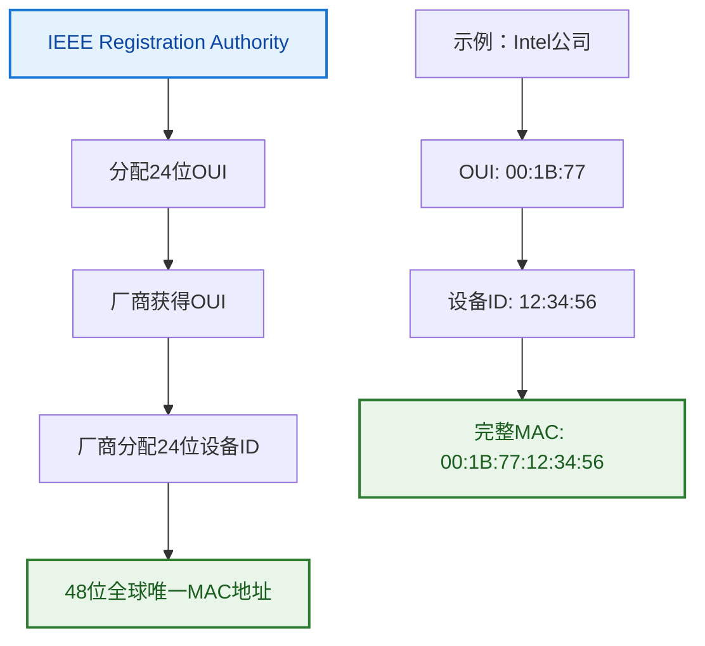

**特殊地址类型**：

| 地址类型 | 地址范围 | 第1字节特征 | 应用场景 |
|---------|---------|-------------|----------|
| 单播地址 | 00:xx:xx:xx:xx:xx | 偶数 | 设备间点对点通信 |
| 组播地址 | 01:xx:xx:xx:xx:xx | 奇数 | 多目标数据传输 |
| 广播地址 | FF:FF:FF:FF:FF:FF | 255 | 本地网络所有设备 |
| 本地管理 | x2:xx:xx:xx:xx:xx | 第2位=1 | 虚拟化环境 |

### 2.7 性能分析与优化

**理论效率计算**：

以1500字节数据帧为例：
$$效率 = \frac{有效数据}{总帧长} = \frac{1500}{1500 + 18 + 12} = \frac{1500}{1530} = 98.0\%$$

其中：
- 有效数据：1500字节
- 帧开销：18字节（头部14+FCS4）
- 帧间间隔：12字节

**性能影响因素**：

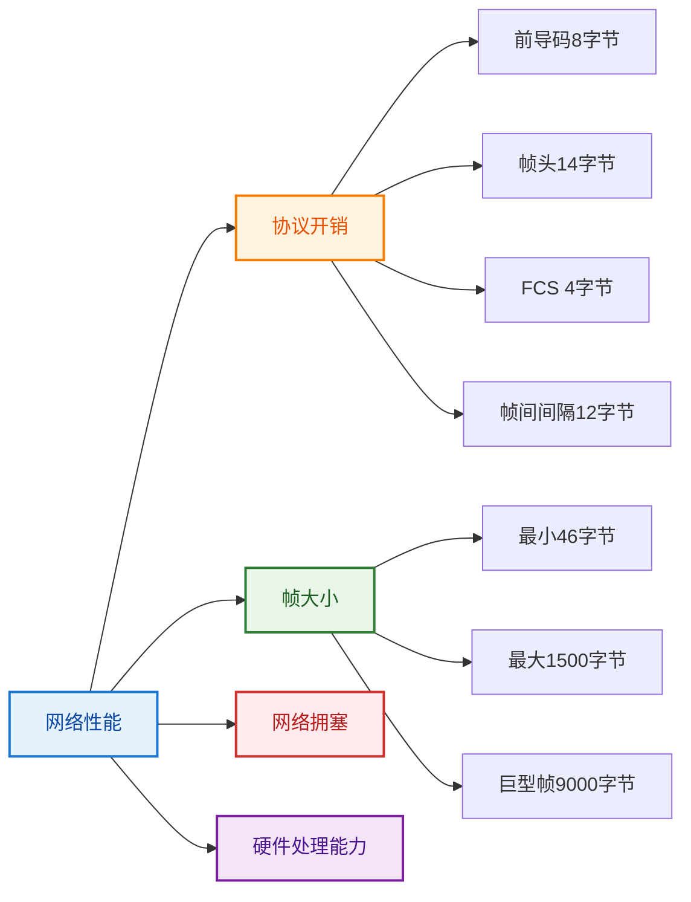

**性能优化技术**：
1. **巨型帧**：减少帧数量，降低开销
2. **链路聚合**：多链路并行传输
3. **流量控制**：避免缓冲区溢出
4. **QoS机制**：保证关键业务优先级

---

## 3. 交换式以太网技术

### 3.1 快速定位

**核心技术**：基于MAC地址学习的智能帧转发

**主要特点**：
1. **独享带宽**：每个端口独立的碰撞域
2. **智能转发**：基于MAC地址表的精确转发
3. **即插即用**：自动学习网络拓扑
4. **性能线性扩展**：端口数增加性能成比例提升

### 3.2 交换机工作原理概述

**交换机的四个核心功能**：

**1. MAC地址学习**
- 提取收到帧的源MAC地址
- 在MAC地址表中记录地址到端口的映射
- 记录学习时间戳便于老化处理

**2. 地址查询转发**
- 查询目标MAC地址对应的端口
- 已知地址直接转发到对应端口
- 实现点对点高效通信

**3. 未知地址处理**
- 对未知目标MAC地址进行洪泛
- 向所有端口转发（除源端口）
- 通过响应学习新设备位置

**4. 端口过滤机制**
- 检测源端口和目标端口
- 同端口通信直接过滤
- 避免不必要的帧转发

### 3.3 交换机工作原理深度解析

> **以太网交换机**：数据链路层网络设备，基于MAC地址实现智能帧转发。

**核心功能模块**：

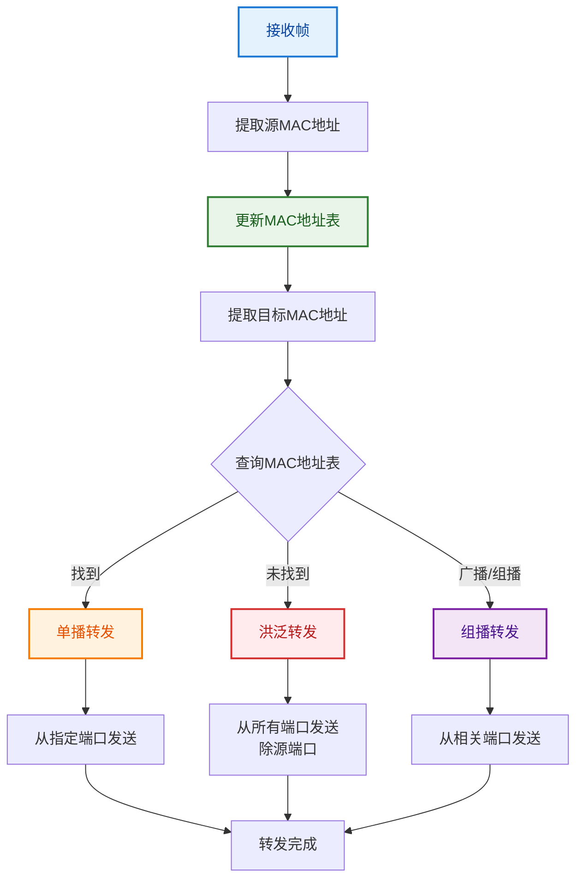

### 3.4 MAC地址学习算法详解

**学习算法实现**：
```python
def mac_learning_algorithm(frame, input_port):
    """MAC地址学习和转发算法"""
    
    source_mac = frame.source_mac
    dest_mac = frame.dest_mac
    current_time = get_current_time()
    
    # 第一步：学习源MAC地址
    mac_table[source_mac] = {
        'port': input_port,
        'timestamp': current_time,
        'status': 'learned'
    }
    
    # 第二步：处理目标MAC地址
    if dest_mac == "FF:FF:FF:FF:FF:FF":
        # 广播帧：转发到所有端口（除源端口）
        flood_to_all_ports(frame, exclude_port=input_port)
        
    elif is_multicast(dest_mac):
        # 组播帧：转发到组成员端口
        forward_to_multicast_group(frame, dest_mac)
        
    elif dest_mac in mac_table:
        # 已知单播：直接转发
        output_port = mac_table[dest_mac]['port']
        if output_port != input_port:
            forward_to_port(frame, output_port)
    else:
            # 同端口过滤
            drop_frame(frame, reason="same_port")
            
    else:
        # 未知单播：洪泛学习
        flood_to_all_ports(frame, exclude_port=input_port)
```

**学习过程详细示例**：

**网络拓扑**：
```
设备A(MAC: AA:AA:AA:AA:AA:AA) ──┐
                              ├── 交换机
设备B(MAC: BB:BB:BB:BB:BB:BB) ──┤    
                              │
设备C(MAC: CC:CC:CC:CC:CC:CC) ──┘
```

**学习时序**：

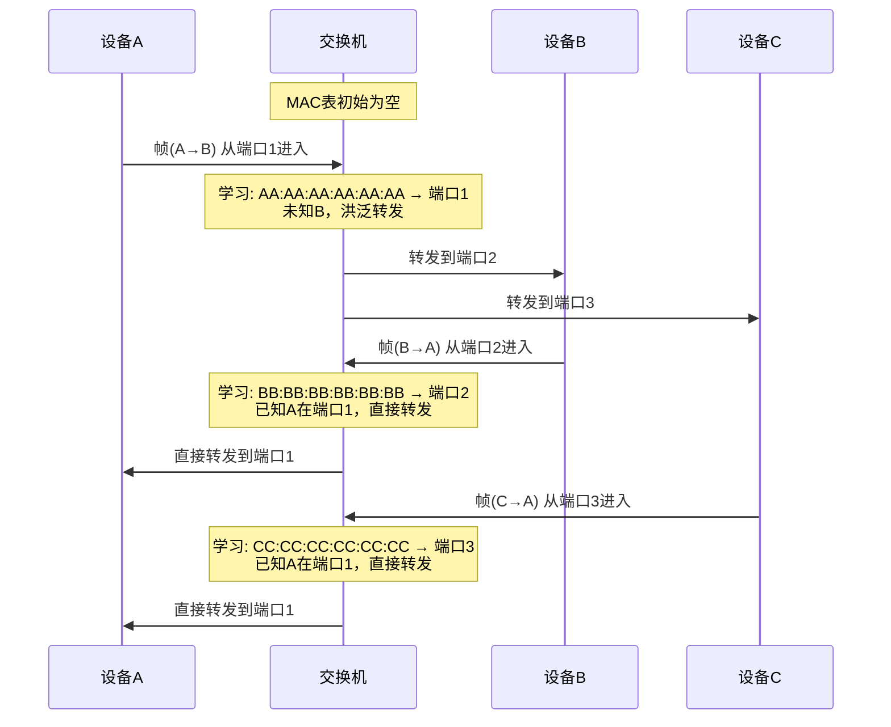

### 3.5 交换机关键技术特性

**地址表老化机制**：
- **老化时间**：默认300秒（5分钟）
- **老化目的**：清理不活跃设备，适应拓扑变化
- **老化过程**：定期检查时间戳，删除过期条目

**帧转发模式**：
1. **存储转发**：接收完整帧后校验再转发
2. **直通转发**：接收到目标地址立即开始转发
3. **无碎片转发**：接收64字节后开始转发

**性能指标**：
- **转发延迟**：帧进入到开始转发的时间
- **吞吐量**：单位时间处理的帧数量
- **背板带宽**：内部交换矩阵的总带宽
- **包转发率**：最小帧的转发速率（pps）
转发：已知B在端口2，直接转发
```

### 5.3 帧转发决策

**转发决策表**：

| 目的MAC地址类型 | 决策 | 说明 |
|-----------------|------|------|
| 已知单播地址 | 单端口转发 | 查表转发到对应端口 |
| 未知单播地址 | 洪泛转发 | 除输入端口外所有端口 |
| 广播地址 | 洪泛转发 | 除输入端口外所有端口 |
| 组播地址 | 组播转发 | 根据组播表转发 |

### 5.4 地址表老化机制

**老化参数**：
- **默认老化时间**：300秒（5分钟）
- **可配置范围**：10-1000000秒

**老化算法**：
```python
def aging_process():
    current = current_time()
    for mac, entry in mac_table.items():
        if current - entry['timestamp'] > aging_time:
            del mac_table[mac]
```

**老化的必要性**：
- **拓扑变化适应**：设备位置改变
- **表空间管理**：防止表项无限增长
- **错误恢复**：清除错误学习结果

---

## 5. 生成树协议与网络冗余

### 5.1 快速定位

**核心功能**：通过逻辑阻塞部分端口，在保证连通性的前提下消除网络环路

**主要技术**：
1. **STP协议**：传统生成树协议，收敛时间较长
2. **RSTP协议**：快速生成树，收敛时间大幅缩短  
3. **MSTP协议**：多实例生成树，支持VLAN负载均衡
4. **端口角色**：根端口、指定端口、阻塞端口管理

### 5.2 STP协议工作原理

**STP的四个核心步骤**：

**1. 根桥选举**
- 所有交换机参与根桥选举
- 选择桥ID最小的交换机
- 根桥成为网络的中心节点

**2. 路径成本计算**
- 计算到根桥的最短路径
- 基于端口带宽确定成本值
- 高速端口成本低于低速端口

**3. 端口角色分配**
- 根端口：到根桥的最佳路径
- 指定端口：网段的转发端口
- 阻塞端口：防止环路的冗余端口

**4. 拓扑变化处理**
- 检测链路故障和恢复
- 重新计算最优拓扑
- 快速收敛到稳定状态

### 5.3 STP协议技术细节

> **生成树协议(STP)**：IEEE 802.1D标准，通过阻塞冗余链路防止二层环路。

**STP核心算法**：
1. **根桥选举**：选择桥ID最小的交换机作为根桥
2. **根端口选择**：每个非根桥选择到根桥成本最低的端口
3. **指定端口选择**：每个网段选择一个转发端口
4. **其他端口阻塞**：防止环路形成

**桥ID结构**：
```
┌─────────────────┬─────────────────┐
│    桥优先级     │    MAC地址       │
│    2字节        │    6字节        │
│  默认32768      │   设备唯一      │
└─────────────────┴─────────────────┘

桥ID = 优先级 + MAC地址
```

**STP工作流程**：

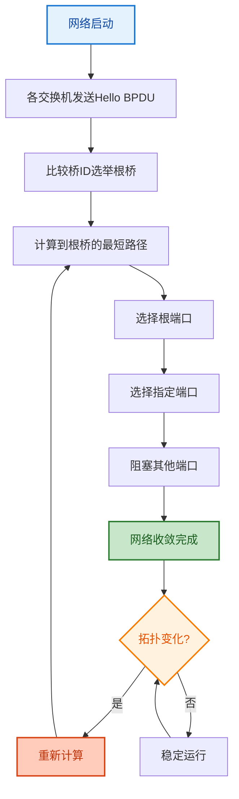

### 5.4 RSTP快速生成树优化

> **RSTP(快速生成树)**：IEEE 802.1w标准，将收敛时间从30秒缩短到数秒。

**RSTP改进特点**：

**端口角色增强**：
- **根端口**：到根桥的最佳路径
- **指定端口**：网段的转发端口  
- **备份端口**：同一交换机的冗余端口
- **备选端口**：到根桥的备选路径

**快速收敛机制**：
```
边缘端口特性：
- 连接终端设备的端口
- 立即进入转发状态
- 不参与STP计算
- 大幅减少收敛时间

点对点链路优化：
- 全双工链路快速协商
- 提议/同意机制
- 主动通知拓扑变化
- 并行处理多个端口
```

**端口状态简化**：
```
RSTP端口状态：
Discarding ←→ Learning ←→ Forwarding

相比STP的5种状态：
Disabled/Blocking → Discarding
Listening → 取消（直接进入Learning）
Learning → Learning  
Forwarding → Forwarding
```

### 5.5 网络冗余设计原则

**冗余设计目标**：
1. **高可用性**：单点故障不影响业务
2. **快速恢复**：故障后秒级切换
3. **负载均衡**：充分利用冗余资源
4. **成本控制**：合理规划冗余投资

**典型冗余拓扑**：

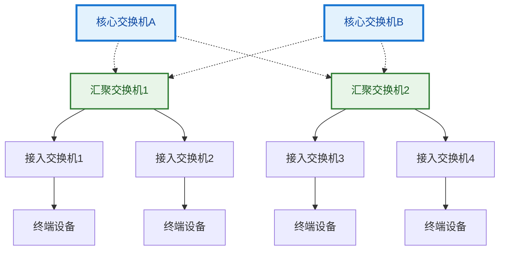

**冗余链路管理**：
- **主链路**：正常情况下承载业务流量
- **备份链路**：主链路故障时自动切换
- **负载分担**：通过VLAN实现链路负载均衡
- **监控告警**：实时监控链路状态和性能

---

## 4. VLAN技术深度解析

### 4.1 快速定位

**核心概念**：在单一物理网络上创建多个逻辑隔离的虚拟网络

**主要功能**：
1. **广播域分割**：控制广播风暴，提升性能
2. **安全隔离**：逻辑隔离不同部门或业务
3. **灵活管理**：基于逻辑而非物理位置配置
4. **资源优化**：提高网络设备利用率

### 4.2 VLAN技术工作原理

**VLAN的四个核心机制**：

**1. 逻辑网络划分**
- 在物理网络上创建多个虚拟网络
- 每个VLAN是独立的广播域
- 不同VLAN间默认二层隔离

**2. 广播域控制**
- 限制广播帧的传播范围
- 只在同一VLAN内转发广播
- 有效防止广播风暴

**3. 动态成员管理**
- 通过软件配置VLAN成员
- 支持设备在VLAN间迁移
- 无需改变物理连接

**4. 多VLAN传输**
- Trunk端口承载多个VLAN
- 使用802.1Q标签标识VLAN
- 实现VLAN间的互联通信

### 4.3 VLAN技术核心概念

> **VLAN（虚拟局域网）**：在物理网络基础上通过软件配置创建的逻辑网络分段。

**VLAN本质特征**：
1. **逻辑分割**：一个物理交换机支持多个逻辑网络
2. **广播域隔离**：每个VLAN是独立的广播域
3. **二层隔离**：不同VLAN间默认无法二层通信
4. **三层互通**：通过路由器可实现VLAN间通信

**VLAN优势分析**：

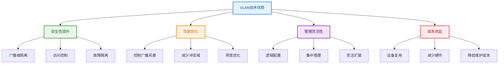

### 4.4 VLAN划分方法与实现

**主要划分方式对比**：

| 划分方式 | 实现基础 | 主要优点 | 主要缺点 | 适用场景 |
|---------|---------|----------|----------|----------|
| 基于端口 | 物理端口号 | 配置简单、性能好 | 缺乏灵活性 | 固定办公环境 |
| 基于MAC | 硬件地址 | 用户移动性好 | 管理复杂 | 移动设备较多 |
| 基于协议 | 网络协议 | 自动分类 | 现代网络少用 | 多协议环境 |
| 基于IP子网 | IP地址 | 结合三层规划 | 配置复杂 | 大型企业网 |

**基于端口的VLAN（主流方式）**：
```
典型配置示例：
交换机端口1-8   → VLAN 10 (销售部)
交换机端口9-16  → VLAN 20 (技术部)  
交换机端口17-24 → VLAN 30 (财务部)
交换机端口25-26 → Trunk (上行链路)
```

### 4.5 802.1Q标签协议技术解析

> **IEEE 802.1Q**：VLAN标准协议，通过在以太网帧中插入4字节标签实现VLAN标识。

**802.1Q标签帧格式**：
```
原始以太网帧：
                     目的MAC地址(48)                        
────────────────────────────────────────────────────────────────
                      源MAC地址(48)           
────────────────────────────────────────────────────────────────
                       类型/长度(16)                           
────────────────────────────────────────────────────────────────
                            
                     数据载荷                               
                   (46-1500字节)                              

────────────────────────────────────────────────────────────────
                   帧校验序列FCS(32)                          
────────────────────────────────────────────────────────────────

802.1Q标签帧：
                     目的MAC地址(48)                        
────────────────────────────────────────────────────────────────
                      源MAC地址(48)           
────────────────────────────────────────────────────────────────
                      VLAN标签TPID(16)                        
────────────────────────────────────────────────────────────────
PCP(3)│CFI(1)│       VID(12)       │      类型/长度(16)        
────────────────────────────────────────────────────────────────
                            
                     数据载荷                               
                   (46-1500字节)                              

────────────────────────────────────────────────────────────────
                   帧校验序列FCS(32)                          
────────────────────────────────────────────────────────────────
```

**VLAN标签结构详解**：
```
11·VLAN标签结构（32位）
                      TPID(16)                              
────────────────────────────────────────────────────────────────
PCP(3)│CFI(1)│              VID(12)                        
────────────────────────────────────────────────────────────────
```

**字段说明**：
- **TPID(16)**：标签协议标识，固定值0x8100
- **PCP(3)**：优先级代码点，支持8级优先级(0-7)
- **CFI(1)**：规范格式指示符，以太网中为0
- **VID(12)**：VLAN标识符，有效范围1-4094

### 4.6 VLAN端口类型与配置

**端口类型详细对比**：

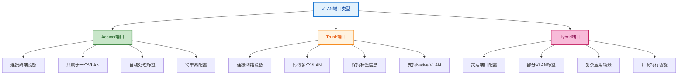

**Access端口工作机制**：
```
入站处理（PC → 交换机）：
1. 接收无标签的普通以太网帧
2. 根据端口配置添加VLAN标签
3. 在交换机内部转发处理

出站处理（交换机 → PC）：
1. 从内部接收带标签的帧
2. 检查VLAN ID是否匹配端口
3. 移除VLAN标签后转发给PC
```

**Trunk端口工作机制**：
```
数据传输过程：
1. 传输多个VLAN的数据帧
2. 保持802.1Q标签完整性
3. 支持Native VLAN(无标签传输)
4. 允许指定VLAN列表过滤
```

### 4.7 VLAN间通信与路由

**VLAN通信限制原理**：
- **同VLAN内**：二层直接转发，无需路由
- **跨VLAN间**：必须通过三层设备路由

**单臂路由配置**：
```
网络拓扑：
VLAN10设备 ──┐
             ├── 交换机 ── 路由器
VLAN20设备 ──┘

路由器配置：
interface GigabitEthernet0/0.10
 encapsulation dot1Q 10
 ip address 192.168.10.1 255.255.255.0

interface GigabitEthernet0/0.20  
 encapsulation dot1Q 20
 ip address 192.168.20.1 255.255.255.0
```

**三层交换机VLAN路由**：
```
SVI (Switch Virtual Interface) 配置：
interface vlan 10
 ip address 192.168.10.1 255.255.255.0
 no shutdown

interface vlan 20
 ip address 192.168.20.1 255.255.255.0
 no shutdown

ip routing (启用三层转发功能)
```
- 保持VLAN标签传输
- 支持Native VLAN

**配置示例**：
```bash
# Cisco配置示例
interface FastEthernet0/24
 switchport mode trunk
 switchport trunk allowed vlan 10,20,30
 switchport trunk native vlan 1
```

#### Hybrid端口

**功能特点**：
- 华为等厂商特有
- 灵活的标签处理
- 可指定哪些VLAN带标签

### 9.4 Native VLAN概念

> **Native VLAN**：Trunk端口上的默认VLAN，该VLAN的帧在传输时不携带标签。

**工作原理**：
```
发送时：
- Native VLAN帧：移除标签发送
- 其他VLAN帧：保持标签发送

接收时：
- 带标签帧：按标签处理
- 无标签帧：归入Native VLAN
```

**安全考虑**：
- **VLAN跳跃攻击**：利用Native VLAN进行攻击
- **最佳实践**：使用专门的Native VLAN，不用于用户数据

---

## 10. VLAN间路由技术

### 10.1 VLAN间通信需求

**隔离与互通的矛盾**：
```
VLAN设计目标：
- 二层隔离，提高安全性
- 控制广播域，提升性能

实际业务需求：
- 不同部门间协作
- 服务器资源共享
- 互联网访问需求
```

### 10.2 单臂路由（Router-on-a-Stick）

**拓扑结构**：
```
交换机 ──── Trunk ──── 路由器
  │                      │
VLAN10                子接口10.1
VLAN20                子接口20.1
VLAN30                子接口30.1
```

**工作原理**：
1. 路由器接口配置子接口
2. 每个子接口对应一个VLAN
3. 数据包在VLAN间通过路由器转发

**配置示例**：
```bash
# Cisco路由器配置
interface FastEthernet0/0
 no shutdown

interface FastEthernet0/0.10
 encapsulation dot1Q 10
 ip address 192.168.10.1 255.255.255.0

interface FastEthernet0/0.20
 encapsulation dot1Q 20
 ip address 192.168.20.1 255.255.255.0
```

**优缺点分析**：
- 成本低，配置简单
- 性能瓶颈，单点故障

### 10.3 三层交换机技术

**技术原理**：
在交换机内部集成路由功能，实现线速VLAN间路由。

**SVI（Switch Virtual Interface）**：
```bash
# 配置示例
interface vlan 10
 ip address 192.168.10.1 255.255.255.0
 no shutdown

interface vlan 20
 ip address 192.168.20.1 255.255.255.0
 no shutdown

ip routing
```

**工作流程**：
```
第一个数据包：
1. 交换机查找MAC地址表未找到
2. 发送到路由引擎进行路由查找
3. 路由引擎确定出接口
4. 建立硬件转发表项

后续数据包：
1. 硬件直接查表转发
2. 达到线速性能
```

### 10.4 VLAN间访问控制

**访问控制列表（ACL）**：
```bash
# 禁止VLAN10访问VLAN20
access-list 100 deny ip 192.168.10.0 0.0.0.255 192.168.20.0 0.0.0.255
access-list 100 permit ip any any

interface vlan 10
 ip access-group 100 in
```

**私有VLAN技术**：
- **Primary VLAN**：主VLAN
- **Isolated VLAN**：隔离VLAN，端口间无法通信
- **Community VLAN**：团体VLAN，内部可通信

---


---

## 6. 现代局域网性能优化

### 6.1 快速定位

**核心目标**：最大化网络性能，确保业务流畅运行

**主要技术**：
1. **广播风暴控制**：限制广播流量，保护网络稳定
2. **链路聚合技术**：提高带宽和可靠性
3. **QoS服务质量**：保证关键业务优先级
4. **网络监控优化**：实时监控和预警

### 6.2 网络性能优化策略

**网络优化的四个核心方面**：

**1. 流量控制管理**
- 控制广播和组播流量
- 设置流量限制阈值
- 防止网络拥塞和风暴

**2. 链路带宽优化**
- 部署链路聚合技术
- 实现负载均衡分布
- 提供冗余备份能力

**3. 服务质量保证**
- 设置业务优先级
- 配置QoS调度策略
- 保证关键应用性能

**4. 性能监控分析**
- 实时监控网络状态
- 分析性能趋势数据
- 预测升级维护需求

### 6.3 广播风暴分析与防护

> **广播风暴**：网络中广播帧过多导致性能急剧下降的现象。

**广播风暴成因**：
1. **网络环路**：物理环路导致广播帧无限循环
2. **设备故障**：网卡或驱动程序异常持续发送广播
3. **协议行为**：ARP、DHCP等协议的大量广播请求
4. **恶意攻击**：针对广播机制的DDoS攻击

**广播风暴检测**：
```
关键监控指标：
- 广播包速率 > 1000 pps（告警阈值）
- 广播包比例 > 10%（异常阈值）
- CPU利用率 > 80%（性能影响）
- 网络延迟急剧增加（用户体验下降）
```

**防护技术实现**：
```bash
# Cisco Storm Control配置示例
interface range GigabitEthernet0/1-24
 storm-control broadcast level 5.0 2.0
 storm-control action shutdown
 storm-control multicast level 10.0
 storm-control unicast level 20.0
```

### 6.4 链路聚合技术

> **链路聚合**：将多条物理链路捆绑成一条逻辑链路，提供更高带宽和冗余。

**技术优势**：
1. **带宽倍增**：n条链路提供n倍带宽
2. **故障恢复**：单链路故障不影响业务
3. **负载均衡**：流量在多条链路间分布
4. **成本优化**：比升级单链路更经济

**聚合算法对比**：

| 负载均衡算法 | 特点 | 适用场景 | 优缺点 |
|-------------|------|----------|--------|
| 源MAC地址 | 基于源设备 | 终端较多 | 简单但可能不均衡 |
| 目标MAC地址 | 基于目标设备 | 服务器较多 | 适合多服务器环境 |
| 源目IP地址 | 基于IP对 | 三层流量 | 分布更均匀 |
| 源目端口号 | 基于连接 | 多连接应用 | 最细粒度控制 |

### 6.5 QoS服务质量保证

**QoS核心机制**：

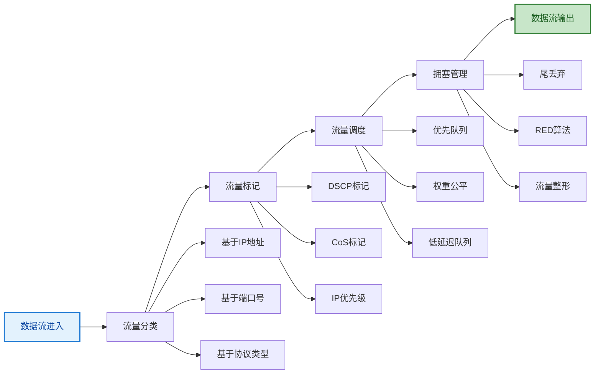

**优先级建议配置**：
```
语音流量(Voice):     CoS 5, DSCP EF(46)
视频流量(Video):     CoS 4, DSCP AF41(34)  
关键数据(Critical):  CoS 3, DSCP AF31(26)
普通数据(Best Effort): CoS 0, DSCP 0
```

### 6.6 网络性能监控

**关键性能指标(KPI)**：
1. **带宽利用率**：链路使用率不超过80%
2. **数据包丢失率**：小于0.1%
3. **网络延迟**：局域网内小于1ms
4. **设备CPU使用率**：小于70%
5. **错误包统计**：CRC、碰撞、过载错误

**监控工具配置**：
```bash
# SNMP监控配置
snmp-server community public ro
snmp-server host 192.168.1.100 public

# 流量镜像配置  
monitor session 1 source interface Gi0/1
monitor session 1 destination interface Gi0/24
```

---

## 7. 故障排除与网络维护

### 7.1 快速定位

**核心能力**：快速定位和解决网络故障，保证业务连续性

**主要技能**：
1. **系统化诊断**：分层次有序排查问题
2. **工具化分析**：熟练使用各种诊断工具
3. **预防性维护**：定期检查避免故障发生
4. **文档化管理**：记录问题和解决方案

### 7.2 故障排除基本方法

**故障排除的五个基本步骤**：

**1. 信息收集**
- 收集故障现象描述
- 了解故障发生时间和过程
- 记录网络基本配置信息
- 查看历史故障记录

**2. 基础连通性测试**
- 测试基本网络连通性
- 检查设备指示灯和状态
- 检查端口和线缆连接
- 初步判断故障层次

**3. 分层故障诊断**
- 物理层：检查线缆和端口状态
- 数据链路层：检查MAC和VLAN
- 网络层：检查IP和路由配置
- 逐步定位故障位置

**4. 故障修复实施**
- 确定具体故障原因
- 制定针对性解决方案
- 实施修复操作
- 验证修复效果

**5. 文档记录和预防**
- 记录故障处理过程
- 建立故障知识库
- 制定预防性维护计划
- 提供用户培训指导

### 7.3 系统化故障排除方法

> **分层排除法**：按照OSI模型从下到上逐层排查，确保问题全面定位。

**故障排除流程**：

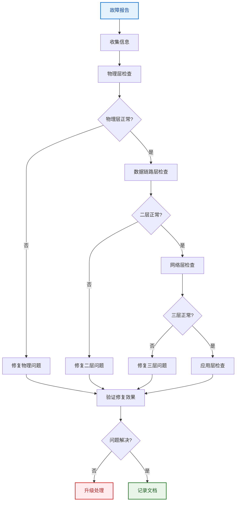

**各层排查要点**：

**物理层排查**：
```bash
# 检查物理连接
show interface status
show interface counters errors

# 关键检查项目：
- 线缆连接是否牢固
- 端口指示灯状态
- 双工模式匹配
- 速率协商结果
- 错误统计计数
```

**数据链路层排查**：
```bash
# 检查MAC地址表
show mac address-table

# 检查VLAN配置
show vlan brief
show interface switchport

# 检查STP状态
show spanning-tree

# 关键检查项目：
- MAC地址学习是否正常
- VLAN配置是否正确
- Trunk端口配置
- STP收敛状态
```

**网络层排查**：
```bash
# 检查IP配置
show ip interface brief
show ip route

# 连通性测试
ping 目标IP
traceroute 目标IP

# 关键检查项目：
- IP地址配置
- 子网掩码设置
- 默认网关配置
- 路由表信息
```
