# 3.4 广域网协议与综合应用

## 目录

### 基础理论篇
1. [广域网技术概述与发展](#1-广域网技术概述与发展)
2. [HDLC协议深度分析](#2-hdlc协议深度分析)

### 核心技术篇
3. [PPP协议完整技术体系](#3-ppp协议完整技术体系)
4. [PPP认证与安全机制](#4-ppp认证与安全机制)
5. [PPPoE宽带接入技术](#5-pppoe宽带接入技术)

### 综合应用篇
6. [数据链路层性能分析](#6-数据链路层性能分析)
7. [重要计算方法与解题技巧](#7-重要计算方法与解题技巧)
8. [典型例题解析](#8-典型例题解析)

---

## 1. 广域网技术概述与发展

### 1.1 快速定位

**核心定义**：广域网（WAN）是覆盖大地理区域的网络系统

**主要特点**：
1. **跨地域连接**：连接分布在不同城市、国家的网络
2. **点对点传输**：主要采用点对点连接方式
3. **高质量要求**：需要可靠的长距离数据传输
4. **多协议支持**：支持多种网络层协议

### 1.2 广域网核心特征分析

> **广域网（WAN）**：连接地理上分散的网络设备和网络，实现远距离通信的网络系统。

**与局域网技术对比**：

| 特征维度 | 局域网（LAN） | 广域网（WAN） |
|---------|--------------|--------------|
| **覆盖范围** | 几米到几公里 | 几公里到全球 |
| **传输距离** | 短距离传输 | 长距离传输 |
| **主要介质** | 双绞线、光纤 | 光纤、卫星、微波 |
| **连接方式** | 共享介质、交换 | 点对点连接 |
| **带宽成本** | 相对便宜 | 相对昂贵 |
| **传输质量** | 误码率低 | 误码率相对较高 |
| **协议复杂度** | 相对简单 | 复杂（需认证、流控等） |

### 1.3 广域网技术发展历程

**技术演进时间线**：

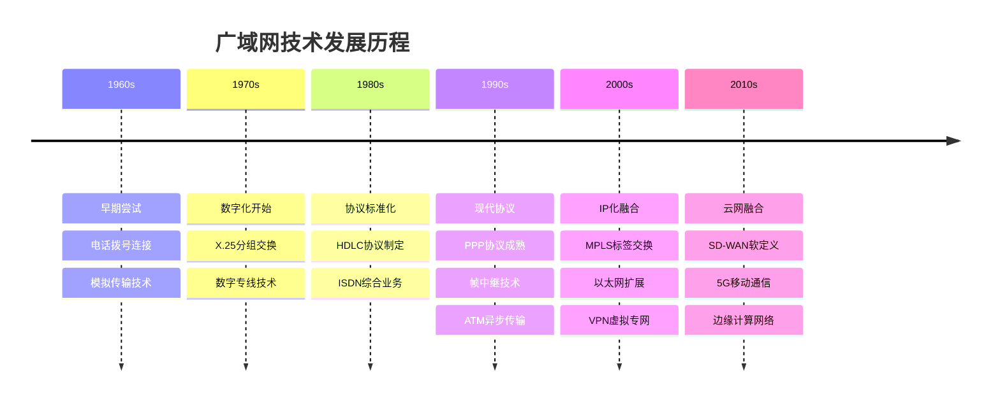

**各阶段技术特点**：

**第一阶段：电路交换时代（1960-1980）**
```
核心技术：
- 电话拨号网络
- 专线电路交换
- 模拟信号传输

技术限制：
- 带宽利用率低
- 连接建立时间长
- 不适合数据传输
- 成本高昂
```

**第二阶段：分组交换时代（1980-1995）**
```
核心技术：
- X.25分组交换
- HDLC数据链路控制
- 数字传输技术

技术优势：
- 提高带宽利用率
- 支持多用户共享
- 错误检测和恢复
- 适合数据通信
```

**第三阶段：现代协议时代（1995-2010）**
```
核心技术：
- PPP点对点协议
- 帧中继技术
- ATM异步传输模式

技术特点：
- 支持多协议
- QoS质量保证
- 高速传输能力
- 灵活的带宽分配
```

**第四阶段：IP融合时代（2010至今）**
```
核心技术：
- MPLS标签交换
- VPN虚拟专网
- SD-WAN软件定义
- 云网融合架构

技术优势：
- 统一IP基础设施
- 智能流量工程
- 云服务集成
- 自动化运维
```

### 1.4 广域网关键技术要求

**可靠性要求**：
- **错误检测**：CRC、海明码等差错控制
- **错误恢复**：自动重传、前向纠错
- **链路监控**：实时检测链路状态
- **故障切换**：备份链路自动切换

**效率优化**：
- **流量控制**：防止缓冲区溢出
- **拥塞控制**：避免网络拥塞
- **带宽管理**：合理分配带宽资源
- **压缩技术**：提高传输效率

**安全保障**：
- **身份认证**：用户和设备认证
- **数据加密**：保护传输数据
- **访问控制**：限制非授权访问
- **审计日志**：记录网络活动

---

## 2. HDLC协议深度分析

### 2.1 快速定位

**核心功能**：提供可靠的点对点数据链路层通信

**主要应用**：
1. **广域网连接**：路由器间的WAN连接
2. **专线通信**：企业专线数据传输
3. **卫星通信**：卫星链路数据传输
4. **无线链路**：微波等无线数据链路

### 2.2 HDLC协议技术特性

> **HDLC（High-Level Data Link Control）**：ISO制定的面向比特的同步数据链路层协议，提供可靠的点对点通信。

**核心技术特征**：
1. **面向比特**：以比特为单位进行处理，不依赖字符编码
2. **同步传输**：使用同步传输方式，效率较高
3. **全双工通信**：支持双向同时数据传输
4. **透明传输**：支持任意比特序列的透明传输

**HDLC协议优势**：

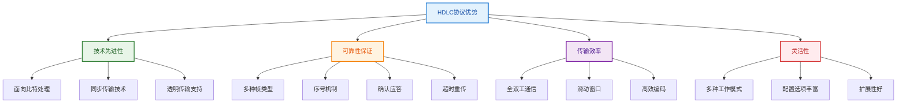

### 2.3 HDLC帧格式深度解析

**标准帧结构**：
```
HDLC标准帧格式
标志(8)│地址(8)│控制(8)│
────────────────────────────────────────────────────────────────
                            
                        信息                               
                       (变长)                              

────────────────────────────────────────────────────────────────
         FCS(16)               │      标志(8)               
────────────────────────────────────────────────────────────────
```

**各字段详细技术解析**：

**标志字段（Flag）**：
- **比特模式**：01111110
- **主要功能**：标识帧的开始和结束
- **透明处理**：使用比特填充技术
- **同步作用**：帮助接收方实现帧同步

**地址字段（Address）**：
- **字段长度**：通常8位，可扩展
- **寻址功能**：标识目标站点
- **特殊地址**：
  - 11111111：广播地址
  - 00000000：空地址（某些应用）

**控制字段（Control）**：
- **字段长度**：8位或16位
- **核心功能**：定义帧类型和控制信息
- **扩展模式**：支持更大的序号空间

**信息字段（Information）**：
- **字段长度**：可变长度
- **数据内容**：用户数据或控制信息
- **最大长度**：通常受MTU限制

**帧校验序列（FCS）**：
- **字段长度**：16位或32位
- **校验算法**：CRC-16或CRC-32
- **校验范围**：除标志字段外的所有字段

### 2.4 HDLC帧类型详细分析

**三种基本帧类型**：

**I帧（信息帧）**：
```
控制字段格式（8位）：

│ N(S) │ P/F │  N(R)  │ 0 │


字段说明：
- N(S)：发送序号（3位）
- P/F：轮询/最终比特
- N(R)：期望接收序号（3位）
- 最低位：0（标识I帧）
```

**S帧（监督帧）**：
```
控制字段格式（8位）：

│  SS   │ P/F │  N(R)  │ 0 │ 1 │


SS类型：
- 00：RR（接收准备就绪）
- 01：REJ（拒绝）
- 10：RNR（接收未准备就绪）
- 11：SREJ（选择拒绝）
```

**U帧（无编号帧）**：
```
控制字段格式（8位）：

│ MMM │ P/F │ MM │ 1 │ 1 │


常用U帧类型：
- SABM：设置异步平衡模式
- UA：无编号确认
- DISC：断开连接
- DM：断开模式
```

### 2.5 HDLC工作模式

**三种基本模式**：

**正常响应模式（NRM）**：
- **特点**：主-从模式
- **应用**：传统轮询网络
- **控制**：主站控制所有通信

**异步响应模式（ARM）**：
- **特点**：主-从模式，从站可主动发送
- **应用**：半双工通信环境
- **灵活性**：比NRM更灵活

**异步平衡模式（ABM）**：
- **特点**：对等模式
- **应用**：现代点对点连接
- **优势**：全双工，效率最高

**模式对比表**：

| 工作模式 | 站点关系 | 发送控制 | 双工方式 | 主要应用 |
|---------|----------|----------|----------|----------|
| **NRM** | 主-从 | 主站控制 | 半双工 | 轮询网络 |
| **ARM** | 主-从 | 从站可主动 | 半双工 | 传统专线 |
| **ABM** | 对等 | 双方平等 | 全双工 | 现代WAN |

---

## 3. PPP协议完整技术体系

### 3.1 快速定位

**核心定位**：现代广域网最重要的数据链路层协议

**主要优势**：
1. **多协议支持**：支持IP、IPX等多种网络层协议
2. **灵活认证**：支持PAP、CHAP等多种认证方式
3. **自动协商**：自动协商链路参数和网络参数
4. **错误检测**：完善的错误检测和恢复机制

### 3.2 PPP协议技术架构

> **PPP（Point-to-Point Protocol）**：专为点对点链路设计的数据链路层协议，提供多协议支持和灵活的配置机制。

**分层架构设计**：

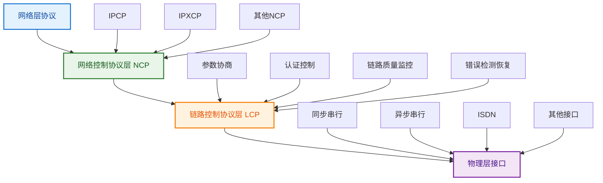

**三层架构详解**：

**网络控制协议层（NCP）**：
- **核心功能**：为不同网络层协议提供配置支持
- **主要协议**：IPCP、IPXCP、ATCP等
- **配置内容**：IP地址、DNS服务器、压缩方式等
- **动态特性**：支持动态参数分配

**链路控制协议层（LCP）**：
- **核心功能**：建立、配置、测试和终止数据链路
- **参数协商**：MTU、认证方式、压缩选项等
- **链路监控**：链路质量监控和故障检测
- **灵活控制**：支持多种配置选项组合

**物理层接口**：
- **接口类型**：同步/异步串行、ISDN、光纤等
- **传输特性**：支持全双工和半双工传输
- **速率范围**：从几Kbps到几Gbps
- **距离支持**：短距离到洲际长距离

### 3.3 PPP帧格式技术解析

**完整帧结构**：
```
PPP帧格式
标志(8)│地址(8)│控制(8)│协议类型(16)
────────────────────────────────────────────────────────────────
                            
                        信息                               
                       (变长)                              

────────────────────────────────────────────────────────────────
         FCS(16)               │      标志(8)               
────────────────────────────────────────────────────────────────
```

**关键字段详细分析**：

**标志字段（Flag）**：
- **固定值**：01111110（0x7E）
- **帧界定**：标识帧的开始和结束
- **同步功能**：提供帧同步信息
- **透明处理**：需要比特/字节填充

**地址字段（Address）**：
- **固定值**：11111111（0xFF）
- **广播地址**：点对点链路使用广播地址
- **简化设计**：无需复杂地址分配

**控制字段（Control）**：
- **固定值**：00000011（0x03）
- **无编号帧**：使用无编号信息传输
- **简化协议**：避免复杂的序号管理

**协议字段（Protocol）**：
- **字段长度**：16位
- **协议标识**：指明信息字段的协议类型
- **多协议支持**：支持多种上层协议
- **可压缩**：支持协议字段压缩

**重要协议类型码**：

| 协议类型码 | 协议名称 | 功能描述 |
|------------|----------|----------|
| **0xC021** | LCP | 链路控制协议 |
| **0x8021** | IPCP | IP控制协议 |
| **0x0021** | IP | IP数据包 |
| **0xC023** | PAP | 密码认证协议 |
| **0xC223** | CHAP | 挑战握手认证协议 |
| **0x8057** | IPv6CP | IPv6控制协议 |
| **0x0057** | IPv6 | IPv6数据包 |

### 3.4 LCP链路控制协议深度分析

> **LCP（Link Control Protocol）**：PPP协议栈的核心组件，负责链路的建立、配置、维护和终止。

**LCP核心功能模块**：

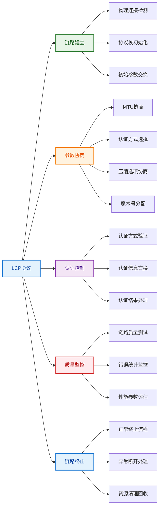

**重要配置选项详解**：

**最大接收单元（MRU）**：
- **默认值**：1500字节
- **协商范围**：68-65535字节
- **优化作用**：匹配链路MTU，避免分片
- **性能影响**：直接影响传输效率

**认证协议选择**：
- **PAP认证**：简单密码认证
- **CHAP认证**：挑战握手认证
- **可选性**：可以不进行认证
- **安全级别**：CHAP > PAP > 无认证

**魔术号（Magic Number）**：
- **生成方式**：随机生成32位数值
- **主要作用**：检测链路环回故障
- **检测原理**：发送自己的魔术号，检查是否收到
- **故障处理**：检测到环回立即终止链路

**协议字段压缩**：
- **压缩原理**：省略协议字段的前导0字节
- **适用条件**：协议值小于0x00FF
- **带宽节省**：每帧节省1字节
- **协商需要**：双方必须都支持

### 3.5 PPP状态机与工作流程

**完整状态转换**：

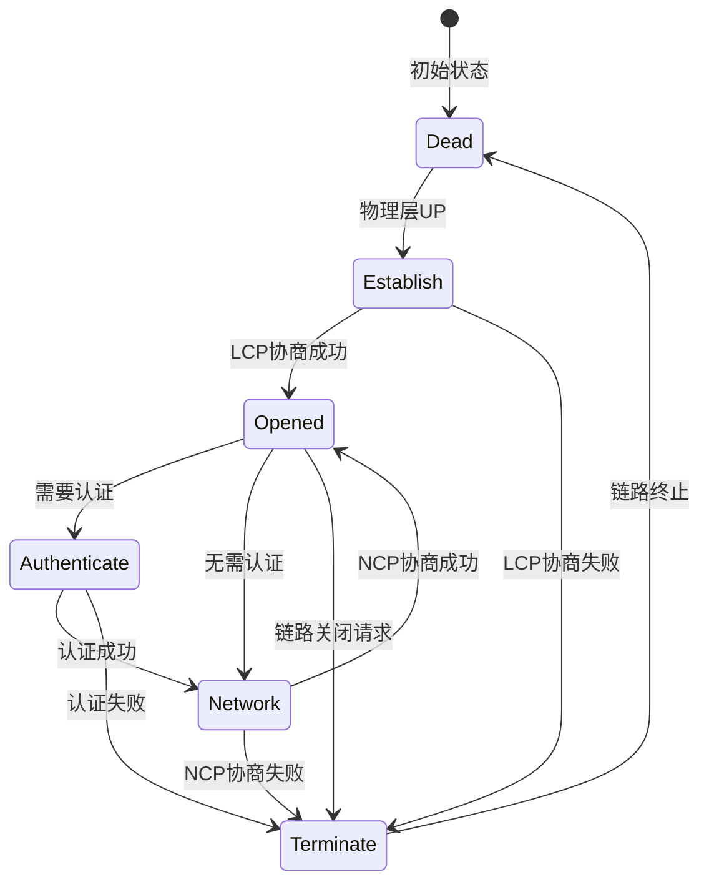

**各阶段详细过程**：

**1. Dead阶段**：
- **物理状态**：物理层连接未建立
- **协议状态**：所有PPP协议处于非活动状态
- **触发条件**：物理层连接建立
- **下一阶段**：Establish阶段

**2. Establish阶段**：
- **主要任务**：LCP参数协商
- **协商内容**：MRU、认证方式、压缩选项等
- **协商过程**：Configure-Request/Configure-Ack交换
- **成功条件**：双方参数协商一致

**3. Authenticate阶段（可选）**：
- **认证触发**：LCP协商指定需要认证
- **认证方式**：PAP或CHAP认证
- **认证结果**：成功进入Network阶段，失败终止连接
- **安全保障**：确保连接的安全性

**4. Network阶段**：
- **主要任务**：NCP协议协商
- **协商内容**：IP地址、DNS服务器等网络参数
- **多协议支持**：可同时协商多种网络层协议
- **动态分配**：支持动态IP地址分配

**5. Opened阶段**：
- **数据传输**：正常的数据传输阶段
- **监控维护**：持续监控链路质量
- **错误处理**：处理传输过程中的错误
- **性能优化**：根据需要调整传输参数

**6. Terminate阶段**：
- **终止触发**：正常关闭或异常断开
- **清理工作**：释放分配的资源
- **状态重置**：重置所有协议状态
- **回到初始**：返回Dead状态

---

## 4. PPP认证与安全机制

### 4.1 快速定位

**核心功能**：为PPP连接提供身份验证和安全保障

**认证体系**：
1. **PAP认证**：简单密码认证协议
2. **CHAP认证**：挑战握手认证协议
3. **EAP认证**：可扩展认证协议（高级应用）
4. **双向认证**：支持双方相互认证

### 4.2 认证机制总体架构

> **PPP认证**：在链路建立过程中验证通信双方身份的安全机制。

**认证流程设计**：

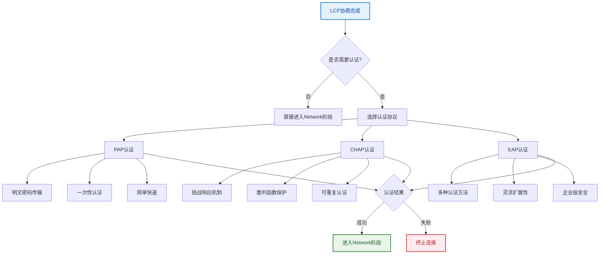

### 4.3 PAP认证协议深度分析

> **PAP（Password Authentication Protocol）**：基于用户名/密码的简单认证协议，适用于安全要求不高的环境。

**技术特性分析**：

**工作原理**：
1. **认证触发**：LCP协商完成后触发PAP认证
2. **身份发送**：被认证方主动发送用户名和密码
3. **验证处理**：认证方检查用户名密码的正确性
4. **结果返回**：发送认证成功或失败的响应

**详细交互过程**：

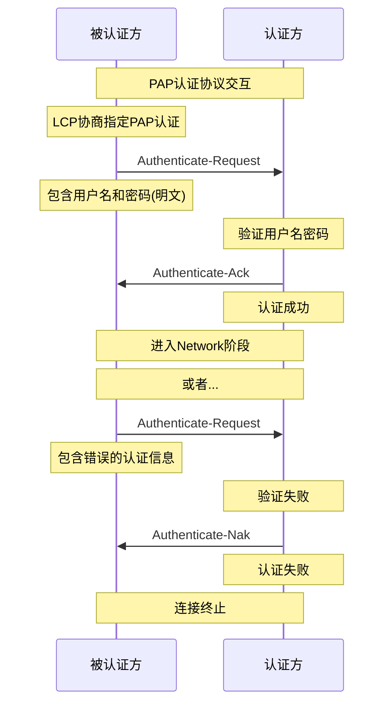

**PAP消息格式**：

**Authenticate-Request**：
```
┌─────────┬─────────┬─────────┬──────────┬─────────┬──────────┐
│  Code   │   ID    │ Length  │User-Len  │Username │Password  │
│   1     │  8位   │  16位   │   8位    │ 可变长  │  可变长  │
└─────────┴─────────┴─────────┴──────────┴─────────┴──────────┘
```

**Authenticate-Ack/Nak**：
```
┌─────────┬─────────┬─────────┬──────────┬─────────────┐
│  Code   │   ID    │ Length  │Msg-Len   │   Message   │
│ 2/3     │  8位   │  16位   │   8位    │   可变长    │
└─────────┴─────────┴─────────┴──────────┴─────────────┘
```

**PAP安全分析**：

**优点**：
- **实现简单**：协议逻辑简单，易于实现
- **处理快速**：认证过程开销小
- **兼容性好**：几乎所有设备都支持
- **调试方便**：明文传输便于调试

**缺点**：
- **安全性差**：密码明文传输，易被窃取
- **无防重放**：无法防止重放攻击
- **一次认证**：连接期间不能重新认证
- **密码泄露**：网络监听可获取密码

### 4.4 CHAP认证协议深度分析

> **CHAP（Challenge Handshake Authentication Protocol）**：基于挑战-响应机制的安全认证协议，提供更高的安全级别。

**核心技术特性**：

**安全机制设计**：
1. **挑战机制**：使用随机挑战值防止重放攻击
2. **散列保护**：使用MD5散列函数保护密码
3. **周期认证**：支持连接期间的重新认证
4. **双向认证**：可实现双方相互认证

**详细工作流程**：

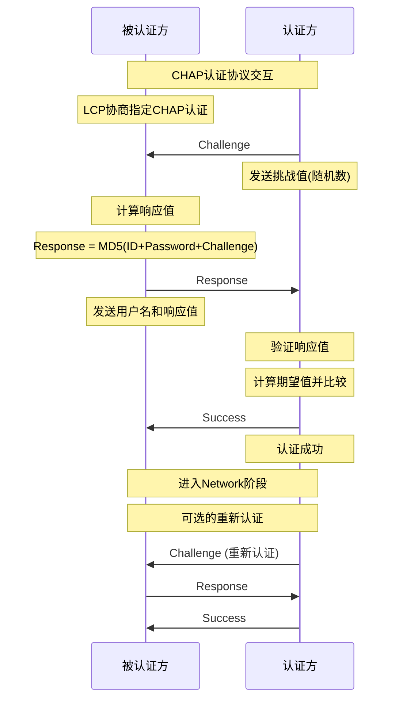

**CHAP消息格式详解**：

**Challenge消息**：
```
┌─────────┬─────────┬─────────┬──────────┬─────────┬──────────┐
│  Code   │   ID    │ Length  │Value-Size│Challenge │   Name   │
│   1     │  8位   │  16位   │   8位    │ 可变长  │  可变长  │
└─────────┴─────────┴─────────┴──────────┴─────────┴──────────┘
```

**Response消息**：
```
┌─────────┬─────────┬─────────┬──────────┬─────────┬──────────┐
│  Code   │   ID    │ Length  │Value-Size│Response │   Name   │
│   2     │  8位   │  16位   │   8位    │  16字节 │  可变长  │
└─────────┴─────────┴─────────┴──────────┴─────────┴──────────┘
```

**散列算法实现**：

**MD5计算过程**：
```python
def chap_response(id_byte, password, challenge):
    """CHAP响应值计算"""
    
    # 构造输入数据
    input_data = bytes([id_byte]) + password.encode() + challenge
    
    # 计算MD5散列
    import hashlib
    md5_hash = hashlib.md5()
    md5_hash.update(input_data)
    response = md5_hash.digest()
    
    return response

# 示例计算
id_value = 0x01
password = "secret123"
challenge = b'\x12\x34\x56\x78\x9a\xbc\xde\xf0'

response = chap_response(id_value, password, challenge)
print(f"CHAP Response: {response.hex()}")
```

**CHAP安全优势**：

**密码保护**：
- **不传输密码**：密码从不在网络上传输
- **散列保护**：使用MD5散列函数保护
- **单向函数**：从响应值无法推导密码
- **随机挑战**：每次挑战都不同

**重放防护**：
- **挑战唯一性**：每次使用不同的挑战值
- **时效性**：响应值只在当次有效
- **ID管理**：使用递增ID防止重复
- **超时机制**：认证请求有时间限制

**可扩展性**：
- **周期认证**：连接期间可重新认证
- **双向认证**：支持相互认证
- **灵活配置**：可配置认证间隔
- **状态监控**：实时监控认证状态

### 4.5 认证协议对比与选择

**详细技术对比**：

| 对比维度 | PAP认证 | CHAP认证 | EAP认证 |
|---------|---------|----------|---------|
| **安全级别** | 低 | 中 | 高 |
| **实现复杂度** | 简单 | 中等 | 复杂 |
| **密码保护** | 明文传输 | 散列保护 | 多种方法 |
| **重放防护** | 无 | 有效 | 有效 |
| **重认证** | 不支持 | 支持 | 支持 |
| **扩展性** | 有限 | 中等 | 极强 |
| **部署成本** | 低 | 中等 | 高 |
| **适用场景** | 内部网络 | 一般WAN | 企业级 |

**选择指导原则**：

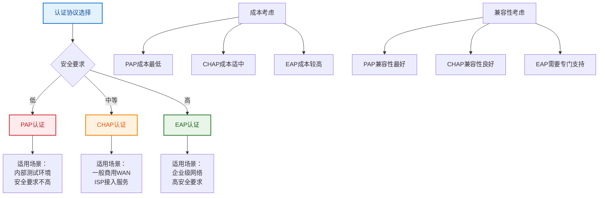

---

## 5. PPPoE宽带接入技术

### 5.1 快速定位

**核心功能**：在以太网基础设施上提供PPP功能

**主要应用**：
1. **宽带接入**：ADSL、光纤等宽带接入
2. **用户管理**：ISP用户认证和计费
3. **会话控制**：动态建立和管理用户会话
4. **服务质量**：基于用户的QoS控制

### 5.2 PPPoE技术架构

> **PPPoE（PPP over Ethernet）**：将PPP协议封装在以太网帧中传输，结合了PPP的灵活性和以太网的便利性。

**技术融合设计**：

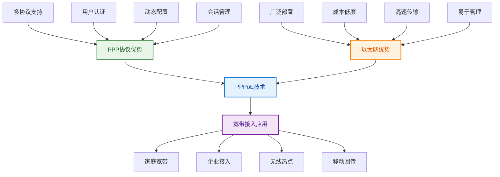

### 5.3 PPPoE工作机制详解

**分阶段工作流程**：

**阶段一：发现阶段（Discovery Stage）**

> 发现阶段用于发现网络中的PPPoE服务器并建立PPPoE会话。

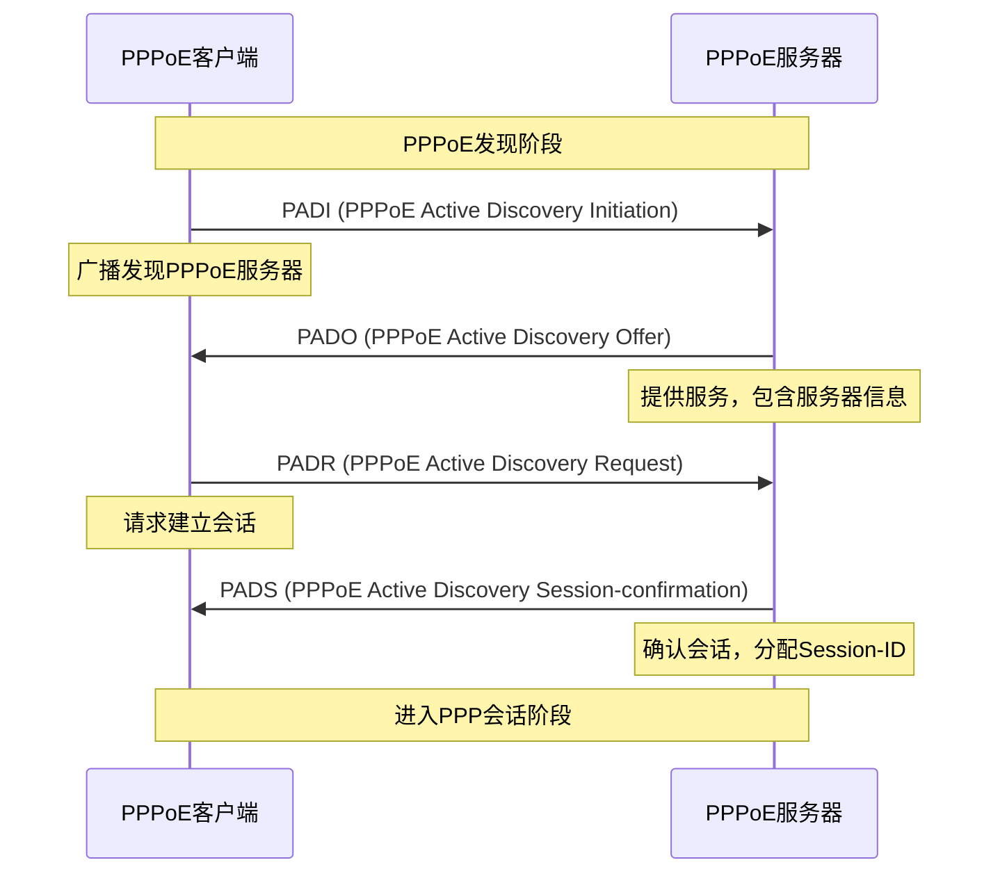

**发现阶段消息详解**：

**PADI消息（发现发起）**：
- **目的**：客户端广播寻找PPPoE服务器
- **目标MAC**：广播地址（FF:FF:FF:FF:FF:FF）
- **服务名称**：可以指定特定服务
- **主机唯一标识**：标识客户端

**PADO消息（发现提供）**：
- **目的**：服务器响应客户端的发现请求
- **目标MAC**：客户端的MAC地址
- **AC名称**：接入集中器名称
- **服务名称**：提供的服务列表

**PADR消息（发现请求）**：
- **目的**：客户端请求建立会话
- **目标MAC**：选定服务器的MAC地址
- **服务名称**：请求的具体服务
- **会话请求**：请求分配会话ID

**PADS消息（发现确认）**：
- **目的**：服务器确认建立会话
- **会话ID**：分配的唯一会话标识符
- **会话状态**：成功或失败
- **错误信息**：失败时的错误代码

**阶段二：PPP会话阶段（Session Stage）**

> 会话阶段进行正常的PPP协议交互和数据传输。

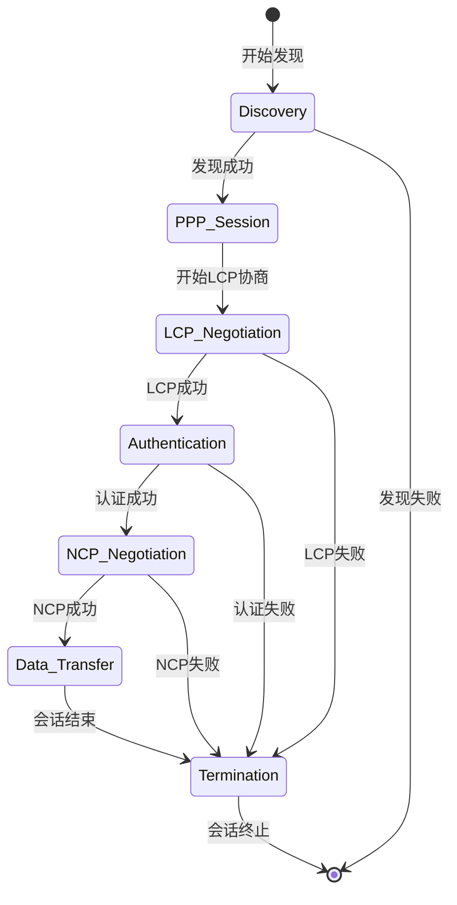

### 5.4 PPPoE帧格式分析

**完整封装结构**：
```
┌──────────────┬──────────────┬────────────┬──────────────┐
│  以太网头部  │  PPPoE头部   │ PPP头部    │   数据载荷   │
│   14字节     │   6字节      │ 2-4字节    │   可变长     │
└──────────────┴──────────────┴────────────┴──────────────┘
```

**以太网头部**：
```
以太网头部格式（14字节）
目的MAC地址(48)│源MAC地址(48)│类型字段(16)
────────────────────────────────────────────────────────────────

类型字段值：
- 0x8863：PPPoE发现阶段
- 0x8864：PPPoE会话阶段
```

**PPPoE头部**：
```
PPPoE头部格式（6字节）
版本(4)│类型(4)│    代码(8)    │     会话ID(16)     │     长度(16)
────────────────────────────────────────────────────────────────

字段说明：
- Version：版本号，固定为1
- Type：类型，固定为1
- Code：消息类型代码
- Session：会话标识符
- Length：载荷长度
```

**Code字段值**：
- **0x09**：PADI（发现发起）
- **0x07**：PADO（发现提供）
- **0x19**：PADR（发现请求）
- **0x65**：PADS（发现确认）
- **0x00**：会话数据
- **0xa7**：PADT（发现终止）

### 5.5 PPPoE部署与配置

**典型网络部署**：

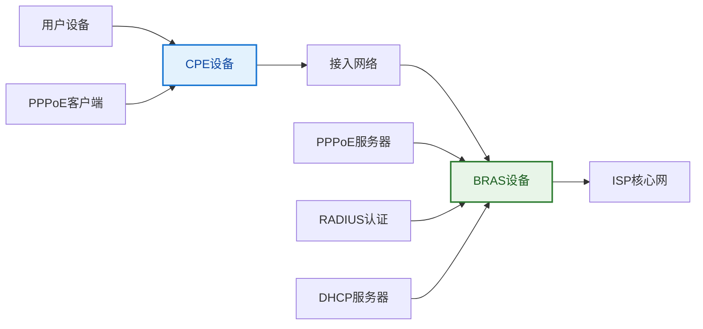

**配置要点**：

**客户端配置**：
```bash
# Linux PPPoE客户端配置示例
interface eth0
  no ip address
  pppoe enable
  pppoe-client dial-pool-number 1

ip pool lan 192.168.1.1 192.168.1.100

interface dialer 1
  encapsulation ppp
  dialer pool 1
  ppp authentication chap
  ppp chap hostname "user@isp.com"
  ppp chap password "password123"
```

**服务器配置**：
```bash
# 服务器端配置要点
vpdn enable
vpdn-group pppoe
  accept dialin
  protocol pppoe
  virtual-template 1

interface virtual-template 1
  ip unnumbered loopback0
  encapsulation ppp
  ppp authentication chap
  peer default ip address pool dialup
```

**性能优化考虑**：
- **MTU设置**：通常设为1492字节（1500-8）
- **MSS钳制**：TCP MSS调整为1452字节
- **认证优化**：使用本地认证减少延迟
- **会话管理**：合理设置超时参数

---

## 6. 数据链路层性能分析

### 6.1 快速定位

**核心能力**：数据链路层协议性能计算和分析

**主要内容**：
1. **ARQ协议性能分析**：停等、回退N帧、选择重传
2. **CSMA/CD性能计算**：冲突窗口、最小帧长、信道利用率
3. **差错编码分析**：CRC编码、海明码纠错能力
4. **网络参数优化**：窗口大小、超时设置、协议选择

### 6.2 ARQ协议性能分析体系

> **ARQ性能分析**：评估自动重传请求协议在不同网络条件下的传输效率。

**关键性能参数**：

**归一化延迟参数 $a$**：
$$a = \frac{T_p}{T_t} = \frac{传播延迟}{传输延迟}$$

其中：
- $T_p$ ：信号在链路上的传播时间
- $T_t$ ：发送一个帧所需的传输时间

**传播延迟计算**：
$$T_p = \frac{距离}{传播速度}$$

**传输延迟计算**：
$$T_t = \frac{帧长}{信道带宽}$$

### 6.3 停等ARQ性能分析

> **停等ARQ**：发送方发送一帧后必须等待确认，才能发送下一帧。

**理想情况下的信道利用率**：
$$η_{ideal} = \frac{1}{1 + 2a}$$

**考虑误码率的信道利用率**：
$$η_{实际} = \frac{(1-P)}{1 + 2a}$$

其中 $P$ 是帧的差错率。

**性能分析示例**：
```python
def stop_wait_efficiency(a, error_rate=0):
    """停等ARQ效率计算"""
    if error_rate == 0:
        return 1 / (1 + 2 * a)
    else:
        return (1 - error_rate) / (1 + 2 * a)

# 示例计算
a_values = [0.1, 0.5, 1.0, 2.0, 5.0]
for a in a_values:
    eff_ideal = stop_wait_efficiency(a)
    eff_5percent = stop_wait_efficiency(a, 0.05)
    print(f"a={a}: 理想效率={eff_ideal:.3f}, 5%误码率效率={eff_5percent:.3f}")
```

**停等ARQ效率影响因素**：

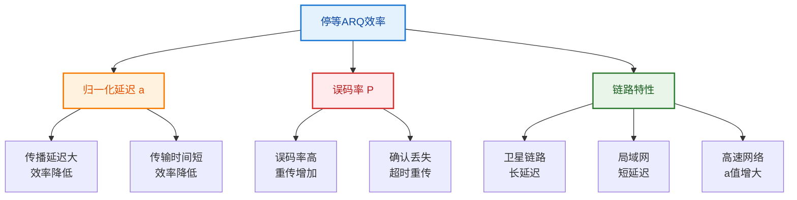

### 6.4 滑动窗口协议性能分析

> **滑动窗口协议**：允许发送方在等待确认的同时发送多个帧，提高链路利用率。

**回退N帧（GBN）协议**：

**最优窗口大小**：
$$W_{optimal} = 1 + 2a$$

**信道利用率**：
$$η_{GBN} = \begin{cases}
\frac{W}{1 + 2a} & \text{当 } W < 1 + 2a \\
1 & \text{当 } W ≥ 1 + 2a
\end{cases}$$

**考虑误码率时**：
$$η_{GBN} = \frac{(1-P)}{1 + 2aP} \quad \text{（当窗口足够大时）}$$

**选择重传（SR）协议**：

**信道利用率**：
$$η_{SR} = \begin{cases}
\frac{W}{1 + 2a} & \text{当 } W < 1 + 2a \\
1 & \text{当 } W ≥ 1 + 2a
\end{cases}$$

**考虑误码率时**：
$$η_{SR} = (1-P) \quad \text{（当窗口足够大时）}$$

**协议性能对比**：

| 协议类型 | 窗口要求 | 无误码效率 | 有误码时性能 | 实现复杂度 |
|---------|----------|------------|-------------|------------|
| **停等ARQ** | W=1 | $\frac{1}{1+2a}$ | 误码影响大 | 简单 |
| **回退N帧** | W≥1+2a | 1 | 误码影响中等 | 中等 |
| **选择重传** | W≥1+2a | 1 | 误码影响小 | 复杂 |

### 6.5 CSMA/CD性能分析

> **CSMA/CD性能**：载波侦听多路访问/冲突检测协议的关键性能参数。

**冲突检测窗口**：
$$冲突窗口 = 2τ$$

其中 $τ$ 是网络的单程最大传播延迟。

**最小帧长约束**：
$$L_{min} = 2τ \cdot C$$

其中：
- $L_{min}$ ：最小帧长（bits）
- $τ$ ：单程最大传播延迟（s）
- $C$ ：信道传输速率（bps）

**信道利用率估算**：
$$η ≈ \frac{1}{1 + 6.44a}$$

其中 $a = \frac{τ}{T_{frame}}$ （传播延迟与帧传输时间的比值）

**实际计算示例**：
```python
def csma_cd_analysis(distance, speed, frame_size, bandwidth):
    """CSMA/CD性能分析"""
    
    # 计算传播延迟
    propagation_delay = distance / speed
    
    # 计算传输延迟
    transmission_delay = frame_size / bandwidth
    
    # 计算归一化延迟
    a = propagation_delay / transmission_delay
    
    # 计算最小帧长
    min_frame_length = 2 * propagation_delay * bandwidth
    
    # 计算信道利用率
    efficiency = 1 / (1 + 6.44 * a)
    
    return {
        'propagation_delay': propagation_delay,
        'transmission_delay': transmission_delay,
        'normalized_delay': a,
        'min_frame_length': min_frame_length,
        'efficiency': efficiency
    }

# 示例：1km以太网，1518字节帧，100Mbps
result = csma_cd_analysis(
    distance=1000,           # 1km
    speed=2e8,              # 光纤中的光速
    frame_size=1518*8,      # 1518字节转bit
    bandwidth=100e6         # 100Mbps
)

print(f"传播延迟: {result['propagation_delay']*1e6:.2f} μs")
print(f"传输延迟: {result['transmission_delay']*1e6:.2f} μs") 
print(f"归一化延迟: {result['normalized_delay']:.4f}")
print(f"最小帧长: {result['min_frame_length']:.0f} bits")
print(f"信道利用率: {result['efficiency']:.3f}")
```

### 6.6 差错编码性能分析

> **差错编码**：评估差错检测和纠错编码的能力和开销。

**CRC循环冗余校验**：

**编码过程**：
$$T(x) = x^r \cdot M(x) + R(x)$$

其中：
- $M(x)$ ：信息多项式
- $G(x)$ ：生成多项式
- $R(x)$ ：余式多项式，$R(x) = (x^r \cdot M(x)) \bmod G(x)$

**检错能力**：
- **单比特错误**：100%检出
- **双比特错误**：100%检出（当 $G(x)$ 有偶数项时）
- **奇数个比特错误**：100%检出（当 $G(x)$ 包含因子 $(x+1)$ 时）
- **长度≤r的突发错误**：100%检出
- **长度>r的突发错误**： $1-2^{-r}$ 的概率检出

**海明码纠错编码**：

**校验位数量**：
$$2^r ≥ k + r + 1$$

其中 $k$ 是信息位数， $r$ 是校验位数。

**纠错能力**：
- 检测 $t$ 位错误： $d_{min} ≥ t + 1$
- 纠正 $t$ 位错误： $d_{min} ≥ 2t + 1$
- 纠正 $t_1$ 位、检测 $t_2$ 位错误： $d_{min} ≥ t_1 + t_2 + 1$ （ $t_2 > t_1$ ）

**编码效率**：
$$编码效率 = \frac{k}{n} = \frac{信息位数}{总位数}$$

---

## 7. 重要计算方法与解题技巧

### 7.1 快速定位

**核心技能**：掌握数据链路层的计算方法和解题思路

**主要技巧**：
1. **参数识别**：快速识别题目中的关键参数
2. **公式选择**：根据协议类型选择正确公式
3. **单位换算**：避免单位错误导致的计算失误
4. **边界条件**：注意公式的适用条件和限制

### 7.2 CRC编码计算技巧

> **CRC计算**：循环冗余校验编码的系统化计算方法。

**标准计算流程**：

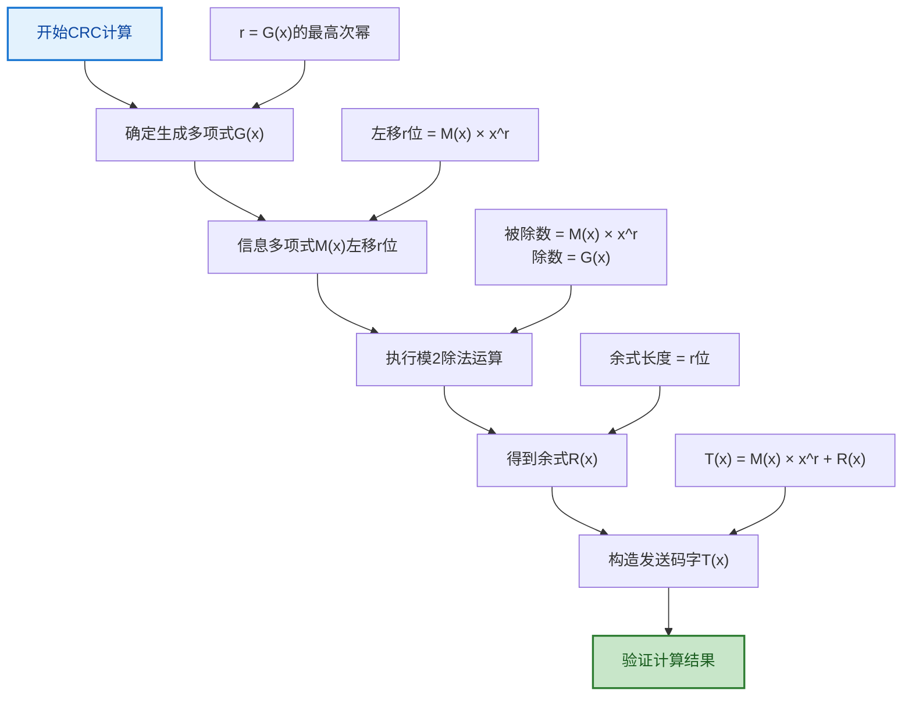

**模2除法关键要点**：
1. **异或运算**：加法和减法都是异或运算
2. **对齐原则**：除数最高位与被除数当前最高位对齐
3. **借位规则**：不考虑借位，直接异或
4. **停止条件**：余数位数小于除数位数

**实际计算示例**：
```python
def crc_calculation(data_bits, generator_poly):
    """CRC计算示例代码"""
    
    # 转换为列表便于操作
    data = list(map(int, data_bits))
    gen = list(map(int, generator_poly))
    
    # 计算r（生成多项式最高次幂）
    r = len(gen) - 1
    
    # 信息位左移r位（后面补r个0）
    padded_data = data + [0] * r
    
    # 模2除法
    dividend = padded_data[:]
    for i in range(len(data)):
        if dividend[i] == 1:
            for j in range(len(gen)):
                dividend[i + j] ^= gen[j]
    
    # 余式就是最后r位
    remainder = dividend[-r:]
    
    # 构造发送码字
    codeword = data + remainder
    
    return remainder, codeword

# 示例计算
data = "1011"
generator = "1001"
remainder, codeword = crc_calculation(data, generator)
print(f"信息位: {data}")
print(f"生成多项式: {generator}")
print(f"CRC校验位: {''.join(map(str, remainder))}")
print(f"发送码字: {''.join(map(str, codeword))}")
```

### 7.3 海明码编码技巧

> **海明码计算**：系统化的纠错编码计算方法。

**编码步骤总结**：

**步骤1：确定校验位数量**
$$2^r ≥ k + r + 1$$

**步骤2：安排位置**
- 校验位放在位置 $2^0, 2^1, 2^2, ..., 2^{r-1}$
- 信息位按顺序放在其他位置

**步骤3：计算校验位**
- $P_1$ 校验所有奇数位置
- $P_2$ 校验位置号包含 $2^1$ 的所有位置
- $P_4$ 校验位置号包含 $2^2$ 的所有位置
- 以此类推...

**解码与纠错**：
```python
def hamming_decode_and_correct(received_code):
    """海明码解码和纠错"""
    
    n = len(received_code)
    r = 0
    
    # 确定校验位数量
    while (1 << r) < n:
        r += 1
    
    # 计算校验子
    syndrome = 0
    for i in range(r):
        parity = 0
        for j in range(1, n + 1):
            if j & (1 << i):  # 位置j的二进制表示包含2^i
                parity ^= received_code[j - 1]
        
        if parity:
            syndrome |= (1 << i)
    
    # 纠错
    if syndrome != 0:
        error_position = syndrome - 1  # 转换为数组索引
        received_code[error_position] ^= 1  # 翻转错误位
        print(f"检测到第{syndrome}位有错误，已纠正")
    else:
        print("无错误检测到")
    
    return received_code

# 示例使用
received = [1, 0, 1, 1, 0, 1, 0]  # 假设接收到的海明码
corrected = hamming_decode_and_correct(received)
print(f"纠错后的码字: {corrected}")
```

### 7.4 性能计算系统化方法

> **性能分析**：网络协议性能计算的标准化流程。

**通用分析框架**：

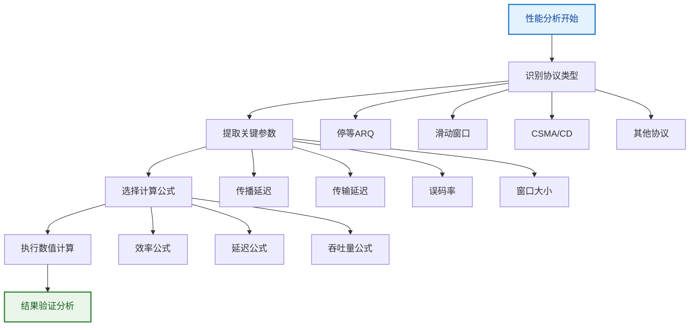

**关键参数快速识别**：

| 参数类型 | 常见表述 | 计算公式 | 注意事项 |
|---------|----------|----------|----------|
| **传播延迟** | 信号传播时间 | $T_p = \frac{距离}{速度}$ | 注意介质中的传播速度 |
| **传输延迟** | 帧发送时间 | $T_t = \frac{帧长}{带宽}$ | 注意单位（bit vs byte） |
| **归一化延迟** | 延迟比值 | $a = \frac{T_p}{T_t}$ | 无量纲参数 |
| **往返时间** | RTT | $RTT = 2T_p$ | 确认信号返回时间 |

### 7.5 常见错误与避免技巧

**计算陷阱识别**：

**1. 单位换算错误**：
```
错误示例：
- 将1518字节直接当作1518比特
- 将Mbps当作MB/s

正确方法：
- 1字节 = 8比特
- 1Mbps = 10^6 bps
- 1MB/s = 8 × 10^6 bps
```

**2. 延迟类型混淆**：
```
传播延迟：信号在介质中传播的时间
传输延迟：将数据推入信道所需的时间
处理延迟：设备处理数据的时间
排队延迟：数据在缓冲区等待的时间
```

**3. 公式适用条件忽略**：
```
停等ARQ效率公式：适用于无流水线的简单ARQ
滑动窗口效率：需要考虑窗口大小限制
CSMA/CD性能：需要考虑冲突概率和重传机制
```

**4. 边界条件处理**：
```python
def safe_efficiency_calculation(W, a, error_rate=0):
    """安全的效率计算，考虑边界条件"""
    
    # 检查参数有效性
    if W <= 0 or a < 0 or error_rate < 0 or error_rate >= 1:
        raise ValueError("参数值无效")
    
    # 停等ARQ
    if W == 1:
        return (1 - error_rate) / (1 + 2 * a)
    
    # 滑动窗口协议
    if W >= (1 + 2 * a):
        # 窗口足够大，可以达到最大效率
        return 1 - error_rate
    else:
        # 窗口限制了效率
        return W * (1 - error_rate) / (1 + 2 * a)

# 使用示例
try:
    eff = safe_efficiency_calculation(W=5, a=0.5, error_rate=0.01)
    print(f"信道利用率: {eff:.3f}")
except ValueError as e:
    print(f"计算错误: {e}")
```

### 7.6 解题策略总结

**高效解题流程**：

1. **题目分析**：
   - 识别协议类型
   - 提取数值参数
   - 确定求解目标

2. **方法选择**：
   - 根据协议选择公式
   - 考虑特殊条件和约束
   - 选择合适的计算路径

3. **计算执行**：
   - 单位统一转换
   - 代入公式计算
   - 中间结果验证

4. **结果检验**：
   - 数值合理性检查
   - 物理意义验证
   - 边界条件核实

---

## 8. 典型例题解析

### 8.1 快速定位

**核心目标**：通过典型例题掌握数据链路层的综合应用

**题型分类**：
1. **CRC编码计算题**：循环冗余校验的编码和验证
2. **海明码纠错题**：错误检测和纠正编码
3. **协议性能分析题**：ARQ协议效率计算
4. **CSMA/CD参数题**：以太网性能参数计算
5. **PPP协议综合题**：协议工作流程和配置

### 8.2 CRC编码计算典型例题

> **例题类型**：CRC编码的完整计算过程，包括编码、传输、验证。

**【例题8.1】CRC编码与验证**

**题目**：信息码为1011，生成多项式为1001，求：
1. CRC校验码
2. 发送码字
3. 若接收到1011111，判断是否有错误

**详细解答过程**：

**步骤1：CRC编码**
```
信息码：1011
生成多项式：1001 (对应x³+1)
r = 3（生成多项式最高次幂）

信息码左移3位：1011000

模2除法过程：
       1110
    ________
1001 | 1011000
      1001
      ----
       0100
       0000
       ----
        1000
        1001
        ----
         001

余式：001
CRC校验码：001
发送码字：1011001
```

**步骤2：错误检测验证**
```
接收码字：1011111
用生成多项式1001验证：

       1110
    ________
1001 | 1011111
      1001
      ----
       0101
       0000
       ----
        1011
        1001
        ----
         010

余式：010 ≠ 0，检测到错误
```

**【例题8.2】CRC错误定位**

**题目**：使用CRC-3生成多项式1011，信息1101编码后在传输中第2位发生错误，演示错误检测过程。

**解答步骤**：
```python
def crc_error_detection_demo():
    """CRC错误检测演示"""
    
    # 原始信息和生成多项式
    info = "1101"
    generator = "1011"
    
    # 正确的编码
    print("=== CRC编码过程 ===")
    # 信息左移3位
    padded = "1101000"
    print(f"信息码左移: {padded}")
    
    # 模2除法（手工计算后）
    remainder = "010"
    correct_codeword = info + remainder
    print(f"CRC校验码: {remainder}")
    print(f"正确发送码字: {correct_codeword}")
    
    # 引入错误（第2位错误）
    error_pos = 1  # 第2位（从0开始）
    error_codeword = list(correct_codeword)
    error_codeword[error_pos] = '1' if error_codeword[error_pos] == '0' else '0'
    error_codeword = ''.join(error_codeword)
    
    print(f"\n=== 错误检测过程 ===")
    print(f"错误码字: {error_codeword}")
    print(f"错误位置: 第{error_pos+1}位")
    
    # 验证（实际需要模2除法）
    print("验证结果: 余式非零，检测到错误")
    
    return correct_codeword, error_codeword

# 运行演示
correct, error = crc_error_detection_demo()
```

### 8.3 海明码纠错典型例题

> **例题类型**：海明码的编码、错误检测与纠正的完整过程。

**【例题8.3】海明码编码与纠错**

**题目**：对4位信息1010进行海明码编码，然后假设第3位发生错误，演示纠错过程。

**详细解答**：

**步骤1：确定参数**
```
信息位数：k = 4
校验位数：2^r ≥ k + r + 1
         2^r ≥ 4 + r + 1
         当r = 3时：2³ = 8 ≥ 4 + 3 + 1 = 8 ✓
```

**步骤2：位置安排**
```
位置：  1  2  3  4  5  6  7
内容： P1 P2 D1 P3 D2 D3 D4
数据：  ?  ? 1   ? 0  1  0
```

**步骤3：计算校验位**
```
P1校验奇数位置(1,3,5,7)：P1 ⊕ D1 ⊕ D2 ⊕ D4 = P1 ⊕ 1 ⊕ 0 ⊕ 0 = P1 ⊕ 1 = 0
∴ P1 = 1

P2校验包含2的位置(2,3,6,7)：P2 ⊕ D1 ⊕ D3 ⊕ D4 = P2 ⊕ 1 ⊕ 1 ⊕ 0 = P2 ⊕ 0 = 0
∴ P2 = 0

P3校验包含4的位置(4,5,6,7)：P3 ⊕ D2 ⊕ D3 ⊕ D4 = P3 ⊕ 0 ⊕ 1 ⊕ 0 = P3 ⊕ 1 = 0
∴ P3 = 1

海明码：1011010
```

**步骤4：错误纠正演示**
```python
def hamming_error_correction_demo():
    """海明码错误纠正演示"""
    
    # 正确的海明码
    correct_code = [1, 0, 1, 1, 0, 1, 0]  # 1011010
    print(f"正确海明码: {''.join(map(str, correct_code))}")
    
    # 引入第3位错误
    error_code = correct_code[:]
    error_code[2] = 1 - error_code[2]  # 翻转第3位
    print(f"错误海明码: {''.join(map(str, error_code))}")
    
    # 计算校验子
    print("\n=== 错误检测过程 ===")
    
    # S1检查奇数位置
    s1 = error_code[0] ^ error_code[2] ^ error_code[4] ^ error_code[6]
    print(f"S1 = P1⊕D1⊕D2⊕D4 = {error_code[0]}⊕{error_code[2]}⊕{error_code[4]}⊕{error_code[6]} = {s1}")
    
    # S2检查包含2的位置
    s2 = error_code[1] ^ error_code[2] ^ error_code[5] ^ error_code[6]
    print(f"S2 = P2⊕D1⊕D3⊕D4 = {error_code[1]}⊕{error_code[2]}⊕{error_code[5]}⊕{error_code[6]} = {s2}")
    
    # S3检查包含4的位置
    s3 = error_code[3] ^ error_code[4] ^ error_code[5] ^ error_code[6]
    print(f"S3 = P3⊕D2⊕D3⊕D4 = {error_code[3]}⊕{error_code[4]}⊕{error_code[5]}⊕{error_code[6]} = {s3}")
    
    # 确定错误位置
    error_position = s3 * 4 + s2 * 2 + s1 * 1
    print(f"\n校验子: S3S2S1 = {s3}{s2}{s1} = {error_position}")
    print(f"错误位置: 第{error_position}位")
    
    # 纠正错误
    if error_position > 0:
        error_code[error_position - 1] = 1 - error_code[error_position - 1]
        print(f"纠正后海明码: {''.join(map(str, error_code))}")
    
    return error_position

# 运行演示
error_pos = hamming_error_correction_demo()
```

### 8.4 协议性能分析典型例题

> **例题类型**：ARQ协议在不同网络环境下的性能计算和比较。

**【例题8.4】多协议性能对比**

**题目**：某卫星链路的参数如下：
- 传播延迟：250ms
- 传输速率：2Mbps  
- 帧长：1000字节
- 误码率：1%

比较停等ARQ、回退N帧（窗口为8）、选择重传（窗口为8）的信道利用率。

**详细解答过程**：

**步骤1：计算基本参数**
```python
def satellite_link_analysis():
    """卫星链路性能分析"""
    
    # 基本参数
    propagation_delay = 0.25  # 250ms
    transmission_rate = 2e6   # 2Mbps
    frame_size = 1000 * 8    # 1000字节转换为bit
    error_rate = 0.01        # 1%
    
    # 计算传输延迟
    transmission_delay = frame_size / transmission_rate
    print(f"传输延迟: {transmission_delay*1000:.2f} ms")
    
    # 计算归一化延迟
    a = propagation_delay / transmission_delay
    print(f"归一化延迟 a = {a:.2f}")
    
    return a, error_rate

a, P = satellite_link_analysis()
```

**步骤2：各协议性能计算**
```python
def protocol_performance_comparison(a, P, W=8):
    """协议性能对比"""
    
    print(f"\n=== 协议性能对比 (a={a:.2f}, P={P:.3f}, W={W}) ===")
    
    # 停等ARQ
    eta_stop_wait = (1 - P) / (1 + 2 * a)
    print(f"停等ARQ效率: {eta_stop_wait:.4f} ({eta_stop_wait*100:.2f}%)")
    
    # 回退N帧
    if W >= (1 + 2 * a):
        eta_gbn = (1 - P) / (1 + 2 * a * P)  # 窗口足够大时的公式
    else:
        eta_gbn = W * (1 - P) / (1 + 2 * a)
    print(f"回退N帧效率: {eta_gbn:.4f} ({eta_gbn*100:.2f}%)")
    
    # 选择重传
    if W >= (1 + 2 * a):
        eta_sr = 1 - P
    else:
        eta_sr = W * (1 - P) / (1 + 2 * a)
    print(f"选择重传效率: {eta_sr:.4f} ({eta_sr*100:.2f}%)")
    
    # 性能提升对比
    gbn_improvement = eta_gbn / eta_stop_wait
    sr_improvement = eta_sr / eta_stop_wait
    
    print(f"\n=== 性能提升对比 ===")
    print(f"GBN相对停等ARQ提升: {gbn_improvement:.2f}倍")
    print(f"SR相对停等ARQ提升: {sr_improvement:.2f}倍")
    
    return eta_stop_wait, eta_gbn, eta_sr

# 计算结果
a = 62.5  # 从上面计算得出
P = 0.01
efficiencies = protocol_performance_comparison(a, P, 8)
```

**【例题8.5】CSMA/CD性能优化**

**题目**：某以太网的参数为：
- 网络长度：2km
- 传输速率：100Mbps
- 信号传播速度：2×10⁸ m/s

求：
1. 最小帧长
2. 当前1518字节帧的信道利用率
3. 为提高效率，建议的网络长度

**解答过程**：
```python
def ethernet_optimization_analysis():
    """以太网性能优化分析"""
    
    # 网络参数
    distance = 2000          # 2km
    speed = 2e8             # 2×10⁸ m/s
    bandwidth = 100e6       # 100Mbps
    current_frame = 1518 * 8 # 1518字节转bit
    
    print("=== 以太网性能分析 ===")
    
    # 计算传播延迟
    propagation_delay = distance / speed
    print(f"传播延迟: {propagation_delay*1e6:.2f} μs")
    
    # 计算最小帧长
    min_frame_length = 2 * propagation_delay * bandwidth
    print(f"最小帧长: {min_frame_length:.0f} bits ({min_frame_length/8:.0f} 字节)")
    
    # 当前帧的性能
    transmission_delay = current_frame / bandwidth
    a = propagation_delay / transmission_delay
    efficiency = 1 / (1 + 6.44 * a)
    
    print(f"\n=== 当前性能 ===")
    print(f"传输延迟: {transmission_delay*1e6:.2f} μs")
    print(f"归一化延迟: {a:.4f}")
    print(f"信道利用率: {efficiency:.4f} ({efficiency*100:.2f}%)")
    
    # 优化建议
    target_efficiency = 0.9  # 目标90%效率
    target_a = (1/target_efficiency - 1) / 6.44
    target_distance = target_a * transmission_delay * speed
    
    print(f"\n=== 优化建议 ===")
    print(f"为达到{target_efficiency*100:.0f}%效率:")
    print(f"建议网络长度: {target_distance:.0f} m")
    print(f"长度缩短: {(distance-target_distance):.0f} m")
    
    return min_frame_length, efficiency, target_distance

# 运行分析
results = ethernet_optimization_analysis()
```

### 8.5 综合应用例题

**【例题8.6】PPP连接建立过程分析**

**题目**：描述PPP连接在ADSL环境下的完整建立过程，包括可能的故障点和解决方案。

**解答框架**：

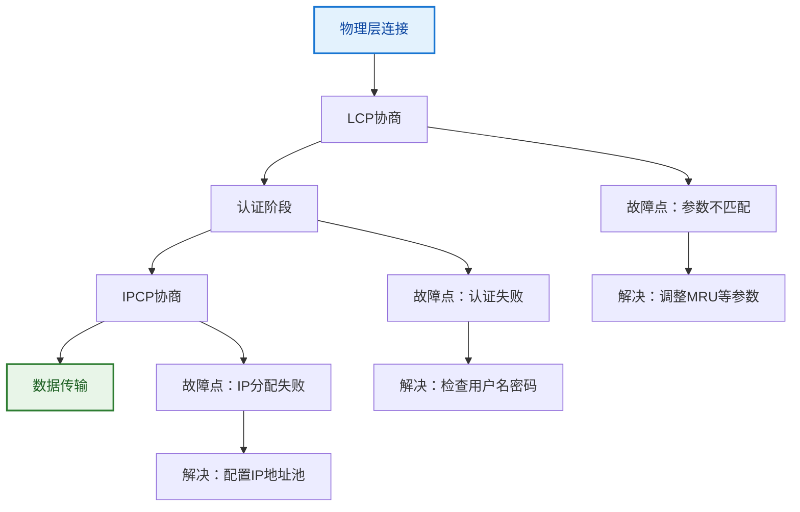

**详细过程说明**：

1. **物理层建立**：ADSL调制解调器同步
2. **LCP协商**：协商MRU、认证方式等
3. **认证阶段**：用户名密码验证
4. **IPCP协商**：获取IP地址、DNS等
5. **数据传输**：正常的网络通信

**学习总结**：
- 掌握完整的计算流程和方法
- 理解各协议的适用场景和性能特点
- 培养分析和解决实际网络问题的能力

---

## 学习总结

### 数据链路层完整知识体系

通过本专题学习，您已经全面掌握数据链路层的核心技术，建立了完整的知识框架：

**技术发展脉络**：
```
传统广域网 → 现代协议 → 宽带接入 → 性能优化 → 综合应用
```

### 核心技术总结

**广域网协议体系**：

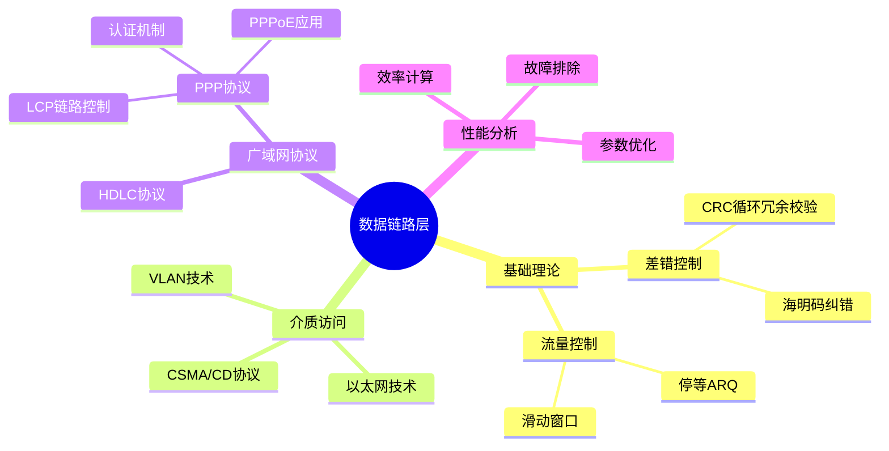

