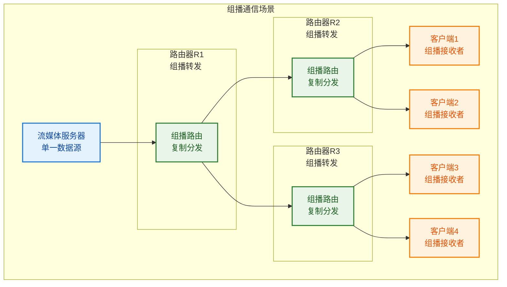
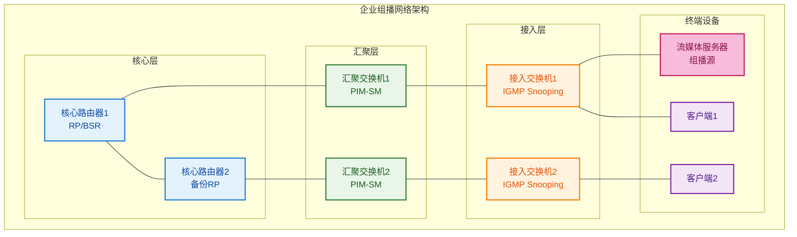

# 5.4 IP组播协议与IGMP

## 目录

1. [组播基本概念](#1-组播基本概念)
2. [IP组播地址体系](#2-ip组播地址体系)
3. [IGMP协议详解](#3-igmp协议详解)
4. [组播路由协议](#4-组播路由协议)
5. [以太网组播地址映射](#5-以太网组播地址映射)
6. [组播应用与部署](#6-组播应用与部署)

## 知识架构

```
IP组播技术体系
├── 组播基础概念
│   ├── 组播与单播、广播对比
│   ├── 组播通信模型
│   ├── 组播优势与应用场景
│   └── 组播技术挑战
├── IP组播地址
│   ├── 组播地址分类
│   ├── 地址分配规则
│   ├── 特殊组播地址
│   └── 组播地址管理
├── IGMP协议
│   ├── IGMPv1协议机制
│   ├── IGMPv2改进特性
│   ├── IGMPv3增强功能
│   └── IGMP消息类型
├── 组播路由
│   ├── 组播分发树
│   ├── RPF检查机制
│   ├── PIM协议族
│   └── 组播域间路由
└── 实现技术
    ├── 硬件组播支持
    ├── 软件实现方案
    ├── 性能优化技术
    └── 故障诊断方法
```

---

## 1. 组播基本概念

### 1.1 组播定义与特征

> **IP组播（IP Multicast）** 是一种一对多的网络通信方式，允许单个发送者向多个接收者同时传输数据，实现高效的群组通信。

#### 通信方式对比

| 通信方式 | 发送方式 | 网络效率 | 资源占用 | 典型应用 |
|----------|----------|----------|----------|----------|
| **单播（Unicast）** | 一对一 | 低（多次传输） | 高 | 网页浏览、文件传输 |
| **广播（Broadcast）** | 一对所有 | 中等（单次传输） | 高（所有主机处理） | ARP、DHCP |
| **组播（Multicast）** | 一对多 | 高（按需传输） | 低 | 视频会议、实时流媒体 |

**组播通信模型**：


### 1.2 组播优势与应用场景

#### 组播技术优势

**1. 网络带宽节省**
- 单一数据流服务多个接收者
- 避免重复传输相同数据
- 网络利用率大幅提升

**2. 服务器负载降低**
- 减少服务器出口带宽需求
- 降低CPU和内存使用
- 提高系统整体性能

**3. 可扩展性强**
- 接收者数量不影响发送者负载
- 支持大规模群组通信
- 易于横向扩展

#### 典型应用场景

**1. 流媒体服务**
```
应用案例：企业视频会议
├── 场景描述：总部向全国分公司直播重要会议
├── 传统方案：单播 × 100个分公司 = 100倍带宽
├── 组播方案：单一组播流 = 1倍带宽
└── 效益：带宽节省99%，成本大幅降低
```

**2. 软件分发更新**
- 操作系统补丁分发
- 企业软件批量更新
- 游戏客户端更新

**3. 金融数据分发**
- 股票价格实时推送
- 外汇汇率广播
- 期货行情分发

**4. 在线教育培训**
- 远程教学直播
- 企业培训传输
- 在线课程分发

### 1.3 组播技术挑战

#### 主要技术难点

**1. 路由复杂性**
- 需要特殊的组播路由协议
- 分发树构建和维护
- 路由状态信息管理

**2. 网络设备支持**
- 需要硬件组播支持
- 配置复杂度高
- 兼容性问题

**3. 可靠性保障**
- UDP传输不可靠
- 错误恢复机制复杂
- 拥塞控制困难

**4. 安全性考虑**
- 组播数据容易被窃听
- 访问控制复杂
- 拒绝服务攻击风险

---

## 2. IP组播地址体系

### 2.1 组播地址分类

> **IP组播地址**：D类IP地址，地址范围为224.0.0.0-239.255.255.255，用于标识组播组。

#### 组播地址分类体系

| 地址范围 | 分类 | 用途 | 路由范围 | 典型应用 |
|----------|------|------|----------|----------|
| **224.0.0.0-224.0.0.255** | 本地链路组播 | 协议专用 | 不路由 | OSPF、RIP |
| **224.0.1.0-224.0.1.255** | 互联网控制 | 协议控制 | 全球 | NTP、PIM |
| **224.0.2.0-238.255.255.255** | 全球范围 | 应用数据 | 全球 | 流媒体、会议 |
| **239.0.0.0-239.255.255.255** | 私有范围 | 企业内部 | 管理域内 | 企业应用 |

#### 重要的保留组播地址

**网络协议专用地址**：
```
关键组播地址列表
├── 224.0.0.1 - 所有主机组播地址
│   └── 子网内所有支持组播的主机
├── 224.0.0.2 - 所有路由器组播地址  
│   └── 子网内所有组播路由器
├── 224.0.0.5 - OSPF DR/BDR路由器
│   └── OSPF指定路由器选举
├── 224.0.0.9 - RIP版本2路由器
│   └── RIP路由信息交换
├── 224.0.0.13 - PIM路由器
│   └── PIM协议邻居发现
└── 224.0.0.22 - IGMP查询器
    └── IGMP查询消息
```

### 2.2 组播地址结构分析

#### D类地址格式

**二进制格式分析**：
```
D类IP地址结构：
┌─────┬─────────────────────────────────┐
│1110 │        28位组播组标识符          │
└─────┴─────────────────────────────────┘
 4位     28位组播组ID

示例：224.1.1.1
二进制：11100000.00000001.00000001.00000001
```

**地址特征**：
- 前4位固定为1110（十进制224-239）
- 后28位用于组播组标识
- 理论上支持2^28 = 268,435,456个组播组
- 实际可用地址受路由和管理限制

### 2.3 组播地址分配与管理

#### IANA地址分配原则

**1. 链路本地地址（224.0.0.x）**
- 永久分配给特定协议
- TTL=1，不会被路由转发
- 用于邻居发现和本地协议

**2. 互联网范围地址（224.0.1.x-238.x.x.x）**
- 需要IANA正式分配
- 支持全球路由传播
- 用于公共服务和应用

**3. 管理范围地址（239.x.x.x）**
- 类似私有IP地址概念
- 仅在管理域内有效
- 企业可自由使用

#### 组播地址生存期（TTL）控制

**TTL值的含义**：
| TTL值 | 范围 | 描述 | 典型应用 |
|-------|------|------|----------|
| **0** | 本机 | 不离开主机 | 内部测试 |
| **1** | 本地子网 | 不被路由器转发 | 本地发现协议 |
| **32** | 本地站点 | 限制在组织内 | 企业内部应用 |
| **64** | 本地区域 | 限制在地区内 | 区域性服务 |
| **128** | 本大陆 | 限制在大陆内 | 洲际服务 |
| **255** | 全球范围 | 无限制 | 全球性服务 |

---

## 3. IGMP协议详解

### 3.1 IGMP协议概述

> **IGMP（Internet Group Management Protocol）** 是运行在主机和直连路由器之间的协议，用于管理主机对组播组的加入和离开。

#### IGMP协议作用

**1. 组成员管理**
- 主机向路由器报告组成员身份
- 路由器查询本地网段组成员
- 维护组成员状态信息

**2. 流量控制**
- 只向有成员的网段转发组播流量
- 避免不必要的组播流量传播
- 提高网络效率

#### IGMP版本演进

| 版本 | 发布时间 | 主要特性 | 限制 |
|------|----------|----------|------|
| **IGMPv1** | 1989 | 基本加入/离开机制 | 离开延迟大 |
| **IGMPv2** | 1997 | 离开组消息，查询器选举 | 不支持源过滤 |
| **IGMPv3** | 2002 | 源特定组播（SSM） | 复杂度高 |

### 3.2 IGMPv2协议机制

#### 消息类型与格式

**IGMP消息类型**：
```
IGMPv2消息类型
├── 成员查询（Membership Query）
│   ├── 一般查询：查询所有组
│   └── 特定组查询：查询特定组
├── 成员报告（Membership Report）
│   └── 加入组播组响应
└── 离开组（Leave Group）
    └── 主动离开组播组
```

**IGMP消息格式**：
```
IGMP消息格式（8字节）
┌──────────┬──────────┬────────────────┬──────────────────────────────────┐
│ 类型(8)   │最大响应时间│    校验和(16)   │          组播地址(32)              │
│   Type   │Max Resp   │   Checksum    │        Group Address              │
└──────────┴──────────┴────────────────┴──────────────────────────────────┘
```

#### 协议工作过程

**1. 主机加入组播组**
```
主机加入组播组流程：
1. 主机决定加入组播组G
2. 主机发送IGMPv2 Membership Report消息
3. 报告目标地址 = 组播地址G
4. 路由器收到报告，开始转发组G的流量
```

**2. 路由器查询机制**
```
路由器查询流程：
1. 路由器定期发送一般查询（默认125秒）
2. 查询消息发送到224.0.0.1（所有主机）
3. 主机随机延迟后响应活跃的组
4. 其他主机听到响应后抑制自己的响应
```

**3. 主机离开组**
```
快速离开机制：
1. 主机发送Leave Group消息到224.0.0.2
2. 路由器发送特定组查询确认
3. 如无其他成员响应，停止转发该组流量
4. 大大缩短离开延迟（从125秒到3秒）
```

### 3.3 IGMPv3增强功能

#### 源过滤功能

> **源特定组播（SSM - Source-Specific Multicast）**：允许接收者指定只接收来自特定源的组播流量。

**IGMPv3新增功能**：
- **包含模式（INCLUDE）**：只接收指定源的流量
- **排除模式（EXCLUDE）**：接收除指定源外的所有流量
- **源列表管理**：动态维护源地址列表

**IGMPv3报告格式**：
```
IGMPv3组记录格式
────────────────────────────────────────────────
│记录类型(8) │辅助数据长度 │ 源地址数(16)│组播地址(32)│
────────────────────────────────────────────────
                    源地址列表                    
               (每个源地址32位)                   
─────────────────────────────────────────────────

记录类型：
1 = MODE_IS_INCLUDE    当前包含模式
2 = MODE_IS_EXCLUDE    当前排除模式  
3 = CHANGE_TO_INCLUDE  改为包含模式
4 = CHANGE_TO_EXCLUDE  改为排除模式
5 = ALLOW_NEW_SOURCES  允许新源
6 = BLOCK_OLD_SOURCES  阻止旧源
```

---

## 4. 组播路由协议

### 4.1 组播路由基础

#### 组播分发树

> **组播分发树**：从源到所有接收者的最优路径树结构，用于高效传递组播流量。

**分发树类型**：

**1. 源树（Source Tree）**
- **特点**：以每个源为根的最短路径树
- **优点**：路径最优，延迟最小
- **缺点**：状态信息多，扩展性差
- **表示法**：(S,G) - S为源，G为组

**2. 共享树（Shared Tree）**
- **特点**：所有源共享一棵以RP（汇聚点）为根的树
- **优点**：状态信息少，扩展性好
- **缺点**：路径非最优，可能存在集中瓶颈
- **表示法**：(*,G) - *表示任意源，G为组

### 4.2 RPF检查机制

> **RPF（Reverse Path Forwarding）检查**：组播路由器用来防止环路和确保最优路径的关键机制。

#### RPF检查原理

**基本思想**：
- 检查组播数据包的入接口
- 如果入接口是到达源的最短路径接口，则通过RPF检查
- 否则丢弃数据包

**RPF检查过程**：
```
RPF检查算法：
1. 提取组播数据包的源地址S
2. 查找单播路由表，确定到达S的最短路径接口
3. 比较数据包实际入接口与最短路径接口
4. 如果匹配，通过RPF检查，继续转发
5. 如果不匹配，丢弃数据包（防止环路）
```

### 4.3 PIM协议族

#### PIM协议概述

> **PIM（Protocol Independent Multicast）**：协议无关组播，是目前主流的组播路由协议族。

**PIM特点**：
- 不依赖特定的单播路由协议
- 支持密集模式和稀疏模式
- 具有良好的扩展性

#### PIM-DM（密集模式）

**适用场景**：
- 接收者密集分布的网络
- 带宽充足的局域网环境

**工作原理**：
```
PIM-DM工作流程：
1. 泛洪：初始向所有接口泛洪组播流量
2. 剪枝：无接收者的分支发送剪枝消息
3. 嫁接：新接收者加入时发送嫁接消息
4. 状态刷新：定期重新泛洪刷新状态
```

#### PIM-SM（稀疏模式）

**适用场景**：
- 接收者稀疏分布的网络
- 广域网和Internet环境

**核心概念**：
- **RP（Rendezvous Point）**：汇聚点路由器
- **BSR（Bootstrap Router）**：引导路由器
- **DR（Designated Router）**：指定路由器

**工作流程**：
```
PIM-SM工作流程：
1. RP发现：通过BSR机制发现RP
2. 注册：源向RP注册，建立(S,G)状态
3. 加入：接收者向RP发送加入消息
4. 切换：从共享树切换到源树（可选）
```

---

## 5. 以太网组播地址映射

### 5.1 地址映射需求

> **地址映射问题**：IP组播地址是逻辑地址，需要映射到物理网络的MAC地址才能在数据链路层传输。

#### 映射挑战

**1. 地址空间差异**
- IP组播地址：28位有效标识（224.0.0.0-239.255.255.255）
- 以太网组播MAC：23位有效标识
- 存在地址重叠问题

**2. 硬件支持需求**
- 网卡需要支持组播MAC地址过滤
- 交换机需要组播MAC地址学习
- 需要硬件加速支持

### 5.2 IEEE以太网组播映射

#### 映射规则

**标准映射方法**：
```
IP组播到以太网MAC地址映射：
1. 以太网组播MAC前缀：01-00-5E
2. 第4字节最高位：固定为0
3. IP组播地址低23位：直接映射到MAC地址低23位

示例：
IP地址：224.1.1.1 (11100000.00000001.00000001.00000001)
取低23位：0000001.00000001.00000001
MAC地址：01-00-5E-01-01-01
```

**映射算法**：
```python
def ip_multicast_to_mac(ip_addr):
    """IP组播地址转MAC地址"""
    # 解析IP地址
    ip_parts = ip_addr.split('.')
    ip_int = (int(ip_parts[0]) << 24) + (int(ip_parts[1]) << 16) + \
             (int(ip_parts[2]) << 8) + int(ip_parts[3])
    
    # 提取低23位
    low_23_bits = ip_int & 0x7FFFFF
    
    # 构造MAC地址
    mac_addr = "01-00-5E-{:02X}-{:02X}-{:02X}".format(
        (low_23_bits >> 16) & 0x7F,  # 第4字节，最高位为0
        (low_23_bits >> 8) & 0xFF,   # 第5字节
        low_23_bits & 0xFF           # 第6字节
    )
    
    return mac_addr

# 示例使用
print(ip_multicast_to_mac("224.1.1.1"))    # 01-00-5E-01-01-01
print(ip_multicast_to_mac("239.1.1.1"))    # 01-00-5E-01-01-01 (冲突!)
```

### 5.3 地址冲突与解决

#### 冲突分析

**冲突原因**：
- IP组播28位标识 > 以太网23位标识
- 32个IP地址映射到同一MAC地址
- 存在2^5 = 32:1的映射冲突

**冲突示例**：
```
地址冲突示例：
224.1.1.1  →  01-00-5E-01-01-01
225.1.1.1  →  01-00-5E-01-01-01  ← 冲突
226.1.1.1  →  01-00-5E-01-01-01  ← 冲突
...
239.1.1.1  →  01-00-5E-01-01-01  ← 冲突
```

#### 解决方案

**1. 软件过滤**
- 网卡接收所有映射的组播帧
- 驱动程序检查IP层地址
- 过滤掉不需要的组播流量

**2. 硬件优化**
- 现代网卡支持完美过滤
- VLAN技术辅助隔离
- 智能交换机组播管理

**3. 应用层策略**
- 合理选择组播地址
- 避免在同一网段使用冲突地址
- 使用私有地址范围(239.x.x.x)

---

## 6. 组播应用与部署

### 6.1 企业组播部署

#### 部署架构设计

**典型企业组播网络**：


#### 关键配置要点

**1. RP配置**
```
核心路由器RP配置：
ip multicast-routing
ip pim rp-address 10.1.1.1 239.0.0.0 8
ip pim bsr-candidate Loopback0
interface Loopback0
 ip pim sparse-mode
```

**2. 接口PIM配置**
```
接口PIM配置：
interface GigabitEthernet0/1
 ip pim sparse-mode
 ip multicast boundary 239.255.0.0 8 out
```

**3. IGMP Snooping**
```
交换机IGMP Snooping配置：
ip igmp snooping
ip igmp snooping vlan 100
ip igmp snooping vlan 100 immediate-leave
```

### 6.2 性能优化与故障排除

#### 性能优化策略

**1. 源树切换优化**
```
PIM-SM源树切换条件：
- 当流量超过阈值时自动切换
- spt-threshold infinity：禁用切换
- spt-threshold 0：立即切换
```

**2. IGMP调优**
```
IGMP参数优化：
ip igmp query-interval 60        # 查询间隔
ip igmp query-max-response-time 10  # 最大响应时间
ip igmp last-member-query-count 2   # 最后成员查询次数
```

#### 常见故障排除

**1. 组播流量不通**
```
故障排除步骤：
1. 检查IGMPv2成员状态：show ip igmp groups
2. 检查PIM邻居关系：show ip pim neighbor  
3. 检查组播路由表：show ip mroute
4. 检查RPF路径：show ip rpf <source>
5. 跟踪组播包：debug ip mpacket
```

**2. 性能问题分析**
```
性能分析方法：
1. 监控组播流量：show ip mroute count
2. 检查CPU使用率：show processes cpu
3. 分析内存使用：show ip mroute summary
4. 网络延迟测试：multicast ping
```

### 6.3 组播安全考虑

#### 安全威胁与防护

**1. 访问控制**
```
组播访问控制：
ip multicast boundary 239.255.0.0 8    # 边界过滤
ip pim accept-rp 10.1.1.1 239.0.0.0 8  # RP访问控制
ip igmp access-group 10                 # IGMP访问控制
```

**2. 拒绝服务防护**
```
DoS攻击防护：
ip multicast rate-limit in 1000     # 限制入向流量
ip pim query-interval 125           # 调整查询间隔
ip igmp limit 100                   # 限制IGMP组数量
```

---

## 总结

IP组播技术是现代网络中实现高效群组通信的关键技术：

### 核心要点

1. **技术优势**：相比单播和广播，组播在带宽利用率和可扩展性方面具有显著优势
2. **地址体系**：D类地址（224.0.0.0-239.255.255.255）的分类管理和分配原则
3. **IGMP协议**：主机-路由器间的组成员管理协议，版本演进和功能增强
4. **路由机制**：PIM协议族、RPF检查、分发树构建等核心技术
5. **实现细节**：以太网地址映射、冲突处理、性能优化策略

### 应用前景

组播技术在视频会议、IPTV、在线教育、金融数据分发等领域具有广阔的应用前景，随着5G、边缘计算等新技术的发展，组播将发挥更加重要的作用。 