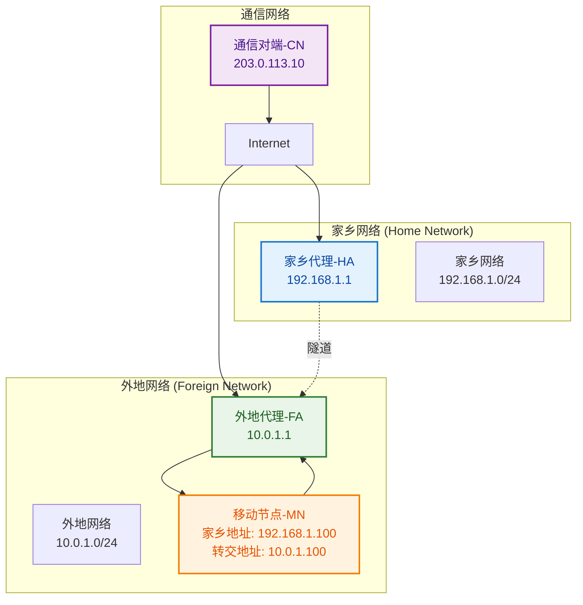
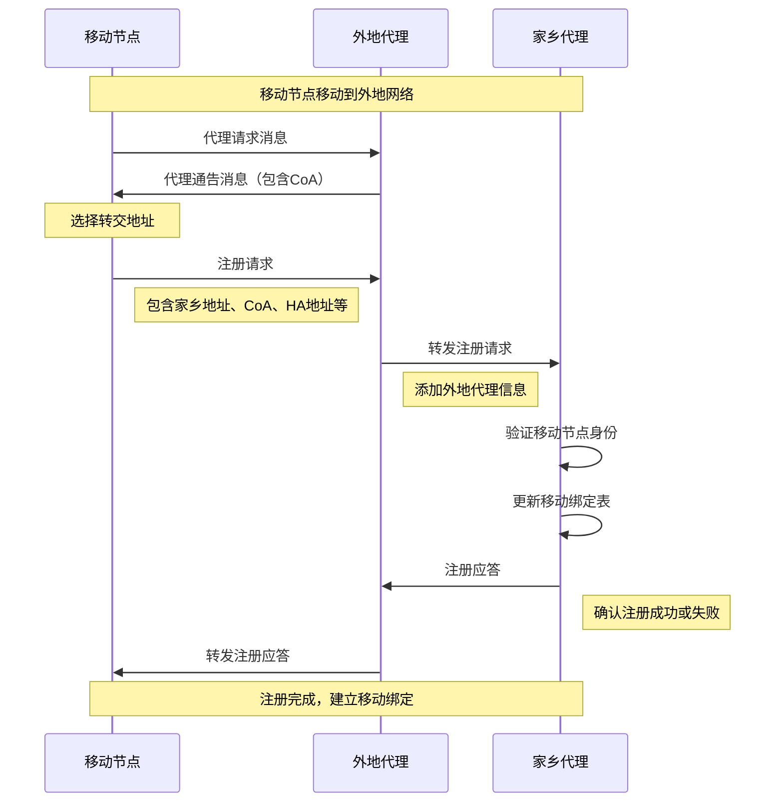
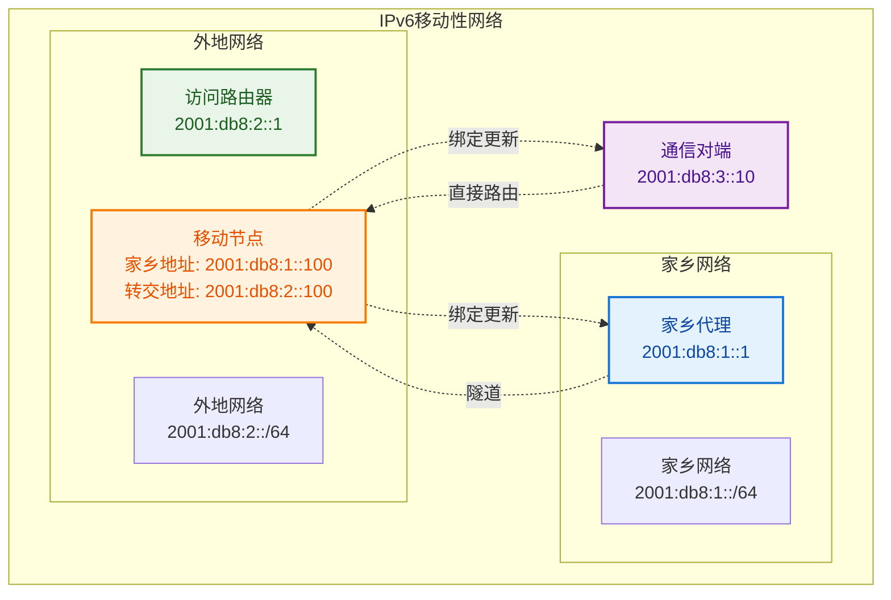
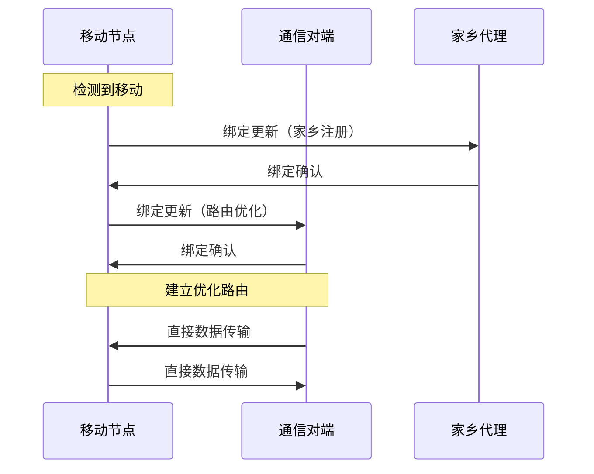
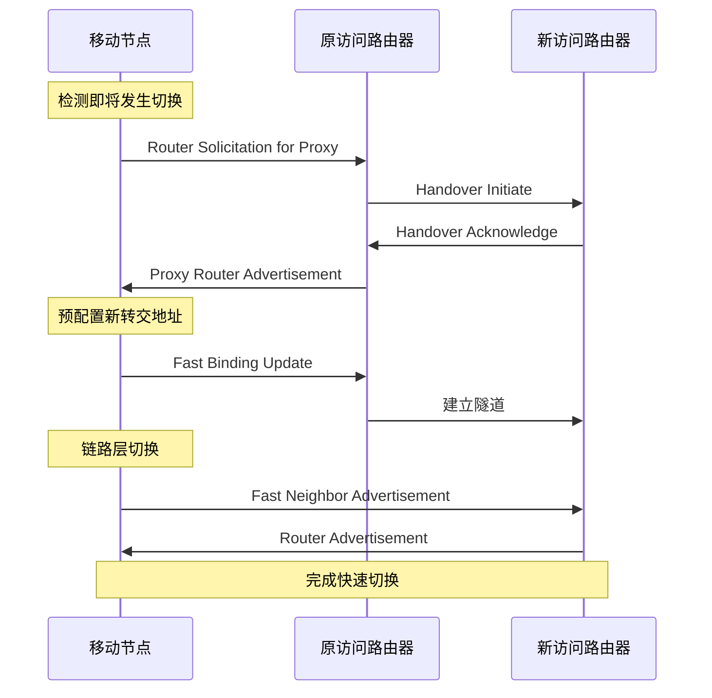
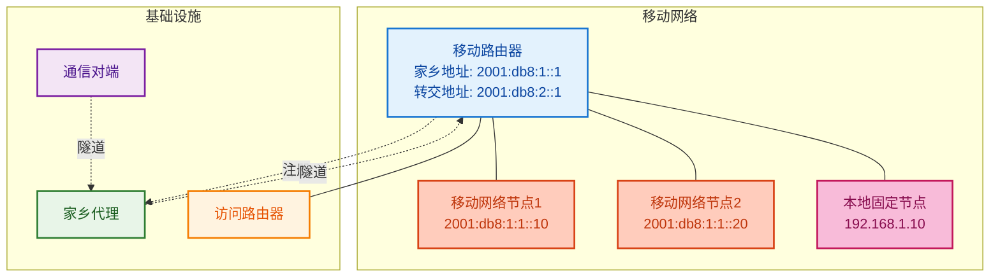

# 5.5 移动IP技术

## 目录

1. [移动IP基本概念](#1-移动ip基本概念)
2. [移动IP协议架构](#2-移动ip协议架构)
3. [移动IP工作机制](#3-移动ip工作机制)
4. [IPv6移动支持](#4-ipv6移动支持)
5. [移动IP优化技术](#5-移动ip优化技术)
6. [移动IP应用与部署](#6-移动ip应用与部署)

## 知识架构

```
移动IP技术体系
├── 基础概念
│   ├── 移动性需求分析
│   ├── 传统IP限制
│   ├── 移动IP解决方案
│   └── 术语与定义
├── 协议架构
│   ├── 移动节点(MN)
│   ├── 家乡代理(HA)
│   ├── 外地代理(FA)
│   └── 通信对端(CN)
├── 工作机制
│   ├── 代理发现
│   ├── 注册过程
│   ├── 隧道技术
│   └── 数据传输
├── IPv6移动性
│   ├── IPv6移动性改进
│   ├── 绑定更新机制
│   ├── 路由优化
│   └── 无状态地址配置
└── 优化技术
    ├── 快速切换
    ├── 分层移动IP
    ├── 微移动性管理
    └── 安全增强
```

---

## 1. 移动IP基本概念

### 1.1 移动性问题分析

> **移动性问题**：传统IP网络假设节点位置固定，当移动设备改变网络位置时，会面临连接中断和地址冲突问题。

#### 传统IP网络的局限性

**1. IP地址的双重含义**
- **网络标识**：指示设备所在的网络位置
- **主机标识**：唯一标识网络中的设备
- **移动冲突**：移动时无法同时保持两种含义

**2. 路由系统的限制**
```
传统路由问题：
├── 地址绑定位置：IP地址与网络拓扑绑定
├── 路由表爆炸：每个移动节点需要独立路由项
├── 三角路由：通信路径非最优
└── 连接中断：位置改变导致连接丢失
```

**3. 移动场景挑战**
- 漫游用户的连续连接需求
- 实时应用对中断的敏感性
- 移动设备的资源限制
- 无线网络的不稳定性

### 1.2 移动IP解决方案

> **移动IP（Mobile IP）**：允许移动节点在保持IP地址不变的情况下在不同网络间漫游，确保连接的连续性。

#### 核心设计思想

**1. 地址分离**
- **家乡地址（Home Address）**：移动节点的永久标识
- **转交地址（Care-of Address）**：移动节点的当前位置标识
- **双重地址机制**：分离标识和位置功能

**2. 间接路由**
- 所有发往移动节点的数据包首先路由到家乡网络
- 家乡代理负责将数据包转发到移动节点当前位置
- 通过隧道技术实现透明转发

#### 移动IP优势

| 特性 | 传统方案 | 移动IP方案 | 优势 |
|------|----------|------------|------|
| **连接保持** | 断开重连 | 无缝漫游 | 应用连续性 |
| **地址稳定** | 动态分配 | 固定家乡地址 | 服务可达性 |
| **位置透明** | 不支持 | 完全透明 | 应用兼容性 |
| **路由优化** | 直接路由 | 可选优化 | 性能平衡 |

### 1.3 关键术语定义

#### 基本实体

> **移动节点（Mobile Node, MN）**
> 
> 可以在不同网络间移动的主机或路由器，拥有固定的家乡地址。

> **家乡代理（Home Agent, HA）**
> 
> 位于移动节点家乡网络的路由器，负责为移动节点提供移动性支持服务。

> **外地代理（Foreign Agent, FA）**
> 
> 位于外地网络的路由器，为访问该网络的移动节点提供路由服务。

> **通信对端（Correspondent Node, CN）**
> 
> 与移动节点通信的对端主机，可以是固定节点或另一个移动节点。

#### 关键地址概念

**地址类型分析**：
```
移动IP地址体系
├── 家乡地址（Home Address）
│   ├── 功能：移动节点的永久标识符
│   ├── 特点：在移动过程中保持不变
│   └── 作用：应用层和传输层使用的地址
├── 转交地址（Care-of Address, CoA）
│   ├── 同地转交地址：外地代理的地址
│   ├── 同位转交地址：移动节点直接获得的地址
│   └── 作用：数据包转发的目标地址
└── 家乡网络前缀（Home Network Prefix）
    ├── 定义：移动节点归属的网络地址空间
    └── 用途：确定移动节点是否在家乡网络
```

---

## 2. 移动IP协议架构

### 2.1 系统架构组件

#### 架构图解



### 2.2 家乡代理功能

#### 核心功能

**1. 移动节点注册管理**
- 维护移动节点的当前位置信息
- 处理注册请求和应答
- 管理移动绑定表

**2. 数据包拦截与转发**
```
家乡代理转发机制：
1. 拦截发往移动节点家乡地址的数据包
2. 查询移动绑定表获取当前转交地址
3. 将数据包封装到隧道中
4. 转发到移动节点当前位置
```

**3. 移动绑定表维护**
| 字段 | 描述 | 示例值 |
|------|------|--------|
| **家乡地址** | 移动节点永久地址 | 192.168.1.100 |
| **转交地址** | 当前位置地址 | 10.0.1.100 |
| **生存时间** | 绑定有效期 | 3600秒 |
| **绑定标志** | 状态标识 | Active |

### 2.3 外地代理功能

#### 主要服务

**1. 代理通告**
- 定期广播代理通告消息
- 声明可为移动节点提供服务
- 包含网络前缀和服务能力信息

**2. 转交地址分配**
```
转交地址分配方式：
├── 同地转交地址（Co-located CoA）
│   ├── 移动节点直接获得外地网络地址
│   ├── 支持DHCP或静态配置
│   └── 无需外地代理参与转发
└── 外地代理转交地址（FA CoA）
    ├── 使用外地代理的IP地址
    ├── 外地代理负责最后一跳转发
    └── 支持多个移动节点共享
```

**3. 注册中继**
- 接收移动节点的注册请求
- 验证移动节点身份
- 将注册消息转发给家乡代理

### 2.4 移动节点功能

#### 移动检测机制

**1. 网络位置检测**
```python
def detect_movement(self):
    """移动检测算法"""
    current_network = self.get_network_prefix()
    
    if current_network != self.last_network:
        if current_network == self.home_network:
            # 返回家乡网络
            self.deregister_with_home_agent()
        else:
            # 移动到外地网络
            self.discover_foreign_agent()
            self.register_with_home_agent()
        
        self.last_network = current_network
```

**2. 代理发现过程**
```
代理发现流程：
1. 监听代理通告消息（被动发现）
2. 发送代理请求消息（主动发现）
3. 分析代理通告内容
4. 选择合适的外地代理
5. 获取转交地址
```

---

## 3. 移动IP工作机制

### 3.1 代理发现阶段

#### 代理通告机制

> **代理通告（Agent Advertisement）**：家乡代理和外地代理定期广播的消息，声明其服务能力和网络信息。

**通告消息格式**：
```
代理通告消息结构
┌─────────────────────────────────────────────────────────┐
│                ICMP路由器通告                            │
├─────────────────────────────────────────────────────────┤
│ 类型 | 代码 | 校验和 | 生存期 | 地址数 | 地址长度 | 优先级 │
├─────────────────────────────────────────────────────────┤
│                      路由器地址                          │
├─────────────────────────────────────────────────────────┤
│ 类型 | 长度 |    序列号     |  注册生存期  |   R|B|H|F|M|G|r|T  │
├─────────────────────────────────────────────────────────┤
│                   零个或多个转交地址                      │
└─────────────────────────────────────────────────────────┘

标志位含义：
R = 需要注册
B = 忙碌，暂不接受新注册
H = 家乡代理
F = 外地代理
M = 支持最小封装
G = 支持GRE封装
r = 保留
T = 外地代理支持反向隧道
```

#### 代理选择算法

**选择标准**：
1. **服务能力匹配**：支持所需的移动IP功能
2. **网络性能**：信号强度、带宽、延迟
3. **负载状况**：代理当前负载和忙碌状态
4. **安全考虑**：认证能力和安全策略

### 3.2 注册过程

#### 注册消息交换

**注册流程序列图**：


#### 注册消息格式

**注册请求消息**：
```
注册请求格式
┌─────────┬─────────┬─────────────────┬─────────────────┐
│ 类型(8) │ S|B|D|M|G|r|T|x │    生存期(16)    │        │
├─────────┼─────────┼─────────────────┼─────────────────┤
│                  家乡地址(32)                        │
├─────────────────────────────────────────────────────┤
│                  家乡代理(32)                        │
├─────────────────────────────────────────────────────┤
│                  转交地址(32)                        │
├─────────────────────────────────────────────────────┤
│                识别字段(64)                          │
├─────────────────────────────────────────────────────┤
│                  扩展字段...                         │
└─────────────────────────────────────────────────────┘

标志位含义：
S = 请求同步路径
B = 请求广播数据报
D = 不要解封装
M = 支持最小封装
G = 支持GRE封装
r = 保留
T = 请求反向隧道
x = 保留
```

### 3.3 隧道技术

#### 封装机制

> **IP隧道**：将原始IP数据包作为载荷封装在另一个IP数据包中，实现跨网络的透明传输。

**封装过程**：
```
IP-in-IP封装格式
───────────────────────────────────────────────────────
              外层IP头（隧道头）                          
 源地址：家乡代理地址                                     
 目的地址：转交地址                                       
───────────────────────────────────────────────────────
              内层IP头（原始头）                          
 源地址：通信对端地址                                      
 目的地址：移动节点家乡地址                                 
───────────────────────────────────────────────────────
                    原始数据载荷                           
───────────────────────────────────────────────────────
```

#### 隧道类型对比

| 隧道类型 | 开销 | 复杂度 | 兼容性 | 应用场景 |
|----------|------|--------|--------|----------|
| **IP-in-IP** | 20字节 | 低 | 高 | 标准配置 |
| **最小封装** | 12字节 | 中 | 中 | 带宽敏感 |
| **GRE** | 24字节 | 中 | 高 | 企业环境 |

### 3.4 数据传输流程

#### 正向数据传输

**从通信对端到移动节点**：
```
正向传输流程：
1. CN发送数据包到MN家乡地址
2. 数据包路由到家乡网络
3. HA拦截数据包（代理ARP/NDP）
4. HA查询移动绑定表
5. HA封装数据包到隧道
6. 隧道数据包传输到转交地址
7. FA（或MN）解封装
8. 数据包交付给MN
```

#### 反向数据传输

**从移动节点到通信对端**：
```
反向传输流程：
情况1：直接路由
MN → Internet → CN

情况2：反向隧道（防火墙/入口过滤）
MN → FA → HA → Internet → CN
```

---

## 4. IPv6移动支持

### 4.1 IPv6移动性改进

> **移动IPv6（MIPv6）**：IPv6内置的移动性支持，相比IPv4移动IP具有显著改进。

#### 主要改进特性

**1. 无需外地代理**
- 移动节点直接与家乡代理通信
- 简化网络架构和部署
- 减少信令开销

**2. 路由优化集成**
- 内置绑定更新机制
- 支持与通信对端的直接优化路由
- 消除三角路由问题

**3. 地址自动配置**
- 支持无状态地址自动配置
- 自动获取转交地址
- 简化移动节点配置

#### IPv6移动性架构



### 4.2 绑定更新机制

#### 绑定更新过程

**绑定更新消息格式**：
```
IPv6绑定更新头部
┌─────────┬─────────┬─────────┬─────────────────┬─────────────────┐
│下一头部 │头部长度 │ 消息类型│    保留        │       校验和     │
├─────────┼─────────┼─────────┼─────────────────┼─────────────────┤
│                    序列号(16)                │   A|H|L|K|M|R|P|F  │
├─────────────────────────────────────────────┼─────────────────┤
│                   生存期(16)                 │      保留       │
├─────────────────────────────────────────────────────────────┤
│                    移动性选项...                             │
└─────────────────────────────────────────────────────────────┘

标志位含义：
A = 确认请求
H = 家乡注册
L = 链路本地地址兼容性
K = 密钥管理移动性能力
M = MAP注册
R = 路由器
P = 前缀发现
F = 快速绑定更新
```

#### 绑定确认机制

**确认消息交换**：


### 4.3 路由优化

#### 返回路由能力测试

> **返回路由能力测试（Return Routability Test）**：IPv6移动性用于验证移动节点身份和位置的安全机制。

**测试过程**：
```
返回路由能力测试流程：
1. MN → CN: Home Test Init（通过HA）
2. MN → CN: Care-of Test Init（直接）
3. CN → MN: Home Test（通过HA）
4. CN → MN: Care-of Test（直接）
5. MN计算绑定管理密钥
6. MN → CN: 绑定更新（包含认证数据）
7. CN → MN: 绑定确认
```

#### 路由优化效果

**性能对比**：
| 指标 | 三角路由 | 路由优化 | 改进幅度 |
|------|----------|----------|----------|
| **往返延迟** | RTT(MN-HA) + RTT(HA-CN) | RTT(MN-CN) | 30-70% |
| **带宽消耗** | 隧道开销 + 路径冗余 | 直接传输 | 20-40% |
| **家乡代理负载** | 转发所有数据 | 仅控制信令 | 80-95% |

---

## 5. 移动IP优化技术

### 5.1 快速切换技术

#### 快速切换需求

**传统切换延迟分析**：
```
传统移动IP切换延迟组成：
├── 链路层切换：100-1000ms
├── 网络层检测：1-30s  
├── 地址配置：1-10s
├── 重复地址检测：1s
├── 注册过程：100-1000ms
└── 总延迟：3-42s（不可接受）
```

#### 快速移动IPv6（FMIPv6）

**预切换机制**：


### 5.2 分层移动IP

#### 微移动性管理

> **分层移动IP（HMIPv6）**：在移动IP基础上引入层次结构，区分宏移动性和微移动性管理。

**架构设计**：
```
分层移动IP架构
├── 移动性锚点(MAP)
│   ├── 管理本地域内的移动性
│   ├── 减少全局绑定更新频率
│   └── 提供本地转交地址
├── 区域转交地址(RCoA)
│   ├── 在MAP注册的全局地址
│   └── 向家乡代理报告的地址
└── 链路转交地址(LCoA)
    ├── 在访问路由器获得的地址
    └── 仅在MAP域内有效
```

#### 微移动性优化效果

**信令减少分析**：
```python
def calculate_signaling_reduction():
    """计算分层移动IP信令减少效果"""
    
    # 传统移动IP：每次移动都需要全局更新
    traditional_signaling = {
        'local_moves': 10,  # 本地域内移动次数
        'global_updates_per_move': 2,  # 每次移动的全局更新
        'signaling_cost_per_update': 100  # 信令开销
    }
    
    # 分层移动IP：本地移动只需本地更新
    hierarchical_signaling = {
        'local_updates': 10,  # 本地更新次数
        'global_updates': 1,   # 全局更新次数
        'local_cost': 10,      # 本地更新开销
        'global_cost': 100     # 全局更新开销
    }
    
    traditional_total = (traditional_signaling['local_moves'] * 
                        traditional_signaling['global_updates_per_move'] * 
                        traditional_signaling['signaling_cost_per_update'])
    
    hierarchical_total = (hierarchical_signaling['local_updates'] * 
                         hierarchical_signaling['local_cost'] + 
                         hierarchical_signaling['global_updates'] * 
                         hierarchical_signaling['global_cost'])
    
    reduction = (traditional_total - hierarchical_total) / traditional_total * 100
    
    return {
        'traditional_cost': traditional_total,
        'hierarchical_cost': hierarchical_total,
        'reduction_percentage': reduction
    }

# 计算结果：信令开销减少约95%
```

### 5.3 网络移动性

#### 移动网络场景

> **网络移动性（NEMO）**：整个网络作为一个单元进行移动，如车载网络、飞机网络等。

**应用场景**：
- **车载通信**：汽车、火车、公交车网络
- **航空网络**：飞机内部网络连接
- **船舶通信**：海上移动平台
- **应急通信**：临时部署的移动基站

**NEMO架构**：


---

## 6. 移动IP应用与部署

### 6.1 实际应用场景

#### 企业移动办公

**部署架构**：
```
企业移动IP部署
├── 总部网络
│   ├── 家乡代理服务器
│   ├── 认证服务器
│   └── 企业资源服务器
├── 分支机构
│   ├── 外地代理路由器
│   ├── 本地接入网络
│   └── 移动用户接入
└── 移动接入
    ├── 无线热点
    ├── 蜂窝网络
    └── 卫星通信
```

**业务优势**：
- 员工可在任何地点访问企业资源
- 保持固定IP地址便于管理
- 支持端到端安全策略
- 简化网络配置和管理

#### 运营商移动服务

**5G网络中的移动IP**：
```
5G移动性管理
├── 控制平面移动性
│   ├── AMF（接入和移动性管理功能）
│   ├── SMF（会话管理功能）
│   └── UDM（统一数据管理）
├── 用户平面移动性
│   ├── UPF（用户平面功能）
│   ├── N3/N9接口隧道
│   └── 数据包转发
└── 边缘计算支持
    ├── MEC（多接入边缘计算）
    ├── 本地流量卸载
    └── 低延迟服务
```

### 6.2 部署考虑因素

#### 性能优化策略

**1. 隧道优化**
```
隧道性能优化：
├── 隧道类型选择
│   ├── IP-in-IP：兼容性最好
│   ├── GRE：功能丰富
│   └── 最小封装：开销最小
├── 路径MTU发现
│   ├── 避免分片
│   ├── 优化传输效率
│   └── 减少处理开销
└── 压缩技术
    ├── 头部压缩
    ├── 载荷压缩
    └── 隧道优化
```

**2. 切换优化**
```
切换性能优化：
├── 预切换准备
│   ├── 邻居网络预发现
│   ├── 认证预处理
│   └── 地址预配置
├── 快速检测
│   ├── 链路状态监测
│   ├── 信号质量评估
│   └── 切换决策算法
└── 并行处理
    ├── 多线程注册
    ├── 异步消息处理
    └── 流水线优化
```

#### 安全部署要点

**1. 认证机制**
- **移动节点认证**：确保合法用户身份
- **代理认证**：验证家乡代理和外地代理
- **消息完整性**：防止注册消息被篡改

**2. 加密保护**
```
移动IP安全机制：
├── IPSec集成
│   ├── ESP隧道模式
│   ├── 端到端加密
│   └── 密钥管理
├── 移动性扩展认证
│   ├── 移动节点-家乡代理认证
│   ├── 移动节点-外地代理认证
│   └── 外地代理-家乡代理认证
└── 防重放保护
    ├── 时间戳机制
    ├── 序列号验证
    └── 随机数挑战
```

### 6.3 故障排除与监控

#### 常见问题诊断

**1. 注册失败**
```
注册失败排除步骤：
1. 检查网络连通性
   - ping家乡代理
   - traceroute路径分析
2. 验证认证配置
   - SPI（安全参数索引）匹配
   - 共享密钥一致性
3. 分析注册消息
   - 消息格式正确性
   - 时间戳有效性
4. 检查代理状态
   - 家乡代理服务状态
   - 外地代理负载情况
```

**2. 数据传输问题**
```
数据传输故障排除：
1. 隧道连通性测试
   - 端到端ping测试
   - MTU路径发现
2. 绑定表验证
   - 检查移动绑定表项
   - 验证转交地址有效性
3. 路由分析
   - 上行路由检查
   - 下行路由验证
4. 防火墙规则
   - NAT/防火墙配置
   - 端口过滤规则
```

#### 性能监控指标

**关键性能指标（KPI）**：
| 指标 | 定义 | 目标值 | 监控方法 |
|------|------|--------|----------|
| **注册成功率** | 成功注册次数/总注册尝试 | >99% | 代理日志分析 |
| **切换延迟** | 从检测移动到恢复通信 | <2秒 | 端到端测试 |
| **数据包丢失率** | 切换期间丢包比例 | <0.1% | 流量分析 |
| **信令开销** | 控制消息占总流量比例 | <5% | 流量统计 |

---

## 总结

移动IP技术为网络移动性提供了完整的解决方案：

### 核心价值

1. **连接连续性**：移动过程中保持网络连接不中断
2. **地址稳定性**：固定的家乡地址简化应用和管理
3. **位置透明性**：上层应用无需感知移动性
4. **灵活部署**：支持多种网络环境和移动场景

### 技术演进

- **IPv4移动IP**：基础移动性支持，需要外地代理
- **IPv6移动IP**：内置移动性，路由优化，简化架构
- **快速移动IP**：减少切换延迟，支持实时应用
- **分层移动IP**：微移动性管理，提高效率
- **网络移动性**：支持整个网络的移动

移动IP技术随着5G、物联网、边缘计算的发展，将在未来的移动通信和泛在网络中发挥更加重要的作用。 