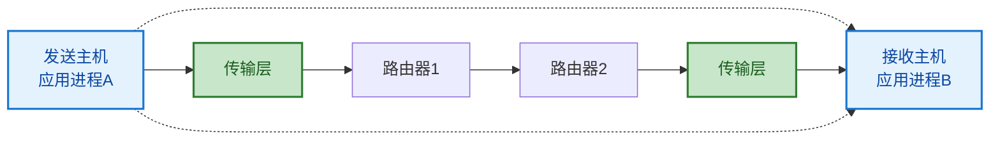
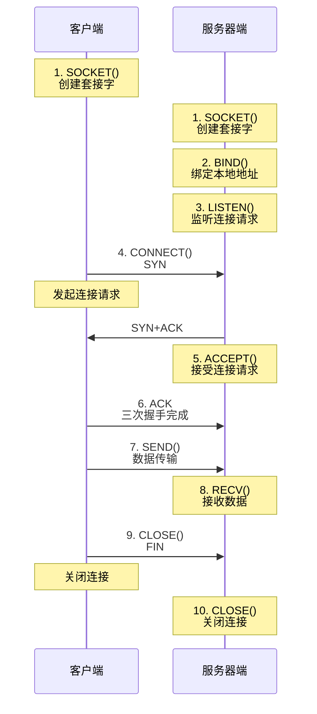
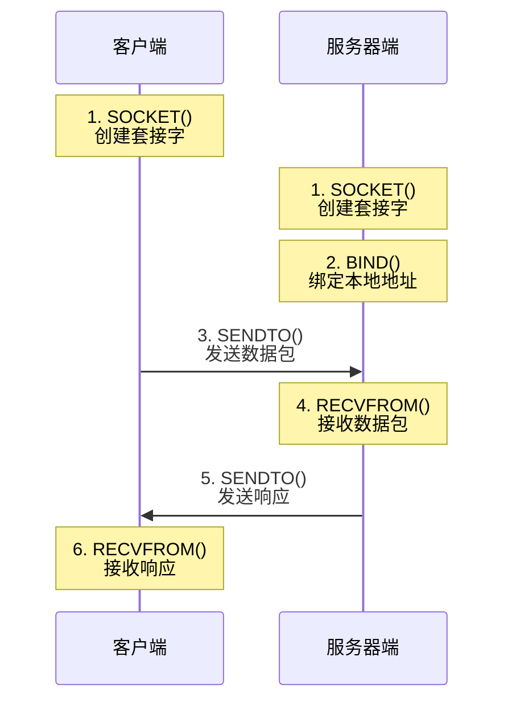
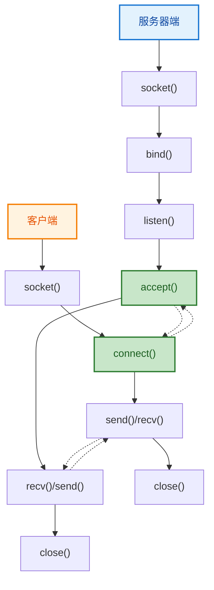
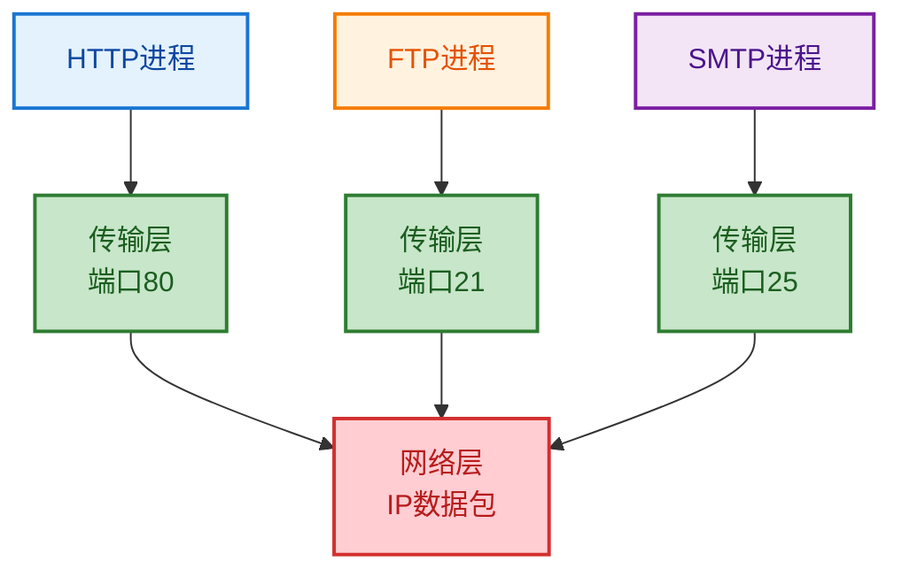
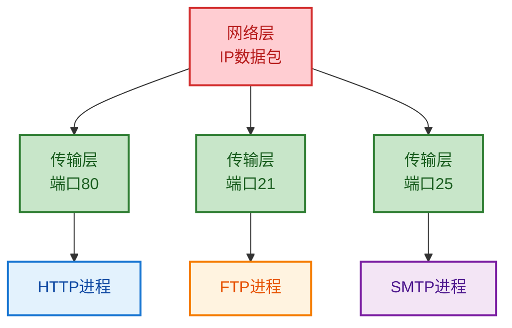
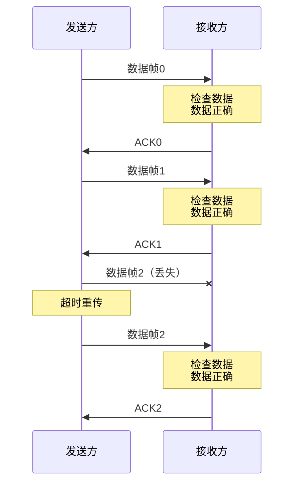
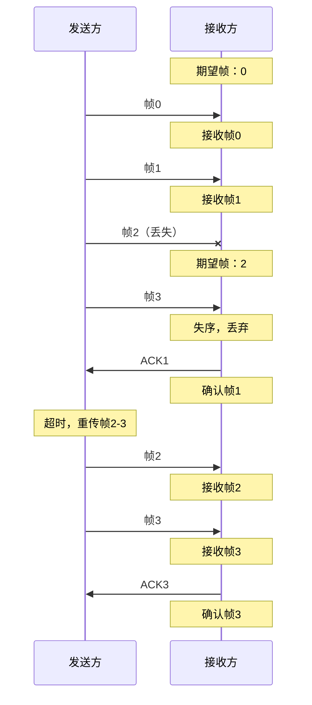
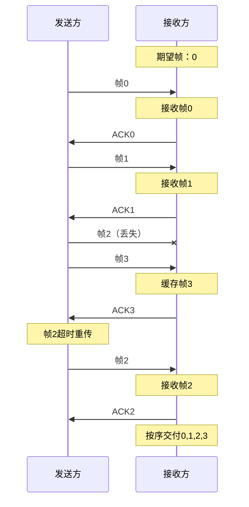

# 7.1 传输层基础理论与服务模型
 
## 目录

### 基础理论篇
1. [传输层概述与功能定位](#1-传输层概述与功能定位)
2. [传输层服务模型](#2-传输层服务模型)
3. [端口与套接字机制](#3-端口与套接字机制)

### 核心技术篇
4. [可靠传输基本原理](#4-可靠传输基本原理)
5. [滑动窗口协议](#5-滑动窗口协议)

### 实践应用篇
6. [传输层协议选择与应用](#6-传输层协议选择与应用)

---

## 1. 传输层概述与功能定位

### 1.1 传输层在网络体系结构中的地位

> **传输层（Transport Layer）**
> 
> OSI参考模型的第四层，负责提供端到端的数据传输服务，是网络层面向主机通信与应用层面向进程通信的桥梁。

#### 网络分层中的关键位置

**分层功能对比**：
**网络体系结构中的传输层定位**：

| 层次 | 功能 | 关注点 | 数据单位 | 协议示例 |
|------|------|--------|----------|----------|
| 应用层（Layer 7） | 提供网络应用程序接口 | 具体应用协议 | 应用数据单元（ADU） | HTTP、FTP |
| 表示层（Layer 6） | 数据格式转换、加密解密 | 数据表示 | 表示数据单元（PDU） | SSL/TLS |
| 会话层（Layer 5） | 建立、管理、终止会话 | 会话管理 | 会话数据单元（SDU） | NetBIOS |
| **传输层（Layer 4）** ⭐⭐⭐⭐⭐ | **端到端可靠数据传输** | **进程间通信、流量控制、拥塞控制** | **传输数据单元（Segment）** | **TCP、UDP** |
| 网络层（Layer 3） | 路由选择、分组转发 | 主机到主机通信 | 数据包（Packet） | IP、ICMP |
| 数据链路层（Layer 2） | 帧传输、差错检测 | 链路层传输 | 帧（Frame） | Ethernet |
| 物理层（Layer 1） | 比特流传输 | 物理信号 | 比特（Bit） | 光纤、电缆 |

#### 传输层的核心使命

**主要职责**：
1. **进程间通信**：为不同主机上的应用进程提供通信服务
2. **端到端传输**：建立端到端的逻辑连接
3. **服务质量保证**：提供可靠或不可靠的数据传输服务
4. **资源管理**：流量控制、拥塞控制、连接管理

### 1.2 传输层与网络层的区别

#### 功能层面的差异

**对比分析**：

| 维度 | 网络层 | 传输层 |
|------|---------|---------|
| **通信端点** | 主机到主机 | 进程到进程 |
| **服务对象** | 传输层 | 应用层 |
| **地址标识** | IP地址 | 端口号 |
| **传输单位** | 数据包（Packet） | 数据段（Segment） |
| **主要功能** | 路由选择、分组转发 | 可靠传输、流量控制 |
| **服务类型** | 尽力而为（Best Effort） | 可靠/不可靠传输 |
| **质量保证** | 无保证 | 可提供质量保证 |

#### 协作关系

**网络层为传输层提供的尽力而为（Best-Effort）服务特点**：
- ❌ **不保证数据包的可靠交付**
- ❌ **不保证数据包的有序交付**
- ❌ **不保证数据包传输的时延**
- ❌ **不保证数据包传输的带宽**
- ⚠️ **可能发生数据包丢失、重复、失序**

**传输层对网络层服务的增强**：
- **可靠性增强**：通过确认、重传机制保证数据可靠交付
- **有序性保证**：通过序号机制保证数据按序交付
- **流量控制**：防止发送方发送速率过快导致接收方溢出
- **拥塞控制**：防止网络过载，保证网络效率

### 1.3 传输层的关键概念

#### 端到端通信

> **端到端原理（End-to-End Principle）**
> 
> 网络的智能功能应该尽可能地放在网络的端点（主机）上实现，而网络内部应该保持简单。

**端到端通信的特征**：



**端到端可靠传输的实现**：
- **逻辑连接**：在两个端点之间建立虚拟的逻辑连接
- **状态维护**：在端点维护连接状态信息
- **错误处理**：在端点进行错误检测和恢复
- **资源管理**：在端点进行流量控制和拥塞控制

---

## 2. 传输层服务模型

### 2.1 传输层服务的分类

#### 按可靠性分类

**可靠传输服务特征**：
- ✅ **数据无丢失**（No Loss）
- ✅ **数据无重复**（No Duplication）
- ✅ **数据无损坏**（No Corruption）
- ✅ **数据有序到达**（In-Order Delivery）
- ✅ **流量控制**（Flow Control）
- ✅ **拥塞控制**（Congestion Control）

**代表协议**：TCP

**不可靠传输服务特征**：
- ✅ **快速传输**（Fast Transmission）
- ✅ **低开销**（Low Overhead）
- ✅ **简单实现**（Simple Implementation）
- ❌ **不保证可靠交付**
- ❌ **不保证有序交付**
- ❌ **不提供流量控制**

**代表协议**：UDP

#### 按连接方式分类

**面向连接服务**：
- **连接建立**：通信前需要建立连接
- **数据传输**：在已建立的连接上传输数据
- **连接释放**：通信结束后释放连接
- **状态维护**：维护连接状态信息
- **典型协议**：TCP

**无连接服务**：
- **直接传输**：无需建立连接直接发送数据
- **独立处理**：每个数据单元独立处理
- **无状态**：不维护连接状态信息
- **简单高效**：开销小，传输快速
- **典型协议**：UDP

### 2.2 传输层原语

#### 基本原语操作

**TCP连接管理原语**：



**UDP通信原语**：



### 2.3 服务访问点（SAP）

#### 传输层地址结构

> **传输服务访问点（TSAP）**
> 
> 传输层为上层提供服务的接口点，通过端口号来标识，使得多个应用进程可以同时使用网络服务。

**网络通信地址的层次结构**：

**完整地址格式**：`IP地址:端口号`（例：`192.168.1.100:80`）

| 地址组成 | 示例值 | 标识对象 | 作用范围 |
|----------|--------|----------|----------|
| **IP地址** | 192.168.1.100 | 标识主机 | 网络层寻址 |
| **端口号** | 80 | 标识进程 | 传输层寻址 |

#### 端口号分类

**端口号分配策略**：

| 端口范围 | 名称 | 用途 | 示例 |
|----------|------|------|------|
| 0-1023 | 知名端口<br>（Well-Known Ports） | 系统级服务和协议 | HTTP(80)、HTTPS(443)<br>FTP(21)、SSH(22) |
| 1024-49151 | 注册端口<br>（Registered Ports） | 用户级应用程序 | MySQL(3306)、Redis(6379)<br>Tomcat(8080) |
| 49152-65535 | 动态/私有端口<br>（Dynamic/Private Ports） | 临时分配使用 | 客户端随机分配 |

**常用协议端口号**：

| 协议 | 端口号 | 协议 | 端口号 |
|------|--------|------|--------|
| HTTP | 80 | HTTPS | 443 |
| FTP数据 | 20 | FTP控制 | 21 |
| Telnet | 23 | SSH | 22 |
| SMTP | 25 | POP3 | 110 |
| IMAP | 143 | DNS | 53 |
| SNMP | 161 | TFTP | 69 |
| NTP | 123 | LDAP | 389 |

---

## 3. 端口与套接字机制

### 3.1 端口的概念与实现

#### 端口的逻辑概念

> **端口（Port）**
> 
> 传输层协议中用于标识主机上不同应用进程的逻辑地址，是一个16位的整数，取值范围为0-65535。

**端口的作用机制**：
```
端口复用示例 - 主机 192.168.1.100

应用层    │ 进程A(HTTP) │ 进程B(SSH) │ 进程C(MySQL) │ 进程D(Web) │
         │             │            │              │            │
端口映射  │    端口80   │   端口22   │    端口3306  │  端口8080  │
         │             │            │              │            │
传输层    │                    TCP/UDP协议                      │
         │                                                     │
网络层    │                IP: 192.168.1.100                   │
```

#### 端口号的分配和管理

**动态端口分配机制**：

1. **应用程序请求网络连接**
2. **操作系统分配临时端口号**
   - 检查端口可用性
   - 从动态端口范围选择
   - 避免与现有连接冲突
3. **建立连接**
   - 源：客户端IP:动态端口
   - 目标：服务器IP:知名端口
4. **数据传输**
5. **连接结束后释放端口号**

### 3.2 套接字机制

#### 套接字的定义

> **套接字（Socket）**
> 
> 网络通信的端点，由IP地址和端口号组成的五元组（协议、源IP、源端口、目标IP、目标端口）唯一标识一条网络连接。

**套接字表示法**：

**套接字五元组格式**：
`(协议, 本地IP, 本地端口, 远程IP, 远程端口)`

**示例**：
- **TCP连接**：`(TCP, 192.168.1.100, 8080, 10.0.0.50, 80)`
- **UDP通信**：`(UDP, 192.168.1.100, 53, 8.8.8.8, 53)`

#### 套接字编程模型

**TCP套接字编程流程**：



### 3.3 多路复用与解复用

#### 多路复用的概念

> **多路复用（Multiplexing）**
> 
> 在发送主机，传输层从多个应用进程收集数据，为每个数据块添加传输层头部信息，然后向下传递给网络层。

> **解复用（Demultiplexing）**
> 
> 在接收主机，传输层根据头部信息将收到的数据段正确地分发给相应的应用进程。

**发送主机的多路复用示例**：



**接收主机的解复用示例**：



---

## 4. 可靠传输基本原理

### 4.1 可靠传输的问题与挑战

#### 不可靠信道的特征

**不可靠信道的典型问题**：

1. **比特差错（Bit Errors）**
   - 传输过程中比特发生翻转

2. **数据丢失（Packet Loss）**
   - 数据包在传输过程中丢失

3. **数据重复（Packet Duplication）**
   - 同一数据包到达多次

4. **数据失序（Out-of-Order）**
   - 数据包到达顺序与发送不一致

5. **数据延迟（Delay）**
   - 数据包传输时延过大

#### 可靠传输的设计目标

**可靠传输要解决的问题**：
1. **差错检测**：检测数据在传输过程中是否发生错误
2. **差错纠正**：纠正或重传错误的数据
3. **确认机制**：确认数据是否正确到达
4. **重传机制**：对丢失或错误的数据进行重传
5. **去重机制**：消除重复数据
6. **排序机制**：保证数据按序交付

### 4.2 自动重传请求（ARQ）协议

#### 停止等待ARQ协议

> **停止等待ARQ（Stop-and-Wait ARQ）**
> 
> 发送方发送一个数据帧后停止发送，等待接收方的确认信息，收到确认后再发送下一个数据帧。

**协议工作流程**：



**停止等待ARQ的特点**：
- **简单可靠**：实现简单，逻辑清晰
- **效率较低**：信道利用率低，等待时间长
- **适用场景**：时延小、误码率低的网络

#### 连续ARQ协议

> **连续ARQ协议（Continuous ARQ）**
> 
> 发送方连续发送多个数据帧，不必等待每个帧的确认，使用滑动窗口机制管理发送和接收。

**滑动窗口机制**：
```
滑动窗口示例（窗口大小=4）
发送方窗口状态：
┌─┬─┬─┬─┬─┬─┬─┬─┬─┬─┐
│0│1│2│3│4│5│6│7│8│9│
└─┴─┴─┴─┴─┴─┴─┴─┴─┴─┘
 └─────┘
 已发送已确认

┌─┬─┬─┬─┬─┬─┬─┬─┬─┬─┐
│0│1│2│3│4│5│6│7│8│9│
└─┴─┴─┴─┴─┴─┴─┴─┴─┴─┘
   └─────────┘
   发送窗口（可发送）

状态说明：
□ 已发送并确认
■ 已发送未确认  
▨ 可以发送
□ 不能发送
```

### 4.3 差错检测与纠正

#### 常用差错检测方法

**奇偶校验**：
```
奇偶校验原理
数据位：1011001
奇校验：10110010 （添加校验位0，使1的个数为奇数）
偶校验：10110011 （添加校验位1，使1的个数为偶数）

特点：
✓ 实现简单
✗ 只能检测奇数个比特错误
✗ 不能纠错
```

**循环冗余校验（CRC）**：
```
CRC校验原理
生成多项式：G(x) = x³ + x + 1 → 1011
数据：1010001

计算步骤：
1. 数据后添加r位0：1010001000（r=3）
2. 用生成多项式除法运算
3. 余数作为校验码：101
4. 发送数据：1010001101

接收方验证：
用相同生成多项式除接收数据
余数为0则无错误
```

#### 前向纠错（FEC）

**海明码原理**：
```
海明码构造（7,4码）
信息位：4位
校验位：3位
总长度：7位

位置：  1  2  3  4  5  6  7
内容： P1 P2 D1 P3 D2 D3 D4

校验关系：
P1 = D1 ⊕ D2 ⊕ D4  （位置1,3,5,7）
P2 = D1 ⊕ D3 ⊕ D4  （位置2,3,6,7）
P3 = D2 ⊕ D3 ⊕ D4  （位置4,5,6,7）

纠错能力：可纠正1位错误
```

---

## 5. 滑动窗口协议

### 5.1 滑动窗口基本概念

> **滑动窗口协议（Sliding Window Protocol）**
> 
> 一种流量控制和可靠传输协议，通过维护发送窗口和接收窗口来管理数据传输，实现连续发送多个数据帧而无需逐一等待确认。

#### 窗口的基本概念

**发送窗口结构示意**：

| 序号 | 0 | 1 | 2 | 3 | 4 | 5 | 6 | 7 | 8 | 9 | 10 | 11 | 12 |
|------|---|---|---|---|---|---|---|---|---|---|----|----|----| 
| 状态 | ✅ | ✅ | 📤 | 📤 | ⏳ | ⏳ | ⏳ | ❌ | ❌ | ❌ | ❌ | ❌ | ❌ |

**状态说明**：
- ✅ **已发送已确认**：可以从缓冲区删除
- 📤 **已发送未确认**：等待接收方确认  
- ⏳ **可以发送**：在窗口内，可以立即发送
- ❌ **不可发送**：超出窗口，暂时不能发送

**接收窗口处理规则**：
- **按序到达**：立即接收并确认
- **失序到达**：缓存等待前面的帧  
- **超出窗口**：丢弃

### 5.2 Go-Back-N协议

> **Go-Back-N（回退N步）协议**
> 
> 当检测到错误时，接收方丢弃错误帧及其后续所有帧，发送方重传从错误帧开始的所有帧。

**Go-Back-N协议工作机制**：

**发送方特点**：
- 维护发送窗口大小N
- 连续发送窗口内的帧
- 设置定时器
- 超时重传从错误帧开始的所有帧

**接收方特点**：
- 只接收期望序号的帧
- 发送累积确认
- 丢弃失序帧

**GBN协议时序图**：



### 5.3 选择重传协议

> **选择重传（Selective Repeat）协议**
> 
> 只重传出错或丢失的帧，接收方可以缓存失序到达的正确帧，提高信道利用率。

**选择重传协议工作机制**：

**发送方特点**：
- 为每个帧设置独立定时器
- 只重传超时或NAK的帧
- 收到确认立即滑动窗口

**接收方特点**：
- 缓存失序到达的正确帧
- 发送独立确认
- 按序交付上层

**SR协议时序图**：



### 5.4 滑动窗口大小的选择

#### 窗口大小与性能的关系

**最优窗口大小计算公式**：

$$最优窗口大小 = \frac{BW \times RTT}{MSS}$$

其中：
- **RTT**：往返时延（Round Trip Time）
- **BW**：链路带宽（Bandwidth）
- **MSS**：最大段大小（Maximum Segment Size）

**计算示例**：
```
已知条件：
- 带宽：100 Mbps = 12.5 MB/s
- RTT：20ms = 0.02s
- MSS：1500字节

计算过程：
最优窗口大小 = (12.5×10⁶ × 0.02) / 1500 = 167帧
```

**窗口大小对性能的影响分析**：

**窗口过小的问题**：
- 信道利用率低
- 频繁等待确认
- 传输效率下降

**窗口过大的问题**：
- 占用缓冲区过多
- 重传开销增大
- 可能导致网络拥塞

**最优窗口的特点**：
- 充分利用信道带宽
- 平衡效率和开销
- 适应网络条件变化

---

## 6. 传输层协议选择与应用

### 6.1 TCP vs UDP对比分析

#### 协议特性对比

| 特性维度 | TCP | UDP |
|----------|-----|-----|
| **连接性** | 面向连接 | 无连接 |
| **可靠性** | 可靠传输 | 不可靠传输 |
| **有序性** | 保证有序 | 不保证有序 |
| **头部开销** | 20-60字节 | 8字节 |
| **流量控制** | 支持 | 不支持 |
| **拥塞控制** | 支持 | 不支持 |
| **传输方式** | 字节流 | 数据报 |
| **应用特点** | 重可靠性 | 重实时性 |

#### 应用场景选择

**TCP适用场景**：
- **Web浏览**（HTTP/HTTPS）
- **文件传输**（FTP）
- **电子邮件**（SMTP/POP3/IMAP）
- **远程登录**（SSH/Telnet）
- **数据库连接**
- **在线交易系统**

**UDP适用场景**：
- **域名解析**（DNS）
- **实时音视频**（VoIP）
- **在线游戏**
- **网络管理**（SNMP）
- **广播和组播应用**
- **简单请求-响应服务**

### 6.2 性能考量因素

#### 吞吐量分析

**TCP吞吐量分析**：

**理想吞吐量公式**：
$$理想吞吐量 = \frac{窗口大小}{RTT}$$

**实际吞吐量受限因素**：
1. **接收窗口大小**
2. **拥塞窗口大小**
3. **网络带宽**
4. **丢包率**
5. **重传超时时间**

**UDP传输效率优势**：
- **无连接建立开销**
- **无状态维护开销**
- **头部开销小**
- **无流量控制延迟**
- **无拥塞控制延迟**
- **适合短连接和突发性传输**

#### 实时性考量

**延迟对比分析**：

**TCP总延迟公式**：
$$TCP总延迟 = 连接建立延迟 + 传输延迟 + 流控延迟 + 拥塞控制延迟$$

**UDP总延迟公式**：
$$UDP总延迟 = 传输延迟$$

**延迟组成说明**：
- **连接建立延迟**：TCP需要三次握手
- **流控延迟**：接收窗口满时的等待时间
- **拥塞控制延迟**：网络拥塞时的退避时间

### 6.3 传输层协议发展趋势

#### 新兴传输层协议

**QUIC协议（Quick UDP Internet Connections）特性**：
- **基于UDP实现**
- **内置TLS 1.3安全**
- **连接迁移支持**
- **减少握手延迟**
- **改进的拥塞控制**
- **多路复用无队头阻塞**

**SCTP协议（Stream Control Transmission Protocol）优势**：
- **面向消息的传输**
- **多流传输**
- **多宿主支持**
- **内置心跳机制**
- **部分可靠传输**

