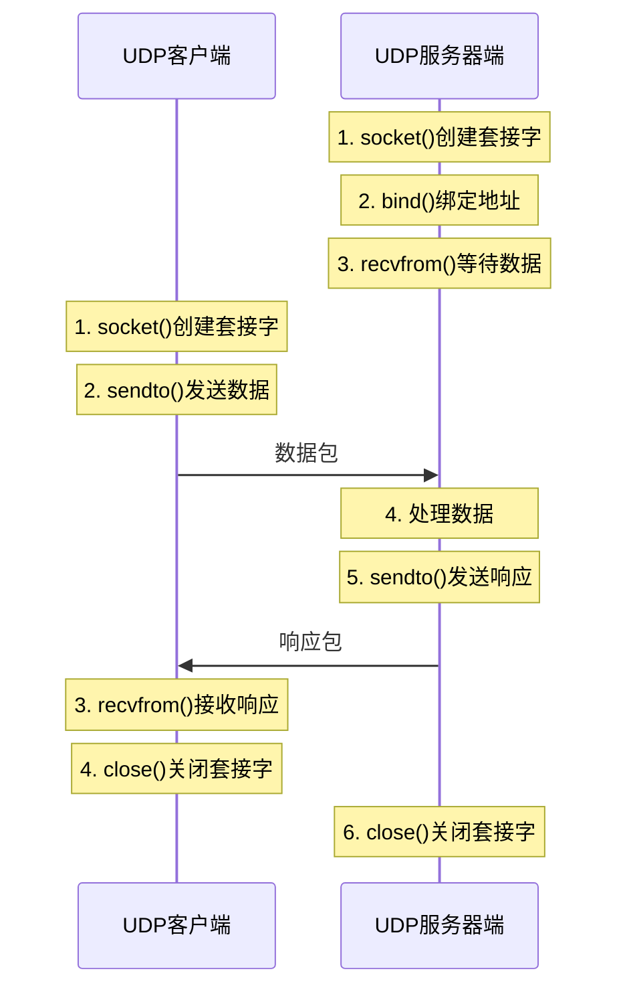

# 7.2 UDP协议原理与应用

## 目录

### 基础理论篇
1. [UDP协议概述](#1-udp协议概述)
2. [UDP报文格式详解](#2-udp报文格式详解)
3. [UDP协议特性分析](#3-udp协议特性分析)

### 应用实践篇
4. [UDP典型应用场景](#4-udp典型应用场景)
   
---

## 1. UDP协议概述

### 1.1 UDP协议基本概念

> **用户数据报协议（User Datagram Protocol，UDP）**
> 
> 一种无连接的传输层协议，提供面向事务的简单不可靠信息传送服务，RFC 768定义。

#### UDP协议定位

**在传输层中的角色**：

**传输层协议对比表**：

| 协议特性 | TCP | UDP | 说明 |
|----------|-----|-----|------|
| **连接性** | 面向连接 | 无连接 | UDP无需建立连接 |
| **可靠性** | 可靠传输 | 不可靠传输 | TCP提供确认重传机制 |
| **数据单位** | 字节流 | 数据报 | UDP保持数据边界 |
| **实现复杂度** | 复杂实现 | 简单实现 | UDP协议栈简单 |
| **协议开销** | 高开销 | 低开销 | UDP头部仅8字节 |


**极简主义设计原则**：
- **最小化协议开销**
- **最大化传输效率**
- **将复杂性留给应用层处理**
- **提供基础的传输服务**

### 1.2 UDP协议历史与发展

#### 发展历程

**UDP协议发展历程**：

**1980年 - RFC 768发布**：
- 定义基本报文格式
- 明确无连接传输模型  
- 确立简单性设计原则

**1989年 - TCP/IP标准化**：
- 成为Internet标准协议
- 广泛应用于网络服务
- 与TCP形成互补关系

**2000年代 - 实时应用兴起**：
- VoIP通信大规模应用
- 在线游戏快速发展
- 流媒体服务普及
- UDP重要性日益凸显

**现代发展趋势**：
- QUIC协议基于UDP构建
- WebRTC实时通信标准
- IoT设备广泛应用
- 边缘计算场景增多

---

## 2. UDP报文格式详解

### 2.1 UDP头部结构

> **UDP头部（UDP Header）**
> 
> 固定8字节长度，包含源端口、目标端口、长度和校验和四个字段，是所有传输层协议中最简单的头部结构。

#### UDP报文格式图

**UDP头部结构图（RFC 768）**：

```
0                   1                   2                   3
0 1 2 3 4 5 6 7 8 9 0 1 2 3 4 5 6 7 8 9 0 1 2 3 4 5 6 7 8 9 0 1
────────────────────────────────────────────────────────────────
        源端口号(16)             │       目标端口号(16)         
────────────────────────────────────────────────────────────────
         长度(16)                │         校验和(16)           
────────────────────────────────────────────────────────────────
                            
                            数据                               
                           (变长)                              

────────────────────────────────────────────────────────────────
```

### 2.2 字段详细说明

#### 各字段功能

**字段分析表**：

| 字段名 | 长度 | 功能描述 | 取值范围 | 408重点 |
|--------|------|----------|----------|-------------|
| **源端口** | 16位 | 发送进程端口号 | 0-65535 | ⭐⭐⭐⭐⭐ |
| **目标端口** | 16位 | 接收进程端口号 | 0-65535 | ⭐⭐⭐⭐⭐ |
| **长度** | 16位 | UDP头部+数据长度 | 8-65535字节 | ⭐⭐⭐⭐ |
| **校验和** | 16位 | 差错检测 | 0-65535 | ⭐⭐⭐⭐ |

#### 长度字段计算

**UDP长度字段计算规则**：

**计算公式**：
$$UDP长度 = UDP头部长度 + 数据长度 = 8 + 数据长度$$

**取值范围**：
- **最小值**：8字节（仅头部，无数据）
- **最大值**：65535字节（理论最大）
- **实际限制**：受IP数据包最大长度限制

**计算示例**：
```
数据长度：1000字节
UDP长度 = 8 + 1000 = 1008字节
```

### 2.3 校验和计算

#### 校验和机制

> **UDP校验和（UDP Checksum）**
> 
> 用于检测UDP头部和数据在传输过程中是否发生错误，基于伪头部、UDP头部和数据的16位二进制反码求和计算。

**UDP校验和计算步骤**：

**步骤1：构造伪头部**
- 源IP地址（4字节）
- 目标IP地址（4字节）
- 协议号（1字节，UDP=17）
- 保留字段（1字节，全0）
- UDP长度（2字节）

**步骤2：组织校验数据**
- 伪头部（12字节）
- UDP头部（8字节，校验和字段暂置0）
- UDP数据（变长）

**步骤3：计算校验和**
- 将数据按16位分组
- 进行二进制求和
- 将进位加到结果上
- 对结果取反码

#### 校验和验证

**接收方校验和验证步骤**：
1. **按相同方法构造伪头部**
2. **包含接收到的校验和字段**
3. **计算整个数据的校验和**
4. **检查结果是否为全1（0xFFFF）**
5. **如果不是全1，说明数据有错误**

---

## 3. UDP协议特性分析

### 3.1 UDP核心特性

#### 无连接特性

**UDP无连接通信时序图**：



**无连接的优势**：
- **快速启动**：无需连接建立开销
- **简单实现**：协议栈实现简单
- **低延迟**：减少握手延迟
- **资源节约**：不需要维护连接状态

#### 不可靠传输

**UDP不提供的服务特性**：
- ❌ **数据交付确认**
- ❌ **数据重传机制**
- ❌ **数据有序保证**
- ❌ **数据完整性保证**
- ❌ **流量控制机制**
- ❌ **拥塞控制机制**

### 3.2 UDP的优势与局限

#### 主要优势

**UDP性能优势分析**：

**1. 低延迟传输**
- 无连接建立延迟
- 无拥塞控制延迟
- 无重传等待延迟

**2. 高传输效率**
- 头部开销小（仅8字节）
- 无状态维护开销
- 无复杂控制算法

**3. 简单实现**
- 协议逻辑简单
- 实现代码少
- 调试容易

#### 主要局限

**UDP协议局限性分析**：

**1. 可靠性不足**
- 数据可能丢失
- 数据可能重复
- 数据可能失序

**2. 网络友好性差**
- 无拥塞控制
- 可能加重网络拥塞
- 与TCP竞争不公平

**3. 应用层负担重**
- 需要自行实现可靠性
- 需要自行处理重复和失序
- 增加应用程序复杂度

### 3.3 UDP与TCP的详细对比

#### 全方位对比

**综合对比表**：

| 比较维度 | UDP | TCP | 应用建议 |
|----------|-----|-----|----------|
| **连接性** | 无连接 | 面向连接 | 短连接选UDP |
| **可靠性** | 不可靠 | 可靠传输 | 重要数据选TCP |
| **有序性** | 不保证 | 保证有序 | 有序要求选TCP |
| **头部大小** | 8字节 | 20-60字节 | 带宽受限选UDP |
| **传输效率** | 高 | 中等 | 实时应用选UDP |
| **实现复杂度** | 简单 | 复杂 | 快速开发选UDP |
| **网络友好性** | 差 | 好 | 网络负载高选TCP |

---

## 4. UDP典型应用场景

### 4.1 域名系统（DNS）

#### DNS使用UDP的原因

**DNS选择UDP的优势分析**：

**1. 查询简单快速**
- 大多数查询单个数据包即可
- 无需连接建立开销
- 响应时间要求严格

**2. 服务器负载考虑**
- DNS服务器处理海量查询
- TCP连接状态维护开销大
- UDP无状态处理效率高

**3. 网络资源优化**
- 减少网络连接数
- 降低服务器内存占用
- 提高并发处理能力

#### DNS的可靠性保证

**DNS应用层可靠性保证机制**：

**1. 客户端超时重传**
- 设置查询超时时间
- 超时自动重新查询
- 多次重试后失败

**2. 多服务器冗余**
- 配置多个DNS服务器
- 主服务器失败时切换
- 提高查询成功率

**3. 大查询切换TCP**
- 响应超过512字节时
- 自动切换到TCP传输
- 保证大数据传输可靠性

### 4.2 实时音视频通信

#### VoIP和视频会议

**实时通信对传输层的特殊要求**：

**延迟敏感性**：
- 语音通信：< 150ms可接受
- 视频通信：< 200ms可接受
- 超时重传不如丢弃处理

**丢包容忍性**：
- 音频：5%丢包率可接受
- 视频：1-2%丢包率可接受
- 编码算法可容错处理

**带宽效率**：
- 避免重传占用额外带宽
- 实时性比完整性更重要
- 适应网络带宽变化

### 4.3 在线游戏

#### 游戏网络通信特点

**在线游戏对UDP的网络需求**：

**实时性要求**：
- 玩家动作需要立即响应
- 延迟影响游戏体验
- 网络抖动要求平滑处理

**频繁通信**：
- 位置更新频率高（60fps）
- 状态同步数据量大
- TCP连接开销过大

**容错能力**：
- 丢失过时数据可以忽略
- 最新状态更重要
- 插值算法弥补丢包

### 4.4 网络管理协议（SNMP）

#### SNMP使用UDP的考量

**SNMP使用UDP的优势分析**：

**1. 简单查询响应模型**
- 大部分操作是简单的get/set
- 请求响应数据量小
- 无需复杂的连接管理

**2. 网络管理的可靠性要求**
- 网络故障时TCP连接可能中断
- UDP无连接状态，故障恢复快
- 避免管理流量影响业务流量

**3. 轻量级协议设计**
- 网络设备资源有限
- 减少协议处理开销
- 提高管理效率

