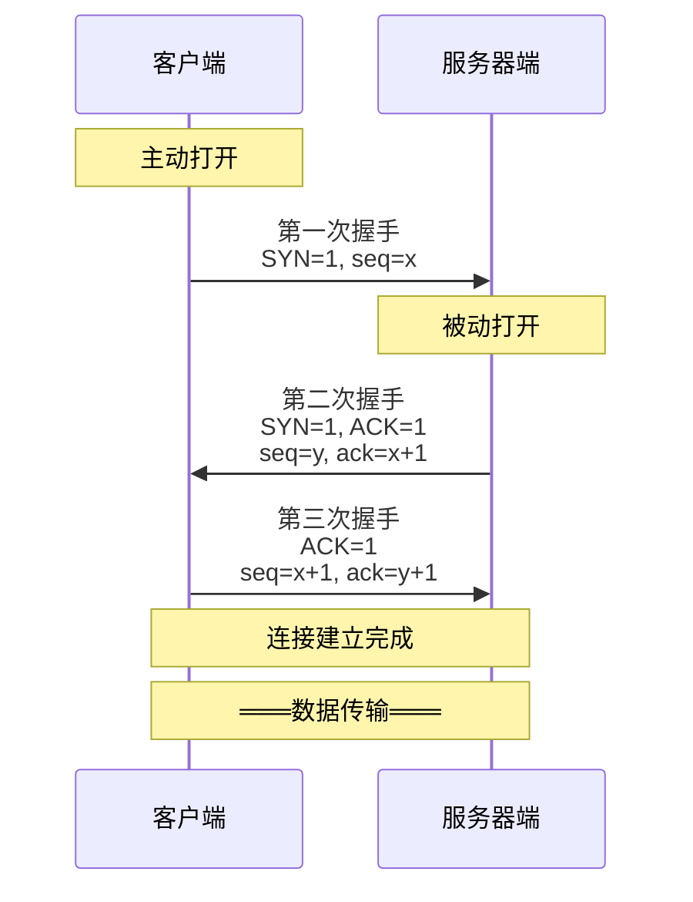
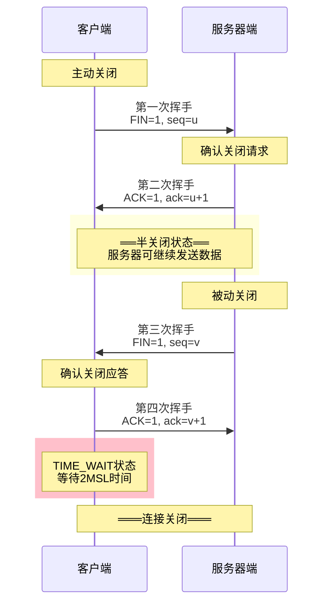

# 7.3 TCP协议基础与连接管理
 
## 目录

### 基础理论篇
1. [TCP协议概述](#1-tcp协议概述)
2. [TCP报文格式详解](#2-tcp报文格式详解)
3. [TCP连接的概念](#3-tcp连接的概念)

### 连接管理篇
4. [TCP连接建立三次握手](#4-tcp连接建立三次握手)
5. [TCP连接释放四次挥手](#5-tcp连接释放四次挥手)
6. [TCP连接状态转换](#6-tcp连接状态转换)

### 综合应用篇
7. [TCP连接管理典型题目](#7-tcp连接管理典型题目)

---

## 1. TCP协议概述

### 1.1 TCP协议基本概念

> **传输控制协议（Transmission Control Protocol，TCP）**
> 
> 一种面向连接的、可靠的、基于字节流的传输层协议，RFC 793定义，是Internet协议族的核心协议之一。

#### TCP协议地位

**在网络体系中的重要性**：

- **应用层**：HTTP、FTP、SMTP、SSH等协议依赖TCP提供可靠传输服务
- **传输层**：TCP作为面向连接的可靠传输协议，与UDP互补
- **网络层**：TCP基于IP协议提供端到端服务
- **重要性**：几乎所有重要的Internet应用都使用TCP协议

#### TCP设计目标

**可靠传输的核心要求**：

1. **可靠数据传输**
   - 确保数据无丢失
   - 确保数据无重复
   - 确保数据无损坏
   - 确保数据按序到达

2. **流量控制**
   - 防止发送方过载接收方
   - 根据接收方能力调节发送速度

3. **拥塞控制**
   - 防止网络过载
   - 公平共享网络资源
   - 避免拥塞崩溃

4. **连接管理**
   - 建立可靠的端到端连接
   - 维护连接状态
   - 优雅地释放连接

### 1.2 TCP协议特点

#### 面向连接

**连接导向的通信模型**：

- **通信前**：必须建立连接
- **通信中**：维护连接状态
- **通信后**：正确释放连接

**连接三要素**：
- 源IP地址 + 源端口号
- 目标IP地址 + 目标端口号  
- 连接标识（序号等状态信息）

#### 可靠传输

**可靠性保证机制**：

1. **序号机制**
   - 每个字节分配序号
   - 保证数据按序重组

2. **确认应答**
   - 接收方确认收到数据
   - 发送方确认传输成功

3. **重传机制**
   - 超时重传丢失数据
   - 快速重传机制

4. **流量控制**
   - 滑动窗口机制
   - 防止接收方溢出

5. **拥塞控制**
   - 慢启动算法
   - 拥塞避免算法
   - 快重传快恢复

---

## 2. TCP报文格式详解

### 2.1 TCP头部结构

> **TCP头部（TCP Header）**
> 
> 标准长度20字节，最大可达60字节（包含选项），包含源端口、目标端口、序号、确认号、窗口大小等关键字段。

#### TCP报文格式图

**TCP头部结构图（RFC 793）**：

```
0                   1                   2                   3
0 1 2 3 4 5 6 7 8 9 0 1 2 3 4 5 6 7 8 9 0 1 2 3 4 5 6 7 8 9 0 1
────────────────────────────────────────────────────────────────
        源端口号(16)             │        目标端口号(16)        
────────────────────────────────────────────────────────────────
                            序号(32)                           
────────────────────────────────────────────────────────────────
                           确认号(32)                          
────────────────────────────────────────────────────────────────
首长(4)│保留(6)│U│A│P│R│S│F│            窗口大小(16)          
       │       │R│C│S│S│Y│I│                                 
       │       │G│K│H│T│N│N│                                
────────────────────────────────────────────────────────────────
        校验和(16)               │        紧急指针(16)           
────────────────────────────────────────────────────────────────
                            
                   选项(0-40字节) + 填充                       
                         (变长)                              

────────────────────────────────────────────────────────────────
                            
                            数据                               
                           (变长)                              

────────────────────────────────────────────────────────────────
```

### 2.2 关键字段详解

#### 序号和确认号

**序号机制**：

**序号（Sequence Number）特点**：
- 32位字段，标识数据流中的位置
- 以字节为单位进行编号
- 初始序号（ISN）随机选择
- 范围：0 ~ 2³² - 1

**确认号（Acknowledgment Number）特点**：
- 32位字段，期望收到的下一字节序号
- 仅在ACK=1时有效
- 累积确认机制
- 确认号 = 收到序号 + 数据长度

**计算示例**：
- 发送：seq=100, 数据长度=50字节
- 接收：ack=150（期望收到序号150的数据）

#### 标志位详解

**控制标志位**：

| 标志位 | 名称 | 功能描述 | 408重要性 |
|--------|------|----------|---------------|
| **URG** | 紧急 | 紧急指针有效 | ⭐⭐ |
| **ACK** | 确认 | 确认号有效 | ⭐⭐⭐⭐⭐ |
| **PSH** | 推送 | 立即推送数据 | ⭐⭐ |
| **RST** | 复位 | 重置连接 | ⭐⭐⭐⭐ |
| **SYN** | 同步 | 建立连接 | ⭐⭐⭐⭐⭐ |
| **FIN** | 结束 | 关闭连接 | ⭐⭐⭐⭐⭐ |

#### 窗口大小字段

**流量控制核心**：

**窗口大小（Window Size）特点**：
- 16位字段，取值范围0-65535
- 表示接收方愿意接收的字节数
- 用于流量控制
- 动态调整接收窗口大小

**窗口缩放选项**：
- 扩展窗口大小到1GB
- 实际窗口 = 窗口字段 × 2^缩放因子
- 在连接建立时协商

---

## 3. TCP连接的概念

### 3.1 TCP连接定义

> **TCP连接（TCP Connection）**
> 
> 两个TCP实体之间的虚拟电路，由通信双方的IP地址和端口号四元组唯一标识，提供全双工的可靠字节流服务。

#### 连接标识

**连接四元组**：

**TCP连接唯一标识**： `连接 = (源IP, 源端口, 目标IP, 目标端口)`

**示例**：
- 客户端：192.168.1.100:3000
- 服务器：10.0.0.1:80
- 连接标识：(192.168.1.100, 3000, 10.0.0.1, 80)

**注意**：四元组中任何一个元素不同，就是不同的连接

### 3.2 TCP连接特性

#### 全双工通信

**双向数据流**：

**TCP全双工通信特点**：
- 两个方向独立的数据流
- 各自的序号空间
- 各自的流量控制
- 各自的拥塞控制

**数据传输方向**：
- 客户端 → 服务器端（数据流1）
- 客户端 ← 服务器端（数据流2）

#### 字节流服务

**流式数据传输**：

**TCP字节流特性示例**：
- **应用层视图**：应用数据："Hello World!"
- **传输层处理**：每个字符分配独立序号（H=1, e=2, l=3, ...）

**重要特点**：
- 无消息边界保护
- 接收方可能分多次接收
- 应用层需要自行处理消息边界

---

## 4. TCP连接建立：三次握手

### 4.1 三次握手过程

> **三次握手（Three-Way Handshake）**
> 
> TCP连接建立过程，通过三次报文交换确认双方的发送和接收能力，建立可靠的双向通信连接。

#### 握手过程详解

**三次握手时序图**：



#### 各次握手详细分析

**第一次握手**：

**客户端 → 服务器端**

**报文字段**：
- SYN = 1（请求建立连接）
- seq = x（初始序号）
- ACK = 0（确认号无效）
- 数据长度 = 0（不携带应用数据）

**作用**：
- 请求建立连接
- 告知服务器客户端初始序号
- 测试网络连通性

**第二次握手**：

**服务器端 → 客户端**

**报文字段**：
- SYN = 1（请求建立连接）
- ACK = 1（确认有效）
- seq = y（服务器初始序号）
- ack = x + 1（确认客户端序号）
- 数据长度 = 0（不携带应用数据）

**作用**：
- 确认收到客户端连接请求
- 告知客户端服务器初始序号
- 同时请求建立反向连接

**第三次握手**：

**客户端 → 服务器端**

**报文字段**：
- SYN = 0（连接建立请求完成）
- ACK = 1（确认有效）
- seq = x + 1（客户端下一序号）
- ack = y + 1（确认服务器序号）
- 数据长度 ≥ 0（可携带应用数据）

**作用**：
- 确认收到服务器连接应答
- 完成连接建立
- 可以开始发送应用数据

### 4.2 为什么需要三次握手

#### 防止历史连接

**问题场景分析**：

**场景**：网络延迟导致的历史连接请求

**时间线**：
1. T1：客户端发送SYN1（因网络拥塞延迟）
2. T2：客户端超时，发送SYN2，正常建立连接
3. T3：连接正常使用后关闭
4. T4：SYN1终于到达服务器

**如果是两次握手的问题**：
- 服务器收到SYN1，直接建立连接
- 但客户端已不存在对应状态
- 造成资源浪费和状态混乱

**三次握手的解决方案**：
- 服务器发送SYN+ACK响应SYN1
- 客户端不会发送第三次握手
- 服务器超时关闭错误连接

#### 确认双方收发能力

**能力确认分析**：

**第一次握手后**：
- 服务器确认：客户端发送能力正常
- 服务器确认：自己接收能力正常

**第二次握手后**：
- 客户端确认：自己发送能力正常
- 客户端确认：自己接收能力正常
- 客户端确认：服务器发送能力正常
- 客户端确认：服务器接收能力正常

**第三次握手后**：
- 服务器确认：自己发送能力正常
- 服务器确认：客户端接收能力正常
- 双方完全确认四种基本能力

### 4.3 三次握手异常情况

#### 超时重传

**握手超时处理**：

**第一次握手超时**：
- 客户端重传SYN报文
- 指数退避算法
- 重传次数限制后放弃

**第二次握手超时**：
- 服务器重传SYN+ACK报文
- 客户端可能重传SYN
- 两端都有超时重传

**第三次握手丢失**：
- 服务器等待ACK超时
- 服务器重传SYN+ACK
- 客户端已认为连接建立

---

## 5. TCP连接释放：四次挥手

### 5.1 四次挥手过程

> **四次挥手（Four-Way Handshake）**
> 
> TCP连接释放过程，由于TCP全双工特性，需要分别关闭两个方向的数据流，因此需要四次报文交换。

#### 挥手过程详解

**四次挥手时序图**：



#### 各次挥手详细分析

**第一次挥手（FIN）**：

**客户端 → 服务器端**

**报文字段**：
- FIN = 1（请求关闭连接）
- seq = u（序号）
- ACK = 1（可能携带确认）
- 数据长度 = 0（通常无数据）

**作用**：
- 请求关闭发送方向
- 表示不再发送数据
- 仍可接收数据

**第二次挥手（ACK）**：

**服务器端 → 客户端**

**报文字段**：
- FIN = 0（还未请求关闭）
- ACK = 1（确认关闭请求）
- seq = v（服务器序号）
- ack = u + 1（确认FIN消费1序号）

**作用**：
- 确认收到关闭请求
- 进入半关闭状态
- 可继续发送剩余数据

### 5.2 半关闭状态

#### 半关闭的特点

**半关闭状态分析**：

**客户端状态：FIN_WAIT_2**
- 已发送FIN，等待对方FIN
- 不能发送数据
- 可以接收数据

**服务器状态：CLOSE_WAIT**
- 已收到对方FIN，发送了ACK
- 可以继续发送数据
- 处理剩余数据和清理工作

**数据流方向**：
- 客户端 ← 服务器端（可发送）
- 客户端 →X 服务器端（已关闭）

### 5.3 TIME_WAIT状态

#### TIME_WAIT的作用

**TIME_WAIT状态分析**：

**持续时间**：
- 2MSL（2倍最大段生存时间）
- 典型值：2-4分钟

**主要作用**：
1. 确保最后的ACK能到达对方
2. 防止历史连接数据干扰新连接
3. 允许网络中的重复数据包消失

**存在问题**：
- 占用端口资源
- 大量TIME_WAIT影响性能
- 高并发服务器的挑战

---

## 6. TCP连接状态转换

### 6.1 TCP状态转换图

#### 完整状态图

**TCP状态转换图（408必掌握）**：
```
TCP连接状态转换图
                       主动打开
           CLOSED ─────────────────► SYN_SENT
              │                         │
         被动打开│                       │收到SYN+ACK
              │                         │发送ACK
              ▼                         ▼
           LISTEN ────────────────► ESTABLISHED
              │           收到SYN        │
              │           发送SYN+ACK    │
              ▼                         │
          SYN_RCVD ─────────────────────┘
              │           收到ACK
              │
              
连接释放：        
                      主动关闭
         ESTABLISHED ──────────────► FIN_WAIT_1
              │                         │
         被动关闭│                       │收到ACK
              │                         ▼
              ▼                    FIN_WAIT_2
         CLOSE_WAIT                     │
              │                         │收到FIN
              │发送FIN                   │发送ACK
              ▼                         ▼
          LAST_ACK ───────────────► TIME_WAIT
              │       收到ACK            │
              │                      等待2MSL
              ▼                         ▼
           CLOSED ◄─────────────────CLOSED
```

### 6.2 关键状态详解

#### 连接建立状态

**建立过程状态**：

| 状态 | 描述 | 触发条件 | 后续状态 |
|------|------|----------|----------|
| **CLOSED** | 连接不存在 | 初始状态 | LISTEN/SYN_SENT |
| **LISTEN** | 监听连接请求 | 被动打开 | SYN_RCVD |
| **SYN_SENT** | 已发送连接请求 | 主动打开 | ESTABLISHED |
| **SYN_RCVD** | 收到连接请求 | 收到SYN | ESTABLISHED |
| **ESTABLISHED** | 连接已建立 | 三次握手完成 | FIN_WAIT_1/CLOSE_WAIT |

#### 连接释放状态

**释放过程状态**：

| 状态 | 描述 | 持续时间 |
|------|------|----------|
| **FIN_WAIT_1** | 已发送FIN | 短暂 | 
| **FIN_WAIT_2** | 收到FIN的ACK | 可能较长 | 
| **CLOSE_WAIT** | 收到对方FIN | 取决于应用 | 
| **LAST_ACK** | 已发送FIN | 短暂 |
| **TIME_WAIT** | 等待数据包消失 | 2MSL |

---

## 7. TCP连接管理典型题目

### 7.1 三次握手计算题

#### 典型例题

**例题1：三次握手序号计算**

**【408真题类型】**

**题目**：某TCP连接建立过程中，客户端发送的第一个SYN报文段的序号为1000，服务器响应的SYN+ACK报文段的序号为2000，确认号为1001。问：客户端发送的第三个报文段的序号和确认号分别是多少？

**解答过程**：

1. **第一次握手**：客户端 → 服务器：SYN=1, seq=1000
2. **第二次握手**：服务器 → 客户端：SYN=1, ACK=1, seq=2000, ack=1001
3. **第三次握手**：客户端 → 服务器：ACK=1, seq=1001, ack=2001

**答案**：序号=1001，确认号=2001

### 7.2 四次挥手分析题

#### 状态转换分析

**例题2：连接释放状态分析**

**【408真题类型】**

**题目**：在TCP四次挥手过程中，主动关闭方在发送FIN后，可能处于哪些状态？每个状态的持续时间特点是什么？

**解答**：

**主动关闭方状态序列**：

1. **FIN_WAIT_1**
   - 发送FIN后等待ACK
   - 持续时间：通常很短
   - 网络正常情况下快速转换

2. **FIN_WAIT_2**
   - 收到ACK，等待对方FIN
   - 持续时间：取决于对方处理速度
   - 可能较长，需要超时机制

3. **TIME_WAIT**
   - 收到FIN，发送ACK后
   - 持续时间：固定2MSL
   - 确保连接完全关闭

4. **CLOSED**
   - 连接完全关闭
   - 资源完全释放

### 7.3 异常情况分析

#### 连接异常处理

**例题3：握手异常分析**

**【408重点】**

**题目**：如果TCP三次握手中的第三次握手报文丢失，客户端和服务器分别会发生什么？

**分析**：

**客户端行为**：
- 认为连接已经建立
- 进入ESTABLISHED状态
- 可以开始发送应用数据
- 应用数据中包含ACK信息

**服务器行为**：
- 停留在SYN_RCVD状态
- 等待第三次握手ACK
- 超时后重传SYN+ACK
- 多次重传失败后关闭连接

**最终结果**：
- 如果客户端发送数据，服务器收到后会正确处理并进入ESTABLISHED
- 如果客户端不发送数据，服务器超时关闭连接，客户端首次发送数据时会收到RST报文
