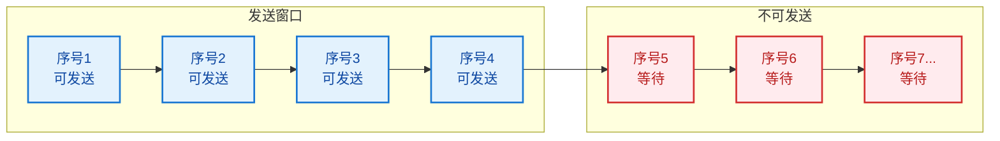
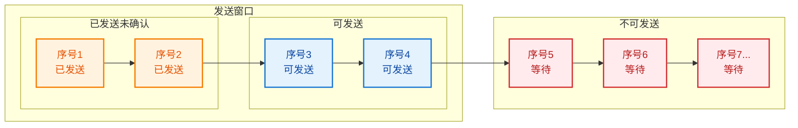
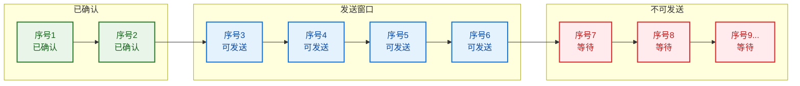
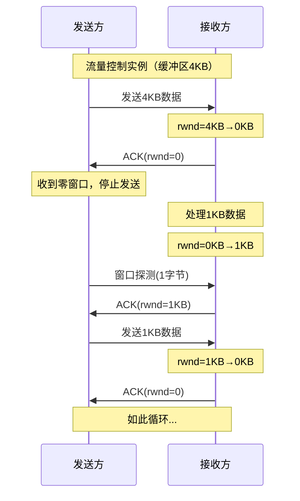
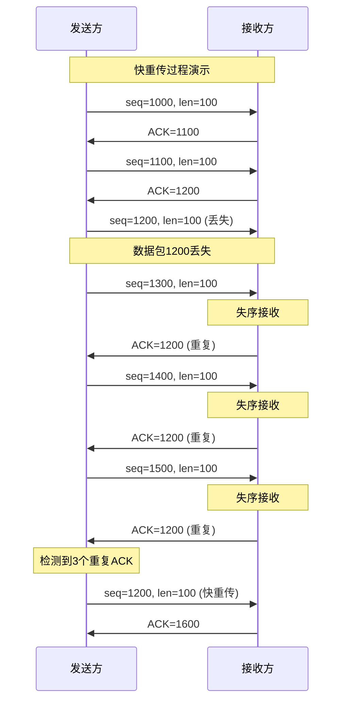

# 7.4 TCP流量控制与拥塞控制
 
## 目录

### 流量控制篇
1. [TCP流量控制概述](#1-tcp流量控制概述)
2. [滑动窗口机制](#2-滑动窗口机制)
3. [流量控制算法](#3-流量控制算法)

### 拥塞控制篇
4. [TCP拥塞控制原理](#4-tcp拥塞控制原理)
5. [慢启动算法](#5-慢启动算法)
6. [拥塞避免算法](#6-拥塞避免算法)
7. [快重传与快恢复](#7-快重传与快恢复)

### 综合应用篇
8. [流量控制与拥塞控制计算题](#8-流量控制与拥塞控制计算题)

---

## 1. TCP流量控制概述

### 1.1 流量控制的定义

> **流量控制（Flow Control）**
> 
> 控制发送方的发送速率，使其不超过接收方的处理能力，防止接收方缓冲区溢出，确保数据传输的可靠性。

#### 流量控制的目标

**核心目标**：

1. **防止接收方溢出**
   - 发送速率 ≤ 接收处理能力
   - 保护接收方缓冲区

2. **提高传输效率**
   - 充分利用接收方能力
   - 避免不必要的延迟

3. **适应能力变化**
   - 动态调整发送窗口
   - 响应接收方状态变化

### 1.2 流量控制与拥塞控制的区别

#### 概念对比

**流量控制 vs 拥塞控制**：

| 维度 | 流量控制 | 拥塞控制 |
|------|----------|----------|
| **控制对象** | 接收方处理能力 | 网络承载能力 |
| **控制目标** | 防止接收方溢出 | 防止网络拥塞 |
| **控制范围** | 端到端 | 整个网络 |
| **反馈机制** | 接收窗口大小 | 丢包和延迟 |
| **算法复杂度** | 相对简单 | 相对复杂 |
| **实现位置** | 接收方主导 | 发送方主导 |

---

## 2. 滑动窗口机制

### 2.1 滑动窗口基本概念

> **滑动窗口（Sliding Window）**
> 
> TCP流量控制的核心机制，通过动态调整发送窗口大小来控制发送方的发送速率，实现流量控制和可靠传输。

#### 窗口结构

**发送方窗口结构**：

```mermaid
graph LR
    subgraph 已确认区域
        A1[序号1<br/>已确认]
        A2[序号2<br/>已确认]
    end
    
    subgraph 发送窗口
        subgraph 已发送未确认
            B1[序号3<br/>已发送]
            B2[序号4<br/>已发送]
            B3[序号5<br/>已发送]
            B4[序号6<br/>已发送]
        end
        
        subgraph 可发送未发送
            C1[序号7<br/>可发送]
            C2[序号8<br/>可发送]
        end
    end
    
    subgraph 不可发送区域
        D1[序号9<br/>不可发送]
        D2[序号10<br/>不可发送]
        D3[序号11...<br/>不可发送]
    end
    
    A1 --> A2
    A2 --> B1
    B1 --> B2
    B2 --> B3
    B3 --> B4
    B4 --> C1
    C1 --> C2
    C2 --> D1
    D1 --> D2
    D2 --> D3
    
    style A1 fill:#e8f5e8,stroke:#2e7d32,stroke-width:2px,color:#1b5e20
    style A2 fill:#e8f5e8,stroke:#2e7d32,stroke-width:2px,color:#1b5e20
    style B1 fill:#fff3e0,stroke:#f57c00,stroke-width:2px,color:#e65100
    style B2 fill:#fff3e0,stroke:#f57c00,stroke-width:2px,color:#e65100
    style B3 fill:#fff3e0,stroke:#f57c00,stroke-width:2px,color:#e65100
    style B4 fill:#fff3e0,stroke:#f57c00,stroke-width:2px,color:#e65100
    style C1 fill:#e3f2fd,stroke:#1976d2,stroke-width:2px,color:#0d47a1
    style C2 fill:#e3f2fd,stroke:#1976d2,stroke-width:2px,color:#0d47a1
    style D1 fill:#ffebee,stroke:#d32f2f,stroke-width:2px,color:#b71c1c
    style D2 fill:#ffebee,stroke:#d32f2f,stroke-width:2px,color:#b71c1c
    style D3 fill:#ffebee,stroke:#d32f2f,stroke-width:2px,color:#b71c1c
```

**窗口组成说明**：

| 区域类型 | 状态描述 | 操作权限 |
|----------|----------|----------|
| 已确认区域 | 数据已被接收方确认 | 可从缓冲区删除 |
| 已发送未确认 | 数据已发送但未收到ACK | 等待确认，可能需要重传 |
| 可发送未发送 | 窗口范围内可发送的数据 | 可立即发送 |
| 不可发送区域 | 超出窗口限制的数据 | 等待窗口滑动后发送 |

#### 窗口滑动过程

**窗口滑动示例**：

**阶段1：初始状态（窗口大小=4）**

**阶段2：发送数据1、2后**

**阶段3：收到ACK确认1、2后窗口滑动**

**滑动机制**：窗口向右滑动，已确认的数据移出窗口，新的序号进入可发送范围

### 2.2 接收窗口通告

#### 窗口大小计算

**接收窗口计算公式**：

$$rwnd = 接收缓冲区大小 - 已接收未处理数据量$$

**计算示例**：
- 接收缓冲区总大小：8192字节
- 已接收未处理数据：2048字节
- 接收窗口大小：$rwnd = 8192 - 2048 = 6144$ 字节

**发送方实际窗口**：
$$发送窗口 = \min(rwnd, cwnd)$$

其中：$rwnd$ 为接收窗口，$cwnd$ 为拥塞窗口

#### 零窗口问题

**零窗口处理机制**：

**问题描述**：
- 接收方处理能力不足
- 接收窗口变为0
- 发送方停止发送数据
- 可能导致死锁

**解决机制：窗口探测**
- 发送方定期发送探测报文
- 探测报文只有1字节数据
- 接收方回复当前窗口大小
- 窗口恢复后继续传输

---

## 3. 流量控制算法

### 3.1 基于窗口的流量控制

#### 算法描述

**流量控制算法流程**：

1. **接收方计算可用窗口大小**
   - $rwnd = 缓冲区大小 - 已缓冲数据$

2. **在TCP头部通告窗口大小**
   - Window字段 = $rwnd$

3. **发送方调整发送窗口**
   - $发送窗口 = \min(rwnd, cwnd)$

4. **控制发送数据量**
   - $未确认数据量 \leq 发送窗口大小$

5. **动态调整**
   - 根据ACK中的窗口大小调整

### 3.2 流量控制实例分析

#### 典型场景

**流量控制工作示例**：

**关键参数**：
- 接收缓冲区大小：4KB
- 每次处理数据：1KB  
- 网络往返时延：100ms

---

## 4. TCP拥塞控制原理

### 4.1 网络拥塞的概念

> **网络拥塞（Network Congestion）**
> 
> 当网络中的数据流量超过网络承载能力时，导致数据包丢失、延迟增加、吞吐量下降的现象。

#### 拥塞的表现

**拥塞征象**：

1. **数据包丢失**
   - 路由器缓冲区溢出
   - 丢包率增加

2. **传输延迟增加**
   - 排队延迟增长
   - RTT时间增大

3. **吞吐量下降**
   - 有效数据传输减少
   - 重传开销增加

4. **网络不稳定**
   - 性能抖动
   - 连接中断

### 4.2 拥塞控制的目标

#### 设计目标

**拥塞控制目标**：

1. **避免网络拥塞**
   - 防止网络过载
   - 维持网络稳定

2. **充分利用网络**
   - 最大化网络吞吐量
   - 提高传输效率

3. **公平共享资源**
   - 多个连接公平竞争
   - 避免某些连接垄断

4. **快速响应变化**
   - 快速检测拥塞
   - 快速恢复传输

---

## 5. 慢启动算法

### 5.1 慢启动基本原理

> **慢启动（Slow Start）**
> 
> TCP拥塞控制的基础算法，连接建立或发生超时后，拥塞窗口从小值开始指数增长，逐步探测网络容量。

#### 算法描述

**慢启动算法流程**：

1. **初始化拥塞窗口**
   - $cwnd = 1 \times MSS$（最大段大小）
   
2. **每收到一个ACK**
   - $cwnd = cwnd + 1 \times MSS$
   
3. **指数增长模式**
   - RTT轮次0：$cwnd = 1$
   - RTT轮次1：$cwnd = 2$  
   - RTT轮次2：$cwnd = 4$
   - RTT轮次3：$cwnd = 8$
   - RTT轮次n：$cwnd = 2^n$
   
4. **增长限制**
   - 当 $cwnd \geq ssthresh$ 时转入拥塞避免

#### 慢启动过程图

**慢启动过程演示**：

| RTT轮次 | 拥塞窗口(MSS) | 发送段数 | 窗口增长 |
|---------|--------------|----------|----------|
| 0 | 1 | 1 | 1→2 |
| 1 | 2 | 2 | 2→4 |
| 2 | 4 | 4 | 4→8 |
| 3 | 8 | 8 | 8→16 |
| 4 | 16 | 16 | 16→32 |
| ... | ... | ... | ... |

**特点**：
- **指数增长**：每个RTT窗口翻倍
- **快速探测**：迅速找到网络容量
- **保守开始**：避免一开始就拥塞网络

### 5.2 慢启动门限

#### ssthresh的作用

**慢启动门限（ssthresh）**：

**定义与作用**：
- 区分慢启动和拥塞避免的边界值
- 初始值通常为65536字节
- 发生拥塞时更新

**工作机制**：
- $cwnd < ssthresh$：慢启动模式
- $cwnd \geq ssthresh$：拥塞避免模式
- 发生超时：$ssthresh = cwnd/2$

---

## 6. 拥塞避免算法

### 6.1 拥塞避免基本原理

> **拥塞避免（Congestion Avoidance）**
> 
> 当拥塞窗口达到慢启动门限后，采用线性增长策略，谨慎地增加发送速率，避免引起网络拥塞。

#### 算法描述

**拥塞避免算法**：

1. **触发条件**
   - $cwnd \geq ssthresh$
   
2. **线性增长规则**
   - 每收到一个ACK：$cwnd = cwnd + \frac{1}{cwnd} \times MSS$
   
3. **增长效果**
   - 每个RTT轮次：$cwnd$ 增加1个MSS
   
4. **增长模式对比**
   - 慢启动：指数增长（$cwnd$ 翻倍）
   - 拥塞避免：线性增长（$cwnd+1$）

#### 拥塞避免过程

**线性增长演示**：

假设 $ssthresh = 8 \times MSS$

| RTT轮次 | 拥塞窗口(MSS) | 增长方式 |
|---------|--------------|----------|
| 0 | 8 | 到达门限 |
| 1 | 9 | 线性+1 |
| 2 | 10 | 线性+1 |
| 3 | 11 | 线性+1 |
| 4 | 12 | 线性+1 |
| ... | ... | ... |

**实现细节**：
- 每收到ACK时：$cwnd += \frac{MSS}{cwnd}$
- 收到8个ACK后，$cwnd$ 从8增长到9
- 收到9个ACK后，$cwnd$ 从9增长到10

---

## 7. 快重传与快恢复

### 7.1 快重传算法

> **快重传（Fast Retransmit）**
> 
> 当发送方收到3个重复ACK时，立即重传对应的数据段，而不等待重传定时器超时，提高重传效率。

#### 算法原理

**快重传机制**：

1. **重复ACK检测**
   - 接收方收到失序段时发送重复ACK
   - 发送方统计重复ACK数量
   
2. **触发条件**
   - 收到3个连续重复ACK
   - 立即重传对应数据段
   
3. **工作流程**
   - 发送：seq=100, 200, 300, 400
   - 接收：收到100, 300（200丢失）
   - 响应：ACK=200, ACK=200, ACK=200
   - 重传：立即重传seq=200数据

#### 快重传示例

**快重传时序图**：

### 7.2 快恢复算法

> **快恢复（Fast Recovery）**
> 
> 快重传后不进入慢启动，而是将拥塞窗口设为慢启动门限值，直接进入拥塞避免阶段，快速恢复传输速率。

#### 算法流程

**快恢复过程**：

1. **检测到拥塞（3个重复ACK）**
   - $ssthresh = cwnd / 2$
   - $cwnd = ssthresh + 3$
   
2. **快重传丢失的段**
   - 立即重传丢失数据
   
3. **每收到重复ACK**
   - $cwnd = cwnd + 1$
   - 可以发送新数据
   
4. **收到新ACK**
   - $cwnd = ssthresh$
   - 进入拥塞避免阶段

#### 快恢复优势

**算法优势**：

**传统方法（超时重传）**：
- 重传定时器超时
- $cwnd$ 重置为1
- 重新慢启动
- 恢复时间长

**快恢复方法**：
- 快速检测丢包
- $cwnd$ 减半而不是重置
- 直接拥塞避免
- 恢复时间短

---

## 8. 流量控制与拥塞控制计算题

### 8.1 滑动窗口计算

#### 典型例题

**例题1：滑动窗口计算**

> **题目**：某TCP连接的接收方窗口大小为8KB，当前已接收但未确认的数据为3KB，接收缓冲区中已处理的数据为2KB。求当前可用的接收窗口大小。

**解答过程**：

**已知条件**：
- 总窗口大小：8KB
- 已接收未确认：3KB
- 已处理数据：2KB

**计算方法**：
- 可用窗口 = 总窗口 - 已接收未处理
- 已接收未处理 = 已接收未确认 = 3KB
- 可用窗口 = 8KB - 3KB = 5KB

**答案**：当前可用接收窗口为5KB

### 8.2 拥塞控制算法计算

#### 慢启动计算

**例题2：慢启动过程计算**

> **题目**：某TCP连接的MSS为1KB，初始慢启动门限为16KB。从连接建立开始，画出前6个RTT的拥塞窗口变化图。

**解答**：

| RTT | cwnd(KB) | 状态 | 增长 |
|-----|----------|------|------|
| 0 | 1 | 慢启动 | 1→2 |
| 1 | 2 | 慢启动 | 2→4 |
| 2 | 4 | 慢启动 | 4→8 |
| 3 | 8 | 慢启动 | 8→16 |
| 4 | 16 | 拥塞避免 | 16→17 |
| 5 | 17 | 拥塞避免 | 17→18 |

**关键点**：
- RTT 0-3：$cwnd < ssthresh$，指数增长
- RTT 4开始：$cwnd \geq ssthresh$，线性增长

### 8.3 快重传快恢复计算

#### 综合算法题

**例题3：拥塞控制状态转换**

> **题目**：某TCP连接当前cwnd=20KB，ssthresh=12KB，MSS=1KB。此时发生快重传，计算快恢复过程中的窗口变化。

**解答过程**：

**检测到3个重复ACK时**：
- $ssthresh = cwnd/2 = 20/2 = 10KB$
- $cwnd = ssthresh + 3 = 10 + 3 = 13KB$

**每收到重复ACK**：
- $cwnd = cwnd + 1KB$
- 第4个重复ACK：$cwnd = 14KB$
- 第5个重复ACK：$cwnd = 15KB$

**收到新ACK时**：
- $cwnd = ssthresh = 10KB$
- 进入拥塞避免阶段

---

## 📚 深度练习题库

### 综合计算题

**例题4：复合场景分析**

> **题目**：某TCP连接的参数如下：
> - 接收缓冲区：64KB，当前占用40KB
> - MSS：1KB，RTT：100ms
> - 当前cwnd：16KB，ssthresh：32KB
> - 网络带宽：10Mbps
> 
> **问题**：
> 1. 计算当前有效发送窗口大小
> 2. 分析当前网络利用率
> 3. 如果发生3个重复ACK，计算快恢复后的窗口大小

**详细解答**：

**1. 有效发送窗口计算**：
- $rwnd = 64KB - 40KB = 24KB$
- $发送窗口 = \min(cwnd, rwnd) = \min(16KB, 24KB) = 16KB$

**2. 网络利用率分析**：
- $理论最大吞吐量 = \frac{窗口大小}{RTT} = \frac{16KB}{100ms} = 160KB/s = 1.28Mbps$
- $网络利用率 = \frac{1.28}{10} = 12.8\%$

**3. 快恢复窗口计算**：
- 快重传触发：$ssthresh = \frac{cwnd}{2} = \frac{16KB}{2} = 8KB$
- 快恢复窗口：$cwnd = ssthresh + 3 = 8KB + 3KB = 11KB$

**例题5：性能瓶颈分析**

> **题目**：某Web服务器与客户端的TCP连接出现性能问题：
> - 带宽：100Mbps，RTT：50ms
> - 服务器发送窗口：8KB
> - 客户端接收缓冲区：16KB，处理速度慢
> 
> 分析性能瓶颈并提出优化方案。

**分析过程**：

**1. 带宽时延积计算**：
- $BDP = \frac{带宽 \times RTT}{8} = \frac{100Mbps \times 50ms}{8} = 625KB$

**2. 瓶颈识别**：
- 理想窗口：625KB
- 实际窗口：$\min(8KB, 16KB) = 8KB$
- 利用率：$\frac{8KB}{625KB} = 1.28\%$
- 主要瓶颈：发送窗口过小

**3. 优化方案**：
- 增大TCP发送缓冲区
- 启用窗口扩大选项
- 优化应用层处理速度
- 考虑使用多连接

### 算法状态转换题

**例题6：拥塞控制状态跟踪**

> **题目**：某TCP连接进行拥塞控制，初始参数：
> - cwnd = 1MSS，ssthresh = 8MSS
> - 连续收到8个ACK后，第9个ACK丢失
> - 接着收到3个重复ACK
> 
> 跟踪前12个RTT的cwnd和ssthresh变化。

**状态跟踪表**：

| RTT | 事件 | cwnd(MSS) | ssthresh(MSS) |
|-----|------|-----------|---------------|
| 1 | 慢启动 | 1 | 8 |
| 2 | 慢启动 | 2 | 8 |
| 3 | 慢启动 | 4 | 8 |
| 4 | 慢启动 | 8 | 8 |
| 5 | 拥避免 | 9 | 8 |
| 6 | 拥避免 | 10 | 8 |
| 7 | 拥避免 | 11 | 8 |
| 8 | 拥避免 | 12 | 8 |
| 9 | 超时 | 1 | 6 |
| 10 | 慢启动 | 2 | 6 |
| 11 | 慢启动 | 4 | 6 |
| 12 | 快重传 | 9 | 2 |

---

## 💡 解题技巧总结

### 流量控制解题技巧

**窗口计算技巧**：

1. **窗口大小确定原则**：
   - $发送窗口 = \min(拥塞窗口, 接收窗口)$
   - $接收窗口 = 缓冲区 - 已缓冲数据$

2. **序号计算要点**：
   - 发送序号 = 上次序号 + 数据长度
   - 确认序号 = 期望下一字节序号
   - 注意SYN和FIN消耗1个序号

3. **性能分析关键**：
   - 信道利用率 = 有效时间/总时间
   - 吞吐量 = 数据量/时间
   - 找出性能瓶颈（窗口vs带宽）

### 拥塞控制解题技巧

**算法转换技巧**：

1. **状态判断准则**：
   - $cwnd < ssthresh$：慢启动
   - $cwnd \geq ssthresh$：拥塞避免
   - 超时：慢启动，$ssthresh$ 减半
   - 3重复ACK：快重传+快恢复

2. **窗口更新规则**：
   - 慢启动：$cwnd = cwnd \times 2$
   - 拥塞避免：$cwnd = cwnd + 1$
   - 快恢复：$cwnd = ssthresh + 3$

3. **计算验证方法**：
   - 画出 $cwnd$ 随时间变化图
   - 标注关键事件点
   - 检查算法转换正确性

---

## 🎯 应试重点提醒

### 常考知识点

**高频考点总结**：

**必考内容**：
- 滑动窗口工作原理
- 慢启动和拥塞避免算法
- 快重传和快恢复机制
- 流量控制与拥塞控制区别

**高频内容**：
- 窗口大小计算
- 拥塞控制状态转换
- 性能参数计算
- 算法参数设置

**常考内容**：
- 协议改进和优化
- 实际应用场景分析
- 新算法基本思想

### 易错点警示

**常见错误提醒**：

1. **概念混淆**：
   - ❌ 流量控制 = 拥塞控制
   - ✅ 两者目标和机制完全不同

2. **计算错误**：
   - ❌ 忘记SYN/FIN消耗序号
   - ✅ 连接管理报文占用1个序号

3. **状态判断**：
   - ❌ 混淆快重传和超时重传
   - ✅ 根据触发条件正确判断

4. **算法细节**：
   - ❌ 快恢复时cwnd计算错误
   - ✅ $cwnd = ssthresh + 收到的重复ACK数$

---

## 📝 本章小结

### 核心知识点回顾

1. **流量控制机制**：
   - 滑动窗口协议
   - 接收窗口通告
   - 零窗口处理

2. **拥塞控制算法**：
   - 慢启动：指数增长
   - 拥塞避免：线性增长  
   - 快重传：快速检测
   - 快恢复：快速恢复

3. **两种控制的区别**：
   - 流量控制：端到端，防接收方溢出
   - 拥塞控制：网络级，防网络拥塞

### 核心知识总结

⭐⭐⭐⭐⭐ **必须掌握**：
- 滑动窗口工作原理
- 慢启动和拥塞避免算法
- 快重传和快恢复机制
- 拥塞窗口计算方法
- 流量控制与拥塞控制区别

⭐⭐⭐⭐ **重要掌握**：
- 窗口大小计算公式
- 算法状态转换条件
- 超时重传处理机制

⭐⭐⭐ **了解掌握**：
- 高级拥塞控制算法
- 性能优化技术
- 实际网络中的应用

---

## 🔗 相关章节链接

- **上一章**：[7.3 TCP协议基础与连接管理](./7.3.TCP协议基础与连接管理.md)
- **下一章**：[7.5 传输层综合应用与性能优化](./7.5.传输层综合应用与性能优化.md)

---

*本文档遵循CC BY-SA 4.0协议，欢迎转载和修改，请保留原作者信息。* 