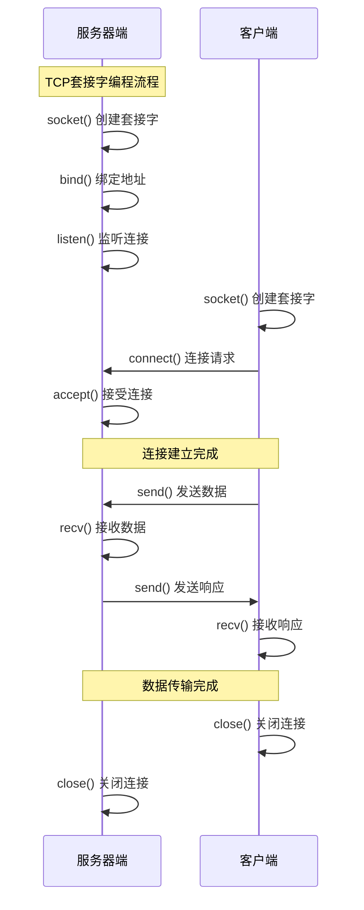
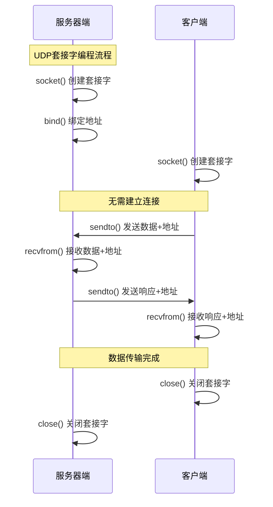

# 7.5 传输层综合应用与性能优化

## 目录

### 应用实践篇
1. [传输层协议选择](#1-传输层协议选择)
2. [典型应用场景分析](#2-典型应用场景分析)
3. [套接字编程模型](#3-套接字编程模型)

### 性能优化篇
4. [TCP性能优化技术](#4-tcp性能优化技术)
5. [UDP优化策略](#5-udp优化策略)
6. [传输层安全](#6-传输层安全)

### 实际应用案例分析
7. [实际应用案例分析](#7-实际应用案例分析)

### 性能测试与调优
8. [性能测试与调优](#8-性能测试与调优)

### 综合练习与应用
9. [综合练习与应用](#9-综合练习与应用)

---

## 1. 传输层协议选择

### 1.1 选择原则

**协议选择决策树**：

**可靠性要求**：
- 高可靠性 → TCP
- 容忍丢包 → UDP

**实时性要求**：
- 低延迟 → UDP
- 无特殊要求 → TCP

**连接特性**：
- 长连接 → TCP
- 短连接/无连接 → UDP

**数据特点**：
- 大量数据 → TCP
- 小数据包 → UDP

## 2. 典型应用场景分析

### 2.1 TCP适用场景

**TCP协议应用**：

| 应用类型 | 典型协议 | 选择TCP的原因 | 
|----------|----------|---------------|
| **Web浏览** | HTTP/HTTPS | 数据完整性关键 | 
| **文件传输** | FTP/SFTP | 文件不能丢失 | 
| **电子邮件** | SMTP/POP3 | 邮件可靠投递 | 
| **远程登录** | SSH/Telnet | 命令准确执行 | 

### 2.2 UDP适用场景

**UDP协议应用**：

| 应用类型 | 典型协议 | 选择UDP的原因 | 
|----------|----------|---------------|
| **域名解析** | DNS | 快速响应 | 
| **音视频** | RTP/RTCP | 实时性优先 | 
| **在线游戏** | 自定义 | 低延迟 | 
| **网络管理** | SNMP | 简单高效 | 

## 3. 套接字编程模型

### 3.1 TCP套接字编程

**TCP编程流程**：

### 3.2 UDP套接字编程

**UDP编程流程**：

## 4. TCP性能优化技术

### 4.1 缓冲区优化

**TCP缓冲区优化策略**：

**发送缓冲区优化**：
- 适当增大发送缓冲区
- 避免频繁的小数据写入
- 使用TCP_NODELAY禁用Nagle算法

**接收缓冲区优化**：
- 根据应用需求调整大小
- 及时读取数据避免阻塞
- 使用SO_RCVBUF设置缓冲区

### 4.2 连接优化

**TCP连接优化技术**：

**1. 连接复用**：
- HTTP Keep-Alive
- 连接池技术

**2. 快速建立连接**：
- TCP Fast Open
- 减少握手延迟

**3. 优雅关闭连接**：
- 避免TIME_WAIT过多
- 使用SO_LINGER选项

## 5. UDP优化策略

### 5.1 应用层可靠性

**UDP应用层优化**：

**1. 应用层重传**：
- 超时重传机制
- 序号和确认机制

**2. 数据完整性**：
- 应用层校验和
- 数据分片重组

**3. 流量控制**：
- 发送速率控制
- 拥塞感知机制

## 6. 传输层安全

### 6.1 TLS/SSL协议

**传输层安全机制**：

**1. 加密保护**：
- 对称加密保护数据
- 非对称加密交换密钥

**2. 身份认证**：
- 数字证书验证
- 双向认证机制

**3. 完整性保护**：
- MAC验证数据完整性
- 防重放攻击

### 6.2 DTLS协议

> **数据报传输层安全（Datagram Transport Layer Security，DTLS）**
> 
> 为UDP提供类似TLS的安全保护，解决UDP无状态特性下的安全通信问题。

**DTLS协议特性**：

**1. 基于UDP的TLS**：
- 保持UDP的无连接特性
- 提供TLS级别的安全保护

**2. 数据包防重放**：
- 序号和时间戳机制
- 防止数据包重放攻击

**3. 握手可靠性**：
- 握手消息重传机制
- 状态机超时处理

## 7. 实际应用案例分析

### 7.1 高并发Web服务器

**案例：电商网站架构**

**前端负载均衡**：
- TCP连接复用
- HTTP/2多路复用
- HTTPS安全传输

**应用服务器**：
- TCP长连接池
- 异步I/O模型
- 连接状态监控

**数据库连接**：
- TCP连接池管理
- 事务超时控制
- 故障转移机制

### 7.2 实时视频会议系统

**案例：视频会议传输优化**

**信令控制**：
- TCP可靠传输
- 会话建立和管理
- 状态同步

**媒体传输**：
- UDP实时传输
- RTP/RTCP协议
- 自适应码率控制

**质量保证**：
- 丢包检测和重传
- 延迟抖动控制
- 网络质量监控

### 7.3 IoT设备通信

**案例：智能家居网络**

**轻量级通信**：
- UDP简单协议
- 最小功耗设计
- 间歇性连接

**可靠性保证**：
- 应用层确认机制
- 重要数据TCP传输
- 心跳保活机制

**安全考虑**：
- 轻量级加密
- 设备认证
- 数据完整性校验

## 8. 性能测试与调优

### 8.1 性能指标

**关键性能指标**：

**吞吐量指标**：
- 每秒传输字节数（Bps）
- 每秒处理请求数（RPS）
- 有效载荷比率

**延迟指标**：
- 往返时间（RTT）
- 连接建立时间
- 首字节时间（TTFB）

**可靠性指标**：
- 丢包率
- 重传率
- 连接成功率

### 8.2 测试工具

**性能测试工具箱**：

**吞吐量测试**：
- iperf3：网络带宽测试
- netperf：网络性能基准测试
- ttcp：简单吞吐量测试

**延迟测试**：
- ping：基本连通性和延迟
- hping3：高级ping工具
- mtr：路径跟踪和延迟分析

**应用层测试**：
- curl：HTTP性能测试
- ab：Apache bench压力测试
- wrk：现代HTTP基准测试工具

### 8.3 调优方法

**系统调优策略**：

**操作系统级调优**：
- TCP缓冲区大小调整
- 网络队列长度优化
- 中断亲和性设置

**应用程序调优**：
- I/O模型选择（epoll/kqueue）
- 线程池大小配置
- 连接池参数调优

**网络层调优**：
- MTU大小优化
- QoS配置
- 负载均衡算法

## 9. 综合练习与应用

### 9.1 协议选择练习

**练习题1：协议选择决策**

> **【综合应用题】**
> 
> 场景描述：某公司要开发以下应用系统，请为每个应用选择合适的传输层协议并说明理由：
> 
> 1. 在线银行转账系统
> 2. 实时股票报价系统  
> 3. 视频直播平台
> 4. 网络游戏（MMORPG）
> 5. 企业邮件系统
> 
> 分析要点：
> - 数据重要性（可靠性要求）
> - 实时性要求（延迟容忍度）
> - 数据量大小（传输效率）
> - 连接特性（持续性要求）

**参考答案**：

**1. 银行转账系统 → TCP**
- 理由：金融数据绝对不能丢失，可靠性比实时性更重要

**2. 股票报价系统 → UDP**
- 理由：数据实时性要求极高，旧数据丢失可被新数据替代

**3. 视频直播 → UDP**
- 理由：实时性优先，可容忍丢帧，重传会造成更大延迟

**4. 网络游戏 → UDP+TCP混合**
- 理由：游戏状态用UDP，登录用TCP，平衡实时性和可靠性

**5. 企业邮件 → TCP**
- 理由：邮件内容不能丢失，对实时性要求不高

### 9.2 性能优化练习

**练习题2：性能瓶颈分析**

> **【性能分析题】**
> 
> 某Web服务器性能监控显示：
> - CPU使用率：30%
> - 内存使用率：60%  
> - 网络带宽使用率：90%
> - TCP连接数：50,000
> - TIME_WAIT连接数：30,000
> 
> 问题：
> 1. 识别主要性能瓶颈
> 2. 提出优化建议
> 3. 预期优化效果

**分析过程**：

**瓶颈识别**：
- 主要瓶颈：网络带宽（90%使用率）
- 次要问题：TIME_WAIT连接过多
- CPU和内存还有优化空间

**优化建议**：
- 启用HTTP/2减少连接数
- 配置Keep-Alive复用连接
- 启用GZIP压缩减少带宽
- 调整TIME_WAIT超时时间
- 增加网络带宽或使用CDN

**预期效果**：
- 网络带宽使用率降至70%
- TIME_WAIT连接数减少50%
- 整体响应时间提升30%

### 9.3 故障排除练习

**练习题3：网络故障诊断**

> **【故障诊断题】**
> 
> 用户反馈Web应用访问缓慢，网络管理员收集到以下信息：
> - ping服务器RTT正常（<50ms）
> - TCP连接建立缓慢（>3秒）
> - HTTP响应码正常（200 OK）
> - 服务器负载正常
> 
> 分析可能原因并提出排查步骤。

**排查思路**：

**1. TCP层面排查**：
- 检查TCP握手过程
- 监控SYN队列是否满
- 查看防火墙连接跟踪表

**2. 应用层面排查**：
- 检查应用连接池配置
- 监控数据库连接状态
- 查看应用日志和错误信息

**3. 系统层面排查**：
- 检查文件描述符限制
- 监控内存和CPU使用
- 查看系统内核参数配置

**4. 网络层面排查**：
- 检查网络设备状态
- 分析网络拓扑路径
- 监控网络拥塞情况

**常见原因**：
- SYN队列满导致连接建立缓慢
- 防火墙连接跟踪表满
- 应用层连接池配置不当
- 文件描述符限制过低

---

## 章节总结

### 核心要点回顾

**1. 协议选择原则**：
- 根据应用需求选择合适的传输层协议
- 平衡可靠性、实时性、效率等因素
- 考虑应用场景的特殊要求

**2. 性能优化技术**：
- TCP优化：缓冲区调优、连接管理、拥塞控制
- UDP优化：应用层可靠性、流量控制
- 系统级优化：操作系统参数、硬件配置

**3. 安全机制**：
- TLS/SSL为TCP提供安全保护
- DTLS为UDP提供安全保护
- 加密、认证、完整性三重保障

**4. 实际应用**：
- 不同应用场景的协议选择策略
- 性能测试和调优方法
- 故障诊断和解决思路

### 重点知识强化

- **必须掌握**：协议选择原则、性能优化方法
- **重要理解**：套接字编程模型、安全机制
- **深入分析**：实际应用案例、故障排除

### 考研要点提醒

**高频考点**：
- TCP与UDP的选择依据
- 套接字编程流程
- 传输层性能优化技术
- 安全协议的工作原理

**解题技巧**：
- 分析应用需求确定协议选择
- 理解性能瓶颈的分析方法
- 掌握常见问题的排查思路
