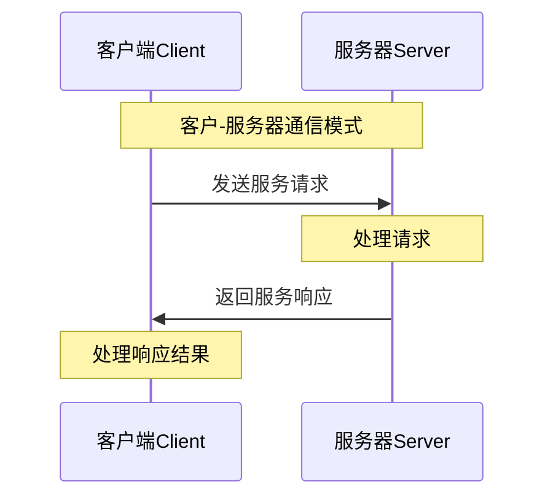
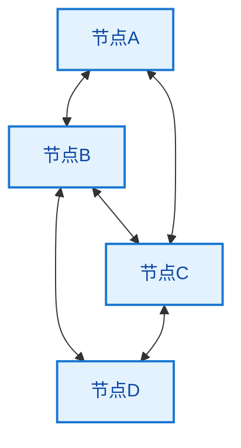

# 8.1 应用层协议基础理论

## 本章学习目标

通过本章学习，掌握：
- 应用层在网络体系结构中的地位 ⭐⭐⭐⭐⭐
- 应用层协议的基本概念和分类 ⭐⭐⭐⭐⭐
- 客户-服务器模式和P2P模式 ⭐⭐⭐⭐
- 应用层常用端口号 ⭐⭐⭐⭐⭐
- 应用层协议设计原则 ⭐⭐⭐

---

## 目录

### 基础理论篇
1. [应用层概述](#1-应用层概述)
2. [应用层协议分类](#2-应用层协议分类)
3. [应用架构模式](#3-应用架构模式)

### 技术规范篇
4. [应用层端口号](#4-应用层端口号)
5. [协议设计原则](#5-协议设计原则)

---

## 1. 应用层概述

### 1.1 应用层定义

> **应用层（Application Layer）**
> 
> OSI参考模型的最高层，为网络应用程序提供服务，是用户与网络的直接接口，实现具体的网络应用功能。

#### 应用层在网络体系中的地位

**网络分层中的位置**：

**应用层** ：为用户提供网络服务
- HTTP、FTP、SMTP、DNS等协议

**传输层** 
- TCP、UDP协议

**网络层** 
- IP协议

**数据链路层** 
- 以太网帧等

**物理层** 
- 物理传输

### 1.2 应用层功能

#### 核心功能

**应用层主要功能**：

**1. 为应用程序提供网络服务**
- 文件传输服务
- 电子邮件服务
- Web浏览服务
- 域名解析服务

**2. 定义应用程序间的通信规则**
- 消息格式和语法
- 消息语义和时序
- 错误处理机制

**3. 数据表示和处理**
- 数据格式转换
- 字符编码处理
- 压缩和加密

---

## 2. 应用层协议分类

### 2.1 按功能分类

#### 主要协议类别

**应用层协议功能分类**：

| 功能类别 | 典型协议 | 主要用途 |
|----------|----------|----------|
| **Web服务** | HTTP/HTTPS | 网页浏览 |
| **文件传输** | FTP/TFTP | 文件上传下载 |
| **电子邮件** | SMTP/POP3/IMAP | 邮件收发 |
| **域名解析** | DNS | 域名到IP转换 |
| **远程访问** | Telnet/SSH | 远程登录 |
| **网络管理** | SNMP | 网络设备管理 |

### 2.2 按传输层协议分类

#### 基于传输层的分类

**协议与传输层的关系**：

**基于TCP的协议**：
- HTTP/HTTPS（可靠性要求高）
- FTP（文件传输完整性）
- SMTP（邮件可靠投递）
- Telnet/SSH（命令准确传输）

**基于UDP的协议**：
- DNS（快速查询响应）
- SNMP（简单网络管理）
- TFTP（简单文件传输）
- DHCP（动态地址分配）

---

## 3. 应用架构模式

### 3.1 客户-服务器模式(C/S)

> **客户-服务器模式（Client-Server Architecture）**
> 
> 网络应用的经典架构模式，由提供服务的服务器和请求服务的客户端组成，是最常见的网络应用架构。

#### C/S模式特点

**客户-服务器架构特征**：

**特点**：
- **服务器**：24×7运行，固定IP地址
- **客户端**：间歇性连接，动态IP地址  
- **通信**：客户端主动发起连接
- **扩展**：服务器集群提高性能

#### C/S模式优缺点

**优势**：
- 集中管理和控制
- 安全性相对较高
- 数据一致性好
- 易于维护和升级

**局限**：
- 服务器成为性能瓶颈
- 单点故障风险
- 服务器硬件成本高
- 扩展性受限

### 3.2 对等网络模式(P2P)

> **对等网络模式（Peer-to-Peer，P2P）**
> 
> 网络中的节点既可以作为客户端请求服务，也可以作为服务器提供服务，实现资源的分布式共享。

#### P2P模式特点

**对等网络架构**：

**特点**：
- **节点地位平等**，角色可变
- **去中心化架构**
- **资源分布式存储**
- **自组织和自管理**

#### P2P模式优缺点

**优势**：
- 高可扩展性
- 无单点故障
- 资源利用充分
- 成本低廉

**挑战**：
- 安全性难以保证
- 服务质量不稳定
- 管理复杂
- 版权和法律问题

---

## 4. 应用层端口号

### 4.1 端口号概念

> **端口号（Port Number）**
> 
> 16位整数，用于标识主机上的特定应用程序，实现多个应用程序同时使用网络服务的功能。

#### 端口号分类

**端口号范围分类**：

**知名端口(0-1023)**：
- 由IANA分配给重要协议
- 需要系统管理员权限
- 标准化应用程序使用

**注册端口(1024-49151)**：
- 向IANA注册的应用程序端口
- 普通用户可以使用
- 特定应用或服务

**动态端口(49152-65535)**：
- 客户端临时使用
- 系统动态分配
- 连接结束后释放

### 4.2 常用端口号

#### 重要协议端口号

**408必记端口号**：

| 协议 | 端口号 | 传输层协议 | 应用说明 |
|------|--------|------------|----------|
| **HTTP** | 80 | TCP | Web浏览 |
| **HTTPS** | 443 | TCP | 安全Web浏览 |
| **FTP** | 21 | TCP | 文件传输控制 |
| **FTP数据** | 20 | TCP | 文件传输数据 |
| **SMTP** | 25 | TCP | 邮件发送 |
| **POP3** | 110 | TCP | 邮件接收 |
| **IMAP** | 143 | TCP | 邮件访问 |
| **DNS** | 53 | UDP/TCP | 域名解析 |
| **Telnet** | 23 | TCP | 远程登录 |
| **SSH** | 22 | TCP | 安全远程登录 |
| **SNMP** | 161 | UDP | 网络管理 |

#### 端口号记忆技巧

**端口号记忆方法**：

**1. 按协议功能分组记忆**：
- Web：80(HTTP), 443(HTTPS)
- 邮件：25(SMTP), 110(POP3)
- 文件：21(FTP控制), 20(FTP数据)

**2. 按数字特点记忆**：
- 20-25：基础协议(FTP,SMTP,Telnet)
- 53：DNS(5+3=8,听起来像"发")
- 80：HTTP(8倍10,简单好记)
- 443：HTTPS(4+4+3=11,安全协议)

---

## 5. 协议设计原则

### 5.1 应用层协议设计要素

#### 协议设计考虑因素

**协议设计关键要素**：

**1. 消息类型**
- 请求消息和响应消息
- 控制消息和数据消息
- 错误消息和状态消息

**2. 消息格式**
- 消息头部和消息体
- 字段定义和编码方式
- 长度指示和分隔符

**3. 消息语义**
- 字段含义和取值范围
- 操作语义和处理规则
- 状态转换和时序要求

**4. 通信规则**
- 消息交换顺序
- 超时和重传机制
- 错误处理和恢复

### 5.2 协议设计原则

#### 设计指导原则

**协议设计基本原则**：

**1. 简单性原则**
- 协议逻辑清晰简单
- 易于实现和调试
- 降低复杂性和错误率

**2. 高效性原则**
- 最小化协议开销
- 优化网络带宽使用
- 提高传输效率

**3. 可扩展性原则**
- 支持功能扩展
- 版本兼容机制
- 参数协商能力

**4. 健壮性原则**
- 错误检测和处理
- 异常情况恢复
- 故障容错能力

### 5.3 协议实现原则

#### 效率和优化

**性能优化策略**：

**协议优化方法**：

**1. 缓存机制**
- 减少重复请求
- 提高响应速度
- 降低网络负载

**2. 压缩技术**
- 数据压缩传输
- 减少带宽占用
- 加快传输速度

**3. 多路复用**
- 单连接多请求
- 降低连接开销
- 提高并发性能

**4. 预取和预连接**
- 预测用户需求
- 减少等待时间
- 优化用户体验

应用层协议设计体现了网络系统的用户导向特性，为网络应用提供了标准化的通信规范。

---

## 典型例题与解析

### 例题8.1.1：应用层协议分类

> **例题**
> 
> 下列协议中，属于应用层协议的是（）
> 
> A. ICMP、ARP、RARP
> B. TCP、UDP、SCTP
> C. IP、IPv6、IPX
> D. HTTP、FTP、SMTP

**分析**：
- A选项：ICMP（网络层）、ARP/RARP（网络层）
- B选项：TCP/UDP（传输层）、SCTP（传输层）
- C选项：IP/IPv6（网络层）、IPX（网络层）
- D选项：HTTP/FTP/SMTP（应用层）

**解答**：正确答案是D

**解题技巧**：
- 明确OSI七层模型各层典型协议
- 应用层协议直接为用户提供服务
- 传输层协议提供端到端通信
- 网络层协议负责路由选择

### 例题8.1.2：客户-服务器模式理解

> **例题**
> 
> 在客户-服务器（C/S）模式中，下列说法正确的是（）
> 
> A. 服务器只能被动等待客户端连接
> B. 客户端和服务器的角色是固定不变的
> C. 一个进程既可以是客户端又可以是服务器
> D. 服务器必须具有固定的IP地址

**分析**：
- A错误：服务器可以主动推送数据（如邮件服务器）
- B错误：角色可以变化，如P2P中节点角色切换
- C正确：进程可以同时承担客户端和服务器角色
- D错误：服务器可以使用动态IP（如DHCP）

**解答**：正确答案是C

### 例题8.1.3：端口号分类计算

> **例题**
> 
> 某企业网络中有以下端口使用情况：
> - Web服务器使用80和443端口
> - 邮件服务器使用25、110、143端口
> - 文件服务器使用21、22端口
> - 数据库服务器使用3306端口
> - 应用服务器使用8080、9000端口
> 
> 分析这些端口号的分类，并计算各类端口的数量。

**分析**：
- 知名端口（0-1023）：系统级服务
- 注册端口（1024-49151）：用户级应用
- 动态端口（49152-65535）：临时分配

**解答**：

**端口分类统计**：
- **知名端口**：80, 443, 25, 110, 143, 21, 22 → 7个
- **注册端口**：3306, 8080, 9000 → 3个
- **动态端口**：无 → 0个

**使用建议**：
- 知名端口：保持标准配置，便于互操作
- 注册端口：企业应用的标准选择
- 动态端口：避免在服务器配置中使用

### 例题8.1.4：协议设计原则分析

> **例题**
> 
> 设计一个新的文件传输协议，需要考虑以下需求：
> - 支持大文件传输（>1GB）
> - 网络环境不稳定，经常断线
> - 需要保证传输安全性
> - 客户端可能在NAT后面
> 
> 请根据协议设计原则，提出设计方案。

**标准答案**：

**基本设计方案**：

**1. 协议架构设计**
- **传输层选择**：使用TCP保证可靠性
- **连接模式**：采用被动模式适应NAT环境
- **数据组织**：分块传输，支持并行下载

**2. 断点续传机制**
- **文件分片**：将文件分成固定大小的块（如1MB）
- **进度记录**：客户端本地记录传输进度
- **重连机制**：自动重连并从断点继续

**3. 安全性设计**
- **身份认证**：使用数字证书验证身份
- **数据加密**：TLS加密传输通道
- **完整性校验**：每个分片计算哈希值

**4. 协议优化特性**
- **压缩传输**：自适应压缩算法
- **流量控制**：根据网络状况调整速率
- **多连接**：支持多线程并行传输

### 例题8.1.5：应用层在网络体系中的作用

> **例题**
> 
> 解释应用层协议与下层协议的关系，说明应用层协议如何实现用户需求到网络传输的转换。

**标准答案**：

**分层协作关系**：

**应用层（第7层）**
- **作用**：定义应用程序间的通信规则
- **功能**：数据格式化、用户接口、应用逻辑
- **典型协议**：HTTP、FTP、SMTP、DNS

**与下层的接口关系**：

**1. 应用层 ↔ 传输层**
- 应用层使用套接字API调用传输层服务
- 传输层提供端到端的可靠/不可靠传输
- 端口号实现应用进程标识

**2. 传输层 ↔ 网络层**
- 传输层使用网络层的IP服务
- 网络层提供主机到主机的数据传输
- IP地址实现主机标识

**3. 网络层 ↔ 数据链路层**
- 网络层使用数据链路层的帧传输服务
- 数据链路层提供相邻节点间的可靠传输
- MAC地址实现直接连接的设备标识

**数据封装过程**：
1. 应用层：生成应用数据和协议头
2. 传输层：添加TCP/UDP头，形成段/数据报
3. 网络层：添加IP头，形成数据包
4. 数据链路层：添加帧头和帧尾，形成帧
5. 物理层：转换为比特流传输

---

## 应用层协议发展趋势

### 现代应用层协议特点

**新兴协议特征**：

**1. 二进制协议**
- HTTP/2、HTTP/3使用二进制格式
- 提高解析效率，减少传输开销
- 支持多路复用和服务器推送

**2. 实时通信协议**
- WebSocket：全双工实时通信
- WebRTC：点对点音视频传输
- MQTT：物联网轻量级消息传输

**3. 微服务化协议**
- gRPC：高性能RPC框架
- GraphQL：灵活的API查询语言
- RESTful API：无状态架构风格

### 协议安全演进

**安全加强趋势**：

**1. 默认加密**
- HTTPS成为Web标准
- 新协议内置安全机制
- 端到端加密普及

**2. 身份验证**
- OAuth 2.0统一身份认证
- JWT令牌机制
- 多因素身份验证

**3. 隐私保护**
- DNS over HTTPS (DoH)
- 零知识证明应用
- 数据最小化原则

### 物联网协议适配

**IoT专用协议**：

**1. MQTT协议**
- 发布-订阅模式
- 轻量级、低功耗
- 支持QoS等级

**2. CoAP协议**
- 受限设备HTTP
- UDP传输，低开销
- RESTful风格API

**3. LoRaWAN协议**
- 长距离、低功耗
- 星形网络拓扑
- 适合大规模部署

---

## 重点总结

### 核心考点梳理

**必考知识点（⭐⭐⭐⭐⭐）**：

**1. 应用层基本概念**
- 应用层在OSI模型中的位置和作用
- 应用层协议的基本功能和特征
- 应用层与传输层的接口关系

**2. 应用架构模式**
- 客户-服务器（C/S）模式特点
- 对等（P2P）模式特点
- 混合模式的应用场景

**3. 端口号管理**
- 知名端口（0-1023）的典型协议
- 注册端口（1024-49151）的使用规则
- 动态端口（49152-65535）的分配机制

**4. 协议设计原则**
- 简单性、高效性、可扩展性、健壮性
- 协议分层的优势和实现方法
- 协议标准化的重要性

**常考题型分析**：
1. **协议分类题**：识别各层协议，理解协议功能
2. **架构模式题**：比较C/S和P2P模式的优缺点
3. **端口号题**：记忆常用协议端口，理解端口分类
4. **设计原则题**：分析协议设计的考虑因素

**易错点提醒**：
- 混淆应用层协议和传输层协议
- 不理解端口号与IP地址的区别
- 忽视协议设计中的安全性考虑
- 对协议分层的好处理解不深

### 学习方法建议

**理论联系实际**：
- 结合常用网络应用理解协议作用
- 通过网络抓包分析协议交互过程
- 关注新兴协议的技术特点

**系统性学习**：
- 掌握协议分层的思想方法
- 理解各层协议间的依赖关系
- 学会分析协议设计的权衡考虑

**实践验证**：
- 配置和使用各种网络服务
- 分析网络故障的协议层面原因
- 评估不同协议的适用场景

