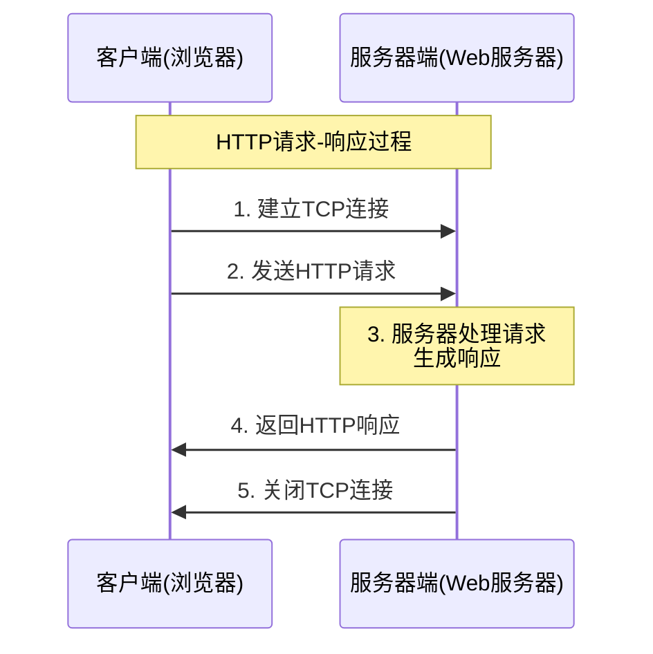
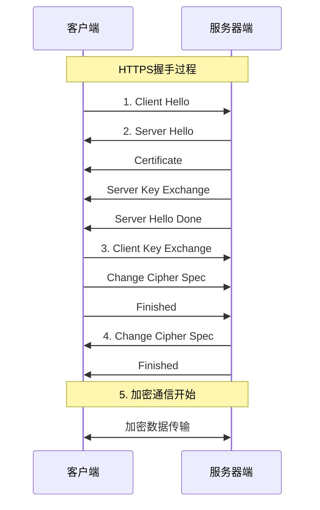

# 8.2 HTTP协议详解与Web技术

## 本章学习目标

通过本章学习，掌握：
- HTTP协议基本原理和特点 ⭐⭐⭐⭐⭐
- HTTP消息格式和方法 ⭐⭐⭐⭐⭐
- HTTP状态码含义 ⭐⭐⭐⭐⭐
- HTTP/1.1和HTTP/2的区别 ⭐⭐⭐⭐
- HTTPS安全机制 ⭐⭐⭐⭐

---

## 目录

### 基础理论篇
1. [HTTP协议概述](#1-http协议概述)
2. [HTTP消息格式](#2-http消息格式)
3. [HTTP方法和状态码](#3-http方法和状态码)

### 技术发展篇
4. [HTTP版本演进](#4-http版本演进)
5. [HTTPS安全协议](#5-https安全协议)

---

## 1. HTTP协议概述

### 1.1 HTTP协议定义

> **超文本传输协议（HyperText Transfer Protocol，HTTP）**
> 
> 应用层协议，用于Web浏览器和Web服务器之间的通信，是互联网上应用最广泛的协议之一。

#### HTTP协议特点

**核心特征**：

**1. 无状态协议**
- 每个请求独立处理
- 服务器不保存客户端状态
- 简化服务器设计

**2. 无连接性**
- 每次请求建立新连接
- 请求完成后立即断开
- HTTP/1.1支持持久连接

**3. 基于TCP传输**
- 使用TCP确保可靠传输
- 默认端口80（HTTPS为443）
- 面向连接的可靠通信

**4. 文本协议**
- 消息格式人类可读
- 易于调试和理解
- ASCII编码的协议头

### 1.2 HTTP工作原理

#### 请求-响应模型

**HTTP工作流程**：



---

## 2. HTTP消息格式

### 2.1 HTTP请求消息

#### 请求消息结构

**HTTP请求格式**：

```
────────────────────────────────────────────────────────────────
                        请求行(Request Line)                      
                    GET /index.html HTTP/1.1                     
────────────────────────────────────────────────────────────────
                       请求头部(Request Headers)                  
                      Host: www.example.com                      
                      User-Agent: Mozilla/5.0                    
                      Accept: text/html                          
                      Connection: keep-alive                     
────────────────────────────────────────────────────────────────
                          空行(Empty Line)                       
                                                                 
────────────────────────────────────────────────────────────────
                       请求体(Request Body)                      
                      (可选，POST等方法使用)                      
────────────────────────────────────────────────────────────────
```

#### 请求行组成

**请求行格式**：

**组成部分**：方法 + URL + 协议版本
- 示例：`GET /page.html HTTP/1.1`

**常用方法**：
- GET：获取资源
- POST：提交数据  
- PUT：更新资源
- DELETE：删除资源

### 2.2 HTTP响应消息

#### 响应消息结构

**HTTP响应格式**：

```
────────────────────────────────────────────────────────────────
                        状态行(Status Line)                      
                       HTTP/1.1 200 OK                          
────────────────────────────────────────────────────────────────
                      响应头部(Response Headers)                 
                      Content-Type: text/html                    
                      Content-Length: 1234                       
                      Server: Apache/2.4                        
────────────────────────────────────────────────────────────────
                          空行(Empty Line)                       
                                                                 
────────────────────────────────────────────────────────────────
                       响应体(Response Body)                     
                        <html>...</html>                        
────────────────────────────────────────────────────────────────
```

---

## 3. HTTP方法和状态码

### 3.1 HTTP方法

#### 常用HTTP方法

**主要HTTP方法**：

| 方法 | 用途 | 特点 |
|------|------|------|
| **GET** | 获取资源 | 安全、幂等 |
| **POST** | 提交数据 | 不安全、非幂等 |
| **PUT** | 更新资源 | 不安全、幂等 |
| **DELETE** | 删除资源 | 不安全、幂等 |
| **HEAD** | 获取头部 | 安全、幂等 |

#### GET与POST对比

**重要区别**：

**GET方法**：
- 参数在URL中显示
- 数据长度受限
- 可以被缓存
- 幂等性操作
- 用于查询操作

**POST方法**：
- 参数在请求体中
- 数据长度无限制
- 不能被缓存
- 非幂等性操作
- 用于提交操作

### 3.2 HTTP状态码

#### 状态码分类

**HTTP状态码分类**：

| 类别 | 范围 | 含义 | 典型状态码 |
|------|------|------|------------|
| **1xx** | 100-199 | 信息响应 | 100 Continue |
| **2xx** | 200-299 | 成功响应 | 200 OK |
| **3xx** | 300-399 | 重定向 | 301 Moved Permanently |
| **4xx** | 400-499 | 客户端错误 | 404 Not Found |
| **5xx** | 500-599 | 服务器错误 | 500 Internal Server Error |

#### 重要状态码详解

**常见状态码**：

**200 OK**：请求成功
**301 Moved Permanently**：永久重定向
**302 Found**：临时重定向
**304 Not Modified**：资源未修改
**400 Bad Request**：请求语法错误
**401 Unauthorized**：未授权
**403 Forbidden**：禁止访问
**404 Not Found**：资源不存在
**500 Internal Server Error**：服务器错误
**502 Bad Gateway**：网关错误
**503 Service Unavailable**：服务不可用

---

## 4. HTTP版本演进

### 4.1 HTTP/1.0特点

**HTTP/1.0特征**：

- 每个请求需要新的TCP连接
- 不支持持久连接
- 不支持管道化
- 性能较低
- 简单易实现

### 4.2 HTTP/1.1改进

**HTTP/1.1新特性**：

**1. 持久连接(Keep-Alive)**
- 复用TCP连接
- 减少连接开销

**2. 管道化(Pipelining)**
- 同时发送多个请求
- 提高传输效率

**3. 缓存机制**
- 更好的缓存控制
- 条件请求支持

**4. Host头部字段**
- 支持虚拟主机
- 一个IP多个域名

### 4.3 HTTP/2特性

**HTTP/2主要改进**：

**1. 二进制协议**
- 二进制分帧
- 解析效率更高

**2. 多路复用**
- 并行处理多个请求
- 避免队头阻塞

**3. 服务器推送**
- 主动推送资源
- 减少往返时间

**4. 头部压缩**
- HPACK算法
- 减少传输开销

---

## 5. HTTPS安全协议

### 5.1 HTTPS概述

> **HTTPS（HTTP Secure）**
> 
> 在HTTP基础上加入SSL/TLS加密层，提供数据加密、身份认证和数据完整性保护的安全HTTP协议。

#### HTTPS工作原理

**HTTPS协议栈**：

**应用层**
- HTTP

**安全层**
- SSL/TLS

**传输层**
- TCP

**网络层**
- IP

### 5.2 HTTPS握手过程

#### TLS握手流程

**HTTPS连接建立**：



### 5.3 HTTPS优势

**安全保障**：

**1. 数据加密**
- 防止数据被窃听
- 对称加密保护数据

**2. 身份认证**
- 验证服务器身份
- 数字证书机制

**3. 数据完整性**
- 防止数据被篡改
- 消息认证码验证

---

## 典型例题与解析

### 例题8.2.1：HTTP协议特点理解

> **例题**
> 
> HTTP协议是无状态协议，这意味着（）
> 
> A. HTTP服务器不能区分不同的客户端  
> B. HTTP协议不支持持久连接  
> C. HTTP服务器不保存关于客户端的任何信息  
> D. HTTP协议不支持并发连接

**分析**：
- 无状态是指服务器不保存客户端的状态信息
- 每个HTTP请求都是独立的，服务器不依赖之前的请求
- 无状态不等于不能区分客户端或不支持持久连接

**解答**：正确答案是C

**解题技巧**：
- 区分无状态和无连接的概念
- 无状态：不保存状态信息
- 无连接：每次请求建立新的TCP连接（HTTP/1.0）

### 例题8.2.2：HTTP方法对比

> **例题**
> 
> 关于HTTP的GET方法和POST方法，下列说法错误的是（）
> 
> A. GET方法的参数会显示在URL中
> B. POST方法可以传输更大的数据量
> C. GET方法是幂等的，POST方法不是
> D. GET和POST都不能被浏览器缓存

**分析**：
- GET方法特点：参数在URL、有长度限制、幂等、可缓存
- POST方法特点：参数在请求体、数据量大、非幂等、不可缓存
- 缓存是GET和POST的重要区别

**解答**：正确答案是D（GET可以被缓存）

### 例题8.2.3：HTTP状态码分析

> **例题**
> 
> 某Web服务器日志显示以下状态码统计：
> - 200 OK: 85000次
> - 304 Not Modified: 12000次  
> - 404 Not Found: 2500次
> - 500 Internal Server Error: 500次
> 
> 计算该服务器的成功响应率和缓存命中率。

**分析**：
- 2xx状态码表示成功响应
- 304表示缓存有效，客户端使用本地缓存
- 成功响应率 = 2xx响应数 / 总响应数
- 缓存命中率 = 304响应数 / 总响应数

**解答**：
- 总请求数：85000 + 12000 + 2500 + 500 = 100000
- 成功响应率：85000 / 100000 = 85%
- 缓存命中率：12000 / 100000 = 12%

**解题技巧**：
- 熟记常用状态码分类
- 理解304状态码的特殊含义
- 注意区分成功率和命中率的计算方法

### 例题8.2.4：HTTP性能计算

> **例题**
> 
> 某Web页面包含1个HTML文件（8KB）和4个图片文件（每个20KB）。
> 在以下条件下，计算页面完整加载时间：
> - RTT = 50ms
> - 带宽 = 10Mbps
> - 使用HTTP/1.0（非持久连接）
> - 忽略处理时间

**分析**：
- HTTP/1.0每个文件需要建立新的TCP连接
- 每个TCP连接需要三次握手（1个RTT）
- 数据传输时间 = 文件大小 / 带宽
- 总时间 = 连接建立时间 + 数据传输时间

**解答**：
1. **文件总大小**：8KB + 4×20KB = 88KB = 88×8 = 704Kbit
2. **总文件数量**：5个文件
3. **连接建立时间**：5 × 1RTT = 5 × 50ms = 250ms
4. **数据传输时间**：704Kbit ÷ 10Mbps = 70.4ms
5. **总加载时间**：250ms + 70.4ms = 320.4ms

**扩展分析**：
- 如果使用HTTP/1.1持久连接：1RTT + 70.4ms = 120.4ms
- 性能提升：(320.4-120.4)/320.4 = 62.4%

### 例题8.2.5：HTTPS握手过程

> **例题**
> 
> 描述HTTPS连接建立的完整过程，并说明各阶段的安全作用。

**标准答案**：

**阶段1：TCP握手**
- 客户端与服务器建立TCP连接
- 保证数据传输的可靠性

**阶段2：TLS握手**
1. **Client Hello**：客户端发送支持的TLS版本、加密套件
2. **Server Hello**：服务器选择TLS版本和加密套件
3. **Certificate**：服务器发送数字证书
4. **Client Key Exchange**：客户端用公钥加密预主密钥
5. **Change Cipher Spec**：双方切换到加密模式
6. **Finished**：握手完成确认

**安全作用**：
- 身份认证：通过数字证书验证服务器身份
- 密钥协商：安全协商会话密钥
- 数据加密：后续通信使用对称加密

---
