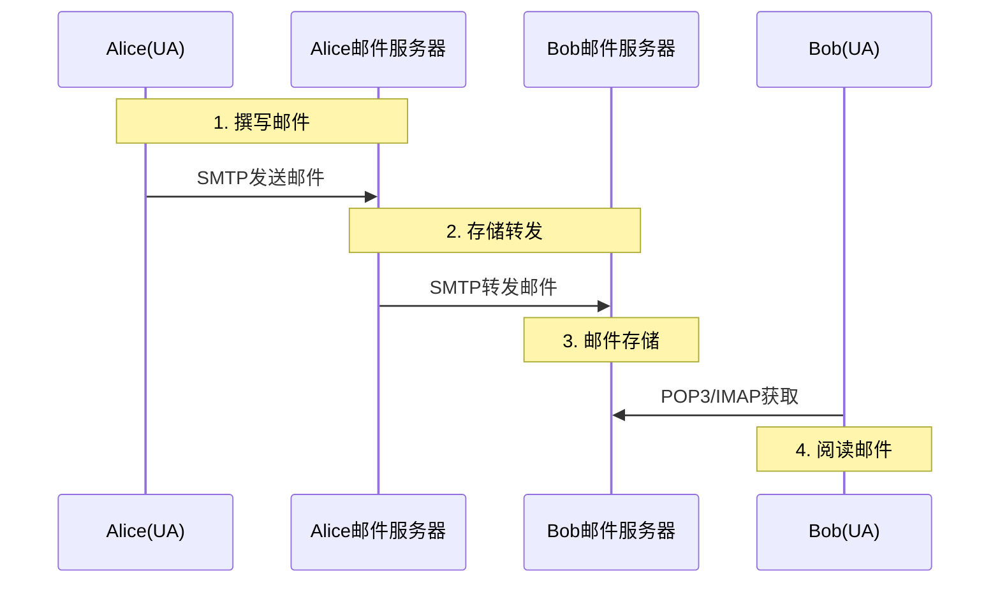
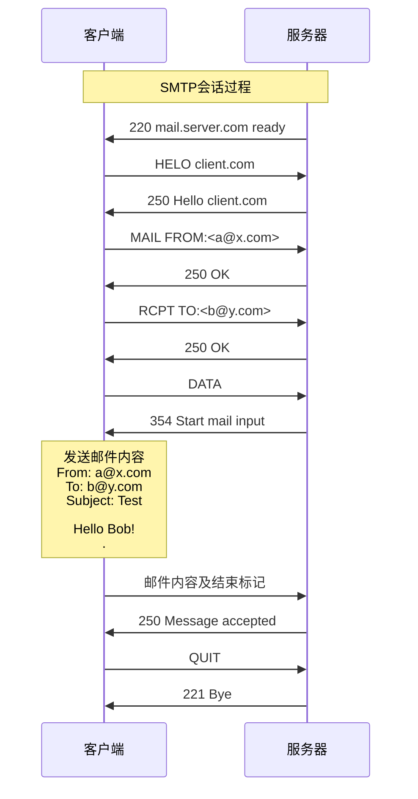

# 8.3 电子邮件系统与SMTP协议

## 目录

### 基础理论篇
1. [电子邮件系统概述](#1-电子邮件系统概述)
2. [SMTP协议详解](#2-smtp协议详解)
3. [邮件接收协议](#3-邮件接收协议)

### 技术实现篇
4. [电子邮件格式与MIME](#4-电子邮件格式与mime)
5. [邮件传输过程](#5-邮件传输过程)

---

## 1. 电子邮件系统概述

### 1.1 电子邮件系统架构

> **电子邮件系统（Electronic Mail System）**
> 
> 基于存储-转发机制的异步通信系统，允许用户在不同时间、不同地点之间交换电子邮件。

#### 系统组成

**邮件系统三大组件**：

**1. 用户代理(User Agent, UA)**
- 邮件客户端软件
- 撰写、发送、接收邮件
- 如：Outlook、Thunderbird

**2. 邮件服务器(Mail Server)**
- 邮件存储和转发
- 运行邮件传输代理
- 提供邮箱服务

**3. 邮件传输代理(Mail Transfer Agent,MTA)**
- SMTP服务器
- 负责邮件路由和传输
- 在邮件服务器间传递邮件

### 1.2 邮件系统工作模式

#### 存储-转发机制

**工作原理**：



**过程说明**：
1. **Alice用UA撰写邮件**
2. **UA通过SMTP发送到Alice的邮件服务器**
3. **Alice的服务器通过SMTP转发到Bob的服务器**
4. **Bob用UA通过POP3/IMAP从服务器获取邮件**

---

## 2. SMTP协议详解

### 2.1 SMTP协议概述

> **简单邮件传输协议（Simple Mail Transfer Protocol，SMTP）**
> 
> 用于电子邮件传输的应用层协议，负责从发送方邮件服务器向接收方邮件服务器传递邮件。

#### SMTP协议特点

**核心特征**：

**1. 基于TCP传输**
- 使用TCP端口25
- 可靠的连接导向传输

**2. 推送协议**
- 主动向目标服务器推送邮件
- 发送方主导传输过程

**3. 文本协议**
- ASCII文本命令
- 人类可读的协议格式

**4. 三阶段传输**
- 握手、传输、关闭
- 命令-响应交互模式

### 2.2 SMTP命令和响应

#### 主要SMTP命令

**常用命令**：

| 命令 | 功能 | 语法示例 |
|------|------|----------|
| **HELO/EHLO** | 标识发送方 | HELO domain |
| **MAIL FROM** | 指定发送者 | MAIL FROM:<sender> |
| **RCPT TO** | 指定接收者 | RCPT TO:<recipient> |
| **DATA** | 开始邮件内容 | DATA |
| **QUIT** | 结束会话 | QUIT |

#### SMTP响应码

**响应代码分类**：

**2xx：成功完成**
- 220 服务就绪
- 250 请求完成

**3xx：需要进一步信息**
- 354 开始邮件输入

**4xx：临时失败**
- 450 邮箱不可用

**5xx：永久失败**
- 550 邮箱不存在
- 552 存储空间不足

### 2.3 SMTP会话示例

#### 典型会话过程

**SMTP交互示例**：



---

## 3. 邮件接收协议

### 3.1 POP3协议

> **邮局协议第3版（Post Office Protocol Version 3，POP3）**
> 
> 用于从邮件服务器下载邮件到本地客户端的协议，采用下载-删除模式。

#### POP3特点

**POP3协议特征**：

**1. 下载-删除模式**
- 邮件下载到本地
- 服务器删除邮件副本

**2. 离线处理**
- 下载后可离线阅读
- 节省服务器存储空间

**3. 简单协议**
- 功能相对简单
- 实现复杂度低

**4. 使用TCP端口110**
- 文本协议
- 命令-响应模式

### 3.2 IMAP协议

> **互联网邮件访问协议（Internet Mail Access Protocol，IMAP）**
> 
> 允许邮件客户端访问远程服务器上的邮件，支持在线操作和多设备同步。

#### IMAP特点

**IMAP协议特征**：

**1. 在线操作**
- 邮件保存在服务器
- 客户端同步操作

**2. 多设备访问**
- 支持多个客户端同时访问
- 状态同步

**3. 部分下载**
- 可只下载邮件头部
- 节省带宽

**4. 文件夹管理**
- 支持服务器端文件夹
- 层次化邮件组织

### 3.3 POP3 vs IMAP对比

**协议比较**：

| 特性 | POP3 | IMAP | 适用场景 |
|------|------|------|----------|
| **邮件存储** | 本地 | 服务器 | POP3适合单设备 |
| **多设备访问** | 不支持 | 支持 | IMAP适合多设备 |
| **离线访问** | 完全支持 | 部分支持 | POP3适合离线 |
| **存储空间** | 客户端负担 | 服务器负担 | 根据需求选择 |
| **同步功能** | 无 | 完整 | IMAP适合团队 |

---

## 4. 电子邮件格式与MIME

### 4.1 邮件消息格式

#### 基本邮件格式

**邮件结构**：

```
0                   1                   2                   3
0 1 2 3 4 5 6 7 8 9 0 1 2 3 4 5 6 7 8 9 0 1 2 3 4 5 6 7 8 9 0 1
────────────────────────────────────────────────────────────────
                        邮件头部(Header)                         
                     From: sender@domain.com                     
                   To: recipient@domain.com                      
                      Subject: 邮件主题                          
                       Date: 发送日期                            
                     Message-ID: 消息标识                        
────────────────────────────────────────────────────────────────
                             空行                               
────────────────────────────────────────────────────────────────
                        邮件正文(Body)                          
                      邮件的实际内容...                          
────────────────────────────────────────────────────────────────
```

### 4.2 MIME扩展

> **多用途互联网邮件扩展（Multipurpose Internet Mail Extensions，MIME）**
> 
> 扩展了基本邮件格式，支持非ASCII字符、多媒体内容和多部分消息。

#### MIME功能

**MIME扩展能力**：

**1. 多媒体支持**
- 图片、音频、视频附件
- 二进制文件传输

**2. 字符集支持**
- 支持多种字符编码
- 中文、日文等非ASCII字符

**3. 多部分消息**
- 文本+附件组合
- 复杂邮件结构

---

## 5. 邮件传输过程

### 5.1 完整传输流程

#### 端到端邮件传输

**邮件传输完整过程**：

**1. 邮件创建**
- 用户在UA中撰写邮件
- 指定收件人和主题

**2. 提交到发送方服务器**
- UA通过SMTP提交邮件
- 邮件进入发送队列

**3. 服务器间传输**
- DNS查询目标邮件服务器
- SMTP传输到目标服务器

**4. 目标服务器接收**
- 验证收件人邮箱
- 邮件存储到邮箱

**5. 用户接收邮件**
- 通过POP3/IMAP获取邮件
- 在UA中阅读邮件

### 5.2 DNS在邮件传输中的作用

#### MX记录查询

**邮件路由过程**：

**发送邮件到user@example.com：**

**1. 查询example.com的MX记录**
- MX 10 mail1.example.com
- MX 20 mail2.example.com

**2. 按优先级尝试连接**
- 先尝试mail1.example.com (优先级10)
- 失败则尝试mail2.example.com (优先级20)

**3. 建立SMTP连接并传输邮件**

---

## 典型例题与解析

### 例题8.3.1：邮件系统组成理解

> **例题**
> 
> 电子邮件系统的组成中，负责在邮件服务器之间传递邮件的是（）
> 
> A. 用户代理（UA）
> B. 邮件传输代理（MTA）  
> C. 邮件访问代理（MAA）
> D. 邮件投递代理（MDA）

**分析**：
- 用户代理（UA）：用户端的邮件客户端软件
- 邮件传输代理（MTA）：负责邮件服务器间的邮件传输
- 邮件访问代理（MAA）：帮助用户从服务器获取邮件
- 邮件投递代理（MDA）：将邮件投递到用户邮箱

**解答**：正确答案是B

**解题技巧**：
- 明确各代理的职责范围
- MTA专门负责服务器间传输
- UA主要用于用户交互
- 区分传输和投递的概念

### 例题8.3.2：SMTP命令序列分析

> **例题**
> 
> 在SMTP会话中，以下命令序列正确的是（）
> 
> A. HELO → RCPT TO → MAIL FROM → DATA → QUIT
> B. HELO → MAIL FROM → RCPT TO → DATA → QUIT
> C. MAIL FROM → HELO → RCPT TO → DATA → QUIT  
> D. HELO → DATA → MAIL FROM → RCPT TO → QUIT

**分析**：
- HELO：握手，标识客户端身份
- MAIL FROM：指定发送者邮箱地址
- RCPT TO：指定接收者邮箱地址
- DATA：开始传输邮件内容
- 逻辑顺序：握手→发送者→接收者→内容→结束

**解答**：正确答案是B

### 例题8.3.3：POP3与IMAP协议对比

> **例题**
> 
> 下列关于POP3和IMAP协议的说法，错误的是（）
> 
> A. POP3采用下载-删除模式，IMAP支持在线操作
> B. IMAP支持多设备同步，POP3不支持
> C. POP3头部开销小于IMAP
> D. POP3和IMAP都必须使用加密传输

**分析**：
- POP3特点：下载-删除、离线操作、单设备
- IMAP特点：在线操作、多设备同步、服务器存储
- 加密传输是可选的，有POPS和IMAPS版本

**解答**：正确答案是D（加密传输不是必须的）

### 例题8.3.4：邮件传输时间计算

> **例题**
> 
> 某邮件系统传输性能分析：
> - 邮件大小：2MB（包含附件）
> - 发送方到接收方邮件服务器带宽：10Mbps
> - SMTP建立连接时间：100ms
> - 邮件服务器处理时间：50ms
> - 网络往返时延（RTT）：80ms
> 
> 计算从发送命令到邮件传输完成的总时间。

**分析**：
- 需要考虑SMTP协议交互时间
- 数据传输时间取决于邮件大小和带宽
- 总时间 = 协议交互时间 + 数据传输时间 + 处理时间

**解答**：

**1. SMTP协议交互时间：**
- HELO命令：1个RTT = 80ms
- MAIL FROM命令：1个RTT = 80ms  
- RCPT TO命令：1个RTT = 80ms
- DATA命令开始：1个RTT = 80ms
- 协议交互总时间：4 × 80ms = 320ms

**2. 数据传输时间：**
- 邮件大小：2MB = 2 × 8 = 16Mbit
- 传输时间：16Mbit ÷ 10Mbps = 1.6秒 = 1600ms

**3. 其他时间：**
- 连接建立时间：100ms
- 服务器处理时间：50ms

**4. 总传输时间：**
100ms + 320ms + 1600ms + 50ms = 2070ms = 2.07秒

**解题技巧**：
- 分解为协议交互、数据传输、处理等阶段
- 注意单位换算（MB到Mbit，ms到s）
- SMTP命令需要确认，计入RTT时间

### 例题8.3.5：邮件路由分析

> **例题**
> 
> 用户alice@company.com向bob@university.edu发送邮件，
> 描述完整的邮件传输过程，并说明DNS查询的作用。

**标准答案**：

**第1阶段：用户发送**
1. Alice在邮件客户端撰写邮件
2. 客户端通过SMTP连接到company.com邮件服务器
3. 使用SMTP协议提交邮件到发送队列

**第2阶段：DNS查询**
1. company.com邮件服务器查询university.edu的MX记录
2. DNS返回university.edu的邮件服务器地址（如mail.university.edu）
3. 获取邮件服务器的A记录（IP地址）

**第3阶段：服务器间传输**
1. company.com邮件服务器与mail.university.edu建立SMTP连接
2. 执行SMTP握手和身份验证
3. 传输邮件内容到目标服务器
4. university.edu服务器确认接收并存储邮件

**第4阶段：用户接收**
1. Bob使用邮件客户端连接university.edu服务器
2. 通过POP3或IMAP协议获取邮件
3. 在客户端显示和阅读邮件

**DNS的关键作用**：
- MX记录指定邮件服务器
- A记录解析服务器IP地址
- 支持邮件服务器负载均衡和冗余

---

## 邮件系统性能与安全

### 邮件系统性能指标

**关键性能指标（KPI）**：

| 指标名称 | 评估标准 | 优化措施 | 重要程度 |
|----------|----------|----------|-------------|
| **投递成功率** | >99% | 重试机制、冗余服务器 | ⭐⭐⭐⭐⭐ |
| **投递延迟** | <30秒 | 优化网络、增加带宽 | ⭐⭐⭐⭐ |
| **并发连接数** | 根据需求 | 服务器集群、负载均衡 | ⭐⭐⭐ |
| **存储容量** | 按用户规模 | 分布式存储、归档策略 | ⭐⭐ |

### 邮件系统安全机制

**安全威胁与防护**：

**1. 垃圾邮件防护**
- **威胁**：垃圾邮件消耗资源
- **防护**：SPF记录、DKIM签名、贝叶斯过滤

**2. 邮件钓鱼防护**  
- **威胁**：伪造发送者身份
- **防护**：DMARC策略、发件人验证

**3. 传输安全**
- **威胁**：邮件内容被窃听
- **防护**：SMTPS（SMTP over TLS）、端到端加密

### MIME扩展机制详解

**MIME功能扩展**：

**Content-Type字段示例**：

| 内容类型 | MIME类型 | 应用场景 | 编码方式 |
|----------|----------|----------|----------|
| 纯文本 | text/plain | 普通邮件正文 | 7bit/8bit |
| HTML文本 | text/html | 富文本邮件 | quoted-printable |
| 图片 | image/jpeg, image/png | 图片附件 | base64 |
| 文档 | application/pdf | PDF附件 | base64 |
| 音频 | audio/mp3 | 音频附件 | base64 |

**MIME邮件结构示例**：

```
From: alice@example.com
To: bob@example.com  
Subject: =?UTF-8?B?测试邮件?=
MIME-Version: 1.0
Content-Type: multipart/mixed; boundary="boundary123"

--boundary123
Content-Type: text/plain; charset=UTF-8
Content-Transfer-Encoding: quoted-printable

这是邮件正文内容。

--boundary123  
Content-Type: image/jpeg; name="photo.jpg"
Content-Transfer-Encoding: base64
Content-Disposition: attachment; filename="photo.jpg"

/9j/4AAQSkZJRgABAQEAAAAAAAD/2wBDAA...
（base64编码的图片数据）

--boundary123--
```

---
