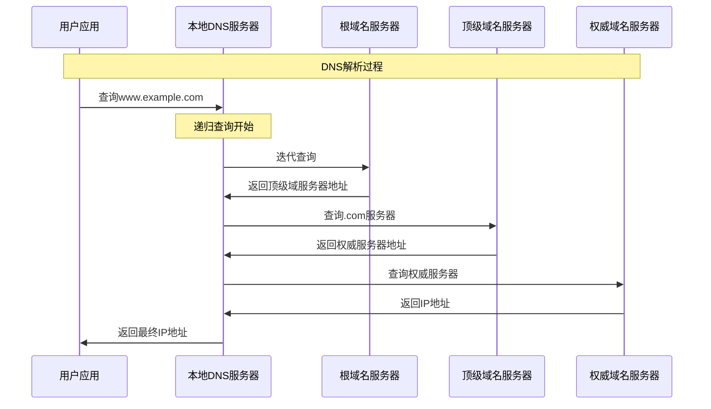
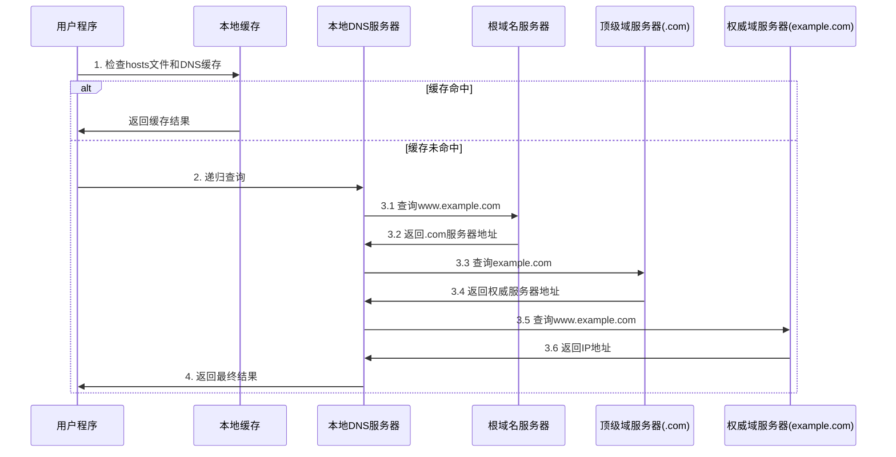

# 8.4 DNS域名系统原理与实现
 
## 目录

### 基础理论篇
1. [DNS系统概述](#1-dns系统概述)
2. [DNS域名空间结构](#2-dns域名空间结构)
3. [DNS查询过程](#3-dns查询过程)

### 技术实现篇
4. [DNS资源记录](#4-dns资源记录)
5. [DNS报文格式](#5-dns报文格式)
6. [DNS实现技术](#6-dns实现技术)

---

## 1. DNS系统概述

### 1.1 DNS基本概念

> **域名系统（Domain Name System，DNS）**
> 
> 互联网的一种重要服务，将便于记忆的域名转换为计算机能识别的IP地址，是互联网基础设施的重要组成部分。

#### DNS的作用和重要性

**DNS核心功能**：

**1. 域名到IP地址的映射**
- www.baidu.com → 183.232.231.174
- 人类可读 → 机器可读

**2. 分布式数据库系统**
- 全球分布的域名服务器
- 分层次的管理结构

**3. 应用层协议**
- UDP端口53（主要）
- TCP端口53（辅助）

### 1.2 DNS工作原理

#### 基本工作机制

**DNS解析原理**：



**解析步骤**：
1. 用户程序查询域名
2. 本地DNS服务器递归查询
3. 根服务器返回顶级域服务器地址
4. 顶级域服务器返回权威服务器地址
5. 权威服务器返回最终IP地址

---

## 2. DNS域名空间结构

### 2.1 分层域名空间

> **DNS域名空间（DNS Namespace）**
> 
> 采用分层树状结构组织的全球域名系统，从根域开始逐级向下分支，形成完整的域名层次结构。

#### 域名空间树结构

**DNS层次结构示例**：

**根域（.）**
- **顶级域**：com、edu、org、cn
  - **二级域**：google.com、microsoft.com、tsinghua.edu.cn
    - **三级域**：www.google.com、mail.google.com

**域名格式规则**：
- 完全限定域名：www.google.com.
- 相对域名：www.google.com
- 层次读取：从右到左

### 2.2 域名服务器层次

#### DNS服务器分类

**DNS服务器类型**：

**1. 根域名服务器**
- 全球13个根服务器
- 管理顶级域的权威信息
- 返回顶级域服务器地址

**2. 顶级域名服务器(TLD)**
- 管理.com、.org、.cn等
- 返回二级域权威服务器地址

**3. 权威域名服务器**
- 管理具体域名的DNS记录
- 提供最终的IP地址映射

**4. 本地域名服务器**
- ISP或组织维护
- 执行递归查询
- 缓存查询结果

### 2.3 域名管理机制

#### 域名注册和管理

**域名管理体系**：

| 级别 | 管理机构 | 职责 | 示例 |
|------|----------|------|------|
| **根域** | ICANN | 全球域名系统管理 | . |
| **顶级域** | 注册局 | 顶级域管理 | .com、.cn |
| **二级域** | 注册商 | 域名注册服务 | baidu.com |
| **子域** | 域名所有者 | 子域名管理 | www.baidu.com |

---

## 3. DNS查询过程

### 3.1 查询类型

#### 递归查询vs迭代查询

**查询方式对比**：

**递归查询(Recursive Query)**：
- 客户端只发一次请求
- 服务器负责完整解析
- 返回最终结果

**迭代查询(Iterative Query)**：
- 服务器间逐级查询
- 每次返回下一跳地址
- 查询者逐步接近结果

### 3.2 完整查询过程

#### DNS解析详细步骤

**完整查询流程**：



**解析步骤说明**：
1. **本地DNS向根服务器查询**
2. **根服务器返回.com顶级域服务器地址**
3. **查询.com服务器，返回example.com权威服务器地址**  
4. **查询权威服务器，返回www.example.com的IP地址**

### 3.3 DNS缓存机制

#### 缓存策略

**DNS缓存系统**：

**1. 浏览器缓存**
- 短期缓存（几分钟到几小时）
- 减少DNS查询延迟

**2. 操作系统缓存**
- 系统级DNS缓存
- 所有应用程序共享

**3. 本地DNS服务器缓存**
- ISP维护的缓存
- 区域性共享缓存

**4. TTL控制**
- 生存时间控制缓存有效期
- 平衡性能和一致性

---

## 4. DNS资源记录

### 4.1 资源记录概述

> **DNS资源记录（Resource Record，RR）**
> 
> DNS数据库中存储域名相关信息的基本单位，包含域名到各种网络资源的映射关系。

#### 资源记录格式

**RR基本格式**：

```
0                   1                   2                   3
0 1 2 3 4 5 6 7 8 9 0 1 2 3 4 5 6 7 8 9 0 1 2 3 4 5 6 7 8 9 0 1
────────────────────────────────────────────────────────────────
                    Name(域名)    TTL(生存时间)                  
────────────────────────────────────────────────────────────────
            Class(记录类别)    Type(记录类型)                    
────────────────────────────────────────────────────────────────
                        RData(记录数据)                         
────────────────────────────────────────────────────────────────
```

**示例**：
www.example.com. 300 IN A 192.168.1.100

### 4.2 主要记录类型

#### 常用DNS记录

**DNS记录类型详解**：

| 记录类型 | 全称 | 功能 | 示例 |
|----------|------|------|------|
| **A** | Address | IPv4地址 | www.example.com IN A 192.168.1.1 |
| **AAAA** | IPv6 Address | IPv6地址 | www.example.com IN AAAA 2001:db8::1 |
| **CNAME** | Canonical Name | 别名记录 | www IN CNAME server.example.com |
| **MX** | Mail Exchange | 邮件服务器 | example.com IN MX 10 mail.example.com |
| **NS** | Name Server | 域名服务器 | example.com IN NS ns1.example.com |
| **PTR** | Pointer | 反向解析 | 1.1.168.192.in-addr.arpa IN PTR www.example.com |
| **SOA** | Start of Authority | 权威信息 | 包含域的管理信息 |
| **TXT** | Text | 文本信息 | 用于SPF、DKIM等 |

### 4.3 特殊记录解析

#### MX记录详解

**邮件交换记录**：

**域名**：example.com

**MX记录**：
- example.com. IN MX 10 mail1.example.com.
- example.com. IN MX 20 mail2.example.com.
- example.com. IN MX 30 mail3.example.com.

**解释**：
- 优先级数字越小，优先级越高
- mail1.example.com 优先级最高(10)
- 邮件服务器按优先级顺序尝试投递
- 支持负载均衡和容错

#### CNAME记录机制

**别名记录原理**：

**查询过程**：
1. 查询：ftp.example.com
2. CNAME记录：ftp.example.com. IN CNAME server.example.com.
3. 继续查询：server.example.com.
4. A记录：server.example.com. IN A 192.168.1.100
5. 返回结果：192.168.1.100

**注意**：CNAME记录不能与其他记录类型共存

---

## 5. DNS报文格式

### 5.1 DNS消息结构

#### 报文基本格式

**DNS报文结构**：

```
DNS报文格式
                    报文头部（12字节）                        
────────────────────────────────────────────────────────────────
                      问题部分                               
                 (查询的域名和类型)                          
────────────────────────────────────────────────────────────────
                      回答部分                               
                (查询问题的资源记录)                          
────────────────────────────────────────────────────────────────
                      权威部分                               
              (权威域名服务器的资源记录)                      
────────────────────────────────────────────────────────────────
                      附加部分                               
                (额外的有用资源记录)                          
────────────────────────────────────────────────────────────────
```

### 5.2 报文头部格式

#### 头部字段详解

**DNS头部结构**：

```
DNS头部格式（12字节）
                    标识符ID(16)                          
────────────────────────────────────────────────────────────────
QR(1)│操作码(4)│AA(1)│TC(1)│RD(1)│RA(1)│保留(3)│响应码(4)
────────────────────────────────────────────────────────────────
                 问题计数QDCOUNT(16)                       
────────────────────────────────────────────────────────────────
                 回答计数ANCOUNT(16)                       
────────────────────────────────────────────────────────────────
                 权威计数NSCOUNT(16)                       
────────────────────────────────────────────────────────────────
                 附加计数ARCOUNT(16)                       
────────────────────────────────────────────────────────────────
```

**关键字段说明**：
- QR：查询(0)或响应(1)
- AA：权威回答
- RD：期望递归
- RA：递归可用
- RCODE：响应代码

### 5.3 查询和响应

#### 查询报文示例

**DNS查询示例**：

**查询：www.example.com的A记录**

**报文头部**：
- ID: 0x1234
- QR=0, OPCODE=0, RD=1
- QDCOUNT=1, ANCOUNT=0
- NSCOUNT=0, ARCOUNT=0

**问题部分**：
- QNAME: www.example.com
- QTYPE: A (1)
- QCLASS: IN (1)

#### 响应报文示例

**DNS响应示例**：

**响应：www.example.com -> 192.168.1.100**

**报文头部**：
- ID: 0x1234
- QR=1, OPCODE=0, AA=1, RD=1, RA=1
- QDCOUNT=1, ANCOUNT=1
- NSCOUNT=0, ARCOUNT=0

**回答部分**：
- NAME: www.example.com
- TYPE: A, CLASS: IN
- TTL: 300, RDLENGTH: 4
- RDATA: 192.168.1.100

---

## 6. DNS实现技术

### 6.1 DNS负载均衡

#### 负载分配机制

**DNS负载均衡技术**：

**域名**：www.example.com

**多个A记录**：
- www.example.com. IN A 192.168.1.100
- www.example.com. IN A 192.168.1.101  
- www.example.com. IN A 192.168.1.102

**轮询策略**：
- 查询1 → 返回 192.168.1.100
- 查询2 → 返回 192.168.1.101
- 查询3 → 返回 192.168.1.102
- 查询4 → 返回 192.168.1.100 (循环)

**优势**：
- 简单的负载分配
- 自动故障切换
- 无需额外设备

### 6.2 DNS安全机制

#### DNSSEC安全扩展

**DNS安全技术**：

**主要威胁**：
- DNS欺骗/投毒攻击
- 中间人攻击
- DNS劫持

**DNSSEC防护**：
- 数字签名验证
- 链式信任验证
- 数据完整性保证

### 6.3 DNS性能优化

#### 优化策略

**DNS性能优化技术**：

| 优化技术 | 实现方式 | 效果 |
|----------|----------|------|
| **缓存优化** | 合理设置TTL值 | 减少查询延迟 |
| **就近解析** | CDN技术 | 降低网络延迟 |
| **预解析** | 预加载域名 | 提高访问速度 |
| **并行查询** | 同时查询多个服务器 | 提高可靠性 |

---

## 知识点总结

### 核心知识总结

**DNS核心知识点**：

**1. DNS基本概念 ⭐⭐⭐⭐⭐**
- 域名到IP地址映射
- 分布式数据库系统

**2. DNS层次结构 ⭐⭐⭐⭐⭐**
- 根域、顶级域、权威域
- 域名服务器分类

**3. DNS查询过程 ⭐⭐⭐⭐⭐**
- 递归查询vs迭代查询
- 完整解析步骤

**4. DNS资源记录 ⭐⭐⭐⭐**
- A、CNAME、MX、NS记录
- 记录格式和用途

**5. DNS报文格式 ⭐⭐⭐⭐**
- 报文结构和头部格式
- 查询响应过程

### 典型考试题型

**常见题目类型**：
1. **概念理解题**：DNS作用、工作原理
2. **结构分析题**：域名层次结构、服务器分类
3. **过程分析题**：DNS查询解析过程
4. **记录解析题**：各类DNS资源记录的含义
5. **计算分析题**：DNS查询时间、缓存命中率

### 实践应用

**DNS在实际应用中的重要性**：
- 网站访问的基础设施
- 邮件系统的关键组件
- 负载均衡和容错的重要手段
- 互联网服务的核心支撑技术

DNS系统作为互联网基础设施的重要组成部分，其理解和掌握对于网络技术学习具有重要意义。

---

## 典型例题与解析

### 例题8.4.1：DNS查询过程分析

> **【408真题·2020年】**
> 
> 下列关于DNS域名解析过程的描述，正确的是（）
> 
> A. 递归查询只能由客户端发起
> B. 迭代查询由客户端逐步访问各级域名服务器
> C. 本地DNS服务器总是向根域名服务器发起查询
> D. 本地DNS服务器代理客户端完成递归查询过程

**分析**：
- 递归查询：本地DNS服务器代理客户端完成整个查询过程
- 迭代查询：本地DNS服务器逐级查询各级域名服务器
- 客户端通常只与本地DNS服务器交互
- 并非总是需要查询根服务器（缓存机制）

**解答**：正确答案是D

**解题技巧**：
- 理解递归查询和迭代查询的主体
- 递归查询：客户端→本地DNS，本地DNS代为查询
- 迭代查询：本地DNS→各级服务器，逐级获取地址

### 例题8.4.2：DNS记录类型理解

> **【408模拟题】**
> 
> 某域名配置了以下DNS记录：
> ```
> www.example.com.    300 IN A     192.168.1.100
> mail.example.com.   300 IN A     192.168.1.200  
> example.com.        300 IN MX 10 mail.example.com.
> ftp.example.com.    300 IN CNAME www.example.com.
> ```
> 
> 关于这些记录的说法错误的是（）
> 
> A. www.example.com解析到192.168.1.100
> B. 发送到example.com的邮件会投递到mail.example.com
> C. ftp.example.com是www.example.com的别名
> D. CNAME记录可以与MX记录同时存在于同一域名

**分析**：
- A记录：域名到IPv4地址的直接映射
- MX记录：指定邮件服务器，优先级10
- CNAME记录：域名别名，指向目标域名
- CNAME记录不能与其他记录类型共存

**解答**：正确答案是D

### 例题8.4.3：DNS查询时间计算

> **【408计算题】**
> 
> 某企业网络环境下DNS查询性能分析：
> - 本地DNS服务器到根服务器RTT：200ms
> - 本地DNS服务器到.com服务器RTT：150ms
> - 本地DNS服务器到权威服务器RTT：100ms
> - 本地DNS缓存命中率：80%
> - 各级服务器处理时间：10ms
> 
> 计算用户查询一个新域名的平均响应时间和系统平均响应时间。

**分析**：
- 新域名查询需要完整的迭代查询过程
- 缓存命中时直接返回，无需远程查询
- 需要考虑各级服务器的RTT和处理时间

**解答**：

**1. 新域名查询时间（缓存未命中）：**
- 查询根服务器：200ms/2 + 10ms = 110ms
- 查询.com服务器：150ms/2 + 10ms = 85ms  
- 查询权威服务器：100ms/2 + 10ms = 60ms
- 总时间：110ms + 85ms + 60ms = 255ms

**2. 系统平均响应时间：**
- 缓存命中时间：10ms（本地处理）
- 平均时间：80% × 10ms + 20% × 255ms = 8ms + 51ms = 59ms

**解题技巧**：
- RTT需要除以2（单向延迟）
- 考虑处理时间和传输时间
- 加权平均计算系统性能

### 例题8.4.4：DNS负载均衡计算

> **【408计算题】**
> 
> 某网站使用DNS负载均衡，配置了3个A记录：
> ```
> www.site.com. 300 IN A 1.1.1.1
> www.site.com. 300 IN A 2.2.2.2  
> www.site.com. 300 IN A 3.3.3.3
> ```
> 
> 如果DNS服务器采用轮询算法，TTL为300秒，分析以下场景的负载分配：
> - 场景1：1000个用户同时首次访问
> - 场景2：考虑TTL缓存效应的连续访问

**分析**：
- DNS轮询按顺序返回不同IP地址
- TTL控制客户端缓存时间
- 实际负载分配受缓存影响

**解答**：

**场景1（首次访问）：**
- 理想情况：每个服务器分配约333个用户
- 实际情况：取决于查询到达顺序和DNS实现
- 负载分配比例约为 1:1:1

**场景2（考虑缓存）：**
- 300秒内用户重复访问使用缓存IP
- 新用户仍需DNS查询，继续轮询
- 负载均衡效果随时间趋于平衡

### 例题8.4.5：DNS故障诊断

> **【408综合题】**
> 
> 某用户反映无法访问www.example.com，但可以直接访问IP地址192.168.1.100。
> 网络管理员需要诊断DNS问题，请描述系统化的排查步骤。

**标准答案**：

**第1步：检查本地配置**
- 检查网络连接：ping网关和外网
- 检查DNS配置：ipconfig /all查看DNS服务器设置
- 清除DNS缓存：ipconfig /flushdns

**第2步：测试DNS解析**
- 测试本地DNS：nslookup www.example.com
- 测试其他域名：nslookup www.baidu.com
- 测试直接查询：nslookup www.example.com 8.8.8.8

**第3步：逐级追踪**
- 查询根服务器：nslookup www.example.com a.root-servers.net
- 查询顶级域：nslookup www.example.com a.gtld-servers.net
- 确认权威服务器：dig www.example.com +trace

**第4步：分析结果**
- 如果本地DNS无响应：更换DNS服务器
- 如果权威服务器故障：联系域名服务商
- 如果配置错误：检查A记录配置

---

## DNS性能优化与故障处理

### DNS性能监控指标

**关键性能指标（KPI）**：

| 指标名称 | 正常范围 | 监控方法 | 优化措施 |
|----------|----------|----------|----------|
| **查询响应时间** | <100ms | ping/dig命令 | 优化缓存、就近部署 |
| **缓存命中率** | >80% | 服务器日志分析 | 调整TTL值 |
| **可用性** | >99.9% | 监控工具 | 主备切换、多服务器 |
| **QPS处理能力** | 根据需求 | 压力测试 | 负载均衡、集群扩展 |

### 常见DNS故障类型

**故障分类与解决方案**：

**1. 解析失败类故障**
- **症状**：域名无法解析，返回NXDOMAIN
- **原因**：域名记录不存在、权威服务器故障
- **解决**：检查域名配置、联系服务商

**2. 解析超时类故障**
- **症状**：查询超时，无响应
- **原因**：网络延迟、服务器过载
- **解决**：更换DNS服务器、网络优化

**3. 解析错误类故障**
- **症状**：返回错误IP地址
- **原因**：缓存污染、配置错误
- **解决**：清除缓存、修正配置

### DNS安全防护

**安全威胁与防护措施**：

**1. DNS欺骗攻击**
- **威胁**：返回虚假IP地址
- **防护**：使用DNSSEC、可信DNS服务器

**2. DNS放大攻击**
- **威胁**：利用DNS进行DDoS攻击
- **防护**：限制查询速率、过滤异常流量

**3. 缓存污染**
- **威胁**：恶意数据进入缓存
- **防护**：定期清理缓存、源IP验证

