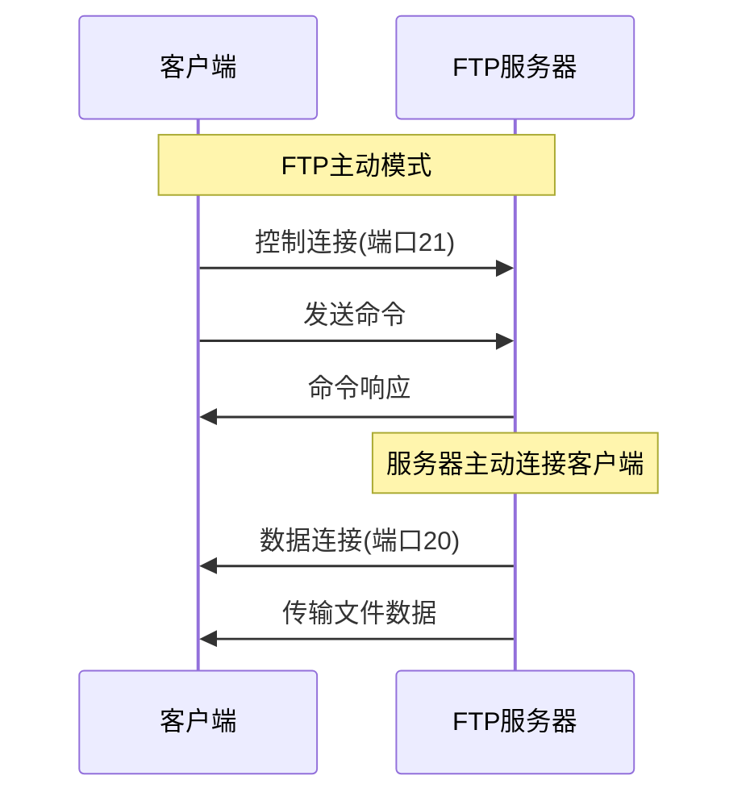
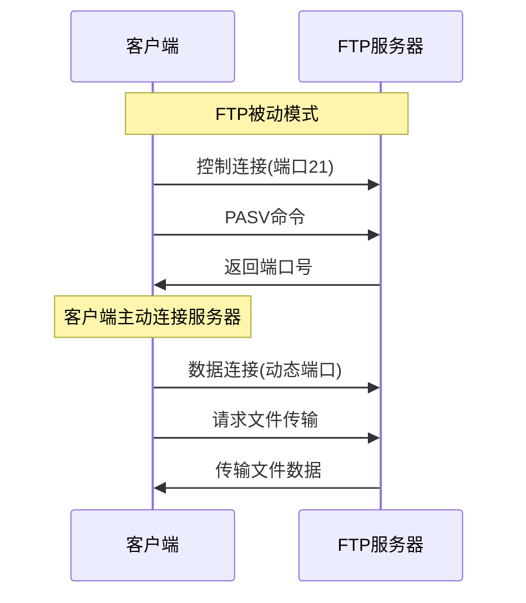
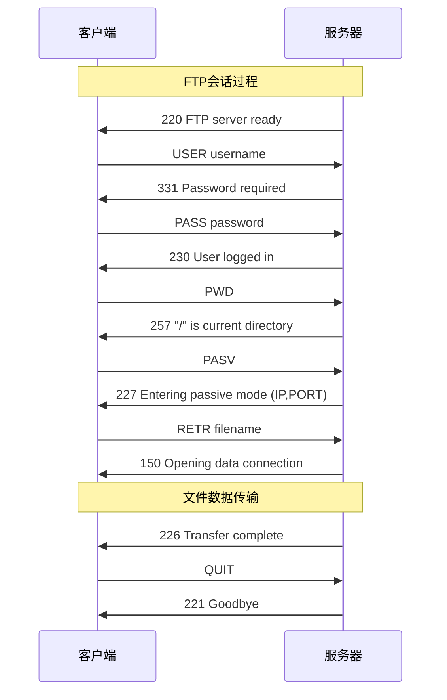
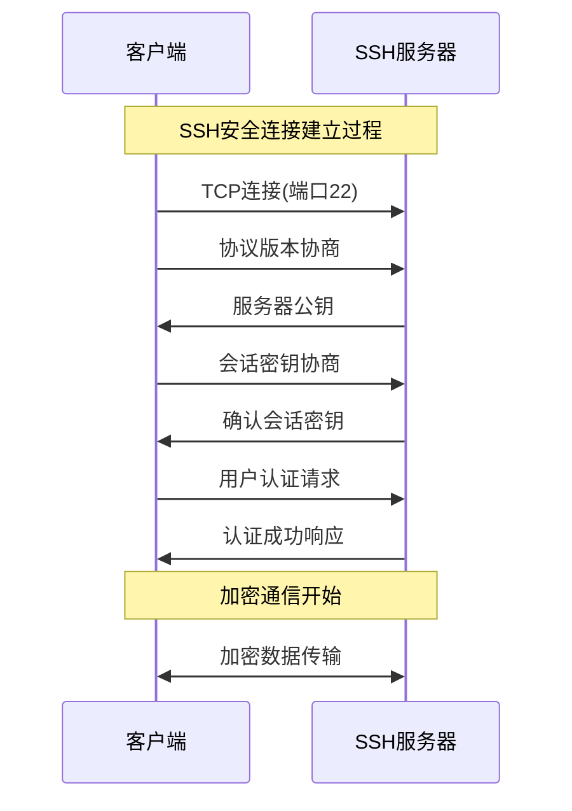
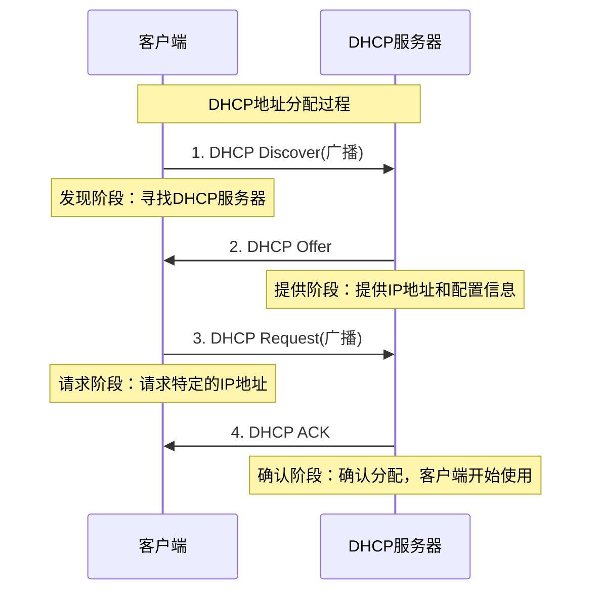

# 8.5 FTP与其他应用层协议

## 目录

### 基础理论篇
1. [FTP文件传输协议](#1-ftp文件传输协议)
2. [远程访问协议](#2-远程访问协议)
3. [网络管理协议](#3-网络管理协议)

### 综合应用篇
4. [动态配置协议](#4-动态配置协议)
5. [其他重要应用层协议](#5-其他重要应用层协议)
6. [应用层协议对比分析](#6-应用层协议对比分析)

---

## 1. FTP文件传输协议

### 1.1 FTP协议概述

> **文件传输协议（File Transfer Protocol，FTP）**
> 
> 用于在网络上进行文件传输的应用层协议，支持可靠的文件上传、下载和管理功能。

#### FTP协议特点

**FTP核心特征**：

**1. 双连接架构**
- 控制连接：传输命令和响应
- 数据连接：传输文件内容

**2. 基于TCP传输**
- 控制连接：TCP端口21
- 数据连接：TCP端口20或动态端口

**3. 有状态协议**
- 服务器维护用户状态
- 支持断点续传

**4. 明文传输**
- 用户名密码明文传输
- 需要FTPS/SFTP加强安全

### 1.2 FTP连接模式

#### 主动模式 vs 被动模式

**FTP主动模式（Active Mode）**：

**特点**：
- 服务器主动连接客户端数据端口
- 客户端防火墙可能阻止连接
- 服务器使用端口20建立数据连接

**FTP被动模式（Passive Mode）**：

**特点**：
- 客户端主动连接服务器数据端口
- 服务器使用动态端口等待连接
- 适合客户端有防火墙的环境

### 1.3 FTP命令和响应

#### 常用FTP命令

**FTP命令分类**：

| 命令类别 | 主要命令 | 功能 |
|----------|----------|------|
| **连接管理** | USER、PASS、QUIT | 用户认证和连接控制 |
| **目录操作** | PWD、CWD、LIST | 目录浏览和切换 |
| **文件传输** | RETR、STOR、APPE | 文件上传下载 |
| **传输控制** | TYPE、MODE、PASV | 传输模式设置 |

#### FTP会话示例

**典型FTP会话**：

### 1.4 FTP安全问题

#### 安全改进版本

**FTP安全解决方案**：

**传统FTP问题**：
- 明文传输用户名密码
- 数据传输无加密
- 容易被窃听和篡改

**安全改进方案**：
- FTPS：FTP over SSL/TLS
- SFTP：SSH File Transfer Protocol
- SCP：Secure Copy Protocol

---

## 2. 远程访问协议

### 2.1 Telnet协议

> **远程登录协议（Telecommunication Network Protocol，Telnet）**
> 
> 提供远程登录功能的应用层协议，允许用户通过网络登录到远程主机并执行命令。

#### Telnet协议特点

**Telnet基本特征**：

**1. 基本功能**
- 远程终端访问
- 基于TCP，端口23
- 字符模式操作

**2. 工作机制**
- 客户端发送键盘输入
- 服务器返回屏幕输出
- 支持协商选项

**3. 安全问题**
- 明文传输
- 易被窃听
- 现已较少使用

### 2.2 SSH协议

> **安全外壳协议（Secure Shell，SSH）**
> 
> 提供安全远程登录和命令执行的协议，是Telnet的安全替代方案。

#### SSH协议优势

**SSH vs Telnet对比**：

| 特性 | Telnet | SSH |
|------|--------|-----|
| **端口号** | 23 | 22 |
| **传输安全** | 明文 | 加密 |
| **身份认证** | 密码 | 密码/密钥 |
| **数据完整性** | 无保证 | 完整性校验 |
| **应用场景** | 内网测试 | 生产环境 |

#### SSH工作原理

**SSH连接过程**：

**安全特性**：
- 公钥加密用于密钥交换
- 对称加密用于数据传输
- 数字签名确保完整性

---

## 3. 网络管理协议

### 3.1 SNMP协议概述

> **简单网络管理协议（Simple Network Management Protocol，SNMP）**
> 
> 用于网络设备监控和管理的应用层协议，是网络管理的标准协议。

#### SNMP架构组件

**SNMP管理模型**：

**网络管理站(NMS)**
- SNMP管理软件
- 发送管理命令
- 接收告警信息

**SNMP代理(Agent)**
- 运行在被管设备上
- 维护管理信息库(MIB)
- 响应管理请求

**通信协议**：SNMP协议，UDP端口161/162

### 3.2 SNMP操作类型

#### SNMP消息类型

**SNMP操作分类**：

| 操作类型 | 方向 | 功能 | 端口 |
|----------|------|------|------|
| **GET** | NMS→Agent | 获取单个变量值 | 161 |
| **GETNEXT** | NMS→Agent | 获取下一个变量值 | 161 |
| **SET** | NMS→Agent | 设置变量值 | 161 |
| **TRAP** | Agent→NMS | 主动发送告警 | 162 |

#### MIB管理信息库

**MIB结构示例**：

**树状结构**：
- root
  - iso(1)
    - org(3)
      - dod(6)
        - internet(1)
          - mgmt(2)
            - mib-2(1)
              - system(1)
              - interfaces(2)
              - ip(4)
              - tcp(6)

**对象标识符示例**：
system.sysDescr.0 = 1.3.6.1.2.1.1.1.0

---

## 4. 动态配置协议

### 4.1 DHCP协议概述

> **动态主机配置协议（Dynamic Host Configuration Protocol，DHCP）**
> 
> 用于自动分配IP地址和网络配置参数的协议，大大简化了网络管理工作。

#### DHCP工作原理

**DHCP四个阶段**：

### 4.2 DHCP工作过程

#### DHCP四阶段工作过程

**各阶段技术细节**：

**阶段1：DISCOVER（发现阶段）**
- 源IP：0.0.0.0
- 目标IP：255.255.255.255（广播）
- 源端口：68，目标端口：67
- 作用：寻找网络中的DHCP服务器

**阶段2：OFFER（提供阶段）**
- 源IP：DHCP服务器IP
- 目标IP：255.255.255.255（广播）
- 内容：可用IP地址+配置选项
- 作用：服务器响应配置信息

**阶段3：REQUEST（请求阶段）**
- 源IP：0.0.0.0
- 目标IP：255.255.255.255（广播）
- 内容：请求特定IP和服务器ID
- 作用：正式申请IP地址

**阶段4：ACK（确认阶段）**
- 源IP：DHCP服务器IP
- 目标IP：新分配的客户端IP
- 内容：最终配置参数
- 作用：完成地址分配

#### 地址租约管理

**租约生命周期**：

**租约分配**：
- 租约时间：通常24小时
- 地址状态：已分配
- 续约时间：租约时间的50%

**租约续约**：
- 触发时间：租约50%时自动触发
- 续约方式：单播REQUEST消息
- 成功响应：延长租约时间

**租约释放**：
- 主动释放：客户端发送RELEASE
- 自动过期：租约时间到期
- 地址回收：返回可用地址池

### 4.3 DHCP配置选项

#### 常用配置参数

**DHCP配置选项列表**：

| 选项号 | 参数名称 | 功能描述 |
|--------|----------|----------|
| **1** | 子网掩码 | 定义网络范围 |
| **3** | 默认网关 | 指定路由器地址 |
| **6** | DNS服务器 | 域名解析服务 |
| **15** | 域名 | 本地域名后缀 |
| **28** | 广播地址 | 网络广播地址 |
| **51** | 租约时间 | IP地址使用期限 |
| **54** | 服务器标识 | DHCP服务器ID |

#### 企业网络DHCP配置实例

**典型企业DHCP配置**：

**网络环境**：
- 网段：192.168.1.0/24
- 网关：192.168.1.1
- DNS：192.168.1.10, 8.8.8.8

**地址池配置**：
- 起始地址：192.168.1.100
- 结束地址：192.168.1.200
- 保留地址：192.168.1.1-99（静态）
- 租约时间：24小时

**高级选项**：
- 静态绑定：MAC→IP映射
- 选项过滤：基于客户端类型
- 故障转移：主备服务器配置

### 4.4 DHCP故障排除

#### 常见故障类型

**DHCP故障诊断**：

**故障1：客户端无法获取IP地址**

**可能原因**：
- DHCP服务器未启动
- 地址池已耗尽
- 网络连接问题

**诊断方法**：
- 检查DHCP服务状态
- 查看地址池使用情况
- 测试网络连通性

**故障2：获取错误的网络配置**

**可能原因**：
- DHCP配置错误
- 多个DHCP服务器冲突
- 网络中存在恶意DHCP

**解决方案**：
- 验证DHCP配置正确性
- 启用DHCP Snooping
- 实施网络准入控制

**故障3：租约续约失败**

**可能原因**：
- 服务器故障或重启
- 网络不稳定
- 防火墙阻止DHCP流量

**解决方案**：
- 配置DHCP高可用性
- 优化网络稳定性
- 调整防火墙规则

#### 网络排错工具

**DHCP排错工具箱**：

**命令行工具**：
- ipconfig /release（释放IP）
- ipconfig /renew（重新获取IP）
- ipconfig /all（查看配置）
- dhclient -v（Linux DHCP客户端）

**网络监控**：
- Wireshark：抓包分析DHCP流量
- tcpdump：命令行抓包工具
- DHCP日志：服务器日志分析

**测试工具**：
- DHCP测试客户端
- 网络连通性测试
- 端口扫描工具

---

## 5. 其他重要应用层协议

### 5.1 NTP时间同步协议

> **网络时间协议（Network Time Protocol，NTP）**
> 
> 用于网络时间同步的协议，确保网络中所有设备的时间一致性。

#### NTP工作机制

**NTP时间同步原理**：

**NTP层次结构**：
- Stratum 0：原子钟、GPS时钟
- Stratum 1：直连参考时钟的服务器
- Stratum 2：从Stratum 1同步的服务器
- ...
- Stratum 15：最大层次

**时间同步算法**：
- 网络延迟测量
- 时钟偏差计算
- 逐步调整本地时钟
- 保持时间连续性

### 5.2 LDAP目录服务

> **轻量级目录访问协议（Lightweight Directory Access Protocol，LDAP）**
> 
> 用于访问和维护分布式目录信息服务的协议。

#### LDAP特点

**LDAP协议特征**：

**1. 目录结构**
- 树状层次结构
- 分布式存储
- 标准化schema

**2. 访问特性**
- 读多写少
- 快速查询
- 标准化接口

**3. 应用场景**
- 企业通讯录
- 用户认证
- 资源管理

### 5.3 SIP会话协议

> **会话初始协议（Session Initiation Protocol，SIP）**
> 
> 用于建立、修改和终止多媒体会话的信令协议。

#### SIP应用场景

**SIP协议应用**：

**VoIP通信**：
- 语音通话建立
- 视频会议控制
- 即时消息传递

**多媒体会话**：
- 会话参数协商
- 参与者管理
- 会话状态控制

---

## 6. 应用层协议对比分析

### 6.1 协议分类汇总

#### 按功能分类对比

**应用层协议功能分类**：

| 功能类别 | 协议 | 端口 | 传输层 | 主要用途 |
|----------|------|------|--------|----------|
| **Web服务** | HTTP/HTTPS | 80/443 | TCP | 网页浏览 |
| **文件传输** | FTP | 21/20 | TCP | 文件传输 |
| **电子邮件** | SMTP/POP3/IMAP | 25/110/143 | TCP | 邮件收发 |
| **域名解析** | DNS | 53 | UDP/TCP | 域名解析 |
| **远程访问** | Telnet/SSH | 23/22 | TCP | 远程登录 |
| **网络管理** | SNMP | 161/162 | UDP | 设备管理 |
| **动态配置** | DHCP | 67/68 | UDP | 地址分配 |

### 6.2 安全性对比

#### 协议安全特性

**安全性分析**：

**明文传输协议**：
- HTTP、FTP、Telnet、SNMP
- 存在安全风险
- 需要安全改进版本

**安全传输协议**：
- HTTPS、FTPS/SFTP、SSH
- 提供加密保护
- 现代应用推荐使用

**混合安全协议**：
- DNS（支持DNSSEC）
- SMTP（支持TLS扩展）
- 可选择安全增强

### 6.3 性能特征对比

#### 协议性能分析

**性能特征比较**：

| 协议 | 连接类型 | 状态特性 | 并发性 | 适用场景 |
|------|----------|----------|--------|----------|
| **HTTP** | 无连接 | 无状态 | 高 | Web浏览 |
| **FTP** | 双连接 | 有状态 | 中 | 文件传输 |
| **SMTP** | 持久连接 | 有状态 | 中 | 邮件发送 |
| **DNS** | 无连接 | 无状态 | 高 | 域名查询 |
| **SSH** | 持久连接 | 有状态 | 低 | 远程管理 |

---

## 典型例题与解析

### 例题8.5.1：FTP连接模式理解

> **例题**
> 
> FTP协议的被动模式（PASV）与主动模式相比，主要区别是（）
> 
> A. 被动模式使用UDP协议，主动模式使用TCP协议
> B. 被动模式由客户端建立数据连接，主动模式由服务器建立数据连接
> C. 被动模式不需要身份认证，主动模式需要身份认证
> D. 被动模式传输速度更快，主动模式传输速度较慢

**分析**：
- 主动模式：服务器主动连接客户端的数据端口
- 被动模式：客户端主动连接服务器的数据端口
- 两种模式都使用TCP协议，都需要身份认证
- 传输速度没有显著差异

**解答**：正确答案是B

**解题技巧**：
- 记住关键词："被动"指服务器被动等待连接
- 主动模式易被防火墙阻止
- 被动模式适用于客户端有防火墙的情况

### 例题8.5.2：DHCP工作过程分析

> **例题**
> 
> DHCP协议的四个阶段按正确顺序排列为（）
> 
> A. REQUEST → DISCOVER → OFFER → ACK
> B. DISCOVER → OFFER → REQUEST → ACK
> C. OFFER → DISCOVER → ACK → REQUEST
> D. DISCOVER → REQUEST → OFFER → ACK

**分析**：
- DISCOVER：客户端广播寻找DHCP服务器
- OFFER：服务器提供IP地址配置
- REQUEST：客户端请求特定IP地址
- ACK：服务器确认分配

**解答**：正确答案是B

### 例题8.5.3：协议端口号综合

> **例题**
> 
> 以下协议与端口号的对应关系，错误的是（）
> 
> A. SNMP - 161/162
> B. DHCP - 67/68
> C. SSH - 23
> D. TFTP - 69

**分析**：
- SNMP使用161（查询）和162（陷阱）
- DHCP使用67（服务器）和68（客户端）
- SSH使用22端口，Telnet使用23端口
- TFTP使用69端口

**解答**：正确答案是C（SSH应该是22端口）

### 例题8.5.4：DHCP地址池计算

> **例题**
> 
> 某企业网络DHCP配置如下：
> - 网络地址：192.168.10.0/24
> - 保留地址：192.168.10.1-192.168.10.50（静态分配）
> - DHCP地址池：192.168.10.51-192.168.10.200
> - 租约时间：24小时
> - 当前活跃用户：120个
> 
> 计算：(1)可用地址数量 (2)地址利用率 (3)租约续期影响

**分析**：
- 需要理解DHCP地址分配机制
- 考虑网络地址、广播地址、保留地址
- 计算实际可用地址池大小

**解答**：

**1. 可用地址数量：**
- 总地址：192.168.10.0/24 = 256个地址
- 减去网络地址：192.168.10.0（1个）
- 减去广播地址：192.168.10.255（1个）
- 减去保留地址：192.168.10.1-50（50个）
- DHCP地址池：192.168.10.51-200（150个）
- 可用地址：150个

**2. 地址利用率：**
- 当前使用：120个地址
- 利用率：120/150 = 80%

**3. 租约续期影响：**
- 24小时租约，客户端在12小时时开始续期
- 正常情况下不会释放地址
- 异常断线24小时后地址回收
- 建议监控利用率，超过90%需扩容

### 例题8.5.5：协议选择综合分析

> **例题**
> 
> 某公司需要搭建以下应用系统，请为每个应用选择最适合的协议组合，并说明理由：
> 
> (1) 企业官网 (2) 文件共享系统 (3) 网络设备监控 (4) 员工邮箱系统

**标准答案**：

**(1) 企业官网**
- **协议选择**：HTTPS（443端口）
- **理由**：
  - 安全性：加密传输保护用户隐私
  - 兼容性：所有浏览器支持
  - SEO优势：搜索引擎优先收录HTTPS网站
  - 证书认证：增强用户信任度

**(2) 文件共享系统**
- **协议选择**：SFTP（SSH File Transfer Protocol）
- **理由**：
  - 安全性：SSH加密传输
  - 功能完善：支持断点续传、权限控制
  - 防火墙友好：单端口连接
  - 集成认证：可与企业认证系统集成

**(3) 网络设备监控**
- **协议选择**：SNMPv3（161/162端口）
- **理由**：
  - 标准化：设备厂商广泛支持
  - 轻量级：UDP协议，开销小
  - 实时性：支持陷阱（Trap）主动告警
  - 安全性：v3版本支持加密和认证

**(4) 员工邮箱系统**
- **协议选择**：
  - 发送：SMTPS（SMTP over TLS，端口587）
  - 接收：IMAPS（IMAP over TLS，端口993）
- **理由**：
  - 安全性：TLS加密保护邮件内容
  - 多设备同步：IMAP支持多终端访问
  - 企业集成：支持域认证和策略管理
  - 移动友好：适合手机、平板访问

---

## 应用层协议综合应用

### 企业网络协议配置实践

**企业级协议部署策略**：

**核心服务配置**：

| 服务类型 | 协议配置 | 安全设置 | 负载均衡 |
|----------|----------|----------|----------|
| **Web服务** | HTTPS + HTTP/2 | TLS 1.3、HSTS | 反向代理+DNS轮询 |
| **邮件服务** | SMTPS + IMAPS | DKIM + SPF + DMARC | MX记录优先级 |
| **文件服务** | SFTP + WebDAV | SSH密钥认证 | 分布式存储 |
| **监控服务** | SNMPv3 + HTTPS API | 社区字符串+加密 | 监控服务器集群 |

### 协议安全加固方案

**安全防护体系**：

**1. 传输层安全**
- 强制使用TLS 1.2及以上版本
- 禁用不安全的协议（SSLv3、TLS 1.0）
- 定期更新证书和密钥

**2. 应用层防护**
- 实施访问控制和身份认证
- 部署Web应用防火墙（WAF）
- 启用协议级别的安全特性

**3. 网络层隔离**
- VLAN划分业务网络
- 防火墙策略精细化管理
- 入侵检测和防御系统

### 性能优化最佳实践

**协议性能优化策略**：

**1. HTTP性能优化**
- 启用HTTP/2多路复用
- 配置适当的缓存策略
- 使用CDN加速静态资源
- 压缩传输内容（gzip/brotli）

**2. DNS性能优化**
- 部署递归DNS缓存服务器
- 设置合理的TTL值
- 使用Anycast技术提升响应速度
- 实施DNS预解析和预连接

**3. 邮件系统优化**
- 配置邮件中继和智能路由
- 实施邮件压缩和去重
- 优化SMTP连接池管理
- 部署反垃圾邮件系统

