# 9.网络设备综合分析与对比

## 目录
- [9.1 网络设备分层架构](#91-网络设备分层架构)
- [9.2 物理层设备详解](#92-物理层设备详解)
- [9.3 数据链路层设备详解](#93-数据链路层设备详解)
- [9.4 网络层设备详解](#94-网络层设备详解)
- [9.5 设备性能对比分析](#95-设备性能对比分析)
- [9.6 网络架构设计指南](#96-网络架构设计指南)
- [9.7 考研重点总结](#97-考研重点总结)

---

## 9.1 网络设备分层架构

### OSI模型与设备对应关系

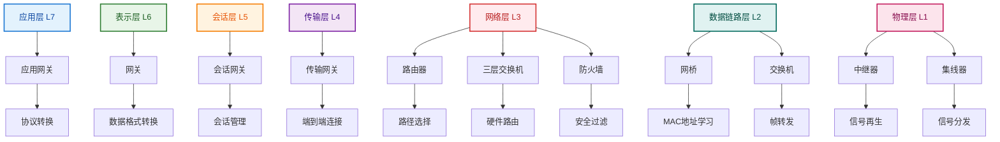

**OSI层次与设备功能对应表**：

| OSI层次 | 设备类型 | 主要功能 | 应用场景 |
|---------|---------|---------|---------|
| **应用层** | 应用网关 | 协议转换 | HTTP/HTTPS代理 |
| **表示层** | 网关 | 数据格式转换 | 加密解密、压缩 |
| **会话层** | 会话网关 | 会话管理 | 负载均衡器 |
| **传输层** | 传输网关 | 端到端连接 | 防火墙、NAT |
| **网络层** | 路由器、三层交换机、防火墙 | 路径选择、安全过滤 | 网络互连 |
| **数据链路层** | 网桥、交换机 | MAC地址学习、帧转发 | 局域网交换 |
| **物理层** | 中继器、集线器 | 信号再生、信号分发 | 距离延长 |

### 网络设备工作域对比

#### **工作范围分类**

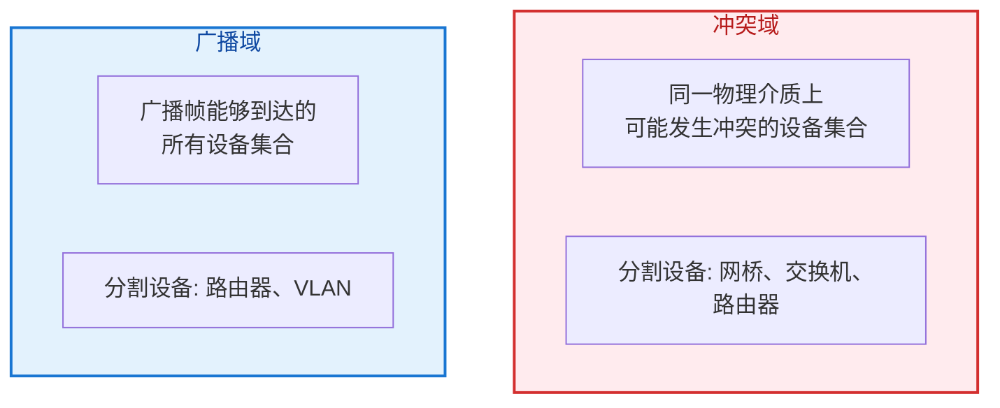

#### **设备对冲突域和广播域的影响分析**

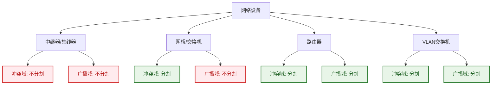

**设备影响对比表**：

| 设备 | 冲突域 | 广播域 | 主要特点 | 应用场景 |
|------|-------|-------|---------|---------|
| **中继器/集线器** | ❌ 不分割 | ❌ 不分割 | 物理层设备，简单信号放大 | 小型网络、信号延长 |
| **网桥/交换机** | ✅ 分割 | ❌ 不分割 | 数据链路层设备，MAC学习 | 局域网内部交换 |
| **路由器** | ✅ 分割 | ✅ 分割 | 网络层设备，IP路由 | 网络间互连 |
| **VLAN交换机** | ✅ 分割 | ✅ 分割 | 支持VLAN的二层设备 | 虚拟网络划分 |

---

## 9.2 物理层设备详解

### 中继器（Repeater）

#### **工作原理**


#### **技术特性**
- **工作层次**：物理层（第1层）
- **转发方式**：比特级信号再生
- **延迟特性**：约为几个比特时间
- **距离扩展**：可延长网络传输距离

#### **应用场景**


> **距离延长效果**：单段最大传输距离从100m延长到200m，有效解决了长距离传输中的信号衰减问题。

### 集线器（Hub）

#### **工作原理**
> **集线器本质**：多端口中继器，工作在物理层，采用半双工通信方式。

#### **技术特性**

##### **共享带宽机制**
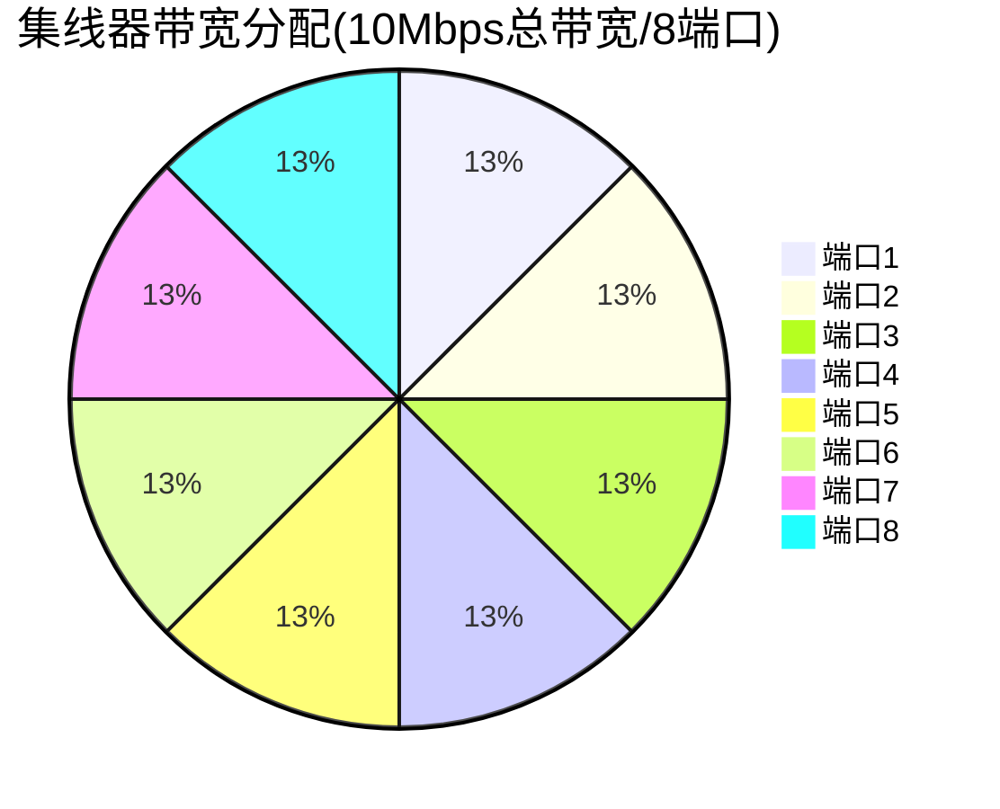

> **带宽计算**：每端口理论最大带宽 = 10Mbps ÷ 8 = 1.25Mbps

##### **CSMA/CD冲突检测机制**
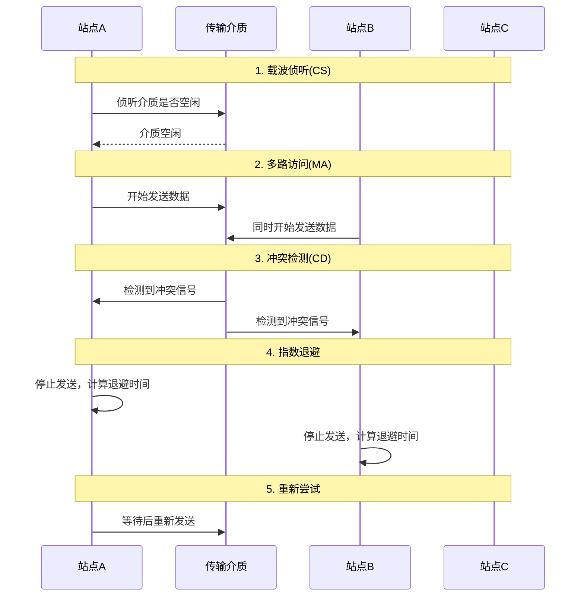

#### **性能限制**
- **半双工通信**：不能同时发送和接收
- **冲突域扩大**：所有端口属于同一冲突域
- **性能下降**：节点增加导致冲突概率上升

### 现代应用场景

#### **工业以太网应用**

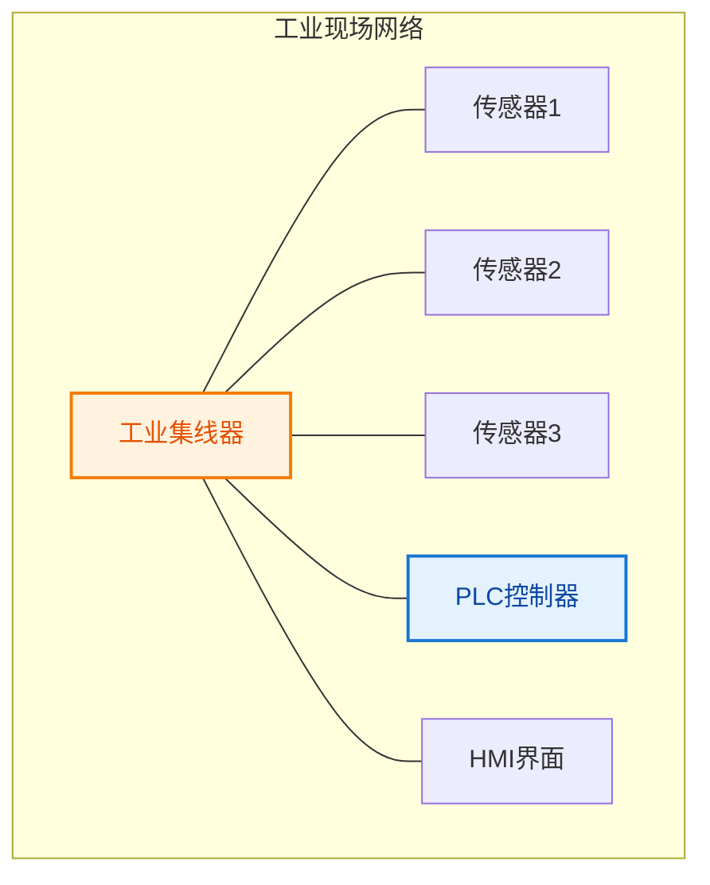

> **工业应用优势**：集线器在工业环境中提供了简单可靠的连接方式，适合对实时性要求不高但对稳定性要求较高的场景。

---

## 9.3 数据链路层设备详解

### 网桥（Bridge）

#### **核心功能**
1. **MAC地址学习机制**

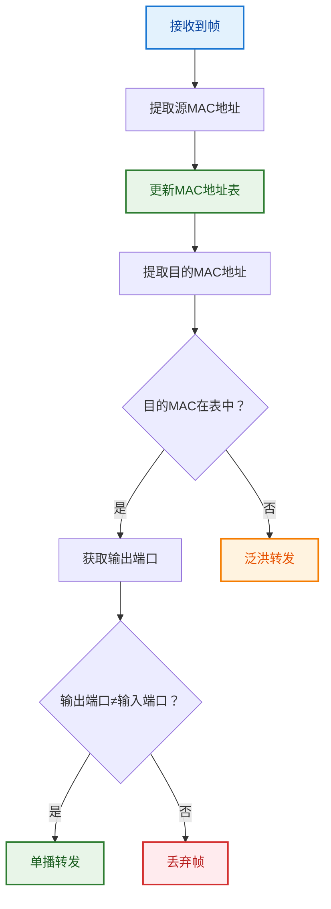

**MAC地址学习示例**：
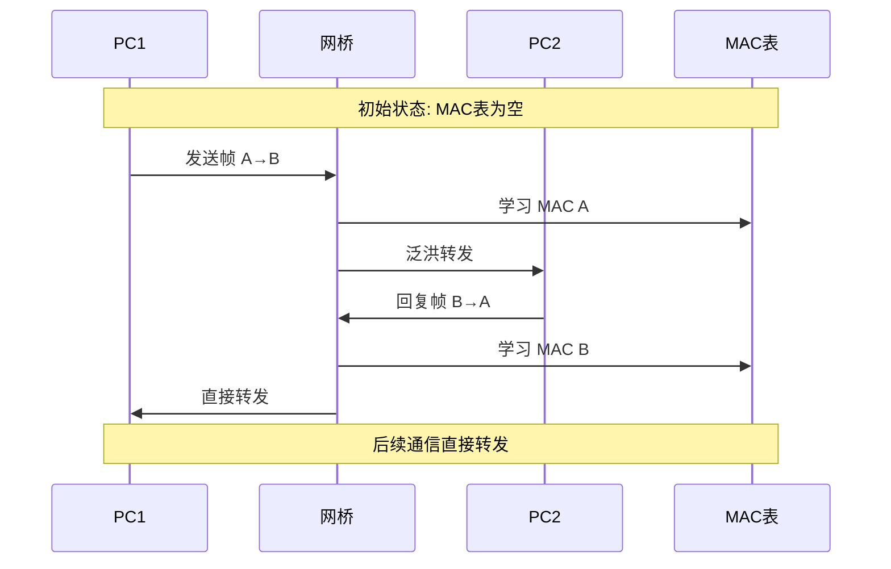

2. **生成树协议（STP）**

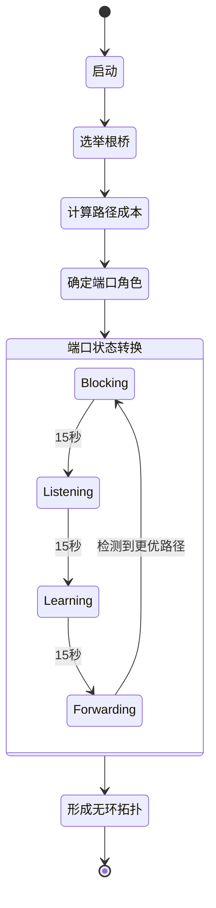

**STP工作示例**：
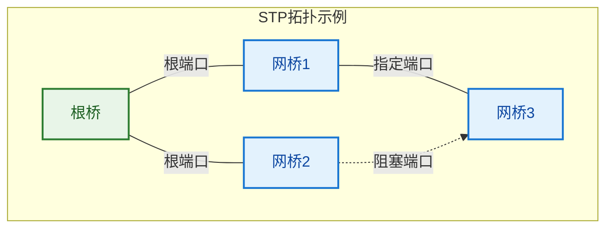

#### **网桥类型**
1. **透明网桥**
   - 即插即用，无需配置
   - 自动学习MAC地址
   - 支持生成树协议

2. **源路由网桥**
   - 路径信息包含在帧中
   - 主要用于令牌环网络
   - 需要端站参与路由决策

### 交换机（Switch）

#### **核心技术**
1. **MAC地址表管理**

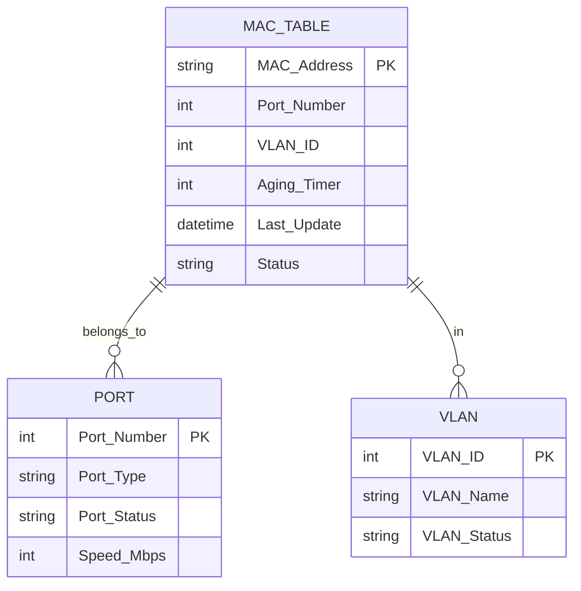

**MAC地址表示例**：

| MAC Address | Port | VLAN | Aging(s) | Status | Description |
|-------------|------|------|----------|--------|-------------|
| `00:11:22:33:44:55` | 1 | 10 | 300 | Active | 销售部门PC |
| `00:aa:bb:cc:dd:ee` | 2 | 20 | 280 | Active | 工程部门PC |
| `00:ff:ee:dd:cc:bb` | 3 | 10 | 150 | Active | 销售部门打印机 |
| `00:12:34:56:78:90` | 24 | ALL | 300 | Trunk | 上联交换机 |

**老化机制**：


2. **帧转发方式**
   - **存储转发**：接收完整帧后转发
   - **直通转发**：读取目的地址后立即转发
   - **免分片转发**：混合模式，检测错误帧

3. **VLAN支持**
   ```cisco
   # VLAN配置示例
   vlan 10
    name Sales
   vlan 20
    name Engineering
   
   interface FastEthernet0/1
    switchport mode access
    switchport access vlan 10
   
   interface FastEthernet0/24
    switchport mode trunk
    switchport trunk allowed vlan 10,20
   ```

#### **交换技术优势对比**

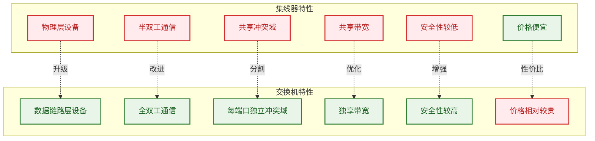

**详细对比表**：

| 特性 | 集线器 | 交换机 | 优势分析 |
|------|--------|--------|----------|
| **工作层次** | 物理层(L1) | 数据链路层(L2) | 交换机可处理MAC地址 |
| **通信方式** | 半双工 | 全双工 | 交换机支持同时收发 |
| **冲突域** | 共享1个 | 每端口1个 | 交换机彻底消除冲突 |
| **广播域** | 1个 | 1个(可VLAN分割) | 交换机支持虚拟分割 |
| **带宽** | 总带宽共享 | 每端口独享 | 交换机总带宽成倍增加 |
| **安全性** | 数据可被监听 | 点对点传输 | 交换机提供更好隔离 |
| **智能化** | 无 | MAC学习、VLAN等 | 交换机功能丰富 |
| **价格** | 低 | 相对高 | 性价比不断改善 |

---

## 9.4 网络层设备详解

### 路由器（Router）

#### **核心功能模块架构**

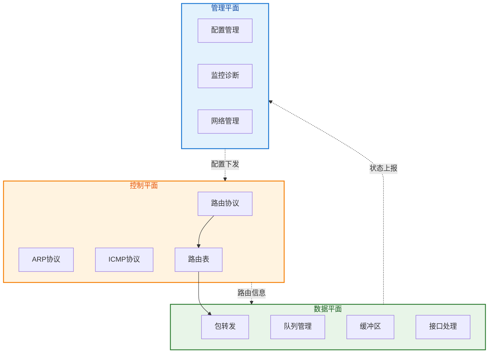

**平面功能详解**：

| 平面 | 主要功能 | 关键协议/技术 | 作用 |
|------|---------|---------------|------|
| **管理平面** | 设备管理、配置、监控 | SNMP、CLI、Web | 运维管理 |
| **控制平面** | 路由计算、协议处理 | OSPF、BGP、RIP、ARP | 建立路由表 |
| **数据平面** | 数据包转发、QoS | 硬件转发、队列调度 | 高速转发 |

#### **路由表结构**

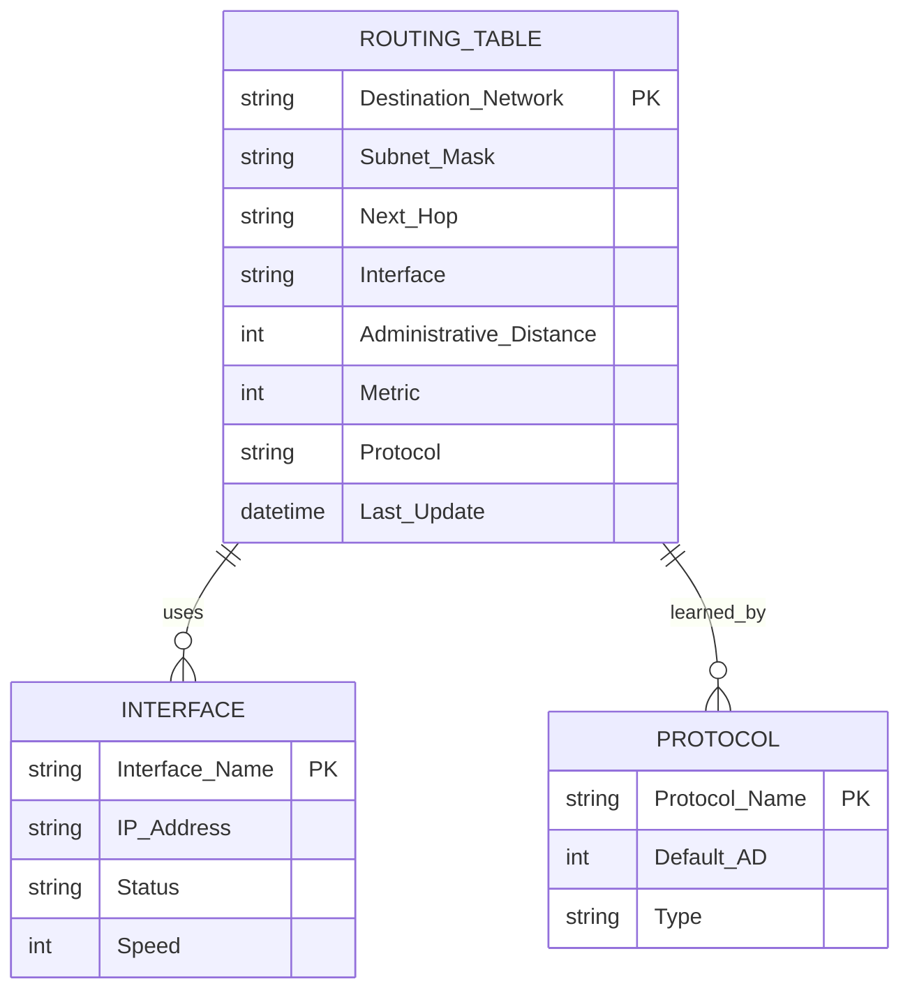

**路由表示例**：

| 目的网络 | 子网掩码 | 下一跳 | 接口 | AD | 度量 | 协议 | 类型 |
|----------|----------|--------|------|----|----- |------|------|
| `192.168.1.0` | `/24` | - | Eth0 | 0 | 0 | Direct | 直连路由 |
| `192.168.2.0` | `/24` | `10.1.1.2` | Eth1 | 1 | 1 | Static | 静态路由 |
| `172.16.0.0` | `/16` | `10.1.1.3` | Eth1 | 110 | 20 | OSPF | 动态路由 |
| `0.0.0.0` | `/0` | `10.1.1.1` | Eth1 | 1 | 1 | Static | 默认路由 |

**路由查找过程**：
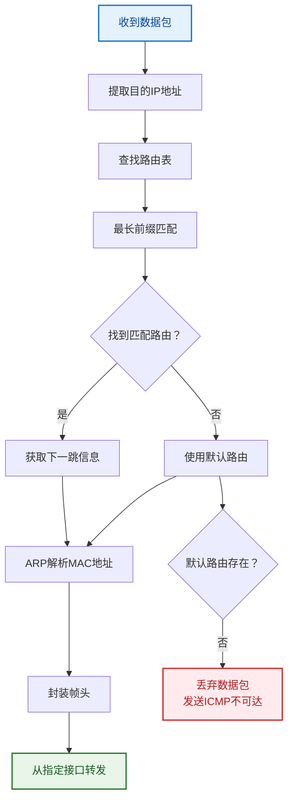

#### **高级路由功能**
1. **策略路由**
   ```cisco
   ! 基于源地址的策略路由
   access-list 10 permit 192.168.10.0 0.0.0.255
   route-map PBR permit 10
    match ip address 10
    set ip next-hop 172.16.1.1
   
   interface FastEthernet0/0
    ip policy route-map PBR
   ```

2. **路由重分发**
   ```cisco
   ! OSPF和RIP之间的路由重分发
   router ospf 1
    redistribute rip metric 20 subnets
   
   router rip
    redistribute ospf 1 metric 3
   ```

### 三层交换机

#### **技术优势对比分析**

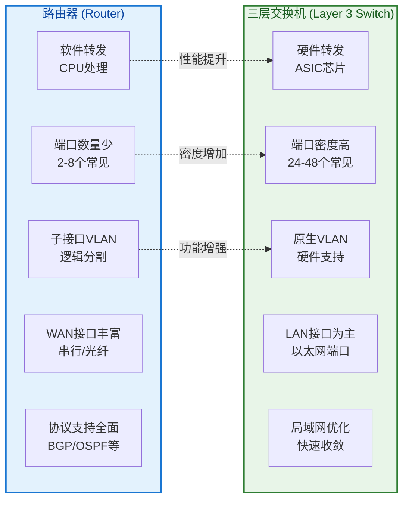

**详细性能对比**：

| 对比维度 | 路由器 | 三层交换机 | 适用场景 |
|----------|--------|------------|----------|
| **转发性能** | 软件转发，几Mpps | 硬件转发，几十Mpps | 高性能要求选择三层交换机 |
| **端口密度** | 2-16个端口 | 24-48个端口 | 大量终端接入选择三层交换机 |
| **VLAN支持** | 子接口方式，配置复杂 | 原生支持，配置简单 | VLAN需求选择三层交换机 |
| **WAN支持** | 丰富的WAN接口 | 主要是LAN接口 | 广域网连接必须使用路由器 |
| **协议支持** | 全面(BGP/OSPF/RIP等) | 局域网优化 | 复杂路由选择路由器 |
| **价格** | 相对便宜 | 相对昂贵 | 根据预算和需求平衡 |
| **应用场景** | 网络边界、WAN连接 | 网络核心、高密度接入 | 分层设计中功能定位不同 |

**选择决策树**：
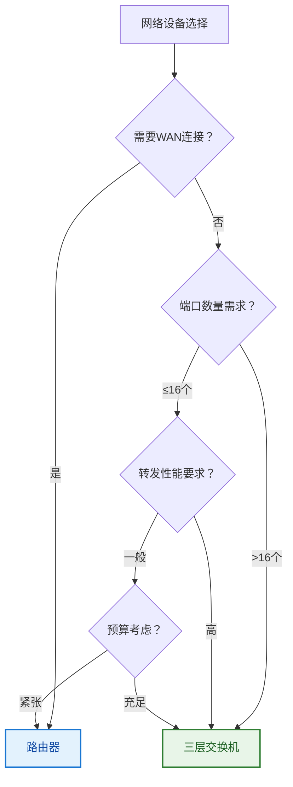

---

## 9.5 设备性能对比分析

### 转发性能指标

#### **包转发率（PPS）**
```
理论PPS计算：
最小以太网帧：64字节
帧间隙：12字节
前导码：8字节
总开销：64 + 12 + 8 = 84字节

千兆以太网最大PPS：
1,000,000,000 bps ÷ (84 × 8) bits = 1,488,095 pps
```

#### **设备性能对比分析**

```mermaid
graph TB
    subgraph Performance["设备性能演进"]
        Hub["集线器<br/>10Mbps共享"]
        Switch["交换机<br/>100Mbps/端口"]
        Router["路由器<br/>1-10Gbps"]
        L3Switch["三层交换机<br/>10-100Gbps"]
    end
    
    Hub -->|性能升级| Switch
    Switch -->|智能升级| Router
    Router -->|硬件升级| L3Switch
    
    style Hub fill:#ffebee,stroke:#d32f2f,stroke-width:2px,color:#b71c1c
    style Switch fill:#fff3e0,stroke:#f57c00,stroke-width:2px,color:#e65100
    style Router fill:#e3f2fd,stroke:#1976d2,stroke-width:2px,color:#0d47a1
    style L3Switch fill:#e8f5e8,stroke:#2e7d32,stroke-width:2px,color:#1b5e20
```

**性能指标详细对比**：

| 设备 | 吞吐量 | 延迟 | PPS | 处理方式 | 适用规模 |
|------|--------|------|-----|----------|----------|
| **集线器** | 10Mbps(共享) | <10μs | 14.88K | 物理层转发 | 小型网络 |
| **交换机** | 100Mbps/端口 | <10μs | 148.8K | 二层硬件转发 | 中型局域网 |
| **路由器** | 1-10Gbps | 1-10ms | 1.48M | 三层软件转发 | 广域网连接 |
| **三层交换机** | 10-100Gbps | <10μs | 14.88M | 三层硬件转发 | 大型企业网 |

**PPS计算方法**：
```mermaid
flowchart LR
    A["最小帧64字节"] --> B["加上开销20字节"]
    B --> C["总计84字节"]
    C --> D["转换为比特：84×8=672bit"]
    D --> E["PPS = 带宽(bps) ÷ 672"]
    
    style A fill:#e3f2fd,stroke:#1976d2,stroke-width:2px,color:#0d47a1
    style E fill:#e8f5e8,stroke:#2e7d32,stroke-width:2px,color:#1b5e20
```

**延迟构成分析**：
```mermaid
pie title 网络设备延迟构成
    "传播延迟" : 30
    "传输延迟" : 25
    "排队延迟" : 25
    "处理延迟" : 20
```

> **性能优化建议**：
> - 局域网内优先选择交换机和三层交换机
> - 广域网连接必须使用路由器
> - 高性能场景考虑硬件转发设备
> - 根据实际流量选择合适的端口速率

### 功能特性对比

#### **协议支持矩阵**

```mermaid
graph TB
    subgraph Devices["网络设备"]
        Hub["集线器"]
        Bridge["网桥"]
        Switch["交换机"]
        Router["路由器"]
        L3SW["三层交换机"]
    end
    
    subgraph Protocols["协议功能"]
        MAC["MAC学习"]
        VLAN["VLAN支持"]
        STP["STP协议"]
        Routing["路由协议"]
        NAT["NAT转换"]
        QoS["QoS支持"]
    end
    
    Bridge --> MAC
    Switch --> MAC
    L3SW --> MAC
    
    Switch --> VLAN
    L3SW --> VLAN
    
    Bridge --> STP
    Switch --> STP
    L3SW --> STP
    
    Router --> Routing
    L3SW --> Routing
    
    Router --> NAT
    L3SW --> NAT
    
    Router --> QoS
    L3SW --> QoS
    
    style Hub fill:#ffebee,stroke:#d32f2f,stroke-width:2px,color:#b71c1c
    style Bridge fill:#fff3e0,stroke:#f57c00,stroke-width:2px,color:#e65100
    style Switch fill:#e3f2fd,stroke:#1976d2,stroke-width:2px,color:#0d47a1
    style Router fill:#e8f5e8,stroke:#2e7d32,stroke-width:2px,color:#1b5e20
    style L3SW fill:#f3e5f5,stroke:#7b1fa2,stroke-width:2px,color:#4a148c
```

**功能支持详细对比**：

| 协议/功能 | 集线器 | 网桥 | 交换机 | 路由器 | 三层交换机 | 实现复杂度 |
|-----------|--------|------|--------|--------|------------|------------|
| **MAC学习** | ❌ | ✅ | ✅ | ❌ | ✅ | 中等 |
| **VLAN** | ❌ | 🔶 | ✅ | 🔶 | ✅ | 中等 |
| **STP** | ❌ | ✅ | ✅ | ❌ | ✅ | 高 |
| **路由协议** | ❌ | ❌ | ❌ | ✅ | ✅ | 高 |
| **NAT** | ❌ | ❌ | ❌ | ✅ | ✅ | 中等 |
| **QoS** | ❌ | ❌ | 🔶 | ✅ | ✅ | 高 |
| **ACL** | ❌ | ❌ | 🔶 | ✅ | ✅ | 中等 |
| **DHCP** | ❌ | ❌ | ❌ | ✅ | ✅ | 低 |

**图例说明**：
- ✅ 完全支持 
- 🔶 部分支持
- ❌ 不支持

**功能演进时序**：
```mermaid
timeline
    title 网络设备功能演进
    
    1980s  : 集线器
           : 物理层信号放大
           : CSMA/CD支持
    
    1990s  : 网桥
           : MAC地址学习
           : STP协议
           
    1990s  : 交换机
           : 全双工通信
           : VLAN支持
           
    2000s  : 路由器
           : 三层路由
           : NAT/QoS
           
    2000s  : 三层交换机
           : 硬件路由
           : 高密度端口
```

---

## 9.6 网络架构设计指南

### 分层网络设计

#### **三层架构模型**

```mermaid
graph TD
    subgraph Core["核心层"]
        C1["核心交换机1"]
        C2["核心交换机2"]
        C1 ===|冗余链路| C2
    end
    
    subgraph Distribution["汇聚层"]
        D1["汇聚交换机1"]
        D2["汇聚交换机2"]
        D3["汇聚路由器"]
        D1 ---|冗余| D2
    end
    
    subgraph Access["接入层"]
        A1["接入交换机1"]
        A2["接入交换机2"]
        A3["接入交换机3"]
        A4["无线AP"]
    end
    
    subgraph Users["终端用户"]
        U1["PC"]
        U2["服务器"]
        U3["打印机"]
        U4["移动设备"]
    end
    
    C1 --- D1
    C1 --- D2
    C2 --- D2
    C2 --- D1
    
    D1 --- A1
    D1 --- A2
    D2 --- A2
    D2 --- A3
    D3 --- A4
    
    A1 --- U1
    A2 --- U2
    A3 --- U3
    A4 --- U4
    
    style Core fill:#e8f5e8,stroke:#2e7d32,stroke-width:2px,color:#1b5e20
    style Distribution fill:#fff3e0,stroke:#f57c00,stroke-width:2px,color:#e65100
    style Access fill:#e3f2fd,stroke:#1976d2,stroke-width:2px,color:#0d47a1
    style Users fill:#f3e5f5,stroke:#7b1fa2,stroke-width:2px,color:#4a148c
```

**各层功能特性**：

| 层次 | 主要功能 | 关键特性 | 设备选择 | 设计原则 |
|------|---------|---------|----------|----------|
| **核心层** | 高速转发、冗余备份 | 高可靠性、高性能 | 核心交换机、高端路由器 | 速度优先、避免策略处理 |
| **汇聚层** | 策略控制、路由汇聚 | VLAN间路由、QoS | 三层交换机、汇聚路由器 | 策略执行、负载均衡 |
| **接入层** | 用户接入、端口安全 | 端口密度、成本控制 | 接入交换机、无线AP | 功能丰富、成本敏感 |

#### **设备选型原则**
1. **核心层要求**
   - 高可靠性：双机热备
   - 高性能：线速转发
   - 可扩展性：模块化设计

2. **汇聚层要求**
   - 路由功能：三层交换
   - 策略控制：ACL、QoS
   - 冗余设计：多链路备份

3. **接入层要求**
   - 端口密度：支持足够用户
   - 安全功能：端口安全、VLAN
   - 成本控制：性价比优先

### 实际网络案例

#### **企业园区网络案例**

```mermaid
graph TB
    Internet["互联网<br/>Internet"]
    
    subgraph DMZ["DMZ区域"]
        FW["防火墙<br/>Firewall"]
        Web["Web服务器"]
        Mail["邮件服务器"]
    end
    
    subgraph Core["核心层"]
        CS1["核心交换机1<br/>Core-SW1"]
        CS2["核心交换机2<br/>Core-SW2"]
        CS1 ===|冗余链路| CS2
    end
    
    subgraph Dist_Sales["汇聚层-销售部"]
        DS1["汇聚交换机1<br/>Sales-Dist-SW1"]
        DS2["汇聚交换机2<br/>Sales-Dist-SW2"]
        DS1 ---|堆叠| DS2
    end
    
    subgraph Dist_Engineering["汇聚层-工程部"]
        DE1["汇聚交换机1<br/>Eng-Dist-SW1"]
        DE2["汇聚交换机2<br/>Eng-Dist-SW2"]
        DE1 ---|堆叠| DE2
    end
    
    subgraph Access_Sales["接入层-销售部"]
        AS1["接入交换机1<br/>Sales-Access-SW1"]
        AS2["接入交换机2<br/>Sales-Access-SW2"]
        AP1["无线AP1"]
    end
    
    subgraph Access_Engineering["接入层-工程部"]
        AE1["接入交换机1<br/>Eng-Access-SW1"]
        AE2["接入交换机2<br/>Eng-Access-SW2"]
        Server["服务器机柜"]
    end
    
    subgraph Users["终端用户"]
        U1["销售PC"]
        U2["工程师PC"]
        U3["移动设备"]
        U4["应用服务器"]
    end
    
    Internet --- FW
    FW --- Web
    FW --- Mail
    FW --- CS1
    
    CS1 ---|光纤链路| DS1
    CS1 ---|备份链路| DS2
    CS2 ---|光纤链路| DS2
    CS2 ---|备份链路| DS1
    
    CS1 ---|光纤链路| DE1
    CS1 ---|备份链路| DE2
    CS2 ---|光纤链路| DE2
    CS2 ---|备份链路| DE1
    
    DS1 --- AS1
    DS2 --- AS2
    DS1 --- AP1
    
    DE1 --- AE1
    DE2 --- AE2
    DE1 --- Server
    
    AS1 --- U1
    AS2 --- U1
    AP1 -.-> U3
    
    AE1 --- U2
    AE2 --- U2
    Server --- U4
    
    style Internet fill:#ffebee,stroke:#d32f2f,stroke-width:2px,color:#b71c1c
    style DMZ fill:#fff3e0,stroke:#f57c00,stroke-width:2px,color:#e65100
    style Core fill:#e8f5e8,stroke:#2e7d32,stroke-width:3px,color:#1b5e20
    style Dist_Sales fill:#e3f2fd,stroke:#1976d2,stroke-width:2px,color:#0d47a1
    style Dist_Engineering fill:#e1f5fe,stroke:#0277bd,stroke-width:2px,color:#01579b
    style Access_Sales fill:#f3e5f5,stroke:#7b1fa2,stroke-width:2px,color:#4a148c
    style Access_Engineering fill:#fce4ec,stroke:#c2185b,stroke-width:2px,color:#880e4f
    style Users fill:#e0f2f1,stroke:#00695c,stroke-width:2px,color:#004d40
```

**网络设计特点**：

| 层次/区域 | 设备配置 | 冗余设计 | VLAN规划 | 安全策略 |
|----------|----------|----------|----------|----------|
| **DMZ区域** | 防火墙+服务器 | 双链路备份 | 服务器VLAN | 严格ACL控制 |
| **核心层** | 双核心交换机 | 全冗余 | 管理VLAN | 最小化策略 |
| **汇聚层** | 堆叠交换机 | 双上联 | 部门VLAN | QoS策略 |
| **接入层** | 普通交换机 | 双归属 | 用户VLAN | 端口安全 |

**流量流向分析**：
```mermaid
flowchart TD
    A["用户终端"] --> B["接入交换机"]
    B --> C["汇聚交换机"]
    C --> D["核心交换机"]
    D --> E["出口路由器"]
    E --> F["互联网"]
    
    C -.->|VLAN间通信| C
    D -.->|部门间通信| D
    
    style A fill:#e3f2fd,stroke:#1976d2,stroke-width:2px,color:#0d47a1
    style F fill:#ffebee,stroke:#d32f2f,stroke-width:2px,color:#b71c1c
```
