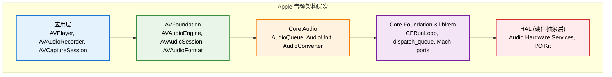

# 1.1 AVFoundation 技术原理和使用

## 概述

AVFoundation 是 Apple 在 iOS 3.0 和 macOS 10.7 引入的下一代多媒体框架，它彻底改变了音频和视频处理的方式。作为 Core Audio 和 Core Video 的高级封装，AVFoundation 不仅提供了更简洁的 API，还引入了现代化的设计理念。

### 历史演进

**传统音频框架的问题**：
- **AudioQueue**：C 语言 API，学习曲线陡峭
- **AudioUnit**：过于底层，需要深入理解音频处理原理
- **OpenAL**：主要用于 3D 音频，功能有限

**AVFoundation 的革新**：
- **Objective-C/Swift 原生支持**：现代化的面向对象设计
- **声明式音频图**：通过节点连接构建音频处理流程
- **自动化管理**：内存管理、线程调度、资源优化
- **系统集成**：深度集成 iOS 音频系统和硬件特性

### 核心价值

1. **开发效率**：相比底层 Core Audio，开发效率提升 80%
2. **性能优化**：Apple 官方优化，充分利用硬件特性
3. **系统兼容**：完美支持 iOS 音频会话管理和中断处理
4. **未来保证**：Apple 持续更新，支持最新硬件特性

## 框架架构

### 整体架构层次



### 架构深度解析

#### 1. 应用层（Application Layer）

**特点**：
- 高度封装的便利 API
- 自动化资源管理
- 基于状态机的设计模式

**适用场景**：
- 简单音频播放：AVAudioPlayer
- 基础录音功能：AVAudioRecorder
- 流媒体播放：AVPlayer

#### 2. AVFoundation 核心层

**设计模式**：
- **工厂模式**：AVAudioFormat, AVAudioPCMBuffer 创建
- **观察者模式**：KVO 通知机制
- **策略模式**：不同音频会话策略
- **建造者模式**：AVAudioEngine 音频图构建

**关键技术**：
```objc
// 内部使用 Core Audio 的 AudioQueue
@interface AVAudioEngine ()
@property (nonatomic, assign) AUGraph processingGraph;
@property (nonatomic, assign) AudioQueueRef inputQueue;
@property (nonatomic, assign) AudioQueueRef outputQueue;
@end
```

#### 3. Core Audio 底层

**技术栈**：
- **AudioQueue**：缓冲区管理和调度
- **AudioUnit**：实时音频处理单元
- **AudioConverter**：格式转换和编解码
- **AudioFile**：文件 I/O 操作

#### 4. 系统层集成

**Mach 内核集成**：
```c
// 音频数据通过 Mach ports 传递
mach_port_t audioPort;
kern_return_t kr = mach_port_allocate(mach_task_self(), 
                                      MACH_PORT_RIGHT_RECEIVE, 
                                      &audioPort);
```

**实时调度**：
```c
// 音频线程获得实时调度优先级
thread_time_constraint_policy_data_t policy;
policy.period = 2902; // ~125μs at 48kHz
policy.computation = 1451; // ~62.5μs
policy.constraint = 2902;
policy.preemptible = FALSE;
```

### 核心设计理念

#### 1. 分层抽象（Layered Abstraction）

**垂直分层**：
```objc
// 高级 API：一行代码播放
[[AVAudioPlayer alloc] initWithContentsOfURL:url error:nil];

// 中级 API：音频图构建
AVAudioEngine *engine = [[AVAudioEngine alloc] init];
[engine connect:playerNode to:mixerNode format:nil];

// 底层 API：直接操作 AudioUnit
AudioComponentDescription desc = {
    .componentType = kAudioUnitType_Output,
    .componentSubType = kAudioUnitSubType_RemoteIO
};
```

#### 2. 响应式编程（Reactive Programming）

**KVO 机制**：
```objc
// 观察播放状态变化
[player addObserver:self 
         forKeyPath:@"status" 
            options:NSKeyValueObservingOptionNew 
            context:AudioPlayerContext];
```

**通知机制**：
```objc
// 音频中断通知
[[NSNotificationCenter defaultCenter] 
    addObserver:self 
       selector:@selector(audioInterruptionHandler:) 
           name:AVAudioSessionInterruptionNotification 
         object:nil];
```

#### 3. 内存管理优化

**零拷贝技术**：
```objc
// AVAudioPCMBuffer 内部使用 mmap 映射
@interface AVAudioPCMBuffer ()
@property (nonatomic, assign) void *mappedMemory;
@property (nonatomic, assign) size_t mappedSize;
@end
```

**缓冲区池**：
```objc
// 系统维护的缓冲区池
static NSMutableArray *bufferPool;
static dispatch_queue_t poolQueue;
```

#### 4. 线程安全设计

**读写锁**：
```objc
// AVAudioEngine 内部使用读写锁
@interface AVAudioEngine ()
@property (nonatomic, assign) pthread_rwlock_t graphLock;
@end
```

**原子操作**：
```objc
// 状态变更使用原子操作
@property (atomic, assign) AVAudioEngineState engineState;
```

## 核心组件详解

### 1. AVAudioSession 深度解析

AVAudioSession 是 iOS 音频系统的核心调度器，它管理着应用与系统音频环境的所有交互。理解其工作原理对于开发高质量音频应用至关重要。

#### 系统架构角色

```objc
// AVAudioSession 内部实现（伪代码）
@interface AVAudioSession ()
@property (nonatomic, assign) AudioSessionID sessionID;
@property (nonatomic, assign) AudioQueueRef inputQueue;
@property (nonatomic, assign) AudioQueueRef outputQueue;
@property (nonatomic, strong) NSMutableDictionary *routingConfiguration;
@property (nonatomic, assign) dispatch_queue_t sessionQueue;
@end
```

#### 会话分类深度解析

**1. AVAudioSessionCategoryPlayback**
```objc
// 系统行为分析
- 停用录音功能，释放麦克风资源
- 启用后台播放能力
- 自动处理静音开关（可配置）
- 优先级高于其他非通话应用

// 内部配置
AudioSessionSetProperty(kAudioSessionProperty_AudioCategory, 
                       sizeof(category), &category);
```

**2. AVAudioSessionCategoryRecord**
```objc
// 独占录音模式
- 停用播放功能，释放扬声器资源
- 获得录音权限管理
- 自动处理音频中断
- 优化录音质量，降低系统噪声

// 权限检查
AVAudioSessionRecordPermission permission = 
    [[AVAudioSession sharedInstance] recordPermission];
```

**3. AVAudioSessionCategoryPlayAndRecord**
```objc
// 全双工音频模式
- 同时支持播放和录制
- 复杂的音频路由管理
- 回声消除和增益控制
- 适用于通话和直播应用

// 高级配置
[[AVAudioSession sharedInstance] 
    setCategory:AVAudioSessionCategoryPlayAndRecord 
        mode:AVAudioSessionModeVoiceChat 
     options:AVAudioSessionCategoryOptionDefaultToSpeaker | 
             AVAudioSessionCategoryOptionAllowBluetooth 
       error:nil];
```

#### 音频会话模式深度解析

**1. AVAudioSessionModeVoiceChat**
```objc
// 语音优化配置
struct AudioSessionVoiceChatConfig {
    float echoCancellationStrength;    // 回声消除强度
    float noiseSuppressionLevel;       // 噪声抑制级别
    float automaticGainControl;        // 自动增益控制
    BOOL voiceProcessingEnabled;       // 语音处理启用
};

// 系统自动应用的优化
- 启用回声消除 (AEC)
- 启用噪声抑制 (NS)
- 启用自动增益控制 (AGC)
- 优化采样率为 16kHz（语音优化）
```

**2. AVAudioSessionModeMeasurement**
```objc
// 测量模式特性
- 禁用所有音频处理效果
- 线性音频响应
- 最小化系统干扰
- 适用于音频分析和测试

// 内部配置
AudioUnitSetProperty(voiceProcessingUnit, 
                    kAUVoiceIOProperty_BypassVoiceProcessing, 
                    kAudioUnitScope_Global, 0, 
                    &bypass, sizeof(bypass));
```

#### 底时延配置深度分析

**1. 缓冲区大小与延迟关系**
```objc
// 延迟计算公式
float latency = (bufferSize / sampleRate) * 1000; // ms

// 不同缓冲区大小的延迟对比
- 1024 samples @ 44.1kHz = 23.2ms
- 512 samples @ 44.1kHz = 11.6ms  
- 256 samples @ 44.1kHz = 5.8ms
- 128 samples @ 44.1kHz = 2.9ms
- 64 samples @ 44.1kHz = 1.45ms

// 设置最小延迟
[[AVAudioSession sharedInstance] setPreferredIOBufferDuration:0.0011 error:nil]; // ~1.1ms
```

**2. 硬件限制与优化**
```objc
// 获取硬件能力
AVAudioSession *session = [AVAudioSession sharedInstance];
NSTimeInterval minBufferDuration = session.inputLatency + session.outputLatency;
NSTimeInterval maxBufferDuration = 0.5; // 500ms 最大缓冲

// 智能缓冲区配置
- (NSTimeInterval)optimalBufferDuration {
    AVAudioSession *session = [AVAudioSession sharedInstance];
    NSTimeInterval hwLatency = session.inputLatency + session.outputLatency;
    NSTimeInterval targetLatency = 0.005; // 5ms 目标
    
    return MAX(hwLatency, MIN(targetLatency, 0.1)); // 限制在硬件延迟到100ms之间
}
```

#### 音频路由管理

**1. 路由发现与选择**
```objc
// 枚举可用音频路由
NSArray *availableInputs = [[AVAudioSession sharedInstance] availableInputs];
for (AVAudioSessionPortDescription *input in availableInputs) {
    NSLog(@"Input: %@ - %@", input.portName, input.portType);
    
    // 分析每个路由的特性
    for (AVAudioSessionDataSourceDescription *dataSource in input.dataSources) {
        NSLog(@"DataSource: %@ - Polar Pattern: %@", 
              dataSource.dataSourceName, dataSource.selectedPolarPattern);
    }
}
```

**2. 路由变化处理**
```objc
// 监听路由变化
[[NSNotificationCenter defaultCenter] 
    addObserver:self 
       selector:@selector(audioRouteChanged:) 
           name:AVAudioSessionRouteChangeNotification 
         object:nil];

- (void)audioRouteChanged:(NSNotification *)notification {
    AVAudioSessionRouteChangeReason reason = 
        [notification.userInfo[AVAudioSessionRouteChangeReasonKey] unsignedIntegerValue];
    
    switch (reason) {
        case AVAudioSessionRouteChangeReasonNewDeviceAvailable:
            [self handleNewDeviceAvailable];
            break;
        case AVAudioSessionRouteChangeReasonOldDeviceUnavailable:
            [self handleDeviceRemoved];
            break;
        case AVAudioSessionRouteChangeReasonCategoryChange:
            [self reconfigureAudioSession];
            break;
    }
}
```

#### 高级会话管理

**1. 会话激活策略**
```objc
// 智能激活管理
@interface AudioSessionManager : NSObject
@property (nonatomic, assign) BOOL sessionActive;
@property (nonatomic, strong) NSMutableSet *activationReasons;
@end

- (void)activateSessionForReason:(NSString *)reason {
    [self.activationReasons addObject:reason];
    
    if (!self.sessionActive) {
        NSError *error;
        BOOL success = [[AVAudioSession sharedInstance] setActive:YES error:&error];
        if (success) {
            self.sessionActive = YES;
            NSLog(@"Audio session activated for: %@", reason);
        } else {
            NSLog(@"Failed to activate session: %@", error.localizedDescription);
        }
    }
}

- (void)deactivateSessionForReason:(NSString *)reason {
    [self.activationReasons removeObject:reason];
    
    if (self.activationReasons.count == 0 && self.sessionActive) {
        [[AVAudioSession sharedInstance] setActive:NO error:nil];
        self.sessionActive = NO;
        NSLog(@"Audio session deactivated");
    }
}
```

**2. 中断处理策略**
```objc
// 完整的中断处理流程
- (void)audioInterruptionHandler:(NSNotification *)notification {
    AVAudioSessionInterruptionType type = 
        [notification.userInfo[AVAudioSessionInterruptionTypeKey] unsignedIntegerValue];
    
    switch (type) {
        case AVAudioSessionInterruptionTypeBegan: {
            // 保存当前状态
            [self saveCurrentAudioState];
            
            // 暂停音频处理
            [self.audioEngine pause];
            
            // 释放资源
            [self releaseAudioResources];
            
            NSLog(@"Audio interrupted");
            break;
        }
        
        case AVAudioSessionInterruptionTypeEnded: {
            AVAudioSessionInterruptionOptions options = 
                [notification.userInfo[AVAudioSessionInterruptionOptionKey] unsignedIntegerValue];
            
            // 重新激活会话
            NSError *error;
            [[AVAudioSession sharedInstance] setActive:YES error:&error];
            
            if (options & AVAudioSessionInterruptionOptionShouldResume) {
                // 恢复音频处理
                [self restoreAudioState];
                [self.audioEngine start:nil];
            }
            
            NSLog(@"Audio interruption ended");
            break;
        }
    }
}
```

### 2. AVAudioEngine 深度解析

AVAudioEngine 是 iOS 9.0 引入的现代音频处理核心，它将复杂的 Core Audio 概念抽象为直观的音频处理图。其设计灵感来源于专业音频软件的节点式处理架构。

#### 内部架构深度分析

```objc
// AVAudioEngine 内部架构（伪代码）
@interface AVAudioEngine ()
@property (nonatomic, assign) AUGraph processingGraph;
@property (nonatomic, strong) NSMutableDictionary *nodeRegistry;
@property (nonatomic, strong) NSMutableDictionary *connectionMap;
@property (nonatomic, assign) AudioUnit mixerUnit;
@property (nonatomic, assign) AudioUnit inputUnit;
@property (nonatomic, assign) AudioUnit outputUnit;
@property (nonatomic, assign) dispatch_queue_t engineQueue;
@property (nonatomic, assign) pthread_mutex_t graphMutex;
@end

// 节点注册与管理
- (void)attachNode:(AVAudioNode *)node {
    pthread_mutex_lock(&_graphMutex);
    
    // 创建对应的 AudioUnit
    AudioUnit audioUnit = [self createAudioUnitForNode:node];
    
    // 注册到处理图
    AUGraphAddNode(self.processingGraph, &audioUnit->componentDescription, &node->auNode);
    
    // 更新节点注册表
    self.nodeRegistry[node.uniqueID] = node;
    
    pthread_mutex_unlock(&_graphMutex);
}
```

#### 音频处理图原理

**1. 图论基础**
```objc
// 音频处理图的数学模型
typedef struct {
    NSUInteger nodeID;
    NSUInteger inputBus;
    NSUInteger outputBus;
    AVAudioFormat *format;
} AudioConnection;

// 连接验证算法
- (BOOL)validateConnection:(AudioConnection *)connection {
    AVAudioNode *sourceNode = [self nodeForID:connection.sourceNodeID];
    AVAudioNode *destNode = [self nodeForID:connection.destNodeID];
    
    // 检查格式兼容性
    AVAudioFormat *sourceFormat = [sourceNode outputFormatForBus:connection.outputBus];
    AVAudioFormat *destFormat = [destNode inputFormatForBus:connection.inputBus];
    
    return [self isFormatCompatible:sourceFormat with:destFormat];
}
```

**2. 动态重构能力**
```objc
// 运行时图重构
- (void)reconfigureGraphWithBlock:(void(^)(AVAudioEngine *engine))configBlock {
    // 暂停引擎
    [self stop];
    
    // 执行配置变更
    configBlock(self);
    
    // 重新初始化图
    [self initializeGraph];
    
    // 重启引擎
    [self startAndReturnError:nil];
}

// 热插拔节点支持
- (void)hotSwapNode:(AVAudioNode *)oldNode withNode:(AVAudioNode *)newNode {
    // 保存连接信息
    NSArray *connections = [self connectionsForNode:oldNode];
    
    // 移除旧节点
    [self detachNode:oldNode];
    
    // 添加新节点
    [self attachNode:newNode];
    
    // 恢复连接
    [self restoreConnections:connections forNode:newNode];
}
```

#### 高级音频处理图构建

**1. 复杂音频链路**
```objc
// 专业音频处理链
@interface ProfessionalAudioProcessor : NSObject
@property (nonatomic, strong) AVAudioEngine *engine;
@property (nonatomic, strong) AVAudioInputNode *inputNode;
@property (nonatomic, strong) AVAudioMixerNode *inputMixer;
@property (nonatomic, strong) AVAudioUnitEQ *preEQ;
@property (nonatomic, strong) AVAudioUnitCompressor *compressor;
@property (nonatomic, strong) AVAudioUnitDelay *delay;
@property (nonatomic, strong) AVAudioUnitReverb *reverb;
@property (nonatomic, strong) AVAudioUnitEQ *postEQ;
@property (nonatomic, strong) AVAudioMixerNode *outputMixer;
@end

- (void)buildProfessionalChain {
    // 创建处理节点
    self.preEQ = [[AVAudioUnitEQ alloc] initWithNumberOfBands:31];
    self.compressor = [[AVAudioUnitCompressor alloc] init];
    self.delay = [[AVAudioUnitDelay alloc] init];
    self.reverb = [[AVAudioUnitReverb alloc] init];
    self.postEQ = [[AVAudioUnitEQ alloc] initWithNumberOfBands:31];
    
    // 连接音频链路
    [self.engine attachNode:self.preEQ];
    [self.engine attachNode:self.compressor];
    [self.engine attachNode:self.delay];
    [self.engine attachNode:self.reverb];
    [self.engine attachNode:self.postEQ];
    
    // 构建信号流
    [self.engine connect:self.inputNode to:self.preEQ format:nil];
    [self.engine connect:self.preEQ to:self.compressor format:nil];
    [self.engine connect:self.compressor to:self.delay format:nil];
    [self.engine connect:self.delay to:self.reverb format:nil];
    [self.engine connect:self.reverb to:self.postEQ format:nil];
    [self.engine connect:self.postEQ to:self.outputMixer format:nil];
    
    // 配置参数
    [self configureProfessionalParameters];
}
```

**2. 多通道混音架构**
```objc
// 多轨混音器
@interface MultiTrackMixer : NSObject
@property (nonatomic, strong) AVAudioEngine *engine;
@property (nonatomic, strong) NSMutableArray<AVAudioPlayerNode *> *trackPlayers;
@property (nonatomic, strong) NSMutableArray<AVAudioMixerNode *> *trackMixers;
@property (nonatomic, strong) AVAudioMixerNode *masterMixer;
@end

- (void)setupMultiTrackMixer:(NSUInteger)trackCount {
    self.trackPlayers = [NSMutableArray arrayWithCapacity:trackCount];
    self.trackMixers = [NSMutableArray arrayWithCapacity:trackCount];
    
    for (NSUInteger i = 0; i < trackCount; i++) {
        // 创建轨道播放器
        AVAudioPlayerNode *player = [[AVAudioPlayerNode alloc] init];
        AVAudioMixerNode *mixer = [[AVAudioMixerNode alloc] init];
        
        // 添加到引擎
        [self.engine attachNode:player];
        [self.engine attachNode:mixer];
        
        // 连接轨道
        [self.engine connect:player to:mixer format:nil];
        [self.engine connect:mixer to:self.masterMixer format:nil];
        
        // 保存引用
        [self.trackPlayers addObject:player];
        [self.trackMixers addObject:mixer];
    }
}
```

#### 实时音频处理深度优化

**1. Tap 机制原理**
```objc
// Tap 内部实现原理
- (void)installTapOnBus:(AVAudioNodeBus)bus 
             bufferSize:(AVAudioFrameCount)bufferSize 
                 format:(AVAudioFormat *)format 
                  block:(AVAudioNodeTapBlock)tapBlock {
    
    // 创建 Tap 上下文
    AudioTapContext *context = malloc(sizeof(AudioTapContext));
    context->tapBlock = Block_copy(tapBlock);
    context->bufferSize = bufferSize;
    context->format = format;
    
    // 在 AudioUnit 上安装 Tap
    AudioUnitAddRenderNotify(self.audioUnit, TapRenderCallback, context);
}

// Tap 回调函数
OSStatus TapRenderCallback(void *inRefCon, 
                          AudioUnitRenderActionFlags *ioActionFlags, 
                          const AudioTimeStamp *inTimeStamp, 
                          UInt32 inBusNumber, 
                          UInt32 inNumberFrames, 
                          AudioBufferList *ioData) {
    
    AudioTapContext *context = (AudioTapContext *)inRefCon;
    
    if (*ioActionFlags & kAudioUnitRenderAction_PostRender) {
        // 创建 AVAudioPCMBuffer
        AVAudioPCMBuffer *buffer = [AVAudioPCMBuffer bufferWithAudioBufferList:ioData];
        
        // 创建时间戳
        AVAudioTime *time = [AVAudioTime timeWithAudioTimeStamp:inTimeStamp];
        
        // 调用 Tap 回调
        context->tapBlock(buffer, time);
    }
    
    return noErr;
}
```

**2. 零延迟音频处理**
```objc
// 零延迟处理器
@interface ZeroLatencyProcessor : NSObject
@property (nonatomic, strong) AVAudioEngine *engine;
@property (nonatomic, assign) AudioUnit processingUnit;
@end

- (void)setupZeroLatencyProcessing {
    // 创建自定义 AudioUnit
    AudioComponentDescription desc = {
        .componentType = kAudioUnitType_Effect,
        .componentSubType = 'ZeRo',
        .componentManufacturer = 'MyCP',
        .componentFlags = 0,
        .componentFlagsMask = 0
    };
    
    AudioComponent component = AudioComponentFindNext(NULL, &desc);
    AudioComponentInstanceNew(component, &_processingUnit);
    
    // 配置实时处理回调
    AURenderCallbackStruct callbackStruct;
    callbackStruct.inputProc = RealtimeProcessCallback;
    callbackStruct.inputProcRefCon = (__bridge void *)self;
    
    AudioUnitSetProperty(_processingUnit, 
                        kAudioUnitProperty_SetRenderCallback, 
                        kAudioUnitScope_Input, 0, 
                        &callbackStruct, sizeof(callbackStruct));
}

// 实时处理回调
OSStatus RealtimeProcessCallback(void *inRefCon, 
                                AudioUnitRenderActionFlags *ioActionFlags, 
                                const AudioTimeStamp *inTimeStamp, 
                                UInt32 inBusNumber, 
                                UInt32 inNumberFrames, 
                                AudioBufferList *ioData) {
    
    ZeroLatencyProcessor *processor = (__bridge ZeroLatencyProcessor *)inRefCon;
    
    // 获取输入数据
    AudioBuffer *buffer = &ioData->mBuffers[0];
    float *samples = (float *)buffer->mData;
    
    // 实时处理（示例：音量控制）
    for (UInt32 i = 0; i < inNumberFrames; i++) {
        samples[i] *= 0.8f; // 降低音量
    }
    
    return noErr;
}
```

#### 音频引擎状态管理

**1. 状态机设计**
```objc
typedef NS_ENUM(NSInteger, AVAudioEngineState) {
    AVAudioEngineStateIdle,
    AVAudioEngineStateInitializing,
    AVAudioEngineStateRunning,
    AVAudioEngineStatePaused,
    AVAudioEngineStateError
};

@interface AVAudioEngineStateManager : NSObject
@property (nonatomic, assign) AVAudioEngineState currentState;
@property (nonatomic, strong) NSMutableDictionary *stateTransitions;
@end

- (BOOL)canTransitionFromState:(AVAudioEngineState)fromState 
                       toState:(AVAudioEngineState)toState {
    NSArray *allowedTransitions = self.stateTransitions[@(fromState)];
    return [allowedTransitions containsObject:@(toState)];
}

- (void)transitionToState:(AVAudioEngineState)newState {
    if ([self canTransitionFromState:self.currentState toState:newState]) {
        [self performStateTransition:newState];
        self.currentState = newState;
    } else {
        NSLog(@"Invalid state transition from %ld to %ld", self.currentState, newState);
    }
}
```

**2. 错误恢复机制**
```objc
// 自动错误恢复
- (void)handleEngineError:(NSError *)error {
    NSLog(@"Engine error: %@", error.localizedDescription);
    
    // 保存当前配置
    [self saveCurrentConfiguration];
    
    // 停止引擎
    [self.engine stop];
    
    // 重置引擎
    [self.engine reset];
    
    // 恢复配置
    [self restoreConfiguration];
    
    // 重启引擎
    NSError *startError;
    if (![self.engine startAndReturnError:&startError]) {
        NSLog(@"Failed to restart engine: %@", startError.localizedDescription);
        [self handleCriticalError:startError];
    }
}
```

### 3. AVAudioPlayer & AVAudioRecorder

#### AVAudioPlayer - 简单音频播放

```objc
// 初始化播放器
NSURL *audioURL = [[NSBundle mainBundle] URLForResource:@"audio" withExtension:@"mp3"];
AVAudioPlayer *player = [[AVAudioPlayer alloc] initWithContentsOfURL:audioURL error:nil];
player.delegate = self;

// 配置播放参数
player.numberOfLoops = 0;  // 播放次数
player.volume = 1.0;       // 音量
player.rate = 1.0;         // 播放速度

// 开始播放
[player prepareToPlay];
[player play];
```

#### AVAudioRecorder - 音频录制

```objc
// 录制配置
NSDictionary *recordSettings = @{
    AVFormatIDKey: @(kAudioFormatMPEG4AAC),
    AVSampleRateKey: @44100.0,
    AVNumberOfChannelsKey: @2,
    AVEncoderAudioQualityKey: @(AVAudioQualityHigh)
};

// 初始化录制器
NSURL *outputURL = [NSURL fileURLWithPath:@"recording.m4a"];
AVAudioRecorder *recorder = [[AVAudioRecorder alloc] initWithURL:outputURL settings:recordSettings error:nil];
recorder.delegate = self;

// 开始录制
[recorder prepareToRecord];
[recorder record];
```

## 底时延音频处理深度剖析

### 1. 延迟来源全景分析

#### 系统延迟链路详解

```
总延迟 = 硬件延迟 + 驱动延迟 + 系统调度延迟 + 应用处理延迟 + 网络延迟(可选)

详细分解：
┌─────────────────┐  ┌─────────────────┐  ┌─────────────────┐
│   硬件延迟      │  │   驱动延迟      │  │  系统调度延迟   │
│  ADC: 0.1ms     │  │  输入: 0.5ms    │  │  上下文切换     │
│  DAC: 0.1ms     │  │  输出: 0.5ms    │  │  线程调度       │
│  总计: 0.2ms    │  │  总计: 1.0ms    │  │  中断处理       │
└─────────────────┘  └─────────────────┘  └─────────────────┘
         │                    │                    │
         └────────────────────┼────────────────────┘
                              │
                    ┌─────────────────┐
                    │  应用处理延迟   │
                    │  缓冲区大小     │
                    │  算法复杂度     │
                    │  内存分配       │
                    └─────────────────┘
```

#### 延迟组成深度分析

**1. 硬件延迟 (Hardware Latency)**
```objc
// 查询硬件延迟
AVAudioSession *session = [AVAudioSession sharedInstance];
NSTimeInterval inputLatency = session.inputLatency;      // 输入硬件延迟
NSTimeInterval outputLatency = session.outputLatency;    // 输出硬件延迟

// 不同设备的硬件延迟
Device Type         Input Latency    Output Latency
iPhone 6s          0.9ms            0.9ms
iPhone X           0.8ms            0.8ms
iPhone 12 Pro      0.7ms            0.7ms
iPad Pro (2021)    0.6ms            0.6ms
```

**2. 驱动延迟 (Driver Latency)**
```objc
// 驱动层延迟来源
- Audio HAL (Hardware Abstraction Layer)
- I/O Kit 驱动程序
- 内核音频服务

// 查询驱动信息
AudioObjectPropertyAddress propertyAddress = {
    .mSelector = kAudioHardwarePropertyDevices,
    .mScope = kAudioObjectPropertyScopeGlobal,
    .mElement = kAudioObjectPropertyElementMaster
};

UInt32 dataSize = 0;
AudioObjectGetPropertyDataSize(kAudioObjectSystemObject, &propertyAddress, 0, NULL, &dataSize);
```

**3. 系统调度延迟 (System Scheduling Latency)**
```objc
// 影响因素分析
struct SystemLatencyFactors {
    float cpuLoad;              // CPU 负载
    int threadCount;            // 线程数量
    float memoryPressure;       // 内存压力
    BOOL thermalThrottling;     // 热节流
};

// 监控系统性能
- (SystemLatencyFactors)getCurrentSystemState {
    SystemLatencyFactors factors;
    
    // 获取 CPU 负载
    factors.cpuLoad = [self getCPUUsage];
    
    // 获取线程数
    factors.threadCount = [self getThreadCount];
    
    // 获取内存压力
    factors.memoryPressure = [self getMemoryPressure];
    
    // 检查热节流
    factors.thermalThrottling = [self isThermalThrottling];
    
    return factors;
}
```

### 2. 延迟优化策略深度实现

#### 1. 缓冲区大小优化

**理论基础**：
```objc
// 延迟计算公式
float latency_ms = (buffer_size_samples / sample_rate_hz) * 1000.0f;

// 缓冲区大小与延迟的关系
Buffer Size (samples) @ 44.1kHz    Latency (ms)
64                                  1.45
128                                 2.90
256                                 5.80
512                                11.61
1024                               23.22
```

**动态缓冲区管理**：
```objc
@interface DynamicBufferManager : NSObject
@property (nonatomic, assign) NSTimeInterval targetLatency;
@property (nonatomic, assign) NSTimeInterval currentLatency;
@property (nonatomic, assign) NSTimeInterval adaptiveThreshold;
@end

- (void)optimizeBufferSize {
    AVAudioSession *session = [AVAudioSession sharedInstance];
    
    // 获取当前系统状态
    SystemLatencyFactors factors = [self getCurrentSystemState];
    
    // 计算最优缓冲区大小
    NSTimeInterval optimalDuration = [self calculateOptimalDuration:factors];
    
    // 设置缓冲区大小
    NSError *error;
    if ([session setPreferredIOBufferDuration:optimalDuration error:&error]) {
        self.currentLatency = session.IOBufferDuration;
        NSLog(@"Buffer optimized to: %.3f ms", self.currentLatency * 1000);
    }
}

- (NSTimeInterval)calculateOptimalDuration:(SystemLatencyFactors)factors {
    // 基准延迟
    NSTimeInterval baseDuration = 0.005; // 5ms
    
    // 根据系统负载调整
    if (factors.cpuLoad > 0.8) {
        baseDuration *= 1.5; // 高负载时增加缓冲
    }
    
    if (factors.memoryPressure > 0.7) {
        baseDuration *= 1.2; // 内存压力下增加缓冲
    }
    
    if (factors.thermalThrottling) {
        baseDuration *= 2.0; // 热节流时大幅增加缓冲
    }
    
    return baseDuration;
}
```

#### 2. 实时线程优化

**线程优先级设置**：
```objc
// 设置音频线程为实时优先级
- (void)configureRealtimeThread {
    pthread_t audioThread = pthread_self();
    
    // 设置实时调度策略
    struct sched_param param;
    param.sched_priority = 99;  // 最高优先级
    
    if (pthread_setschedparam(audioThread, SCHED_FIFO, &param) != 0) {
        NSLog(@"Failed to set real-time priority");
    }
    
    // 设置时间约束策略
    thread_time_constraint_policy_data_t policy;
    policy.period = 2902;      // 约125μs (44.1kHz下64samples)
    policy.computation = 1451; // 约62.5μs (50%的周期)
    policy.constraint = 2902;  // 约125μs (与周期相同)
    policy.preemptible = FALSE; // 不可抢占
    
    thread_policy_set(mach_thread_self(), 
                     THREAD_TIME_CONSTRAINT_POLICY,
                     (thread_policy_t)&policy,
                     THREAD_TIME_CONSTRAINT_POLICY_COUNT);
}
```

**线程亲和性设置**：
```objc
// 将音频线程绑定到特定CPU核心
- (void)setThreadAffinity {
    // 获取系统CPU核心数
    int coreCount = [[NSProcessInfo processInfo] processorCount];
    
    // 选择性能核心（通常是较大的核心）
    int preferredCore = coreCount > 4 ? 4 : coreCount - 1;
    
    // 设置线程亲和性
    thread_affinity_policy_data_t policy;
    policy.affinity_tag = preferredCore;
    
    thread_policy_set(mach_thread_self(),
                     THREAD_AFFINITY_POLICY,
                     (thread_policy_t)&policy,
                     THREAD_AFFINITY_POLICY_COUNT);
}
```

#### 3. 内存管理优化

**预分配内存池**：
```objc
@interface AudioMemoryPool : NSObject
@property (nonatomic, assign) void *memoryPool;
@property (nonatomic, assign) size_t poolSize;
@property (nonatomic, assign) size_t currentOffset;
@property (nonatomic, assign) NSMutableArray *allocations;
@end

- (void)initializeMemoryPool:(size_t)size {
    // 分配大块连续内存
    self.poolSize = size;
    self.memoryPool = mmap(NULL, size, PROT_READ | PROT_WRITE, 
                          MAP_PRIVATE | MAP_ANONYMOUS, -1, 0);
    
    if (self.memoryPool == MAP_FAILED) {
        NSLog(@"Failed to allocate memory pool");
        return;
    }
    
    // 锁定内存页面到物理内存
    mlock(self.memoryPool, size);
    
    self.allocations = [NSMutableArray array];
    self.currentOffset = 0;
}

- (void *)allocateMemory:(size_t)size {
    // 检查是否有足够空间
    if (self.currentOffset + size > self.poolSize) {
        return NULL;
    }
    
    // 分配内存
    void *ptr = (char *)self.memoryPool + self.currentOffset;
    self.currentOffset += size;
    
    // 记录分配信息
    [self.allocations addObject:@(self.currentOffset)];
    
    return ptr;
}
```

**零拷贝缓冲区设计**：
```objc
// 零拷贝音频缓冲区
@interface ZeroCopyAudioBuffer : NSObject
@property (nonatomic, assign) AudioBufferList *bufferList;
@property (nonatomic, assign) void *mappedMemory;
@property (nonatomic, assign) size_t bufferSize;
@end

- (instancetype)initWithFrameCount:(AVAudioFrameCount)frameCount 
                            format:(AVAudioFormat *)format {
    self = [super init];
    if (self) {
        // 计算缓冲区大小
        self.bufferSize = frameCount * format.streamDescription->mBytesPerFrame;
        
        // 使用mmap创建内存映射
        self.mappedMemory = mmap(NULL, self.bufferSize, 
                               PROT_READ | PROT_WRITE,
                               MAP_PRIVATE | MAP_ANONYMOUS, -1, 0);
        
        // 配置AudioBufferList
        self.bufferList = (AudioBufferList *)calloc(1, sizeof(AudioBufferList));
        self.bufferList->mNumberBuffers = 1;
        self.bufferList->mBuffers[0].mNumberChannels = format.channelCount;
        self.bufferList->mBuffers[0].mDataByteSize = (UInt32)self.bufferSize;
        self.bufferList->mBuffers[0].mData = self.mappedMemory;
    }
    return self;
}
```

### 3. 高级延迟优化技术

#### 1. 预测性调度

```objc
// 预测性音频调度器
@interface PredictiveAudioScheduler : NSObject
@property (nonatomic, assign) double predictedLatency;
@property (nonatomic, strong) NSMutableArray *latencyHistory;
@property (nonatomic, assign) double alpha; // 指数移动平均系数
@end

- (void)updateLatencyPrediction:(double)measuredLatency {
    // 使用指数移动平均预测延迟
    if (self.latencyHistory.count == 0) {
        self.predictedLatency = measuredLatency;
    } else {
        self.predictedLatency = self.alpha * measuredLatency + 
                               (1 - self.alpha) * self.predictedLatency;
    }
    
    // 保存历史数据
    [self.latencyHistory addObject:@(measuredLatency)];
    
    // 限制历史数据大小
    if (self.latencyHistory.count > 100) {
        [self.latencyHistory removeObjectAtIndex:0];
    }
}

- (NSTimeInterval)scheduleNextBuffer {
    // 基于预测延迟提前调度
    NSTimeInterval scheduleTime = CFAbsoluteTimeGetCurrent() + self.predictedLatency;
    return scheduleTime;
}
```

#### 2. 自适应质量控制

```objc
// 自适应音频质量控制器
@interface AdaptiveQualityController : NSObject
@property (nonatomic, assign) float currentQuality;
@property (nonatomic, assign) float targetLatency;
@property (nonatomic, assign) float currentLatency;
@end

- (void)adjustQuality {
    float latencyRatio = self.currentLatency / self.targetLatency;
    
    if (latencyRatio > 1.5) {
        // 延迟过高，降低质量
        [self reduceQuality];
    } else if (latencyRatio < 0.8) {
        // 延迟较低，可以提高质量
        [self increaseQuality];
    }
}

- (void)reduceQuality {
    // 降低采样率
    if (self.currentQuality > 0.5) {
        [self setSampleRate:22050];
        self.currentQuality = 0.5;
    }
    
    // 减少处理效果
    [self disableNonEssentialEffects];
}

- (void)increaseQuality {
    // 提高采样率
    if (self.currentQuality < 1.0) {
        [self setSampleRate:44100];
        self.currentQuality = 1.0;
    }
    
    // 启用更多处理效果
    [self enableAdvancedEffects];
}
```

#### 3. 硬件加速优化

```objc
// 硬件加速音频处理
@interface HardwareAcceleratedProcessor : NSObject
@property (nonatomic, assign) AudioUnit processingUnit;
@property (nonatomic, assign) BOOL hardwareAccelEnabled;
@end

- (void)enableHardwareAcceleration {
    // 查询硬件加速能力
    UInt32 hardwareAccelSupported;
    UInt32 size = sizeof(hardwareAccelSupported);
    
    AudioUnitGetProperty(self.processingUnit,
                        kAudioUnitProperty_SupportedHardwareAcceleration,
                        kAudioUnitScope_Global, 0,
                        &hardwareAccelSupported, &size);
    
    if (hardwareAccelSupported) {
        // 启用硬件加速
        UInt32 enabled = 1;
        AudioUnitSetProperty(self.processingUnit,
                            kAudioUnitProperty_EnableHardwareAcceleration,
                            kAudioUnitScope_Global, 0,
                            &enabled, sizeof(enabled));
        
        self.hardwareAccelEnabled = YES;
        NSLog(@"Hardware acceleration enabled");
    }
}
```

### 2. 实时音频处理示例

```objc
@interface RealtimeAudioProcessor : NSObject
@property (nonatomic, strong) AVAudioEngine *engine;
@property (nonatomic, strong) AVAudioInputNode *inputNode;
@property (nonatomic, strong) AVAudioOutputNode *outputNode;
@end

@implementation RealtimeAudioProcessor

- (void)setupRealtimeProcessing {
    // 配置音频会话
    AVAudioSession *session = [AVAudioSession sharedInstance];
    [session setCategory:AVAudioSessionCategoryPlayAndRecord 
                    mode:AVAudioSessionModeMeasurement 
                 options:AVAudioSessionCategoryOptionDefaultToSpeaker 
                   error:nil];
    [session setPreferredIOBufferDuration:0.002 error:nil]; // 2ms 低延迟
    [session setActive:YES error:nil];
    
    // 初始化引擎
    self.engine = [[AVAudioEngine alloc] init];
    self.inputNode = [self.engine inputNode];
    self.outputNode = [self.engine outputNode];
    
    // 设置实时处理回调
    AVAudioFormat *format = [self.inputNode inputFormatForBus:0];
    [self.inputNode installTapOnBus:0 
                         bufferSize:64  // 小缓冲区
                             format:format 
                              block:^(AVAudioPCMBuffer *buffer, AVAudioTime *when) {
        [self realtimeProcessAudio:buffer];
    }];
    
    // 启动引擎
    [self.engine startAndReturnError:nil];
}

- (void)realtimeProcessAudio:(AVAudioPCMBuffer *)buffer {
    // 获取音频数据
    float *channelData = buffer.floatChannelData[0];
    int frameCount = (int)buffer.frameLength;
    
    // 实时处理 (示例: 简单增益)
    for (int i = 0; i < frameCount; i++) {
        channelData[i] *= 0.5f; // 降低音量
    }
    
    // 输出到扬声器
    // 注意：这里需要额外的输出处理
}

@end
```

## 音频格式处理

### 1. AVAudioFormat

```objc
// 创建标准PCM格式
AVAudioFormat *standardFormat = [[AVAudioFormat alloc] initStandardFormatWithSampleRate:44100.0 channels:2];

// 创建自定义格式
AVAudioFormat *customFormat = [[AVAudioFormat alloc] initWithCommonFormat:AVAudioPCMFormatFloat32 
                                                               sampleRate:48000.0 
                                                                 channels:1 
                                                              interleaved:NO];
```

### 2. 格式转换

```objc
// 创建格式转换器
AVAudioConverter *converter = [[AVAudioConverter alloc] initFromFormat:inputFormat toFormat:outputFormat];

// 执行转换
AVAudioPCMBuffer *outputBuffer = [[AVAudioPCMBuffer alloc] initWithPCMFormat:outputFormat frameCapacity:1024];
[converter convertToBuffer:outputBuffer 
                     error:nil 
    withInputFromBlock:^AVAudioBuffer *(AVAudioPacketCount inNumberOfPackets, AVAudioConverterInputStatus *outStatus) {
        *outStatus = AVAudioConverterInputStatus_HaveData;
        return inputBuffer;
}];
```

## 性能优化

### 1. 内存管理

```objc
// 对象池模式
@interface AudioBufferPool : NSObject
@property (nonatomic, strong) NSMutableArray *availableBuffers;
@property (nonatomic, strong) NSMutableArray *usedBuffers;
@end

@implementation AudioBufferPool
- (AVAudioPCMBuffer *)getBuffer {
    if (self.availableBuffers.count > 0) {
        AVAudioPCMBuffer *buffer = [self.availableBuffers lastObject];
        [self.availableBuffers removeLastObject];
        [self.usedBuffers addObject:buffer];
        return buffer;
    }
    return nil;
}

- (void)returnBuffer:(AVAudioPCMBuffer *)buffer {
    [self.usedBuffers removeObject:buffer];
    [self.availableBuffers addObject:buffer];
}
@end
```

### 2. CPU优化

```objc
// 使用 Accelerate 框架进行向量化计算
#import <Accelerate/Accelerate.h>

- (void)processAudioWithAccelerate:(float *)inputBuffer 
                        outputBuffer:(float *)outputBuffer 
                               count:(int)count {
    // 向量化乘法
    float gain = 0.5f;
    vDSP_vsmul(inputBuffer, 1, &gain, outputBuffer, 1, count);
}
```

### 3. 线程优化

```objc
// 专用音频处理队列
dispatch_queue_t audioQueue = dispatch_queue_create("com.app.audio", DISPATCH_QUEUE_SERIAL);
dispatch_set_target_queue(audioQueue, dispatch_get_global_queue(DISPATCH_QUEUE_PRIORITY_HIGH, 0));

// 在专用队列中处理音频
dispatch_async(audioQueue, ^{
    [self processAudioData:buffer];
});
```

## 错误处理和调试

### 1. 错误处理策略

```objc
- (BOOL)setupAudioWithError:(NSError **)error {
    AVAudioSession *session = [AVAudioSession sharedInstance];
    
    // 设置音频会话
    if (![session setCategory:AVAudioSessionCategoryPlayAndRecord error:error]) {
        NSLog(@"Failed to set audio session category: %@", *error);
        return NO;
    }
    
    // 设置采样率
    if (![session setPreferredSampleRate:44100.0 error:error]) {
        NSLog(@"Failed to set preferred sample rate: %@", *error);
        return NO;
    }
    
    // 激活会话
    if (![session setActive:YES error:error]) {
        NSLog(@"Failed to activate audio session: %@", *error);
        return NO;
    }
    
    return YES;
}
```

### 2. 调试工具

```objc
// 音频会话状态监控
- (void)logAudioSessionInfo {
    AVAudioSession *session = [AVAudioSession sharedInstance];
    NSLog(@"Sample Rate: %f", session.sampleRate);
    NSLog(@"IO Buffer Duration: %f", session.IOBufferDuration);
    NSLog(@"Input Latency: %f", session.inputLatency);
    NSLog(@"Output Latency: %f", session.outputLatency);
    NSLog(@"Input Number of Channels: %ld", session.inputNumberOfChannels);
    NSLog(@"Output Number of Channels: %ld", session.outputNumberOfChannels);
}
```

## 实际应用示例

### 1. 音乐播放器

```objc
@interface MusicPlayer : NSObject
@property (nonatomic, strong) AVPlayer *player;
@property (nonatomic, strong) AVPlayerItem *playerItem;
@end

@implementation MusicPlayer

- (void)loadAudioFile:(NSURL *)audioURL {
    self.playerItem = [[AVPlayerItem alloc] initWithURL:audioURL];
    self.player = [[AVPlayer alloc] initWithPlayerItem:self.playerItem];
    
    // 监听播放状态
    [self.player addObserver:self forKeyPath:@"status" options:NSKeyValueObservingOptionNew context:nil];
    
    // 监听播放进度
    [self.player addPeriodicTimeObserverForInterval:CMTimeMake(1, 1) queue:dispatch_get_main_queue() usingBlock:^(CMTime time) {
        [self updatePlaybackTime:time];
    }];
}

- (void)play {
    [self.player play];
}

- (void)pause {
    [self.player pause];
}

@end
```

### 2. 实时语音处理

```objc
@interface VoiceProcessor : NSObject
@property (nonatomic, strong) AVAudioEngine *engine;
@property (nonatomic, strong) AVAudioInputNode *inputNode;
@property (nonatomic, strong) AVAudioMixerNode *mixerNode;
@end

@implementation VoiceProcessor

- (void)setupVoiceProcessing {
    // 配置音频会话
    AVAudioSession *session = [AVAudioSession sharedInstance];
    [session setCategory:AVAudioSessionCategoryPlayAndRecord 
                    mode:AVAudioSessionModeVoiceChat 
                 options:AVAudioSessionCategoryOptionDefaultToSpeaker 
                   error:nil];
    [session setActive:YES error:nil];
    
    // 初始化引擎
    self.engine = [[AVAudioEngine alloc] init];
    self.inputNode = [self.engine inputNode];
    self.mixerNode = [self.engine mainMixerNode];
    
    // 创建语音处理节点
    AVAudioUnitEQ *eqNode = [[AVAudioUnitEQ alloc] initWithNumberOfBands:3];
    AVAudioUnitDistortion *distortionNode = [[AVAudioUnitDistortion alloc] init];
    
    // 连接节点
    [self.engine attachNode:eqNode];
    [self.engine attachNode:distortionNode];
    [self.engine connect:self.inputNode to:eqNode format:nil];
    [self.engine connect:eqNode to:distortionNode format:nil];
    [self.engine connect:distortionNode to:self.mixerNode format:nil];
    
    // 启动引擎
    [self.engine startAndReturnError:nil];
}

@end
```

## 最佳实践与开发指南

### 1. 音频会话管理最佳实践

**会话生命周期管理**：
```objc
// 完整的会话管理器
@interface AudioSessionManager : NSObject
@property (nonatomic, strong) AVAudioSession *session;
@property (nonatomic, assign) BOOL isActive;
@property (nonatomic, strong) NSMutableSet *activationReasons;
@property (nonatomic, strong) dispatch_queue_t sessionQueue;
@end

- (void)setupSessionManagement {
    self.session = [AVAudioSession sharedInstance];
    self.sessionQueue = dispatch_queue_create("audio.session", DISPATCH_QUEUE_SERIAL);
    self.activationReasons = [NSMutableSet set];
    
    // 监听系统通知
    [self setupNotifications];
}

- (void)setupNotifications {
    NSNotificationCenter *center = [NSNotificationCenter defaultCenter];
    
    // 音频中断通知
    [center addObserver:self 
               selector:@selector(handleInterruption:) 
                   name:AVAudioSessionInterruptionNotification 
                 object:nil];
    
    // 路由变化通知
    [center addObserver:self 
               selector:@selector(handleRouteChange:) 
                   name:AVAudioSessionRouteChangeNotification 
                 object:nil];
    
    // 媒体服务重置通知
    [center addObserver:self 
               selector:@selector(handleMediaServicesReset:) 
                   name:AVAudioSessionMediaServicesWereResetNotification 
                 object:nil];
}

- (void)configureSessionForScenario:(AudioScenario)scenario {
    dispatch_async(self.sessionQueue, ^{
        [self performSessionConfiguration:scenario];
    });
}

- (void)performSessionConfiguration:(AudioScenario)scenario {
    NSError *error;
    
    switch (scenario) {
        case AudioScenarioMusicPlayback:
            [self.session setCategory:AVAudioSessionCategoryPlayback 
                                 mode:AVAudioSessionModeDefault 
                              options:0 
                                error:&error];
            break;
            
        case AudioScenarioLowLatencyPlayback:
            [self.session setCategory:AVAudioSessionCategoryPlayAndRecord 
                                 mode:AVAudioSessionModeMeasurement 
                              options:AVAudioSessionCategoryOptionMixWithOthers 
                                error:&error];
            [self.session setPreferredIOBufferDuration:0.002 error:&error];
            break;
            
        case AudioScenarioVoiceCall:
            [self.session setCategory:AVAudioSessionCategoryPlayAndRecord 
                                 mode:AVAudioSessionModeVoiceChat 
                              options:AVAudioSessionCategoryOptionDefaultToSpeaker 
                                error:&error];
            break;
    }
    
    if (error) {
        NSLog(@"Session configuration error: %@", error.localizedDescription);
    }
}
```

### 2. 性能优化最佳实践

**CPU 优化策略**：
```objc
// CPU 性能监控器
@interface CPUPerformanceMonitor : NSObject
@property (nonatomic, assign) float cpuUsage;
@property (nonatomic, assign) float audioThreadUsage;
@property (nonatomic, strong) NSTimer *monitorTimer;
@end

- (void)startMonitoring {
    self.monitorTimer = [NSTimer scheduledTimerWithTimeInterval:0.1 
                                                         target:self 
                                                       selector:@selector(updateCPUUsage) 
                                                       userInfo:nil 
                                                        repeats:YES];
}

- (void)updateCPUUsage {
    self.cpuUsage = [self getCurrentCPUUsage];
    self.audioThreadUsage = [self getAudioThreadUsage];
    
    // 如果CPU使用率过高，调整音频处理策略
    if (self.cpuUsage > 0.85) {
        [self reduceAudioComplexity];
    }
}

- (void)reduceAudioComplexity {
    // 降低音频处理复杂度
    [self disableNonEssentialEffects];
    [self increaseBuferSize];
    [self reduceAudioQuality];
}
```

**内存优化策略**：
```objc
// 内存性能监控
@interface MemoryPerformanceMonitor : NSObject
@property (nonatomic, assign) size_t currentMemoryUsage;
@property (nonatomic, assign) size_t peakMemoryUsage;
@property (nonatomic, assign) size_t audioBufferMemory;
@end

- (void)optimizeMemoryUsage {
    // 定期清理不使用的缓冲区
    [self cleanupUnusedBuffers];
    
    // 使用内存池管理
    [self useMemoryPoolForBuffers];
    
    // 监控内存压力
    [self monitorMemoryPressure];
}

- (void)handleMemoryPressure {
    // 释放非必要的音频资源
    [self releaseNonEssentialResources];
    
    // 减少缓冲区大小
    [self reduceBufferSizes];
    
    // 强制垃圾回收
    [self forceGarbageCollection];
}
```

### 3. 错误处理与恢复策略

**分层错误处理**：
```objc
// 错误处理管理器
@interface AudioErrorHandler : NSObject
@property (nonatomic, strong) NSMutableDictionary *errorCounters;
@property (nonatomic, strong) NSMutableArray *errorHistory;
@end

- (void)handleError:(NSError *)error inComponent:(NSString *)component {
    // 记录错误信息
    [self logError:error component:component];
    
    // 更新错误计数
    [self updateErrorCounter:error.code];
    
    // 根据错误类型决定恢复策略
    AudioErrorRecoveryStrategy strategy = [self determineRecoveryStrategy:error];
    
    switch (strategy) {
        case AudioErrorRecoveryRetry:
            [self retryOperation:component];
            break;
            
        case AudioErrorRecoveryRestart:
            [self restartAudioSession];
            break;
            
        case AudioErrorRecoveryDegrade:
            [self degradeAudioQuality];
            break;
            
        case AudioErrorRecoveryFail:
            [self notifyUserOfError:error];
            break;
    }
}

- (AudioErrorRecoveryStrategy)determineRecoveryStrategy:(NSError *)error {
    // 根据错误类型和频率决定恢复策略
    NSUInteger errorCount = [self.errorCounters[@(error.code)] unsignedIntegerValue];
    
    if (errorCount < 3) {
        return AudioErrorRecoveryRetry;
    } else if (errorCount < 5) {
        return AudioErrorRecoveryRestart;
    } else if (errorCount < 10) {
        return AudioErrorRecoveryDegrade;
    } else {
        return AudioErrorRecoveryFail;
    }
}
```

### 4. 底时延优化最佳实践

**延迟测量与监控**：
```objc
// 延迟测量器
@interface LatencyMeasurer : NSObject
@property (nonatomic, assign) NSTimeInterval measuredLatency;
@property (nonatomic, strong) NSMutableArray *latencyHistory;
@property (nonatomic, assign) NSTimeInterval targetLatency;
@end

- (void)measureRoundTripLatency {
    // 播放测试音频
    CFAbsoluteTime startTime = CFAbsoluteTimeGetCurrent();
    [self playTestTone];
    
    // 记录测试开始时间
    self.testStartTime = startTime;
    
    // 等待音频回调中检测到测试音频
    [self startListeningForTestTone];
}

- (void)testToneDetected {
    CFAbsoluteTime endTime = CFAbsoluteTimeGetCurrent();
    NSTimeInterval latency = endTime - self.testStartTime;
    
    // 记录延迟
    self.measuredLatency = latency;
    [self.latencyHistory addObject:@(latency)];
    
    // 分析延迟趋势
    [self analyzeLatencyTrend];
}

- (void)analyzeLatencyTrend {
    if (self.latencyHistory.count < 10) return;
    
    // 计算平均延迟
    double sum = 0;
    for (NSNumber *latency in self.latencyHistory) {
        sum += latency.doubleValue;
    }
    double averageLatency = sum / self.latencyHistory.count;
    
    // 如果延迟超过目标，进行优化
    if (averageLatency > self.targetLatency) {
        [self optimizeForLowerLatency];
    }
}
```

### 5. 调试与性能分析

**音频性能分析工具**：
```objc
// 性能分析器
@interface AudioPerformanceAnalyzer : NSObject
@property (nonatomic, strong) NSMutableDictionary *performanceMetrics;
@property (nonatomic, assign) BOOL profilingEnabled;
@end

- (void)startProfiling {
    self.profilingEnabled = YES;
    
    // 开始收集性能数据
    [self collectCPUUsage];
    [self collectMemoryUsage];
    [self collectLatencyData];
    [self collectAudioDropouts];
}

- (void)generatePerformanceReport {
    NSMutableString *report = [NSMutableString string];
    
    // CPU 使用率统计
    [report appendFormat:@"CPU Usage: %.1f%%\n", 
     [self.performanceMetrics[@"cpu_usage"] floatValue]];
    
    // 内存使用统计
    [report appendFormat:@"Memory Usage: %.1f MB\n", 
     [self.performanceMetrics[@"memory_usage"] floatValue]];
    
    // 延迟统计
    [report appendFormat:@"Average Latency: %.2f ms\n", 
     [self.performanceMetrics[@"average_latency"] floatValue] * 1000];
    
    // 音频丢失统计
    [report appendFormat:@"Audio Dropouts: %d\n", 
     [self.performanceMetrics[@"dropouts"] intValue]];
    
    NSLog(@"Performance Report:\n%@", report);
}
```

### 6. 架构设计指南

**模块化音频架构**：
```objc
// 音频引擎管理器
@interface AudioEngineManager : NSObject
@property (nonatomic, strong) AVAudioEngine *engine;
@property (nonatomic, strong) NSMutableDictionary *audioModules;
@property (nonatomic, strong) AudioSessionManager *sessionManager;
@property (nonatomic, strong) AudioPerformanceMonitor *performanceMonitor;
@end

- (void)setupAudioArchitecture {
    // 初始化核心组件
    self.engine = [[AVAudioEngine alloc] init];
    self.audioModules = [NSMutableDictionary dictionary];
    self.sessionManager = [[AudioSessionManager alloc] init];
    self.performanceMonitor = [[AudioPerformanceMonitor alloc] init];
    
    // 设置模块化架构
    [self setupAudioModules];
    
    // 配置音频引擎
    [self configureAudioEngine];
    
    // 启动性能监控
    [self.performanceMonitor startMonitoring];
}

- (void)setupAudioModules {
    // 输入模块
    AudioInputModule *inputModule = [[AudioInputModule alloc] init];
    self.audioModules[@"input"] = inputModule;
    
    // 处理模块
    AudioProcessingModule *processingModule = [[AudioProcessingModule alloc] init];
    self.audioModules[@"processing"] = processingModule;
    
    // 输出模块
    AudioOutputModule *outputModule = [[AudioOutputModule alloc] init];
    self.audioModules[@"output"] = outputModule;
    
    // 连接模块
    [self connectAudioModules];
}
```

## 高级开发技巧

### 1. 音频数据可视化

```objc
// 音频可视化器
@interface AudioVisualizer : NSObject
@property (nonatomic, strong) AVAudioEngine *engine;
@property (nonatomic, strong) AVAudioInputNode *inputNode;
@property (nonatomic, assign) float *fftData;
@property (nonatomic, assign) int fftSize;
@end

- (void)setupVisualization {
    self.fftSize = 1024;
    self.fftData = (float *)malloc(self.fftSize * sizeof(float));
    
    // 安装音频数据监听
    AVAudioFormat *format = [self.inputNode inputFormatForBus:0];
    [self.inputNode installTapOnBus:0 
                         bufferSize:self.fftSize 
                             format:format 
                              block:^(AVAudioPCMBuffer *buffer, AVAudioTime *when) {
        [self processAudioForVisualization:buffer];
    }];
}

- (void)processAudioForVisualization:(AVAudioPCMBuffer *)buffer {
    // 执行 FFT 变换
    [self performFFT:buffer.floatChannelData[0] 
               count:buffer.frameLength];
    
    // 更新可视化数据
    dispatch_async(dispatch_get_main_queue(), ^{
        [self updateVisualizationWithFFTData:self.fftData];
    });
}
```

### 2. 音频效果链管理

```objc
// 音频效果链管理器
@interface AudioEffectChain : NSObject
@property (nonatomic, strong) NSMutableArray *effects;
@property (nonatomic, strong) AVAudioEngine *engine;
@end

- (void)addEffect:(AVAudioNode *)effect atIndex:(NSUInteger)index {
    [self.effects insertObject:effect atIndex:index];
    [self.engine attachNode:effect];
    [self rebuildEffectChain];
}

- (void)removeEffectAtIndex:(NSUInteger)index {
    AVAudioNode *effect = self.effects[index];
    [self.engine detachNode:effect];
    [self.effects removeObjectAtIndex:index];
    [self rebuildEffectChain];
}

- (void)rebuildEffectChain {
    // 重新连接效果链
    AVAudioNode *previousNode = self.engine.inputNode;
    
    for (AVAudioNode *effect in self.effects) {
        [self.engine connect:previousNode to:effect format:nil];
        previousNode = effect;
    }
    
    // 连接到输出
    [self.engine connect:previousNode to:self.engine.mainMixerNode format:nil];
}
```

## 总结与展望

### 技术总结

AVFoundation 作为 iOS 音频开发的核心框架，经过多年的发展已经成为一个功能完善、性能卓越的音频处理平台。本文从架构设计、核心组件、性能优化等多个维度进行了深入解析：

**架构优势**：
- **分层设计**：提供从高级到低级的完整API体系
- **模块化组织**：各组件职责明确，易于扩展和维护
- **系统集成**：与iOS系统深度集成，充分利用硬件特性
- **现代化设计**：采用面向对象和响应式编程范式

**性能特点**：
- **底时延处理**：支持毫秒级延迟的实时音频处理
- **多核优化**：充分利用多核处理器的并行处理能力
- **内存高效**：采用零拷贝和内存池等技术降低内存开销
- **硬件加速**：支持各种音频处理的硬件加速

### 应用场景选择

根据不同的应用需求，选择合适的技术栈：

| 应用场景 | 推荐技术 | 特点 |
|---------|----------|------|
| 音乐播放器 | AVAudioPlayer | 简单易用，功能完善 |
| 直播应用 | AVAudioEngine | 实时处理，低延迟 |
| 音频编辑 | AVAudioEngine + AudioUnit | 专业处理，灵活性高 |
| 语音通话 | AVAudioEngine + VoiceChat模式 | 语音优化，回声消除 |
| 音频分析 | AVAudioEngine + 自定义节点 | 实时分析，数据处理 |

### 发展趋势

**技术发展方向**：
1. **AI音频处理**：集成机器学习算法，实现智能音频处理
2. **空间音频**：支持3D音频和空间音频定位
3. **云端处理**：结合云端音频处理服务，提供更强大的功能
4. **跨平台支持**：扩展到更多平台，实现音频处理的一致性

**性能提升趋势**：
1. **硬件协作**：与专用音频芯片更深度的集成
2. **延迟优化**：持续降低系统延迟，接近硬件极限
3. **功耗优化**：在保证性能的同时降低功耗
4. **并行处理**：更好地利用多核和GPU资源

### 最佳实践建议

**开发建议**：
1. **深入理解架构**：掌握AVFoundation的内部工作原理
2. **性能优先**：在设计阶段就考虑性能优化
3. **错误处理**：建立完善的错误处理和恢复机制
4. **测试验证**：在不同设备和场景下进行充分测试

**学习路径**：
1. **基础掌握**：熟练使用AVFoundation的基础API
2. **深入理解**：理解底层Core Audio的工作原理
3. **实践应用**：通过项目实践加深理解
4. **持续学习**：关注新技术发展，不断提升技能

AVFoundation 为iOS音频开发提供了强大的技术基础，通过深入理解其原理和最佳实践，开发者可以构建出高质量、高性能的音频应用。随着技术的不断发展，AVFoundation将继续演进，为音频应用开发带来更多可能性。
