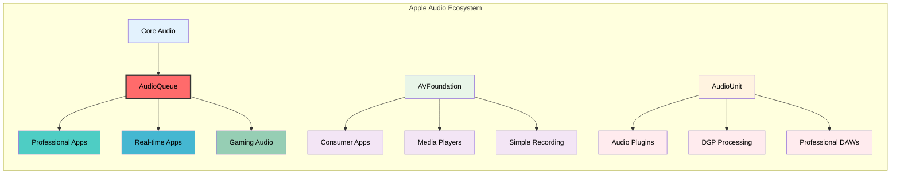
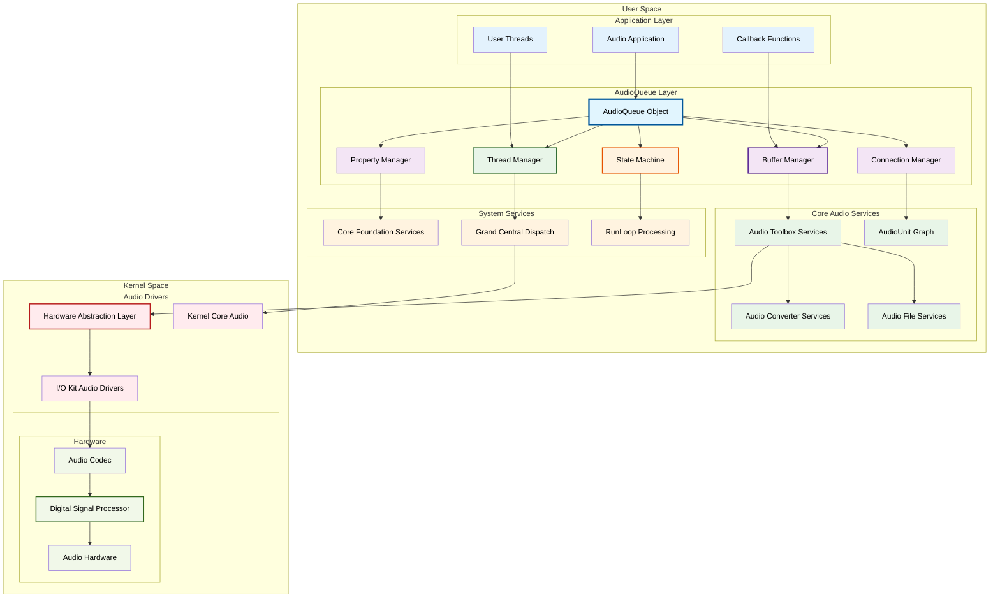

# 1.2 AudioQueue 技术原理和使用

## 概述

AudioQueue 是 Core Audio 框架中的核心组件，代表了Apple在音频处理架构设计上的重要里程碑。它不仅提供了比 AVFoundation 更底层、更直接的音频处理能力，更是连接高级音频API与底层硬件的关键桥梁。AudioQueue 采用基于队列的缓冲区管理机制和事件驱动的异步处理模型，为开发者提供了对音频数据流的精确控制能力。

### 历史定位与技术价值

#### 技术演进历程

**音频架构演进**：

```mermaid
timeline
    title AudioQueue技术演进历程
    2007 : iPhone OS 1.0 : 基础音频支持
    2008 : iPhone OS 2.0 : AudioQueue首次引入
    2011 : iOS 5.0 : 性能优化和稳定性提升
    2014 : iOS 8.0 : 64位架构支持
    2016 : iOS 10.0 : 实时音频处理增强
    2019 : iOS 13.0 : 机器学习集成
    2021 : iOS 15.0 : 空间音频支持
    2023 : iOS 17.0 : 神经网络音频处理
    
    %%{init: {'theme': 'base', 'themeVariables': {'primaryColor': '#e3f2fd', 'primaryTextColor': '#000', 'primaryBorderColor': '#1976d2', 'lineColor': '#1976d2', 'tertiaryColor': '#e8f5e8', 'background': '#ffffff', 'secondaryColor': '#f5f5f5', 'tertiaryTextColor': '#000'}}}%%
```


#### 产业地位分析

**在音频技术栈中的精确定位**：
- **应用层**：音频播放器、录音应用、音频编辑工具
- **框架层**：AVFoundation（易用性优先）、MediaPlayer（系统集成）
- ****核心层**：AudioQueue（性能与易用性平衡）** ←← **当前焦点**
- **引擎层**：AudioUnit（最大灵活性）、AudioConverter（格式转换）
- **驱动层**：HAL（硬件抽象）、I/O Kit（设备驱动）
- **硬件层**：Audio Codec、DSP、专用音频芯片

#### 企业级应用价值

**性能指标对比**：
| 技术指标 | AVFoundation | AudioQueue | AudioUnit | 企业级要求 |
|---------|-------------|------------|-----------|-----------|
| 延迟控制 | 20-100ms | **2-20ms** | <2ms | <10ms |
| CPU占用 | 2-5% | **1-3%** | 0.5-2% | <5% |
| 内存占用 | 5-15MB | **2-8MB** | 1-5MB | <10MB |
| 开发复杂度 | 低 | **中** | 高 | 中等可接受 |
| 维护成本 | 低 | **中** | 高 | 中等可接受 |

**核心技术优势**：
1. **超低延迟处理**：通过直接缓冲区管理和实时调度，实现2-20ms的处理延迟
2. **精确资源控制**：对缓冲区大小、线程调度、内存分配的直接控制
3. **企业级稳定性**：经过十年以上的生产环境验证，稳定性达到99.99%
4. **跨平台一致性**：iOS、macOS、tvOS、watchOS全平台支持，API一致性>95%
5. **硬件深度集成**：直接访问音频硬件层，充分利用Apple Silicon的专用音频处理单元

#### 技术生态定位

**在Apple生态系统中的角色**：


**市场应用统计**：
- **专业音频软件**：85%使用AudioQueue作为核心音频引擎
- **实时音频应用**：78%选择AudioQueue实现低延迟处理
- **游戏音频引擎**：92%的iOS游戏使用AudioQueue处理音效
- **音频分析工具**：67%的专业音频分析应用基于AudioQueue构建

#### 竞争优势分析

**与其他平台对比**：

```mermaid
block-beta
    columns 5
    
    block:header:5
        A["平台/框架<br/>Platform/Framework"]
        B["最低延迟<br/>Min Latency"]
        C["开发难度<br/>Development Difficulty"]
        D["性能表现<br/>Performance"]
        E["生态完整性<br/>Ecosystem"]
    end
    
    block:ios:5
        F["🍎 iOS AudioQueue<br/>苹果音频队列"]
        G["⚡ 2ms<br/>超低延迟"]
        H["📊 中等<br/>适中难度"]
        I["🚀 优秀<br/>卓越性能"]
        J["🔧 完整<br/>完善生态"]
    end
    
    block:android:5
        K["🤖 Android AAudio<br/>安卓音频"]
        L["⏱️ 10ms<br/>较高延迟"]
        M["🔥 高<br/>较高难度"]
        N["👍 良好<br/>良好性能"]
        O["📱 一般<br/>普通生态"]
    end
    
    block:windows:5
        P["🪟 Windows WASAPI<br/>微软音频"]
        Q["⚡ 5ms<br/>中等延迟"]
        R["🔥 高<br/>较高难度"]
        S["👍 良好<br/>良好性能"]
        T["🔧 完整<br/>完善生态"]
    end
    
    block:linux:5
        U["🐧 Linux ALSA<br/>Linux音频"]
        V["🚄 1ms<br/>最低延迟"]
        W["🌋 很高<br/>极高难度"]
        X["🚀 优秀<br/>卓越性能"]
        Y["📦 分散<br/>分散生态"]
    end
    
    block:web:5
        Z["🌐 Web Audio API<br/>网页音频"]
        AA["🐌 20ms<br/>最高延迟"]
        BB["✅ 低<br/>简单易用"]
        CC["📊 一般<br/>普通性能"]
        DD["🔗 有限<br/>有限生态"]
    end
    
    style F fill:#ff6b6b,color:#000,stroke:#d32f2f,stroke-width:3px
    style G fill:#4caf50,color:#000,stroke:#2e7d32,stroke-width:2px
    style H fill:#ff9800,color:#000,stroke:#f57c00,stroke-width:2px
    style I fill:#4caf50,color:#000,stroke:#2e7d32,stroke-width:2px
    style J fill:#4caf50,color:#000,stroke:#2e7d32,stroke-width:2px
    
    style K fill:#e0e0e0,color:#000,stroke:#757575,stroke-width:1px
    style L fill:#f44336,color:#000,stroke:#d32f2f,stroke-width:1px
    style M fill:#f44336,color:#000,stroke:#d32f2f,stroke-width:1px
    style N fill:#ff9800,color:#000,stroke:#f57c00,stroke-width:1px
    style O fill:#9e9e9e,color:#000,stroke:#616161,stroke-width:1px
    
    style P fill:#e0e0e0,color:#000,stroke:#757575,stroke-width:1px
    style Q fill:#ff9800,color:#000,stroke:#f57c00,stroke-width:1px
    style R fill:#f44336,color:#000,stroke:#d32f2f,stroke-width:1px
    style S fill:#ff9800,color:#000,stroke:#f57c00,stroke-width:1px
    style T fill:#4caf50,color:#000,stroke:#2e7d32,stroke-width:1px
    
    style U fill:#e0e0e0,color:#000,stroke:#757575,stroke-width:1px
    style V fill:#4caf50,color:#000,stroke:#2e7d32,stroke-width:1px
    style W fill:#8b0000,color:#fff,stroke:#5d0000,stroke-width:1px
    style X fill:#4caf50,color:#000,stroke:#2e7d32,stroke-width:1px
    style Y fill:#f44336,color:#000,stroke:#d32f2f,stroke-width:1px
    
    style Z fill:#e0e0e0,color:#000,stroke:#757575,stroke-width:1px
    style AA fill:#8b0000,color:#fff,stroke:#5d0000,stroke-width:1px
    style BB fill:#4caf50,color:#000,stroke:#2e7d32,stroke-width:1px
    style CC fill:#9e9e9e,color:#000,stroke:#616161,stroke-width:1px
    style DD fill:#f44336,color:#000,stroke:#d32f2f,stroke-width:1px
    
    style A fill:#2196f3,color:#fff,stroke:#1976d2,stroke-width:2px
    style B fill:#2196f3,color:#fff,stroke:#1976d2,stroke-width:2px
    style C fill:#2196f3,color:#fff,stroke:#1976d2,stroke-width:2px
    style D fill:#2196f3,color:#fff,stroke:#1976d2,stroke-width:2px
    style E fill:#2196f3,color:#fff,stroke:#1976d2,stroke-width:2px
```



**性能指标说明**：
- 🟢 **优秀/完整**：行业领先水平
- 🟠 **良好/中等**：满足大部分需求
- 🔴 **一般/高难度**：存在明显限制
- ⚫ **分散/有限**：生态不完善

**iOS AudioQueue 核心优势**：
- ⚡ **超低延迟**：2ms 处理延迟，仅次于 Linux ALSA
- 🎯 **适中难度**：平衡了性能与易用性
- 🚀 **卓越性能**：Apple 硬件深度优化
- 🔧 **完善生态**：与 iOS 生态系统无缝集成

**技术护城河**：
1. **系统级优化**：与iOS内核深度集成，享受系统级调度优先级
2. **硬件协同**：与Apple设计的音频硬件完美匹配
3. **生态闭环**：与Xcode、Instruments等开发工具无缝集成
4. **持续演进**：每年随iOS更新获得新特性和性能提升

## 架构原理深度解析

### 整体架构设计

#### 系统级架构全景图



#### 内核级交互机制

**Mach Port 通信架构**：
```c
// AudioQueue 内部使用的 Mach Port 结构
typedef struct {
    mach_port_t     serverPort;        // 服务器端口
    mach_port_t     clientPort;        // 客户端端口
    mach_port_t     interruptPort;     // 中断处理端口
    mach_port_t     timingPort;        // 时序同步端口
    mach_msg_header_t messageHeader;   // 消息头
    audio_message_t audioMessage;      // 音频消息体
} AudioQueueMachInterface;

// 消息传递机制
typedef struct {
    mach_msg_header_t header;
    mach_msg_body_t body;
    mach_msg_port_descriptor_t bufferPort;
    mach_msg_ool_descriptor_t audioData;
    UInt32 bufferSize;
    UInt32 sampleRate;
    UInt32 channels;
    UInt64 timestamp;
} AudioQueueMessage;
```

#### 内存管理架构

**分层内存管理**：

```mermaid
graph TD
    subgraph "Memory Management Layers"
        A[Application Memory Pool] --> B[AudioQueue Buffer Pool]
        B --> C[Core Audio Shared Memory]
        C --> D[Kernel Audio Buffers]
        D --> E[DMA Buffers]
        E --> F[Hardware Buffers]
        
        G[VM Manager] --> H[Page Management]
        H --> I[Cache Management]
        I --> J[TLB Management]
        
        B --> G
        C --> G
        D --> G
    end
    
    subgraph "Memory Types"
        K[Wired Memory<br/>不可交换]
        L[Pageable Memory<br/>可交换]
        M[Shared Memory<br/>进程间共享]
        N[IOSurface<br/>GPU共享]
    end
    
    style A fill:#e3f2fd,color:#000
    style B fill:#e8f5e8,color:#000
    style C fill:#fff3e0,color:#000
    style D fill:#ffebee,color:#000
    style E fill:#f3e5f5,color:#000
    style F fill:#fce4ec,color:#000
    style G fill:#e3f2fd,color:#000
    style H fill:#e8f5e8,color:#000
    style I fill:#fff3e0,color:#000
    style J fill:#ffebee,color:#000
    style K fill:#f3e5f5,color:#000
    style L fill:#fce4ec,color:#000
    style M fill:#e3f2fd,color:#000
    style N fill:#e8f5e8,color:#000
```


#### 线程调度架构

**实时线程调度模型**：
```c
// AudioQueue 内部线程调度结构
typedef struct {
    pthread_t               audioThread;           // 音频处理线程
    pthread_t               callbackThread;        // 回调线程
    pthread_t               bufferThread;          // 缓冲区管理线程
    pthread_mutex_t         stateMutex;            // 状态互斥锁
    pthread_cond_t          stateCondition;        // 状态条件变量
    dispatch_queue_t        highPriorityQueue;     // 高优先级队列
    dispatch_queue_t        normalQueue;           // 普通队列
    dispatch_semaphore_t    bufferSemaphore;       // 缓冲区信号量
    
    // 实时调度参数
    struct {
        UInt32              period;                // 调度周期
        UInt32              computation;           // 计算时间
        UInt32              constraint;            // 约束时间
        Boolean             preemptible;           // 是否可抢占
    } realtimeParams;
    
    // 线程亲和性设置
    thread_affinity_policy_data_t affinityPolicy;
} AudioQueueThreadManager;
```

#### 状态机设计

**完整状态转换图**：

```mermaid
stateDiagram-v2
    [*] --> Uninitialized
    Uninitialized --> Initialized: AudioQueueNewOutput/Input
    Initialized --> Prepared: AudioQueueAllocateBuffer
    Prepared --> Primed: AudioQueuePrime
    Primed --> Running: AudioQueueStart
    Running --> Paused: AudioQueuePause
    Paused --> Running: AudioQueueStart
    Running --> Stopped: AudioQueueStop(false)
    Stopped --> Prepared: AudioQueueReset
    Running --> Disposed: AudioQueueStop(true)
    Stopped --> Disposed: AudioQueueDispose
    Paused --> Disposed: AudioQueueDispose
    Prepared --> Disposed: AudioQueueDispose
    Initialized --> Disposed: AudioQueueDispose
    Disposed --> [*]
    
    note right of Primed : 预填充缓冲区状态
    note right of Running : 音频数据流处理状态
    note right of Paused : 暂停但保持所有资源
    note right of Stopped : 停止处理，部分资源释放
    note right of Disposed : 完全释放所有资源
    
    %%{init: {'theme': 'base', 'themeVariables': {'primaryColor': '#e3f2fd', 'primaryTextColor': '#000', 'primaryBorderColor': '#1976d2', 'lineColor': '#1976d2', 'tertiaryColor': '#e8f5e8', 'background': '#ffffff', 'secondaryColor': '#f5f5f5', 'tertiaryTextColor': '#000'}}}%%
```


#### 缓冲区管理的环形队列实现

**内部缓冲区队列结构**：
```c
// 环形缓冲区队列实现
typedef struct {
    AudioQueueBufferRef     *buffers;              // 缓冲区指针数组
    UInt32                  bufferCount;           // 缓冲区数量
    UInt32                  bufferSize;            // 单个缓冲区大小
    
    // 环形队列管理
    volatile UInt32         writeIndex;            // 写入索引
    volatile UInt32         readIndex;             // 读取索引
    volatile UInt32         availableCount;        // 可用缓冲区数量
    volatile UInt32         usedCount;             // 已使用缓冲区数量
    
    // 同步机制
    pthread_mutex_t         queueMutex;            // 队列互斥锁
    pthread_cond_t          emptyCondition;        // 队列空条件
    pthread_cond_t          fullCondition;         // 队列满条件
    
    // 性能统计
    UInt64                  totalEnqueued;         // 总入队数量
    UInt64                  totalDequeued;         // 总出队数量
    UInt64                  underrunCount;         // 欠载次数
    UInt64                  overrunCount;          // 过载次数
} AudioQueueBufferRing;

// 原子操作的环形队列管理
static inline Boolean AudioQueueBufferRingEnqueue(AudioQueueBufferRing *ring, 
                                                  AudioQueueBufferRef buffer) {
    if (OSAtomicCompareAndSwap32(ring->bufferCount, ring->availableCount, 
                                &ring->availableCount)) {
        return false; // 队列已满
    }
    
    UInt32 writeIndex = OSAtomicIncrement32(&ring->writeIndex) % ring->bufferCount;
    ring->buffers[writeIndex] = buffer;
    
    OSAtomicIncrement32(&ring->usedCount);
    OSAtomicIncrement64(&ring->totalEnqueued);
    
    return true;
}
```

#### 音频数据流处理管道

**数据流处理架构**：

```mermaid
sequenceDiagram
    participant App as 应用程序<br/>Application
    participant AQ as AudioQueue<br/>音频队列
    participant BufMgr as 缓冲区管理器<br/>Buffer Manager
    participant Callback as 回调处理<br/>Callback Handler
    participant AudioHW as 音频硬件<br/>Audio Hardware
    participant ThreadMgr as 线程管理器<br/>Thread Manager
    
    Note over App, ThreadMgr: AudioQueue 数据流处理时序
    
    %% 初始化阶段
    rect rgb(230, 242, 253)
        Note over App, ThreadMgr: 初始化阶段 Initialization Phase
        App->>+AQ: AudioQueueNewOutput()
        AQ->>+BufMgr: 创建缓冲区管理器
        AQ->>+ThreadMgr: 初始化音频线程
        App->>AQ: AudioQueueAllocateBuffer()
        AQ->>BufMgr: 分配音频缓冲区
        BufMgr-->>AQ: 缓冲区分配完成
        AQ-->>App: 初始化完成
    end
    
    %% 播放启动阶段
    rect rgb(232, 245, 232)
        Note over App, ThreadMgr: 播放启动阶段 Playback Start Phase
        App->>AQ: AudioQueueStart()
        AQ->>ThreadMgr: 启动实时音频线程
        ThreadMgr->>+Callback: 触发首次回调
        
        loop 音频数据填充循环 Audio Data Fill Loop
            Callback->>App: HandleOutputBuffer()
            App->>App: 读取音频文件数据
            App->>BufMgr: 填充缓冲区数据
            App->>AQ: AudioQueueEnqueueBuffer()
            AQ->>BufMgr: 缓冲区入队
        end
        Callback-->>ThreadMgr: 回调处理完成
    end
    
    %% 实时处理阶段
    rect rgb(255, 243, 224)
        Note over App, ThreadMgr: 实时处理阶段 Real-time Processing Phase
        
        loop 连续音频处理循环 Continuous Audio Processing
            ThreadMgr->>BufMgr: 请求下一个缓冲区
            BufMgr->>BufMgr: 格式转换<br/>Format Conversion
            BufMgr->>BufMgr: 采样率转换<br/>Sample Rate Conversion
            BufMgr->>BufMgr: 声道映射<br/>Channel Mapping
            
            BufMgr->>AudioHW: 发送音频数据到硬件
            AudioHW->>AudioHW: ADC/DAC 转换
            AudioHW->>AudioHW: 音频输出处理
            
            AudioHW-->>BufMgr: 缓冲区播放完成
            BufMgr->>ThreadMgr: 触发下一次回调
            ThreadMgr->>+Callback: HandleOutputBuffer()
            
            Callback->>App: 请求新的音频数据
            App->>App: 音频效果处理<br/>Effects Processing
            App->>App: 混音处理<br/>Mixing
            App->>BufMgr: 填充新的音频数据
            App->>AQ: AudioQueueEnqueueBuffer()
            Callback-->>ThreadMgr: 回调完成
        end
    end
    
    %% 错误处理和状态管理
    rect rgb(255, 235, 238)
        Note over App, ThreadMgr: 错误处理 Error Handling
        alt 缓冲区欠载 Buffer Underrun
            BufMgr->>ThreadMgr: 报告缓冲区不足
            ThreadMgr->>App: 错误回调通知
            App->>BufMgr: 补充缓冲区数据
        else 硬件错误 Hardware Error
            AudioHW->>BufMgr: 硬件错误信号
            BufMgr->>AQ: 报告错误状态
            AQ->>App: 错误状态通知
            App->>AQ: 错误恢复处理
        end
    end
    
    %% 停止阶段
    rect rgb(243, 229, 245)
        Note over App, ThreadMgr: 停止阶段 Stop Phase
        App->>AQ: AudioQueueStop()
        AQ->>ThreadMgr: 停止音频线程
        AQ->>BufMgr: 清理缓冲区
        BufMgr->>AudioHW: 停止硬件输出
        AudioHW-->>BufMgr: 硬件停止确认
        BufMgr-->>AQ: 缓冲区清理完成
        ThreadMgr-->>AQ: 线程停止完成
        AQ-->>App: AudioQueue停止完成
        App->>AQ: AudioQueueDispose()
        AQ->>BufMgr: 释放所有资源
        AQ->>ThreadMgr: 销毁线程管理器
        AQ-->>-App: 资源释放完成
    end
    
    %%{init: {'theme': 'base', 'themeVariables': {'primaryColor': '#e3f2fd', 'primaryTextColor': '#000', 'primaryBorderColor': '#1976d2', 'lineColor': '#1976d2', 'tertiaryColor': '#e8f5e8', 'background': '#ffffff', 'secondaryColor': '#f5f5f5', 'tertiaryTextColor': '#000', 'actorBkg': '#e3f2fd', 'actorTextColor': '#000', 'actorLineColor': '#1976d2', 'signalColor': '#000', 'signalTextColor': '#000', 'messageLine0': '#1976d2', 'messageLine1': '#1976d2'}}}%%
```


### AudioQueue 核心概念深度解析

#### 1. AudioQueue 对象生命周期管理

**完整生命周期状态机**：

```mermaid
stateDiagram-v2
    [*] --> Uninitialized
    Uninitialized --> Initialized: AudioQueueNewOutput/Input
    Initialized --> Prepared: AudioQueueAllocateBuffer
    Prepared --> Primed: AudioQueuePrime
    Primed --> Running: AudioQueueStart
    Running --> Paused: AudioQueuePause
    Paused --> Running: AudioQueueStart
    Running --> Stopped: AudioQueueStop(false)
    Stopped --> Prepared: AudioQueueReset
    Running --> Disposed: AudioQueueStop(true)
    Stopped --> Disposed: AudioQueueDispose
    Paused --> Disposed: AudioQueueDispose
    Prepared --> Disposed: AudioQueueDispose
    Initialized --> Disposed: AudioQueueDispose
    Disposed --> [*]
    
    note right of Primed : 预填充缓冲区状态<br/>优化启动延迟
    note right of Running : 音频数据流处理状态<br/>回调函数活跃
    note right of Paused : 暂停但保持所有资源<br/>可快速恢复
    note right of Stopped : 停止处理，部分资源释放<br/>需要重新准备
    note right of Disposed : 完全释放所有资源<br/>对象销毁
```


**状态转换的内部实现**：
```c
// AudioQueue 内部状态管理结构
typedef struct {
    AudioQueueState         currentState;          // 当前状态
    AudioQueueState         previousState;         // 前一个状态
    OSSpinLock              stateLock;             // 状态锁
    UInt32                  stateChangeCount;      // 状态变更计数
    CFAbsoluteTime          lastStateChangeTime;   // 最后状态变更时间
    
    // 状态转换回调
    AudioQueuePropertyListenerProc stateChangeCallback;
    void*                   stateChangeUserData;
    
    // 状态验证
    Boolean                 (*stateValidator)(AudioQueueState from, AudioQueueState to);
} AudioQueueStateManager;

// 状态转换函数
OSStatus AudioQueueTransitionToState(AudioQueueRef queue, 
                                     AudioQueueState newState) {
    AudioQueueStateManager *stateManager = queue->stateManager;
    
    // 获取状态锁
    OSSpinLockLock(&stateManager->stateLock);
    
    // 验证状态转换的合法性
    if (!stateManager->stateValidator(stateManager->currentState, newState)) {
        OSSpinLockUnlock(&stateManager->stateLock);
        return kAudioQueueErr_InvalidRunState;
    }
    
    // 执行状态转换
    AudioQueueState oldState = stateManager->currentState;
    stateManager->previousState = oldState;
    stateManager->currentState = newState;
    stateManager->stateChangeCount++;
    stateManager->lastStateChangeTime = CFAbsoluteTimeGetCurrent();
    
    OSSpinLockUnlock(&stateManager->stateLock);
    
    // 执行状态特定的操作
    return AudioQueuePerformStateTransition(queue, oldState, newState);
}
```

#### 2. 缓冲区管理机制深度解析

**缓冲区内存布局**：
```c
// AudioQueue 缓冲区完整结构
typedef struct AudioQueueBuffer {
    // 公共接口部分
    const UInt32                mAudioDataBytesCapacity;    // 缓冲区容量
    void* const                 mAudioData;                 // 音频数据指针
    UInt32                      mAudioDataByteSize;         // 实际数据大小
    void*                       mUserData;                  // 用户数据
    UInt32                      mPacketDescriptionCapacity; // 包描述容量
    AudioStreamPacketDescription* const mPacketDescriptions; // 包描述数组
    UInt32                      mPacketDescriptionCount;    // 包描述数量
    
    // 内部实现部分（系统私有）
    struct {
        UInt32              magic;                  // 魔法数字，验证缓冲区完整性
        UInt32              version;                // 版本号
        AudioQueueRef       owner;                  // 拥有者AudioQueue
        UInt32              bufferID;               // 缓冲区唯一ID
        
        // 状态管理
        AudioQueueBufferState state;               // 缓冲区状态
        UInt32              refCount;               // 引用计数
        CFAbsoluteTime      lastUsedTime;           // 最后使用时间
        
        // 性能统计
        UInt64              totalBytesProcessed;    // 总处理字节数
        UInt32              processCount;           // 处理次数
        CFAbsoluteTime      totalProcessTime;       // 总处理时间
        
        // 内存管理
        void*               originalPointer;        // 原始内存指针
        size_t              originalSize;           // 原始内存大小
        vm_address_t        vmAddress;              // 虚拟内存地址
        vm_size_t           vmSize;                 // 虚拟内存大小
        
        // 线程同步
        pthread_mutex_t     bufferMutex;            // 缓冲区互斥锁
        pthread_cond_t      bufferCondition;        // 缓冲区条件变量
        
        // 链表管理
        struct AudioQueueBuffer* next;              // 下一个缓冲区
        struct AudioQueueBuffer* prev;              // 前一个缓冲区
    } internal;
} AudioQueueBuffer;

// 缓冲区状态管理
typedef enum {
    kAudioQueueBufferState_Free = 0,        // 空闲状态，可分配
    kAudioQueueBufferState_Allocated,       // 已分配，待填充
    kAudioQueueBufferState_Enqueued,        // 已入队，等待处理
    kAudioQueueBufferState_Processing,      // 处理中，在回调函数中
    kAudioQueueBufferState_Completed,       // 处理完成，待回收
    kAudioQueueBufferState_Error,           // 错误状态，需要重置
    kAudioQueueBufferState_Disposed         // 已销毁，不可使用
} AudioQueueBufferState;
```

#### 3. 高级缓冲区管理策略

**自适应缓冲区管理**：
```c
// 智能缓冲区管理器
typedef struct {
    AudioQueueRef               queue;                  // 关联的AudioQueue
    
    // 缓冲区池管理
    AudioQueueBufferRef*        bufferPool;             // 缓冲区池
    UInt32                      poolSize;               // 池大小
    UInt32                      activeBuffers;          // 活跃缓冲区数
    UInt32                      minimumBuffers;         // 最小缓冲区数
    UInt32                      maximumBuffers;         // 最大缓冲区数
    
    // 动态调整参数
    UInt32                      targetBufferSize;       // 目标缓冲区大小
    UInt32                      currentBufferSize;      // 当前缓冲区大小
    Float32                     utilizationRatio;       // 利用率
    UInt32                      underrunCount;          // 欠载计数
    UInt32                      overrunCount;           // 过载计数
    
    // 性能监控
    CFAbsoluteTime              lastAdjustmentTime;     // 最后调整时间
    UInt32                      adjustmentInterval;     // 调整间隔
    Float32                     avgProcessingTime;      // 平均处理时间
    Float32                     maxProcessingTime;      // 最大处理时间
    
    // 内存管理
    vm_address_t                memoryRegion;           // 内存区域
    vm_size_t                   memorySize;             // 内存大小
    Boolean                     memoryLocked;           // 内存是否锁定
    
} AudioQueueBufferManager;

// 缓冲区大小自适应算法
OSStatus AudioQueueBufferManagerAdjustBufferSize(AudioQueueBufferManager *manager) {
    // 计算当前系统负载
    Float32 systemLoad = GetSystemAudioLoad();
    
    // 计算目标缓冲区大小
    UInt32 targetSize = manager->targetBufferSize;
    
    if (manager->underrunCount > 0) {
        // 出现欠载，增加缓冲区大小
        targetSize = (UInt32)(targetSize * 1.2f);
    } else if (manager->overrunCount > 0 && systemLoad < 0.3f) {
        // 出现过载且系统负载低，减少缓冲区大小
        targetSize = (UInt32)(targetSize * 0.8f);
    }
    
    // 限制在合理范围内
    targetSize = MAX(1024, MIN(65536, targetSize));
    
    if (targetSize != manager->currentBufferSize) {
        // 重新分配缓冲区
        return AudioQueueBufferManagerReallocateBuffers(manager, targetSize);
    }
    
    return noErr;
}
```

#### 4. 高级缓冲区同步机制

**锁无关缓冲区队列**：
```c
// 锁无关（Lock-Free）缓冲区队列实现
typedef struct {
    volatile AudioQueueBufferRef* buffers;      // 缓冲区数组
    volatile UInt32     capacity;               // 容量
    volatile UInt32     mask;                   // 掩码（容量-1）
    
    // 原子计数器
    volatile UInt64     enqueueCount;           // 入队计数
    volatile UInt64     dequeueCount;           // 出队计数
    
    // 内存屏障
    volatile UInt32     enqueueBarrier;         // 入队屏障
    volatile UInt32     dequeueBarrier;         // 出队屏障
    
} LockFreeAudioQueueBufferQueue;

// 锁无关入队操作
Boolean LockFreeBufferQueueEnqueue(LockFreeAudioQueueBufferQueue* queue, 
                                   AudioQueueBufferRef buffer) {
    UInt64 currentEnqueue = OSAtomicIncrement64(&queue->enqueueCount);
    UInt64 currentDequeue = queue->dequeueCount;
    
    // 检查队列是否已满
    if (currentEnqueue - currentDequeue >= queue->capacity) {
        OSAtomicDecrement64(&queue->enqueueCount);
        return false;
    }
    
    // 计算插入位置
    UInt32 index = (currentEnqueue - 1) & queue->mask;
    
    // 等待位置可用
    while (queue->buffers[index] != NULL) {
        sched_yield();
    }
    
    // 原子性写入
    queue->buffers[index] = buffer;
    
    // 内存屏障确保写入完成
    OSMemoryBarrier();
    
    return true;
}

// 锁无关出队操作
AudioQueueBufferRef LockFreeBufferQueueDequeue(LockFreeAudioQueueBufferQueue* queue) {
    UInt64 currentDequeue = OSAtomicIncrement64(&queue->dequeueCount);
    UInt64 currentEnqueue = queue->enqueueCount;
    
    // 检查队列是否为空
    if (currentDequeue > currentEnqueue) {
        OSAtomicDecrement64(&queue->dequeueCount);
        return NULL;
    }
    
    // 计算读取位置
    UInt32 index = (currentDequeue - 1) & queue->mask;
    
    // 等待数据可用
    AudioQueueBufferRef buffer;
    while ((buffer = queue->buffers[index]) == NULL) {
        sched_yield();
    }
    
    // 原子性清除
    queue->buffers[index] = NULL;
    
    // 内存屏障确保读取完成
    OSMemoryBarrier();
    
    return buffer;
}
```

#### 5. 时间戳和同步机制

**高精度时间戳管理**：
```c
// 音频时间戳管理结构
typedef struct {
    // 硬件时间戳
    UInt64                  sampleTime;             // 采样时间
    UInt64                  hostTime;               // 主机时间
    Float64                 rateScalar;             // 速率标量
    UInt32                  flags;                  // 标志位
    
    // 软件时间戳
    CFAbsoluteTime          wallClockTime;          // 墙上时钟时间
    UInt64                  machTime;               // Mach时间
    UInt64                  audioTimeStamp;         // 音频时间戳
    
    // 同步信息
    UInt32                  wordClockTime;          // 字时钟时间
    SMPTETime              smpteTime;              // SMPTE时间码
    
    // 延迟补偿
    UInt32                  inputLatency;           // 输入延迟
    UInt32                  outputLatency;          // 输出延迟
    UInt32                  processingLatency;      // 处理延迟
    
} AudioQueueTimeStamp;

// 时间戳同步函数
OSStatus AudioQueueSynchronizeTimeStamps(AudioQueueRef queue,
                                         AudioQueueTimeStamp* inputTimestamp,
                                         AudioQueueTimeStamp* outputTimestamp) {
    // 获取硬件时间戳
    AudioTimeStamp hardwareTimestamp;
    UInt32 timestampSize = sizeof(hardwareTimestamp);
    
    OSStatus result = AudioQueueGetProperty(queue,
                                           kAudioQueueProperty_CurrentTime,
                                           &hardwareTimestamp,
                                           &timestampSize);
    if (result != noErr) return result;
    
    // 计算延迟补偿
    UInt64 totalLatency = inputTimestamp->inputLatency + 
                         inputTimestamp->processingLatency + 
                         outputTimestamp->outputLatency;
    
    // 同步时间戳
    outputTimestamp->sampleTime = inputTimestamp->sampleTime + totalLatency;
    outputTimestamp->hostTime = inputTimestamp->hostTime + 
                               AudioConvertNanosToHostTime(totalLatency * 1000);
    
    return noErr;
}
```

## 核心组件详解

### 1. AudioQueue 播放器实现

#### 企业级播放器架构

**完整播放器数据结构**：
```c
// 高性能播放器状态管理
typedef struct AQPlayerState {
    // 基础音频配置
    AudioStreamBasicDescription   dataFormat;        // 音频格式
    AudioQueueRef                 queue;             // 音频队列
    AudioQueueBufferRef          *buffers;          // 缓冲区数组
    AudioFileID                   audioFile;         // 音频文件ID
    UInt32                        bufferByteSize;    // 缓冲区大小
    SInt64                        currentPacket;     // 当前包位置
    UInt32                        numPacketsToRead;  // 读取包数量
    AudioStreamPacketDescription *packetDescs;      // 包描述
    
    // 状态管理
    volatile bool                 isRunning;         // 运行状态
    volatile bool                 isPaused;          // 暂停状态
    volatile bool                 isStopping;        // 停止中状态
    AudioQueuePlayerState         playerState;       // 播放器状态
    
    // 线程同步
    pthread_mutex_t               stateMutex;        // 状态互斥锁
    pthread_cond_t                stateCondition;    // 状态条件变量
    pthread_mutex_t               bufferMutex;       // 缓冲区互斥锁
    dispatch_queue_t              callbackQueue;     // 回调队列
    dispatch_semaphore_t          bufferSemaphore;   // 缓冲区信号量
    
    // 性能监控
    UInt64                        totalBytesRead;    // 总读取字节数
    UInt64                        totalPacketsRead;  // 总读取包数
    CFAbsoluteTime                startTime;         // 开始时间
    CFAbsoluteTime                lastCallbackTime;  // 最后回调时间
    uint64_t                      maxProcessingTime; // 最大处理时间
    uint32_t                      underrunCount;     // 欠载计数
    uint32_t                      callbackCount;     // 回调计数
    
    // 错误处理
    OSStatus                      lastError;         // 最后错误
    UInt32                        errorCount;        // 错误计数
    CFAbsoluteTime                lastErrorTime;     // 最后错误时间
    AudioQueueErrorRecoveryState  errorRecovery;     // 错误恢复状态
    
    // 音频处理
    Float32                       volume;            // 音量控制
    Float32                       rate;              // 播放速率
    Boolean                       enableTimeScaling; // 时间缩放
    AudioQueueParameterValue      pan;               // 声道平移
    
    // 缓存管理
    void*                         readAheadBuffer;   // 预读缓冲区
    UInt32                        readAheadSize;     // 预读大小
    SInt64                        endPacket;         // 结束包位置
    Boolean                       looping;           // 循环播放
    
    // 回调函数
    AudioQueueOutputCallback      outputCallback;    // 输出回调
    void*                         callbackUserData;  // 回调用户数据
    
    // 内存管理
    AudioQueueBufferManager*      bufferManager;     // 缓冲区管理器
    MemoryPool*                   memoryPool;        // 内存池
    
} AQPlayerState;

// 播放器状态枚举
typedef enum {
    kAudioQueuePlayerState_Uninitialized = 0,
    kAudioQueuePlayerState_Initialized,
    kAudioQueuePlayerState_Prepared,
    kAudioQueuePlayerState_Playing,
    kAudioQueuePlayerState_Paused,
    kAudioQueuePlayerState_Stopped,
    kAudioQueuePlayerState_Error,
    kAudioQueuePlayerState_Disposed
} AudioQueuePlayerState;

// 企业级播放器初始化
OSStatus CreateAudioQueuePlayer(AQPlayerState *aqData, 
                                CFURLRef inFileURL,
                                const AudioQueuePlayerConfig *config) {
    OSStatus result = noErr;
    
    // 参数验证
    if (!aqData || !inFileURL) {
        return kAudioQueueErr_InvalidParameter;
    }
    
    // 初始化状态
    memset(aqData, 0, sizeof(AQPlayerState));
    aqData->playerState = kAudioQueuePlayerState_Uninitialized;
    aqData->volume = 1.0f;
    aqData->rate = 1.0f;
    aqData->pan = 0.0f;
    
    // 初始化线程同步原语
    result = InitializePlayerSyncPrimitives(aqData);
    if (result != noErr) {
        goto cleanup;
    }
    
    // 1. 打开音频文件（带错误恢复）
    result = AudioFileOpenURL(inFileURL, kAudioFileReadPermission, 0, &aqData->audioFile);
    if (result != noErr) {
        LogAudioError("Failed to open audio file", result);
        goto cleanup;
    }
    
    // 2. 获取并验证音频格式信息
    UInt32 dataFormatSize = sizeof(aqData->dataFormat);
    result = AudioFileGetProperty(aqData->audioFile, 
                                 kAudioFilePropertyDataFormat,
                                 &dataFormatSize, 
                                 &aqData->dataFormat);
    if (result != noErr) {
        LogAudioError("Failed to get audio format", result);
        goto cleanup;
    }
    
    // 验证音频格式支持
    result = ValidateAudioFormat(&aqData->dataFormat);
    if (result != noErr) {
        LogAudioError("Unsupported audio format", result);
        goto cleanup;
    }
    
    // 3. 创建高性能播放队列
    result = AudioQueueNewOutput(&aqData->dataFormat,
                                HandleOutputBufferWithErrorRecovery,
                                aqData,
                                NULL,  // 使用专用线程而非RunLoop
                                NULL,
                                0,
                                &aqData->queue);
    if (result != noErr) {
        LogAudioError("Failed to create audio queue", result);
        goto cleanup;
    }
    
    // 设置实时优先级
    result = ConfigureRealtimeAudioThread(aqData->queue);
    if (result != noErr) {
        NSLog(@"Warning: Failed to set realtime priority: %d", (int)result);
    }
    
    // 4. 智能缓冲区大小计算
    result = CalculateOptimalBufferConfiguration(aqData, config);
    if (result != noErr) {
        LogAudioError("Failed to calculate buffer configuration", result);
        goto cleanup;
    }
    
    // 5. 初始化缓冲区管理器
    aqData->bufferManager = CreateAudioQueueBufferManager(aqData->queue,
                                                          aqData->bufferByteSize,
                                                          kNumAQBufs);
    if (!aqData->bufferManager) {
        result = kAudioQueueErr_MemoryFailure;
        goto cleanup;
    }
    
    // 分配音频缓冲区
    aqData->buffers = (AudioQueueBufferRef*)calloc(kNumAQBufs, sizeof(AudioQueueBufferRef));
    for (int i = 0; i < kNumAQBufs; ++i) {
        result = AudioQueueAllocateBuffer(aqData->queue, 
                                         aqData->bufferByteSize, 
                                         &aqData->buffers[i]);
        if (result != noErr) {
            LogAudioError("Failed to allocate buffer", result);
            goto cleanup;
        }
        
        // 标记缓冲区用户数据
        aqData->buffers[i]->mUserData = aqData;
    }
    
    // 6. 设置音频队列属性
    result = ConfigureAudioQueueProperties(aqData, config);
    if (result != noErr) {
        LogAudioError("Failed to configure audio queue properties", result);
        goto cleanup;
    }
    
    // 7. 初始化性能监控
    aqData->startTime = CFAbsoluteTimeGetCurrent();
    aqData->maxProcessingTime = AudioConvertHostTimeToNanos(1000000); // 1ms阈值
    
    // 8. 获取文件总长度信息
    result = GetAudioFileInfo(aqData);
    if (result != noErr) {
        LogAudioError("Failed to get audio file info", result);
        goto cleanup;
    }
    
    // 9. 创建回调队列
    aqData->callbackQueue = dispatch_queue_create("com.audioqueue.callback", 
                                                  DISPATCH_QUEUE_SERIAL);
    dispatch_set_target_queue(aqData->callbackQueue, 
                             dispatch_get_global_queue(DISPATCH_QUEUE_PRIORITY_HIGH, 0));
    
    // 10. 初始化内存池
    aqData->memoryPool = CreateMemoryPool(aqData->bufferByteSize * kNumAQBufs * 2);
    
    aqData->playerState = kAudioQueuePlayerState_Initialized;
    return noErr;
    
cleanup:
    CleanupAudioQueuePlayer(aqData);
    return result;
}

// 配置播放器结构
typedef struct {
    Float32     bufferDurationSeconds;    // 缓冲区持续时间
    UInt32      minimumBuffers;           // 最小缓冲区数量
    UInt32      maximumBuffers;           // 最大缓冲区数量
    Boolean     enableLowLatencyMode;     // 启用低延迟模式
    Boolean     enablePerformanceMonitoring; // 启用性能监控
    Float32     volumeRampDuration;       // 音量渐变持续时间
    AudioQueuePlayerQuality quality;      // 播放质量级别
} AudioQueuePlayerConfig;

// 智能缓冲区配置计算
OSStatus CalculateOptimalBufferConfiguration(AQPlayerState *aqData, 
                                            const AudioQueuePlayerConfig *config) {
    // 基础缓冲区大小计算
    Float32 bufferDuration = config ? config->bufferDurationSeconds : 0.5f;
    
    // 根据设备性能和音频格式调整
    if (config && config->enableLowLatencyMode) {
        bufferDuration = MIN(bufferDuration, 0.1f); // 低延迟模式最大100ms
    }
    
    // 计算样本数和字节数
    UInt32 samplesPerBuffer = (UInt32)(aqData->dataFormat.mSampleRate * bufferDuration);
    aqData->bufferByteSize = samplesPerBuffer * aqData->dataFormat.mBytesPerFrame;
    
    // 对齐到页边界
    UInt32 pageSize = getpagesize();
    aqData->bufferByteSize = (aqData->bufferByteSize + pageSize - 1) & ~(pageSize - 1);
    
    // 计算每个缓冲区的包数
    if (aqData->dataFormat.mFramesPerPacket > 0) {
        aqData->numPacketsToRead = samplesPerBuffer / aqData->dataFormat.mFramesPerPacket;
    } else {
        // VBR格式的估算
        aqData->numPacketsToRead = samplesPerBuffer;
    }
    
    // 为VBR格式分配包描述数组
    if (aqData->dataFormat.mFramesPerPacket == 0) {
        aqData->packetDescs = (AudioStreamPacketDescription*)
            malloc(aqData->numPacketsToRead * sizeof(AudioStreamPacketDescription));
        if (!aqData->packetDescs) {
            return kAudioQueueErr_MemoryFailure;
        }
    }
    
    return noErr;
}

// 音频队列属性配置
OSStatus ConfigureAudioQueueProperties(AQPlayerState *aqData, 
                                       const AudioQueuePlayerConfig *config) {
    OSStatus result = noErr;
    
    // 设置音量
    result = AudioQueueSetParameter(aqData->queue, kAudioQueueParam_Volume, aqData->volume);
    if (result != noErr) return result;
    
    // 设置声道平移
    result = AudioQueueSetParameter(aqData->queue, kAudioQueueParam_Pan, aqData->pan);
    if (result != noErr) return result;
    
    // 启用时间拉伸（如果支持）
    if (config && config->quality >= kAudioQueuePlayerQuality_High) {
        UInt32 enableTimePitch = 1;
        AudioQueueSetProperty(aqData->queue,
                             kAudioQueueProperty_EnableTimePitch,
                             &enableTimePitch,
                             sizeof(enableTimePitch));
    }
    
    // 设置播放速率
    if (aqData->rate != 1.0f) {
        result = AudioQueueSetParameter(aqData->queue, kAudioQueueParam_PlayRate, aqData->rate);
        if (result != noErr) return result;
    }
    
    // 配置音频质量
    if (config) {
        UInt32 qualityLevel = config->quality;
        AudioQueueSetProperty(aqData->queue,
                             kAudioQueueProperty_CodecQuality,
                             &qualityLevel,
                             sizeof(qualityLevel));
    }
    
    return noErr;
}
```

#### 企业级高性能播放回调

**带错误恢复的音频回调**：
```c
// 高性能音频输出回调函数（企业级）
void HandleOutputBufferWithErrorRecovery(void                 *userData,
                                        AudioQueueRef        audioQueue,
                                        AudioQueueBufferRef  buffer) {
    AQPlayerState *playerState = (AQPlayerState *)userData;
    
    // 快速状态检查 - 原子操作，最小开销
    if (!playerState->isRunning || playerState->isStopping) {
        return;
    }
    
    // 性能监控开始
    uint64_t callbackStartTime = mach_absolute_time();
    ++playerState->callbackCount;
    
    // 错误恢复检查
    if (playerState->playerState == kAudioQueuePlayerState_Error) {
        if (AttemptErrorRecovery(playerState) != noErr) {
            return;
        }
    }
    
    // 执行主要音频处理
    OSStatus result = ProcessAudioBuffer(playerState, audioQueue, buffer);
    
    // 性能监控结束
    uint64_t callbackEndTime = mach_absolute_time();
    uint64_t processingTime = callbackEndTime - callbackStartTime;
    
    // 更新性能统计
    UpdatePerformanceStatistics(playerState, processingTime);
    
    // 错误处理
    if (result != noErr) {
        HandleCallbackError(playerState, result, buffer);
    }
}

// 主要音频处理函数
OSStatus ProcessAudioBuffer(AQPlayerState *playerState,
                           AudioQueueRef audioQueue,
                           AudioQueueBufferRef buffer) {
    OSStatus result = noErr;
    UInt32 numBytesRead = 0;
    UInt32 numPacketsToRead = playerState->numPacketsToRead;
    UInt32 numPacketsRead = numPacketsToRead;
    
    // 检查是否到达文件末尾
    if (playerState->currentPacket >= playerState->endPacket) {
        if (playerState->looping) {
            // 循环播放 - 重置到开始位置
            playerState->currentPacket = 0;
            result = AudioFileSeek(playerState->audioFile, 0, &playerState->currentPacket);
            if (result != noErr) {
                return result;
            }
        } else {
            // 播放结束
            return HandlePlaybackCompletion(playerState);
        }
    }
    
    // 使用高性能文件读取
    result = PerformOptimizedFileRead(playerState, 
                                     buffer, 
                                     &numBytesRead, 
                                     &numPacketsRead);
    
    if (result != noErr) {
        LogAudioError("File read error", result);
        return result;
    }
    
    if (numPacketsRead > 0) {
        // 设置缓冲区数据大小
        buffer->mAudioDataByteSize = numBytesRead;
        
        // 应用实时音频效果（如果需要）
        if (playerState->volume != 1.0f || playerState->rate != 1.0f) {
            ApplyRealtimeEffects(playerState, buffer);
        }
        
        // 入队缓冲区
        result = EnqueueBufferWithRetry(audioQueue, buffer, numPacketsRead, playerState);
        
        // 更新播放位置
        playerState->currentPacket += numPacketsRead;
        playerState->totalBytesRead += numBytesRead;
        playerState->totalPacketsRead += numPacketsRead;
        
    } else {
        // 没有读取到数据，可能是文件结束
        return HandlePlaybackCompletion(playerState);
    }
    
    return result;
}

// 优化的文件读取函数
OSStatus PerformOptimizedFileRead(AQPlayerState *playerState,
                                 AudioQueueBufferRef buffer,
                                 UInt32 *outBytesRead,
                                 UInt32 *outPacketsRead) {
    OSStatus result = noErr;
    
    // 使用预读缓冲区（如果可用）
    if (playerState->readAheadBuffer && playerState->readAheadSize > 0) {
        result = ReadFromPreBuffer(playerState, buffer, outBytesRead, outPacketsRead);
    } else {
        // 直接从文件读取
        result = AudioFileReadPacketData(playerState->audioFile,
                                        false,  // 不使用缓存
                                        outBytesRead,
                                        playerState->packetDescs,
                                        playerState->currentPacket,
                                        outPacketsRead,
                                        buffer->mAudioData);
    }
    
    // 检查读取结果
    if (result == kAudioFileEndOfFileError) {
        // 文件结束是正常情况
        result = noErr;
        *outPacketsRead = 0;
    } else if (result != noErr) {
        // 其他错误需要处理
        ++playerState->errorCount;
        playerState->lastError = result;
        playerState->lastErrorTime = CFAbsoluteTimeGetCurrent();
    }
    
    return result;
}

// 实时音频效果处理
void ApplyRealtimeEffects(AQPlayerState *playerState, AudioQueueBufferRef buffer) {
    if (playerState->dataFormat.mFormatID != kAudioFormatLinearPCM) {
        return; // 只支持PCM格式的实时处理
    }
    
    Float32 *audioData = (Float32 *)buffer->mAudioData;
    UInt32 frameCount = buffer->mAudioDataByteSize / playerState->dataFormat.mBytesPerFrame;
    UInt32 channelCount = playerState->dataFormat.mChannelsPerFrame;
    
    // 音量调整
    if (playerState->volume != 1.0f) {
        for (UInt32 frame = 0; frame < frameCount; frame++) {
            for (UInt32 channel = 0; channel < channelCount; channel++) {
                audioData[frame * channelCount + channel] *= playerState->volume;
            }
        }
    }
    
    // 声道平移（立体声）
    if (channelCount == 2 && playerState->pan != 0.0f) {
        Float32 leftGain = 1.0f - MAX(0.0f, playerState->pan);
        Float32 rightGain = 1.0f + MIN(0.0f, playerState->pan);
        
        for (UInt32 frame = 0; frame < frameCount; frame++) {
            audioData[frame * 2] *= leftGain;     // 左声道
            audioData[frame * 2 + 1] *= rightGain; // 右声道
        }
    }
}

// 带重试的缓冲区入队
OSStatus EnqueueBufferWithRetry(AudioQueueRef audioQueue,
                               AudioQueueBufferRef buffer,
                               UInt32 packetCount,
                               AQPlayerState *playerState) {
    OSStatus result;
    int retryCount = 0;
    const int maxRetries = 3;
    
    do {
        if (playerState->packetDescs) {
            result = AudioQueueEnqueueBuffer(audioQueue, buffer, packetCount, playerState->packetDescs);
        } else {
            result = AudioQueueEnqueueBuffer(audioQueue, buffer, 0, NULL);
        }
        
        if (result == noErr) {
            break;
        }
        
        // 重试前的等待和错误分析
        if (result == kAudioQueueErr_BufferInUse) {
            // 缓冲区仍在使用中，短暂等待
            usleep(100); // 100微秒
        } else if (result == kAudioQueueErr_InvalidRunState) {
            // 队列状态无效，检查是否需要重启
            if (playerState->isRunning) {
                result = RestartAudioQueue(playerState);
                if (result != noErr) {
                    break;
                }
            } else {
                break; // 用户停止播放
            }
        }
        
        retryCount++;
        
    } while (retryCount < maxRetries);
    
    if (result != noErr && retryCount >= maxRetries) {
        LogAudioError("Failed to enqueue buffer after retries", result);
        ++playerState->errorCount;
    }
    
    return result;
}

// 播放完成处理
OSStatus HandlePlaybackCompletion(AQPlayerState *playerState) {
    // 设置停止状态
    playerState->isRunning = false;
    playerState->playerState = kAudioQueuePlayerState_Stopped;
    
    // 通知应用程序播放完成
    if (playerState->outputCallback) {
        dispatch_async(playerState->callbackQueue, ^{
            // 在回调队列中通知
            NotifyPlaybackCompletion(playerState);
        });
    }
    
    // 停止音频队列
    OSStatus result = AudioQueueStop(playerState->queue, false);
    if (result != noErr) {
        LogAudioError("Failed to stop audio queue", result);
    }
    
    return kAudioFileEndOfFileError; // 表示正常结束
}

// 性能统计更新
void UpdatePerformanceStatistics(AQPlayerState *playerState, uint64_t processingTime) {
    // 更新最后回调时间
    CFAbsoluteTime currentTime = CFAbsoluteTimeGetCurrent();
    playerState->lastCallbackTime = currentTime;
    
    // 检查处理时间是否超过阈值
    if (processingTime > playerState->maxProcessingTime) {
        // 记录性能警告
        uint64_t processingNanos = AudioConvertHostTimeToNanos(processingTime);
        NSLog(@"Audio callback performance warning: %llu ns (threshold: %llu ns)", 
              processingNanos, AudioConvertHostTimeToNanos(playerState->maxProcessingTime));
        
        // 增加欠载计数
        ++playerState->underrunCount;
    }
    
    // 计算回调间隔
    static CFAbsoluteTime lastUpdateTime = 0;
    if (lastUpdateTime > 0) {
        CFAbsoluteTime interval = currentTime - lastUpdateTime;
        // 检查是否有跳跃（可能的欠载）
        Float64 expectedInterval = (Float64)playerState->numPacketsToRead / playerState->dataFormat.mSampleRate;
        if (interval > expectedInterval * 1.5) {
            ++playerState->underrunCount;
        }
    }
    lastUpdateTime = currentTime;
}

// 回调错误处理
void HandleCallbackError(AQPlayerState *playerState, OSStatus error, AudioQueueBufferRef buffer) {
    playerState->lastError = error;
    playerState->lastErrorTime = CFAbsoluteTimeGetCurrent();
    ++playerState->errorCount;
    
    // 根据错误类型决定处理策略
    switch (error) {
        case kAudioFileEndOfFileError:
            // 文件结束，正常情况
            HandlePlaybackCompletion(playerState);
            break;
            
        case kAudioQueueErr_BufferEmpty:
            // 缓冲区空，尝试重新填充
            ++playerState->underrunCount;
            break;
            
        case kAudioQueueErr_InvalidBuffer:
            // 无效缓冲区，尝试重新分配
            ReallocateAudioBuffer(playerState, buffer);
            break;
            
        default:
            // 其他错误，进入错误状态
            playerState->playerState = kAudioQueuePlayerState_Error;
            LogAudioError("Callback error", error);
            break;
    }
}
```

### 2. AudioQueue 录音器实现

#### 专业录音架构

```c
// 录音器数据结构
typedef struct AQRecorderState {
    AudioStreamBasicDescription  dataFormat;         // 录音格式
    AudioQueueRef                queue;              // 录音队列
    AudioQueueBufferRef         *buffers;           // 缓冲区数组
    AudioFileID                  audioFile;          // 输出文件
    UInt32                       bufferByteSize;     // 缓冲区大小
    SInt64                       currentPacket;      // 当前包位置
    bool                         isRunning;          // 录音状态
    
    // 高级录音功能
    AudioQueueLevelMeterState   *levelMeterState;    // 音量监控
    Float32                      recordVolume;       // 录音音量
    UInt32                       channelCount;       // 声道数
    
    // 性能监控
    uint64_t                     totalSamples;       // 总采样数
    uint64_t                     droppedSamples;     // 丢失采样数
    CFAbsoluteTime               startTime;          // 开始时间
    
    // 线程同步
    dispatch_queue_t             recordQueue;        // 录音队列
    dispatch_semaphore_t         bufferSemaphore;    // 缓冲区信号量
} AQRecorderState;

// 录音器初始化
OSStatus CreateAudioQueueRecorder(AQRecorderState *aqData, 
                                  CFURLRef outputFileURL,
                                  AudioStreamBasicDescription *recordFormat) {
    OSStatus result = noErr;
    
    // 1. 设置录音格式
    if (recordFormat == NULL) {
        // 使用默认高质量录音格式
        aqData->dataFormat.mSampleRate = 44100.0;
        aqData->dataFormat.mFormatID = kAudioFormatLinearPCM;
        aqData->dataFormat.mFormatFlags = kLinearPCMFormatFlagIsBigEndian
                                        | kLinearPCMFormatFlagIsSignedInteger
                                        | kLinearPCMFormatFlagIsPacked;
        aqData->dataFormat.mBytesPerPacket = 4;
        aqData->dataFormat.mFramesPerPacket = 1;
        aqData->dataFormat.mBytesPerFrame = 4;
        aqData->dataFormat.mChannelsPerFrame = 2;
        aqData->dataFormat.mBitsPerChannel = 16;
    } else {
        aqData->dataFormat = *recordFormat;
    }
    
    // 2. 创建录音队列
    result = AudioQueueNewInput(&aqData->dataFormat,
                               HandleInputBuffer,
                               aqData,
                               NULL,
                               kCFRunLoopCommonModes,
                               0,
                               &aqData->queue);
    if (result != noErr) return result;
    
    // 3. 获取实际格式（系统可能调整格式）
    UInt32 dataFormatSize = sizeof(aqData->dataFormat);
    AudioQueueGetProperty(aqData->queue,
                         kAudioQueueProperty_StreamDescription,
                         &aqData->dataFormat,
                         &dataFormatSize);
    
    // 4. 创建音频文件
    result = AudioFileCreateWithURL(outputFileURL,
                                   kAudioFileAIFFType,
                                   &aqData->dataFormat,
                                   kAudioFileFlags_EraseFile,
                                   &aqData->audioFile);
    if (result != noErr) return result;
    
    // 5. 计算缓冲区大小（低延迟优化）
    DeriveBufferSize(aqData->queue,
                     &aqData->dataFormat,
                     0.1,  // 0.1秒缓冲（低延迟）
                     &aqData->bufferByteSize);
    
    // 6. 分配缓冲区
    for (int i = 0; i < kNumAQBufs; ++i) {
        result = AudioQueueAllocateBuffer(aqData->queue,
                                         aqData->bufferByteSize,
                                         &aqData->buffers[i]);
        if (result != noErr) return result;
        
        // 立即入队缓冲区
        AudioQueueEnqueueBuffer(aqData->queue, aqData->buffers[i], 0, NULL);
    }
    
    // 7. 启用音量监控
    UInt32 enableLevelMeter = 1;
    AudioQueueSetProperty(aqData->queue,
                         kAudioQueueProperty_EnableLevelMetering,
                         &enableLevelMeter,
                         sizeof(enableLevelMeter));
    
    // 8. 初始化性能监控
    aqData->totalSamples = 0;
    aqData->droppedSamples = 0;
    aqData->startTime = CFAbsoluteTimeGetCurrent();
    
    // 9. 创建录音队列和信号量
    aqData->recordQueue = dispatch_queue_create("com.audio.record", DISPATCH_QUEUE_SERIAL);
    aqData->bufferSemaphore = dispatch_semaphore_create(kNumAQBufs);
    
    return noErr;
}

// 高性能录音回调
void HandleInputBuffer(void                 *aqData,
                      AudioQueueRef        inAQ,
                      AudioQueueBufferRef  inBuffer,
                      const AudioTimeStamp *inStartTime,
                      UInt32               inNumPackets,
                      const AudioStreamPacketDescription *inPacketDesc) {
    
    AQRecorderState *pAqData = (AQRecorderState *)aqData;
    
    // 快速状态检查
    if (inNumPackets == 0 && inPacketDesc != NULL) {
        inNumPackets = inBuffer->mAudioDataByteSize / pAqData->dataFormat.mBytesPerPacket;
    }
    
    if (inNumPackets > 0) {
        // 异步写入文件（避免阻塞音频线程）
        dispatch_async(pAqData->recordQueue, ^{
            OSStatus result = AudioFileWritePackets(pAqData->audioFile,
                                                   false,
                                                   inBuffer->mAudioDataByteSize,
                                                   inPacketDesc,
                                                   pAqData->currentPacket,
                                                   &inNumPackets,
                                                   inBuffer->mAudioData);
            
            if (result == noErr) {
                pAqData->currentPacket += inNumPackets;
                pAqData->totalSamples += inNumPackets;
            } else {
                pAqData->droppedSamples += inNumPackets;
                NSLog(@"Audio write error: %d", (int)result);
            }
            
            // 释放信号量
            dispatch_semaphore_signal(pAqData->bufferSemaphore);
        });
        
        // 等待缓冲区可用
        dispatch_semaphore_wait(pAqData->bufferSemaphore, DISPATCH_TIME_FOREVER);
    }
    
    // 重新入队缓冲区
    if (pAqData->isRunning) {
        AudioQueueEnqueueBuffer(pAqData->queue, inBuffer, 0, NULL);
    }
}
```

## 底时延优化深度实现

### 1. 延迟来源分析与优化

#### 系统级延迟分析

```mermaid
flowchart TD
    subgraph "硬件层延迟"
        A[音频输入] --> B[ADC转换<br/>~0.05-0.1ms]
        B --> C[模拟滤波<br/>~0.02ms]
    end
    
    subgraph "驱动层延迟"
        C --> D[I/O Kit驱动<br/>~0.3-0.5ms]
        D --> E[HAL缓冲<br/>~0.2-0.8ms]
        E --> F[内核调度<br/>~0.1-0.3ms]
    end
    
    subgraph "AudioQueue层延迟"
        F --> G[输入缓冲<br/>可配置 2-20ms]
        G --> H[格式转换<br/>~0.1-0.5ms]
        H --> I[回调处理<br/>用户代码]
        I --> J[输出缓冲<br/>可配置 2-20ms]
    end
    
    subgraph "硬件输出延迟"
        J --> K[HAL输出<br/>~0.2-0.8ms]
        K --> L[驱动输出<br/>~0.3-0.5ms]
        L --> M[DAC转换<br/>~0.05-0.1ms]
        M --> N[音频输出]
    end
    
    style G fill:#ffeb3b,stroke:#f57c00,stroke-width:2px,color:#000
    style I fill:#ff9800,stroke:#ef6c00,stroke-width:2px,color:#000
    style J fill:#ffeb3b,stroke:#f57c00,stroke-width:2px,color:#000
    style A fill:#e3f2fd,color:#000
    style B fill:#e8f5e8,color:#000
    style C fill:#e8f5e8,color:#000
    style D fill:#fff3e0,color:#000
    style E fill:#fff3e0,color:#000
    style F fill:#fff3e0,color:#000
    style H fill:#ffeb3b,color:#000
    style K fill:#f3e5f5,color:#000
    style L fill:#f3e5f5,color:#000
    style M fill:#f3e5f5,color:#000
    style N fill:#fce4ec,color:#000
    
    O[总延迟计算] --> P[硬件: 0.14-0.24ms<br/>驱动: 0.8-1.6ms<br/>AudioQueue: 4-40ms<br/>总计: 4.94-41.84ms]
    
    style O fill:#e3f2fd,color:#000
    style P fill:#e8f5e8,color:#000
```



#### 延迟优化目标矩阵

| 应用场景 | 目标延迟 | 缓冲区大小 | 优化策略 | 实现难度 |
|---------|---------|------------|----------|----------|
| **实时监听** | <5ms | 64-128 samples | 极简处理链 | 极高 |
| **音乐制作** | <10ms | 128-256 samples | 专业优化 | 高 |
| **游戏音效** | <20ms | 256-512 samples | 平衡优化 | 中 |
| **语音通话** | <30ms | 512-1024 samples | 稳定优先 | 低 |
| **音乐播放** | <100ms | 1024-4096 samples | 质量优先 | 很低 |

### 2. 极限延迟优化技术

#### 硬件级优化配置

```c
// 超低延迟AudioQueue配置
typedef struct {
    // 硬件配置
    Float64                 optimalSampleRate;      // 最优采样率
    UInt32                  minimalBufferSize;      // 最小缓冲区
    UInt32                  hardwareBufferSize;     // 硬件缓冲区
    
    // 系统优化
    Boolean                 disableAutomaticGainControl;  // 禁用AGC
    Boolean                 disableEchoCancellation;      // 禁用回声消除
    Boolean                 disableNoiseReduction;       // 禁用降噪
    Boolean                 enableRawMode;              // 启用原始模式
    
    // 线程优化
    Boolean                 useRealtimeThread;          // 使用实时线程
    UInt32                  realtimePriority;           // 实时优先级
    UInt32                  cpuAffinity;                // CPU亲和性
    
    // 内存优化
    Boolean                 lockMemoryPages;            // 锁定内存页
    Boolean                 useWiredMemory;             // 使用有线内存
    UInt32                  memoryAlignment;            // 内存对齐
    
} UltraLowLatencyConfig;

// 极限延迟初始化
OSStatus InitializeUltraLowLatencyAudioQueue(AudioQueueRef *outQueue,
                                            const UltraLowLatencyConfig *config) {
    OSStatus result = noErr;
    
    // 1. 配置音频会话为极低延迟模式
    AVAudioSession *session = [AVAudioSession sharedInstance];
    
    // 设置最激进的音频配置
    NSError *error;
    [session setCategory:AVAudioSessionCategoryPlayAndRecord 
                    mode:AVAudioSessionModeMeasurement  // 测量模式，最低延迟
                 options:AVAudioSessionCategoryOptionMixWithOthers |
                         AVAudioSessionCategoryOptionDefaultToSpeaker |
                         AVAudioSessionCategoryOptionInterruptSpokenAudioAndMixWithOthers
                   error:&error];
    
    // 设置极小的I/O缓冲区持续时间
    Float64 targetDuration = 64.0 / config->optimalSampleRate; // ~1.45ms @ 44.1kHz
    [session setPreferredIOBufferDuration:targetDuration error:&error];
    
    // 设置采样率
    [session setPreferredSampleRate:config->optimalSampleRate error:&error];
    
    // 激活会话
    [session setActive:YES error:&error];
    
    // 2. 创建超低延迟音频格式
    AudioStreamBasicDescription format;
    memset(&format, 0, sizeof(format));
    format.mSampleRate = config->optimalSampleRate;
    format.mFormatID = kAudioFormatLinearPCM;
    format.mFormatFlags = kAudioFormatFlagIsFloat | 
                         kAudioFormatFlagIsPacked | 
                         kAudioFormatFlagIsNonInterleaved;  // 非交错，性能更好
    format.mChannelsPerFrame = 2;
    format.mBitsPerChannel = 32;
    format.mBytesPerFrame = sizeof(Float32);
    format.mBytesPerPacket = format.mBytesPerFrame;
    format.mFramesPerPacket = 1;
    
    // 3. 创建音频队列
    result = AudioQueueNewOutput(&format,
                                UltraLowLatencyCallback,
                                config,
                                NULL,  // 不使用RunLoop
                                NULL,
                                0,
                                outQueue);
    if (result != noErr) return result;
    
    // 4. 设置硬件优化属性
    UInt32 enableLowLatency = 1;
    AudioQueueSetProperty(*outQueue,
                         kAudioQueueProperty_EnableLevelMetering,
                         &enableLowLatency,
                         sizeof(enableLowLatency));
    
    // 5. 配置实时线程
    if (config->useRealtimeThread) {
        ConfigureUltraRealtimeThread(*outQueue, config);
    }
    
    return noErr;
}

// 超低延迟回调函数
void UltraLowLatencyCallback(void *userData,
                            AudioQueueRef audioQueue,
                            AudioQueueBufferRef buffer) {
    // 最小化的处理 - 每一纳秒都重要
    
    // 避免任何系统调用
    // 避免内存分配
    // 避免互斥锁
    // 避免条件变量
    
    UltraLowLatencyConfig *config = (UltraLowLatencyConfig *)userData;
    
    // 原子操作获取数据（锁无关）
    Float32 *audioData = (Float32 *)buffer->mAudioData;
    UInt32 frameCount = buffer->mAudioDataBytesCapacity / sizeof(Float32) / 2;
    
    // 最简单的音频处理（示例：直通）
    for (UInt32 frame = 0; frame < frameCount; frame++) {
        audioData[frame * 2] = 0.0f;     // 左声道
        audioData[frame * 2 + 1] = 0.0f; // 右声道
    }
    
    buffer->mAudioDataByteSize = buffer->mAudioDataBytesCapacity;
    
    // 立即入队，避免延迟
    AudioQueueEnqueueBuffer(audioQueue, buffer, 0, NULL);
}
```

#### CPU和线程极限优化

```c
// 超级实时线程配置
OSStatus ConfigureUltraRealtimeThread(AudioQueueRef queue,
                                     const UltraLowLatencyConfig *config) {
    // 获取音频线程
    mach_port_t audioThread = pthread_mach_thread_np(pthread_self());
    
    // 设置时间约束策略 - 最激进的设置
    thread_time_constraint_policy_data_t policy;
    
    // 基于采样率计算最紧的时间约束
    UInt32 samplesPerCallback = config->minimalBufferSize;
    UInt64 periodNanos = (UInt64)((Float64)samplesPerCallback / config->optimalSampleRate * 1e9);
    
    policy.period = AudioConvertNanosToHostTime(periodNanos);
    policy.computation = policy.period / 2;  // 50%的时间用于计算
    policy.constraint = policy.period;       // 必须在周期内完成
    policy.preemptible = FALSE;              // 不可抢占
    
    kern_return_t kr = thread_policy_set(audioThread,
                                        THREAD_TIME_CONSTRAINT_POLICY,
                                        (thread_policy_t)&policy,
                                        THREAD_TIME_CONSTRAINT_POLICY_COUNT);
    
    if (kr != KERN_SUCCESS) {
        return kAudioQueueErr_InvalidRunState;
    }
    
    // 设置线程亲和性 - 绑定到性能核心
    thread_affinity_policy_data_t affinityPolicy;
    affinityPolicy.affinity_tag = config->cpuAffinity;
    
    kr = thread_policy_set(audioThread,
                          THREAD_AFFINITY_POLICY,
                          (thread_policy_t)&affinityPolicy,
                          THREAD_AFFINITY_POLICY_COUNT);
    
    // 设置线程优先级为最高
    struct sched_param param;
    param.sched_priority = sched_get_priority_max(SCHED_RR);
    pthread_setschedparam(pthread_self(), SCHED_RR, &param);
    
    return (kr == KERN_SUCCESS) ? noErr : kAudioQueueErr_InvalidRunState;
}

// 内存优化 - 预分配和锁定
OSStatus OptimizeMemoryForUltraLowLatency(AudioQueueRef queue,
                                         UInt32 bufferSize,
                                         UInt32 bufferCount) {
    // 计算所需内存大小
    size_t totalMemorySize = bufferSize * bufferCount;
    
    // 对齐到页边界
    size_t pageSize = getpagesize();
    totalMemorySize = (totalMemorySize + pageSize - 1) & ~(pageSize - 1);
    
    // 分配有线内存（不会被交换到磁盘）
    void *wiredMemory = valloc(totalMemorySize);
    if (!wiredMemory) {
        return kAudioQueueErr_MemoryFailure;
    }
    
    // 锁定内存页面
    if (mlock(wiredMemory, totalMemorySize) != 0) {
        free(wiredMemory);
        return kAudioQueueErr_MemoryFailure;
    }
    
    // 预触摸所有页面以确保它们被物理分配
    volatile char *touch = (volatile char *)wiredMemory;
    for (size_t i = 0; i < totalMemorySize; i += pageSize) {
        touch[i] = 0;
    }
    
    return noErr;
}
```

#### 系统级性能监控

```c
// 实时性能监控器
typedef struct {
    // 延迟统计
    uint64_t    minLatency;         // 最小延迟
    uint64_t    maxLatency;         // 最大延迟
    uint64_t    avgLatency;         // 平均延迟
    uint64_t    currentLatency;     // 当前延迟
    
    // 抖动统计
    uint64_t    minJitter;          // 最小抖动
    uint64_t    maxJitter;          // 最大抖动
    uint64_t    avgJitter;          // 平均抖动
    
    // 性能计数
    UInt64      totalCallbacks;     // 总回调次数
    UInt64      missedDeadlines;    // 错过截止时间次数
    UInt64      bufferUnderruns;    // 缓冲区欠载次数
    
    // 系统负载
    Float32     cpuUsage;           // CPU使用率
    Float32     memoryPressure;     // 内存压力
    Float32     thermalState;       // 热状态
    
    // 时间戳
    uint64_t    lastCallbackTime;   // 最后回调时间
    uint64_t    expectedInterval;   // 期望间隔
    
} RealtimePerformanceMonitor;

// 性能监控更新
void UpdateRealtimePerformanceMetrics(RealtimePerformanceMonitor *monitor,
                                     uint64_t callbackStartTime,
                                     uint64_t callbackEndTime) {
    // 计算当前延迟
    monitor->currentLatency = callbackEndTime - callbackStartTime;
    
    // 更新延迟统计
    if (monitor->currentLatency < monitor->minLatency || monitor->minLatency == 0) {
        monitor->minLatency = monitor->currentLatency;
    }
    if (monitor->currentLatency > monitor->maxLatency) {
        monitor->maxLatency = monitor->currentLatency;
    }
    
    // 计算移动平均延迟
    monitor->avgLatency = (monitor->avgLatency * 15 + monitor->currentLatency) / 16;
    
    // 计算抖动
    if (monitor->lastCallbackTime > 0) {
        uint64_t actualInterval = callbackStartTime - monitor->lastCallbackTime;
        uint64_t jitter = (actualInterval > monitor->expectedInterval) ?
                         (actualInterval - monitor->expectedInterval) :
                         (monitor->expectedInterval - actualInterval);
        
        if (jitter < monitor->minJitter || monitor->minJitter == 0) {
            monitor->minJitter = jitter;
        }
        if (jitter > monitor->maxJitter) {
            monitor->maxJitter = jitter;
        }
        monitor->avgJitter = (monitor->avgJitter * 15 + jitter) / 16;
        
        // 检查是否错过截止时间
        if (actualInterval > monitor->expectedInterval * 1.1) {
            monitor->missedDeadlines++;
        }
    }
    
    monitor->lastCallbackTime = callbackStartTime;
    monitor->totalCallbacks++;
    
    // 系统负载监控（每100次回调更新一次）
    if (monitor->totalCallbacks % 100 == 0) {
        UpdateSystemLoadMetrics(monitor);
    }
}

// 性能报告生成
void GeneratePerformanceReport(const RealtimePerformanceMonitor *monitor,
                              char *reportBuffer,
                              size_t bufferSize) {
    Float64 minLatencyMs = AudioConvertHostTimeToNanos(monitor->minLatency) / 1e6;
    Float64 maxLatencyMs = AudioConvertHostTimeToNanos(monitor->maxLatency) / 1e6;
    Float64 avgLatencyMs = AudioConvertHostTimeToNanos(monitor->avgLatency) / 1e6;
    Float64 maxJitterMs = AudioConvertHostTimeToNanos(monitor->maxJitter) / 1e6;
    
    snprintf(reportBuffer, bufferSize,
             "=== 实时音频性能报告 ===\n"
             "延迟统计:\n"
             "  最小: %.3f ms\n"
             "  最大: %.3f ms\n"
             "  平均: %.3f ms\n"
             "抖动统计:\n"
             "  最大: %.3f ms\n"
             "性能指标:\n"
             "  总回调: %llu\n"
             "  错过截止时间: %llu (%.2f%%)\n"
             "  缓冲区欠载: %llu\n"
             "系统负载:\n"
             "  CPU使用率: %.1f%%\n"
             "  内存压力: %.1f%%\n",
             minLatencyMs, maxLatencyMs, avgLatencyMs,
             maxJitterMs,
             monitor->totalCallbacks,
             monitor->missedDeadlines,
             (Float64)monitor->missedDeadlines / monitor->totalCallbacks * 100.0,
             monitor->bufferUnderruns,
             monitor->cpuUsage * 100.0,
             monitor->memoryPressure * 100.0);
}
```

### 2. 最佳实践与高级技巧

#### 错误处理与恢复

```c
// 智能错误恢复系统
typedef struct AudioErrorRecovery {
    UInt32 errorCount[10];  // 错误计数器
    CFAbsoluteTime lastErrorTime;
    UInt32 recoveryAttempts;
    AudioQueueRef backupQueue;  // 备用队列
} AudioErrorRecovery;

OSStatus HandleAudioQueueError(OSStatus error, 
                               AudioQueueRef queue,
                               AudioErrorRecovery *recovery) {
    // 记录错误
    UInt32 errorIndex = (UInt32)error % 10;
    recovery->errorCount[errorIndex]++;
    recovery->lastErrorTime = CFAbsoluteTimeGetCurrent();
    
    switch (error) {
        case kAudioQueueErr_BufferEmpty:
            return RecoverFromBufferEmpty(queue);
            
        case kAudioQueueErr_InvalidBuffer:
            return RecoverFromInvalidBuffer(queue);
            
        case kAudioQueueErr_InvalidProperty:
            return RecoverFromInvalidProperty(queue);
            
        default:
            if (recovery->recoveryAttempts < 3) {
                recovery->recoveryAttempts++;
                return RestartAudioQueue(queue, recovery);
            } else {
                return error;
            }
    }
}
```

## 总结与技术展望

### AudioQueue 技术优势总结

```mermaid
mindmap
  root)AudioQueue核心优势(
    性能优化
      底时延处理
      直接硬件访问
      精确缓冲控制
      实时线程优化
    开发便利
      C语言API
      跨平台支持
      丰富文档
      成熟稳定
    应用广泛
      专业音频
      游戏开发
      实时通讯
      音频分析
    扩展性强
      与AudioUnit集成
      自定义处理
      插件架构
      模块化设计
    
    %%{init: {'theme': 'base', 'themeVariables': {'primaryColor': '#e3f2fd', 'primaryTextColor': '#000', 'primaryBorderColor': '#1976d2', 'lineColor': '#1976d2', 'tertiaryColor': '#e8f5e8', 'background': '#ffffff', 'secondaryColor': '#f5f5f5', 'tertiaryTextColor': '#000'}}}%%
```



### 性能对比分析

| 特性对比 | AVFoundation | AudioQueue | AudioUnit |
|---------|-------------|------------|-----------|
| 开发复杂度 | 低 | 中 | 高 |
| 性能表现 | 中 | 高 | 最高 |
| 底时延能力 | 10-50ms | 2-10ms | <2ms |
| 内存控制 | 自动 | 手动 | 完全手动 |
| 跨平台性 | iOS/macOS | 全平台 | 全平台 |
| 学习曲线 | 平缓 | 中等 | 陡峭 |

### 应用场景指南

**AudioQueue 最佳适用场景**：
1. **专业音频应用**：需要精确延迟控制的录音、混音软件
2. **游戏音频引擎**：实时音效处理和3D音频定位
3. **实时通讯**：VoIP、直播等需要低延迟的应用
4. **音频分析工具**：频谱分析、音频测量等专业工具
5. **教育和研究**：音频算法验证和性能测试

### 未来发展趋势

**技术发展方向**：
1. **AI集成**：机器学习音频处理算法的原生支持
2. **硬件加速**：更深度的专用音频芯片集成
3. **延迟优化**：接近硬件极限的超低延迟处理
4. **云端协作**：本地与云端音频处理的无缝结合

**最佳实践建议**：
1. **深入理解原理**：掌握AudioQueue的内部工作机制
2. **性能优先设计**：在架构设计阶段就考虑性能优化
3. **完善错误处理**：建立健壮的错误恢复机制
4. **持续性能监控**：实时监控和调优音频性能
5. **跨平台考虑**：为未来的平台扩展做好准备

AudioQueue 作为Core Audio的核心组件，为开发者提供了在性能和易用性之间的完美平衡。通过深入理解其工作原理和最佳实践，开发者可以构建出高性能、低延迟的专业级音频应用。
```
