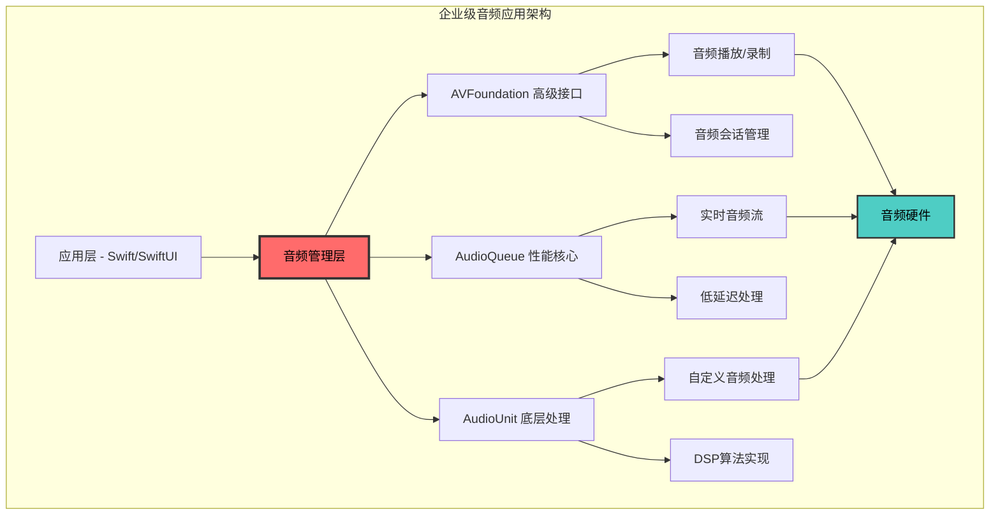

# 1.4 音频框架集成与互操作性

## 概述

在复杂的iOS音频应用开发中，单一框架往往无法满足所有需求。企业级音频应用通常需要结合AVFoundation的易用性、AudioQueue的性能控制能力，以及AudioUnit的极致灵活性。本文档深入探讨如何在同一应用中优雅地集成这三个框架，实现性能最优化的音频处理架构。

### 技术价值定位

**框架集成的核心挑战**：
- **数据流同步**：不同框架间的音频数据传递和时序同步
- **性能优化**：避免不必要的格式转换和内存拷贝
- **状态管理**：统一管理多个框架的生命周期和状态
- **错误处理**：建立跨框架的错误传播和恢复机制

### 集成架构模式



## AVFoundation + AudioQueue 混合架构

### 1. 高级音频引擎设计

**混合架构的核心设计思想**：
- AVFoundation负责高级音频管理和会话控制
- AudioQueue负责实时音频数据流处理
- 统一的音频数据格式和缓冲区管理

```swift
// 企业级混合音频引擎
class HybridAudioEngine {
    // AVFoundation 组件
    private let audioSession = AVAudioSession.sharedInstance()
    private let audioEngine = AVAudioEngine()
    
    // AudioQueue 组件
    private var inputQueue: AudioQueueRef?
    private var outputQueue: AudioQueueRef?
    private var audioBuffers: [AudioQueueBufferRef] = []
    
    // 共享音频格式
    private let sharedFormat = AudioStreamBasicDescription(
        mSampleRate: 44100.0,
        mFormatID: kAudioFormatLinearPCM,
        mFormatFlags: kAudioFormatFlagIsFloat | kAudioFormatFlagIsPacked,
        mBytesPerPacket: 8,
        mFramesPerPacket: 1,
        mBytesPerFrame: 8,
        mChannelsPerFrame: 2,
        mBitsPerChannel: 32,
        mReserved: 0
    )
    
    // 性能监控
    private var performanceMonitor = AudioPerformanceMonitor()
    
    // 数据桥接器
    private var dataBridge = AudioDataBridge()
    
    func initialize() throws {
        try setupAudioSession()
        try setupAVAudioEngine()
        try setupAudioQueues()
        try establishDataBridge()
    }
    
    // MARK: - AVFoundation 配置
    private func setupAudioSession() throws {
        try audioSession.setCategory(.playAndRecord, 
                                   mode: .measurement, 
                                   options: [.defaultToSpeaker, .allowBluetooth])
        try audioSession.setPreferredSampleRate(44100.0)
        try audioSession.setPreferredIOBufferDuration(0.005) // 5ms低延迟
        try audioSession.setActive(true)
    }
    
    private func setupAVAudioEngine() throws {
        let inputNode = audioEngine.inputNode
        let outputNode = audioEngine.outputNode
        
        // 安装tap以桥接到AudioQueue
        let bufferSize: AVAudioFrameCount = 512
        inputNode.installTap(onBus: 0, bufferSize: bufferSize, format: nil) { 
            [weak self] buffer, time in
            self?.bridgeAVAudioToQueue(buffer: buffer, time: time)
        }
        
        try audioEngine.start()
    }
    
    // MARK: - AudioQueue 配置
    private func setupAudioQueues() throws {
        // 创建输入队列
        let inputCallback: AudioQueueInputCallback = { userData, queue, buffer, timestamp, numPackets, packetDesc in
            let engine = Unmanaged<HybridAudioEngine>.fromOpaque(userData!).takeUnretainedValue()
            engine.handleAudioInput(buffer: buffer, timestamp: timestamp, numPackets: numPackets)
        }
        
        let result = AudioQueueNewInput(&sharedFormat, inputCallback, 
                                      Unmanaged.passUnretained(self).toOpaque(),
                                      nil, nil, 0, &inputQueue)
        
        guard result == noErr else {
            throw AudioError.queueCreationFailed(result)
        }
        
        // 分配和入队缓冲区
        try allocateAndEnqueueBuffers()
    }
    
    // MARK: - 数据桥接
    private func establishDataBridge() throws {
        dataBridge.onDataReceived = { [weak self] audioData in
            self?.processAudioData(audioData)
        }
        
        dataBridge.onDataSent = { [weak self] audioData in
            self?.deliverAudioData(audioData)
        }
    }
    
    // AVFoundation到AudioQueue的数据桥接
    private func bridgeAVAudioToQueue(buffer: AVAudioPCMBuffer, time: AVAudioTime) {
        let audioData = AudioDataPacket(
            buffer: buffer,
            timestamp: time,
            format: sharedFormat
        )
        
        dataBridge.sendData(audioData)
    }
    
    // AudioQueue输入处理
    private func handleAudioInput(buffer: AudioQueueBufferRef, 
                                timestamp: UnsafePointer<AudioTimeStamp>, 
                                numPackets: UInt32) {
        let audioData = AudioDataPacket(
            queueBuffer: buffer,
            timestamp: timestamp,
            numPackets: numPackets
        )
        
        dataBridge.receiveData(audioData)
        
        // 重新入队缓冲区
        AudioQueueEnqueueBuffer(inputQueue!, buffer, 0, nil)
    }
}
```

### 2. 统一音频数据格式管理

```swift
// 音频数据包抽象
struct AudioDataPacket {
    let sampleRate: Double
    let channels: UInt32
    let format: AudioStreamBasicDescription
    let data: UnsafeMutableRawPointer
    let dataSize: UInt32
    let timestamp: AudioTimeStamp
    let frameCount: UInt32
    
    // 从AVAudioPCMBuffer创建
    init(buffer: AVAudioPCMBuffer, timestamp: AVAudioTime, format: AudioStreamBasicDescription) {
        self.sampleRate = buffer.format.sampleRate
        self.channels = buffer.format.channelCount
        self.format = format
        self.data = buffer.audioBufferList.pointee.mBuffers.mData!
        self.dataSize = buffer.audioBufferList.pointee.mBuffers.mDataByteSize
        self.timestamp = timestamp.audioTimeStamp
        self.frameCount = buffer.frameLength
    }
    
    // 从AudioQueue缓冲区创建
    init(queueBuffer: AudioQueueBufferRef, timestamp: UnsafePointer<AudioTimeStamp>, numPackets: UInt32) {
        self.sampleRate = 44100.0 // 从sharedFormat获取
        self.channels = 2
        self.format = AudioStreamBasicDescription() // 从sharedFormat获取
        self.data = queueBuffer.pointee.mAudioData
        self.dataSize = queueBuffer.pointee.mAudioDataByteSize
        self.timestamp = timestamp.pointee
        self.frameCount = numPackets
    }
    
    // 格式转换
    func convertToFormat(_ targetFormat: AudioStreamBasicDescription) -> AudioDataPacket? {
        // 实现格式转换逻辑
        return nil
    }
    
    // 零拷贝数据访问
    func withUnsafeBytes<T>(_ body: (UnsafeRawBufferPointer) throws -> T) rethrows -> T {
        return try body(UnsafeRawBufferPointer(start: data, count: Int(dataSize)))
    }
}

// 音频数据桥接器
class AudioDataBridge {
    var onDataReceived: ((AudioDataPacket) -> Void)?
    var onDataSent: ((AudioDataPacket) -> Void)?
    
    private let processingQueue = DispatchQueue(label: "audio.bridge", qos: .userInteractive)
    private var dataBuffer = CircularBuffer<AudioDataPacket>(capacity: 64)
    
    func sendData(_ packet: AudioDataPacket) {
        processingQueue.async {
            self.dataBuffer.append(packet)
            self.onDataSent?(packet)
        }
    }
    
    func receiveData(_ packet: AudioDataPacket) {
        processingQueue.async {
            self.onDataReceived?(packet)
        }
    }
}
```

## AudioQueue + AudioUnit 深度集成

### 1. 自定义AudioUnit集成

```objc
// 自定义AudioUnit在AudioQueue中的集成
typedef struct {
    AudioQueueRef           queue;
    AudioUnit               processingUnit;
    AudioStreamBasicDescription format;
    AudioQueueBufferRef     *buffers;
    UInt32                  bufferCount;
    
    // 处理链
    AudioUnitGraph          graph;
    AUNode                  inputNode;
    AUNode                  effectNode;
    AUNode                  outputNode;
    
    // 性能监控
    uint64_t                totalProcessedSamples;
    CFAbsoluteTime          lastProcessingTime;
    
} AudioQueueUnitIntegration;

// 初始化集成系统
OSStatus InitializeAudioQueueUnitIntegration(AudioQueueUnitIntegration *integration) {
    OSStatus result = noErr;
    
    // 1. 创建AudioUnit图
    result = NewAUGraph(&integration->graph);
    if (result != noErr) return result;
    
    // 2. 添加节点
    AudioComponentDescription inputDesc = {
        .componentType = kAudioUnitType_Output,
        .componentSubType = kAudioUnitSubType_RemoteIO,
        .componentManufacturer = kAudioUnitManufacturer_Apple
    };
    
    result = AUGraphAddNode(integration->graph, &inputDesc, &integration->inputNode);
    if (result != noErr) return result;
    
    AudioComponentDescription effectDesc = {
        .componentType = kAudioUnitType_Effect,
        .componentSubType = kAudioUnitSubType_Delay,
        .componentManufacturer = kAudioUnitManufacturer_Apple
    };
    
    result = AUGraphAddNode(integration->graph, &effectDesc, &integration->effectNode);
    if (result != noErr) return result;
    
    // 3. 连接节点
    result = AUGraphConnectNodeInput(integration->graph, 
                                   integration->inputNode, 0,
                                   integration->effectNode, 0);
    if (result != noErr) return result;
    
    // 4. 初始化图
    result = AUGraphInitialize(integration->graph);
    if (result != noErr) return result;
    
    // 5. 创建AudioQueue
    result = AudioQueueNewOutput(&integration->format,
                                AudioQueueUnitCallback,
                                integration,
                                NULL, NULL, 0,
                                &integration->queue);
    if (result != noErr) return result;
    
    // 6. 分配缓冲区
    for (UInt32 i = 0; i < integration->bufferCount; i++) {
        result = AudioQueueAllocateBuffer(integration->queue, 
                                        4096,
                                        &integration->buffers[i]);
        if (result != noErr) return result;
    }
    
    return noErr;
}

// AudioQueue回调中处理AudioUnit
void AudioQueueUnitCallback(void *userData,
                           AudioQueueRef queue,
                           AudioQueueBufferRef buffer) {
    AudioQueueUnitIntegration *integration = (AudioQueueUnitIntegration *)userData;
    
    // 准备AudioUnit渲染参数
    AudioUnitRenderActionFlags actionFlags = 0;
    AudioTimeStamp timeStamp;
    memset(&timeStamp, 0, sizeof(timeStamp));
    timeStamp.mFlags = kAudioTimeStampSampleTimeValid;
    timeStamp.mSampleTime = 0;
    
    UInt32 frameCount = buffer->mAudioDataBytesCapacity / integration->format.mBytesPerFrame;
    
    // 创建AudioBufferList
    AudioBufferList bufferList;
    bufferList.mNumberBuffers = 1;
    bufferList.mBuffers[0].mNumberChannels = integration->format.mChannelsPerFrame;
    bufferList.mBuffers[0].mDataByteSize = buffer->mAudioDataBytesCapacity;
    bufferList.mBuffers[0].mData = buffer->mAudioData;
    
    // 渲染AudioUnit
    OSStatus result = AudioUnitRender(integration->processingUnit,
                                     &actionFlags,
                                     &timeStamp,
                                     0,
                                     frameCount,
                                     &bufferList);
    
    if (result == noErr) {
        buffer->mAudioDataByteSize = bufferList.mBuffers[0].mDataByteSize;
        integration->totalProcessedSamples += frameCount;
        
        // 入队处理后的缓冲区
        AudioQueueEnqueueBuffer(queue, buffer, 0, NULL);
    }
}
```

### 2. 实时参数控制系统

```swift
// 实时参数控制器
class RealtimeParameterController {
    private var audioUnits: [AudioUnit] = []
    private var parameterMaps: [AudioUnitParameterID: AudioUnitParameterValue] = [:]
    private let parameterQueue = DispatchQueue(label: "audio.parameters", qos: .userInteractive)
    
    // 参数动画系统
    private var parameterAnimations: [AudioUnitParameterID: ParameterAnimation] = [:]
    private var animationTimer: CADisplayLink?
    
    func addAudioUnit(_ audioUnit: AudioUnit) {
        audioUnits.append(audioUnit)
    }
    
    func setParameter(_ parameterID: AudioUnitParameterID, 
                     value: AudioUnitParameterValue,
                     rampDuration: TimeInterval = 0.0) {
        
        parameterQueue.async {
            self.parameterMaps[parameterID] = value
            
            for audioUnit in self.audioUnits {
                if rampDuration > 0 {
                    // 使用参数斜坡
                    self.rampParameter(audioUnit, parameterID: parameterID, 
                                     targetValue: value, duration: rampDuration)
                } else {
                    // 立即设置
                    AudioUnitSetParameter(audioUnit, parameterID, 
                                        kAudioUnitScope_Global, 0, value, 0)
                }
            }
        }
    }
    
    private func rampParameter(_ audioUnit: AudioUnit,
                              parameterID: AudioUnitParameterID,
                              targetValue: AudioUnitParameterValue,
                              duration: TimeInterval) {
        
        // 获取当前值
        var currentValue: AudioUnitParameterValue = 0
        AudioUnitGetParameter(audioUnit, parameterID, kAudioUnitScope_Global, 0, &currentValue)
        
        // 创建参数动画
        let animation = ParameterAnimation(
            startValue: currentValue,
            endValue: targetValue,
            duration: duration,
            curve: .linear
        )
        
        parameterAnimations[parameterID] = animation
        
        if animationTimer == nil {
            startParameterAnimation()
        }
    }
    
    private func startParameterAnimation() {
        animationTimer = CADisplayLink(target: self, selector: #selector(updateParameterAnimations))
        animationTimer?.add(to: .main, forMode: .common)
    }
    
    @objc private func updateParameterAnimations() {
        let currentTime = CACurrentMediaTime()
        var activeAnimations: [AudioUnitParameterID: ParameterAnimation] = [:]
        
        for (parameterID, animation) in parameterAnimations {
            if let currentValue = animation.valueAt(time: currentTime) {
                for audioUnit in audioUnits {
                    AudioUnitSetParameter(audioUnit, parameterID, 
                                        kAudioUnitScope_Global, 0, currentValue, 0)
                }
                activeAnimations[parameterID] = animation
            }
        }
        
        parameterAnimations = activeAnimations
        
        if parameterAnimations.isEmpty {
            animationTimer?.invalidate()
            animationTimer = nil
        }
    }
}

// 参数动画类
class ParameterAnimation {
    let startValue: AudioUnitParameterValue
    let endValue: AudioUnitParameterValue
    let duration: TimeInterval
    let curve: AnimationCurve
    let startTime: TimeInterval
    
    enum AnimationCurve {
        case linear
        case easeIn
        case easeOut
        case easeInOut
    }
    
    init(startValue: AudioUnitParameterValue, 
         endValue: AudioUnitParameterValue, 
         duration: TimeInterval, 
         curve: AnimationCurve) {
        self.startValue = startValue
        self.endValue = endValue
        self.duration = duration
        self.curve = curve
        self.startTime = CACurrentMediaTime()
    }
    
    func valueAt(time: TimeInterval) -> AudioUnitParameterValue? {
        let elapsed = time - startTime
        
        if elapsed >= duration {
            return nil // 动画结束
        }
        
        let progress = elapsed / duration
        let adjustedProgress = applyAnimationCurve(progress)
        
        return startValue + (endValue - startValue) * Float(adjustedProgress)
    }
    
    private func applyAnimationCurve(_ progress: Double) -> Double {
        switch curve {
        case .linear:
            return progress
        case .easeIn:
            return progress * progress
        case .easeOut:
            return 1 - (1 - progress) * (1 - progress)
        case .easeInOut:
            return progress < 0.5 ? 2 * progress * progress : 1 - 2 * (1 - progress) * (1 - progress)
        }
    }
}
```

## 三层架构混合使用

### 1. 企业级分层架构

```swift
// 音频引擎管理器 - 最高层抽象
class AudioEngineManager {
    // 三层架构组件
    private let avFoundationLayer: AVFoundationLayer
    private let audioQueueLayer: AudioQueueLayer
    private let audioUnitLayer: AudioUnitLayer
    
    // 统一接口
    private let audioInterface: UnifiedAudioInterface
    
    // 性能监控
    private let performanceMonitor: SystemPerformanceMonitor
    
    // 配置管理
    private let configurationManager: AudioConfigurationManager
    
    init() {
        self.avFoundationLayer = AVFoundationLayer()
        self.audioQueueLayer = AudioQueueLayer()
        self.audioUnitLayer = AudioUnitLayer()
        self.audioInterface = UnifiedAudioInterface()
        self.performanceMonitor = SystemPerformanceMonitor()
        self.configurationManager = AudioConfigurationManager()
        
        setupLayerIntegration()
    }
    
    private func setupLayerIntegration() {
        // 配置层间通信
        avFoundationLayer.delegate = self
        audioQueueLayer.delegate = self
        audioUnitLayer.delegate = self
        
        // 建立数据流连接
        setupDataFlow()
        
        // 启动性能监控
        performanceMonitor.startMonitoring()
    }
    
    private func setupDataFlow() {
        // AVFoundation -> AudioQueue 数据流
        avFoundationLayer.onAudioDataAvailable = { [weak self] audioData in
            self?.audioQueueLayer.processAudioData(audioData)
        }
        
        // AudioQueue -> AudioUnit 数据流
        audioQueueLayer.onProcessedDataAvailable = { [weak self] processedData in
            self?.audioUnitLayer.applyEffects(processedData)
        }
        
        // AudioUnit -> 输出 数据流
        audioUnitLayer.onEffectProcessingComplete = { [weak self] finalData in
            self?.audioInterface.outputAudioData(finalData)
        }
    }
}

// 统一音频接口
class UnifiedAudioInterface {
    private let outputManager = AudioOutputManager()
    private let formatConverter = AudioFormatConverter()
    
    func outputAudioData(_ audioData: AudioDataPacket) {
        // 统一输出处理
        let convertedData = formatConverter.convertToOptimalFormat(audioData)
        outputManager.output(convertedData)
    }
    
    func configureOutput(for scenario: AudioScenario) {
        outputManager.configure(for: scenario)
    }
}
```

### 2. 高级数据流优化

```swift
// 零拷贝数据传递系统
class ZeroCopyAudioDataPipeline {
    private let sharedMemoryPool: AudioMemoryPool
    private let dataDescriptors: [AudioDataDescriptor]
    private let processingChain: AudioProcessingChain
    
    init(memorySize: Int, bufferCount: Int) {
        self.sharedMemoryPool = AudioMemoryPool(size: memorySize)
        self.dataDescriptors = (0..<bufferCount).map { _ in AudioDataDescriptor() }
        self.processingChain = AudioProcessingChain()
    }
    
    func processAudioData(_ inputData: AudioDataPacket) -> AudioDataPacket {
        // 获取共享内存缓冲区
        guard let sharedBuffer = sharedMemoryPool.getBuffer() else {
            return inputData // 降级处理
        }
        
        // 创建数据描述符
        let descriptor = AudioDataDescriptor(
            buffer: sharedBuffer,
            format: inputData.format,
            frameCount: inputData.frameCount
        )
        
        // 零拷贝数据传递
        memcpy(sharedBuffer.data, inputData.data, Int(inputData.dataSize))
        
        // 处理链处理
        processingChain.process(descriptor)
        
        // 返回处理后的数据包
        return AudioDataPacket(descriptor: descriptor)
    }
}

// 音频内存池
class AudioMemoryPool {
    private let memoryRegion: UnsafeMutableRawPointer
    private let regionSize: Int
    private let bufferSize: Int
    private let bufferCount: Int
    
    private var availableBuffers: [AudioBuffer]
    private var usedBuffers: Set<AudioBuffer>
    private let accessQueue = DispatchQueue(label: "audio.memorypool", qos: .userInteractive)
    
    init(size: Int) {
        self.regionSize = size
        self.bufferSize = size / 32  // 32个缓冲区
        self.bufferCount = 32
        
        // 分配大块连续内存
        self.memoryRegion = UnsafeMutableRawPointer.allocate(byteCount: size, alignment: 64)
        
        // 初始化缓冲区
        self.availableBuffers = []
        self.usedBuffers = Set<AudioBuffer>()
        
        for i in 0..<bufferCount {
            let buffer = AudioBuffer(
                data: memoryRegion.advanced(by: i * bufferSize),
                size: bufferSize,
                id: i
            )
            availableBuffers.append(buffer)
        }
    }
    
    func getBuffer() -> AudioBuffer? {
        return accessQueue.sync {
            guard !availableBuffers.isEmpty else { return nil }
            let buffer = availableBuffers.removeFirst()
            usedBuffers.insert(buffer)
            return buffer
        }
    }
    
    func returnBuffer(_ buffer: AudioBuffer) {
        accessQueue.async {
            self.usedBuffers.remove(buffer)
            self.availableBuffers.append(buffer)
        }
    }
    
    deinit {
        memoryRegion.deallocate()
    }
}
```

## 性能优化与最佳实践

### 1. 系统级性能监控

```swift
// 系统性能监控器
class SystemPerformanceMonitor {
    private let monitoringQueue = DispatchQueue(label: "audio.monitoring", qos: .background)
    private var isMonitoring = false
    
    // 性能指标
    private var metrics = AudioPerformanceMetrics()
    
    func startMonitoring() {
        guard !isMonitoring else { return }
        isMonitoring = true
        
        monitoringQueue.async {
            self.monitoringLoop()
        }
    }
    
    private func monitoringLoop() {
        while isMonitoring {
            updateMetrics()
            analyzePerformance()
            Thread.sleep(forTimeInterval: 0.1) // 100ms间隔
        }
    }
    
    private func updateMetrics() {
        metrics.cpuUsage = getCurrentCPUUsage()
        metrics.memoryUsage = getCurrentMemoryUsage()
        metrics.audioLatency = getCurrentAudioLatency()
        metrics.bufferUnderruns = getBufferUnderrunCount()
    }
    
    private func analyzePerformance() {
        // 检测性能问题
        if metrics.cpuUsage > 0.8 {
            handleHighCPUUsage()
        }
        
        if metrics.memoryUsage > 0.9 {
            handleHighMemoryUsage()
        }
        
        if metrics.audioLatency > 0.02 { // 20ms阈值
            handleHighLatency()
        }
    }
    
    private func handleHighCPUUsage() {
        // 降低音频质量
        NotificationCenter.default.post(name: .audioPerformanceWarning, 
                                      object: AudioPerformanceWarning.highCPU)
    }
    
    private func handleHighMemoryUsage() {
        // 清理音频缓存
        NotificationCenter.default.post(name: .audioPerformanceWarning, 
                                      object: AudioPerformanceWarning.highMemory)
    }
    
    private func handleHighLatency() {
        // 优化音频链路
        NotificationCenter.default.post(name: .audioPerformanceWarning, 
                                      object: AudioPerformanceWarning.highLatency)
    }
}

// 性能指标结构
struct AudioPerformanceMetrics {
    var cpuUsage: Float = 0.0
    var memoryUsage: Float = 0.0
    var audioLatency: TimeInterval = 0.0
    var bufferUnderruns: Int = 0
    var frameDrops: Int = 0
    var processingTime: TimeInterval = 0.0
}

// 性能警告类型
enum AudioPerformanceWarning {
    case highCPU
    case highMemory
    case highLatency
    case bufferUnderrun
    case frameDrops
}

extension Notification.Name {
    static let audioPerformanceWarning = Notification.Name("audioPerformanceWarning")
}
```

### 2. 智能资源管理

```swift
// 智能资源管理器
class IntelligentResourceManager {
    private let resourcePool = AudioResourcePool()
    private let allocationStrategy = DynamicAllocationStrategy()
    private let performanceAnalyzer = PerformanceAnalyzer()
    
    func allocateResourcesForScenario(_ scenario: AudioScenario) -> AudioResourceBundle {
        let requirements = calculateResourceRequirements(scenario)
        let availableResources = resourcePool.getAvailableResources()
        
        let allocation = allocationStrategy.allocate(
            requirements: requirements,
            available: availableResources,
            performance: performanceAnalyzer.currentMetrics
        )
        
        return AudioResourceBundle(allocation: allocation)
    }
    
    private func calculateResourceRequirements(_ scenario: AudioScenario) -> ResourceRequirements {
        switch scenario {
        case .musicPlayback:
            return ResourceRequirements(
                cpuIntensity: .low,
                memoryRequirement: .medium,
                latencyRequirement: .relaxed,
                qualityRequirement: .high
            )
        case .realtimeProcessing:
            return ResourceRequirements(
                cpuIntensity: .high,
                memoryRequirement: .high,
                latencyRequirement: .strict,
                qualityRequirement: .medium
            )
        case .backgroundRecording:
            return ResourceRequirements(
                cpuIntensity: .low,
                memoryRequirement: .low,
                latencyRequirement: .relaxed,
                qualityRequirement: .medium
            )
        }
    }
}
```

## 总结

本文档详细介绍了iOS音频框架的集成与互操作性，重点包括：

1. **AVFoundation + AudioQueue 混合架构**：实现高级管理与性能控制的完美结合
2. **AudioQueue + AudioUnit 深度集成**：提供最大灵活性和控制能力
3. **三层架构混合使用**：构建企业级音频应用的完整解决方案
4. **性能优化与最佳实践**：确保系统稳定性和最优性能

通过这些技术的综合应用，开发者可以构建出既强大又高效的音频应用，满足各种复杂的业务需求。 