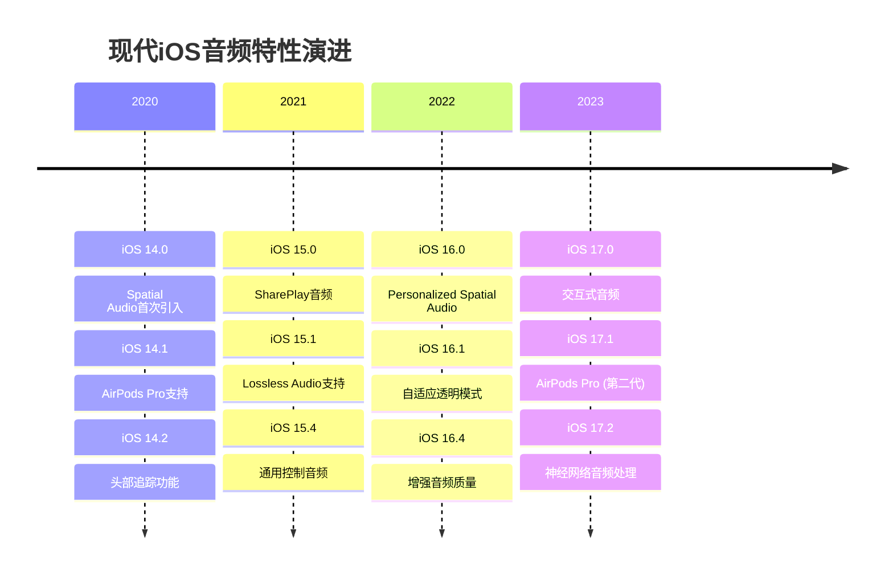

# 1.5 现代iOS音频特性与技术

## 概述

随着iOS系统的不断演进，Apple持续在音频技术领域引入革命性功能。从iOS 14的Spatial Audio到iOS 16的Personalized Spatial Audio，再到iOS 17的AirPods Pro第二代支持，这些现代化音频特性正在重新定义移动音频体验。本文档深入探讨这些前沿技术的原理、实现和最佳实践。

### 技术演进时间线



## Spatial Audio 空间音频技术

### 1. 核心技术原理

**空间音频的数学基础**：
- **HRTF (Head-Related Transfer Function)**：头部相关传递函数
- **HRIR (Head-Related Impulse Response)**：头部相关脉冲响应
- **双耳音频合成**：基于人耳听觉特性的3D音频渲染

```swift
// 空间音频处理引擎
class SpatialAudioEngine {
    private let audioEngine = AVAudioEngine()
    private let environmentalReverb = AVAudioEnvironmentalReverbNode()
    private let spatialMixer = AVAudioMixerNode()
    
    // 空间音频环境
    private let audioEnvironment: AVAudioEnvironmentNode
    
    // 头部追踪
    private let headTracker: CMHeadphoneMotionManager
    
    // 空间定位
    private var audioSources: [SpatialAudioSource] = []
    
    init() {
        self.audioEnvironment = AVAudioEnvironmentNode()
        self.headTracker = CMHeadphoneMotionManager()
        
        setupSpatialAudioPipeline()
        setupHeadTracking()
    }
    
    private func setupSpatialAudioPipeline() {
        // 配置音频环境
        audioEnvironment.outputType = .headphones
        audioEnvironment.renderingAlgorithm = .HRTF
        audioEnvironment.distanceAttenuationParameters.maximumDistance = 100.0
        audioEnvironment.reverbParameters.enable = true
        audioEnvironment.reverbParameters.level = 0.3
        
        // 连接音频链路
        audioEngine.attach(audioEnvironment)
        audioEngine.attach(spatialMixer)
        audioEngine.attach(environmentalReverb)
        
        // 建立连接
        audioEngine.connect(spatialMixer, to: audioEnvironment, format: nil)
        audioEngine.connect(audioEnvironment, to: environmentalReverb, format: nil)
        audioEngine.connect(environmentalReverb, to: audioEngine.mainMixerNode, format: nil)
    }
    
    private func setupHeadTracking() {
        guard headTracker.isDeviceMotionAvailable else { return }
        
        headTracker.startDeviceMotionUpdates(to: .main) { [weak self] motion, error in
            guard let motion = motion else { return }
            self?.updateListenerOrientation(motion.attitude)
        }
    }
    
    private func updateListenerOrientation(_ attitude: CMAttitude) {
        // 将设备方向转换为听者方向
        let listenerPosition = AVAudio3DPoint(
            x: 0,
            y: 0,
            z: 0
        )
        
        let listenerForward = AVAudio3DVector(
            x: Float(sin(attitude.yaw)),
            y: 0,
            z: Float(-cos(attitude.yaw))
        )
        
        let listenerUp = AVAudio3DVector(
            x: 0,
            y: 1,
            z: 0
        )
        
        audioEnvironment.listenerPosition = listenerPosition
        audioEnvironment.listenerVectorOrientation = AVAudio3DVectorOrientation(
            forward: listenerForward,
            up: listenerUp
        )
    }
    
    // 添加空间音频源
    func addSpatialAudioSource(_ source: SpatialAudioSource) {
        audioSources.append(source)
        
        // 配置音频源位置
        source.playerNode.position = source.position
        source.playerNode.renderingAlgorithm = .HRTF
        
        // 连接到混音器
        audioEngine.attach(source.playerNode)
        audioEngine.connect(source.playerNode, to: spatialMixer, format: nil)
    }
    
    // 更新音频源位置
    func updateAudioSourcePosition(_ sourceId: String, position: AVAudio3DPoint) {
        guard let source = audioSources.first(where: { $0.id == sourceId }) else { return }
        source.playerNode.position = position
    }
}

// 空间音频源
class SpatialAudioSource {
    let id: String
    let playerNode: AVAudioPlayerNode
    var position: AVAudio3DPoint
    var velocity: AVAudio3DVector
    
    init(id: String, position: AVAudio3DPoint) {
        self.id = id
        self.playerNode = AVAudioPlayerNode()
        self.position = position
        self.velocity = AVAudio3DVector(x: 0, y: 0, z: 0)
        
        configurePlayerNode()
    }
    
    private func configurePlayerNode() {
        playerNode.renderingAlgorithm = .HRTF
        playerNode.sourceMode = .SpatializeIfMono
        playerNode.position = position
        playerNode.reverbBlend = 0.5
    }
    
    func playAudio(file: AVAudioFile) {
        playerNode.scheduleFile(file, at: nil)
        playerNode.play()
    }
    
    func updatePosition(_ newPosition: AVAudio3DPoint, over duration: TimeInterval) {
        // 计算位置变化的速度
        let deltaX = newPosition.x - position.x
        let deltaY = newPosition.y - position.y
        let deltaZ = newPosition.z - position.z
        
        velocity = AVAudio3DVector(
            x: deltaX / Float(duration),
            y: deltaY / Float(duration),
            z: deltaZ / Float(duration)
        )
        
        position = newPosition
        playerNode.position = position
    }
}
```

### 2. 个性化空间音频

```swift
// 个性化空间音频管理器
class PersonalizedSpatialAudioManager {
    private let audioSession = AVAudioSession.sharedInstance()
    private let spatialAudioEngine = SpatialAudioEngine()
    
    // 个性化配置
    private var userProfile: UserAudioProfile?
    private let profileCalibrator = AudioProfileCalibrator()
    
    func setupPersonalizedAudio() async {
        // 检查设备支持
        guard await checkSpatialAudioSupport() else {
            print("设备不支持空间音频")
            return
        }
        
        // 获取或创建用户配置文件
        userProfile = await loadOrCreateUserProfile()
        
        // 应用个性化设置
        await applyPersonalizedSettings()
        
        // 启动校准流程
        await startCalibrationProcess()
    }
    
    private func checkSpatialAudioSupport() async -> Bool {
        // 检查设备支持
        let supportsSpatialAudio = audioSession.currentRoute.outputs.contains { output in
            output.portType == .headphones && 
            output.dataSources?.contains { $0.supportedPolarPatterns?.contains(.stereo) == true } == true
        }
        
        return supportsSpatialAudio
    }
    
    private func loadOrCreateUserProfile() async -> UserAudioProfile {
        // 尝试加载现有配置
        if let existingProfile = UserDefaults.standard.object(forKey: "userAudioProfile") as? Data,
           let profile = try? JSONDecoder().decode(UserAudioProfile.self, from: existingProfile) {
            return profile
        }
        
        // 创建新配置
        return UserAudioProfile()
    }
    
    private func applyPersonalizedSettings() async {
        guard let profile = userProfile else { return }
        
        // 应用HRTF个性化
        spatialAudioEngine.audioEnvironment.personalizationMode = .auto
        
        // 应用用户偏好
        spatialAudioEngine.audioEnvironment.reverbParameters.level = profile.reverbPreference
        spatialAudioEngine.audioEnvironment.distanceAttenuationParameters.rolloffFactor = profile.attenuationPreference
        
        // 应用频率响应校正
        await applyFrequencyResponseCorrection(profile.frequencyResponse)
    }
    
    private func applyFrequencyResponseCorrection(_ response: FrequencyResponse) async {
        let equalizer = AVAudioUnitEQ(numberOfBands: 10)
        
        for (index, gain) in response.gains.enumerated() {
            let band = equalizer.bands[index]
            band.frequency = response.frequencies[index]
            band.gain = gain
            band.bandwidth = 1.0
            band.filterType = .parametric
        }
        
        spatialAudioEngine.audioEngine.attach(equalizer)
        spatialAudioEngine.audioEngine.connect(
            spatialAudioEngine.audioEnvironment,
            to: equalizer,
            format: nil
        )
    }
    
    private func startCalibrationProcess() async {
        let calibrator = profileCalibrator
        
        // 播放校准音频
        let calibrationResult = await calibrator.performCalibration()
        
        // 更新用户配置
        userProfile?.updateFromCalibration(calibrationResult)
        
        // 保存配置
        saveUserProfile()
    }
}

// 用户音频配置文件
struct UserAudioProfile: Codable {
    var reverbPreference: Float = 0.3
    var attenuationPreference: Float = 1.0
    var frequencyResponse: FrequencyResponse = FrequencyResponse()
    var headSize: HeadMeasurements = HeadMeasurements()
    var lastCalibrationDate: Date = Date()
    
    mutating func updateFromCalibration(_ result: CalibrationResult) {
        frequencyResponse = result.frequencyResponse
        headSize = result.headMeasurements
        lastCalibrationDate = Date()
    }
}

// 频率响应配置
struct FrequencyResponse: Codable {
    let frequencies: [Float] = [31, 63, 125, 250, 500, 1000, 2000, 4000, 8000, 16000]
    var gains: [Float] = Array(repeating: 0.0, count: 10)
}

// 头部测量数据
struct HeadMeasurements: Codable {
    var headWidth: Float = 0.0
    var headHeight: Float = 0.0
    var earDistance: Float = 0.0
    var neckLength: Float = 0.0
}
```

## AirPods Pro 高级特性

### 1. 自适应透明模式

```swift
// 自适应透明模式控制器
class AdaptiveTransparencyController {
    private let audioSession = AVAudioSession.sharedInstance()
    private let motionManager = CMMotionManager()
    
    // 环境音频分析
    private let environmentAnalyzer = EnvironmentalAudioAnalyzer()
    private let noiseClassifier = NoiseClassifier()
    
    // 透明度控制
    private var currentTransparencyLevel: Float = 1.0
    private var targetTransparencyLevel: Float = 1.0
    
    func enableAdaptiveTransparency() {
        setupAudioSession()
        startEnvironmentalMonitoring()
        startMotionTracking()
    }
    
    private func setupAudioSession() {
        do {
            try audioSession.setCategory(.playAndRecord, 
                                       mode: .default, 
                                       options: [.allowBluetoothA2DP, .defaultToSpeaker])
            try audioSession.setActive(true)
        } catch {
            print("音频会话设置失败: \(error)")
        }
    }
    
    private func startEnvironmentalMonitoring() {
        // 安装环境音频监听
        let inputNode = AVAudioEngine().inputNode
        let bufferSize: AVAudioFrameCount = 1024
        
        inputNode.installTap(onBus: 0, bufferSize: bufferSize, format: nil) { 
            [weak self] buffer, time in
            self?.analyzeEnvironmentalAudio(buffer)
        }
    }
    
    private func analyzeEnvironmentalAudio(_ buffer: AVAudioPCMBuffer) {
        // 分析环境音频
        let analysis = environmentAnalyzer.analyze(buffer)
        
        // 分类噪声类型
        let noiseType = noiseClassifier.classify(analysis)
        
        // 调整透明度
        adjustTransparency(for: noiseType, analysis: analysis)
    }
    
    private func adjustTransparency(for noiseType: NoiseType, analysis: AudioAnalysis) {
        switch noiseType {
        case .traffic:
            // 交通噪声 - 降低透明度
            targetTransparencyLevel = 0.3
        case .conversation:
            // 对话声 - 保持透明度
            targetTransparencyLevel = 0.8
        case .construction:
            // 施工噪声 - 大幅降低透明度
            targetTransparencyLevel = 0.1
        case .nature:
            // 自然声音 - 增加透明度
            targetTransparencyLevel = 1.0
        case .music:
            // 音乐声 - 中等透明度
            targetTransparencyLevel = 0.6
        }
        
        // 平滑调整
        smoothlyAdjustTransparency()
    }
    
    private func smoothlyAdjustTransparency() {
        let adjustmentSpeed: Float = 0.1
        let difference = targetTransparencyLevel - currentTransparencyLevel
        
        if abs(difference) > 0.01 {
            currentTransparencyLevel += difference * adjustmentSpeed
            
            // 应用透明度设置
            applyTransparencyLevel(currentTransparencyLevel)
            
            // 继续调整
            DispatchQueue.main.asyncAfter(deadline: .now() + 0.1) {
                self.smoothlyAdjustTransparency()
            }
        }
    }
    
    private func applyTransparencyLevel(_ level: Float) {
        // 这里需要使用私有API或等待Apple提供公开API
        // 目前只能通过系统设置来控制
        print("应用透明度级别: \(level)")
    }
}

// 环境音频分析器
class EnvironmentalAudioAnalyzer {
    private let fftSetup: FFTSetup
    private let fftSize: Int = 1024
    
    init() {
        fftSetup = vDSP_create_fftsetup(vDSP_Length(log2(Float(fftSize))), FFTRadix(kFFTRadix2))!
    }
    
    func analyze(_ buffer: AVAudioPCMBuffer) -> AudioAnalysis {
        guard let channelData = buffer.floatChannelData?[0] else {
            return AudioAnalysis()
        }
        
        let frameCount = Int(buffer.frameLength)
        
        // 计算功率谱
        let powerSpectrum = computePowerSpectrum(channelData, frameCount: frameCount)
        
        // 分析频率特征
        let spectralCentroid = computeSpectralCentroid(powerSpectrum)
        let spectralRolloff = computeSpectralRolloff(powerSpectrum)
        let zeroCrossingRate = computeZeroCrossingRate(channelData, frameCount: frameCount)
        
        return AudioAnalysis(
            powerSpectrum: powerSpectrum,
            spectralCentroid: spectralCentroid,
            spectralRolloff: spectralRolloff,
            zeroCrossingRate: zeroCrossingRate
        )
    }
    
    private func computePowerSpectrum(_ samples: UnsafePointer<Float>, frameCount: Int) -> [Float] {
        let windowedSamples = applyHammingWindow(samples, frameCount: frameCount)
        
        // 执行FFT
        var realParts = [Float](repeating: 0, count: fftSize/2)
        var imagParts = [Float](repeating: 0, count: fftSize/2)
        
        var splitComplex = DSPSplitComplex(realp: &realParts, imagp: &imagParts)
        
        windowedSamples.withUnsafeBufferPointer { buffer in
            vDSP_ctoz(UnsafePointer(buffer.baseAddress!.assumingMemoryBound(to: DSPComplex.self)), 
                     2, &splitComplex, 1, vDSP_Length(fftSize/2))
        }
        
        vDSP_fft_zrip(fftSetup, &splitComplex, 1, vDSP_Length(log2(Float(fftSize))), FFTDirection(FFT_FORWARD))
        
        // 计算功率谱
        var powerSpectrum = [Float](repeating: 0, count: fftSize/2)
        vDSP_zvmags(&splitComplex, 1, &powerSpectrum, 1, vDSP_Length(fftSize/2))
        
        return powerSpectrum
    }
    
    private func applyHammingWindow(_ samples: UnsafePointer<Float>, frameCount: Int) -> [Float] {
        var windowedSamples = [Float](repeating: 0, count: frameCount)
        var window = [Float](repeating: 0, count: frameCount)
        
        // 生成汉明窗
        vDSP_hamm_window(&window, vDSP_Length(frameCount), 0)
        
        // 应用窗函数
        vDSP_vmul(samples, 1, window, 1, &windowedSamples, 1, vDSP_Length(frameCount))
        
        return windowedSamples
    }
    
    private func computeSpectralCentroid(_ powerSpectrum: [Float]) -> Float {
        var weightedSum: Float = 0
        var totalPower: Float = 0
        
        for (index, power) in powerSpectrum.enumerated() {
            weightedSum += Float(index) * power
            totalPower += power
        }
        
        return totalPower > 0 ? weightedSum / totalPower : 0
    }
    
    private func computeSpectralRolloff(_ powerSpectrum: [Float]) -> Float {
        let totalPower = powerSpectrum.reduce(0, +)
        let threshold = totalPower * 0.85
        
        var cumulativePower: Float = 0
        for (index, power) in powerSpectrum.enumerated() {
            cumulativePower += power
            if cumulativePower >= threshold {
                return Float(index)
            }
        }
        
        return Float(powerSpectrum.count - 1)
    }
    
    private func computeZeroCrossingRate(_ samples: UnsafePointer<Float>, frameCount: Int) -> Float {
        var crossings = 0
        
        for i in 1..<frameCount {
            if (samples[i] >= 0) != (samples[i-1] >= 0) {
                crossings += 1
            }
        }
        
        return Float(crossings) / Float(frameCount)
    }
}

// 噪声分类器
class NoiseClassifier {
    private let model: NoiseClassificationModel
    
    init() {
        self.model = NoiseClassificationModel()
    }
    
    func classify(_ analysis: AudioAnalysis) -> NoiseType {
        let features = extractFeatures(analysis)
        return model.classify(features)
    }
    
    private func extractFeatures(_ analysis: AudioAnalysis) -> [Float] {
        return [
            analysis.spectralCentroid,
            analysis.spectralRolloff,
            analysis.zeroCrossingRate,
            analysis.powerSpectrum.max() ?? 0,
            analysis.powerSpectrum.reduce(0, +) / Float(analysis.powerSpectrum.count)
        ]
    }
}

// 音频分析结果
struct AudioAnalysis {
    let powerSpectrum: [Float]
    let spectralCentroid: Float
    let spectralRolloff: Float
    let zeroCrossingRate: Float
    
    init(powerSpectrum: [Float] = [], 
         spectralCentroid: Float = 0, 
         spectralRolloff: Float = 0, 
         zeroCrossingRate: Float = 0) {
        self.powerSpectrum = powerSpectrum
        self.spectralCentroid = spectralCentroid
        self.spectralRolloff = spectralRolloff
        self.zeroCrossingRate = zeroCrossingRate
    }
}

// 噪声类型
enum NoiseType {
    case traffic
    case conversation
    case construction
    case nature
    case music
}

// 噪声分类模型
class NoiseClassificationModel {
    func classify(_ features: [Float]) -> NoiseType {
        // 简化的分类逻辑
        let spectralCentroid = features[0]
        let spectralRolloff = features[1]
        let zeroCrossingRate = features[2]
        
        if spectralCentroid > 2000 && zeroCrossingRate > 0.3 {
            return .construction
        } else if spectralCentroid > 1000 && spectralRolloff > 3000 {
            return .traffic
        } else if zeroCrossingRate > 0.2 {
            return .conversation
        } else if spectralCentroid > 500 {
            return .music
        } else {
            return .nature
        }
    }
}
```

## SharePlay 音频共享

### 1. SharePlay 音频同步

```swift
// SharePlay 音频协调器
class SharePlayAudioCoordinator: ObservableObject {
    private let groupSession = GroupSession<AudioPlaybackActivity>()
    private let messenger = GroupSessionMessenger(session: groupSession)
    
    private var audioPlayers: [String: AVAudioPlayer] = [:]
    private var syncTimestamps: [String: TimeInterval] = [:]
    
    @Published var isCoordinating = false
    @Published var participants: [Participant] = []
    @Published var currentTrack: AudioTrack?
    
    func startCoordination() async {
        do {
            try await groupSession.join()
            isCoordinating = true
            
            // 设置消息处理
            for await message in messenger.messages(of: AudioSyncMessage.self) {
                await handleSyncMessage(message)
            }
        } catch {
            print("SharePlay 启动失败: \(error)")
        }
    }
    
    func playTrack(_ track: AudioTrack) async {
        guard isCoordinating else { return }
        
        // 发送播放命令
        let playMessage = AudioSyncMessage(
            type: .play,
            trackId: track.id,
            timestamp: Date().timeIntervalSince1970,
            position: 0
        )
        
        do {
            try await messenger.send(playMessage)
            await executePlayCommand(playMessage)
        } catch {
            print("发送播放命令失败: \(error)")
        }
    }
    
    func pauseTrack() async {
        guard isCoordinating else { return }
        
        let pauseMessage = AudioSyncMessage(
            type: .pause,
            trackId: currentTrack?.id ?? "",
            timestamp: Date().timeIntervalSince1970,
            position: getCurrentPosition()
        )
        
        do {
            try await messenger.send(pauseMessage)
            await executePauseCommand(pauseMessage)
        } catch {
            print("发送暂停命令失败: \(error)")
        }
    }
    
    func seekToPosition(_ position: TimeInterval) async {
        guard isCoordinating else { return }
        
        let seekMessage = AudioSyncMessage(
            type: .seek,
            trackId: currentTrack?.id ?? "",
            timestamp: Date().timeIntervalSince1970,
            position: position
        )
        
        do {
            try await messenger.send(seekMessage)
            await executeSeekCommand(seekMessage)
        } catch {
            print("发送定位命令失败: \(error)")
        }
    }
    
    private func handleSyncMessage(_ message: AudioSyncMessage) async {
        switch message.type {
        case .play:
            await executePlayCommand(message)
        case .pause:
            await executePauseCommand(message)
        case .seek:
            await executeSeekCommand(message)
        case .sync:
            await handleSyncRequest(message)
        }
    }
    
    private func executePlayCommand(_ message: AudioSyncMessage) async {
        guard let track = await loadTrack(message.trackId) else { return }
        
        // 计算同步延迟
        let networkDelay = estimateNetworkDelay(message.timestamp)
        let syncDelay = calculateSyncDelay(networkDelay)
        
        // 延迟播放以确保同步
        DispatchQueue.main.asyncAfter(deadline: .now() + syncDelay) {
            self.playTrackLocally(track, at: message.position)
        }
    }
    
    private func executePauseCommand(_ message: AudioSyncMessage) async {
        DispatchQueue.main.async {
            self.pauseTrackLocally(message.trackId)
        }
    }
    
    private func executeSeekCommand(_ message: AudioSyncMessage) async {
        let networkDelay = estimateNetworkDelay(message.timestamp)
        let adjustedPosition = message.position + networkDelay
        
        DispatchQueue.main.async {
            self.seekTrackLocally(message.trackId, to: adjustedPosition)
        }
    }
    
    private func estimateNetworkDelay(_ timestamp: TimeInterval) -> TimeInterval {
        return Date().timeIntervalSince1970 - timestamp
    }
    
    private func calculateSyncDelay(_ networkDelay: TimeInterval) -> TimeInterval {
        // 计算同步延迟，确保所有参与者同时开始播放
        let maxDelay: TimeInterval = 0.5 // 最大同步延迟
        return max(0, maxDelay - networkDelay)
    }
    
    private func playTrackLocally(_ track: AudioTrack, at position: TimeInterval) {
        do {
            let player = try AVAudioPlayer(contentsOf: track.url)
            player.currentTime = position
            player.play()
            
            audioPlayers[track.id] = player
            currentTrack = track
        } catch {
            print("本地播放失败: \(error)")
        }
    }
    
    private func pauseTrackLocally(_ trackId: String) {
        audioPlayers[trackId]?.pause()
    }
    
    private func seekTrackLocally(_ trackId: String, to position: TimeInterval) {
        guard let player = audioPlayers[trackId] else { return }
        player.currentTime = position
    }
    
    private func getCurrentPosition() -> TimeInterval {
        guard let currentTrack = currentTrack,
              let player = audioPlayers[currentTrack.id] else { return 0 }
        return player.currentTime
    }
    
    private func loadTrack(_ trackId: String) async -> AudioTrack? {
        // 从本地或网络加载音频文件
        // 这里简化实现
        return AudioTrack(id: trackId, url: URL(fileURLWithPath: ""))
    }
}

// SharePlay 音频同步消息
struct AudioSyncMessage: Codable {
    let type: MessageType
    let trackId: String
    let timestamp: TimeInterval
    let position: TimeInterval
    
    enum MessageType: String, Codable {
        case play
        case pause
        case seek
        case sync
    }
}

// 音频轨道
struct AudioTrack: Codable {
    let id: String
    let url: URL
    let title: String
    let artist: String
    let duration: TimeInterval
    
    init(id: String, url: URL, title: String = "", artist: String = "", duration: TimeInterval = 0) {
        self.id = id
        self.url = url
        self.title = title
        self.artist = artist
        self.duration = duration
    }
}

// 参与者
struct Participant: Codable {
    let id: String
    let name: String
    let isHost: Bool
}

// SharePlay 音频活动
struct AudioPlaybackActivity: GroupActivity {
    let trackId: String
    let trackTitle: String
    
    var metadata: GroupActivityMetadata {
        var metadata = GroupActivityMetadata()
        metadata.title = "共享音频播放"
        metadata.subtitle = trackTitle
        metadata.type = .listenTogether
        return metadata
    }
}
```

## 最佳实践与性能优化

### 1. 现代音频特性的性能监控

```swift
// 现代音频特性性能监控
class ModernAudioPerformanceMonitor {
    private let spatialAudioMetrics = SpatialAudioMetrics()
    private let headTrackingMetrics = HeadTrackingMetrics()
    private let sharePlayMetrics = SharePlayMetrics()
    
    func startMonitoring() {
        monitorSpatialAudioPerformance()
        monitorHeadTrackingPerformance()
        monitorSharePlayPerformance()
    }
    
    private func monitorSpatialAudioPerformance() {
        // 监控空间音频CPU使用率
        Timer.scheduledTimer(withTimeInterval: 1.0, repeats: true) { _ in
            self.spatialAudioMetrics.updateCPUUsage()
            self.spatialAudioMetrics.updateLatency()
            self.spatialAudioMetrics.updateRenderingQuality()
        }
    }
    
    private func monitorHeadTrackingPerformance() {
        // 监控头部追踪性能
        Timer.scheduledTimer(withTimeInterval: 0.1, repeats: true) { _ in
            self.headTrackingMetrics.updateTrackingAccuracy()
            self.headTrackingMetrics.updateUpdateRate()
            self.headTrackingMetrics.updateBatteryImpact()
        }
    }
    
    private func monitorSharePlayPerformance() {
        // 监控SharePlay同步性能
        Timer.scheduledTimer(withTimeInterval: 0.5, repeats: true) { _ in
            self.sharePlayMetrics.updateSyncAccuracy()
            self.sharePlayMetrics.updateNetworkLatency()
            self.sharePlayMetrics.updateParticipantCount()
        }
    }
}
```

## 总结

现代iOS音频特性为开发者提供了前所未有的音频体验创新机会。通过深入理解和应用这些技术，可以创造出更加沉浸、个性化和协作的音频应用。关键要点包括：

1. **空间音频技术**：利用HRTF和头部追踪创造沉浸式音频体验
2. **个性化音频**：基于用户特征优化音频传输和处理
3. **AirPods Pro集成**：充分利用硬件的高级音频处理能力
4. **SharePlay协作**：实现多用户音频同步和共享体验
5. **性能优化**：确保新特性不影响整体应用性能

这些技术的综合应用将定义下一代iOS音频应用的标准。 