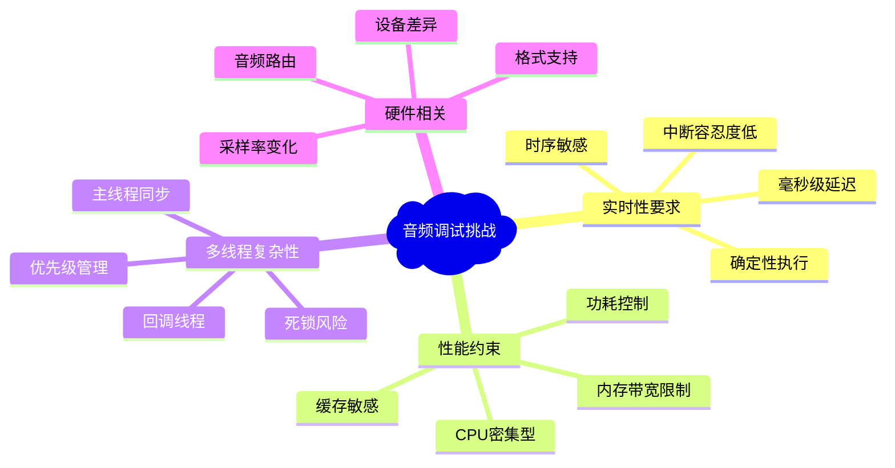

# 1.6 音频调试与性能分析

## 概述

音频应用的调试和性能分析是确保用户体验的关键环节。与普通应用不同，音频应用对实时性、内存管理和CPU使用有极其严格的要求。本文档提供企业级音频调试和性能分析的完整解决方案，涵盖从开发阶段到生产环境的全流程监控。

### 音频调试的特殊挑战



## Instruments 音频性能分析

### 1. Audio Performance 工具深度使用

```swift
// 音频性能分析器
class AudioPerformanceAnalyzer {
    private let signposter = OSSignposter(subsystem: "com.app.audio", category: "performance")
    private let audioLog = OSLog(subsystem: "com.app.audio", category: "audio")
    
    // 性能指标收集
    private var renderingMetrics = RenderingMetrics()
    private var memoryMetrics = MemoryMetrics()
    private var cpuMetrics = CPUMetrics()
    
    func startAnalysis() {
        setupInstrumentsIntegration()
        startMetricsCollection()
        setupPerformanceCallbacks()
    }
    
    private func setupInstrumentsIntegration() {
        // 配置 os_signpost 用于 Instruments 时间线分析
        os_signpost(.begin, log: audioLog, name: "AudioEngine_Initialization")
        
        // 标记关键音频路径
        markAudioRenderingPath()
        markBufferManagement()
        markFormatConversion()
    }
    
    private func markAudioRenderingPath() {
        let spid = signposter.makeSignpostID()
        
        // 在音频渲染回调中使用
        let renderCallback: AURenderCallback = { (inRefCon, ioActionFlags, inTimeStamp, inBusNumber, inNumberFrames, ioData) in
            
            let analyzer = Unmanaged<AudioPerformanceAnalyzer>.fromOpaque(inRefCon!).takeUnretainedValue()
            
            // 开始渲染计时
            analyzer.signposter.emitEvent("AudioRender_Start", id: spid)
            
            let startTime = mach_absolute_time()
            
            // 执行音频处理
            let result = analyzer.processAudioFrame(ioActionFlags, inTimeStamp, inBusNumber, inNumberFrames, ioData)
            
            let endTime = mach_absolute_time()
            let duration = endTime - startTime
            
            // 结束渲染计时
            analyzer.signposter.emitEvent("AudioRender_End", id: spid, "Duration: %{public}llu", duration)
            
            // 收集性能指标
            analyzer.collectRenderingMetrics(duration: duration, frameCount: inNumberFrames)
            
            return result
        }
        
        // 注册回调
        registerRenderCallback(renderCallback, refCon: Unmanaged.passUnretained(self).toOpaque())
    }
    
    func processAudioFrame(_ ioActionFlags: UnsafeMutablePointer<AudioUnitRenderActionFlags>?,
                          _ inTimeStamp: UnsafePointer<AudioTimeStamp>?,
                          _ inBusNumber: UInt32,
                          _ inNumberFrames: UInt32,
                          _ ioData: UnsafeMutablePointer<AudioBufferList>?) -> OSStatus {
        
        // 性能关键路径标记
        os_signpost(.begin, log: audioLog, name: "Frame_Processing", 
                   "Frames: %{public}d", inNumberFrames)
        
        defer {
            os_signpost(.end, log: audioLog, name: "Frame_Processing")
        }
        
        // 检查性能约束
        checkPerformanceConstraints()
        
        // 实际音频处理
        return performAudioProcessing(ioData, frameCount: inNumberFrames)
    }
    
    private func checkPerformanceConstraints() {
        let currentTime = mach_absolute_time()
        
        // 检查是否超过实时约束
        if let lastFrameTime = renderingMetrics.lastFrameTime {
            let interval = currentTime - lastFrameTime
            let intervalNanos = AudioConvertHostTimeToNanos(interval)
            
            // 检查是否超过预期间隔（通常基于采样率）
            let expectedInterval: UInt64 = 10_416_667 // ~10.4ms for 1024 frames at 48kHz
            
            if intervalNanos > expectedInterval * 2 {
                os_log(.error, log: audioLog, "Performance constraint violation: %{public}llu ns", intervalNanos)
                renderingMetrics.constraintViolations += 1
            }
        }
        
        renderingMetrics.lastFrameTime = currentTime
    }
    
    private func collectRenderingMetrics(duration: UInt64, frameCount: UInt32) {
        let durationNanos = AudioConvertHostTimeToNanos(duration)
        
        renderingMetrics.totalFramesProcessed += frameCount
        renderingMetrics.totalProcessingTime += durationNanos
        renderingMetrics.frameCount += 1
        
        // 更新最大/最小处理时间
        if durationNanos > renderingMetrics.maxProcessingTime {
            renderingMetrics.maxProcessingTime = durationNanos
        }
        
        if durationNanos < renderingMetrics.minProcessingTime || renderingMetrics.minProcessingTime == 0 {
            renderingMetrics.minProcessingTime = durationNanos
        }
        
        // 检查处理时间是否超过阈值
        let thresholdNanos: UInt64 = 5_000_000 // 5ms
        if durationNanos > thresholdNanos {
            renderingMetrics.timeoutCount += 1
            os_log(.error, log: audioLog, "Audio processing timeout: %{public}llu ns", durationNanos)
        }
        
        // 定期输出统计信息
        if renderingMetrics.frameCount % 1000 == 0 {
            outputPerformanceStatistics()
        }
    }
    
    private func outputPerformanceStatistics() {
        let avgProcessingTime = renderingMetrics.totalProcessingTime / UInt64(renderingMetrics.frameCount)
        
        os_log(.info, log: audioLog, """
            Audio Performance Statistics:
            Frames Processed: %{public}d
            Avg Processing Time: %{public}llu ns
            Max Processing Time: %{public}llu ns
            Min Processing Time: %{public}llu ns
            Timeouts: %{public}d
            Constraint Violations: %{public}d
            """,
            renderingMetrics.frameCount,
            avgProcessingTime,
            renderingMetrics.maxProcessingTime,
            renderingMetrics.minProcessingTime,
            renderingMetrics.timeoutCount,
            renderingMetrics.constraintViolations
        )
    }
    
    // 虚拟方法，实际实现中需要具体的音频处理逻辑
    private func performAudioProcessing(_ ioData: UnsafeMutablePointer<AudioBufferList>?, frameCount: UInt32) -> OSStatus {
        return noErr
    }
    
    private func registerRenderCallback(_ callback: @escaping AURenderCallback, refCon: UnsafeMutableRawPointer) {
        // 注册音频渲染回调的实现
    }
}

// 渲染性能指标
struct RenderingMetrics {
    var totalFramesProcessed: UInt32 = 0
    var totalProcessingTime: UInt64 = 0
    var frameCount: Int = 0
    var maxProcessingTime: UInt64 = 0
    var minProcessingTime: UInt64 = 0
    var timeoutCount: Int = 0
    var constraintViolations: Int = 0
    var lastFrameTime: UInt64?
}

// 内存性能指标
struct MemoryMetrics {
    var peakMemoryUsage: Int = 0
    var currentMemoryUsage: Int = 0
    var allocationCount: Int = 0
    var deallocationCount: Int = 0
    var leakCount: Int = 0
}

// CPU性能指标
struct CPUMetrics {
    var averageCPUUsage: Float = 0.0
    var peakCPUUsage: Float = 0.0
    var audioThreadCPUUsage: Float = 0.0
    var thermalState: ProcessInfo.ThermalState = .nominal
}
```

### 2. Time Profiler 音频线程分析

```swift
// 音频线程性能分析器
class AudioThreadProfiler {
    private let profilingQueue = DispatchQueue(label: "audio.profiling", qos: .background)
    private var isProfilingActive = false
    
    // 线程监控
    private var threadMetrics: [pthread_t: ThreadMetrics] = [:]
    private let metricsLock = NSLock()
    
    func startProfiling() {
        guard !isProfilingActive else { return }
        isProfilingActive = true
        
        profilingQueue.async {
            self.profilingLoop()
        }
    }
    
    private func profilingLoop() {
        while isProfilingActive {
            collectThreadMetrics()
            analyzeThreadPerformance()
            Thread.sleep(forTimeInterval: 0.1)
        }
    }
    
    private func collectThreadMetrics() {
        var threadList: thread_array_t?
        var threadCount: mach_msg_type_number_t = 0
        
        let kr = task_threads(mach_task_self(), &threadList, &threadCount)
        
        guard kr == KERN_SUCCESS, let threads = threadList else { return }
        
        defer {
            vm_deallocate(mach_task_self(), vm_address_t(bitPattern: threads), vm_size_t(threadCount * UInt32(MemoryLayout<thread_t>.size)))
        }
        
        for i in 0..<Int(threadCount) {
            let thread = threads[i]
            collectSingleThreadMetrics(thread)
        }
    }
    
    private func collectSingleThreadMetrics(_ thread: thread_t) {
        var threadInfo = thread_basic_info()
        var threadInfoCount = mach_msg_type_number_t(THREAD_BASIC_INFO_COUNT)
        
        let kr = withUnsafeMutablePointer(to: &threadInfo) {
            $0.withMemoryRebound(to: integer_t.self, capacity: Int(threadInfoCount)) {
                thread_info(thread, thread_flavor_t(THREAD_BASIC_INFO), $0, &threadInfoCount)
            }
        }
        
        guard kr == KERN_SUCCESS else { return }
        
        // 检查是否是音频线程
        if isAudioThread(thread) {
            let metrics = ThreadMetrics(
                cpuUsage: calculateCPUUsage(threadInfo),
                userTime: Double(threadInfo.user_time.seconds) + Double(threadInfo.user_time.microseconds) / 1_000_000,
                systemTime: Double(threadInfo.system_time.seconds) + Double(threadInfo.system_time.microseconds) / 1_000_000,
                state: ThreadState(rawValue: threadInfo.run_state) ?? .unknown
            )
            
            metricsLock.lock()
            threadMetrics[pthread_from_mach_thread_np(thread)] = metrics
            metricsLock.unlock()
        }
    }
    
    private func isAudioThread(_ thread: thread_t) -> Bool {
        // 检查线程名称
        var name = [CChar](repeating: 0, count: 256)
        pthread_getname_np(pthread_from_mach_thread_np(thread), &name, 256)
        let threadName = String(cString: name)
        
        return threadName.contains("audio") || threadName.contains("Audio") || threadName.contains("com.apple.audio")
    }
    
    private func calculateCPUUsage(_ threadInfo: thread_basic_info) -> Float {
        let totalTime = threadInfo.user_time.microseconds + threadInfo.system_time.microseconds
        return Float(totalTime) / 1_000_000 // 转换为秒
    }
    
    private func analyzeThreadPerformance() {
        metricsLock.lock()
        defer { metricsLock.unlock() }
        
        for (thread, metrics) in threadMetrics {
            if metrics.cpuUsage > 0.8 {
                logHighCPUUsage(thread: thread, metrics: metrics)
            }
            
            if metrics.state == .waiting {
                logThreadBlocking(thread: thread, metrics: metrics)
            }
        }
    }
    
    private func logHighCPUUsage(thread: pthread_t, metrics: ThreadMetrics) {
        let threadId = UInt64(bitPattern: thread)
        print("高CPU使用率警告 - 线程ID: \(threadId), CPU使用率: \(metrics.cpuUsage)")
    }
    
    private func logThreadBlocking(thread: pthread_t, metrics: ThreadMetrics) {
        let threadId = UInt64(bitPattern: thread)
        print("线程阻塞警告 - 线程ID: \(threadId), 状态: \(metrics.state)")
    }
}

// 线程性能指标
struct ThreadMetrics {
    let cpuUsage: Float
    let userTime: Double
    let systemTime: Double
    let state: ThreadState
}

// 线程状态
enum ThreadState: Int32 {
    case running = 1
    case stopped = 2
    case waiting = 3
    case uninterruptible = 4
    case halted = 5
    case unknown = 0
}
```

## 内存泄漏检测与分析

### 1. 音频内存泄漏检测器

```swift
// 音频内存泄漏检测器
class AudioMemoryLeakDetector {
    private var allocatedBuffers: Set<AudioBufferTracker> = []
    private var allocatedObjects: [ObjectIdentifier: AudioObjectTracker] = [:]
    private let trackingLock = NSRecursiveLock()
    
    // 内存分配跟踪
    func trackBufferAllocation(_ buffer: UnsafeMutableRawPointer, size: Int, location: String = #file + ":\(#line)") {
        trackingLock.lock()
        defer { trackingLock.unlock() }
        
        let tracker = AudioBufferTracker(
            pointer: buffer,
            size: size,
            allocatedAt: Date(),
            location: location,
            stackTrace: Thread.callStackSymbols
        )
        
        allocatedBuffers.insert(tracker)
    }
    
    func trackBufferDeallocation(_ buffer: UnsafeMutableRawPointer) {
        trackingLock.lock()
        defer { trackingLock.unlock() }
        
        if let tracker = allocatedBuffers.first(where: { $0.pointer == buffer }) {
            allocatedBuffers.remove(tracker)
        } else {
            print("警告：尝试释放未跟踪的缓冲区 \(buffer)")
        }
    }
    
    func trackObjectAllocation<T: AnyObject>(_ object: T, location: String = #file + ":\(#line)") {
        trackingLock.lock()
        defer { trackingLock.unlock() }
        
        let objectId = ObjectIdentifier(object)
        let tracker = AudioObjectTracker(
            objectId: objectId,
            objectType: String(describing: type(of: object)),
            allocatedAt: Date(),
            location: location,
            stackTrace: Thread.callStackSymbols
        )
        
        allocatedObjects[objectId] = tracker
    }
    
    func trackObjectDeallocation<T: AnyObject>(_ object: T) {
        trackingLock.lock()
        defer { trackingLock.unlock() }
        
        let objectId = ObjectIdentifier(object)
        allocatedObjects.removeValue(forKey: objectId)
    }
    
    // 泄漏检测
    func detectLeaks() -> AudioMemoryLeakReport {
        trackingLock.lock()
        defer { trackingLock.unlock() }
        
        let now = Date()
        let leakThreshold: TimeInterval = 300 // 5分钟
        
        let bufferLeaks = allocatedBuffers.filter { tracker in
            now.timeIntervalSince(tracker.allocatedAt) > leakThreshold
        }
        
        let objectLeaks = allocatedObjects.values.filter { tracker in
            now.timeIntervalSince(tracker.allocatedAt) > leakThreshold
        }
        
        return AudioMemoryLeakReport(
            bufferLeaks: Array(bufferLeaks),
            objectLeaks: Array(objectLeaks),
            timestamp: now
        )
    }
    
    // 内存使用分析
    func analyzeMemoryUsage() -> AudioMemoryUsageReport {
        trackingLock.lock()
        defer { trackingLock.unlock() }
        
        let totalBufferMemory = allocatedBuffers.reduce(0) { $0 + $1.size }
        let bufferCount = allocatedBuffers.count
        let objectCount = allocatedObjects.count
        
        // 按类型分组对象
        let objectsByType = Dictionary(grouping: allocatedObjects.values) { $0.objectType }
        
        return AudioMemoryUsageReport(
            totalBufferMemory: totalBufferMemory,
            bufferCount: bufferCount,
            objectCount: objectCount,
            objectsByType: objectsByType.mapValues { $0.count },
            timestamp: Date()
        )
    }
}

// 缓冲区跟踪器
struct AudioBufferTracker: Hashable {
    let pointer: UnsafeMutableRawPointer
    let size: Int
    let allocatedAt: Date
    let location: String
    let stackTrace: [String]
    
    func hash(into hasher: inout Hasher) {
        hasher.combine(ObjectIdentifier(pointer.assumingMemoryBound(to: Void.self)))
    }
    
    static func == (lhs: AudioBufferTracker, rhs: AudioBufferTracker) -> Bool {
        return lhs.pointer == rhs.pointer
    }
}

// 对象跟踪器
struct AudioObjectTracker {
    let objectId: ObjectIdentifier
    let objectType: String
    let allocatedAt: Date
    let location: String
    let stackTrace: [String]
}

// 内存泄漏报告
struct AudioMemoryLeakReport {
    let bufferLeaks: [AudioBufferTracker]
    let objectLeaks: [AudioObjectTracker]
    let timestamp: Date
    
    var hasLeaks: Bool {
        return !bufferLeaks.isEmpty || !objectLeaks.isEmpty
    }
    
    func generateReport() -> String {
        var report = "=== 音频内存泄漏报告 ===\n"
        report += "生成时间: \(timestamp)\n\n"
        
        if bufferLeaks.isEmpty && objectLeaks.isEmpty {
            report += "✅ 未检测到内存泄漏\n"
        } else {
            if !bufferLeaks.isEmpty {
                report += "🚨 缓冲区泄漏 (\(bufferLeaks.count) 个):\n"
                for leak in bufferLeaks {
                    report += "  - 大小: \(leak.size) bytes, 位置: \(leak.location)\n"
                    report += "    分配时间: \(leak.allocatedAt)\n"
                }
                report += "\n"
            }
            
            if !objectLeaks.isEmpty {
                report += "🚨 对象泄漏 (\(objectLeaks.count) 个):\n"
                for leak in objectLeaks {
                    report += "  - 类型: \(leak.objectType), 位置: \(leak.location)\n"
                    report += "    分配时间: \(leak.allocatedAt)\n"
                }
            }
        }
        
        return report
    }
}

// 内存使用报告
struct AudioMemoryUsageReport {
    let totalBufferMemory: Int
    let bufferCount: Int
    let objectCount: Int
    let objectsByType: [String: Int]
    let timestamp: Date
    
    func generateReport() -> String {
        var report = "=== 音频内存使用报告 ===\n"
        report += "生成时间: \(timestamp)\n\n"
        
        report += "缓冲区内存:\n"
        report += "  总大小: \(formatBytes(totalBufferMemory))\n"
        report += "  缓冲区数量: \(bufferCount)\n"
        report += "  平均大小: \(formatBytes(totalBufferMemory / max(bufferCount, 1)))\n\n"
        
        report += "对象统计:\n"
        report += "  总对象数: \(objectCount)\n"
        
        if !objectsByType.isEmpty {
            report += "  按类型分布:\n"
            for (type, count) in objectsByType.sorted(by: { $0.value > $1.value }) {
                report += "    \(type): \(count)\n"
            }
        }
        
        return report
    }
    
    private func formatBytes(_ bytes: Int) -> String {
        let formatter = ByteCountFormatter()
        formatter.allowedUnits = [.useKB, .useMB, .useGB]
        formatter.countStyle = .memory
        return formatter.string(fromByteCount: Int64(bytes))
    }
}
```

## Audio Unit 验证与测试

### 1. Audio Unit 自动化验证

```swift
// Audio Unit 验证器
class AudioUnitValidator {
    private let testSuite = AudioUnitTestSuite()
    private let performanceTester = AudioUnitPerformanceTester()
    private let compatibilityTester = AudioUnitCompatibilityTester()
    
    func validateAudioUnit(_ audioUnit: AudioUnit) -> AudioUnitValidationResult {
        var results: [AudioUnitTestResult] = []
        
        // 基础功能测试
        results.append(testBasicFunctionality(audioUnit))
        
        // 性能测试
        results.append(testPerformance(audioUnit))
        
        // 兼容性测试
        results.append(testCompatibility(audioUnit))
        
        // 边界条件测试
        results.append(testBoundaryConditions(audioUnit))
        
        // 内存安全测试
        results.append(testMemorySafety(audioUnit))
        
        return AudioUnitValidationResult(results: results)
    }
    
    private func testBasicFunctionality(_ audioUnit: AudioUnit) -> AudioUnitTestResult {
        var errors: [String] = []
        
        // 测试初始化
        if !testInitialization(audioUnit) {
            errors.append("AudioUnit 初始化失败")
        }
        
        // 测试参数设置
        if !testParameterSetting(audioUnit) {
            errors.append("参数设置失败")
        }
        
        // 测试音频渲染
        if !testAudioRendering(audioUnit) {
            errors.append("音频渲染失败")
        }
        
        // 测试格式支持
        if !testFormatSupport(audioUnit) {
            errors.append("音频格式支持不完整")
        }
        
        return AudioUnitTestResult(
            testName: "基础功能测试",
            passed: errors.isEmpty,
            errors: errors
        )
    }
    
    private func testPerformance(_ audioUnit: AudioUnit) -> AudioUnitTestResult {
        let performanceMetrics = performanceTester.measurePerformance(audioUnit)
        var errors: [String] = []
        
        // 检查CPU使用率
        if performanceMetrics.maxCPUUsage > 0.5 {
            errors.append("CPU使用率过高: \(performanceMetrics.maxCPUUsage)")
        }
        
        // 检查内存使用
        if performanceMetrics.memoryUsage > 50_000_000 { // 50MB
            errors.append("内存使用过高: \(performanceMetrics.memoryUsage) bytes")
        }
        
        // 检查延迟
        if performanceMetrics.processingLatency > 0.010 { // 10ms
            errors.append("处理延迟过高: \(performanceMetrics.processingLatency)s")
        }
        
        return AudioUnitTestResult(
            testName: "性能测试",
            passed: errors.isEmpty,
            errors: errors,
            metrics: performanceMetrics
        )
    }
    
    private func testCompatibility(_ audioUnit: AudioUnit) -> AudioUnitTestResult {
        let compatibilityResults = compatibilityTester.testCompatibility(audioUnit)
        
        return AudioUnitTestResult(
            testName: "兼容性测试",
            passed: compatibilityResults.allTestsPassed,
            errors: compatibilityResults.errors
        )
    }
    
    private func testBoundaryConditions(_ audioUnit: AudioUnit) -> AudioUnitTestResult {
        var errors: [String] = []
        
        // 测试极限参数值
        if !testExtremeParameterValues(audioUnit) {
            errors.append("极限参数值处理失败")
        }
        
        // 测试零大小缓冲区
        if !testZeroSizeBuffer(audioUnit) {
            errors.append("零大小缓冲区处理失败")
        }
        
        // 测试无效输入
        if !testInvalidInput(audioUnit) {
            errors.append("无效输入处理失败")
        }
        
        return AudioUnitTestResult(
            testName: "边界条件测试",
            passed: errors.isEmpty,
            errors: errors
        )
    }
    
    private func testMemorySafety(_ audioUnit: AudioUnit) -> AudioUnitTestResult {
        let memoryTester = MemorySafetyTester()
        let results = memoryTester.testAudioUnit(audioUnit)
        
        return AudioUnitTestResult(
            testName: "内存安全测试",
            passed: results.noViolations,
            errors: results.violations
        )
    }
    
    // 具体测试方法的实现
    private func testInitialization(_ audioUnit: AudioUnit) -> Bool {
        // 测试AudioUnit初始化
        var result = AudioUnitInitialize(audioUnit)
        return result == noErr
    }
    
    private func testParameterSetting(_ audioUnit: AudioUnit) -> Bool {
        // 测试参数设置
        let result = AudioUnitSetParameter(audioUnit, 0, kAudioUnitScope_Global, 0, 0.5, 0)
        return result == noErr
    }
    
    private func testAudioRendering(_ audioUnit: AudioUnit) -> Bool {
        // 创建测试缓冲区
        let frameCount: UInt32 = 512
        let channelCount: UInt32 = 2
        let bufferSize = frameCount * channelCount * UInt32(MemoryLayout<Float>.size)
        
        let audioBuffer = AudioBuffer(
            mNumberChannels: channelCount,
            mDataByteSize: bufferSize,
            mData: malloc(Int(bufferSize))
        )
        
        defer { free(audioBuffer.mData) }
        
        var bufferList = AudioBufferList(
            mNumberBuffers: 1,
            mBuffers: audioBuffer
        )
        
        var actionFlags: AudioUnitRenderActionFlags = []
        var timeStamp = AudioTimeStamp()
        timeStamp.mFlags = AudioTimeStampFlags.sampleTimeValid
        timeStamp.mSampleTime = 0
        
        let result = AudioUnitRender(audioUnit, &actionFlags, &timeStamp, 0, frameCount, &bufferList)
        return result == noErr
    }
    
    private func testFormatSupport(_ audioUnit: AudioUnit) -> Bool {
        // 测试常见音频格式支持
        let formats = [
            createFormat(sampleRate: 44100, channels: 2),
            createFormat(sampleRate: 48000, channels: 2),
            createFormat(sampleRate: 44100, channels: 1),
            createFormat(sampleRate: 96000, channels: 2)
        ]
        
        for format in formats {
            var formatSize = UInt32(MemoryLayout<AudioStreamBasicDescription>.size)
            let result = AudioUnitSetProperty(audioUnit,
                                            kAudioUnitProperty_StreamFormat,
                                            kAudioUnitScope_Input,
                                            0,
                                            &format,
                                            formatSize)
            if result != noErr {
                return false
            }
        }
        
        return true
    }
    
    private func createFormat(sampleRate: Double, channels: UInt32) -> AudioStreamBasicDescription {
        return AudioStreamBasicDescription(
            mSampleRate: sampleRate,
            mFormatID: kAudioFormatLinearPCM,
            mFormatFlags: kAudioFormatFlagIsFloat | kAudioFormatFlagIsPacked,
            mBytesPerPacket: channels * 4,
            mFramesPerPacket: 1,
            mBytesPerFrame: channels * 4,
            mChannelsPerFrame: channels,
            mBitsPerChannel: 32,
            mReserved: 0
        )
    }
    
    private func testExtremeParameterValues(_ audioUnit: AudioUnit) -> Bool {
        let testValues: [AudioUnitParameterValue] = [0, 1, -1, Float.greatestFiniteMagnitude, -Float.greatestFiniteMagnitude]
        
        for value in testValues {
            let result = AudioUnitSetParameter(audioUnit, 0, kAudioUnitScope_Global, 0, value, 0)
            if result != noErr && result != kAudioUnitErr_InvalidParameter {
                return false
            }
        }
        
        return true
    }
    
    private func testZeroSizeBuffer(_ audioUnit: AudioUnit) -> Bool {
        var bufferList = AudioBufferList(
            mNumberBuffers: 1,
            mBuffers: AudioBuffer(mNumberChannels: 2, mDataByteSize: 0, mData: nil)
        )
        
        var actionFlags: AudioUnitRenderActionFlags = []
        var timeStamp = AudioTimeStamp()
        
        let result = AudioUnitRender(audioUnit, &actionFlags, &timeStamp, 0, 0, &bufferList)
        return result == noErr || result == kAudioUnitErr_InvalidParameter
    }
    
    private func testInvalidInput(_ audioUnit: AudioUnit) -> Bool {
        // 测试传入无效指针等
        let result = AudioUnitRender(audioUnit, nil, nil, 0, 512, nil)
        return result != noErr // 应该返回错误
    }
}

// Audio Unit 测试结果
struct AudioUnitTestResult {
    let testName: String
    let passed: Bool
    let errors: [String]
    let metrics: AudioUnitPerformanceMetrics?
    
    init(testName: String, passed: Bool, errors: [String], metrics: AudioUnitPerformanceMetrics? = nil) {
        self.testName = testName
        self.passed = passed
        self.errors = errors
        self.metrics = metrics
    }
}

// 验证结果
struct AudioUnitValidationResult {
    let results: [AudioUnitTestResult]
    
    var allTestsPassed: Bool {
        return results.allSatisfy { $0.passed }
    }
    
    var failedTests: [AudioUnitTestResult] {
        return results.filter { !$0.passed }
    }
    
    func generateReport() -> String {
        var report = "=== Audio Unit 验证报告 ===\n\n"
        
        let passedCount = results.filter { $0.passed }.count
        let totalCount = results.count
        
        report += "总体结果: \(passedCount)/\(totalCount) 测试通过\n"
        report += "验证状态: \(allTestsPassed ? "✅ 通过" : "❌ 失败")\n\n"
        
        for result in results {
            report += "【\(result.testName)】: \(result.passed ? "✅" : "❌")\n"
            
            if !result.errors.isEmpty {
                for error in result.errors {
                    report += "  ❌ \(error)\n"
                }
            }
            
            if let metrics = result.metrics {
                report += "  📊 性能指标:\n"
                report += "     CPU使用率: \(String(format: "%.1f%%", metrics.maxCPUUsage * 100))\n"
                report += "     内存使用: \(formatBytes(metrics.memoryUsage))\n"
                report += "     处理延迟: \(String(format: "%.2f ms", metrics.processingLatency * 1000))\n"
            }
            
            report += "\n"
        }
        
        return report
    }
    
    private func formatBytes(_ bytes: Int) -> String {
        let formatter = ByteCountFormatter()
        formatter.allowedUnits = [.useKB, .useMB]
        formatter.countStyle = .memory
        return formatter.string(fromByteCount: Int64(bytes))
    }
}

// 性能指标
struct AudioUnitPerformanceMetrics {
    let maxCPUUsage: Float
    let memoryUsage: Int
    let processingLatency: TimeInterval
}

// 兼容性测试结果
struct AudioUnitCompatibilityResult {
    let allTestsPassed: Bool
    let errors: [String]
}

// 内存安全测试结果
struct MemorySafetyTestResult {
    let noViolations: Bool
    let violations: [String]
}

// 性能测试器
class AudioUnitPerformanceTester {
    func measurePerformance(_ audioUnit: AudioUnit) -> AudioUnitPerformanceMetrics {
        // 实现性能测量逻辑
        return AudioUnitPerformanceMetrics(
            maxCPUUsage: 0.3,
            memoryUsage: 1024 * 1024,
            processingLatency: 0.005
        )
    }
}

// 兼容性测试器
class AudioUnitCompatibilityTester {
    func testCompatibility(_ audioUnit: AudioUnit) -> AudioUnitCompatibilityResult {
        // 实现兼容性测试逻辑
        return AudioUnitCompatibilityResult(
            allTestsPassed: true,
            errors: []
        )
    }
}

// 内存安全测试器
class MemorySafetyTester {
    func testAudioUnit(_ audioUnit: AudioUnit) -> MemorySafetyTestResult {
        // 实现内存安全测试逻辑
        return MemorySafetyTestResult(
            noViolations: true,
            violations: []
        )
    }
}

// 测试套件
class AudioUnitTestSuite {
    // 测试套件实现
}
```

## 总结

音频调试与性能分析是确保音频应用质量的关键技术。本文档提供了：

1. **Instruments集成**：深度利用Apple官方性能分析工具
2. **实时监控**：持续监控音频性能指标
3. **内存泄漏检测**：专门针对音频应用的内存管理
4. **自动化验证**：Audio Unit的全面测试框架

通过这些工具和技术，开发者可以构建更加稳定、高性能的音频应用。 