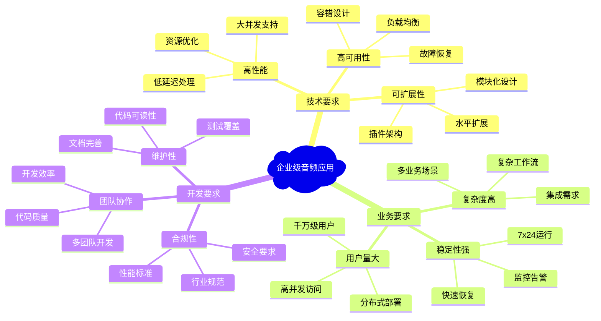

# 1.7 企业级音频应用架构设计

## 概述

企业级音频应用的架构设计是决定项目成败的关键因素。不同于简单的音频播放器，企业级应用需要处理复杂的业务逻辑、支持大规模并发、确保高可用性，并具备良好的扩展性和维护性。本文档基于多年企业级音频项目经验，提供完整的架构设计指南。

### 企业级音频应用特征



## 整体架构设计

### 1. 分层架构模式

```swift
// 企业级音频应用分层架构
protocol AudioApplicationArchitecture {
    // 展示层 - Presentation Layer
    var presentationLayer: PresentationLayerProtocol { get }
    
    // 业务层 - Business Layer
    var businessLayer: BusinessLayerProtocol { get }
    
    // 服务层 - Service Layer
    var serviceLayer: ServiceLayerProtocol { get }
    
    // 数据访问层 - Data Access Layer
    var dataAccessLayer: DataAccessLayerProtocol { get }
    
    // 基础设施层 - Infrastructure Layer
    var infrastructureLayer: InfrastructureLayerProtocol { get }
}

// 主应用架构实现
class EnterpriseAudioApplication: AudioApplicationArchitecture {
    
    // 分层组件
    let presentationLayer: PresentationLayerProtocol
    let businessLayer: BusinessLayerProtocol
    let serviceLayer: ServiceLayerProtocol
    let dataAccessLayer: DataAccessLayerProtocol
    let infrastructureLayer: InfrastructureLayerProtocol
    
    // 依赖注入容器
    private let dependencyContainer: DependencyContainer
    
    // 配置管理
    private let configurationManager: ConfigurationManager
    
    init() {
        // 初始化依赖容器
        self.dependencyContainer = DependencyContainer()
        self.configurationManager = ConfigurationManager()
        
        // 注册依赖
        registerDependencies()
        
        // 初始化各层
        self.infrastructureLayer = dependencyContainer.resolve(InfrastructureLayerProtocol.self)!
        self.dataAccessLayer = dependencyContainer.resolve(DataAccessLayerProtocol.self)!
        self.serviceLayer = dependencyContainer.resolve(ServiceLayerProtocol.self)!
        self.businessLayer = dependencyContainer.resolve(BusinessLayerProtocol.self)!
        self.presentationLayer = dependencyContainer.resolve(PresentationLayerProtocol.self)!
        
        // 配置跨层通信
        setupCrossCuttingConcerns()
    }
    
    private func registerDependencies() {
        // 注册基础设施层依赖
        dependencyContainer.register(LoggingService.self) { _ in
            FileBasedLoggingService()
        }
        
        dependencyContainer.register(CacheService.self) { _ in
            RedisBasedCacheService()
        }
        
        dependencyContainer.register(MessageBroker.self) { _ in
            RabbitMQMessageBroker()
        }
        
        // 注册数据访问层依赖
        dependencyContainer.register(AudioRepository.self) { container in
            CoreDataAudioRepository(
                logger: container.resolve(LoggingService.self)!,
                cache: container.resolve(CacheService.self)!
            )
        }
        
        // 注册服务层依赖
        dependencyContainer.register(AudioProcessingService.self) { container in
            DefaultAudioProcessingService(
                repository: container.resolve(AudioRepository.self)!,
                logger: container.resolve(LoggingService.self)!
            )
        }
        
        // 注册业务层依赖
        dependencyContainer.register(AudioBusinessService.self) { container in
            DefaultAudioBusinessService(
                processingService: container.resolve(AudioProcessingService.self)!,
                messageBroker: container.resolve(MessageBroker.self)!
            )
        }
        
        // 注册展示层依赖
        dependencyContainer.register(AudioViewController.self) { container in
            AudioViewController(
                businessService: container.resolve(AudioBusinessService.self)!
            )
        }
        
        // 注册层级接口
        dependencyContainer.register(InfrastructureLayerProtocol.self) { container in
            InfrastructureLayer(
                logging: container.resolve(LoggingService.self)!,
                cache: container.resolve(CacheService.self)!,
                messageBroker: container.resolve(MessageBroker.self)!
            )
        }
        
        dependencyContainer.register(DataAccessLayerProtocol.self) { container in
            DataAccessLayer(
                audioRepository: container.resolve(AudioRepository.self)!
            )
        }
        
        dependencyContainer.register(ServiceLayerProtocol.self) { container in
            ServiceLayer(
                audioService: container.resolve(AudioProcessingService.self)!
            )
        }
        
        dependencyContainer.register(BusinessLayerProtocol.self) { container in
            BusinessLayer(
                audioBusinessService: container.resolve(AudioBusinessService.self)!
            )
        }
        
        dependencyContainer.register(PresentationLayerProtocol.self) { container in
            PresentationLayer(
                audioViewController: container.resolve(AudioViewController.self)!
            )
        }
    }
    
    private func setupCrossCuttingConcerns() {
        // 设置日志记录
        setupLogging()
        
        // 设置性能监控
        setupPerformanceMonitoring()
        
        // 设置安全策略
        setupSecurity()
        
        // 设置错误处理
        setupErrorHandling()
    }
}
```

### 2. 模块化设计

```swift
// 音频模块接口定义
protocol AudioModule {
    var name: String { get }
    var version: String { get }
    var dependencies: [String] { get }
    
    func initialize() async throws
    func start() async throws
    func stop() async throws
    func cleanup() async throws
}

// 模块管理器
class AudioModuleManager {
    private var modules: [String: AudioModule] = [:]
    private var moduleGraph: ModuleDependencyGraph
    private let moduleLoader: ModuleLoader
    
    init() {
        self.moduleGraph = ModuleDependencyGraph()
        self.moduleLoader = DynamicModuleLoader()
    }
    
    func registerModule(_ module: AudioModule) throws {
        guard modules[module.name] == nil else {
            throw ModuleError.moduleAlreadyRegistered(module.name)
        }
        
        modules[module.name] = module
        try moduleGraph.addModule(module.name, dependencies: module.dependencies)
    }
    
    func loadModules() async throws {
        let loadOrder = try moduleGraph.getTopologicalOrder()
        
        for moduleName in loadOrder {
            guard let module = modules[moduleName] else {
                throw ModuleError.moduleNotFound(moduleName)
            }
            
            try await module.initialize()
            try await module.start()
        }
    }
    
    func unloadModules() async throws {
        let unloadOrder = try moduleGraph.getTopologicalOrder().reversed()
        
        for moduleName in unloadOrder {
            guard let module = modules[moduleName] else { continue }
            
            try await module.stop()
            try await module.cleanup()
        }
    }
}

// 核心音频处理模块
class CoreAudioProcessingModule: AudioModule {
    let name = "CoreAudioProcessing"
    let version = "1.0.0"
    let dependencies: [String] = ["Logging", "Configuration"]
    
    private var audioEngine: AVAudioEngine?
    private var processingChain: AudioProcessingChain?
    
    func initialize() async throws {
        audioEngine = AVAudioEngine()
        processingChain = AudioProcessingChain()
        
        // 配置音频引擎
        try configureAudioEngine()
    }
    
    func start() async throws {
        guard let engine = audioEngine else {
            throw ModuleError.initializationFailed("AudioEngine not initialized")
        }
        
        try engine.start()
    }
    
    func stop() async throws {
        audioEngine?.stop()
    }
    
    func cleanup() async throws {
        audioEngine = nil
        processingChain = nil
    }
    
    private func configureAudioEngine() throws {
        // 音频引擎配置逻辑
    }
}

// 实时通信模块
class RealtimeCommunicationModule: AudioModule {
    let name = "RealtimeCommunication"
    let version = "1.0.0"
    let dependencies: [String] = ["CoreAudioProcessing", "NetworkStack"]
    
    private var communicationEngine: RealtimeCommunicationEngine?
    
    func initialize() async throws {
        communicationEngine = RealtimeCommunicationEngine()
        try await communicationEngine?.initialize()
    }
    
    func start() async throws {
        try await communicationEngine?.start()
    }
    
    func stop() async throws {
        await communicationEngine?.stop()
    }
    
    func cleanup() async throws {
        communicationEngine = nil
    }
}

// 插件模块
class AudioPluginModule: AudioModule {
    let name = "AudioPlugin"
    let version = "1.0.0"
    let dependencies: [String] = ["CoreAudioProcessing"]
    
    private var pluginManager: AudioPluginManager?
    
    func initialize() async throws {
        pluginManager = AudioPluginManager()
        try await pluginManager?.loadPlugins()
    }
    
    func start() async throws {
        try await pluginManager?.activatePlugins()
    }
    
    func stop() async throws {
        await pluginManager?.deactivatePlugins()
    }
    
    func cleanup() async throws {
        await pluginManager?.unloadPlugins()
        pluginManager = nil
    }
}
```

### 3. 微服务架构模式

```swift
// 音频微服务接口
protocol AudioMicroservice {
    var serviceName: String { get }
    var serviceVersion: String { get }
    var healthCheckEndpoint: String { get }
    
    func start() async throws
    func stop() async throws
    func getHealthStatus() async -> ServiceHealthStatus
}

// 服务发现与注册
class AudioServiceRegistry {
    private var services: [String: AudioServiceInstance] = [:]
    private let consul: ConsulClient
    
    init() {
        self.consul = ConsulClient()
    }
    
    func registerService(_ service: AudioServiceInstance) async throws {
        services[service.id] = service
        try await consul.register(service)
    }
    
    func discoverService(_ serviceName: String) async throws -> [AudioServiceInstance] {
        return try await consul.discover(serviceName)
    }
    
    func deregisterService(_ serviceId: String) async throws {
        services.removeValue(forKey: serviceId)
        try await consul.deregister(serviceId)
    }
}

// 音频处理微服务
class AudioProcessingMicroservice: AudioMicroservice {
    let serviceName = "audio-processing"
    let serviceVersion = "1.0.0"
    let healthCheckEndpoint = "/health"
    
    private let server: HTTPServer
    private let audioProcessor: DistributedAudioProcessor
    private let serviceRegistry: AudioServiceRegistry
    
    init() {
        self.server = HTTPServer(port: 8080)
        self.audioProcessor = DistributedAudioProcessor()
        self.serviceRegistry = AudioServiceRegistry()
    }
    
    func start() async throws {
        // 启动HTTP服务器
        try await server.start()
        
        // 注册路由
        registerRoutes()
        
        // 注册服务
        let serviceInstance = AudioServiceInstance(
            id: UUID().uuidString,
            name: serviceName,
            version: serviceVersion,
            host: "localhost",
            port: 8080
        )
        try await serviceRegistry.registerService(serviceInstance)
    }
    
    func stop() async throws {
        await server.stop()
    }
    
    func getHealthStatus() async -> ServiceHealthStatus {
        return ServiceHealthStatus(
            status: .healthy,
            timestamp: Date(),
            details: [
                "cpu_usage": "25%",
                "memory_usage": "512MB",
                "active_connections": "150"
            ]
        )
    }
    
    private func registerRoutes() {
        server.post("/process") { request in
            return try await self.processAudio(request)
        }
        
        server.get("/health") { _ in
            let status = await self.getHealthStatus()
            return try JSONEncoder().encode(status)
        }
    }
    
    private func processAudio(_ request: HTTPRequest) async throws -> Data {
        let audioData = try AudioData.decode(from: request.body)
        let processedData = try await audioProcessor.process(audioData)
        return try processedData.encode()
    }
}

// 音频存储微服务
class AudioStorageMicroservice: AudioMicroservice {
    let serviceName = "audio-storage"
    let serviceVersion = "1.0.0"
    let healthCheckEndpoint = "/health"
    
    private let server: HTTPServer
    private let storageEngine: DistributedStorageEngine
    
    init() {
        self.server = HTTPServer(port: 8081)
        self.storageEngine = DistributedStorageEngine()
    }
    
    func start() async throws {
        try await server.start()
        registerRoutes()
    }
    
    func stop() async throws {
        await server.stop()
    }
    
    func getHealthStatus() async -> ServiceHealthStatus {
        return ServiceHealthStatus(
            status: .healthy,
            timestamp: Date(),
            details: [
                "storage_usage": "2.5TB",
                "available_space": "7.5TB",
                "replication_status": "healthy"
            ]
        )
    }
    
    private func registerRoutes() {
        server.post("/upload") { request in
            return try await self.uploadAudio(request)
        }
        
        server.get("/download/:id") { request in
            return try await self.downloadAudio(request)
        }
        
        server.delete("/delete/:id") { request in
            return try await self.deleteAudio(request)
        }
    }
    
    private func uploadAudio(_ request: HTTPRequest) async throws -> Data {
        let audioFile = try AudioFile.parse(from: request)
        let fileId = try await storageEngine.store(audioFile)
        return try JSONEncoder().encode(["file_id": fileId])
    }
    
    private func downloadAudio(_ request: HTTPRequest) async throws -> Data {
        guard let fileId = request.parameters["id"] else {
            throw HTTPError.badRequest("Missing file ID")
        }
        return try await storageEngine.retrieve(fileId)
    }
    
    private func deleteAudio(_ request: HTTPRequest) async throws -> Data {
        guard let fileId = request.parameters["id"] else {
            throw HTTPError.badRequest("Missing file ID")
        }
        try await storageEngine.delete(fileId)
        return try JSONEncoder().encode(["status": "deleted"])
    }
}
```

## 性能优化架构

### 1. 分布式音频处理

```swift
// 分布式音频处理协调器
class DistributedAudioProcessingCoordinator {
    private let nodeManager: ProcessingNodeManager
    private let loadBalancer: AudioLoadBalancer
    private let taskScheduler: AudioTaskScheduler
    
    init() {
        self.nodeManager = ProcessingNodeManager()
        self.loadBalancer = AudioLoadBalancer()
        self.taskScheduler = AudioTaskScheduler()
    }
    
    func processAudioBatch(_ batch: AudioBatch) async throws -> ProcessedAudioBatch {
        // 1. 分析处理需求
        let requirements = analyzeProcessingRequirements(batch)
        
        // 2. 选择最优处理节点
        let nodes = try await selectOptimalNodes(requirements)
        
        // 3. 分割任务
        let tasks = splitAudioBatch(batch, across: nodes)
        
        // 4. 并行处理
        let results = try await withThrowingTaskGroup(of: ProcessedAudioChunk.self) { group in
            for task in tasks {
                group.addTask {
                    return try await self.processChunk(task)
                }
            }
            
            var processedChunks: [ProcessedAudioChunk] = []
            for try await chunk in group {
                processedChunks.append(chunk)
            }
            return processedChunks
        }
        
        // 5. 合并结果
        return try mergeProcessedChunks(results)
    }
    
    private func analyzeProcessingRequirements(_ batch: AudioBatch) -> ProcessingRequirements {
        return ProcessingRequirements(
            cpuIntensive: batch.requiresComplexProcessing,
            memoryRequirement: batch.estimatedMemoryUsage,
            ioIntensive: batch.requiresFileAccess,
            estimatedDuration: batch.estimatedProcessingTime
        )
    }
    
    private func selectOptimalNodes(_ requirements: ProcessingRequirements) async throws -> [ProcessingNode] {
        let availableNodes = await nodeManager.getAvailableNodes()
        return loadBalancer.selectNodes(availableNodes, for: requirements)
    }
    
    private func splitAudioBatch(_ batch: AudioBatch, across nodes: [ProcessingNode]) -> [AudioProcessingTask] {
        return taskScheduler.createTasks(from: batch, targeting: nodes)
    }
    
    private func processChunk(_ task: AudioProcessingTask) async throws -> ProcessedAudioChunk {
        return try await task.node.process(task.chunk)
    }
    
    private func mergeProcessedChunks(_ chunks: [ProcessedAudioChunk]) throws -> ProcessedAudioBatch {
        return try ProcessedAudioBatch(chunks: chunks.sorted(by: { $0.sequenceNumber < $1.sequenceNumber }))
    }
}

// 处理节点管理器
class ProcessingNodeManager {
    private var nodes: [ProcessingNode] = []
    private let nodeHealthMonitor: NodeHealthMonitor
    
    init() {
        self.nodeHealthMonitor = NodeHealthMonitor()
    }
    
    func getAvailableNodes() async -> [ProcessingNode] {
        let healthyNodes = await nodeHealthMonitor.getHealthyNodes()
        return nodes.filter { node in
            healthyNodes.contains(node.id) && node.isAvailable
        }
    }
    
    func addNode(_ node: ProcessingNode) {
        nodes.append(node)
        nodeHealthMonitor.startMonitoring(node)
    }
    
    func removeNode(_ nodeId: String) {
        nodes.removeAll { $0.id == nodeId }
        nodeHealthMonitor.stopMonitoring(nodeId)
    }
}

// 音频负载均衡器
class AudioLoadBalancer {
    private let selectionStrategy: NodeSelectionStrategy
    
    init(strategy: NodeSelectionStrategy = .leastLoaded) {
        self.selectionStrategy = strategy
    }
    
    func selectNodes(_ availableNodes: [ProcessingNode], for requirements: ProcessingRequirements) -> [ProcessingNode] {
        switch selectionStrategy {
        case .leastLoaded:
            return selectLeastLoadedNodes(availableNodes, requirements)
        case .roundRobin:
            return selectRoundRobinNodes(availableNodes, requirements)
        case .weighted:
            return selectWeightedNodes(availableNodes, requirements)
        }
    }
    
    private func selectLeastLoadedNodes(_ nodes: [ProcessingNode], _ requirements: ProcessingRequirements) -> [ProcessingNode] {
        let nodeCount = calculateOptimalNodeCount(requirements)
        return Array(nodes.sorted { $0.currentLoad < $1.currentLoad }.prefix(nodeCount))
    }
    
    private func selectRoundRobinNodes(_ nodes: [ProcessingNode], _ requirements: ProcessingRequirements) -> [ProcessingNode] {
        // Round-robin selection implementation
        let nodeCount = calculateOptimalNodeCount(requirements)
        return Array(nodes.prefix(nodeCount))
    }
    
    private func selectWeightedNodes(_ nodes: [ProcessingNode], _ requirements: ProcessingRequirements) -> [ProcessingNode] {
        // Weighted selection based on node capabilities
        let nodeCount = calculateOptimalNodeCount(requirements)
        let weightedNodes = nodes.sorted { node1, node2 in
            let weight1 = calculateNodeWeight(node1, for: requirements)
            let weight2 = calculateNodeWeight(node2, for: requirements)
            return weight1 > weight2
        }
        return Array(weightedNodes.prefix(nodeCount))
    }
    
    private func calculateOptimalNodeCount(_ requirements: ProcessingRequirements) -> Int {
        // Calculate optimal number of nodes based on requirements
        if requirements.cpuIntensive {
            return min(8, max(2, requirements.memoryRequirement / 1024))
        } else {
            return min(4, max(1, requirements.memoryRequirement / 2048))
        }
    }
    
    private func calculateNodeWeight(_ node: ProcessingNode, for requirements: ProcessingRequirements) -> Float {
        var weight: Float = 0
        
        // CPU capability weight
        weight += Float(node.cpuCores) * (requirements.cpuIntensive ? 2.0 : 1.0)
        
        // Memory capability weight
        weight += Float(node.memoryGB) * (requirements.memoryRequirement > 4096 ? 1.5 : 1.0)
        
        // Current load penalty
        weight *= (1.0 - node.currentLoad)
        
        return weight
    }
}

// 节点选择策略
enum NodeSelectionStrategy {
    case leastLoaded
    case roundRobin
    case weighted
}

// 处理需求
struct ProcessingRequirements {
    let cpuIntensive: Bool
    let memoryRequirement: Int // MB
    let ioIntensive: Bool
    let estimatedDuration: TimeInterval
}

// 处理节点
class ProcessingNode {
    let id: String
    let host: String
    let port: Int
    let cpuCores: Int
    let memoryGB: Int
    var currentLoad: Float
    var isAvailable: Bool
    
    init(id: String, host: String, port: Int, cpuCores: Int, memoryGB: Int) {
        self.id = id
        self.host = host
        self.port = port
        self.cpuCores = cpuCores
        self.memoryGB = memoryGB
        self.currentLoad = 0.0
        self.isAvailable = true
    }
    
    func process(_ chunk: AudioChunk) async throws -> ProcessedAudioChunk {
        // Implement remote processing logic
        let client = HTTPClient(host: host, port: port)
        let request = AudioProcessingRequest(chunk: chunk)
        let response = try await client.post("/process", body: request.encode())
        return try ProcessedAudioChunk.decode(from: response)
    }
}
```

### 2. 缓存策略设计

```swift
// 多层缓存架构
class AudioCacheManager {
    private let l1Cache: MemoryCache        // L1: 内存缓存
    private let l2Cache: SSDCache          // L2: SSD缓存
    private let l3Cache: NetworkCache      // L3: 分布式缓存
    
    private let cacheStrategy: CacheStrategy
    private let evictionPolicy: EvictionPolicy
    
    init() {
        self.l1Cache = MemoryCache(maxSize: 512 * 1024 * 1024)  // 512MB
        self.l2Cache = SSDCache(maxSize: 10 * 1024 * 1024 * 1024) // 10GB
        self.l3Cache = NetworkCache(nodes: ["cache1", "cache2", "cache3"])
        self.cacheStrategy = .writeThrough
        self.evictionPolicy = .lru
    }
    
    func get(_ key: String) async throws -> AudioData? {
        // L1 cache lookup
        if let data = await l1Cache.get(key) {
            return data
        }
        
        // L2 cache lookup
        if let data = await l2Cache.get(key) {
            // Promote to L1
            await l1Cache.set(key, data, ttl: 3600)
            return data
        }
        
        // L3 cache lookup
        if let data = try await l3Cache.get(key) {
            // Promote to L2 and L1
            await l2Cache.set(key, data, ttl: 86400)
            await l1Cache.set(key, data, ttl: 3600)
            return data
        }
        
        return nil
    }
    
    func set(_ key: String, _ data: AudioData) async throws {
        switch cacheStrategy {
        case .writeThrough:
            await writeThrough(key, data)
        case .writeBack:
            await writeBack(key, data)
        case .writeAround:
            await writeAround(key, data)
        }
    }
    
    private func writeThrough(_ key: String, _ data: AudioData) async {
        // Write to all cache levels
        await l1Cache.set(key, data, ttl: 3600)
        await l2Cache.set(key, data, ttl: 86400)
        try? await l3Cache.set(key, data, ttl: 604800) // 7 days
    }
    
    private func writeBack(_ key: String, _ data: AudioData) async {
        // Write to L1 only, sync to other levels later
        await l1Cache.set(key, data, ttl: 3600)
        
        // Schedule async write to other levels
        Task {
            await l2Cache.set(key, data, ttl: 86400)
            try? await l3Cache.set(key, data, ttl: 604800)
        }
    }
    
    private func writeAround(_ key: String, _ data: AudioData) async {
        // Write directly to L3, bypass L1/L2
        try? await l3Cache.set(key, data, ttl: 604800)
    }
    
    func invalidate(_ key: String) async {
        await l1Cache.remove(key)
        await l2Cache.remove(key)
        try? await l3Cache.remove(key)
    }
    
    func warmup(_ keys: [String]) async {
        // Preload frequently accessed data
        await withTaskGroup(of: Void.self) { group in
            for key in keys {
                group.addTask {
                    _ = try? await self.get(key)
                }
            }
        }
    }
}

// 智能预取策略
class AudioPrefetchManager {
    private let cacheManager: AudioCacheManager
    private let accessPattern: AccessPatternAnalyzer
    private let predictor: AudioAccessPredictor
    
    init(cacheManager: AudioCacheManager) {
        self.cacheManager = cacheManager
        self.accessPattern = AccessPatternAnalyzer()
        self.predictor = AudioAccessPredictor()
    }
    
    func analyzeAndPrefetch(_ accessedKey: String) async {
        // Record access pattern
        accessPattern.recordAccess(accessedKey)
        
        // Predict next likely accesses
        let predictions = predictor.predictNextAccesses(after: accessedKey)
        
        // Prefetch predicted items
        await prefetchItems(predictions)
    }
    
    private func prefetchItems(_ keys: [String]) async {
        await withTaskGroup(of: Void.self) { group in
            for key in keys {
                group.addTask {
                    // Check if not already cached
                    if try? await self.cacheManager.get(key) == nil {
                        // Load from storage and cache
                        if let data = try? await self.loadFromStorage(key) {
                            try? await self.cacheManager.set(key, data)
                        }
                    }
                }
            }
        }
    }
    
    private func loadFromStorage(_ key: String) async throws -> AudioData {
        // Load data from persistent storage
        throw NotImplementedError()
    }
}

enum CacheStrategy {
    case writeThrough
    case writeBack
    case writeAround
}

enum EvictionPolicy {
    case lru
    case lfu
    case fifo
    case random
}
```

## 可扩展性设计

### 1. 插件架构

```swift
// 插件系统架构
protocol AudioPlugin {
    var identifier: String { get }
    var name: String { get }
    var version: String { get }
    var capabilities: [PluginCapability] { get }
    
    func initialize(context: PluginContext) async throws
    func process(_ input: AudioPluginInput) async throws -> AudioPluginOutput
    func cleanup() async throws
}

// 插件管理器
class AudioPluginManager {
    private var plugins: [String: AudioPlugin] = [:]
    private var pluginChains: [String: PluginChain] = [:]
    private let pluginLoader: PluginLoader
    private let sandboxManager: PluginSandboxManager
    
    init() {
        self.pluginLoader = DynamicPluginLoader()
        self.sandboxManager = PluginSandboxManager()
    }
    
    func loadPlugin(from path: String) async throws -> AudioPlugin {
        // Load plugin in sandboxed environment
        let plugin = try await pluginLoader.load(from: path)
        
        // Validate plugin
        try validatePlugin(plugin)
        
        // Initialize plugin
        let context = createPluginContext(for: plugin)
        try await plugin.initialize(context: context)
        
        // Register plugin
        plugins[plugin.identifier] = plugin
        
        return plugin
    }
    
    func createPluginChain(_ plugins: [String]) throws -> PluginChain {
        let chainPlugins = try plugins.map { pluginId in
            guard let plugin = self.plugins[pluginId] else {
                throw PluginError.pluginNotFound(pluginId)
            }
            return plugin
        }
        
        let chain = PluginChain(plugins: chainPlugins)
        pluginChains[chain.identifier] = chain
        
        return chain
    }
    
    func processAudio(_ input: AudioData, using chainId: String) async throws -> AudioData {
        guard let chain = pluginChains[chainId] else {
            throw PluginError.chainNotFound(chainId)
        }
        
        return try await chain.process(input)
    }
    
    private func validatePlugin(_ plugin: AudioPlugin) throws {
        // Validate plugin signature
        // Check API compatibility
        // Verify security requirements
    }
    
    private func createPluginContext(for plugin: AudioPlugin) -> PluginContext {
        return PluginContext(
            pluginId: plugin.identifier,
            workingDirectory: sandboxManager.createWorkspace(for: plugin),
            resourceLimits: ResourceLimits(
                maxMemory: 256 * 1024 * 1024, // 256MB
                maxCPUTime: 5.0,              // 5 seconds
                maxFileSize: 100 * 1024 * 1024 // 100MB
            )
        )
    }
}

// 插件链
class PluginChain {
    let identifier: String
    private let plugins: [AudioPlugin]
    
    init(plugins: [AudioPlugin]) {
        self.identifier = UUID().uuidString
        self.plugins = plugins
    }
    
    func process(_ input: AudioData) async throws -> AudioData {
        var currentData = input
        
        for plugin in plugins {
            let pluginInput = AudioPluginInput(data: currentData)
            let pluginOutput = try await plugin.process(pluginInput)
            currentData = pluginOutput.data
        }
        
        return currentData
    }
}

// 插件沙箱管理器
class PluginSandboxManager {
    private var workspaces: [String: URL] = [:]
    
    func createWorkspace(for plugin: AudioPlugin) -> URL {
        let workspaceURL = FileManager.default.temporaryDirectory
            .appendingPathComponent("plugin_workspace")
            .appendingPathComponent(plugin.identifier)
        
        try? FileManager.default.createDirectory(at: workspaceURL, withIntermediateDirectories: true)
        workspaces[plugin.identifier] = workspaceURL
        
        return workspaceURL
    }
    
    func cleanupWorkspace(for pluginId: String) {
        if let workspaceURL = workspaces[pluginId] {
            try? FileManager.default.removeItem(at: workspaceURL)
            workspaces.removeValue(forKey: pluginId)
        }
    }
}

// 插件能力
enum PluginCapability {
    case audioProcessing
    case effectProcessing
    case formatConversion
    case analysis
    case synthesis
    case spatialization
}

// 插件上下文
struct PluginContext {
    let pluginId: String
    let workingDirectory: URL
    let resourceLimits: ResourceLimits
}

// 资源限制
struct ResourceLimits {
    let maxMemory: Int
    let maxCPUTime: TimeInterval
    let maxFileSize: Int
}

// 插件输入/输出
struct AudioPluginInput {
    let data: AudioData
    let metadata: [String: Any]
    
    init(data: AudioData, metadata: [String: Any] = [:]) {
        self.data = data
        self.metadata = metadata
    }
}

struct AudioPluginOutput {
    let data: AudioData
    let metadata: [String: Any]
    
    init(data: AudioData, metadata: [String: Any] = [:]) {
        self.data = data
        self.metadata = metadata
    }
}
```

## 监控与运维

### 1. 综合监控系统

```swift
// 音频应用监控系统
class AudioApplicationMonitor {
    private let metricsCollector: MetricsCollector
    private let alertManager: AlertManager
    private let dashboardService: DashboardService
    private let logAggregator: LogAggregator
    
    init() {
        self.metricsCollector = PrometheusMetricsCollector()
        self.alertManager = AlertManager()
        self.dashboardService = GrafanaDashboardService()
        self.logAggregator = ELKLogAggregator()
    }
    
    func startMonitoring() {
        startMetricsCollection()
        startHealthChecks()
        startPerformanceMonitoring()
        startErrorTracking()
    }
    
    private func startMetricsCollection() {
        metricsCollector.startCollecting([
            .audioLatency,
            .processingThroughput,
            .memoryUsage,
            .cpuUtilization,
            .networkIOPS,
            .diskIOPS,
            .activeConnections,
            .errorRate
        ])
    }
    
    private func startHealthChecks() {
        Timer.scheduledTimer(withTimeInterval: 30, repeats: true) { _ in
            Task {
                await self.performHealthChecks()
            }
        }
    }
    
    private func performHealthChecks() async {
        let checks = [
            healthCheckAudioEngine(),
            healthCheckDatabase(),
            healthCheckRedis(),
            healthCheckMessageQueue(),
            healthCheckExternalServices()
        ]
        
        let results = await withTaskGroup(of: HealthCheckResult.self) { group in
            for check in checks {
                group.addTask { await check }
            }
            
            var results: [HealthCheckResult] = []
            for await result in group {
                results.append(result)
            }
            return results
        }
        
        processHealthCheckResults(results)
    }
    
    private func processHealthCheckResults(_ results: [HealthCheckResult]) {
        for result in results {
            if result.status != .healthy {
                alertManager.triggerAlert(
                    severity: result.status == .critical ? .critical : .warning,
                    message: "Health check failed: \(result.componentName)",
                    details: result.details
                )
            }
        }
    }
    
    private func healthCheckAudioEngine() async -> HealthCheckResult {
        // Check audio engine status
        return HealthCheckResult(
            componentName: "AudioEngine",
            status: .healthy,
            responseTime: 0.05,
            details: [:]
        )
    }
    
    private func healthCheckDatabase() async -> HealthCheckResult {
        // Check database connectivity and performance
        return HealthCheckResult(
            componentName: "Database",
            status: .healthy,
            responseTime: 0.02,
            details: [:]
        )
    }
    
    private func healthCheckRedis() async -> HealthCheckResult {
        // Check Redis connectivity
        return HealthCheckResult(
            componentName: "Redis",
            status: .healthy,
            responseTime: 0.01,
            details: [:]
        )
    }
    
    private func healthCheckMessageQueue() async -> HealthCheckResult {
        // Check message queue status
        return HealthCheckResult(
            componentName: "MessageQueue",
            status: .healthy,
            responseTime: 0.03,
            details: [:]
        )
    }
    
    private func healthCheckExternalServices() async -> HealthCheckResult {
        // Check external service dependencies
        return HealthCheckResult(
            componentName: "ExternalServices",
            status: .healthy,
            responseTime: 0.15,
            details: [:]
        )
    }
}

// 健康检查结果
struct HealthCheckResult {
    let componentName: String
    let status: HealthStatus
    let responseTime: TimeInterval
    let details: [String: Any]
}

enum HealthStatus {
    case healthy
    case warning
    case critical
}

// 告警管理器
class AlertManager {
    private let notificationChannels: [NotificationChannel]
    
    init() {
        self.notificationChannels = [
            SlackNotificationChannel(),
            EmailNotificationChannel(),
            PagerDutyNotificationChannel()
        ]
    }
    
    func triggerAlert(severity: AlertSeverity, message: String, details: [String: Any]) {
        let alert = Alert(
            severity: severity,
            message: message,
            details: details,
            timestamp: Date()
        )
        
        for channel in notificationChannels {
            if channel.shouldNotify(alert) {
                Task {
                    try? await channel.send(alert)
                }
            }
        }
    }
}

enum AlertSeverity {
    case info
    case warning
    case critical
}

struct Alert {
    let severity: AlertSeverity
    let message: String
    let details: [String: Any]
    let timestamp: Date
}
```

## 总结

企业级音频应用架构设计的关键要素包括：

1. **分层架构**：清晰的职责分离和依赖管理
2. **模块化设计**：高内聚、低耦合的模块组织
3. **微服务架构**：水平扩展和独立部署能力
4. **性能优化**：分布式处理和多层缓存策略
5. **可扩展性**：插件系统和动态功能扩展
6. **监控运维**：全面的监控、告警和运维体系

通过这些架构模式和最佳实践，可以构建出既满足当前业务需求，又具备未来扩展能力的企业级音频应用。 