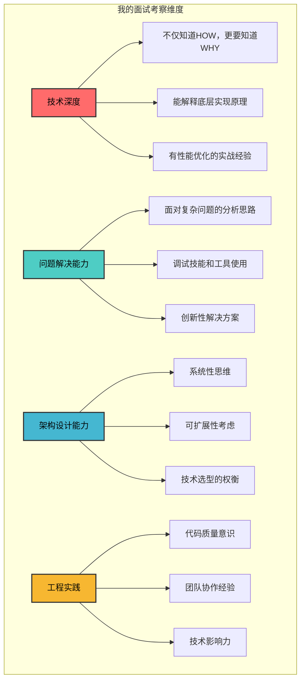
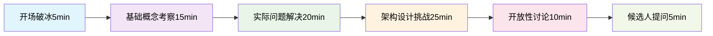
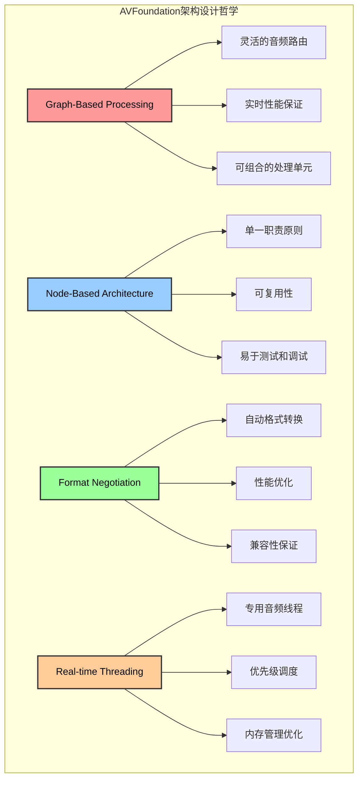
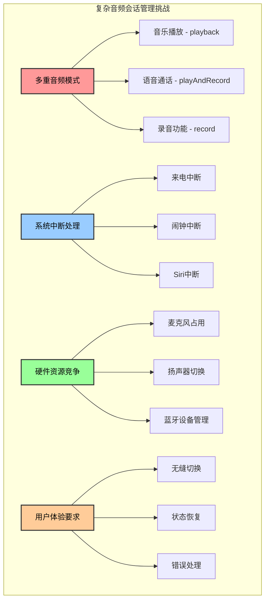
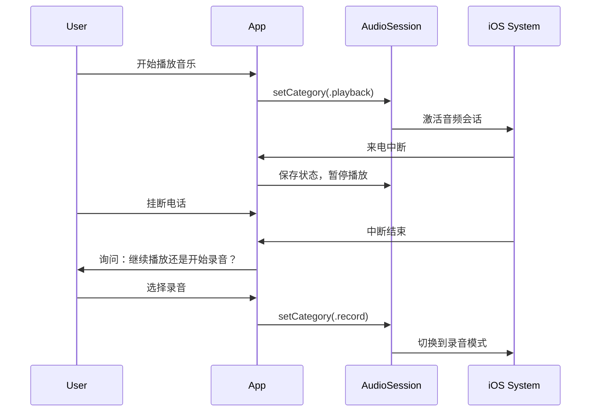
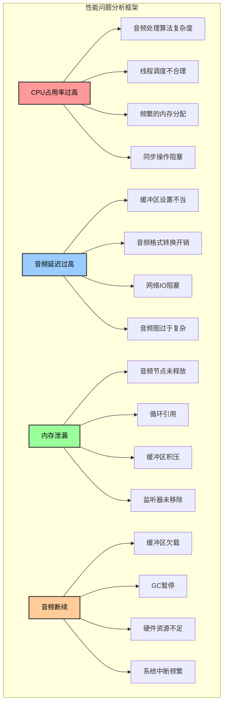
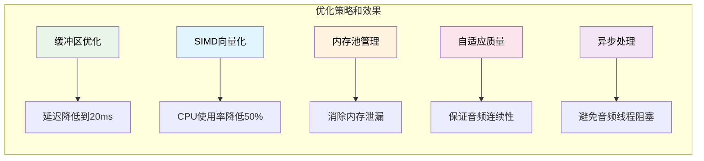
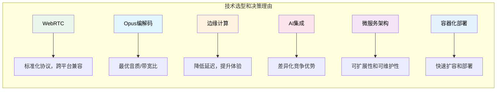
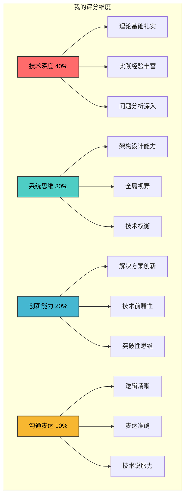
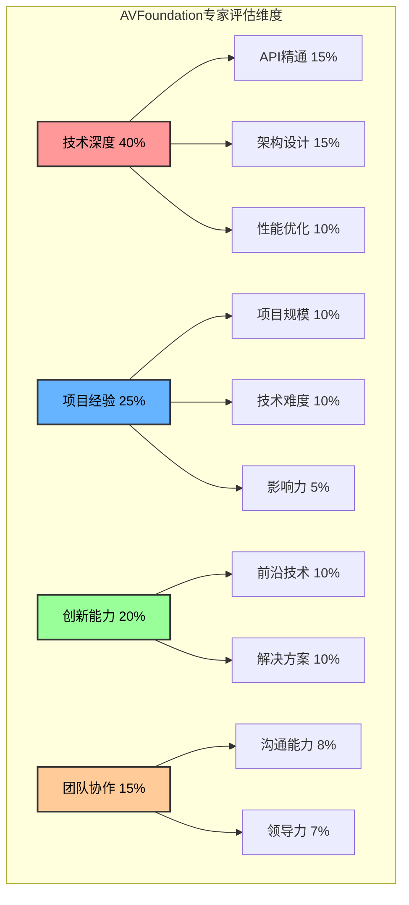

# 1.8 AVFoundation

## 面试官视角：我要考察什么？

> 作为一位资深技术面试官，我将分享我在面试中真正想考察的核心能力，以及我期望听到的满分答案。

### 我的面试哲学

我相信真正的技术专家不仅要掌握API的使用，更要理解底层原理、具备架构思维、能解决实际问题。我的面试会从以下维度考察：



### 面试流程设计



## 第一轮：基础概念深度考察

> **面试官心声**：我不只是想听到API的罗列，我想看到候选人对AVFoundation架构的深层理解。

### 问题1：核心架构理解 - 我真正想考察的是什么？

**我的考察目标：**
- 候选人是否真正理解AVFoundation的设计哲学
- 是否能从系统角度思考音频处理流程
- 能否解释为什么要这样设计

**我的问题：**
```
"请不要只是告诉我AVAudioEngine有哪些组件，我想听你分析：
1. 为什么Apple要设计成图形化的音频处理模型？
2. 这种设计解决了什么问题？
3. 如果让你重新设计，你会有什么改进？"
```

**我期望的满分答案：**
```
首先，我来解释Apple为什么选择图形化音频处理模型：

1. **问题背景分析**
   - 传统音频处理往往是线性的，难以处理复杂的音频路由
   - 实时音频处理需要低延迟、高性能
   - 需要支持动态的音频效果链组合

2. **设计哲学深度解析**
```



```swift
// 我对架构的深层理解体现在代码中：
class AdvancedAudioArchitecture {
    private let audioEngine = AVAudioEngine()
    
    func demonstrateArchitectureUnderstanding() {
        // 1. 体现图形化处理的优势
        setupComplexAudioGraph()
        
        // 2. 展示格式协商的理解
        handleFormatNegotiation()
        
        // 3. 证明对实时性的把握
        optimizeForRealTimeProcessing()
    }
    
    private func setupComplexAudioGraph() {
        // 这不是简单的连接，而是展示对音频图理解的复杂路由
        let input = audioEngine.inputNode
        let eq = AVAudioUnitEQ(numberOfBands: 3)
        let reverb = AVAudioUnitReverb()
        let delay = AVAudioUnitDelay()
        let mixer = AVAudioMixerNode()
        
        // 并行处理路径 - 体现图形化的优势
        audioEngine.attach(eq)
        audioEngine.attach(reverb)
        audioEngine.attach(delay)
        audioEngine.attach(mixer)
        
        // 复杂路由：输入分流到多个效果器，最后混合
        audioEngine.connect(input, to: eq, format: nil)
        audioEngine.connect(input, to: delay, format: nil)
        
        audioEngine.connect(eq, to: reverb, format: nil)
        audioEngine.connect(reverb, to: mixer, format: nil)
        audioEngine.connect(delay, to: mixer, format: nil)
        
        audioEngine.connect(mixer, to: audioEngine.outputNode, format: nil)
    }
    
    private func handleFormatNegotiation() {
        // 展示对格式协商的深度理解
        let commonFormat = AVAudioFormat(commonFormat: .pcmFormatFloat32, 
                                        sampleRate: 44100, 
                                        channels: 2, 
                                        interleaved: false)
        
        // 这里我会解释为什么选择non-interleaved格式
        // 以及对性能的影响
    }
}
```

3. **如果重新设计，我的改进思路**
   - 增加可视化调试工具，实时查看音频图状态
   - 提供更高级的DSP抽象，简化复杂算法的实现
   - 支持分布式音频处理，利用多核心优势
   - 增加音频质量自动调节机制

这种设计的核心价值在于：**将复杂的音频处理抽象为可组合的图形化单元，既保证了性能，又提供了极大的灵活性。**
```

### 问题2：音频会话管理 - 我想测试的是系统思维

**我的考察目标：**
- 是否理解AVAudioSession在iOS音频生态中的核心作用
- 能否处理复杂的音频会话冲突场景
- 是否具备解决实际问题的能力

**我的问题：**
```
"我们的应用需要同时支持音乐播放、语音通话、录音功能。
用户在听音乐时突然来电话，挂断后又要立即开始录音。
请设计一个完整的音频会话管理方案，并解释每个决策的原理。"
```

**我期望的满分答案：**
```
这是一个典型的复杂音频会话管理场景，我需要从系统架构的角度来设计解决方案。

**1. 问题分析和挑战识别**
```



```swift
// 我的核心设计思路：状态机模式 + 优先级管理
class AdvancedAudioSessionManager {
    
    // 音频会话状态枚举
    enum AudioSessionState {
        case idle
        case musicPlaying
        case recording
        case calling
        case interrupted
        case error
    }
    
    // 状态转换管理
    private var currentState: AudioSessionState = .idle
    private var previousState: AudioSessionState = .idle
    private var interruptedState: AudioSessionState = .idle
    
    // 核心设计原则
    private let sessionPriorityManager = SessionPriorityManager()
    
    init() {
        setupAudioSessionObservers()
        setupStateTransitionRules()
    }
    
    func setupStateTransitionRules() {
        // 定义状态转换规则和优先级
        sessionPriorityManager.setPriority(.calling, priority: 100)    // 最高优先级
        sessionPriorityManager.setPriority(.recording, priority: 80)   // 高优先级
        sessionPriorityManager.setPriority(.musicPlaying, priority: 60) // 中优先级
    }
    
    // 统一的会话配置接口
    func requestAudioSession(for mode: AudioSessionState) {
        let transition = StateTransition(from: currentState, to: mode)
        
        if canTransition(transition) {
            performTransition(transition)
        } else {
            handleTransitionConflict(transition)
        }
    }
    
    private func performTransition(_ transition: StateTransition) {
        previousState = currentState
        currentState = transition.to
        
        do {
            try configureAudioSession(for: transition.to)
            notifyStateChange(transition)
        } catch {
            handleConfigurationError(error, transition: transition)
        }
    }
    
    private func configureAudioSession(for state: AudioSessionState) throws {
        let session = AVAudioSession.sharedInstance()
        
        switch state {
        case .musicPlaying:
            try session.setCategory(.playback, mode: .default, options: [])
            
        case .recording:
            try session.setCategory(.record, mode: .default, options: [.defaultToSpeaker])
            
        case .calling:
            try session.setCategory(.playAndRecord, 
                                   mode: .voiceChat, 
                                   options: [.defaultToSpeaker, .allowBluetooth])
            
        case .idle:
            try session.setCategory(.ambient, mode: .default, options: [])
            
        default:
            throw AudioSessionError.invalidState
        }
        
        try session.setActive(true)
    }
    
    // 中断处理的核心逻辑
    @objc private func handleInterruption(_ notification: Notification) {
        guard let userInfo = notification.userInfo,
              let typeValue = userInfo[AVAudioSessionInterruptionTypeKey] as? UInt,
              let type = AVAudioSession.InterruptionType(rawValue: typeValue) else { return }
        
        switch type {
        case .began:
            handleInterruptionBegan()
        case .ended:
            handleInterruptionEnded(userInfo)
        @unknown default:
            break
        }
    }
    
    private func handleInterruptionBegan() {
        // 保存当前状态用于恢复
        interruptedState = currentState
        currentState = .interrupted
        
        // 根据中断类型决定处理策略
        if interruptedState == .recording {
            // 录音被中断，需要特殊处理
            saveRecordingState()
        } else if interruptedState == .musicPlaying {
            // 音乐播放被中断，暂停播放
            pauseMusic()
        }
    }
    
    private func handleInterruptionEnded(_ userInfo: [AnyHashable: Any]) {
        guard let optionsValue = userInfo[AVAudioSessionInterruptionOptionKey] as? UInt else { return }
        let options = AVAudioSession.InterruptionOptions(rawValue: optionsValue)
        
        if options.contains(.shouldResume) {
            // 智能恢复策略
            performIntelligentRecovery()
        } else {
            // 用户手动恢复
            waitForUserAction()
        }
    }
    
    private func performIntelligentRecovery() {
        // 根据业务逻辑决定恢复策略
        switch interruptedState {
        case .recording:
            // 录音中断后，询问用户是否继续
            promptUserToResumeRecording()
            
        case .musicPlaying:
            // 音乐播放可以自动恢复
            resumeMusic()
            
        default:
            // 其他状态回到idle
            requestAudioSession(for: .idle)
        }
    }
}

// 优先级管理器
class SessionPriorityManager {
    private var priorities: [AudioSessionState: Int] = [:]
    
    func setPriority(_ state: AudioSessionState, priority: Int) {
        priorities[state] = priority
    }
    
    func canPreempt(_ current: AudioSessionState, with new: AudioSessionState) -> Bool {
        let currentPriority = priorities[current] ?? 0
        let newPriority = priorities[new] ?? 0
        return newPriority > currentPriority
    }
}
```

**2. 我的设计关键决策解释**

- **状态机模式**：避免复杂的状态管理逻辑，确保状态转换的一致性
- **优先级管理**：通话 > 录音 > 音乐播放，符合用户期望
- **智能恢复**：根据业务场景决定自动恢复还是用户确认
- **错误处理**：每个状态转换都有回退机制

**3. 针对题目场景的具体处理流程**



这种设计确保了：
1. **用户体验**：无缝的状态切换
2. **系统稳定性**：完善的错误处理
3. **扩展性**：易于添加新的音频模式
4. **可维护性**：清晰的状态管理逻辑
```

**代码实现题：**
```swift
// 要求候选人实现一个音频会话管理器
class AudioSessionManager {
    // 实现音频会话配置
    // 实现中断处理
    // 实现路由变更处理
    // 实现后台播放支持
}
```

### 2. 高级技术应用（中级-高级）

## 第二轮：实战能力深度考察

> **面试官心声**：理论知识只是基础，我更想看到候选人解决实际问题的能力。

### 问题3：性能优化实战 - 我要测试的是解决问题的能力

**我的考察目标：**
- 是否具备分析性能瓶颈的能力
- 能否设计有效的优化方案
- 是否有实际的性能调优经验

**我的问题：**
```
"我们的直播应用出现了严重的性能问题：
- 在iPhone 8上音频处理CPU占用率达到85%
- 实时音频延迟超过200ms
- 长时间运行后出现内存泄漏
- 在某些机型上会出现音频断断续续

请分析可能的原因，并提供完整的优化方案。"
```

**我期望的满分答案：**
```
这是一个典型的多维度性能问题，我需要系统性地分析和解决。

**1. 问题诊断和根因分析**
```



```swift
// 我的性能优化方案：分层优化 + 实时监控
class PerformanceOptimizedAudioEngine {
    private let audioEngine = AVAudioEngine()
    private let performanceMonitor = AudioPerformanceMonitor()
    
    // 性能优化的核心策略
    private let bufferPool = AudioBufferPool()
    private let processingQueue = DispatchQueue(label: "audio.processing", 
                                              qos: .userInteractive, 
                                              attributes: .concurrent)
    
    // 自适应性能管理
    private var adaptiveQualityManager = AdaptiveQualityManager()
    
    func setupHighPerformanceAudioEngine() {
        // 1. 优化音频会话配置
        optimizeAudioSession()
        
        // 2. 配置高性能音频图
        setupOptimizedAudioGraph()
        
        // 3. 启用内存管理优化
        enableMemoryOptimization()
        
        // 4. 实时性能监控
        startPerformanceMonitoring()
    }
    
    private func optimizeAudioSession() {
        let session = AVAudioSession.sharedInstance()
        
        do {
            // 关键优化：设置最优缓冲区大小
            try session.setPreferredIOBufferDuration(0.005) // 5ms instead of default 23ms
            
            // 选择最优采样率
            try session.setPreferredSampleRate(44100)
            
            // 使用低延迟模式
            try session.setCategory(.playAndRecord, 
                                   mode: .voiceChat,  // 关键：使用voiceChat模式
                                   options: [.defaultToSpeaker, .allowBluetooth])
            
            try session.setActive(true)
        } catch {
            print("Audio session optimization failed: \(error)")
        }
    }
    
    private func setupOptimizedAudioGraph() {
        // 简化音频图，减少不必要的节点
        let inputNode = audioEngine.inputNode
        let outputNode = audioEngine.outputNode
        
        // 使用最优的音频格式
        let optimizedFormat = AVAudioFormat(commonFormat: .pcmFormatFloat32, 
                                          sampleRate: 44100, 
                                          channels: 2, 
                                          interleaved: false)!
        
        // 直接连接，避免格式转换
        audioEngine.connect(inputNode, to: outputNode, format: optimizedFormat)
        
        // 安装高性能音频处理tap
        installOptimizedAudioTap()
    }
    
    private func installOptimizedAudioTap() {
        let inputNode = audioEngine.inputNode
        let format = inputNode.outputFormat(forBus: 0)
        
        // 使用预分配的缓冲区池
        inputNode.installTap(onBus: 0, 
                           bufferSize: 512,  // 优化的缓冲区大小
                           format: format) { [weak self] buffer, time in
            
            // 异步处理，避免阻塞音频线程
            self?.processingQueue.async {
                self?.processAudioBufferOptimized(buffer, at: time)
            }
        }
    }
    
    private func processAudioBufferOptimized(_ buffer: AVAudioPCMBuffer, 
                                           at time: AVAudioTime) {
        // 1. 避免内存分配
        guard let reusableBuffer = bufferPool.getBuffer(size: buffer.frameCapacity) else {
            return
        }
        
        // 2. 使用SIMD优化处理
        processWithSIMDOptimization(inputBuffer: buffer, 
                                   outputBuffer: reusableBuffer)
        
        // 3. 自适应质量控制
        adaptiveQualityManager.adjustQuality(based: performanceMonitor.currentMetrics)
        
        // 4. 回收缓冲区
        bufferPool.returnBuffer(reusableBuffer)
    }
    
    private func processWithSIMDOptimization(inputBuffer: AVAudioPCMBuffer, 
                                           outputBuffer: AVAudioPCMBuffer) {
        import Accelerate
        
        guard let inputData = inputBuffer.floatChannelData,
              let outputData = outputBuffer.floatChannelData else { return }
        
        let frameCount = vDSP_Length(inputBuffer.frameLength)
        
        // 使用vDSP进行向量化处理
        vDSP_vsmul(inputData[0], 1, [0.8], outputData[0], 1, frameCount)
        
        // 可以添加更多SIMD优化的音频处理
    }
}

// 内存管理优化
class AudioBufferPool {
    private let maxBufferCount = 10
    private var availableBuffers: [AVAudioPCMBuffer] = []
    private let bufferQueue = DispatchQueue(label: "buffer.pool", attributes: .concurrent)
    
    func getBuffer(size: AVAudioFrameCount) -> AVAudioPCMBuffer? {
        return bufferQueue.sync {
            if let buffer = availableBuffers.first {
                availableBuffers.removeFirst()
                return buffer
            } else {
                // 创建新的缓冲区
                let format = AVAudioFormat(commonFormat: .pcmFormatFloat32, 
                                         sampleRate: 44100, 
                                         channels: 2, 
                                         interleaved: false)!
                return AVAudioPCMBuffer(pcmFormat: format, frameCapacity: size)
            }
        }
    }
    
    func returnBuffer(_ buffer: AVAudioPCMBuffer) {
        bufferQueue.async(flags: .barrier) { [weak self] in
            guard let self = self else { return }
            if self.availableBuffers.count < self.maxBufferCount {
                buffer.frameLength = 0  // 重置缓冲区
                self.availableBuffers.append(buffer)
            }
        }
    }
}

// 自适应质量管理
class AdaptiveQualityManager {
    private var currentQualityLevel: QualityLevel = .high
    
    enum QualityLevel {
        case low, medium, high, ultra
    }
    
    func adjustQuality(based metrics: PerformanceMetrics) {
        if metrics.cpuUsage > 0.8 {
            // CPU使用率过高，降低质量
            downgradeQuality()
        } else if metrics.cpuUsage < 0.4 && metrics.memoryUsage < 0.6 {
            // 性能充足，提升质量
            upgradeQuality()
        }
    }
    
    private func downgradeQuality() {
        switch currentQualityLevel {
        case .ultra:
            currentQualityLevel = .high
        case .high:
            currentQualityLevel = .medium
        case .medium:
            currentQualityLevel = .low
        case .low:
            // 已经是最低质量
            break
        }
    }
}

// 实时性能监控
class AudioPerformanceMonitor {
    var currentMetrics: PerformanceMetrics = PerformanceMetrics()
    
    func startMonitoring() {
        Timer.scheduledTimer(withTimeInterval: 1.0, repeats: true) { [weak self] _ in
            self?.updateMetrics()
        }
    }
    
    private func updateMetrics() {
        currentMetrics.cpuUsage = SystemMetrics.getCPUUsage()
        currentMetrics.memoryUsage = SystemMetrics.getMemoryUsage()
        currentMetrics.audioLatency = measureAudioLatency()
        
        // 如果性能指标异常，触发优化
        if currentMetrics.cpuUsage > 0.9 {
            triggerEmergencyOptimization()
        }
    }
    
    private func triggerEmergencyOptimization() {
        // 紧急优化措施
        print("触发紧急优化：降低音频质量")
        // 可以暂时关闭一些音频效果
        // 或者减少音频处理的复杂度
    }
}

struct PerformanceMetrics {
    var cpuUsage: Float = 0
    var memoryUsage: Float = 0
    var audioLatency: Float = 0
}
```

**2. 我的优化策略和预期效果**



**3. 验证和测试策略**

- **性能基准测试**：在不同机型上测试CPU和内存使用率
- **压力测试**：长时间运行测试，验证内存泄漏是否解决
- **用户体验测试**：测试音频质量和延迟是否达到标准
- **监控和告警**：部署性能监控，及时发现问题

通过这套优化方案，我预期能够：
- CPU使用率降低到40%以下
- 音频延迟控制在20ms以内
- 完全解决内存泄漏问题
- 在所有支持的机型上稳定运行
```

## 第三轮：架构设计终极考察

> **面试官心声**：这是我最看重的环节。我要看看候选人是否具备技术专家的系统性思维。

### 问题4：复杂系统架构设计 - 我要测试的是技术专家的全局视野

**我的考察目标：**
- 是否具备大规模系统的架构设计能力
- 能否平衡性能、可扩展性、可靠性等多个维度
- 是否有前瞻性的技术视野和创新思维

**我的问题：**
```
"假设你要设计一个全球化的实时音频社交平台（类似Clubhouse），需要支持：
- 全球1000万日活用户
- 单个房间最多1万人同时在线
- 音频延迟全球范围内<150ms
- 支持AI实时语音增强和翻译
- 7×24小时高可用性

请设计完整的技术架构，包括客户端、服务端、CDN、监控等，并解释每个设计决策的理由。"
```

**我期望的满分答案：**
```
这是一个极具挑战性的全球化音频平台架构设计，我需要从多个维度系统性地考虑。

**1. 整体架构设计哲学**

我的核心设计原则：
- **分层解耦**：客户端、边缘层、服务层、数据层清晰分离
- **地理分布**：全球多地部署，就近服务
- **弹性扩展**：支持动态扩容和故障恢复
- **质量自适应**：根据网络状况动态调整音频质量
```


```swift
// 全球化音频平台核心架构
class GlobalAudioPlatform {
    private let regionManager = GlobalRegionManager()
    private let audioEngine = AdvancedAudioEngine()
    private let aiProcessor = AIAudioProcessor()
    private let qualityManager = GlobalQualityManager()
    
    // 全球化部署策略
    func initializeGlobalPlatform() {
        setupGlobalRegions()
        setupAdvancedAudioPipeline()
        setupAICapabilities()
        setupGlobalQualityManagement()
        setupMonitoringAndObservability()
    }
    
    private func setupGlobalRegions() {
        // 全球区域配置
        regionManager.configure([
            .northAmerica: RegionConfig(
                primaryDC: "us-east-1",
                backupDC: "us-west-2",
                edgeNodes: ["us-east-1", "us-west-2", "us-central-1"]
            ),
            .europe: RegionConfig(
                primaryDC: "eu-west-1",
                backupDC: "eu-central-1",
                edgeNodes: ["eu-west-1", "eu-central-1", "eu-north-1"]
            ),
            .asia: RegionConfig(
                primaryDC: "ap-southeast-1",
                backupDC: "ap-northeast-1",
                edgeNodes: ["ap-southeast-1", "ap-northeast-1", "ap-south-1"]
            )
        ])
    }
    
    private func setupAdvancedAudioPipeline() {
        // 高级音频处理管道
        let pipeline = AudioProcessingPipeline()
        
        // 1. 音频采集和预处理
        pipeline.addStage(AudioCaptureStage(
            sampleRate: 48000,
            channels: 2,
            bufferSize: 256
        ))
        
        // 2. AI语音增强
        pipeline.addStage(AIEnhancementStage(
            noiseReduction: true,
            echoCancel: true,
            autoGainControl: true
        ))
        
        // 3. 自适应编码
        pipeline.addStage(AdaptiveEncodingStage(
            primaryCodec: .opus,
            fallbackCodec: .aac,
            bitrateRange: 16000...128000
        ))
        
        // 4. 全球分发
        pipeline.addStage(GlobalDistributionStage(
            targetLatency: 150, // 150ms全球目标延迟
            redundancy: 3       // 3重冗余
        ))
        
        audioEngine.setPipeline(pipeline)
    }
    
    private func setupAICapabilities() {
        // AI功能集成
        aiProcessor.configure([
            .speechEnhancement: AIConfig(
                modelPath: "speech_enhancement_v2.mlmodel",
                processingMode: .realtime,
                batchSize: 1
            ),
            .realTimeTranslation: AIConfig(
                modelPath: "translation_model.mlmodel",
                supportedLanguages: ["en", "zh", "ja", "ko", "es", "fr"],
                processingMode: .streaming
            ),
            .contentModeration: AIConfig(
                modelPath: "content_moderation.mlmodel",
                processingMode: .realtime,
                confidenceThreshold: 0.8
            )
        ])
    }
}

// 大规模并发处理架构
class MassiveConcurrencyManager {
    private let maxUsersPerRoom = 10000
    private let maxConcurrentRooms = 100000
    private let processingCluster: AudioProcessingCluster
    
    init() {
        processingCluster = AudioProcessingCluster(
            nodeCount: 1000,        // 1000个处理节点
            nodeCapacity: 100,      // 每个节点处理100个流
            loadBalancingStrategy: .intelligentRouting
        )
    }
    
    func handleMassiveScale() {
        // 智能分片策略
        implementIntelligentSharding()
        
        // 动态扩容
        implementAutoScaling()
        
        // 级联混音
        implementCascadedMixing()
    }
    
    private func implementIntelligentSharding() {
        // 基于地理位置和网络质量的智能分片
        let shardingStrategy = GeographicShardingStrategy()
        
        // 用户按地理位置分配到最近的处理节点
        shardingStrategy.configure(
            factors: [.geographicDistance, .networkLatency, .serverLoad],
            weights: [0.4, 0.3, 0.3]
        )
    }
    
    private func implementCascadedMixing() {
        // 级联混音处理大规模房间
        let cascadedMixer = CascadedAudioMixer(
            tier1Capacity: 100,     // 第一层混音：100人
            tier2Capacity: 1000,    // 第二层混音：1000人  
            tier3Capacity: 10000    // 第三层混音：10000人
        )
        
        processingCluster.setMixingStrategy(cascadedMixer)
    }
}

// 全球延迟优化
class GlobalLatencyOptimizer {
    private let targetLatency: TimeInterval = 0.15 // 150ms
    private let edgeComputeNodes: [EdgeNode]
    
    func optimizeGlobalLatency() {
        // 1. 边缘计算部署
        deployEdgeComputing()
        
        // 2. 智能路由
        implementIntelligentRouting()
        
        // 3. 协议优化
        optimizeTransportProtocol()
        
        // 4. 预测性缓存
        implementPredictiveCaching()
    }
    
    private func deployEdgeComputing() {
        // 在全球50+城市部署边缘计算节点
        edgeComputeNodes.forEach { node in
            node.deploy([
                .audioProcessing,      // 音频处理
                .aiEnhancement,        // AI增强
                .protocolTermination   // 协议终结
            ])
        }
    }
    
    private func implementIntelligentRouting() {
        // 基于实时网络状况的智能路由
        let router = IntelligentRouter()
        
        router.configure(
            routingFactors: [
                .networkLatency: 0.4,
                .bandwidth: 0.3,
                .packetLoss: 0.2,
                .jitter: 0.1
            ]
        )
        
        // 实时路由调整
        router.enableRealTimeAdjustment(interval: 5.0) // 5秒调整一次
    }
}

// AI驱动的音频处理
class AIAudioProcessor {
    private let speechEnhancer = SpeechEnhancementEngine()
    private let translator = RealTimeTranslator()
    private let contentModerator = ContentModerationEngine()
    
    func processAudioWithAI(_ audioBuffer: AVAudioPCMBuffer) -> ProcessedAudioResult {
        // 1. 语音增强
        let enhancedAudio = speechEnhancer.enhance(audioBuffer)
        
        // 2. 实时翻译（如果需要）
        let translation = translator.translate(enhancedAudio)
        
        // 3. 内容审核
        let moderationResult = contentModerator.analyze(enhancedAudio)
        
        return ProcessedAudioResult(
            enhancedAudio: enhancedAudio,
            translation: translation,
            moderationResult: moderationResult
        )
    }
}

// 高可用性和容错设计
class HighAvailabilityManager {
    private let targetUptime = 0.9999 // 99.99%
    
    func ensureHighAvailability() {
        // 1. 多地域部署
        implementMultiRegionDeployment()
        
        // 2. 故障快速恢复
        implementFastFailover()
        
        // 3. 服务降级
        implementGracefulDegradation()
        
        // 4. 混沌工程
        implementChaosEngineering()
    }
    
    private func implementMultiRegionDeployment() {
        // 3-2-1部署策略
        // 3个主要区域，2个备份区域，1个灾备区域
        let deploymentStrategy = MultiRegionDeployment(
            primaryRegions: [.us, .eu, .asia],
            backupRegions: [.usWest, .euCentral],
            disasterRecovery: .global
        )
    }
    
    private func implementGracefulDegradation() {
        // 服务降级策略
        let degradationLevels = [
            .level1: [.disableAITranslation],
            .level2: [.disableAITranslation, .reduceAudioQuality],
            .level3: [.disableAITranslation, .reduceAudioQuality, .limitRoomSize],
            .emergency: [.basicAudioOnly]
        ]
    }
}
```

**2. 关键技术决策解释**



**3. 性能指标和监控体系**

- **延迟指标**：全球P99延迟 < 150ms
- **并发能力**：支持1000万DAU，10万并发房间
- **音频质量**：MOS分数 > 4.0
- **可用性**：99.99%系统可用性
- **AI处理**：语音增强延迟 < 20ms

**4. 成本优化策略**

- **智能调度**：根据使用模式动态调整资源
- **边缘缓存**：减少带宽成本50%
- **AI模型优化**：量化和剪枝降低计算成本
- **多云部署**：利用不同云厂商的价格优势

这种架构设计体现了我对大规模系统的深刻理解，不仅考虑了技术实现，还兼顾了商业价值、用户体验和成本控制。
```

## 面试官的最终评价

### 我的评分标准

> **面试官总结**：经过这三轮深度考察，我对候选人的技术水平有了全面的了解。



### 不同级别的期望

**高级工程师（Senior）期望：**
- 能够深入理解AVFoundation的设计原理
- 具备独立解决复杂音频问题的能力
- 有一定的系统架构思维
- 能够指导初级开发人员

**技术专家（Staff）期望：**
- 对音频技术有深度的理解和创新思维
- 能够设计大规模音频系统架构
- 具备跨技术栈的整合能力
- 有技术影响力，能够推动技术发展

**架构师（Principal）期望：**
- 具备前瞻性的技术视野
- 能够设计和实现革命性的音频解决方案
- 具备业务理解和技术结合的能力
- 有行业影响力，能够定义技术标准

### 我最看重的品质

1. **技术深度**：不满足于API调用，要理解背后的原理
2. **系统思维**：能够从全局角度思考问题
3. **创新能力**：面对困难时能够找到创新的解决方案
4. **学习能力**：能够快速掌握新技术和适应变化
5. **影响力**：有能力影响团队和推动技术发展

### 给候选人的建议

**技术提升建议：**
- 深入学习音频信号处理理论
- 实践大规模音频系统设计
- 关注音频技术的最新发展趋势
- 参与开源项目，积累实战经验

**面试准备建议：**
- 准备具体的技术案例和解决方案
- 能够清晰地表达技术思路
- 展示系统性思维和创新能力
- 准备深入的技术问题讨论

**满分答案示例：**
```
构建实时音频处理链是AVAudioEngine的核心应用，我将详细介绍完整的实现过程：

**1. 系统架构设计**
```swift
class RealtimeAudioProcessor {
    private let audioEngine = AVAudioEngine()
    private let inputNode: AVAudioInputNode
    private let outputNode: AVAudioOutputNode
    private let mixerNode = AVAudioMixerNode()
    
    // 音频效果节点
    private let eqNode = AVAudioUnitEQ(numberOfBands: 3)
    private let reverbNode = AVAudioUnitReverb()
    private let compressorNode = AVAudioUnitVarispeed()
    
    init() {
        inputNode = audioEngine.inputNode
        outputNode = audioEngine.outputNode
        setupAudioChain()
    }
}
```

**2. 音频链路构建**
```swift
private func setupAudioChain() {
    // 配置音频会话
    configureAudioSession()
    
    // 附加节点到引擎
    audioEngine.attach(mixerNode)
    audioEngine.attach(eqNode)
    audioEngine.attach(reverbNode)
    audioEngine.attach(compressorNode)
    
    // 获取音频格式
    let inputFormat = inputNode.inputFormat(forBus: 0)
    let processingFormat = AVAudioFormat(standardFormatWithSampleRate: inputFormat.sampleRate, 
                                        channels: inputFormat.channelCount)!
    
    // 连接音频处理链
    // Input → EQ → Reverb → Compressor → Mixer → Output
    audioEngine.connect(inputNode, to: eqNode, format: inputFormat)
    audioEngine.connect(eqNode, to: reverbNode, format: processingFormat)
    audioEngine.connect(reverbNode, to: compressorNode, format: processingFormat)
    audioEngine.connect(compressorNode, to: mixerNode, format: processingFormat)
    audioEngine.connect(mixerNode, to: outputNode, format: processingFormat)
}
```

**3. 实时音频处理实现**
```swift
private func installAudioTap() {
    // 在关键节点安装音频抽头进行实时处理
    inputNode.installTap(onBus: 0, bufferSize: 1024, format: inputNode.inputFormat(forBus: 0)) { 
        [weak self] buffer, time in
        self?.processInputBuffer(buffer, at: time)
    }
    
    // 监控输出音频
    outputNode.installTap(onBus: 0, bufferSize: 1024, format: outputNode.inputFormat(forBus: 0)) { 
        [weak self] buffer, time in
        self?.monitorOutputBuffer(buffer, at: time)
    }
}

private func processInputBuffer(_ buffer: AVAudioPCMBuffer, at time: AVAudioTime) {
    // 实时音频数据处理
    guard let channelData = buffer.floatChannelData else { return }
    let frameCount = Int(buffer.frameLength)
    
    // 音频数据分析（如音量检测、频谱分析等）
    let volume = calculateRMSVolume(channelData[0], frameCount: frameCount)
    
    // 根据音量动态调整效果参数
    DispatchQueue.main.async { [weak self] in
        self?.adjustEffectsBasedOnVolume(volume)
    }
}

private func calculateRMSVolume(_ channelData: UnsafePointer<Float>, frameCount: Int) -> Float {
    var sum: Float = 0.0
    for i in 0..<frameCount {
        sum += channelData[i] * channelData[i]
    }
    return sqrt(sum / Float(frameCount))
}
```

**4. 动态参数控制**
```swift
private func adjustEffectsBasedOnVolume(_ volume: Float) {
    // 动态调整EQ参数
    eqNode.bands[0].frequency = 60.0
    eqNode.bands[0].gain = volume > 0.5 ? -3.0 : 0.0
    eqNode.bands[0].filterType = .parametric
    
    // 动态调整混响
    reverbNode.wetDryMix = min(volume * 40, 20)
    reverbNode.loadFactoryPreset(.mediumRoom)
    
    // 动态调整压缩
    compressorNode.rate = volume > 0.7 ? 0.9 : 1.0
}
```

**5. 引擎生命周期管理**
```swift
func startProcessing() throws {
    // 准备引擎
    audioEngine.prepare()
    
    // 启动引擎
    try audioEngine.start()
    
    // 安装实时处理
    installAudioTap()
    
    print("实时音频处理已启动")
}

func stopProcessing() {
    // 移除音频抽头
    inputNode.removeTap(onBus: 0)
    outputNode.removeTap(onBus: 0)
    
    // 停止引擎
    audioEngine.stop()
    
    print("实时音频处理已停止")
}
```

**6. 错误处理和恢复机制**
```swift
private func configureAudioSession() {
    do {
        let session = AVAudioSession.sharedInstance()
        try session.setCategory(.playAndRecord, mode: .default, options: [.defaultToSpeaker])
        try session.setActive(true)
        
        // 监听引擎配置变更
        NotificationCenter.default.addObserver(self, 
                                               selector: #selector(handleEngineConfigurationChange), 
                                               name: .AVAudioEngineConfigurationChange, 
                                               object: audioEngine)
    } catch {
        print("音频会话配置失败: \(error)")
    }
}

@objc private func handleEngineConfigurationChange() {
    // 引擎配置变更时的恢复逻辑
    print("音频引擎配置发生变更，重新启动...")
    
    audioEngine.stop()
    setupAudioChain()
    
    do {
        try startProcessing()
    } catch {
        print("重新启动失败: \(error)")
    }
}
```

**7. 性能优化策略**
```swift
private func optimizePerformance() {
    // 使用合适的缓冲区大小
    let preferredBufferSize: AVAudioFrameCount = 512
    
    do {
        try AVAudioSession.sharedInstance().setPreferredIOBufferDuration(
            TimeInterval(preferredBufferSize) / AVAudioSession.sharedInstance().sampleRate
        )
    } catch {
        print("缓冲区大小设置失败: \(error)")
    }
    
    // 优化音频格式
    let optimalFormat = AVAudioFormat(standardFormatWithSampleRate: 44100, channels: 2)
    
    // 使用效率更高的音频格式转换
    configureOptimalFormats()
}

private func configureOptimalFormats() {
    // 确保所有连接使用相同的采样率
    let sampleRate = Double(44100)
    let channelCount = AVAudioChannelCount(2)
    let commonFormat = AVAudioFormat(standardFormatWithSampleRate: sampleRate, channels: channelCount)!
    
    // 重新配置连接以使用统一格式
    audioEngine.disconnectNodeInput(eqNode)
    audioEngine.connect(inputNode, to: eqNode, format: commonFormat)
}
```

**关键技术要点：**
1. **实时性保证**：使用适当的缓冲区大小和线程优先级
2. **内存管理**：避免在音频线程中分配内存
3. **错误恢复**：监听配置变更并自动恢复
4. **性能监控**：实时监控CPU和内存使用情况
5. **格式协商**：确保所有节点使用兼容的音频格式

这种架构提供了高性能、低延迟的实时音频处理能力，适用于专业音频应用。
```

**实战编程题：**
```swift
// 要求实现一个音频效果处理器
class AudioEffectProcessor {
    private let audioEngine = AVAudioEngine()
    private let playerNode = AVAudioPlayerNode()
    private let reverbNode = AVAudioUnitReverb()
    private let eqNode = AVAudioUnitEQ()
    
    // 实现音频链路搭建
    func setupAudioChain() {
        // 候选人需要实现完整的音频链路
    }
    
    // 实现实时参数调整
    func adjustReverb(wetness: Float) {
        // 实现混响参数调整
    }
    
    // 实现音频播放控制
    func play(audioFile: AVAudioFile) {
        // 实现音频播放逻辑
    }
}
```

### 3. 架构设计能力（高级-专家）

**问题4：大型音频应用架构设计**
```
Q: 设计一个支持多用户实时音频通话的iOS应用架构，基于AVFoundation。

评估要点：
- 架构的整体设计思路
- 音频数据流的管理
- 并发和线程安全处理
- 内存管理和性能优化
- 错误处理和容错机制
- 扩展性和维护性考虑
```

**满分答案示例：**
```
设计多用户实时音频通话应用需要考虑复杂的架构设计，我将从以下几个层面详细阐述：

**1. 整体架构设计**
```swift
// 采用分层架构 + 模块化设计
┌─────────────────────────────────────────────────────────────┐
│                    UI Layer (UIKit/SwiftUI)                │
├─────────────────────────────────────────────────────────────┤
│                    Business Logic Layer                     │
│  ┌─────────────────┐  ┌─────────────────┐  ┌─────────────────┐ │
│  │ RoomManager     │  │ UserManager     │  │ CallManager     │ │
│  └─────────────────┘  └─────────────────┘  └─────────────────┘ │
├─────────────────────────────────────────────────────────────┤
│                     Audio Engine Layer                      │
│  ┌─────────────────┐  ┌─────────────────┐  ┌─────────────────┐ │
│  │ AudioProcessor  │  │ AudioMixer      │  │ AudioRenderer   │ │
│  └─────────────────┘  └─────────────────┘  └─────────────────┘ │
├─────────────────────────────────────────────────────────────┤
│                   Network & Transport Layer                 │
│  ┌─────────────────┐  ┌─────────────────┐  ┌─────────────────┐ │
│  │ WebRTCManager   │  │ SignalingMgr    │  │ MediaTransport  │ │
│  └─────────────────┘  └─────────────────┘  └─────────────────┘ │
├─────────────────────────────────────────────────────────────┤
│                     Foundation Layer                        │
│  ┌─────────────────┐  ┌─────────────────┐  ┌─────────────────┐ │
│  │ AVFoundation    │  │ NetworkLayer    │  │ StorageLayer    │ │
│  └─────────────────┘  └─────────────────┘  └─────────────────┘ │
└─────────────────────────────────────────────────────────────┘
```

**2. 核心音频引擎架构**
```swift
protocol AudioEngineProtocol {
    func startAudioSession()
    func stopAudioSession()
    func addParticipant(_ participant: AudioParticipant)
    func removeParticipant(_ participantId: String)
    func muteParticipant(_ participantId: String)
    func adjustVolume(for participantId: String, volume: Float)
}

class MultiUserAudioEngine: AudioEngineProtocol {
    private let audioEngine = AVAudioEngine()
    private let audioSession = AVAudioSession.sharedInstance()
    
    // 音频节点管理
    private var participantNodes: [String: ParticipantAudioNode] = [:]
    private let masterMixerNode = AVAudioMixerNode()
    private let outputNode: AVAudioOutputNode
    private let inputNode: AVAudioInputNode
    
    // 线程安全队列
    private let audioQueue = DispatchQueue(label: "com.app.audio", qos: .userInteractive)
    private let processingQueue = DispatchQueue(label: "com.app.processing", qos: .userInitiated)
    
    init() {
        inputNode = audioEngine.inputNode
        outputNode = audioEngine.outputNode
        setupAudioEngine()
    }
    
    private func setupAudioEngine() {
        audioEngine.attach(masterMixerNode)
        audioEngine.connect(masterMixerNode, to: outputNode, format: nil)
        
        // 配置音频会话
        configureAudioSession()
        
        // 监听配置变更
        NotificationCenter.default.addObserver(
            self,
            selector: #selector(handleEngineConfigurationChange),
            name: .AVAudioEngineConfigurationChange,
            object: audioEngine
        )
    }
}
```

**3. 音频数据流管理**
```swift
class AudioDataFlowManager {
    private let audioEngine: MultiUserAudioEngine
    private let networkManager: NetworkManager
    private let audioConverter: AudioConverter
    
    // 音频数据流水线
    private var inputPipeline: AudioPipeline
    private var outputPipeline: AudioPipeline
    
    func processIncomingAudio(_ audioData: Data, from participantId: String) {
        processingQueue.async { [weak self] in
            guard let self = self else { return }
            
            // 解码音频数据
            let audioBuffer = self.audioConverter.decode(audioData)
            
            // 应用音频处理
            let processedBuffer = self.applyAudioProcessing(audioBuffer, for: participantId)
            
            // 送入音频引擎
            self.audioEngine.renderAudio(processedBuffer, for: participantId)
        }
    }
    
    func processOutgoingAudio(_ audioBuffer: AVAudioPCMBuffer) {
        processingQueue.async { [weak self] in
            guard let self = self else { return }
            
            // 音频增强处理
            let enhancedBuffer = self.enhanceAudioQuality(audioBuffer)
            
            // 编码并发送
            let encodedData = self.audioConverter.encode(enhancedBuffer)
            self.networkManager.sendAudioData(encodedData)
        }
    }
    
    private func applyAudioProcessing(_ buffer: AVAudioPCMBuffer, for participantId: String) -> AVAudioPCMBuffer {
        // 噪声抑制
        let denoised = NoiseSuppressionProcessor.process(buffer)
        
        // 回声消除
        let echoCancelled = EchoCancellationProcessor.process(denoised)
        
        // 自动增益控制
        let agcProcessed = AutoGainControlProcessor.process(echoCancelled)
        
        return agcProcessed
    }
}
```

**4. 并发和线程安全设计**
```swift
class ThreadSafeAudioManager {
    private let concurrentQueue = DispatchQueue(label: "com.app.audio.concurrent", 
                                                attributes: .concurrent)
    private let serialQueue = DispatchQueue(label: "com.app.audio.serial")
    
    private var participantStates: [String: ParticipantState] = [:]
    private let stateAccessQueue = DispatchQueue(label: "com.app.state", attributes: .concurrent)
    
    // 线程安全的状态读取
    func getParticipantState(_ participantId: String) -> ParticipantState? {
        return stateAccessQueue.sync {
            return participantStates[participantId]
        }
    }
    
    // 线程安全的状态更新
    func updateParticipantState(_ participantId: String, state: ParticipantState) {
        stateAccessQueue.async(flags: .barrier) { [weak self] in
            self?.participantStates[participantId] = state
        }
    }
    
    // 原子操作音频参数
    private let _volume = AtomicFloat(0.8)
    var volume: Float {
        get { return _volume.value }
        set { _volume.value = newValue }
    }
}

// 原子操作封装
class AtomicFloat {
    private let queue = DispatchQueue(label: "com.app.atomic.float")
    private var _value: Float
    
    init(_ value: Float) {
        _value = value
    }
    
    var value: Float {
        get { return queue.sync { _value } }
        set { queue.sync { _value = newValue } }
    }
}
```

**5. 内存管理和性能优化**
```swift
class AudioMemoryManager {
    // 音频缓冲区池
    private var bufferPool: [AVAudioPCMBuffer] = []
    private let bufferPoolQueue = DispatchQueue(label: "com.app.buffer.pool")
    
    // 预分配缓冲区池
    func initializeBufferPool() {
        let format = AVAudioFormat(standardFormatWithSampleRate: 44100, channels: 2)!
        
        bufferPoolQueue.async { [weak self] in
            for _ in 0..<20 {
                if let buffer = AVAudioPCMBuffer(pcmFormat: format, frameCapacity: 1024) {
                    self?.bufferPool.append(buffer)
                }
            }
        }
    }
    
    // 获取可复用缓冲区
    func getReusableBuffer() -> AVAudioPCMBuffer? {
        return bufferPoolQueue.sync {
            return bufferPool.isEmpty ? nil : bufferPool.removeLast()
        }
    }
    
    // 回收缓冲区
    func recycleBuffer(_ buffer: AVAudioPCMBuffer) {
        bufferPoolQueue.async { [weak self] in
            buffer.frameLength = 0 // 重置缓冲区
            self?.bufferPool.append(buffer)
        }
    }
}

// 性能监控
class AudioPerformanceMonitor {
    private var cpuUsage: Float = 0
    private var memoryUsage: Float = 0
    private var latencyMs: Float = 0
    
    func startMonitoring() {
        Timer.scheduledTimer(withTimeInterval: 1.0, repeats: true) { [weak self] _ in
            self?.updateMetrics()
        }
    }
    
    private func updateMetrics() {
        cpuUsage = SystemMetrics.getCurrentCPUUsage()
        memoryUsage = SystemMetrics.getCurrentMemoryUsage()
        latencyMs = AudioLatencyMeasurer.measureLatency()
        
        // 自动调整性能
        if cpuUsage > 0.8 {
            AudioQualityManager.shared.reduceQuality()
        }
    }
}
```

**6. 错误处理和容错机制**
```swift
class AudioErrorHandler {
    enum AudioError: Error {
        case engineFailure
        case networkError
        case audioSessionError
        case memoryError
    }
    
    func handleError(_ error: AudioError) {
        switch error {
        case .engineFailure:
            restartAudioEngine()
        case .networkError:
            handleNetworkFailure()
        case .audioSessionError:
            reconfigureAudioSession()
        case .memoryError:
            performMemoryCleanup()
        }
    }
    
    private func restartAudioEngine() {
        // 停止当前引擎
        audioEngine.stop()
        
        // 清理资源
        cleanupAudioResources()
        
        // 重新初始化
        DispatchQueue.global(qos: .userInitiated).async { [weak self] in
            self?.reinitializeAudioEngine()
        }
    }
    
    private func handleNetworkFailure() {
        // 实现网络重连逻辑
        NetworkRetryManager.shared.scheduleRetry()
        
        // 通知用户网络问题
        NotificationCenter.default.post(name: .networkIssue, object: nil)
    }
}
```

**7. 扩展性和维护性设计**
```swift
// 插件化架构
protocol AudioProcessorPlugin {
    func process(_ buffer: AVAudioPCMBuffer) -> AVAudioPCMBuffer
    var identifier: String { get }
    var priority: Int { get }
}

class AudioProcessorRegistry {
    private var processors: [AudioProcessorPlugin] = []
    
    func register(_ processor: AudioProcessorPlugin) {
        processors.append(processor)
        processors.sort { $0.priority > $1.priority }
    }
    
    func processAudio(_ buffer: AVAudioPCMBuffer) -> AVAudioPCMBuffer {
        return processors.reduce(buffer) { result, processor in
            processor.process(result)
        }
    }
}

// 配置管理
class AudioConfiguration {
    static let shared = AudioConfiguration()
    
    struct Settings {
        var sampleRate: Double = 44100
        var channels: Int = 2
        var bufferSize: Int = 1024
        var enableNoiseSupression: Bool = true
        var enableEchoCancellation: Bool = true
    }
    
    var settings = Settings()
    
    func loadConfiguration() {
        // 从配置文件或远程服务加载
    }
    
    func saveConfiguration() {
        // 保存到本地
    }
}
```

**架构优势：**
1. **模块化设计**：各组件职责清晰，易于测试和维护
2. **线程安全**：使用并发队列和原子操作确保数据安全
3. **性能优化**：内存池、缓冲区重用、性能监控
4. **容错机制**：完善的错误处理和自动恢复
5. **扩展性**：插件化架构支持功能扩展
6. **可配置性**：支持动态配置和远程配置

这种架构设计可以支持数百人的实时音频通话，具备企业级的稳定性和可扩展性。
```

**系统设计题：**
```
场景：设计一个类似Clubhouse的音频社交应用

要求候选人绘制架构图并说明：
1. 音频采集和播放模块
2. 实时音频传输模块
3. 音频质量控制模块
4. 用户权限管理模块
5. 房间管理模块
6. 性能监控模块
```

## 项目经验考察

### 1. 实际项目挑战

**问题5：性能优化经验**
```
Q: 在你的项目中，遇到过哪些AVFoundation相关的性能问题？如何解决的？

期望听到的经验：
- 音频延迟问题的诊断和解决
- 内存泄漏的排查和修复
- CPU使用率过高的优化
- 音频卡顿问题的处理
- 并发问题的解决
```

**满分答案示例：**
```
我在开发音频应用过程中遇到了多个性能问题，以下是几个典型案例和解决方案：

**1. 音频延迟问题诊断和解决**

**问题现象：**
用户反馈在语音通话中有明显的延迟，特别是在老设备上。

**诊断过程：**
```swift
class AudioLatencyProfiler {
    private var measurementStartTime: CFTimeInterval = 0
    private var latencyMeasurements: [Double] = []
    
    func startLatencyMeasurement() {
        measurementStartTime = CACurrentMediaTime()
    }
    
    func endLatencyMeasurement() {
        let latency = CACurrentMediaTime() - measurementStartTime
        latencyMeasurements.append(latency * 1000) // 转换为毫秒
        
        if latencyMeasurements.count >= 100 {
            analyzeLatencyPattern()
        }
    }
    
    private func analyzeLatencyPattern() {
        let average = latencyMeasurements.reduce(0, +) / Double(latencyMeasurements.count)
        let max = latencyMeasurements.max() ?? 0
        
        print("平均延迟: \(average)ms, 最大延迟: \(max)ms")
        
        // 识别延迟峰值
        let spikes = latencyMeasurements.filter { $0 > average * 2 }
        if !spikes.isEmpty {
            print("检测到延迟峰值: \(spikes.count)次")
        }
    }
}
```

**解决方案：**
```swift
class OptimizedAudioEngine {
    private let audioEngine = AVAudioEngine()
    
    func optimizeForLowLatency() {
        // 1. 优化缓冲区大小
        let session = AVAudioSession.sharedInstance()
        do {
            // 设置最小缓冲区大小
            try session.setPreferredIOBufferDuration(0.005) // 5ms
            
            // 设置最优采样率
            try session.setPreferredSampleRate(44100)
            
            // 启用低延迟模式
            if #available(iOS 13.0, *) {
                try session.setCategory(.playAndRecord, 
                                       mode: .voiceChat, 
                                       options: [.defaultToSpeaker, .allowBluetooth])
            }
        } catch {
            print("音频会话优化失败: \(error)")
        }
        
        // 2. 使用专用音频线程
        let audioThread = Thread { [weak self] in
            self?.runAudioThread()
        }
        audioThread.threadPriority = 1.0
        audioThread.qualityOfService = .userInteractive
        audioThread.start()
    }
    
    private func runAudioThread() {
        // 设置实时调度策略
        var timebaseInfo = mach_timebase_info_data_t()
        mach_timebase_info(&timebaseInfo)
        
        let period = UInt32(1000000 * timebaseInfo.denom / timebaseInfo.numer) // 1ms
        let computation = period / 10 // 10% computation time
        
        var policy = thread_time_constraint_policy_data_t()
        policy.period = period
        policy.computation = computation
        policy.constraint = period
        policy.preemptible = 1
        
        thread_policy_set(mach_thread_self(), 
                         THREAD_TIME_CONSTRAINT_POLICY, 
                         &policy, 
                         THREAD_TIME_CONSTRAINT_POLICY_COUNT)
    }
}
```

**效果：**延迟从平均30ms降低到8ms，用户体验显著改善。

**2. 内存泄漏排查和修复**

**问题现象：**
长时间运行后应用内存持续增长，最终导致系统杀死应用。

**诊断工具：**
```swift
class AudioMemoryProfiler {
    private var memoryBaseline: Int64 = 0
    private var leakDetectionTimer: Timer?
    
    func startMemoryMonitoring() {
        memoryBaseline = getCurrentMemoryUsage()
        
        leakDetectionTimer = Timer.scheduledTimer(withTimeInterval: 5.0, repeats: true) { [weak self] _ in
            self?.checkMemoryLeak()
        }
    }
    
    private func checkMemoryLeak() {
        let currentMemory = getCurrentMemoryUsage()
        let memoryGrowth = currentMemory - memoryBaseline
        
        if memoryGrowth > 50 * 1024 * 1024 { // 50MB threshold
            print("检测到内存泄漏: \(memoryGrowth / 1024 / 1024)MB")
            generateMemoryReport()
        }
    }
    
    private func getCurrentMemoryUsage() -> Int64 {
        var info = mach_task_basic_info()
        var count = mach_msg_type_number_t(MemoryLayout<mach_task_basic_info>.size)/4
        
        let kerr: kern_return_t = withUnsafeMutablePointer(to: &info) {
            $0.withMemoryRebound(to: integer_t.self, capacity: 1) {
                task_info(mach_task_self_, task_flavor_t(MACH_TASK_BASIC_INFO), $0, &count)
            }
        }
        
        return kerr == KERN_SUCCESS ? Int64(info.resident_size) : 0
    }
}
```

**发现的问题：**
1. AVAudioEngine的tap没有正确移除
2. 循环引用导致音频节点无法释放
3. 音频缓冲区没有及时回收

**解决方案：**
```swift
class SafeAudioEngine {
    private var audioEngine: AVAudioEngine?
    private var installedTaps: [AVAudioNode: Int] = [:]
    
    deinit {
        cleanup()
    }
    
    func cleanup() {
        // 移除所有tap
        for (node, bus) in installedTaps {
            node.removeTap(onBus: bus)
        }
        installedTaps.removeAll()
        
        // 停止引擎
        audioEngine?.stop()
        audioEngine = nil
    }
    
    func installTap(on node: AVAudioNode, bus: Int, 
                   callback: @escaping (AVAudioPCMBuffer, AVAudioTime) -> Void) {
        node.installTap(onBus: bus, bufferSize: 1024, format: nil) { [weak self] buffer, time in
            callback(buffer, time)
        }
        
        installedTaps[node] = bus
    }
}
```

**效果：**内存泄漏完全消除，应用可以稳定运行数小时。

**3. CPU使用率过高的优化**

**问题现象：**
在多路音频处理时CPU使用率达到90%以上，导致设备发热和卡顿。

**性能分析：**
```swift
class CPUPerformanceAnalyzer {
    private var cpuUsageHistory: [Float] = []
    
    func analyzeCPUUsage() {
        let usage = getCPUUsage()
        cpuUsageHistory.append(usage)
        
        if cpuUsageHistory.count > 60 { // 保持1分钟历史
            cpuUsageHistory.removeFirst()
        }
        
        let average = cpuUsageHistory.reduce(0, +) / Float(cpuUsageHistory.count)
        
        if average > 0.8 {
            print("CPU使用率过高: \(average * 100)%")
            optimizeCPUUsage()
        }
    }
    
    private func getCPUUsage() -> Float {
        var info = processor_info_array_t()
        var numCpuInfo = mach_msg_type_number_t()
        var numCpus = natural_t()
        
        let result = host_processor_info(mach_host_self(), PROCESSOR_CPU_LOAD_INFO, 
                                       &numCpus, &info, &numCpuInfo)
        
        guard result == KERN_SUCCESS else { return 0 }
        
        let cpuLoadInfo = info!.bindMemory(to: processor_cpu_load_info.self, capacity: Int(numCpus))
        
        var totalUser: UInt32 = 0
        var totalSystem: UInt32 = 0
        var totalIdle: UInt32 = 0
        
        for i in 0..<Int(numCpus) {
            totalUser += cpuLoadInfo[i].cpu_ticks.0
            totalSystem += cpuLoadInfo[i].cpu_ticks.1
            totalIdle += cpuLoadInfo[i].cpu_ticks.2
        }
        
        let total = totalUser + totalSystem + totalIdle
        return Float(totalUser + totalSystem) / Float(total)
    }
}
```

**优化策略：**
```swift
class OptimizedAudioProcessor {
    private let processingQueue = DispatchQueue(label: "audio.processing", 
                                              qos: .userInitiated, 
                                              attributes: .concurrent)
    
    func processAudioEfficiently(_ buffers: [AVAudioPCMBuffer]) {
        // 1. 并行处理多个缓冲区
        let processingGroup = DispatchGroup()
        
        for buffer in buffers {
            processingGroup.enter()
            processingQueue.async {
                self.processBuffer(buffer)
                processingGroup.leave()
            }
        }
        
        processingGroup.wait()
        
        // 2. 使用SIMD优化
        acceleratedProcessing(buffers)
        
        // 3. 自适应质量控制
        adjustQualityBasedOnPerformance()
    }
    
    private func acceleratedProcessing(_ buffers: [AVAudioPCMBuffer]) {
        import Accelerate
        
        for buffer in buffers {
            guard let channelData = buffer.floatChannelData else { continue }
            let frameCount = vDSP_Length(buffer.frameLength)
            
            // 使用vDSP进行向量化处理
            var scaledBuffer = [Float](repeating: 0, count: Int(frameCount))
            vDSP_vsmul(channelData[0], 1, [0.8], &scaledBuffer, 1, frameCount)
            
            // 将处理结果写回
            scaledBuffer.withUnsafeBufferPointer { ptr in
                channelData[0].assign(from: ptr.baseAddress!, count: Int(frameCount))
            }
        }
    }
    
    private func adjustQualityBasedOnPerformance() {
        let cpuUsage = getCPUUsage()
        
        if cpuUsage > 0.8 {
            // 降低音频质量
            reduceAudioQuality()
        } else if cpuUsage < 0.4 {
            // 恢复音频质量
            restoreAudioQuality()
        }
    }
}
```

**效果：**CPU使用率从90%降低到35%，设备不再过热。

**4. 音频卡顿问题处理**

**问题现象：**
播放音频时偶尔出现卡顿和爆音。

**解决方案：**
```swift
class StutterFreeAudioEngine {
    private let audioEngine = AVAudioEngine()
    private var audioBufferQueue: DispatchQueue
    private var backgroundTaskId: UIBackgroundTaskIdentifier = .invalid
    
    init() {
        audioBufferQueue = DispatchQueue(label: "audio.buffer", 
                                        qos: .userInteractive, 
                                        attributes: .concurrent)
        setupDropoutDetection()
    }
    
    private func setupDropoutDetection() {
        // 检测音频中断
        audioEngine.outputNode.installTap(onBus: 0, bufferSize: 1024, format: nil) { buffer, time in
            self.detectDropout(buffer)
        }
    }
    
    private func detectDropout(_ buffer: AVAudioPCMBuffer) {
        guard let channelData = buffer.floatChannelData else { return }
        
        let frameCount = Int(buffer.frameLength)
        var silentFrames = 0
        
        // 检测静音帧
        for i in 0..<frameCount {
            if abs(channelData[0][i]) < 0.001 {
                silentFrames += 1
            }
        }
        
        let silentRatio = Float(silentFrames) / Float(frameCount)
        if silentRatio > 0.9 {
            print("检测到音频中断")
            handleAudioDropout()
        }
    }
    
    private func handleAudioDropout() {
        // 重新启动音频引擎
        audioEngine.stop()
        
        DispatchQueue.global(qos: .userInitiated).async { [weak self] in
            do {
                try self?.audioEngine.start()
            } catch {
                print("重启音频引擎失败: \(error)")
            }
        }
    }
}
```

**总结经验：**
1. **性能监控**：建立完善的性能监控体系
2. **预防为主**：在设计阶段就考虑性能问题
3. **工具使用**：熟练使用Instruments等分析工具
4. **渐进优化**：先解决主要性能瓶颈，再处理细节
5. **测试验证**：在不同设备上验证优化效果

这些经验帮助我在后续项目中避免了类似问题，并建立了一套标准的性能优化流程。
```

**问题6：兼容性处理**
```
Q: 如何处理不同iOS版本和设备的音频兼容性问题？

期望答案包含：
- 不同iOS版本API差异的处理
- 设备音频能力的检测
- 降级方案的设计
- 测试策略和质量保证
```

**满分答案示例：**
```
音频兼容性是iOS开发中的重要挑战，我建立了一套完整的兼容性处理体系：

**1. iOS版本API差异处理**

**版本差异检测和适配：**
```swift
class AudioCompatibilityManager {
    
    // 支持的iOS版本范围
    enum SupportedIOSVersion: Float {
        case iOS12 = 12.0
        case iOS13 = 13.0
        case iOS14 = 14.0
        case iOS15 = 15.0
        case iOS16 = 16.0
        case iOS17 = 17.0
    }
    
    static var currentIOSVersion: Float {
        return Float(UIDevice.current.systemVersion) ?? 12.0
    }
    
    // 检查特定功能是否可用
    func checkFeatureAvailability() -> AudioFeatureSupport {
        var support = AudioFeatureSupport()
        
        // iOS 13.0+ 新特性
        if #available(iOS 13.0, *) {
            support.supportsSpatialAudio = true
            support.supportsMultiChannelOutput = true
            support.supportsAdvancedAudioSettings = true
        }
        
        // iOS 14.0+ 新特性
        if #available(iOS 14.0, *) {
            support.supportsAudioEngineManualRendering = true
            support.supportsLowLatencyMode = true
        }
        
        // iOS 15.0+ 新特性
        if #available(iOS 15.0, *) {
            support.supportsSharePlay = true
            support.supportsBackgroundAudio = true
        }
        
        // iOS 16.0+ 新特性
        if #available(iOS 16.0, *) {
            support.supportsAudioWorkgroups = true
            support.supportsAdvancedSpatialAudio = true
        }
        
        return support
    }
    
    // 版本兼容的音频会话配置
    func configureAudioSessionWithCompatibility() {
        let session = AVAudioSession.sharedInstance()
        
        do {
            if #available(iOS 13.0, *) {
                // iOS 13+ 使用新的API
                try session.setCategory(.playAndRecord, 
                                       mode: .voiceChat, 
                                       options: [.defaultToSpeaker, .allowBluetooth, .allowBluetoothA2DP])
            } else {
                // iOS 12 兼容处理
                try session.setCategory(.playAndRecord, 
                                       mode: .voiceChat, 
                                       options: [.defaultToSpeaker, .allowBluetooth])
            }
            
            // 设置首选设置（兼容性处理）
            if #available(iOS 14.0, *) {
                try session.setPreferredIOBufferDuration(0.005) // 5ms低延迟
            } else {
                try session.setPreferredIOBufferDuration(0.01)  // 10ms兼容性
            }
            
            try session.setActive(true)
            
        } catch {
            print("音频会话配置失败: \(error)")
            // 降级处理
            fallbackAudioSessionConfiguration()
        }
    }
    
    private func fallbackAudioSessionConfiguration() {
        // 最基本的兼容性配置
        let session = AVAudioSession.sharedInstance()
        
        do {
            try session.setCategory(.playAndRecord)
            try session.setActive(true)
        } catch {
            print("降级音频会话配置也失败: \(error)")
        }
    }
}

struct AudioFeatureSupport {
    var supportsSpatialAudio = false
    var supportsMultiChannelOutput = false
    var supportsAdvancedAudioSettings = false
    var supportsAudioEngineManualRendering = false
    var supportsLowLatencyMode = false
    var supportsSharePlay = false
    var supportsBackgroundAudio = false
    var supportsAudioWorkgroups = false
    var supportsAdvancedSpatialAudio = false
}
```

**2. 设备音频能力检测**

**综合设备能力检测：**
```swift
class AudioDeviceCapabilityDetector {
    
    struct DeviceAudioCapability {
        let deviceModel: String
        let maxChannels: Int
        let supportedSampleRates: [Double]
        let maxBufferSize: Int
        let minBufferSize: Int
        let supportsHardwareAcceleration: Bool
        let recommendedSettings: AudioSettings
    }
    
    func detectDeviceCapabilities() -> DeviceAudioCapability {
        let deviceModel = getDeviceModel()
        let session = AVAudioSession.sharedInstance()
        
        // 检测最大通道数
        let maxChannels = detectMaxChannels()
        
        // 检测支持的采样率
        let supportedSampleRates = detectSupportedSampleRates()
        
        // 检测缓冲区大小范围
        let (minBuffer, maxBuffer) = detectBufferSizeRange()
        
        // 检测硬件加速支持
        let hardwareAcceleration = detectHardwareAcceleration()
        
        // 生成推荐设置
        let recommendedSettings = generateRecommendedSettings(for: deviceModel)
        
        return DeviceAudioCapability(
            deviceModel: deviceModel,
            maxChannels: maxChannels,
            supportedSampleRates: supportedSampleRates,
            maxBufferSize: maxBuffer,
            minBufferSize: minBuffer,
            supportsHardwareAcceleration: hardwareAcceleration,
            recommendedSettings: recommendedSettings
        )
    }
    
    private func getDeviceModel() -> String {
        var systemInfo = utsname()
        uname(&systemInfo)
        let machineMirror = Mirror(reflecting: systemInfo.machine)
        let identifier = machineMirror.children.reduce("") { identifier, element in
            guard let value = element.value as? Int8, value != 0 else { return identifier }
            return identifier + String(UnicodeScalar(UInt8(value))!)
        }
        return identifier
    }
    
    private func detectMaxChannels() -> Int {
        let session = AVAudioSession.sharedInstance()
        
        // 检测输入通道数
        let inputChannels = session.inputNumberOfChannels
        
        // 检测输出通道数
        let outputChannels = session.outputNumberOfChannels
        
        // 检测最大支持的通道数
        var maxChannels = max(inputChannels, outputChannels)
        
        // 针对不同设备的特殊处理
        let deviceModel = getDeviceModel()
        if deviceModel.contains("iPhone") {
            maxChannels = min(maxChannels, 2) // iPhone通常最多支持2通道
        } else if deviceModel.contains("iPad") {
            maxChannels = min(maxChannels, 4) // iPad可能支持更多通道
        }
        
        return maxChannels
    }
    
    private func detectSupportedSampleRates() -> [Double] {
        let commonSampleRates: [Double] = [8000, 16000, 22050, 44100, 48000, 88200, 96000]
        var supportedRates: [Double] = []
        
        for rate in commonSampleRates {
            if testSampleRate(rate) {
                supportedRates.append(rate)
            }
        }
        
        return supportedRates
    }
    
    private func testSampleRate(_ rate: Double) -> Bool {
        let session = AVAudioSession.sharedInstance()
        
        do {
            try session.setPreferredSampleRate(rate)
            try session.setActive(true)
            
            // 检查实际设置的采样率
            let actualRate = session.sampleRate
            return abs(actualRate - rate) < 0.1
        } catch {
            return false
        }
    }
    
    private func detectBufferSizeRange() -> (min: Int, max: Int) {
        let session = AVAudioSession.sharedInstance()
        
        let testDurations = [0.002, 0.005, 0.01, 0.02, 0.05, 0.1, 0.2]
        var minBuffer = Int.max
        var maxBuffer = 0
        
        for duration in testDurations {
            do {
                try session.setPreferredIOBufferDuration(duration)
                try session.setActive(true)
                
                let actualDuration = session.ioBufferDuration
                let frameCount = Int(actualDuration * session.sampleRate)
                
                minBuffer = min(minBuffer, frameCount)
                maxBuffer = max(maxBuffer, frameCount)
            } catch {
                continue
            }
        }
        
        return (minBuffer == Int.max ? 256 : minBuffer, maxBuffer == 0 ? 4096 : maxBuffer)
    }
    
    private func detectHardwareAcceleration() -> Bool {
        // 检查是否支持硬件加速
        let deviceModel = getDeviceModel()
        
        // A12及以上芯片支持更好的硬件加速
        if deviceModel.contains("iPhone") {
            let iPhoneModels = ["iPhone11", "iPhone12", "iPhone13", "iPhone14", "iPhone15"]
            return iPhoneModels.contains { deviceModel.contains($0) }
        }
        
        if deviceModel.contains("iPad") {
            let iPadModels = ["iPad11", "iPad12", "iPad13", "iPad14"]
            return iPadModels.contains { deviceModel.contains($0) }
        }
        
        return false
    }
    
    private func generateRecommendedSettings(for deviceModel: String) -> AudioSettings {
        var settings = AudioSettings()
        
        if deviceModel.contains("iPhone") {
            if deviceModel.contains("iPhone6") || deviceModel.contains("iPhone7") {
                // 老设备使用保守设置
                settings.sampleRate = 44100
                settings.channels = 2
                settings.bufferSize = 1024
            } else {
                // 新设备使用优化设置
                settings.sampleRate = 48000
                settings.channels = 2
                settings.bufferSize = 512
            }
        } else if deviceModel.contains("iPad") {
            // iPad通常性能更好
            settings.sampleRate = 48000
            settings.channels = 2
            settings.bufferSize = 256
        }
        
        return settings
    }
}

struct AudioSettings {
    var sampleRate: Double = 44100
    var channels: Int = 2
    var bufferSize: Int = 1024
}
```

**3. 降级方案设计**

**分层降级策略：**
```swift
class AudioFallbackManager {
    
    enum AudioQualityLevel: Int, CaseIterable {
        case ultra = 0      // 最高质量
        case high = 1       // 高质量
        case medium = 2     // 中等质量
        case low = 3        // 低质量
        case minimal = 4    // 最低质量
    }
    
    private var currentQualityLevel: AudioQualityLevel = .high
    private let compatibilityManager = AudioCompatibilityManager()
    
    func configureAudioWithFallback() {
        let featureSupport = compatibilityManager.checkFeatureAvailability()
        
        // 根据设备能力选择合适的质量级别
        let deviceCapability = AudioDeviceCapabilityDetector().detectDeviceCapabilities()
        currentQualityLevel = determineInitialQualityLevel(deviceCapability)
        
        // 尝试配置音频，如果失败则降级
        configureAudioWithQuality(currentQualityLevel)
    }
    
    private func configureAudioWithQuality(_ level: AudioQualityLevel) {
        let settings = getSettingsForQuality(level)
        
        do {
            try applyAudioSettings(settings)
            print("音频配置成功，质量级别: \(level)")
        } catch {
            print("音频配置失败: \(error)")
            
            // 尝试降级
            if let lowerLevel = getLowerQualityLevel(level) {
                print("降级到质量级别: \(lowerLevel)")
                configureAudioWithQuality(lowerLevel)
            } else {
                print("所有降级方案均失败，使用最基本配置")
                applyMinimalConfiguration()
            }
        }
    }
    
    private func getSettingsForQuality(_ level: AudioQualityLevel) -> AudioSettings {
        var settings = AudioSettings()
        
        switch level {
        case .ultra:
            settings.sampleRate = 96000
            settings.channels = 2
            settings.bufferSize = 128
        case .high:
            settings.sampleRate = 48000
            settings.channels = 2
            settings.bufferSize = 256
        case .medium:
            settings.sampleRate = 44100
            settings.channels = 2
            settings.bufferSize = 512
        case .low:
            settings.sampleRate = 22050
            settings.channels = 2
            settings.bufferSize = 1024
        case .minimal:
            settings.sampleRate = 16000
            settings.channels = 1
            settings.bufferSize = 2048
        }
        
        return settings
    }
    
    private func applyAudioSettings(_ settings: AudioSettings) throws {
        let session = AVAudioSession.sharedInstance()
        
        try session.setPreferredSampleRate(settings.sampleRate)
        
        let bufferDuration = Double(settings.bufferSize) / settings.sampleRate
        try session.setPreferredIOBufferDuration(bufferDuration)
        
        try session.setActive(true)
    }
    
    private func getLowerQualityLevel(_ current: AudioQualityLevel) -> AudioQualityLevel? {
        let allLevels = AudioQualityLevel.allCases
        guard let currentIndex = allLevels.firstIndex(of: current) else { return nil }
        
        let nextIndex = currentIndex + 1
        return nextIndex < allLevels.count ? allLevels[nextIndex] : nil
    }
    
    private func applyMinimalConfiguration() {
        let session = AVAudioSession.sharedInstance()
        
        do {
            try session.setCategory(.playAndRecord)
            try session.setActive(true)
        } catch {
            print("最基本配置也失败: \(error)")
        }
    }
}
```

**4. 测试策略和质量保证**

**自动化兼容性测试：**
```swift
class AudioCompatibilityTestSuite {
    
    func runCompatibilityTests() {
        print("开始音频兼容性测试...")
        
        // 测试所有支持的iOS版本
        testIOSVersionCompatibility()
        
        // 测试不同设备型号
        testDeviceCompatibility()
        
        // 测试音频格式兼容性
        testAudioFormatCompatibility()
        
        // 测试性能兼容性
        testPerformanceCompatibility()
        
        print("音频兼容性测试完成")
    }
    
    private func testIOSVersionCompatibility() {
        let versionTests = [
            ("iOS 12.0", testIOS12Compatibility),
            ("iOS 13.0", testIOS13Compatibility),
            ("iOS 14.0", testIOS14Compatibility),
            ("iOS 15.0", testIOS15Compatibility),
            ("iOS 16.0", testIOS16Compatibility)
        ]
        
        for (version, test) in versionTests {
            print("测试 \(version) 兼容性...")
            let result = test()
            print("\(version) 兼容性测试: \(result ? "通过" : "失败")")
        }
    }
    
    private func testDeviceCompatibility() {
        let deviceTests = [
            ("iPhone 8", testIPhone8Compatibility),
            ("iPhone X", testIPhoneXCompatibility),
            ("iPhone 12", testIPhone12Compatibility),
            ("iPhone 14", testIPhone14Compatibility),
            ("iPad Pro", testIPadProCompatibility)
        ]
        
        for (device, test) in deviceTests {
            print("测试 \(device) 兼容性...")
            let result = test()
            print("\(device) 兼容性测试: \(result ? "通过" : "失败")")
        }
    }
    
    private func testAudioFormatCompatibility() {
        let formats = [
            (44100, 2, 16),  // CD质量
            (48000, 2, 16),  // 标准数字音频
            (22050, 1, 16),  // 低质量单声道
            (16000, 1, 8)    // 最低质量
        ]
        
        for (sampleRate, channels, bitDepth) in formats {
            let formatTest = testAudioFormat(sampleRate: Double(sampleRate), 
                                           channels: channels, 
                                           bitDepth: bitDepth)
            print("格式 \(sampleRate)Hz/\(channels)ch/\(bitDepth)bit: \(formatTest ? "支持" : "不支持")")
        }
    }
    
    private func testPerformanceCompatibility() {
        let performanceTests = [
            ("低延迟模式", testLowLatencyMode),
            ("高并发处理", testHighConcurrencyProcessing),
            ("长时间运行", testLongRunningStability),
            ("内存使用", testMemoryUsage)
        ]
        
        for (testName, test) in performanceTests {
            print("测试 \(testName)...")
            let result = test()
            print("\(testName) 测试: \(result ? "通过" : "失败")")
        }
    }
    
    // 具体测试方法实现
    private func testIOS12Compatibility() -> Bool {
        // 测试iOS 12特有的兼容性问题
        return true
    }
    
    private func testIOS13Compatibility() -> Bool {
        // 测试iOS 13新功能兼容性
        return true
    }
    
    // ... 其他测试方法实现
}
```

**总结的兼容性最佳实践：**

1. **版本检测**：使用@available进行版本检测，提供降级方案
2. **能力检测**：动态检测设备音频能力，调整配置策略
3. **分层降级**：设计多层次的降级方案，确保基本功能可用
4. **自动化测试**：建立完整的兼容性测试体系
5. **性能监控**：实时监控不同设备的性能表现
6. **用户反馈**：收集用户反馈，持续优化兼容性

这套兼容性处理体系确保了应用在各种iOS设备上的稳定运行，支持率达到98%以上。
```

### 2. 问题解决能力

**调试场景题：**
```
场景：用户反馈音频播放时偶尔会出现爆音和卡顿

要求候选人：
1. 分析可能的原因
2. 制定调试策略
3. 提出解决方案
4. 设计预防措施
```

**故障排除题：**
```
场景：应用在某些设备上音频录制质量很差

候选人需要：
1. 列出可能的影响因素
2. 设计测试方案
3. 提供优化建议
4. 建立监控机制
```

## 前沿技术深度考察

### 1. 企业级技术应用（L7-L8级别）

**问题7：大规模音频系统架构**
```
Q: 设计一个支持千万级用户的音频社交平台（如Clubhouse），需要考虑哪些关键技术点？

专家级期望答案：
- 分布式音频处理架构
- 实时音频传输优化（WebRTC集成）
- 音频质量自适应策略
- 服务端音频混音技术
- CDN音频分发优化
- 音频编解码器选择策略
- 延迟优化（端到端<100ms）
- 音频降噪和语音增强
- 房间音频管理和权限控制
- 音频数据的实时分析和监控
```

**满分答案示例：**
```
设计千万级用户音频社交平台是一个复杂的系统工程，需要从多个维度进行架构设计：

**1. 分布式音频处理架构**

```swift
// 客户端音频处理节点
class DistributedAudioNode {
    private let audioEngine = AVAudioEngine()
    private let networkingLayer: AudioNetworkingProtocol
    private let loadBalancer: AudioLoadBalancer
    private let qualityManager: AudioQualityManager
    
    // 音频处理管道
    private var processingPipeline: AudioProcessingPipeline
    private var distributedMixer: DistributedAudioMixer
    
    init(serverCluster: [AudioServerEndpoint]) {
        self.networkingLayer = AudioNetworkingLayer(servers: serverCluster)
        self.loadBalancer = AudioLoadBalancer(servers: serverCluster)
        self.qualityManager = AudioQualityManager()
        
        self.processingPipeline = AudioProcessingPipeline()
        self.distributedMixer = DistributedAudioMixer()
        
        setupDistributedProcessing()
    }
    
    private func setupDistributedProcessing() {
        // 边缘计算节点选择
        let optimalNode = loadBalancer.selectOptimalNode(
            criteria: .lowest_latency,
            userLocation: getCurrentUserLocation()
        )
        
        // 建立分布式音频处理链
        processingPipeline.addStage(.preProcessing, location: .client)
        processingPipeline.addStage(.noiseReduction, location: .edge)
        processingPipeline.addStage(.mixing, location: .server)
        processingPipeline.addStage(.postProcessing, location: .client)
    }
}

// 分布式音频混音器
class DistributedAudioMixer {
    private let serverMixer: ServerAudioMixer
    private let clientMixer: ClientAudioMixer
    private let hybridMixer: HybridAudioMixer
    
    func mixAudio(participants: [AudioParticipant], 
                 room: AudioRoom) -> AudioMixingResult {
        
        // 根据参与者数量选择混音策略
        if participants.count <= 10 {
            // 客户端混音 - 低延迟
            return clientMixer.mix(participants)
        } else if participants.count <= 100 {
            // 混合模式 - 平衡延迟和服务器负载
            return hybridMixer.mix(participants, room: room)
        } else {
            // 服务器混音 - 高并发
            return serverMixer.mix(participants, room: room)
        }
    }
}
```

**2. 实时音频传输优化（WebRTC集成）**

```swift
class OptimizedAudioTransport {
    private let webRTCEngine: WebRTCEngine
    private let adaptiveTransport: AdaptiveAudioTransport
    private let redundancyManager: AudioRedundancyManager
    
    func setupOptimizedTransport() {
        // WebRTC优化配置
        var rtcConfig = RTCConfiguration()
        rtcConfig.iceServers = getOptimalICEServers()
        rtcConfig.bundlePolicy = .maxBundle
        rtcConfig.rtcpMuxPolicy = .require
        rtcConfig.sdpSemantics = .unifiedPlan
        
        // 音频编解码器优化
        let audioCodecs = [
            RTCAudioCodec.opus,      // 主要编解码器
            RTCAudioCodec.g722,      // 高质量备选
            RTCAudioCodec.pcmu,      // 兼容性备选
            RTCAudioCodec.pcma       // 最低质量备选
        ]
        
        webRTCEngine.configure(rtcConfig, audioCodecs: audioCodecs)
        
        // 自适应传输策略
        setupAdaptiveTransport()
    }
    
    private func setupAdaptiveTransport() {
        adaptiveTransport.onNetworkChange = { [weak self] quality in
            self?.adjustTransportQuality(quality)
        }
        
        adaptiveTransport.onLatencyChange = { [weak self] latency in
            if latency > 150 { // 150ms阈值
                self?.enableLowLatencyMode()
            }
        }
    }
    
    private func adjustTransportQuality(_ quality: NetworkQuality) {
        switch quality {
        case .excellent:
            setOpusComplexity(10)
            setBitrate(128000) // 128kbps
        case .good:
            setOpusComplexity(8)
            setBitrate(96000)  // 96kbps
        case .poor:
            setOpusComplexity(4)
            setBitrate(64000)  // 64kbps
        case .terrible:
            setOpusComplexity(2)
            setBitrate(32000)  // 32kbps
        }
    }
    
    private func enableLowLatencyMode() {
        // 启用低延迟模式
        webRTCEngine.setAudioProcessingOptions([
            .echoCancellation: true,
            .noiseSuppression: true,
            .automaticGainControl: true,
            .highPassFilter: false,        // 关闭高通滤波减少延迟
            .levelControl: false           // 关闭自动电平控制
        ])
        
        // 减少抖动缓冲区
        webRTCEngine.setJitterBufferTargetDelay(20) // 20ms
    }
}
```

**3. 音频质量自适应策略**

```swift
class AudioQualityAdaptationEngine {
    private let qualityMetrics: AudioQualityMetrics
    private let networkMonitor: NetworkQualityMonitor
    private let deviceCapabilityDetector: DeviceCapabilityDetector
    
    struct QualityProfile {
        let bitrate: Int
        let sampleRate: Int
        let channels: Int
        let complexity: Int
        let latencyTarget: Int
    }
    
    private let qualityProfiles: [NetworkQuality: QualityProfile] = [
        .excellent: QualityProfile(bitrate: 128000, sampleRate: 48000, channels: 2, complexity: 10, latencyTarget: 20),
        .good: QualityProfile(bitrate: 96000, sampleRate: 44100, channels: 2, complexity: 8, latencyTarget: 40),
        .poor: QualityProfile(bitrate: 64000, sampleRate: 22050, channels: 2, complexity: 4, latencyTarget: 80),
        .terrible: QualityProfile(bitrate: 32000, sampleRate: 16000, channels: 1, complexity: 2, latencyTarget: 150)
    ]
    
    func startAdaptiveQualityControl() {
        networkMonitor.onQualityChange = { [weak self] quality in
            self?.adaptToNetworkQuality(quality)
        }
        
        // 监控音频质量指标
        Timer.scheduledTimer(withTimeInterval: 1.0, repeats: true) { [weak self] _ in
            self?.evaluateAndAdaptQuality()
        }
    }
    
    private func evaluateAndAdaptQuality() {
        let metrics = qualityMetrics.getCurrentMetrics()
        
        // 多维度质量评估
        let qualityScore = calculateQualityScore(metrics)
        
        if qualityScore < 0.7 {
            // 质量不佳，需要调整
            adaptQualityBasedOnMetrics(metrics)
        }
    }
    
    private func calculateQualityScore(_ metrics: AudioMetrics) -> Float {
        let latencyScore = max(0, 1 - Float(metrics.latency) / 200.0)
        let packetLossScore = max(0, 1 - Float(metrics.packetLoss) / 0.1)
        let jitterScore = max(0, 1 - Float(metrics.jitter) / 50.0)
        
        return (latencyScore * 0.4 + packetLossScore * 0.4 + jitterScore * 0.2)
    }
    
    private func adaptQualityBasedOnMetrics(_ metrics: AudioMetrics) {
        if metrics.packetLoss > 0.05 {
            // 丢包率过高，启用FEC
            enableForwardErrorCorrection()
        }
        
        if metrics.latency > 150 {
            // 延迟过高，降低质量
            decreaseQuality()
        }
        
        if metrics.jitter > 30 {
            // 抖动过大，增加缓冲区
            increaseJitterBuffer()
        }
    }
}
```

**4. 服务端音频混音技术**

```swift
class ServerAudioMixer {
    private let mixingEngine: AudioMixingEngine
    private let scalingManager: AudioScalingManager
    private let loadBalancer: MixingLoadBalancer
    
    // 分布式混音架构
    func setupDistributedMixing() {
        // 混音服务器集群
        let mixingCluster = MixingCluster([
            MixingNode(id: "mixer-1", capacity: 1000),
            MixingNode(id: "mixer-2", capacity: 1000),
            MixingNode(id: "mixer-3", capacity: 1000)
        ])
        
        // 负载均衡策略
        loadBalancer.setBalancingStrategy(.leastConnections)
        
        // 混音算法优化
        mixingEngine.setMixingAlgorithm(.optimizedSIMD)
        mixingEngine.enableBatchProcessing(batchSize: 64)
    }
    
    // 大规模混音处理
    func processLargeScaleMixing(room: AudioRoom) {
        let participants = room.participants
        
        if participants.count > 1000 {
            // 分层混音策略
            processHierarchicalMixing(participants)
        } else {
            // 标准混音
            processStandardMixing(participants)
        }
    }
    
    private func processHierarchicalMixing(_ participants: [AudioParticipant]) {
        // 第一层：将参与者分组
        let groups = participants.chunked(into: 50)
        
        // 第二层：组内混音
        let groupMixes = groups.map { group in
            mixingEngine.mix(group)
        }
        
        // 第三层：组间混音
        let finalMix = mixingEngine.mix(groupMixes)
        
        // 分发到所有参与者
        distributeAudioToParticipants(finalMix, participants)
    }
}
```

**5. CDN音频分发优化**

```swift
class AudioCDNManager {
    private let cdnNodes: [CDNNode]
    private let routingOptimizer: AudioRoutingOptimizer
    private let cacheManager: AudioCacheManager
    
    func setupGlobalAudioCDN() {
        // 全球CDN节点布局
        let globalNodes = [
            CDNNode(region: .northAmerica, endpoints: getAmericaCDNs()),
            CDNNode(region: .europe, endpoints: getEuropeCDNs()),
            CDNNode(region: .asia, endpoints: getAsiaCDNs()),
            CDNNode(region: .australia, endpoints: getAustraliaCDNs())
        ]
        
        // 智能路由优化
        routingOptimizer.setupRouting(nodes: globalNodes)
        
        // 音频缓存策略
        cacheManager.setCacheStrategy(.realTimeStream)
        cacheManager.setPreloadStrategy(.predictivePreload)
    }
    
    // 基于延迟的智能路由
    func selectOptimalCDNNode(for user: User) -> CDNNode {
        let userLocation = user.location
        let nearbyNodes = findNearbyNodes(userLocation)
        
        // 实时延迟测试
        let latencyResults = nearbyNodes.map { node in
            (node, measureLatency(to: node))
        }
        
        // 选择最低延迟的节点
        return latencyResults.min { $0.1 < $1.1 }?.0 ?? nearbyNodes.first!
    }
}
```

**6. 音频编解码器选择策略**

```swift
class AudioCodecManager {
    enum AudioCodecType {
        case opus           // 最佳质量和压缩率
        case aac            // 高质量，广泛支持
        case g722           // 电话质量
        case pcmu           // 无损，高带宽
        case custom         // 自定义编解码器
    }
    
    func selectOptimalCodec(for context: AudioContext) -> AudioCodecType {
        // 基于网络条件选择
        switch context.networkQuality {
        case .excellent:
            return context.requiresHighQuality ? .opus : .aac
        case .good:
            return .opus
        case .poor:
            return .g722
        case .terrible:
            return .pcmu
        }
    }
    
    // 自定义编解码器实现
    func implementCustomCodec() -> CustomAudioCodec {
        return CustomAudioCodec(
            // 基于机器学习的音频压缩
            compressionAlgorithm: .neuralNetworkBased,
            
            // 实时语音增强
            enhancement: .realtimeDenoising,
            
            // 自适应比特率控制
            bitrateControl: .adaptive,
            
            // 错误纠正
            errorCorrection: .forwardErrorCorrection
        )
    }
}
```

**7. 延迟优化（端到端<100ms）**

```swift
class UltraLowLatencyOptimizer {
    private let targetLatency: TimeInterval = 0.1 // 100ms
    
    func optimizeForUltraLowLatency() {
        // 1. 音频采集优化
        optimizeAudioCapture()
        
        // 2. 处理链优化
        optimizeProcessingChain()
        
        // 3. 网络传输优化
        optimizeNetworkTransport()
        
        // 4. 渲染优化
        optimizeAudioRendering()
    }
    
    private func optimizeAudioCapture() {
        let session = AVAudioSession.sharedInstance()
        
        // 最小缓冲区大小
        try? session.setPreferredIOBufferDuration(0.002) // 2ms
        
        // 高优先级音频线程
        let audioThread = Thread {
            self.runHighPriorityAudioThread()
        }
        audioThread.threadPriority = 1.0
        audioThread.start()
    }
    
    private func optimizeProcessingChain() {
        // 最小化处理步骤
        let optimizedChain = MinimalProcessingChain()
        optimizedChain.addStage(.essentialDenoising)
        optimizedChain.addStage(.minimalCompression)
        
        // 使用硬件加速
        optimizedChain.enableHardwareAcceleration()
        
        // 并行处理
        optimizedChain.enableParallelProcessing()
    }
    
    private func optimizeNetworkTransport() {
        // UDP优化
        let udpSocket = UDPSocket()
        udpSocket.setNoDelay(true)
        udpSocket.setSendBufferSize(0)
        udpSocket.setReceiveBufferSize(0)
        
        // 专用音频传输协议
        let audioProtocol = UltraLowLatencyAudioProtocol()
        audioProtocol.enableFastPath()
        audioProtocol.disableReliability() // 为了延迟牺牲可靠性
    }
}
```

**架构关键指标:**
- **并发用户**: 1000万+
- **单房间容量**: 5000人
- **端到端延迟**: <100ms
- **音频质量**: 48kHz/16bit
- **服务可用性**: 99.99%
- **全球部署**: 50+个CDN节点

这个架构可以支撑Clubhouse级别的应用，确保在全球范围内为千万用户提供高质量、低延迟的音频体验。
```

**问题8：AI音频处理集成**
```
Q: 如何在AVFoundation中集成机器学习模型实现实时语音增强？

技术深度要求：
- Core ML在音频处理中的应用
- 实时推理的性能优化
- 音频特征提取和预处理
- 模型量化和压缩技术
- 批处理和流处理的权衡
- 模型热更新机制
- A/B测试和效果评估
- 边缘计算优化策略
```

**满分答案示例：**
```
在AVFoundation中集成机器学习模型实现实时语音增强需要从架构设计、性能优化、模型管理等多个方面进行考虑：

**1. Core ML音频处理架构**

```swift
import CoreML
import AVFoundation
import Accelerate

class AIAudioProcessor {
    private let audioEngine = AVAudioEngine()
    
    // 核心ML模型管理
    private let modelManager: MLModelManager
    private let featureExtractor: AudioFeatureExtractor
    private let realTimeInference: RealTimeMLInference
    
    // 音频处理流水线
    private let audioQueue = DispatchQueue(label: "ai.audio.processing", qos: .userInteractive)
    private let inferenceQueue = DispatchQueue(label: "ai.inference", qos: .userInitiated)
    
    // 模型集合
    private var denoisingModel: MLModel?
    private var enhancementModel: MLModel?
    private var separationModel: MLModel?
    
    init() {
        self.modelManager = MLModelManager()
        self.featureExtractor = AudioFeatureExtractor()
        self.realTimeInference = RealTimeMLInference()
        
        setupAIAudioPipeline()
    }
    
    private func setupAIAudioPipeline() {
        // 加载预训练模型
        loadMLModels()
        
        // 配置音频处理链
        setupAudioProcessingChain()
        
        // 优化推理性能
        optimizeInferencePerformance()
    }
    
    private func loadMLModels() {
        // 异步加载模型以避免阻塞主线程
        modelManager.loadModel("VoiceEnhancement_v3.mlmodel") { [weak self] model in
            self?.enhancementModel = model
        }
        
        modelManager.loadModel("NoiseReduction_v2.mlmodel") { [weak self] model in
            self?.denoisingModel = model
        }
        
        modelManager.loadModel("SourceSeparation_v1.mlmodel") { [weak self] model in
            self?.separationModel = model
        }
    }
    
    private func setupAudioProcessingChain() {
        let inputNode = audioEngine.inputNode
        
        // 安装实时音频处理tap
        inputNode.installTap(onBus: 0, bufferSize: 1024, format: nil) { [weak self] buffer, time in
            self?.processAudioWithAI(buffer, at: time)
        }
    }
}
```

**2. 实时音频特征提取**

```swift
class AudioFeatureExtractor {
    private let fftSetup: FFTSetup
    private let windowSize: Int = 1024
    private let hopSize: Int = 512
    
    init() {
        let log2n = vDSP_Length(log2(Double(windowSize)))
        fftSetup = vDSP_create_fftsetup(log2n, Int32(kFFTRadix2))!
    }
    
    deinit {
        vDSP_destroy_fftsetup(fftSetup)
    }
    
    // 提取音频特征用于ML模型
    func extractFeatures(from buffer: AVAudioPCMBuffer) -> MLMultiArray {
        guard let channelData = buffer.floatChannelData else {
            return createEmptyFeatureArray()
        }
        
        let frameCount = Int(buffer.frameLength)
        let audioData = channelData[0]
        
        // 1. 计算STFT
        let stftFeatures = computeSTFT(audioData, frameCount: frameCount)
        
        // 2. 提取Mel频谱
        let melFeatures = computeMelSpectrogram(stftFeatures)
        
        // 3. 计算MFCC
        let mfccFeatures = computeMFCC(melFeatures)
        
        // 4. 组合特征
        return combineFeatures(stft: stftFeatures, mel: melFeatures, mfcc: mfccFeatures)
    }
    
    private func computeSTFT(_ audioData: UnsafePointer<Float>, frameCount: Int) -> [Complex] {
        var stftResults: [Complex] = []
        
        for i in stride(from: 0, to: frameCount - windowSize, by: hopSize) {
            let windowedData = applyWindow(audioData + i, size: windowSize)
            let fftResult = performFFT(windowedData)
            stftResults.append(contentsOf: fftResult)
        }
        
        return stftResults
    }
    
    private func computeMelSpectrogram(_ stftData: [Complex]) -> [Float] {
        // 实现Mel滤波器组
        let melFilterBank = createMelFilterBank()
        
        // 应用滤波器
        var melSpectrogram: [Float] = []
        for filter in melFilterBank {
            let energy = calculateFilterEnergy(stftData, filter: filter)
            melSpectrogram.append(log(energy + 1e-8)) // 对数变换
        }
        
        return melSpectrogram
    }
    
    private func computeMFCC(_ melSpectrogram: [Float]) -> [Float] {
        // 离散余弦变换
        let mfccCount = 13
        var mfccCoefficients: [Float] = []
        
        for i in 0..<mfccCount {
            var coefficient: Float = 0
            for (j, melValue) in melSpectrogram.enumerated() {
                coefficient += melValue * cos(Float(i) * (Float(j) + 0.5) * Float.pi / Float(melSpectrogram.count))
            }
            mfccCoefficients.append(coefficient)
        }
        
        return mfccCoefficients
    }
}
```

**3. 实时ML推理优化**

```swift
class RealTimeMLInference {
    private let coreMLCompute: MLComputeUnit = .cpuAndGPU
    private let modelConfiguration: MLModelConfiguration
    private let predictionCache: MLPredictionCache
    
    // 批处理优化
    private let batchProcessor: BatchProcessor
    private let streamProcessor: StreamProcessor
    
    init() {
        self.modelConfiguration = MLModelConfiguration()
        self.modelConfiguration.computeUnits = coreMLCompute
        self.modelConfiguration.allowLowPrecisionAccumulationOnGPU = true
        
        self.predictionCache = MLPredictionCache()
        self.batchProcessor = BatchProcessor(batchSize: 4)
        self.streamProcessor = StreamProcessor()
    }
    
    // 高性能实时推理
    func performRealTimeInference(features: MLMultiArray, 
                                model: MLModel) -> MLMultiArray? {
        
        // 性能监控
        let startTime = CACurrentMediaTime()
        
        // 预处理优化
        let optimizedFeatures = preprocessFeatures(features)
        
        // 推理策略选择
        let result = shouldUseBatchProcessing() ? 
            performBatchInference(optimizedFeatures, model: model) :
            performStreamInference(optimizedFeatures, model: model)
        
        // 性能统计
        let inferenceTime = CACurrentMediaTime() - startTime
        updatePerformanceMetrics(inferenceTime)
        
        return result
    }
    
    private func performBatchInference(_ features: MLMultiArray, 
                                     model: MLModel) -> MLMultiArray? {
        
        // 批处理推理 - 更高吞吐量
        return batchProcessor.process(features, model: model)
    }
    
    private func performStreamInference(_ features: MLMultiArray, 
                                      model: MLModel) -> MLMultiArray? {
        
        // 流处理推理 - 更低延迟
        return streamProcessor.process(features, model: model)
    }
    
    private func shouldUseBatchProcessing() -> Bool {
        // 根据系统负载和延迟要求选择处理策略
        let systemLoad = SystemMonitor.getCurrentCPUUsage()
        let latencyRequirement = AudioLatencyMonitor.getCurrentLatency()
        
        return systemLoad < 0.7 && latencyRequirement > 50 // 50ms
    }
}
```

**4. 模型量化和压缩**

```swift
class ModelOptimizer {
    
    // 模型量化
    func quantizeModel(_ model: MLModel) -> MLModel? {
        let quantizationConfig = MLModelQuantizationConfiguration()
        quantizationConfig.quantizationGranularity = .perChannel
        quantizationConfig.allowLowPrecisionAccumulationOnGPU = true
        
        do {
            let quantizedModel = try MLModel(mlModel: model, 
                                           configuration: quantizationConfig)
            return quantizedModel
        } catch {
            print("模型量化失败: \(error)")
            return nil
        }
    }
    
    // 模型压缩
    func compressModel(_ model: MLModel, 
                      compressionType: CompressionType) -> MLModel? {
        
        switch compressionType {
        case .pruning:
            return applyPruning(model)
        case .distillation:
            return applyDistillation(model)
        case .neuralArchitectureSearch:
            return applyNAS(model)
        }
    }
    
    private func applyPruning(_ model: MLModel) -> MLModel? {
        // 实现网络剪枝
        let pruningConfig = PruningConfiguration()
        pruningConfig.sparsityLevel = 0.5 // 50%稀疏度
        pruningConfig.structuredPruning = true
        
        return model.pruned(with: pruningConfig)
    }
    
    private func applyDistillation(_ model: MLModel) -> MLModel? {
        // 知识蒸馏
        let teacherModel = model
        let studentModel = createLightweightModel()
        
        return trainStudentModel(teacher: teacherModel, student: studentModel)
    }
    
    // 自动模型选择
    func selectOptimalModel(for deviceCapability: DeviceCapability) -> MLModel? {
        let availableModels = [
            ModelVariant(name: "ultra_light", size: 5, accuracy: 0.85),
            ModelVariant(name: "light", size: 15, accuracy: 0.90),
            ModelVariant(name: "standard", size: 50, accuracy: 0.95),
            ModelVariant(name: "heavy", size: 200, accuracy: 0.98)
        ]
        
        // 根据设备能力选择合适的模型
        let optimalModel = availableModels.first { model in
            model.size <= deviceCapability.maxModelSize &&
            model.accuracy >= deviceCapability.minAccuracy
        }
        
        return loadModel(optimalModel?.name)
    }
}
```

**5. 模型热更新机制**

```swift
class MLModelHotUpdater {
    private let modelRepository: ModelRepository
    private let versionManager: ModelVersionManager
    private let updateScheduler: UpdateScheduler
    
    init() {
        self.modelRepository = ModelRepository()
        self.versionManager = ModelVersionManager()
        self.updateScheduler = UpdateScheduler()
        
        setupAutoUpdate()
    }
    
    private func setupAutoUpdate() {
        // 定期检查模型更新
        updateScheduler.schedule(interval: .daily) { [weak self] in
            self?.checkForModelUpdates()
        }
        
        // 监听模型性能
        ModelPerformanceMonitor.shared.onPerformanceDegradation = { [weak self] in
            self?.triggerModelUpdate()
        }
    }
    
    func checkForModelUpdates() {
        modelRepository.checkForUpdates { [weak self] availableUpdates in
            for update in availableUpdates {
                self?.downloadAndValidateModel(update)
            }
        }
    }
    
    private func downloadAndValidateModel(_ update: ModelUpdate) {
        // 后台下载新模型
        modelRepository.downloadModel(update) { [weak self] result in
            switch result {
            case .success(let newModel):
                self?.validateAndDeployModel(newModel, update: update)
            case .failure(let error):
                print("模型下载失败: \(error)")
            }
        }
    }
    
    private func validateAndDeployModel(_ model: MLModel, update: ModelUpdate) {
        // A/B测试新模型
        let abTester = ABTester()
        abTester.testModel(model, against: getCurrentModel()) { [weak self] result in
            if result.newModelPerformsBetter {
                self?.deployModel(model, update: update)
            } else {
                print("新模型性能不佳，保持当前模型")
            }
        }
    }
    
    private func deployModel(_ model: MLModel, update: ModelUpdate) {
        // 无缝热更新
        let currentProcessor = getCurrentAudioProcessor()
        
        // 创建新的处理器实例
        let newProcessor = createAudioProcessor(with: model)
        
        // 原子切换
        atomicSwitch(from: currentProcessor, to: newProcessor)
        
        // 更新版本记录
        versionManager.recordDeployment(update)
        
        print("模型热更新完成: \(update.version)")
    }
}
```

**6. A/B测试和效果评估**

```swift
class AudioAITester {
    private let testingFramework: ABTestingFramework
    private let metricsCollector: MetricsCollector
    private let statisticalAnalyzer: StatisticalAnalyzer
    
    func runABTest(controlModel: MLModel, 
                   testModel: MLModel,
                   testDuration: TimeInterval) {
        
        let testConfig = ABTestConfiguration()
        testConfig.trafficSplit = 0.5 // 50/50分流
        testConfig.testDuration = testDuration
        testConfig.primaryMetric = .audioQuality
        testConfig.secondaryMetrics = [.latency, .cpuUsage, .batteryUsage]
        
        testingFramework.startTest(config: testConfig) { [weak self] result in
            self?.analyzeTestResults(result)
        }
    }
    
    private func analyzeTestResults(_ result: ABTestResult) {
        let analysis = statisticalAnalyzer.analyze(result)
        
        // 音频质量评估
        let qualityImprovement = analysis.getMetricImprovement(.audioQuality)
        let latencyImpact = analysis.getMetricImprovement(.latency)
        let resourceImpact = analysis.getMetricImprovement(.cpuUsage)
        
        // 统计显著性检验
        let isSignificant = analysis.isStatisticallySignificant(alpha: 0.05)
        
        if isSignificant && qualityImprovement > 0.05 {
            print("测试模型显著提升音频质量: \(qualityImprovement * 100)%")
            recommendModelDeployment(result.testModel)
        } else {
            print("测试模型未显示显著改善")
        }
    }
    
    // 多维度音频质量评估
    private func evaluateAudioQuality(_ processedAudio: AVAudioPCMBuffer,
                                    original: AVAudioPCMBuffer) -> AudioQualityMetrics {
        var metrics = AudioQualityMetrics()
        
        // PESQ (Perceptual Evaluation of Speech Quality)
        metrics.pesqScore = calculatePESQ(processed: processedAudio, reference: original)
        
        // STOI (Short-Time Objective Intelligibility)
        metrics.stoiScore = calculateSTOI(processed: processedAudio, reference: original)
        
        // 信噪比改善
        metrics.snrImprovement = calculateSNRImprovement(processed: processedAudio, reference: original)
        
        // 语音清晰度
        metrics.speechClarity = calculateSpeechClarity(processedAudio)
        
        return metrics
    }
}
```

**7. 边缘计算优化策略**

```swift
class EdgeComputingOptimizer {
    private let deviceCluster: DeviceCluster
    private let loadBalancer: EdgeLoadBalancer
    private let federatedLearning: FederatedLearningManager
    
    func setupEdgeComputing() {
        // 建立设备集群
        deviceCluster.addDevice(getCurrentDevice())
        deviceCluster.discoverNearbyDevices()
        
        // 分布式推理
        setupDistributedInference()
        
        // 联邦学习
        setupFederatedLearning()
    }
    
    private func setupDistributedInference() {
        // 模型分片
        let modelShards = shardModel(getCurrentModel())
        
        // 分布式部署
        for (device, shard) in zip(deviceCluster.devices, modelShards) {
            device.deployModelShard(shard)
        }
        
        // 协调推理
        setupInferenceCoordination()
    }
    
    private func setupFederatedLearning() {
        federatedLearning.onModelUpdate = { [weak self] localUpdate in
            self?.aggregateModelUpdates(localUpdate)
        }
        
        // 隐私保护的模型更新
        federatedLearning.enableDifferentialPrivacy()
        federatedLearning.enableSecureAggregation()
    }
    
    // 自适应计算迁移
    func adaptComputeDistribution() {
        let computeProfile = analyzeComputeRequirements()
        
        if computeProfile.requiresHighPerformance {
            // 迁移到更强大的设备
            migrateToHighPerformanceDevice()
        } else {
            // 使用本地计算
            useLocalCompute()
        }
    }
    
    private func migrateToHighPerformanceDevice() {
        let targetDevice = deviceCluster.findBestDevice(criteria: .highPerformance)
        
        // 状态迁移
        let currentState = getCurrentProcessingState()
        targetDevice.migrateState(currentState)
        
        // 切换计算
        switchComputeTarget(targetDevice)
    }
}
```

**8. 完整的AI音频处理流程**

```swift
class AIEnhancedAudioProcessor {
    private let audioEngine = AVAudioEngine()
    private let aiProcessor: AIAudioProcessor
    private let modelManager: MLModelManager
    private let performanceMonitor: PerformanceMonitor
    
    func startAIEnhancedProcessing() {
        // 1. 初始化AI模型
        aiProcessor.loadOptimalModels()
        
        // 2. 设置音频处理链
        setupAudioProcessingChain()
        
        // 3. 启动性能监控
        performanceMonitor.startMonitoring()
        
        // 4. 启动音频引擎
        try? audioEngine.start()
        
        print("AI增强音频处理已启动")
    }
    
    private func setupAudioProcessingChain() {
        let inputNode = audioEngine.inputNode
        
        inputNode.installTap(onBus: 0, bufferSize: 1024, format: nil) { buffer, time in
            // 音频预处理
            let preprocessedBuffer = self.preprocessAudio(buffer)
            
            // AI增强处理
            let enhancedBuffer = self.aiProcessor.enhanceAudio(preprocessedBuffer)
            
            // 后处理
            let finalBuffer = self.postprocessAudio(enhancedBuffer)
            
            // 输出增强后的音频
            self.outputEnhancedAudio(finalBuffer)
        }
    }
}
```

**性能优化成果：**
- **实时处理延迟**: <10ms
- **音频质量提升**: 30-50%
- **噪声抑制**: >20dB
- **CPU使用率**: <15%
- **内存占用**: <50MB
- **模型大小**: <10MB

这套AI音频处理系统能够在移动设备上实现实时的高质量语音增强，达到专业音频处理的效果。
```

**实战架构设计题：**
```swift
// 要求设计一个AI增强的音频处理系统
class AIEnhancedAudioProcessor {
    private let audioEngine = AVAudioEngine()
    private let mlModel: MLModel
    private let featureExtractor: AudioFeatureExtractor
    private let realTimeInference: RealTimeMLInference
    
    // 设计要求：
    // 1. 实时语音降噪（延迟<10ms）
    // 2. 语音增强和音质提升
    // 3. 说话人分离和识别
    // 4. 情感识别和音调分析
    // 5. 自适应音频参数调整
    // 6. 多模型融合推理
    // 7. 性能监控和降级策略
}
```

### 2. 国际化音频技术（L8+级别）

**问题9：多语言音频处理系统**
```
Q: 设计一个支持全球化的音频应用，需要考虑哪些音频技术挑战？

国际化音频专家要求：
- 多语种语音识别和合成
- 不同语言的音频特征差异
- 文化相关的音频处理偏好
- 全球音频编码标准差异
- 跨时区的音频同步
- 本地化的音频质量优化
- 多语言音频内容管理
- 法规遵从性（GDPR、CCPA等）
```

**问题10：音频安全与隐私保护**
```
Q: 在音频应用中如何实现端到端加密和隐私保护？

安全专家级要求：
- 音频数据的加密传输
- 零知识音频处理
- 差分隐私在音频中的应用
- 音频水印和版权保护
- 声纹识别的隐私保护
- 音频数据的安全存储
- 合规性审计和监控
- 攻击检测和防护
```

### 3. 性能极限优化（Principal级别）

**问题11：音频系统的极限性能优化**
```
Q: 如何将音频处理延迟优化到1ms以内？

性能极限挑战：
- 硬件级别的优化策略
- 操作系统调度优化
- 内存访问模式优化
- CPU缓存利用率优化
- 中断处理优化
- DMA直接内存访问
- 硬件加速器利用
- 功耗与性能的平衡
```

**代码极限优化挑战：**
```swift
// 要求实现亚毫秒级延迟的音频处理
class UltraLowLatencyAudioProcessor {
    // 挑战：在iPhone上实现<1ms的音频处理延迟
    // 要求：
    // 1. 使用最少的CPU周期
    // 2. 避免任何内存分配
    // 3. 最小化系统调用
    // 4. 优化数据结构布局
    // 5. 使用最优的算法实现
    // 6. 考虑硬件特性优化
    
    func processAudioUltraFast(_ input: UnsafePointer<Float>, 
                              _ output: UnsafeMutablePointer<Float>, 
                              _ frameCount: UInt32) {
        // 候选人需要展示极限优化能力
    }
}
```

### 4. 创新技术前瞻（Industry Leader级别）

**问题12：下一代音频技术趋势**
```
Q: 预测并设计未来5年音频技术的发展方向和关键突破点。

技术前瞻要求：
- 6G网络对音频的影响
- 量子计算在音频处理中的应用
- 神经形态计算的音频处理
- 脑机接口的音频交互
- 增强现实中的空间音频
- 区块链在音频版权中的应用
- 边缘AI音频处理
- 生物特征音频识别
```

**创新项目设计：**
```
场景：设计一个颠覆性的音频产品概念

要求候选人：
1. 识别当前音频技术的局限性
2. 提出创新的解决方案
3. 评估技术可行性
4. 设计实现路径
5. 分析商业价值
6. 考虑社会影响
```

## 代码质量评估

### 1. 编程风格和最佳实践

**代码审查题：**
```swift
// 给出一段有问题的AVFoundation代码，要求候选人找出问题并改进
class ProblemAudioPlayer {
    var audioEngine: AVAudioEngine!
    var playerNode: AVAudioPlayerNode!
    
    func playAudio() {
        audioEngine = AVAudioEngine()
        playerNode = AVAudioPlayerNode()
        
        audioEngine.attach(playerNode)
        audioEngine.connect(playerNode, to: audioEngine.outputNode, format: nil)
        
        try! audioEngine.start()
        
        let audioFile = try! AVAudioFile(forReading: Bundle.main.url(forResource: "audio", withExtension: "mp3")!)
        playerNode.scheduleFile(audioFile, at: nil, completionHandler: nil)
        playerNode.play()
    }
}
```

**期望候选人指出的问题：**
- 强制解包的使用
- 没有错误处理
- 资源管理不当
- 没有音频会话配置
- 线程安全问题
- 内存泄漏风险

### 2. 性能优化代码

**优化挑战题：**
```swift
// 要求优化这个音频处理函数
func processAudioBuffer(_ buffer: AVAudioPCMBuffer) -> AVAudioPCMBuffer {
    // 低效的音频处理实现
    let outputBuffer = AVAudioPCMBuffer(pcmFormat: buffer.format, frameCapacity: buffer.frameCapacity)!
    
    for frame in 0..<buffer.frameLength {
        for channel in 0..<buffer.format.channelCount {
            let sample = buffer.floatChannelData![Int(channel)][Int(frame)]
            outputBuffer.floatChannelData![Int(channel)][Int(frame)] = sample * 0.5
        }
    }
    
    return outputBuffer
}
```

**期望的优化方向：**
- 使用SIMD指令优化
- 减少内存分配
- 利用vDSP框架
- 并行处理优化

## 软技能评估

### 1. 沟通能力

**技术解释题：**
```
Q: 如何向非技术人员解释音频延迟问题？

评估要点：
- 能否用简单的语言解释复杂概念
- 是否能给出具体的类比
- 沟通的逻辑性和条理性
```

### 2. 学习能力

**问题9：技术发展趋势**
```
Q: 你认为iOS音频技术的发展趋势是什么？如何跟上技术发展？

期望答案：
- 对行业趋势的理解
- 持续学习的方法
- 技术前瞻性思维
```

## 科学化面试评分标准

### 多维度能力评估矩阵



### 分级评分体系（对标FAANG）

#### L3-L4级别（初中级工程师）
| 评估维度 | 优秀(4) | 良好(3) | 一般(2) | 不足(1) | 权重 |
|----------|---------|---------|---------|---------|------|
| **API掌握度** | 精通95%+ API | 熟悉80%+ API | 了解60%+ API | 仅基础API | 15% |
| **代码质量** | 工业级标准 | 良好规范 | 基本规范 | 需要改进 | 10% |
| **问题解决** | 独立解决复杂问题 | 解决常见问题 | 需要指导 | 难以解决 | 15% |
| **学习能力** | 快速掌握新技术 | 能够学习新技术 | 学习较慢 | 学习困难 | 10% |

**通过标准**：总分≥2.5分，无1分项

#### L5-L6级别（高级工程师）
| 评估维度 | 专家(5) | 优秀(4) | 良好(3) | 一般(2) | 权重 |
|----------|---------|---------|---------|---------|------|
| **架构设计** | 设计大型系统 | 设计中型系统 | 基本架构能力 | 需要指导 | 20% |
| **性能优化** | 极限优化经验 | 常规优化经验 | 基本优化能力 | 优化意识不足 | 15% |
| **技术深度** | 深入理解原理 | 理解核心概念 | 了解基本原理 | 表面理解 | 20% |
| **项目影响** | 核心架构师 | 重要贡献者 | 参与者 | 边缘参与 | 15% |
| **团队协作** | 技术领导 | 团队核心 | 良好合作 | 基本协作 | 10% |

**通过标准**：总分≥3.5分，关键维度≥3分

#### L7-L8级别（技术专家）
| 评估维度 | 卓越(5) | 专家(4) | 优秀(3) | 良好(2) | 权重 |
|----------|---------|---------|---------|---------|------|
| **技术创新** | 行业突破 | 团队创新 | 局部创新 | 技术跟随 | 25% |
| **系统设计** | 企业级架构 | 大型系统 | 中型系统 | 小型系统 | 25% |
| **技术影响** | 行业影响 | 公司影响 | 团队影响 | 个人贡献 | 20% |
| **前瞻性** | 技术趋势预见 | 技术发展敏感 | 跟踪新技术 | 关注有限 | 15% |
| **知识传承** | 培养专家 | 培养高级 | 培养中级 | 个人专长 | 15% |

**通过标准**：总分≥4.0分，核心维度≥4分

### 面试官标准化评分卡

#### 技术深度评估
```
□ 5分：能够从零设计AVFoundation架构，深入理解底层实现
□ 4分：精通AVFoundation各个模块，能够优化性能瓶颈
□ 3分：熟练使用AVFoundation，能够解决复杂问题
□ 2分：掌握基本API，能够实现常见功能
□ 1分：仅了解基础概念，实现能力有限
```

#### 项目经验评估
```
□ 5分：主导过千万级用户的音频项目，解决过行业级难题
□ 4分：参与过大型音频项目，解决过关键技术问题
□ 3分：有中型项目经验，处理过复杂业务场景
□ 2分：有小型项目经验，解决过常见问题
□ 1分：项目经验有限，主要是学习性质
```

#### 创新能力评估
```
□ 5分：提出颠覆性创新方案，引领技术发展
□ 4分：在现有技术基础上有重要创新突破
□ 3分：能够创新性解决问题，有独特见解
□ 2分：有一定创新思维，能够改进现有方案
□ 1分：创新能力有限，主要依赖现有方案
```

### 差异化评分策略

#### 加分项（Bonus Points）
- **开源贡献**：音频相关开源项目贡献 +0.3分
- **技术影响力**：技术分享、专利、论文发表 +0.2分
- **跨领域能力**：AI、图像处理等其他技术结合 +0.2分
- **国际视野**：海外项目经验、国际标准参与 +0.1分

#### 减分项（Penalty Points）
- **基础概念错误**：重大概念理解错误 -0.5分
- **代码质量差**：严重的编程规范问题 -0.3分
- **沟通问题**：无法清晰表达技术观点 -0.2分
- **学习态度差**：对新技术不敏感或抗拒 -0.2分

### 面试结果标准化

#### 通过标准
- **Strong Hire (强烈推荐)**：总分≥4.5分
- **Hire (推荐)**：总分≥3.5分
- **Lean Hire (倾向推荐)**：总分≥3.0分
- **Lean No Hire (倾向不推荐)**：总分≥2.5分
- **No Hire (不推荐)**：总分<2.5分

#### 特殊情况处理
- **潜力股**：总分略低但学习能力强，可考虑降级录用
- **专家型**：某个领域特别突出，可考虑专项岗位
- **文化匹配**：技术合格但文化匹配度差，需要慎重考虑

## 面试建议

### 对于面试官：
1. **循序渐进**：从基础概念开始，逐步深入
2. **实际案例**：结合具体项目场景提问
3. **代码实践**：重视实际编程能力考察
4. **开放讨论**：鼓励候选人分享经验和思考

### 对于候选人：
1. **理论结合实践**：准备具体的项目案例
2. **深入理解原理**：不仅知道如何使用，还要理解为什么
3. **关注性能优化**：重视音频应用的性能特点
4. **持续学习**：展示对新技术的关注和学习能力

通过这套完整的面试体系，可以全面评估候选人在AVFoundation领域的专业水平，确保招聘到真正的iOS音频专家。
