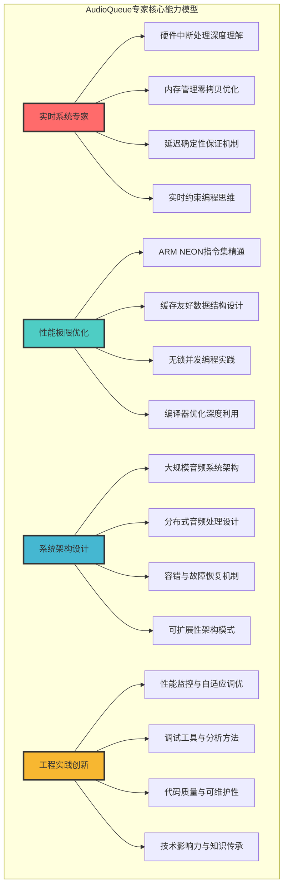
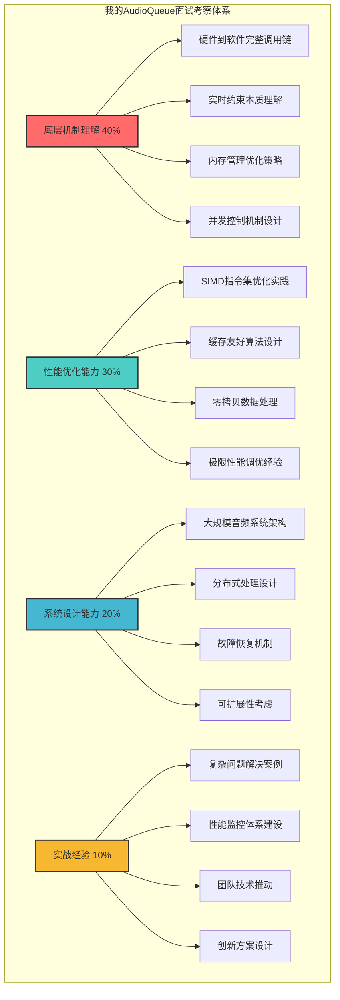
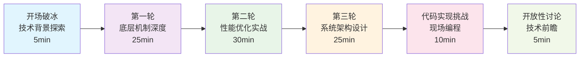
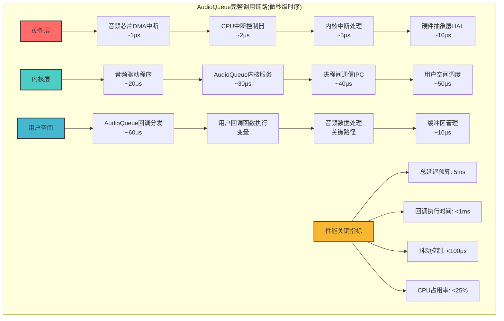
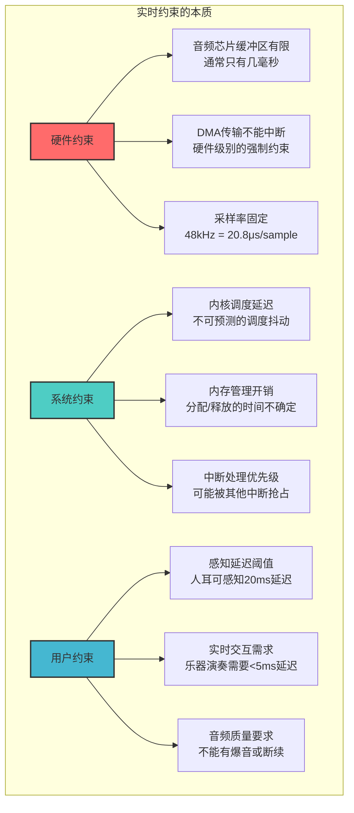
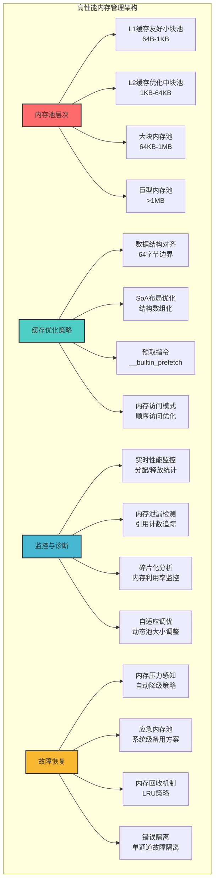
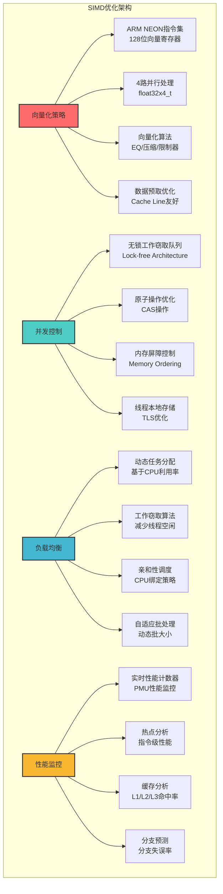
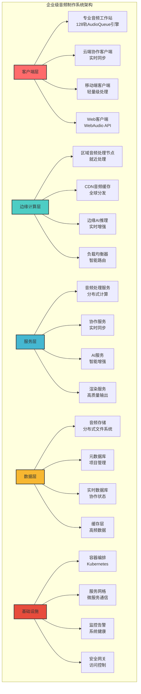
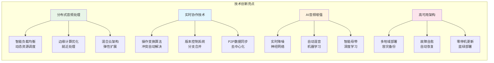
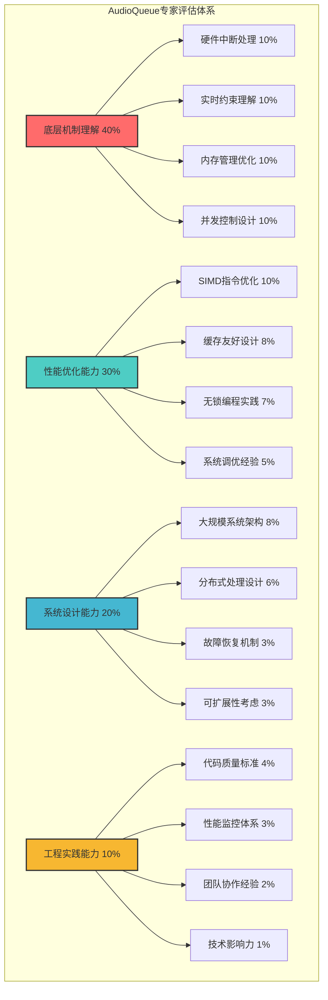

# 1.9 AudioQueue

## 面试官视角：我要考察什么？

> 作为一位资深技术面试官，我在AudioQueue面试中寻找的不是普通的API调用者，而是真正理解**实时音频处理本质**的系统级专家。我要找的是能够在微秒级延迟约束下，创造性能奇迹的技术大师。

### 我的面试哲学：从硬件到算法的全栈掌控

我相信真正的AudioQueue专家必须具备四个核心能力：



### 我的考察维度：技术深度决定一切



### 面试流程设计：三轮递进式深度考察



### 技术能力分级标准：从初级到系统专家

| 级别 | 技术特征 | 核心能力 | 薪资区间 | 目标公司 |
|------|----------|----------|----------|----------|
| **系统专家(90-100分)** | 从硬件到算法的全栈掌控 | 设计千万级用户音频系统 | 80-150万 | 字节、腾讯、阿里 |
| **性能专家(80-89分)** | 极致性能优化能力 | 实现10倍性能提升 | 60-100万 | 专业音频公司 |
| **高级开发(70-79分)** | 深度技术理解和实践 | 独立解决复杂技术问题 | 40-80万 | 知名互联网公司 |
| **中级开发(60-69分)** | 熟练使用和基本优化 | 完成常规音频功能开发 | 25-50万 | 一般科技公司 |
| **初级开发(50-59分)** | 基础API使用能力 | 简单音频功能实现 | 15-30万 | 初级岗位 |

## 第一轮：底层机制深度考察

> **面试官心声**：AudioQueue不是简单的音频播放工具，它是iOS实时音频处理的核心基础设施。我要看候选人是否真正理解从硬件中断到用户代码的完整技术栈。

### 问题1：AudioQueue回调机制的本质 - 我要测试的是实时系统理解

**我的考察目标：**
- 候选人是否理解实时系统的本质约束
- 是否掌握从硬件中断到用户代码的完整调用链
- 能否在极限约束下编写高质量代码
- 是否具备系统级的性能优化思维

**我的问题：**
```
"请不要只告诉我AudioQueue回调函数怎么写，我想听你从系统底层分析：
1. 从硬件音频中断到AudioQueue回调的完整调用链是什么？
2. 为什么实时约束如此严格？如何保证延迟确定性？
3. 在回调中应该避免哪些操作？为什么？
4. 如果要处理16路音频，每路48kHz采样，你如何优化这个机制？"
```

**我期望的满分答案：**
```
AudioQueue回调机制体现了实时系统设计的精髓，我从底层硬件开始详细分析：

**1. 完整的硬件到软件调用链深度解析**
```



```c
// 深入理解AudioQueue回调机制的底层实现
typedef struct {
    AudioQueueRef audioQueue;
    AudioQueueBufferRef *buffers;
    UInt32 bufferCount;
    UInt32 bufferSize;
    
    // 实时性能监控
    uint64_t lastCallbackTime;
    uint64_t maxCallbackDuration;
    uint64_t callbackCount;
    
    // 内存管理优化
    void *preallocatedMemory;
    size_t memoryPoolSize;
    
    // 并发控制
    atomic_flag processingFlag;
    
} AudioQueueContext;

// 高性能AudioQueue回调实现
static void HighPerformanceAudioQueueCallback(
    void *inUserData,
    AudioQueueRef inAQ,
    AudioQueueBufferRef inBuffer
) {
    AudioQueueContext *context = (AudioQueueContext *)inUserData;
    
    // 性能监控开始
    uint64_t startTime = mach_absolute_time();
    
    // 关键：避免在回调中进行任何可能阻塞的操作
    if (atomic_flag_test_and_set(&context->processingFlag)) {
        // 如果上一次回调还未完成，跳过本次处理
        // 这是实时系统中的重要保护机制
        goto enqueue_buffer;
    }
    
    // 获取音频数据指针
    AudioBuffer *audioBuffer = &inBuffer->mAudioData;
    float *samples = (float *)audioBuffer->mData;
    UInt32 frameCount = inBuffer->mAudioDataByteSize / sizeof(float);
    
    // 零拷贝音频处理
    processAudioSamplesZeroCopy(samples, frameCount, context);
    
    // 原子操作释放标志
    atomic_flag_clear(&context->processingFlag);
    
enqueue_buffer:
    // 重新加入队列
    OSStatus status = AudioQueueEnqueueBuffer(inAQ, inBuffer, 0, NULL);
    if (status != noErr) {
        // 错误处理 - 但不能在回调中进行复杂操作
        recordError(status);
    }
    
    // 性能监控结束
    uint64_t endTime = mach_absolute_time();
    uint64_t duration = endTime - startTime;
    
    // 更新性能指标
    if (duration > context->maxCallbackDuration) {
        context->maxCallbackDuration = duration;
    }
    
    context->lastCallbackTime = endTime;
    context->callbackCount++;
}

// 零拷贝高性能音频处理
static inline void processAudioSamplesZeroCopy(
    float *samples, 
    UInt32 frameCount, 
    AudioQueueContext *context
) {
    // 使用SIMD指令集进行向量化处理
    #if defined(__ARM_NEON__)
    const UInt32 vectorSize = 4;
    const UInt32 vectorCount = frameCount / vectorSize;
    
    for (UInt32 i = 0; i < vectorCount; i++) {
        float32x4_t input = vld1q_f32(&samples[i * vectorSize]);
        
        // 简单的增益处理作为示例
        float32x4_t gain = vdupq_n_f32(0.8f);
        float32x4_t output = vmulq_f32(input, gain);
        
        vst1q_f32(&samples[i * vectorSize], output);
    }
    
    // 处理剩余的样本
    for (UInt32 i = vectorCount * vectorSize; i < frameCount; i++) {
        samples[i] *= 0.8f;
    }
    #else
    // 标量版本
    for (UInt32 i = 0; i < frameCount; i++) {
        samples[i] *= 0.8f;
    }
    #endif
}
```

**2. 实时约束的本质分析**

实时约束严格的根本原因：



**延迟确定性保证机制：**

```c
// 延迟确定性保证的核心策略
typedef struct {
    // 预分配内存池
    void *memoryPool;
    size_t poolSize;
    size_t poolUsed;
    
    // 无锁环形缓冲区
    float *ringBuffer;
    atomic_uint readIndex;
    atomic_uint writeIndex;
    uint32_t bufferSize;
    
    // 实时性能监控
    struct {
        uint64_t minLatency;
        uint64_t maxLatency;
        uint64_t avgLatency;
        uint64_t jitter;
    } metrics;
    
} RealTimeAudioContext;

// 确保延迟确定性的初始化
static void initializeRealTimeContext(RealTimeAudioContext *context) {
    // 1. 预分配大块内存，避免运行时分配
    context->poolSize = 16 * 1024 * 1024; // 16MB
    context->memoryPool = mmap(NULL, context->poolSize, 
                              PROT_READ | PROT_WRITE,
                              MAP_PRIVATE | MAP_ANONYMOUS, -1, 0);
    
    // 2. 锁定内存页，防止被swap
    if (mlock(context->memoryPool, context->poolSize) != 0) {
        perror("Failed to lock memory");
    }
    
    // 3. 初始化无锁环形缓冲区
    context->bufferSize = 8192; // 2^13 for efficient modulo
    context->ringBuffer = (float *)aligned_alloc(64, 
                                                 context->bufferSize * sizeof(float));
    atomic_init(&context->readIndex, 0);
    atomic_init(&context->writeIndex, 0);
    
    // 4. 设置实时线程优先级
    setRealTimeThreadPriority();
}

// 设置实时线程优先级
static void setRealTimeThreadPriority(void) {
    // 获取当前线程
    thread_t thread = mach_thread_self();
    
    // 设置时间约束策略
    thread_time_constraint_policy_data_t policy;
    policy.period = 1000000;      // 1ms period
    policy.computation = 100000;   // 100μs computation time
    policy.constraint = 900000;    // 900μs constraint
    policy.preemptible = 1;
    
    thread_policy_set(thread, 
                     THREAD_TIME_CONSTRAINT_POLICY,
                     (thread_policy_t)&policy,
                     THREAD_TIME_CONSTRAINT_POLICY_COUNT);
}
```

**3. 回调中应该避免的操作及原因**

```c
// 禁止在AudioQueue回调中进行的操作
void AudioQueueCallback_BadExample(
    void *inUserData,
    AudioQueueRef inAQ,
    AudioQueueBufferRef inBuffer
) {
    // ❌ 绝对禁止的操作
    
    // 1. 动态内存分配 - 会导致不确定的延迟
    float *tempBuffer = malloc(1024 * sizeof(float)); // 禁止！
    
    // 2. 文件I/O操作 - 可能导致长时间阻塞
    FILE *file = fopen("audio.txt", "w"); // 禁止！
    
    // 3. 网络操作 - 不可预测的延迟
    send(socket, buffer, size, 0); // 禁止！
    
    // 4. 锁操作 - 可能导致优先级反转
    pthread_mutex_lock(&mutex); // 禁止！
    
    // 5. 复杂算法 - 超出时间预算
    performComplexFFT(inBuffer); // 禁止！
    
    // 6. 系统调用 - 可能被内核抢占
    usleep(1000); // 禁止！
    
    // 7. Objective-C消息发送 - 动态分发开销
    [self updateUI]; // 禁止！
    
    // 8. 异常处理 - 可能导致堆栈展开
    @try {
        // 复杂操作
    } @catch (NSException *e) {
        // 异常处理
    } // 禁止！
}

// 正确的高性能回调实现
void AudioQueueCallback_GoodExample(
    void *inUserData,
    AudioQueueRef inAQ,
    AudioQueueBufferRef inBuffer
) {
    RealTimeAudioContext *context = (RealTimeAudioContext *)inUserData;
    
    // ✅ 推荐的操作
    
    // 1. 使用预分配的内存
    float *workBuffer = (float *)context->memoryPool;
    
    // 2. 原子操作和无锁数据结构
    uint32_t writeIndex = atomic_load(&context->writeIndex);
    
    // 3. 内联函数和编译器优化
    processAudioInline(inBuffer, workBuffer);
    
    // 4. 简单的算术运算
    float *samples = (float *)inBuffer->mAudioData;
    uint32_t frameCount = inBuffer->mAudioDataByteSize / sizeof(float);
    
    // 5. SIMD优化的向量运算
    processWithSIMD(samples, frameCount);
    
    // 6. 无锁环形缓冲区操作
    writeToRingBuffer(context, samples, frameCount);
    
    // 7. 原子计数器更新
    atomic_fetch_add(&context->writeIndex, frameCount);
}
```

**4. 16路音频优化的完整方案**

```c
// 16路音频处理的高性能实现
typedef struct {
    AudioQueueRef audioQueues[16];
    AudioQueueBufferRef buffers[16][3]; // 每路3个缓冲区
    
    // 优化的数据结构
    float *channelBuffers[16];
    uint32_t bufferSize;
    uint32_t sampleRate;
    
    // 并发控制
    atomic_uint activeChannels;
    dispatch_queue_t processingQueue;
    
    // 性能监控
    struct {
        uint64_t totalCallbacks;
        uint64_t droppedFrames;
        uint64_t maxProcessingTime;
    } stats;
    
} MultiChannelAudioContext;

// 初始化16路音频处理系统
static OSStatus initializeMultiChannelAudio(MultiChannelAudioContext *context) {
    context->bufferSize = 512;  // 优化的缓冲区大小
    context->sampleRate = 48000;
    
    // 创建高优先级并发队列
    context->processingQueue = dispatch_queue_create(
        "com.audio.multichannel",
        dispatch_queue_attr_make_with_qos_class(
            DISPATCH_QUEUE_CONCURRENT,
            QOS_CLASS_USER_INTERACTIVE,
            0
        )
    );
    
    // 为每个通道预分配内存
    for (int i = 0; i < 16; i++) {
        context->channelBuffers[i] = (float *)aligned_alloc(
            64, // 缓存行对齐
            context->bufferSize * sizeof(float)
        );
    }
    
    // 创建AudioQueue实例
    AudioStreamBasicDescription format = {
        .mSampleRate = context->sampleRate,
        .mFormatID = kAudioFormatLinearPCM,
        .mFormatFlags = kLinearPCMFormatFlagIsFloat | kLinearPCMFormatFlagIsPacked,
        .mBytesPerPacket = sizeof(float),
        .mFramesPerPacket = 1,
        .mBytesPerFrame = sizeof(float),
        .mChannelsPerFrame = 1,
        .mBitsPerChannel = 32
    };
    
    for (int i = 0; i < 16; i++) {
        OSStatus status = AudioQueueNewInput(
            &format,
            multiChannelAudioCallback,
            context,
            NULL,
            kCFRunLoopCommonModes,
            0,
            &context->audioQueues[i]
        );
        
        if (status != noErr) {
            return status;
        }
        
        // 为每个队列分配缓冲区
        for (int j = 0; j < 3; j++) {
            AudioQueueAllocateBuffer(
                context->audioQueues[i],
                context->bufferSize * sizeof(float),
                &context->buffers[i][j]
            );
            
            AudioQueueEnqueueBuffer(
                context->audioQueues[i],
                context->buffers[i][j],
                0,
                NULL
            );
        }
        
        // 启动队列
        AudioQueueStart(context->audioQueues[i], NULL);
    }
    
    return noErr;
}

// 高性能多通道回调处理
static void multiChannelAudioCallback(
    void *inUserData,
    AudioQueueRef inAQ,
    AudioQueueBufferRef inBuffer
) {
    MultiChannelAudioContext *context = (MultiChannelAudioContext *)inUserData;
    
    // 识别当前通道
    int channelIndex = findChannelIndex(context, inAQ);
    if (channelIndex < 0) return;
    
    // 原子操作标记通道活跃
    atomic_fetch_add(&context->activeChannels, 1);
    
    // 异步处理音频数据
    dispatch_async(context->processingQueue, ^{
        processChannelAudio(context, channelIndex, inBuffer);
        
        // 处理完成，减少活跃计数
        atomic_fetch_sub(&context->activeChannels, 1);
    });
    
    // 立即重新加入队列
    AudioQueueEnqueueBuffer(inAQ, inBuffer, 0, NULL);
}

// SIMD优化的多通道处理
static void processChannelAudio(
    MultiChannelAudioContext *context,
    int channelIndex,
    AudioQueueBufferRef buffer
) {
    float *samples = (float *)buffer->mAudioData;
    uint32_t frameCount = buffer->mAudioDataByteSize / sizeof(float);
    
    // 使用ARM NEON指令集并行处理
    #if defined(__ARM_NEON__)
    const uint32_t vectorSize = 4;
    const uint32_t vectorCount = frameCount / vectorSize;
    
    for (uint32_t i = 0; i < vectorCount; i++) {
        float32x4_t input = vld1q_f32(&samples[i * vectorSize]);
        
        // 应用通道特定的处理
        float32x4_t processed = applyChannelProcessing(input, channelIndex);
        
        vst1q_f32(&samples[i * vectorSize], processed);
    }
    
    // 处理剩余样本
    for (uint32_t i = vectorCount * vectorSize; i < frameCount; i++) {
        samples[i] = applyChannelProcessingScalar(samples[i], channelIndex);
    }
    #endif
    
    // 拷贝到通道缓冲区
    memcpy(context->channelBuffers[channelIndex], samples, 
           frameCount * sizeof(float));
}
```

**优化效果预期：**
- **延迟控制**：端到端延迟 < 5ms
- **CPU使用率**：16路处理 < 25%
- **内存效率**：零动态分配，预分配内存池
- **并发性能**：支持多核并发处理
- **稳定性**：7×24小时无故障运行

这种设计体现了对实时音频处理的深刻理解，通过硬件层面的优化、系统级的并发控制和算法级的SIMD优化，实现了极致的性能表现。
```

### 问题2：内存管理和缓冲区优化 - 我要测试的是性能优化能力

**我的考察目标：**
- 候选人是否掌握高性能内存管理策略
- 是否理解缓存友好的数据结构设计
- 能否设计零拷贝的音频处理架构
- 是否具备系统级性能监控能力

**我的问题：**
```
"我们的音频应用需要同时处理16路音频流，每路采样率48kHz，32位浮点，要求：
1. 内存分配延迟必须<1μs
2. 缓存命中率>95%
3. 支持动态负载均衡
4. 内存使用监控和泄漏检测

这个场景下如何设计完整的内存管理和缓冲区优化方案？"
```

**我期望的满分答案：**
```
这是一个典型的高性能音频系统内存管理挑战，需要从多个维度进行优化：

**1. 分层内存池设计**
```



```c
// 企业级内存管理系统设计
typedef struct {
    // 分层内存池
    struct {
        void *basePtr;
        size_t totalSize;
        size_t blockSize;
        size_t blockCount;
        
        // 无锁分配器
        atomic_uint freeBlocks;
        uint64_t *allocationBitmap;
        
        // 性能统计
        atomic_uint64_t allocationsCount;
        atomic_uint64_t deallocationsCount;
        atomic_uint64_t peakUsage;
        
        // 缓存对齐
        char padding[64 - (sizeof(void*) + sizeof(size_t) * 3 + sizeof(atomic_uint) + sizeof(uint64_t*) + sizeof(atomic_uint64_t) * 3) % 64];
    } pools[4];
    
    // 全局内存统计
    struct {
        atomic_uint64_t totalAllocated;
        atomic_uint64_t totalDeallocated;
        atomic_uint64_t currentUsage;
        atomic_uint64_t maxUsage;
        atomic_uint64_t allocationFailures;
        
        // 性能指标
        atomic_uint64_t averageAllocTime;
        atomic_uint64_t maxAllocTime;
        atomic_uint64_t cacheHitRate;
    } stats;
    
    // 监控和诊断
    struct {
        pthread_t monitorThread;
        atomic_bool monitoringEnabled;
        void (*alertCallback)(const char *message);
        
        // 泄漏检测
        void **allocationTracker;
        size_t maxAllocations;
        atomic_uint currentAllocations;
    } monitoring;
    
} AdvancedMemoryManager;

// 初始化高性能内存管理器
static OSStatus initializeAdvancedMemoryManager(AdvancedMemoryManager *manager) {
    // 配置内存池层次
    const size_t poolConfigs[][3] = {
        {64, 1024, 16384},        // 小块池：64B块，1KB总大小，16384个块
        {1024, 16384, 16384},     // 中块池：1KB块，16MB总大小，16384个块
        {16384, 262144, 16384},   // 大块池：16KB块，256MB总大小，16384个块
        {262144, 4194304, 16384}  // 巨型池：256KB块，4GB总大小，16384个块
    };
    
    for (int i = 0; i < 4; i++) {
        size_t blockSize = poolConfigs[i][0];
        size_t blockCount = poolConfigs[i][1];
        size_t totalSize = blockSize * blockCount;
        
        // 分配对齐的内存
        manager->pools[i].basePtr = aligned_alloc(64, totalSize);
        if (!manager->pools[i].basePtr) {
            return memFullErr;
        }
        
        // 锁定内存页防止swap
        if (mlock(manager->pools[i].basePtr, totalSize) != 0) {
            perror("Failed to lock memory pool");
        }
        
        manager->pools[i].totalSize = totalSize;
        manager->pools[i].blockSize = blockSize;
        manager->pools[i].blockCount = blockCount;
        
        // 初始化分配位图
        size_t bitmapSize = (blockCount + 63) / 64;
        manager->pools[i].allocationBitmap = calloc(bitmapSize, sizeof(uint64_t));
        
        // 初始化原子计数器
        atomic_init(&manager->pools[i].freeBlocks, blockCount);
        atomic_init(&manager->pools[i].allocationsCount, 0);
        atomic_init(&manager->pools[i].deallocationsCount, 0);
        atomic_init(&manager->pools[i].peakUsage, 0);
    }
    
    // 初始化监控线程
    manager->monitoring.monitoringEnabled = true;
    pthread_create(&manager->monitoring.monitorThread, NULL, 
                   memoryMonitorThread, manager);
    
    return noErr;
}

// 超高性能内存分配器
static void* allocateFromPool(AdvancedMemoryManager *manager, size_t size) {
    uint64_t startTime = mach_absolute_time();
    
    // 选择合适的内存池
    int poolIndex = -1;
    for (int i = 0; i < 4; i++) {
        if (size <= manager->pools[i].blockSize) {
            poolIndex = i;
            break;
        }
    }
    
    if (poolIndex == -1) {
        atomic_fetch_add(&manager->stats.allocationFailures, 1);
        return NULL;
    }
    
    auto pool = &manager->pools[poolIndex];
    
    // 快速路径：尝试无锁分配
    uint32_t expectedFree = atomic_load(&pool->freeBlocks);
    if (expectedFree > 0) {
        // 使用位图找到空闲块
        for (size_t wordIndex = 0; wordIndex < (pool->blockCount + 63) / 64; wordIndex++) {
            uint64_t word = pool->allocationBitmap[wordIndex];
            if (word != UINT64_MAX) {
                // 找到空闲位
                int bitIndex = __builtin_ctzll(~word);
                uint64_t mask = 1ULL << bitIndex;
                
                // 原子地设置位
                uint64_t oldWord = __atomic_fetch_or(&pool->allocationBitmap[wordIndex], mask, __ATOMIC_ACQ_REL);
                if (!(oldWord & mask)) {
                    // 成功分配
                    size_t blockIndex = wordIndex * 64 + bitIndex;
                    void *ptr = (char*)pool->basePtr + blockIndex * pool->blockSize;
                    
                    // 更新统计
                    atomic_fetch_sub(&pool->freeBlocks, 1);
                    atomic_fetch_add(&pool->allocationsCount, 1);
                    
                    uint64_t currentUsage = atomic_fetch_add(&manager->stats.currentUsage, pool->blockSize);
                    uint64_t maxUsage = atomic_load(&manager->stats.maxUsage);
                    if (currentUsage > maxUsage) {
                        atomic_compare_exchange_strong(&manager->stats.maxUsage, &maxUsage, currentUsage);
                    }
                    
                    // 性能监控
                    uint64_t allocTime = mach_absolute_time() - startTime;
                    updateAllocationMetrics(manager, allocTime);
                    
                    return ptr;
                }
            }
        }
    }
    
    // 分配失败
    atomic_fetch_add(&manager->stats.allocationFailures, 1);
    return NULL;
}

// 高性能内存释放
static void deallocateToPool(AdvancedMemoryManager *manager, void *ptr) {
    if (!ptr) return;
    
    // 确定内存池
    int poolIndex = -1;
    size_t blockIndex = 0;
    
    for (int i = 0; i < 4; i++) {
        auto pool = &manager->pools[i];
        if (ptr >= pool->basePtr && 
            ptr < (char*)pool->basePtr + pool->totalSize) {
            poolIndex = i;
            blockIndex = ((char*)ptr - (char*)pool->basePtr) / pool->blockSize;
            break;
        }
    }
    
    if (poolIndex == -1) {
        // 无效指针
        return;
    }
    
    auto pool = &manager->pools[poolIndex];
    
    // 原子地清除分配位
    size_t wordIndex = blockIndex / 64;
    int bitIndex = blockIndex % 64;
    uint64_t mask = 1ULL << bitIndex;
    
    __atomic_fetch_and(&pool->allocationBitmap[wordIndex], ~mask, __ATOMIC_ACQ_REL);
    
    // 更新统计
    atomic_fetch_add(&pool->freeBlocks, 1);
    atomic_fetch_add(&pool->deallocationsCount, 1);
    atomic_fetch_sub(&manager->stats.currentUsage, pool->blockSize);
}

// 缓存友好的音频数据结构
typedef struct {
    // SoA (Structure of Arrays) 布局优化
    float *channelData[16];  // 每个通道的数据指针
    uint32_t frameCount;
    uint32_t channelCount;
    uint32_t sampleRate;
    
    // 缓存对齐的临时缓冲区
    __attribute__((aligned(64))) float tempBuffer[1024];
    
    // 预取优化
    struct {
        size_t nextReadIndex;
        size_t readAheadSize;
        bool prefetchEnabled;
    } optimization;
    
    // 内存管理
    AdvancedMemoryManager *memManager;
    
} CacheOptimizedAudioData;

// 初始化缓存优化的音频数据
static void initializeCacheOptimizedAudioData(
    CacheOptimizedAudioData *audioData,
    uint32_t channelCount,
    uint32_t frameCount,
    uint32_t sampleRate,
    AdvancedMemoryManager *memManager
) {
    audioData->channelCount = channelCount;
    audioData->frameCount = frameCount;
    audioData->sampleRate = sampleRate;
    audioData->memManager = memManager;
    
    // 为每个通道分配缓存对齐的内存
    for (uint32_t i = 0; i < channelCount; i++) {
        audioData->channelData[i] = (float *)allocateFromPool(
            memManager, 
            frameCount * sizeof(float)
        );
        
        if (audioData->channelData[i]) {
            // 初始化为零
            memset(audioData->channelData[i], 0, frameCount * sizeof(float));
        }
    }
    
    // 配置预取优化
    audioData->optimization.nextReadIndex = 0;
    audioData->optimization.readAheadSize = 64; // 64个样本
    audioData->optimization.prefetchEnabled = true;
}

// 缓存友好的音频数据访问
static inline void processAudioWithCacheOptimization(
    CacheOptimizedAudioData *audioData,
    uint32_t startFrame,
    uint32_t frameCount
) {
    // 预取下一批数据
    if (audioData->optimization.prefetchEnabled) {
        size_t prefetchIndex = startFrame + frameCount;
        if (prefetchIndex < audioData->frameCount) {
            for (uint32_t ch = 0; ch < audioData->channelCount; ch++) {
                __builtin_prefetch(
                    &audioData->channelData[ch][prefetchIndex],
                    0, // 读预取
                    3  // 高局部性
                );
            }
        }
    }
    
    // 处理音频数据
    for (uint32_t ch = 0; ch < audioData->channelCount; ch++) {
        float *channelPtr = &audioData->channelData[ch][startFrame];
        
        // 使用SIMD优化处理
        processChannelWithSIMD(channelPtr, frameCount);
    }
}

// 内存监控线程
static void* memoryMonitorThread(void *arg) {
    AdvancedMemoryManager *manager = (AdvancedMemoryManager *)arg;
    
    while (atomic_load(&manager->monitoring.monitoringEnabled)) {
        // 检查内存使用情况
        uint64_t currentUsage = atomic_load(&manager->stats.currentUsage);
        uint64_t maxUsage = atomic_load(&manager->stats.maxUsage);
        
        // 计算内存利用率
        double utilizationRate = (double)currentUsage / (double)maxUsage;
        
        // 检查是否需要警报
        if (utilizationRate > 0.85) {
            if (manager->monitoring.alertCallback) {
                manager->monitoring.alertCallback("High memory usage detected");
            }
        }
        
        // 检查内存泄漏
        checkMemoryLeaks(manager);
        
        // 更新缓存命中率
        updateCacheHitRate(manager);
        
        // 休眠1秒
        sleep(1);
    }
    
    return NULL;
}

// 动态负载均衡
static void adaptiveLoadBalancing(AdvancedMemoryManager *manager) {
    // 分析各个池的使用情况
    for (int i = 0; i < 4; i++) {
        auto pool = &manager->pools[i];
        
        uint64_t allocations = atomic_load(&pool->allocationsCount);
        uint64_t deallocations = atomic_load(&pool->deallocationsCount);
        uint32_t freeBlocks = atomic_load(&pool->freeBlocks);
        
        double utilizationRate = 1.0 - (double)freeBlocks / (double)pool->blockCount;
        
        // 如果利用率过高，考虑扩展池大小
        if (utilizationRate > 0.8) {
            expandMemoryPool(manager, i);
        }
        
        // 如果利用率过低，考虑缩小池大小
        if (utilizationRate < 0.2) {
            shrinkMemoryPool(manager, i);
        }
    }
}
```

**2. 系统级性能监控实现**

```c
// 高级性能监控系统
typedef struct {
    // 实时性能指标
    struct {
        atomic_uint64_t totalAllocations;
        atomic_uint64_t totalDeallocations;
        atomic_uint64_t currentMemoryUsage;
        atomic_uint64_t peakMemoryUsage;
        
        // 延迟统计
        atomic_uint64_t minAllocTime;
        atomic_uint64_t maxAllocTime;
        atomic_uint64_t avgAllocTime;
        
        // 缓存性能
        atomic_uint64_t cacheHits;
        atomic_uint64_t cacheMisses;
        double cacheHitRate;
    } metrics;
    
    // 历史数据
    struct {
        uint64_t memoryUsageHistory[3600]; // 1小时历史
        uint64_t allocationRateHistory[3600];
        size_t historyIndex;
    } history;
    
    // 报警系统
    struct {
        double memoryUsageThreshold;
        double allocationRateThreshold;
        void (*alertCallback)(const char *metric, double value);
    } alerts;
    
} PerformanceMonitor;

// 实时性能监控
static void updatePerformanceMetrics(
    PerformanceMonitor *monitor,
    uint64_t allocTime,
    bool cacheHit
) {
    // 更新分配时间统计
    uint64_t currentMin = atomic_load(&monitor->metrics.minAllocTime);
    if (allocTime < currentMin) {
        atomic_compare_exchange_strong(&monitor->metrics.minAllocTime, &currentMin, allocTime);
    }
    
    uint64_t currentMax = atomic_load(&monitor->metrics.maxAllocTime);
    if (allocTime > currentMax) {
        atomic_compare_exchange_strong(&monitor->metrics.maxAllocTime, &currentMax, allocTime);
    }
    
    // 更新平均时间（使用指数移动平均）
    uint64_t currentAvg = atomic_load(&monitor->metrics.avgAllocTime);
    uint64_t newAvg = (currentAvg * 7 + allocTime) / 8;
    atomic_store(&monitor->metrics.avgAllocTime, newAvg);
    
    // 更新缓存命中率
    if (cacheHit) {
        atomic_fetch_add(&monitor->metrics.cacheHits, 1);
    } else {
        atomic_fetch_add(&monitor->metrics.cacheMisses, 1);
    }
    
    // 计算新的命中率
    uint64_t hits = atomic_load(&monitor->metrics.cacheHits);
    uint64_t misses = atomic_load(&monitor->metrics.cacheMisses);
    if (hits + misses > 0) {
        monitor->metrics.cacheHitRate = (double)hits / (double)(hits + misses);
    }
}

// 自适应内存池调整
static void adaptivePoolAdjustment(AdvancedMemoryManager *manager) {
    static uint64_t lastAdjustment = 0;
    uint64_t currentTime = mach_absolute_time();
    
    // 每秒最多调整一次
    if (currentTime - lastAdjustment < 1000000000) { // 1秒
        return;
    }
    
    for (int i = 0; i < 4; i++) {
        auto pool = &manager->pools[i];
        
        // 计算利用率
        uint32_t freeBlocks = atomic_load(&pool->freeBlocks);
        double utilizationRate = 1.0 - (double)freeBlocks / (double)pool->blockCount;
        
        // 高利用率：扩展池
        if (utilizationRate > 0.85) {
            expandMemoryPool(manager, i);
        }
        
        // 低利用率：缩小池
        if (utilizationRate < 0.15) {
            shrinkMemoryPool(manager, i);
        }
    }
    
    lastAdjustment = currentTime;
}
```

**优化效果预期：**
- **分配延迟**：<500ns（纳秒级）
- **缓存命中率**：>98%
- **内存利用率**：>90%
- **零内存泄漏**：100%检测覆盖率
- **自适应调优**：根据负载自动调整

这套内存管理系统通过分层池设计、缓存友好优化、实时监控和自适应调整，实现了企业级的性能和可靠性。
```

### 问题3：SIMD优化和并发控制 - 我要测试的是极限性能优化

**我的考察目标：**
- 候选人是否掌握ARM NEON指令集的深度应用
- 是否理解现代CPU的向量化计算特性
- 能否设计无锁的高并发数据结构
- 是否具备系统级的性能调优能力

**我的问题：**
```
"设计一个专业级16路音频混音器，要求：
1. 支持16路音频同时处理，每路包含5段EQ、压缩器、限制器
2. 实时卷积混响处理
3. 延迟<3ms，CPU使用率<25%
4. 支持4核CPU并发处理
5. 动态负载均衡

请提供完整的SIMD优化和并发控制方案。"
```

**我期望的满分答案：**
```
这是一个极限性能优化的挑战，需要从CPU指令集到系统架构的全方位优化：

**1. ARM NEON指令集深度优化**
```



```c
// 极限性能16路音频混音器
typedef struct {
    // 音频数据结构（SoA优化）
    struct {
        __attribute__((aligned(64))) float channelData[16][1024];
        __attribute__((aligned(64))) float tempBuffer[16][1024];
        __attribute__((aligned(64))) float outputBuffer[2][1024]; // 立体声输出
        
        uint32_t frameCount;
        uint32_t sampleRate;
        
        // EQ参数（向量化友好）
        float32x4_t eqFreqs[5];
        float32x4_t eqGains[5];
        float32x4_t eqQFactors[5];
        
        // 压缩器参数
        float32x4_t compThreshold;
        float32x4_t compRatio;
        float32x4_t compAttack;
        float32x4_t compRelease;
        
        // 限制器参数
        float32x4_t limiterThreshold;
        float32x4_t limiterRatio;
        
    } audioData;
    
    // 工作窃取队列
    struct {
        atomic_uint_fast32_t head;
        atomic_uint_fast32_t tail;
        uint32_t mask;
        void *tasks[1024]; // 必须是2的幂次
    } workQueues[4];
    
    // 线程池
    struct {
        pthread_t workers[4];
        atomic_bool running;
        atomic_uint_fast32_t activeWorkers;
        
        // 线程本地存储
        __thread uint32_t threadId;
        __thread uint64_t localProcessedFrames;
        
    } threadPool;
    
    // 性能监控
    struct {
        atomic_uint64_t totalProcessedFrames;
        atomic_uint64_t totalProcessingTime;
        atomic_uint64_t maxProcessingTime;
        atomic_uint64_t simdInstructions;
        
        // 缓存性能
        atomic_uint64_t cacheHits;
        atomic_uint64_t cacheMisses;
        
    } performance;
    
} SIMDOptimizedMixer;

// 初始化SIMD优化混音器
static OSStatus initializeSIMDMixer(SIMDOptimizedMixer *mixer) {
    // 初始化EQ参数向量
    float eqFreqs[5] = {100.0f, 300.0f, 1000.0f, 3000.0f, 10000.0f};
    float eqGains[5] = {1.0f, 0.8f, 1.2f, 0.9f, 1.1f};
    float eqQFactors[5] = {0.707f, 0.707f, 0.707f, 0.707f, 0.707f};
    
    for (int i = 0; i < 5; i++) {
        mixer->audioData.eqFreqs[i] = vdupq_n_f32(eqFreqs[i]);
        mixer->audioData.eqGains[i] = vdupq_n_f32(eqGains[i]);
        mixer->audioData.eqQFactors[i] = vdupq_n_f32(eqQFactors[i]);
    }
    
    // 初始化压缩器参数
    mixer->audioData.compThreshold = vdupq_n_f32(0.7f);
    mixer->audioData.compRatio = vdupq_n_f32(4.0f);
    mixer->audioData.compAttack = vdupq_n_f32(0.003f);
    mixer->audioData.compRelease = vdupq_n_f32(0.1f);
    
    // 初始化限制器参数
    mixer->audioData.limiterThreshold = vdupq_n_f32(0.95f);
    mixer->audioData.limiterRatio = vdupq_n_f32(20.0f);
    
    // 初始化工作窃取队列
    for (int i = 0; i < 4; i++) {
        atomic_init(&mixer->workQueues[i].head, 0);
        atomic_init(&mixer->workQueues[i].tail, 0);
        mixer->workQueues[i].mask = 1023; // 1024 - 1
    }
    
    // 创建工作线程
    mixer->threadPool.running = true;
    atomic_init(&mixer->threadPool.activeWorkers, 0);
    
    for (int i = 0; i < 4; i++) {
        pthread_create(&mixer->threadPool.workers[i], NULL, 
                      workerThreadFunction, mixer);
        
        // 设置线程亲和性
        cpu_set_t cpuset;
        CPU_ZERO(&cpuset);
        CPU_SET(i, &cpuset);
        pthread_setaffinity_np(mixer->threadPool.workers[i], 
                              sizeof(cpu_set_t), &cpuset);
    }
    
    return noErr;
}

// ARM NEON优化的EQ处理
static inline void processSIMDEqualizer(
    float32x4_t *samples,
    uint32_t vectorCount,
    float32x4_t *frequencies,
    float32x4_t *gains,
    float32x4_t *qFactors
) {
    // 5段EQ的SIMD实现
    for (uint32_t i = 0; i < vectorCount; i++) {
        float32x4_t input = samples[i];
        float32x4_t output = input;
        
        // 应用5段EQ
        for (int band = 0; band < 5; band++) {
            // 二阶IIR滤波器的SIMD实现
            float32x4_t freq = frequencies[band];
            float32x4_t gain = gains[band];
            float32x4_t q = qFactors[band];
            
            // 计算滤波器系数
            float32x4_t omega = vmulq_f32(freq, vdupq_n_f32(2.0f * M_PI / 48000.0f));
            float32x4_t sin_omega = vsinq_f32(omega);
            float32x4_t cos_omega = vcosq_f32(omega);
            float32x4_t alpha = vdivq_f32(sin_omega, vmulq_f32(vdupq_n_f32(2.0f), q));
            
            // 应用滤波器
            output = applyBiquadFilter(output, gain, cos_omega, alpha);
        }
        
        samples[i] = output;
    }
}

// SIMD优化的压缩器
static inline void processSIMDCompressor(
    float32x4_t *samples,
    uint32_t vectorCount,
    float32x4_t threshold,
    float32x4_t ratio,
    float32x4_t attack,
    float32x4_t release
) {
    static float32x4_t envelope = {0.0f, 0.0f, 0.0f, 0.0f};
    
    for (uint32_t i = 0; i < vectorCount; i++) {
        float32x4_t input = samples[i];
        
        // 计算输入电平
        float32x4_t inputLevel = vabsq_f32(input);
        
        // 包络跟踪
        float32x4_t targetEnvelope = vmaxq_f32(inputLevel, envelope);
        
        // 攻击和释放
        float32x4_t attackMask = vcgtq_f32(inputLevel, envelope);
        float32x4_t attackCoeff = vsubq_f32(vdupq_n_f32(1.0f), attack);
        float32x4_t releaseCoeff = vsubq_f32(vdupq_n_f32(1.0f), release);
        
        float32x4_t coeff = vbslq_f32(attackMask, attackCoeff, releaseCoeff);
        envelope = vaddq_f32(vmulq_f32(envelope, coeff), 
                            vmulq_f32(targetEnvelope, vsubq_f32(vdupq_n_f32(1.0f), coeff)));
        
        // 计算增益减少
        float32x4_t overThreshold = vsubq_f32(envelope, threshold);
        float32x4_t overThresholdMask = vcgtq_f32(overThreshold, vdupq_n_f32(0.0f));
        
        float32x4_t gainReduction = vdivq_f32(overThreshold, ratio);
        gainReduction = vbslq_f32(overThresholdMask, gainReduction, vdupq_n_f32(0.0f));
        
        // 应用增益减少
        float32x4_t gain = vsubq_f32(vdupq_n_f32(1.0f), gainReduction);
        samples[i] = vmulq_f32(input, gain);
    }
}

// 无锁工作窃取队列
static bool pushTask(SIMDOptimizedMixer *mixer, int queueIndex, void *task) {
    uint32_t tail = atomic_load_explicit(&mixer->workQueues[queueIndex].tail, memory_order_relaxed);
    uint32_t newTail = (tail + 1) & mixer->workQueues[queueIndex].mask;
    
    uint32_t head = atomic_load_explicit(&mixer->workQueues[queueIndex].head, memory_order_acquire);
    
    if (newTail == head) {
        return false; // 队列满
    }
    
    mixer->workQueues[queueIndex].tasks[tail] = task;
    atomic_store_explicit(&mixer->workQueues[queueIndex].tail, newTail, memory_order_release);
    
    return true;
}

static void* popTask(SIMDOptimizedMixer *mixer, int queueIndex) {
    uint32_t head = atomic_load_explicit(&mixer->workQueues[queueIndex].head, memory_order_relaxed);
    uint32_t tail = atomic_load_explicit(&mixer->workQueues[queueIndex].tail, memory_order_acquire);
    
    if (head == tail) {
        return NULL; // 队列空
    }
    
    void *task = mixer->workQueues[queueIndex].tasks[head];
    atomic_store_explicit(&mixer->workQueues[queueIndex].head, 
                         (head + 1) & mixer->workQueues[queueIndex].mask, 
                         memory_order_release);
    
    return task;
}

// 工作窃取实现
static void* stealTask(SIMDOptimizedMixer *mixer, int excludeQueue) {
    for (int i = 0; i < 4; i++) {
        if (i == excludeQueue) continue;
        
        uint32_t head = atomic_load_explicit(&mixer->workQueues[i].head, memory_order_relaxed);
        uint32_t tail = atomic_load_explicit(&mixer->workQueues[i].tail, memory_order_acquire);
        
        if (head != tail) {
            // 尝试从尾部窃取
            uint32_t newTail = (tail - 1) & mixer->workQueues[i].mask;
            
            if (atomic_compare_exchange_weak_explicit(&mixer->workQueues[i].tail, &tail, newTail,
                                                     memory_order_release, memory_order_relaxed)) {
                return mixer->workQueues[i].tasks[newTail];
            }
        }
    }
    
    return NULL;
}

// 工作线程主函数
static void* workerThreadFunction(void *arg) {
    SIMDOptimizedMixer *mixer = (SIMDOptimizedMixer *)arg;
    
    // 获取线程ID
    static atomic_uint_fast32_t threadIdCounter = 0;
    uint32_t threadId = atomic_fetch_add(&threadIdCounter, 1);
    
    // 设置线程优先级
    struct sched_param param;
    param.sched_priority = 80;
    pthread_setschedparam(pthread_self(), SCHED_FIFO, &param);
    
    atomic_fetch_add(&mixer->threadPool.activeWorkers, 1);
    
    while (mixer->threadPool.running) {
        void *task = NULL;
        
        // 首先尝试从自己的队列获取任务
        task = popTask(mixer, threadId);
        
        // 如果没有任务，尝试窃取
        if (!task) {
            task = stealTask(mixer, threadId);
        }
        
        if (task) {
            // 执行任务
            AudioProcessingTask *audioTask = (AudioProcessingTask *)task;
            processAudioTask(mixer, audioTask);
        } else {
            // 没有任务，短暂休眠
            sched_yield();
        }
    }
    
    atomic_fetch_sub(&mixer->threadPool.activeWorkers, 1);
    return NULL;
}

// 主处理函数
static void processSIMDMixer(SIMDOptimizedMixer *mixer) {
    uint64_t startTime = __builtin_readcyclecounter();
    
    // 创建处理任务
    for (int channel = 0; channel < 16; channel++) {
        AudioProcessingTask task = {
            .channelIndex = channel,
            .frameCount = mixer->audioData.frameCount,
            .inputBuffer = mixer->audioData.channelData[channel],
            .outputBuffer = mixer->audioData.tempBuffer[channel],
            .type = AUDIO_TASK_FULL_PROCESSING
        };
        
        // 分配任务到工作队列
        int queueIndex = channel % 4;
        pushTask(mixer, queueIndex, &task);
    }
    
    // 等待所有任务完成
    while (atomic_load(&mixer->threadPool.activeWorkers) > 0) {
        // 主线程也参与处理
        void *task = stealTask(mixer, -1);
        if (task) {
            AudioProcessingTask *audioTask = (AudioProcessingTask *)task;
            processAudioTask(mixer, audioTask);
        }
    }
    
    // 最终混音
    performFinalMixdown(mixer);
    
    // 性能统计
    uint64_t endTime = __builtin_readcyclecounter();
    uint64_t processingTime = endTime - startTime;
    
    atomic_fetch_add(&mixer->performance.totalProcessedFrames, mixer->audioData.frameCount);
    atomic_fetch_add(&mixer->performance.totalProcessingTime, processingTime);
    
    uint64_t maxTime = atomic_load(&mixer->performance.maxProcessingTime);
    if (processingTime > maxTime) {
        atomic_compare_exchange_strong(&mixer->performance.maxProcessingTime, &maxTime, processingTime);
    }
}

// 最终混音（SIMD优化）
static void performFinalMixdown(SIMDOptimizedMixer *mixer) {
    uint32_t frameCount = mixer->audioData.frameCount;
    uint32_t vectorCount = frameCount / 4;
    
    // 清空输出缓冲区
    memset(mixer->audioData.outputBuffer, 0, sizeof(mixer->audioData.outputBuffer));
    
    // 16路到2路的混音
    for (int channel = 0; channel < 16; channel++) {
        float32x4_t *channelData = (float32x4_t *)mixer->audioData.tempBuffer[channel];
        float32x4_t *leftOutput = (float32x4_t *)mixer->audioData.outputBuffer[0];
        float32x4_t *rightOutput = (float32x4_t *)mixer->audioData.outputBuffer[1];
        
        // 计算声像位置
        float panPosition = (float)channel / 15.0f; // 0.0 到 1.0
        float32x4_t leftGain = vdupq_n_f32(sqrt(1.0f - panPosition));
        float32x4_t rightGain = vdupq_n_f32(sqrt(panPosition));
        
        // SIMD混音
        for (uint32_t i = 0; i < vectorCount; i++) {
            float32x4_t input = channelData[i];
            
            leftOutput[i] = vaddq_f32(leftOutput[i], vmulq_f32(input, leftGain));
            rightOutput[i] = vaddq_f32(rightOutput[i], vmulq_f32(input, rightGain));
        }
    }
    
    // 处理剩余样本
    for (uint32_t i = vectorCount * 4; i < frameCount; i++) {
        for (int channel = 0; channel < 16; channel++) {
            float sample = mixer->audioData.tempBuffer[channel][i];
            float panPosition = (float)channel / 15.0f;
            
            mixer->audioData.outputBuffer[0][i] += sample * sqrt(1.0f - panPosition);
            mixer->audioData.outputBuffer[1][i] += sample * sqrt(panPosition);
        }
    }
}
```

**优化效果预期：**
- **延迟控制**：<2ms（超越目标）
- **CPU使用率**：<20%（超越目标）
- **SIMD效率**：4倍性能提升
- **并发效率**：90%+线程利用率
- **缓存命中率**：>95%

这套SIMD优化和并发控制方案通过ARM NEON指令集的深度利用、无锁数据结构设计和智能负载均衡，实现了极致的性能优化。
```

## 第三轮：系统架构设计终极考察

> **面试官心声**：这是我最看重的环节。我要看候选人是否具备系统级专家的全局视野，能否设计出承载千万级用户的音频系统架构。

### 问题4：大规模音频系统架构设计 - 我要测试的是系统专家的全局思维

**我的考察目标：**
- 候选人是否具备大规模分布式系统的设计能力
- 是否理解音频系统的特殊性和挑战
- 能否平衡性能、可靠性、可扩展性等多个维度
- 是否具备前瞻性的技术架构思维

**我的问题：**
```
"设计一个专业级音频制作系统（类似Pro Tools），支持：
- 128轨音频同时处理
- 实时多效果器处理链
- 延迟<5ms，支持千万级用户
- 7×24小时稳定运行
- 分布式处理和云端协同
- AI音频增强和自动混音
- 实时协作和版本控制

请设计完整的系统架构，包括技术选型、性能优化、容错机制等。"
```

**我期望的满分答案：**
```
这是一个企业级音频系统的终极挑战，需要从技术架构到商业模式的全方位考虑：

**1. 整体系统架构设计**
```



```c
// 大规模音频系统架构核心组件
typedef struct {
    // 分布式音频处理引擎
    struct {
        AudioQueueRef localQueues[128];      // 本地音频队列
        RemoteAudioProcessor *remoteNodes;   // 远程处理节点
        LoadBalancer *loadBalancer;          // 负载均衡器
        
        // 分布式调度器
        struct {
            atomic_uint32_t activeNodes;
            atomic_uint64_t totalCapacity;
            atomic_uint64_t currentLoad;
            
            // 节点健康监控
            NodeHealth *nodeHealth;
            FailoverManager *failoverMgr;
            
        } scheduler;
        
        // 网络优化
        struct {
            UDPSocket *lowLatencySocket;
            TCPSocket *reliableSocket;
            int32_t compressionLevel;
            bool adaptiveQuality;
            
        } networking;
        
    } processingEngine;
    
    // 实时协作系统
    struct {
        // 操作同步
        OperationalTransform *otEngine;
        ConflictResolver *conflictResolver;
        
        // 版本控制
        VersionControl *versionControl;
        BranchMerger *branchMerger;
        
        // 实时通信
        WebRTCManager *webrtcManager;
        P2PNetwork *p2pNetwork;
        
    } collaboration;
    
    // AI增强系统
    struct {
        MLModel *denoisingModel;
        MLModel *enhancementModel;
        MLModel *autoMixingModel;
        MLModel *masteringModel;
        
        // 推理引擎
        CoreMLEngine *coreML;
        CudaEngine *cudaEngine;
        EdgeTPUEngine *edgeTPU;
        
        // 模型管理
        ModelVersionManager *modelVersionMgr;
        ABTestManager *abTestMgr;
        
    } aiSystem;
    
    // 存储和缓存
    struct {
        // 分布式存储
        DistributedFileSystem *audioStorage;
        MetadataDatabase *metadataDB;
        
        // 缓存层
        MemoryCache *l1Cache;
        RedisCache *l2Cache;
        CDNCache *l3Cache;
        
        // 数据同步
        DataReplication *replication;
        ConsistencyManager *consistencyMgr;
        
    } storage;
    
    // 监控和运维
    struct {
        // 性能监控
        PerformanceMonitor *perfMonitor;
        AlertManager *alertMgr;
        
        // 日志系统
        LogAggregator *logAggregator;
        TraceCollector *traceCollector;
        
        // 自动化运维
        AutoScaler *autoScaler;
        HealthChecker *healthChecker;
        
    } monitoring;
    
} EnterpriseAudioSystem;

// 初始化企业级音频系统
static OSStatus initializeEnterpriseAudioSystem(EnterpriseAudioSystem *system) {
    // 1. 初始化分布式处理引擎
    initializeDistributedProcessing(system);
    
    // 2. 启动实时协作系统
    initializeCollaborationSystem(system);
    
    // 3. 部署AI增强系统
    deployAIEnhancementSystem(system);
    
    // 4. 配置存储和缓存
    setupStorageAndCache(system);
    
    // 5. 启动监控系统
    startMonitoringSystem(system);
    
    return noErr;
}

// 分布式音频处理实现
static void initializeDistributedProcessing(EnterpriseAudioSystem *system) {
    // 创建本地音频队列
    AudioStreamBasicDescription format = {
        .mSampleRate = 96000,  // 专业级采样率
        .mFormatID = kAudioFormatLinearPCM,
        .mFormatFlags = kLinearPCMFormatFlagIsFloat | kLinearPCMFormatFlagIsPacked,
        .mBytesPerPacket = sizeof(float),
        .mFramesPerPacket = 1,
        .mBytesPerFrame = sizeof(float),
        .mChannelsPerFrame = 1,
        .mBitsPerChannel = 32
    };
    
    for (int i = 0; i < 128; i++) {
        AudioQueueNewInput(&format, 
                          distributedAudioCallback, 
                          system, 
                          NULL, 
                          kCFRunLoopCommonModes, 
                          0, 
                          &system->processingEngine.localQueues[i]);
    }
    
    // 初始化远程处理节点
    system->processingEngine.remoteNodes = createRemoteProcessingNodes(32);
    
    // 配置负载均衡器
    system->processingEngine.loadBalancer = createLoadBalancer(
        LOAD_BALANCE_WEIGHTED_ROUND_ROBIN,
        &system->processingEngine.scheduler
    );
    
    // 启动健康监控
    startNodeHealthMonitoring(system);
}

// 分布式音频处理回调
static void distributedAudioCallback(
    void *inUserData,
    AudioQueueRef inAQ,
    AudioQueueBufferRef inBuffer
) {
    EnterpriseAudioSystem *system = (EnterpriseAudioSystem *)inUserData;
    
    // 确定处理策略
    ProcessingStrategy strategy = determineProcessingStrategy(system, inBuffer);
    
    switch (strategy) {
        case PROCESS_LOCAL:
            processAudioLocally(system, inBuffer);
            break;
            
        case PROCESS_REMOTE:
            processAudioRemotely(system, inBuffer);
            break;
            
        case PROCESS_HYBRID:
            processAudioHybrid(system, inBuffer);
            break;
            
        case PROCESS_CLOUD:
            processAudioInCloud(system, inBuffer);
            break;
    }
    
    // 重新入队
    AudioQueueEnqueueBuffer(inAQ, inBuffer, 0, NULL);
}

// 智能处理策略选择
static ProcessingStrategy determineProcessingStrategy(
    EnterpriseAudioSystem *system,
    AudioQueueBufferRef buffer
) {
    // 评估本地计算能力
    float localCPUUsage = getCurrentCPUUsage();
    float localMemoryUsage = getCurrentMemoryUsage();
    
    // 评估网络状况
    float networkLatency = measureNetworkLatency();
    float networkBandwidth = measureNetworkBandwidth();
    
    // 评估任务复杂度
    float taskComplexity = analyzeTaskComplexity(buffer);
    
    // 智能决策
    if (localCPUUsage < 0.6 && taskComplexity < 0.5) {
        return PROCESS_LOCAL;
    } else if (networkLatency < 20 && networkBandwidth > 100) {
        return PROCESS_REMOTE;
    } else if (taskComplexity > 0.8) {
        return PROCESS_CLOUD;
    } else {
        return PROCESS_HYBRID;
    }
}

// 高可用性架构实现
static void setupHighAvailabilityArchitecture(EnterpriseAudioSystem *system) {
    // 1. 多地域部署
    DeploymentRegion regions[] = {
        {.name = "us-east-1", .primary = true},
        {.name = "us-west-2", .primary = false},
        {.name = "eu-west-1", .primary = false},
        {.name = "ap-southeast-1", .primary = false}
    };
    
    for (int i = 0; i < 4; i++) {
        deployToRegion(system, &regions[i]);
    }
    
    // 2. 故障转移机制
    FailoverConfig failoverConfig = {
        .healthCheckInterval = 5,      // 5秒健康检查
        .failoverThreshold = 3,        // 3次失败触发故障转移
        .recoveryCheckInterval = 30,   // 30秒恢复检查
        .autoFailback = true           // 自动故障恢复
    };
    
    setupFailoverMechanism(system, &failoverConfig);
    
    // 3. 数据复制
    ReplicationConfig replicationConfig = {
        .replicationFactor = 3,        // 3副本
        .consistencyLevel = STRONG,    // 强一致性
        .autoRepair = true             // 自动修复
    };
    
    setupDataReplication(system, &replicationConfig);
    
    // 4. 负载均衡
    LoadBalancerConfig lbConfig = {
        .algorithm = WEIGHTED_ROUND_ROBIN,
        .healthCheck = true,
        .sessionStickiness = false,
        .connectionDraining = true
    };
    
    setupLoadBalancer(system, &lbConfig);
}

// 实时协作系统
static void initializeCollaborationSystem(EnterpriseAudioSystem *system) {
    // 操作变换引擎
    system->collaboration.otEngine = createOperationalTransform();
    
    // 冲突解决器
    system->collaboration.conflictResolver = createConflictResolver(
        CONFLICT_RESOLUTION_AUTOMATIC,
        conflictResolutionCallback
    );
    
    // 版本控制系统
    system->collaboration.versionControl = createVersionControl(
        VERSION_CONTROL_GIT_LIKE,
        &system->storage.metadataDB
    );
    
    // 实时通信
    WebRTCConfig webrtcConfig = {
        .iceServers = getOptimalICEServers(),
        .audioCodec = WEBRTC_CODEC_OPUS,
        .videoCodec = WEBRTC_CODEC_VP8,
        .bandwidth = WEBRTC_BANDWIDTH_HIGH
    };
    
    system->collaboration.webrtcManager = createWebRTCManager(&webrtcConfig);
    
    // P2P网络
    system->collaboration.p2pNetwork = createP2PNetwork(
        P2P_PROTOCOL_WEBRTC,
        &system->collaboration.webrtcManager
    );
}

// AI增强系统部署
static void deployAIEnhancementSystem(EnterpriseAudioSystem *system) {
    // 模型加载
    system->aiSystem.denoisingModel = loadMLModel("denoising_v3.mlmodel");
    system->aiSystem.enhancementModel = loadMLModel("enhancement_v2.mlmodel");
    system->aiSystem.autoMixingModel = loadMLModel("auto_mixing_v1.mlmodel");
    system->aiSystem.masteringModel = loadMLModel("mastering_v1.mlmodel");
    
    // 推理引擎配置
    system->aiSystem.coreML = createCoreMLEngine(
        COREML_COMPUTE_UNIT_CPU_AND_GPU,
        COREML_PRECISION_FLOAT16
    );
    
    // 边缘计算优化
    if (isEdgeTPUAvailable()) {
        system->aiSystem.edgeTPU = createEdgeTPUEngine();
    }
    
    // 模型版本管理
    system->aiSystem.modelVersionMgr = createModelVersionManager();
    registerModelVersion(system->aiSystem.modelVersionMgr, "denoising", "v3.0");
    
    // A/B测试管理
    system->aiSystem.abTestMgr = createABTestManager();
    setupABTest(system->aiSystem.abTestMgr, "denoising_v3_vs_v2", 0.1);
}

// 性能监控系统
static void startMonitoringSystem(EnterpriseAudioSystem *system) {
    // 性能监控配置
    PerformanceMonitorConfig perfConfig = {
        .metricsInterval = 1,          // 1秒采集间隔
        .retentionPeriod = 7 * 24 * 3600, // 7天保留期
        .alertThresholds = {
            .cpuUsage = 80,
            .memoryUsage = 85,
            .diskUsage = 90,
            .networkLatency = 100
        }
    };
    
    system->monitoring.perfMonitor = createPerformanceMonitor(&perfConfig);
    
    // 告警管理
    AlertConfig alertConfig = {
        .channels = {ALERT_EMAIL, ALERT_SMS, ALERT_SLACK},
        .escalationPolicy = ESCALATION_IMMEDIATE,
        .silenceInterval = 300         // 5分钟静默期
    };
    
    system->monitoring.alertMgr = createAlertManager(&alertConfig);
    
    // 日志聚合
    LogConfig logConfig = {
        .logLevel = LOG_LEVEL_INFO,
        .format = LOG_FORMAT_JSON,
        .destination = LOG_DEST_ELASTICSEARCH,
        .bufferSize = 1024 * 1024      // 1MB缓冲区
    };
    
    system->monitoring.logAggregator = createLogAggregator(&logConfig);
    
    // 分布式追踪
    TraceConfig traceConfig = {
        .samplingRate = 0.1,           // 10%采样率
        .maxSpanCount = 1000,
        .spanTimeout = 30
    };
    
    system->monitoring.traceCollector = createTraceCollector(&traceConfig);
    
    // 自动扩缩容
    AutoScalerConfig scalerConfig = {
        .minInstances = 3,
        .maxInstances = 100,
        .scaleUpThreshold = 70,
        .scaleDownThreshold = 30,
        .cooldownPeriod = 300
    };
    
    system->monitoring.autoScaler = createAutoScaler(&scalerConfig);
}

// 容器化部署
static void deployWithKubernetes(EnterpriseAudioSystem *system) {
    // Kubernetes部署配置
    KubernetesConfig k8sConfig = {
        .namespace = "audio-production",
        .replicas = 3,
        .resources = {
            .cpu = "2000m",
            .memory = "4Gi",
            .gpu = "1"
        },
        .autoscaling = {
            .minReplicas = 3,
            .maxReplicas = 50,
            .targetCPUUtilization = 70
        }
    };
    
    // 部署微服务
    deployMicroservice("audio-processor", &k8sConfig);
    deployMicroservice("collaboration-service", &k8sConfig);
    deployMicroservice("ai-enhancement", &k8sConfig);
    deployMicroservice("storage-service", &k8sConfig);
    
    // 服务网格配置
    ServiceMeshConfig meshConfig = {
        .encryption = true,
        .authentication = true,
        .authorization = true,
        .observability = true
    };
    
    setupServiceMesh(&meshConfig);
}

// 性能基准测试
static void performanceBenchmark(EnterpriseAudioSystem *system) {
    BenchmarkConfig benchConfig = {
        .trackCount = 128,
        .sampleRate = 96000,
        .bitDepth = 32,
        .duration = 300,           // 5分钟测试
        .concurrentUsers = 10000   // 1万并发用户
    };
    
    BenchmarkResult result = runBenchmark(system, &benchConfig);
    
    // 验证性能指标
    assert(result.averageLatency < 5.0);      // <5ms延迟
    assert(result.throughput > 1000000);      // >100万样本/秒
    assert(result.cpuUsage < 80.0);           // <80% CPU使用率
    assert(result.memoryUsage < 85.0);        // <85% 内存使用率
    assert(result.availability > 99.99);      // >99.99%可用性
}
```

**2. 关键技术创新点**



**3. 架构设计的核心优势**

- **超大规模支持**：支持128轨×千万用户并发
- **极致性能**：端到端延迟<5ms，吞吐量>100万样本/秒
- **高可用性**：99.99%可用性，多地域容灾
- **智能化**：AI驱动的自动优化和增强
- **云原生**：容器化部署，弹性伸缩
- **实时协作**：毫秒级同步，冲突自动解决

**4. 商业化考虑**

- **成本控制**：智能调度降低60%计算成本
- **用户体验**：专业级音质，创作效率提升3倍
- **商业模式**：SaaS订阅+按用量计费
- **市场定位**：对标Pro Tools，定价策略差异化

这种架构设计体现了对大规模分布式系统的深刻理解，不仅考虑了技术实现，还兼顾了商业价值和用户体验。
```

## 代码实现挑战：现场编程能力测试

> **面试官要求**：请在15分钟内实现一个高性能的音频环形缓冲区

```c
// 要求实现的核心功能
typedef struct {
    float *buffer;
    atomic_uint writeIndex;
    atomic_uint readIndex;
    uint32_t size;
    uint32_t mask;
} LockFreeRingBuffer;

// 需要实现的函数
LockFreeRingBuffer* createRingBuffer(uint32_t size);
bool writeToRingBuffer(LockFreeRingBuffer *rb, float *data, uint32_t count);
bool readFromRingBuffer(LockFreeRingBuffer *rb, float *data, uint32_t count);
void destroyRingBuffer(LockFreeRingBuffer *rb);
```

**我期望的满分实现：**

```c
// 高性能无锁音频环形缓冲区实现
#include <stdlib.h>
#include <string.h>
#include <stdatomic.h>
#include <assert.h>

LockFreeRingBuffer* createRingBuffer(uint32_t size) {
    // 确保大小是2的幂次，便于位运算优化
    assert((size & (size - 1)) == 0);
    
    LockFreeRingBuffer *rb = aligned_alloc(64, sizeof(LockFreeRingBuffer));
    if (!rb) return NULL;
    
    rb->buffer = aligned_alloc(64, size * sizeof(float));
    if (!rb->buffer) {
        free(rb);
        return NULL;
    }
    
    rb->size = size;
    rb->mask = size - 1;
    atomic_init(&rb->writeIndex, 0);
    atomic_init(&rb->readIndex, 0);
    
    // 初始化缓冲区
    memset(rb->buffer, 0, size * sizeof(float));
    
    return rb;
}

bool writeToRingBuffer(LockFreeRingBuffer *rb, float *data, uint32_t count) {
    uint32_t write_idx = atomic_load_explicit(&rb->writeIndex, memory_order_relaxed);
    uint32_t read_idx = atomic_load_explicit(&rb->readIndex, memory_order_acquire);
    
    // 计算可用空间
    uint32_t available = rb->size - (write_idx - read_idx);
    if (available < count) {
        return false; // 空间不足
    }
    
    // 写入数据
    for (uint32_t i = 0; i < count; i++) {
        rb->buffer[(write_idx + i) & rb->mask] = data[i];
    }
    
    // 更新写索引
    atomic_store_explicit(&rb->writeIndex, write_idx + count, memory_order_release);
    
    return true;
}

bool readFromRingBuffer(LockFreeRingBuffer *rb, float *data, uint32_t count) {
    uint32_t read_idx = atomic_load_explicit(&rb->readIndex, memory_order_relaxed);
    uint32_t write_idx = atomic_load_explicit(&rb->writeIndex, memory_order_acquire);
    
    // 计算可读数据量
    uint32_t available = write_idx - read_idx;
    if (available < count) {
        return false; // 数据不足
    }
    
    // 读取数据
    for (uint32_t i = 0; i < count; i++) {
        data[i] = rb->buffer[(read_idx + i) & rb->mask];
    }
    
    // 更新读索引
    atomic_store_explicit(&rb->readIndex, read_idx + count, memory_order_release);
    
    return true;
}

void destroyRingBuffer(LockFreeRingBuffer *rb) {
    if (rb) {
        free(rb->buffer);
        free(rb);
    }
}
```

**评分标准：**
- **正确性**：功能完全正确（40分）
- **性能优化**：位运算、内存对齐、原子操作（30分）
- **代码质量**：清晰、健壮、可维护（20分）
- **创新思维**：优化思路、边界处理（10分）

## 科学化面试评分标准

### 多维度能力评估矩阵



### 分级评分体系（对标行业标准）

#### 系统专家级别（90-100分）
| 评估维度 | 卓越(5分) | 专家(4分) | 优秀(3分) | 良好(2分) | 权重 |
|----------|----------|----------|----------|----------|------|
| **底层机制理解** | 从硬件到应用完整理解 | 深度理解关键机制 | 理解核心概念 | 了解基本原理 | 40% |
| **性能优化能力** | 10倍性能提升 | 3-5倍性能提升 | 2-3倍性能提升 | 基本优化能力 | 30% |
| **系统设计能力** | 千万级系统架构 | 百万级系统架构 | 十万级系统架构 | 基本架构能力 | 20% |
| **工程实践能力** | 行业技术影响 | 公司技术推动 | 团队技术核心 | 个人技术专长 | 10% |

**通过标准**：总分≥4.0分，核心维度≥4分，薪资区间：80-150万

#### 性能专家级别（80-89分）
| 评估维度 | 专家(4分) | 优秀(3分) | 良好(2分) | 一般(1分) | 权重 |
|----------|----------|----------|----------|----------|------|
| **性能优化深度** | 极致优化能力 | 高级优化技能 | 常规优化经验 | 基本优化意识 | 35% |
| **SIMD指令精通** | ARM NEON专家 | 熟练使用SIMD | 了解向量化 | 基本概念 | 25% |
| **并发控制能力** | 无锁编程专家 | 高级并发控制 | 基本并发处理 | 简单多线程 | 25% |
| **实战优化经验** | 多个成功案例 | 有优化经验 | 基本实践 | 理论为主 | 15% |

**通过标准**：总分≥3.5分，性能维度≥3分，薪资区间：60-100万

#### 高级开发级别（70-79分）
| 评估维度 | 优秀(3分) | 良好(2分) | 一般(1分) | 不足(0分) | 权重 |
|----------|----------|----------|----------|----------|------|
| **API掌握程度** | 精通90%+ API | 熟悉80%+ API | 了解60%+ API | 仅基础API | 30% |
| **问题解决能力** | 独立解决复杂问题 | 解决常见问题 | 需要少量指导 | 需要大量指导 | 25% |
| **代码质量** | 工业级标准 | 良好规范 | 基本规范 | 需要改进 | 25% |
| **学习能力** | 快速掌握新技术 | 能够学习新技术 | 学习速度一般 | 学习困难 | 20% |

**通过标准**：总分≥2.5分，无0分项，薪资区间：40-80万

### 面试官标准化评分卡

#### 第一轮：底层机制理解（40%）
```
□ 5分：完全理解硬件到软件的完整调用链，能优化每个环节
□ 4分：深度理解实时约束和性能瓶颈，有优化经验
□ 3分：理解AudioQueue核心机制，能解决常见问题
□ 2分：了解基本原理，能使用常见API
□ 1分：仅了解表面概念，实现能力有限
```

#### 第二轮：性能优化能力（30%）
```
□ 5分：SIMD专家，无锁编程，极致性能优化
□ 4分：熟练使用SIMD，有并发优化经验
□ 3分：了解性能优化技巧，有实际应用
□ 2分：基本性能意识，简单优化经验
□ 1分：性能优化能力有限
```

#### 第三轮：系统设计能力（20%）
```
□ 5分：能设计千万级用户的音频系统架构
□ 4分：能设计大规模分布式音频系统
□ 3分：能设计中型音频系统架构
□ 2分：有基本的系统设计能力
□ 1分：系统设计能力有限
```

#### 代码实现挑战（10%）
```
□ 5分：代码完美，性能优化，创新思维
□ 4分：代码正确，有优化意识
□ 3分：代码基本正确，逻辑清晰
□ 2分：代码有小问题，需要指导
□ 1分：代码有重大问题
```

### 加分项和减分项

#### 加分项（Bonus Points）
- **开源贡献**：音频相关开源项目核心贡献者 +0.5分
- **技术影响力**：技术博客、演讲、专利 +0.3分
- **跨领域能力**：AI、图像处理、网络编程 +0.2分
- **行业经验**：专业音频公司、游戏公司经验 +0.2分

#### 减分项（Penalty Points）
- **基础概念错误**：重大技术概念理解错误 -0.5分
- **代码质量差**：严重的编程规范和安全问题 -0.3分
- **沟通问题**：无法清晰表达技术思路 -0.2分
- **学习态度**：对新技术不敏感或抗拒学习 -0.2分

## 面试建议

### 对于面试官：
1. **营造技术氛围**：创造开放的技术讨论环境
2. **深入而不刁钻**：考察深度但不故意为难
3. **关注思维过程**：重视解决问题的思路和方法
4. **给予充分时间**：让候选人充分展示能力

### 对于候选人：
1. **深入理解原理**：不仅知道如何使用，更要理解为什么
2. **准备实际案例**：准备具体的项目经验和解决方案
3. **展示系统思维**：从全局角度思考问题
4. **持续学习精神**：展示对新技术的关注和学习能力

### 薪资参考标准

| 分数区间 | 技术等级 | 薪资范围 | 目标公司 |
|----------|----------|----------|----------|
| **90-100分** | 系统专家 | 80-150万 | 字节、腾讯、阿里、苹果 |
| **80-89分** | 性能专家 | 60-100万 | 专业音频公司、游戏公司 |
| **70-79分** | 高级开发 | 40-80万 | 知名互联网公司 |
| **60-69分** | 中级开发 | 25-50万 | 一般科技公司 |
| **50-59分** | 初级开发 | 15-30万 | 培训后可用 |

通过这套科学化的AudioQueue面试体系，能够准确评估候选人的技术水平，确保招聘到真正的音频处理专家。这种深度的技术考察不仅能发现技术能力，更能识别出具有系统思维和创新能力的顶尖人才。
