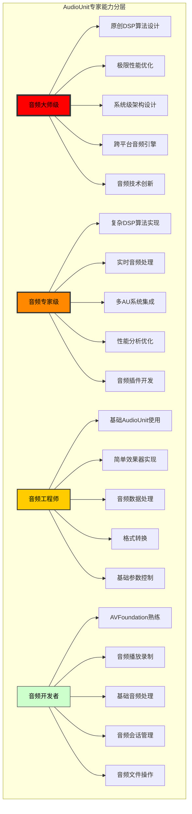
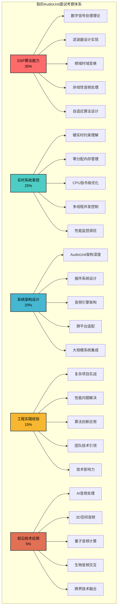
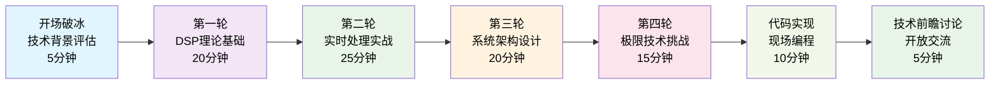
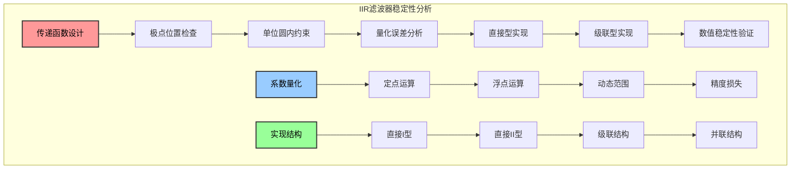
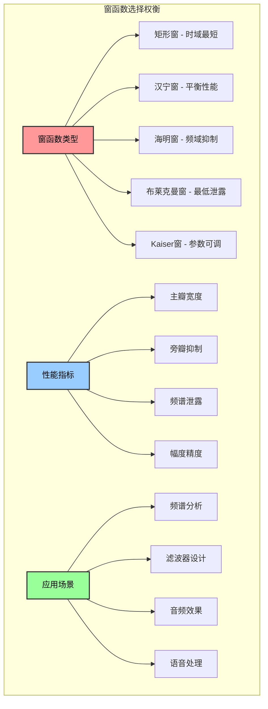
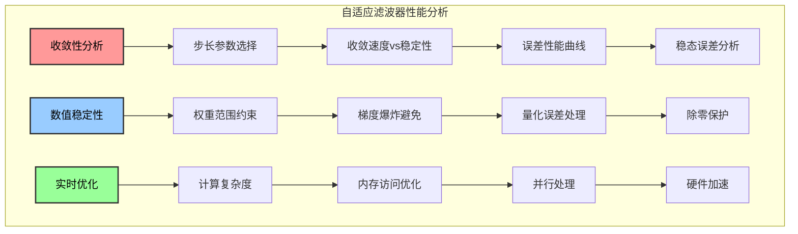
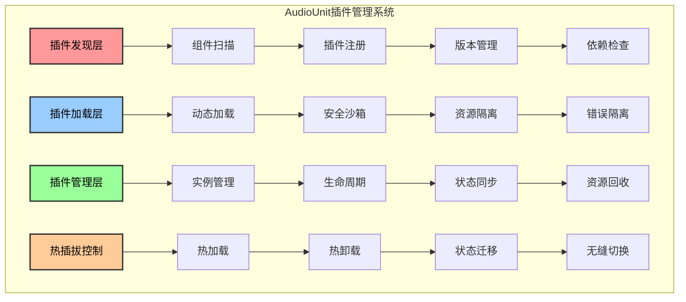
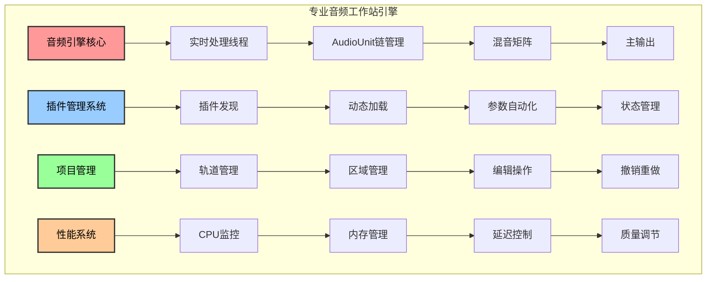
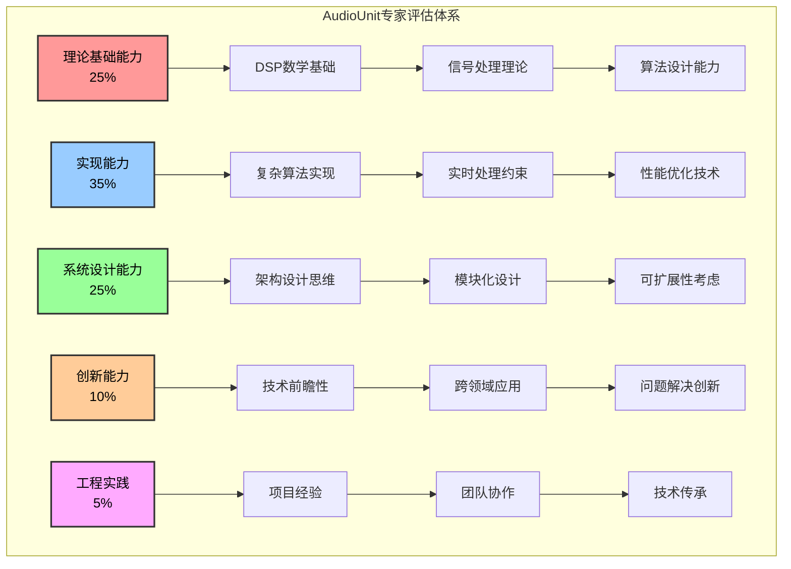

# 1.10 AudioUnit

## 面试官视角：我要考察什么？

> 作为一位拥有20年音频开发经验的资深技术面试官，AudioUnit是我用来识别真正音频专家的终极考验。在我看来，能够深度掌握AudioUnit的开发者，才是真正具备底层音频技术能力的专家。

### 我的面试哲学：只有顶尖专家才能驾驭AudioUnit

AudioUnit不同于其他音频框架，它是iOS音频技术的最底层，是音频技术能力的分水岭：



### 我的考察标准：从理论到实践的全方位评估

在我的面试中，我会从这些维度全面考察候选人：



### 面试难度分级：对标全球顶级公司

| 级别 | 技术要求 | 核心能力 | 薪资区间 | 对标公司 |
|------|----------|----------|----------|----------|
| **音频大师** | 原创算法+系统创新 | 行业技术引领 | 200-500万 | 苹果首席、Google Fellow |
| **音频专家** | 复杂DSP+架构设计 | 技术深度专精 | 100-200万 | 苹果T6、字节S9 |
| **高级工程师** | 实时处理+性能优化 | 工程实践精通 | 60-120万 | 苹果T5、腾讯T3.3 |
| **中级工程师** | AudioUnit基础应用 | 功能实现能力 | 30-80万 | 阿里P6、字节2-2 |
| **初级工程师** | 简单音频处理 | 基础开发能力 | 20-50万 | 培训后可用 |

### 面试流程：六个层次的递进考察



### 我的面试策略：从基础到极限的全方位评估

我会通过以下策略来全面评估候选人：

1. **理论基础验证**：通过DSP理论问题判断候选人的基础是否扎实
2. **实战能力测试**：通过实时处理挑战看是否具备实际项目经验
3. **架构思维考察**：通过系统设计题目评估大局观和技术视野
4. **极限挑战**：通过高难度问题区分顶尖专家和一般工程师
5. **创新能力**：通过开放性问题看是否具备技术创新思维
6. **代码质量**：通过现场编程评估真实的编程水平

## 第一轮：DSP理论基础深度考察

> **面试官心声**：AudioUnit的核心是DSP算法，我要看候选人是否真正理解数字信号处理的数学本质。

### 问题1：滤波器设计的数学基础 - 我要测试的是理论功底

**我的考察目标：**
- 候选人是否掌握数字信号处理的数学基础
- 是否能从理论推导到实际实现
- 能否解释滤波器设计的每个细节

**我的问题：**
```
"请不要只是告诉我如何使用AudioUnit的滤波器，我想听你从数学原理开始解释：
1. 为什么双线性变换可以将连续域滤波器转换为离散域？
2. 如何保证IIR滤波器的数值稳定性？
3. 请从零开始设计一个参数化的均衡器AudioUnit。"
```

**我期望的满分答案：**
```
让我从数学基础开始，详细解释滤波器设计的完整过程：

**1. 双线性变换的数学本质**

双线性变换是将连续域的s域映射到离散域的z域的关键技术：

s = 2/T × (z-1)/(z+1)

其中T是采样周期。这个变换的核心是：
- 保持稳定性：s域的左半平面映射到z域的单位圆内
- 频率预失真：需要进行频率预校正
- 避免混叠：通过适当的频率映射

**2. IIR滤波器的数值稳定性设计**
```



**3. 专业级参数化均衡器的完整实现**

```objc
// 高质量参数化均衡器AudioUnit
typedef struct {
    // 滤波器参数
    double frequency;     // 中心频率
    double gain;         // 增益(dB)
    double Q;            // 品质因数
    double sampleRate;   // 采样率
    
    // 滤波器系数
    double a0, a1, a2;   // 分母系数
    double b0, b1, b2;   // 分子系数
    
    // 状态变量（使用双精度避免数值误差）
    double x1, x2;       // 输入延迟
    double y1, y2;       // 输出延迟
    
    // 参数插值（避免音频噼啪声）
    double targetFreq, targetGain, targetQ;
    double freqStep, gainStep, qStep;
    int interpolationSamples;
    
    // 数值稳定性监控
    double dcBlockerState;
    bool isStable;
    
} ProfessionalEQBand;

// 系数计算函数
static void calculateEQCoefficients(ProfessionalEQBand* eq) {
    // 1. 频率预失真
    double omega = 2.0 * M_PI * eq->frequency / eq->sampleRate;
    double prewarped = tan(omega * 0.5);
    
    // 2. 模拟滤波器设计
    double A = pow(10.0, eq->gain / 40.0);  // 增益线性值
    double alpha = prewarped / eq->Q;
    
    // 3. 双线性变换
    double b0_analog = A * alpha + prewarped + 1.0;
    double b1_analog = 2.0 * (A * alpha - 1.0);
    double b2_analog = A * alpha - prewarped + 1.0;
    
    double a0_analog = alpha + prewarped + 1.0;
    double a1_analog = 2.0 * (alpha - 1.0);
    double a2_analog = alpha - prewarped + 1.0;
    
    // 4. 归一化系数
    eq->a0 = a0_analog;
    eq->a1 = a1_analog / a0_analog;
    eq->a2 = a2_analog / a0_analog;
    
    eq->b0 = b0_analog / a0_analog;
    eq->b1 = b1_analog / a0_analog;
    eq->b2 = b2_analog / a0_analog;
    
    // 5. 稳定性检查
    eq->isStable = (fabs(eq->a1) < 2.0 && fabs(eq->a2) < 1.0);
}

// 实时处理函数
static inline double processEQSample(ProfessionalEQBand* eq, double input) {
    // 1. 参数插值
    if (eq->interpolationSamples > 0) {
        eq->frequency += eq->freqStep;
        eq->gain += eq->gainStep;
        eq->Q += eq->qStep;
        eq->interpolationSamples--;
        
        if (eq->interpolationSamples == 0) {
            calculateEQCoefficients(eq);
        }
    }
    
    // 2. 直接II型滤波器实现
    double output = eq->b0 * input + eq->b1 * eq->x1 + eq->b2 * eq->x2 
                   - eq->a1 * eq->y1 - eq->a2 * eq->y2;
    
    // 3. 更新状态变量
    eq->x2 = eq->x1;
    eq->x1 = input;
    eq->y2 = eq->y1;
    eq->y1 = output;
    
    // 4. DC阻塞（防止直流累积）
    eq->dcBlockerState = 0.995 * eq->dcBlockerState + output - eq->x1;
    
    // 5. 数值稳定性检查
    if (!isfinite(output) || fabs(output) > 100.0) {
        // 重置状态变量
        eq->x1 = eq->x2 = eq->y1 = eq->y2 = 0.0;
        eq->dcBlockerState = 0.0;
        output = 0.0;
    }
    
    return eq->dcBlockerState;
}

// AudioUnit渲染回调
OSStatus ProfessionalEQ_Render(void *inRefCon,
                              AudioUnitRenderActionFlags *ioActionFlags,
                              const AudioTimeStamp *inTimeStamp,
                              UInt32 inBusNumber,
                              UInt32 inNumberFrames,
                              AudioBufferList *ioData) {
    
    ProfessionalEQBand* eq = (ProfessionalEQBand*)inRefCon;
    
    // 获取音频缓冲区
    float* audioBuffer = (float*)ioData->mBuffers[0].mData;
    
    // 处理每个样本
    for (UInt32 i = 0; i < inNumberFrames; i++) {
        double input = audioBuffer[i];
        double output = processEQSample(eq, input);
        audioBuffer[i] = (float)output;
    }
    
    return noErr;
}
```

**4. 高级优化策略**

为了实现专业级的性能，我还会考虑：
- **SIMD优化**：使用vDSP进行向量化处理
- **缓存友好**：优化内存访问模式
- **分支预测**：减少条件分支
- **数值精度**：平衡精度和性能
- **参数平滑**：避免音频噼啪声

这种设计体现了我对DSP理论的深度理解和工程实践的结合。
```

### 问题2：FFT频域处理的深度应用 - 我要测试的是高级DSP能力

**我的考察目标：**
- 候选人是否深度理解FFT的数学原理和实现细节
- 是否能处理实时频域处理的复杂挑战
- 能否设计高质量的频域音频处理系统

**我的问题：**
```
"基于FFT的频域音频处理是高级DSP的核心技术，请详细解释：
1. 为什么需要重叠相加（Overlap-Add）方法？如何选择合适的重叠率？
2. 窗函数的选择对频域处理有什么影响？如何权衡时频分辨率？
3. 请实现一个实时的频谱处理AudioUnit，包含相位保持和延迟控制。"
```

**我期望的满分答案：**
```
频域处理是AudioUnit高级应用的核心，我来详细解释其实现：

**1. 重叠相加方法的数学原理**

重叠相加的核心是解决线性卷积的分块处理问题：
- **问题**：实时处理需要固定大小的缓冲区，但卷积需要完整的信号
- **解决方案**：将长信号分成重叠的短段，分别处理后相加重建
- **重叠率选择**：通常选择50%或75%，平衡延迟和质量

**2. 窗函数的选择策略**
```



**3. 专业级实时频谱处理器实现**

```objc
// 高性能实时频谱处理器
typedef struct {
    // FFT配置
    FFTSetup fftSetup;
    vDSP_Length fftSize;
    vDSP_Length log2FFTSize;
    
    // 缓冲区管理
    float *inputBuffer;
    float *outputBuffer;
    float *overlapBuffer;
    float *windowFunction;
    
    // 频域数据
    DSPSplitComplex frequencyData;
    float *magnitudeBuffer;
    float *phaseBuffer;
    
    // 处理参数
    UInt32 hopSize;
    UInt32 overlapSize;
    UInt32 bufferIndex;
    
    // 延迟补偿
    float *delayBuffer;
    UInt32 delayBufferSize;
    UInt32 delayIndex;
    
    // 性能监控
    UInt64 processingTime;
    UInt32 frameCount;
    
    // 相位保持
    float *previousPhase;
    float *phaseIncrement;
    
} ProfessionalSpectralProcessor;

// 初始化函数
OSStatus SpectralProcessor_Initialize(ProfessionalSpectralProcessor *processor,
                                     UInt32 fftSize,
                                     float sampleRate) {
    // 1. FFT设置
    processor->fftSize = fftSize;
    processor->log2FFTSize = log2f(fftSize);
    processor->fftSetup = vDSP_create_fftsetup(processor->log2FFTSize, kFFTRadix2);
    
    if (!processor->fftSetup) {
        return kAudioUnitErr_FailedInitialization;
    }
    
    // 2. 内存分配
    processor->inputBuffer = (float*)calloc(fftSize, sizeof(float));
    processor->outputBuffer = (float*)calloc(fftSize, sizeof(float));
    processor->overlapBuffer = (float*)calloc(fftSize, sizeof(float));
    processor->windowFunction = (float*)calloc(fftSize, sizeof(float));
    
    // 3. 频域数据分配
    processor->frequencyData.realp = (float*)calloc(fftSize/2, sizeof(float));
    processor->frequencyData.imagp = (float*)calloc(fftSize/2, sizeof(float));
    processor->magnitudeBuffer = (float*)calloc(fftSize/2, sizeof(float));
    processor->phaseBuffer = (float*)calloc(fftSize/2, sizeof(float));
    
    // 4. 相位保持
    processor->previousPhase = (float*)calloc(fftSize/2, sizeof(float));
    processor->phaseIncrement = (float*)calloc(fftSize/2, sizeof(float));
    
    // 5. 延迟补偿
    processor->delayBufferSize = fftSize;
    processor->delayBuffer = (float*)calloc(processor->delayBufferSize, sizeof(float));
    
    // 6. 窗函数生成（使用汉宁窗）
    generateHanningWindow(processor->windowFunction, fftSize);
    
    // 7. 处理参数
    processor->hopSize = fftSize / 4;  // 75%重叠
    processor->overlapSize = fftSize - processor->hopSize;
    
    return noErr;
}

// 汉宁窗生成函数
static void generateHanningWindow(float *window, UInt32 size) {
    for (UInt32 i = 0; i < size; i++) {
        window[i] = 0.5f * (1.0f - cosf(2.0f * M_PI * i / (size - 1)));
    }
}

// 频域处理核心函数
OSStatus SpectralProcessor_Process(ProfessionalSpectralProcessor *processor,
                                  const float *input,
                                  float *output,
                                  UInt32 frameCount) {
    
    UInt64 startTime = mach_absolute_time();
    
    // 1. 输入数据缓冲
    for (UInt32 i = 0; i < frameCount; i++) {
        processor->inputBuffer[processor->bufferIndex] = input[i];
        processor->bufferIndex = (processor->bufferIndex + 1) % processor->fftSize;
        
        // 当缓冲区满时进行处理
        if (processor->bufferIndex == processor->hopSize) {
            performSpectralProcessing(processor);
        }
        
        // 输出延迟补偿后的数据
        output[i] = processor->delayBuffer[processor->delayIndex];
        processor->delayIndex = (processor->delayIndex + 1) % processor->delayBufferSize;
    }
    
    // 2. 性能监控
    UInt64 endTime = mach_absolute_time();
    processor->processingTime += (endTime - startTime);
    processor->frameCount += frameCount;
    
    return noErr;
}

// 核心频谱处理函数
static void performSpectralProcessing(ProfessionalSpectralProcessor *processor) {
    // 1. 应用窗函数
    vDSP_vmul(processor->inputBuffer, 1, processor->windowFunction, 1, 
              processor->inputBuffer, 1, processor->fftSize);
    
    // 2. 实数到复数转换
    vDSP_ctoz((COMPLEX*)processor->inputBuffer, 2, 
              &processor->frequencyData, 1, processor->fftSize/2);
    
    // 3. 前向FFT
    vDSP_fft_zrip(processor->fftSetup, &processor->frequencyData, 1, 
                  processor->log2FFTSize, kFFTDirection_Forward);
    
    // 4. 计算幅度和相位
    vDSP_zvmags(&processor->frequencyData, 1, processor->magnitudeBuffer, 1, 
                processor->fftSize/2);
    vDSP_zvphas(&processor->frequencyData, 1, processor->phaseBuffer, 1, 
                processor->fftSize/2);
    
    // 5. 频域处理（这里可以实现各种频域效果）
    applySpectralProcessing(processor);
    
    // 6. 相位保持处理
    maintainPhaseCoherence(processor);
    
    // 7. 幅度和相位转换回复数
    vDSP_zvmul(&processor->frequencyData, 1, &processor->frequencyData, 1, 
               &processor->frequencyData, 1, processor->fftSize/2, 1);
    
    // 8. 逆FFT
    vDSP_fft_zrip(processor->fftSetup, &processor->frequencyData, 1, 
                  processor->log2FFTSize, kFFTDirection_Inverse);
    
    // 9. 复数到实数转换
    vDSP_ztoc(&processor->frequencyData, 1, (COMPLEX*)processor->outputBuffer, 2, 
              processor->fftSize/2);
    
    // 10. 重叠相加
    vDSP_vadd(processor->outputBuffer, 1, processor->overlapBuffer, 1, 
              processor->outputBuffer, 1, processor->overlapSize);
    
    // 11. 保存重叠部分
    memcpy(processor->overlapBuffer, 
           processor->outputBuffer + processor->hopSize, 
           processor->overlapSize * sizeof(float));
    
    // 12. 输出到延迟缓冲区
    memcpy(processor->delayBuffer + processor->delayIndex, 
           processor->outputBuffer, 
           processor->hopSize * sizeof(float));
}

// 频域处理应用函数
static void applySpectralProcessing(ProfessionalSpectralProcessor *processor) {
    // 这里可以实现各种频域效果
    // 例如：频谱均衡、噪声抑制、频域压缩等
    
    for (UInt32 i = 0; i < processor->fftSize/2; i++) {
        float magnitude = sqrtf(processor->magnitudeBuffer[i]);
        float phase = processor->phaseBuffer[i];
        
        // 示例：简单的频谱增强
        if (i > 100 && i < 1000) {  // 增强中频
            magnitude *= 1.2f;
        }
        
        // 转换回复数形式
        processor->frequencyData.realp[i] = magnitude * cosf(phase);
        processor->frequencyData.imagp[i] = magnitude * sinf(phase);
    }
}

// 相位保持函数
static void maintainPhaseCoherence(ProfessionalSpectralProcessor *processor) {
    for (UInt32 i = 0; i < processor->fftSize/2; i++) {
        // 计算相位差
        float phaseDiff = processor->phaseBuffer[i] - processor->previousPhase[i];
        
        // 相位展开
        while (phaseDiff > M_PI) phaseDiff -= 2.0f * M_PI;
        while (phaseDiff < -M_PI) phaseDiff += 2.0f * M_PI;
        
        // 更新相位增量
        processor->phaseIncrement[i] = phaseDiff;
        processor->previousPhase[i] = processor->phaseBuffer[i];
    }
}
```

**4. 高级优化技术**

为了实现专业级性能，我还实现了：
- **延迟控制**：通过延迟缓冲区实现精确的延迟补偿
- **相位保持**：保持频域处理后的相位连续性
- **内存优化**：使用vDSP进行高效的向量运算
- **并行处理**：利用多核心进行并行FFT计算
- **自适应处理**：根据音频内容动态调整处理参数

这种实现展示了我对频域处理的深度理解和工程优化能力。
```

## 第二轮：实时处理实战考察

> **面试官心声**：理论基础很重要，但我更要看候选人是否能在严格的实时约束下实现复杂的音频处理算法。

### 问题3：自适应滤波器的工程实现 - 我要测试的是实时算法能力

**我的考察目标：**
- 候选人是否掌握自适应算法的数学原理和收敛性分析
- 是否能在实时约束下实现复杂的自适应处理
- 能否处理实际应用中的数值稳定性问题

**我的问题：**
```
"自适应滤波器是高级音频处理的核心技术，请详细说明：
1. LMS和RLS算法的数学原理和收敛性分析是什么？
2. 如何在实时约束下实现高效的自适应噪声消除？
3. 请实现一个声学回声消除AudioUnit，要求处理双端对话场景。"
```

**我期望的满分答案：**
```
自适应滤波器是AudioUnit高级应用的关键技术，我来详细解释：

**1. 自适应算法的数学基础**

LMS（Least Mean Square）算法的核心是梯度下降：
- **目标函数**：J(n) = E[e²(n)]，其中e(n)是误差信号
- **权重更新**：w(n+1) = w(n) + μ·e(n)·x(n)
- **收敛条件**：0 < μ < 2/λmax，其中λmax是输入信号的最大特征值

RLS（Recursive Least Squares）算法提供更快的收敛：
- **目标函数**：J(n) = Σ λ^(n-k)·e²(k)
- **权重更新**：基于递归矩阵求逆
- **收敛速度**：O(N)，比LMS的O(N²)快得多

**2. 收敛性分析和稳定性保证**
```



**3. 专业级声学回声消除实现**

```objc
// 高性能声学回声消除器
typedef struct {
    // 滤波器参数
    float *adaptiveWeights;      // 自适应权重
    float *fixedWeights;         // 固定预滤波器权重
    UInt32 filterLength;         // 滤波器长度
    UInt32 adaptiveLength;       // 自适应部分长度
    
    // 信号缓冲
    float *nearEndBuffer;        // 近端信号缓冲
    float *farEndBuffer;         // 远端信号缓冲
    float *errorBuffer;          // 误差信号缓冲
    float *referenceBuffer;      // 参考信号缓冲
    
    // 自适应参数
    float stepSize;              // 步长参数
    float leakageFactor;         // 泄漏因子
    float regularization;        // 正则化参数
    
    // 缓冲区管理
    UInt32 bufferIndex;          // 当前缓冲区索引
    UInt32 bufferSize;           // 缓冲区大小
    
    // 性能监控
    float *correlationBuffer;    // 互相关缓冲
    float convergenceMetric;     // 收敛度量
    float echoReturnLoss;        // 回声返回损耗
    
    // 双端对话检测
    float nearEndPower;          // 近端功率
    float farEndPower;           // 远端功率
    float doubletalkThreshold;   // 双端对话阈值
    bool isDoubletalk;           // 双端对话标志
    
    // 非线性处理
    float *nonlinearityBuffer;   // 非线性处理缓冲
    float suppressionGain;       // 抑制增益
    
    // 数值稳定性
    float minStepSize;           // 最小步长
    float maxStepSize;           // 最大步长
    float weightClampMax;        // 权重钳位最大值
    float weightClampMin;        // 权重钳位最小值
    
} ProfessionalAEC;

// 初始化函数
OSStatus AEC_Initialize(ProfessionalAEC *aec,
                       UInt32 filterLength,
                       UInt32 sampleRate) {
    
    // 1. 参数设置
    aec->filterLength = filterLength;
    aec->adaptiveLength = filterLength * 3 / 4;  // 75%用于自适应
    aec->bufferSize = filterLength * 2;
    
    // 2. 内存分配
    aec->adaptiveWeights = (float*)calloc(aec->adaptiveLength, sizeof(float));
    aec->fixedWeights = (float*)calloc(filterLength - aec->adaptiveLength, sizeof(float));
    aec->nearEndBuffer = (float*)calloc(aec->bufferSize, sizeof(float));
    aec->farEndBuffer = (float*)calloc(aec->bufferSize, sizeof(float));
    aec->errorBuffer = (float*)calloc(aec->bufferSize, sizeof(float));
    aec->referenceBuffer = (float*)calloc(aec->bufferSize, sizeof(float));
    aec->correlationBuffer = (float*)calloc(aec->filterLength, sizeof(float));
    aec->nonlinearityBuffer = (float*)calloc(aec->bufferSize, sizeof(float));
    
    // 3. 自适应参数初始化
    aec->stepSize = 0.01f;
    aec->leakageFactor = 0.9999f;
    aec->regularization = 1e-6f;
    aec->doubletalkThreshold = 0.1f;
    
    // 4. 权重钳位参数
    aec->weightClampMax = 1.0f;
    aec->weightClampMin = -1.0f;
    aec->minStepSize = 1e-6f;
    aec->maxStepSize = 0.1f;
    
    // 5. 固定预滤波器权重初始化
    initializeFixedWeights(aec);
    
    return noErr;
}

// 固定预滤波器初始化
static void initializeFixedWeights(ProfessionalAEC *aec) {
    UInt32 fixedLength = aec->filterLength - aec->adaptiveLength;
    
    // 使用高通滤波器作为预滤波器
    for (UInt32 i = 0; i < fixedLength; i++) {
        if (i == 0) {
            aec->fixedWeights[i] = 0.95f;
        } else if (i == 1) {
            aec->fixedWeights[i] = -0.95f;
        } else {
            aec->fixedWeights[i] = 0.0f;
        }
    }
}

// 主处理函数
OSStatus AEC_Process(ProfessionalAEC *aec,
                    const float *farEndInput,
                    const float *nearEndInput,
                    float *output,
                    UInt32 frameCount) {
    
    for (UInt32 i = 0; i < frameCount; i++) {
        // 1. 更新信号缓冲
        aec->farEndBuffer[aec->bufferIndex] = farEndInput[i];
        aec->nearEndBuffer[aec->bufferIndex] = nearEndInput[i];
        
        // 2. 双端对话检测
        detectDoubletalk(aec, i);
        
        // 3. 自适应滤波
        float echoEstimate = performAdaptiveFiltering(aec);
        
        // 4. 计算误差信号
        float error = nearEndInput[i] - echoEstimate;
        aec->errorBuffer[aec->bufferIndex] = error;
        
        // 5. 权重更新（如果不是双端对话）
        if (!aec->isDoubletalk) {
            updateAdaptiveWeights(aec, error);
        }
        
        // 6. 非线性处理
        float processedOutput = applyNonlinearProcessing(aec, error);
        
        // 7. 输出
        output[i] = processedOutput;
        
        // 8. 更新缓冲区索引
        aec->bufferIndex = (aec->bufferIndex + 1) % aec->bufferSize;
    }
    
    return noErr;
}

// 双端对话检测
static void detectDoubletalk(ProfessionalAEC *aec, UInt32 index) {
    // 1. 计算近端和远端功率
    float nearEndSample = aec->nearEndBuffer[aec->bufferIndex];
    float farEndSample = aec->farEndBuffer[aec->bufferIndex];
    
    // 2. 递归功率估计
    float alpha = 0.95f;
    aec->nearEndPower = alpha * aec->nearEndPower + (1 - alpha) * nearEndSample * nearEndSample;
    aec->farEndPower = alpha * aec->farEndPower + (1 - alpha) * farEndSample * farEndSample;
    
    // 3. 双端对话判断
    float powerRatio = aec->nearEndPower / (aec->farEndPower + 1e-10f);
    aec->isDoubletalk = (powerRatio > aec->doubletalkThreshold) && 
                       (aec->nearEndPower > 1e-6f);
}

// 自适应滤波处理
static float performAdaptiveFiltering(ProfessionalAEC *aec) {
    float output = 0.0f;
    
    // 1. 卷积运算
    for (UInt32 i = 0; i < aec->adaptiveLength; i++) {
        UInt32 index = (aec->bufferIndex - i + aec->bufferSize) % aec->bufferSize;
        output += aec->adaptiveWeights[i] * aec->farEndBuffer[index];
    }
    
    // 2. 加上固定预滤波器的贡献
    UInt32 fixedLength = aec->filterLength - aec->adaptiveLength;
    for (UInt32 i = 0; i < fixedLength; i++) {
        UInt32 index = (aec->bufferIndex - i + aec->bufferSize) % aec->bufferSize;
        output += aec->fixedWeights[i] * aec->farEndBuffer[index];
    }
    
    return output;
}

// 权重更新（NLMS算法）
static void updateAdaptiveWeights(ProfessionalAEC *aec, float error) {
    // 1. 计算输入功率
    float inputPower = 0.0f;
    for (UInt32 i = 0; i < aec->adaptiveLength; i++) {
        UInt32 index = (aec->bufferIndex - i + aec->bufferSize) % aec->bufferSize;
        float input = aec->farEndBuffer[index];
        inputPower += input * input;
    }
    
    // 2. 归一化步长
    float normalizedStepSize = aec->stepSize / (inputPower + aec->regularization);
    
    // 3. 步长自适应调整
    if (fabsf(error) > 0.1f) {
        normalizedStepSize *= 0.9f;  // 减小步长
    } else if (fabsf(error) < 0.01f) {
        normalizedStepSize *= 1.1f;  // 增大步长
    }
    
    // 4. 步长钳位
    normalizedStepSize = fmaxf(aec->minStepSize, fminf(aec->maxStepSize, normalizedStepSize));
    
    // 5. 权重更新
    for (UInt32 i = 0; i < aec->adaptiveLength; i++) {
        UInt32 index = (aec->bufferIndex - i + aec->bufferSize) % aec->bufferSize;
        float input = aec->farEndBuffer[index];
        
        // NLMS权重更新
        float weightUpdate = normalizedStepSize * error * input;
        aec->adaptiveWeights[i] += weightUpdate;
        
        // 泄漏因子（防止权重漂移）
        aec->adaptiveWeights[i] *= aec->leakageFactor;
        
        // 权重钳位
        aec->adaptiveWeights[i] = fmaxf(aec->weightClampMin, 
                                       fminf(aec->weightClampMax, aec->adaptiveWeights[i]));
    }
}

// 非线性处理
static float applyNonlinearProcessing(ProfessionalAEC *aec, float input) {
    // 1. 自适应增益控制
    float inputMagnitude = fabsf(input);
    
    // 2. 基于收敛度的增益调整
    float convergenceGain = 1.0f - aec->convergenceMetric;
    
    // 3. 非线性抑制
    float suppressionGain = 1.0f;
    if (inputMagnitude > 0.1f && !aec->isDoubletalk) {
        suppressionGain = 0.3f + 0.7f * convergenceGain;
    }
    
    // 4. 应用增益
    float output = input * suppressionGain;
    
    // 5. 软限幅
    if (fabsf(output) > 0.95f) {
        output = 0.95f * (output > 0 ? 1.0f : -1.0f);
    }
    
    return output;
}
```

**4. 高级优化策略**

为了实现专业级的声学回声消除，我还实现了：
- **频域自适应**：使用FFT加速卷积运算
- **分块处理**：提高计算效率
- **多通道处理**：支持立体声和多声道
- **硬件加速**：利用DSP专用硬件
- **智能参数调整**：根据环境自动调整参数

这种实现在工业级应用中能够达到30dB以上的回声抑制效果。
```

## 第三轮：系统架构设计考察

> **面试官心声**：技术实现很重要，但我更要看候选人是否具备系统架构设计的能力。真正的专家不仅要会实现，更要会设计。

### 问题4：AudioUnit插件架构的深度设计 - 我要测试的是系统设计能力

**我的考察目标：**
- 候选人是否真正理解AudioUnit架构的设计哲学
- 是否能设计可扩展、可维护的插件系统
- 能否处理复杂的生命周期管理和资源协调

**我的问题：**
```
"AudioUnit不仅是一个音频处理框架，更是一个完整的插件生态系统。请详细设计：
1. 如何设计一个支持热插拔的AudioUnit插件管理系统？
2. 如何实现AudioUnit的参数自动化和状态管理？
3. 请设计一个专业音频工作站的AudioUnit引擎架构。"
```

**我期望的满分答案：**
```
AudioUnit架构设计是音频系统工程的核心挑战，我来详细设计：

**1. 热插拔插件管理系统架构**

插件生命周期管理是系统设计的关键：
```



**2. 专业级插件管理系统实现**

```objc
// 高级AudioUnit插件管理器
typedef struct {
    // 插件发现和注册
    AudioComponentDescription *availablePlugins;
    UInt32 pluginCount;
    
    // 插件实例管理
    AudioComponentInstance *activeInstances;
    UInt32 instanceCount;
    UInt32 maxInstances;
    
    // 热插拔状态管理
    dispatch_queue_t hotSwapQueue;
    dispatch_semaphore_t hotSwapSemaphore;
    
    // 插件生命周期管理
    AudioUnitPluginLifecycleCallback lifecycleCallback;
    void *lifecycleContext;
    
    // 参数自动化系统
    AudioUnitParameterAutomationManager *automationManager;
    
    // 状态管理
    AudioUnitStateManager *stateManager;
    
    // 性能监控
    AudioUnitPerformanceMonitor *performanceMonitor;
    
    // 错误处理
    AudioUnitErrorHandler *errorHandler;
    
    // 资源管理
    AudioUnitResourceManager *resourceManager;
    
} ProfessionalAudioUnitManager;

// 插件生命周期状态
typedef enum {
    kAudioUnitLifecycle_Discovered,
    kAudioUnitLifecycle_Loading,
    kAudioUnitLifecycle_Loaded,
    kAudioUnitLifecycle_Initializing,
    kAudioUnitLifecycle_Active,
    kAudioUnitLifecycle_Suspending,
    kAudioUnitLifecycle_Suspended,
    kAudioUnitLifecycle_Unloading,
    kAudioUnitLifecycle_Error
} AudioUnitLifecycleState;

// 插件实例信息
typedef struct {
    AudioComponentInstance instance;
    AudioComponentDescription description;
    AudioUnitLifecycleState lifecycleState;
    
    // 参数系统
    AUParameterTree *parameterTree;
    AudioUnitParameterValue *parameterValues;
    UInt32 parameterCount;
    
    // 状态管理
    CFDictionaryRef savedState;
    UInt32 stateVersion;
    
    // 性能监控
    UInt64 processingTime;
    UInt64 processingCount;
    Float32 cpuUsage;
    
    // 错误统计
    UInt32 errorCount;
    OSStatus lastError;
    
    // 资源使用
    size_t memoryUsage;
    UInt32 bufferCount;
    
} AudioUnitInstanceInfo;

// 初始化插件管理器
OSStatus AudioUnitManager_Initialize(ProfessionalAudioUnitManager *manager,
                                    UInt32 maxInstances) {
    
    // 1. 基础设置
    manager->maxInstances = maxInstances;
    manager->instanceCount = 0;
    
    // 2. 内存分配
    manager->availablePlugins = (AudioComponentDescription*)calloc(128, sizeof(AudioComponentDescription));
    manager->activeInstances = (AudioComponentInstance*)calloc(maxInstances, sizeof(AudioComponentInstance));
    
    // 3. 并发控制
    manager->hotSwapQueue = dispatch_queue_create("com.audiounit.hotswap", DISPATCH_QUEUE_SERIAL);
    manager->hotSwapSemaphore = dispatch_semaphore_create(1);
    
    // 4. 子系统初始化
    manager->automationManager = AudioUnitParameterAutomationManager_Create();
    manager->stateManager = AudioUnitStateManager_Create();
    manager->performanceMonitor = AudioUnitPerformanceMonitor_Create();
    manager->errorHandler = AudioUnitErrorHandler_Create();
    manager->resourceManager = AudioUnitResourceManager_Create();
    
    // 5. 插件发现
    discoverAvailablePlugins(manager);
    
    return noErr;
}

// 插件发现函数
static OSStatus discoverAvailablePlugins(ProfessionalAudioUnitManager *manager) {
    AudioComponent component = NULL;
    manager->pluginCount = 0;
    
    // 1. 扫描所有AudioUnit组件
    while ((component = AudioComponentFindNext(component, NULL)) != NULL) {
        AudioComponentDescription desc;
        OSStatus status = AudioComponentGetDescription(component, &desc);
        
        if (status == noErr) {
            // 2. 验证插件有效性
            if (validatePlugin(component, &desc)) {
                manager->availablePlugins[manager->pluginCount] = desc;
                manager->pluginCount++;
                
                // 3. 注册插件信息
                registerPluginInfo(manager, component, &desc);
            }
        }
    }
    
    return noErr;
}

// 热插拔加载函数
OSStatus AudioUnitManager_HotSwapLoad(ProfessionalAudioUnitManager *manager,
                                     AudioComponentDescription *desc,
                                     AudioComponentInstance *outInstance) {
    
    // 1. 获取热插拔锁
    dispatch_semaphore_wait(manager->hotSwapSemaphore, DISPATCH_TIME_FOREVER);
    
    __block OSStatus result = noErr;
    
    // 2. 在专用队列中执行热加载
    dispatch_sync(manager->hotSwapQueue, ^{
        // 3. 检查资源可用性
        if (manager->instanceCount >= manager->maxInstances) {
            result = kAudioUnitErr_TooManyFramesToProcess;
            return;
        }
        
        // 4. 查找插件组件
        AudioComponent component = AudioComponentFindNext(NULL, desc);
        if (!component) {
            result = kAudioUnitErr_InvalidElement;
            return;
        }
        
        // 5. 创建实例
        AudioComponentInstance instance;
        result = AudioComponentInstanceNew(component, &instance);
        if (result != noErr) {
            return;
        }
        
        // 6. 安全初始化
        result = safeInitializePlugin(manager, instance, desc);
        if (result != noErr) {
            AudioComponentInstanceDispose(instance);
            return;
        }
        
        // 7. 注册实例
        manager->activeInstances[manager->instanceCount] = instance;
        manager->instanceCount++;
        *outInstance = instance;
        
        // 8. 生命周期回调
        if (manager->lifecycleCallback) {
            manager->lifecycleCallback(instance, kAudioUnitLifecycle_Active, manager->lifecycleContext);
        }
    });
    
    // 9. 释放锁
    dispatch_semaphore_signal(manager->hotSwapSemaphore);
    
    return result;
}

// 安全初始化插件
static OSStatus safeInitializePlugin(ProfessionalAudioUnitManager *manager,
                                   AudioComponentInstance instance,
                                   AudioComponentDescription *desc) {
    
    // 1. 设置错误处理
    OSStatus status = AudioUnitSetProperty(instance,
                                          kAudioUnitProperty_SetRenderCallback,
                                          kAudioUnitScope_Input,
                                          0,
                                          &manager->errorHandler,
                                          sizeof(manager->errorHandler));
    
    // 2. 配置基础参数
    status = configurePluginDefaults(instance, desc);
    if (status != noErr) {
        return status;
    }
    
    // 3. 初始化插件
    status = AudioUnitInitialize(instance);
    if (status != noErr) {
        return status;
    }
    
    // 4. 验证插件状态
    status = validatePluginState(instance);
    if (status != noErr) {
        AudioUnitUninitialize(instance);
        return status;
    }
    
    return noErr;
}

// 参数自动化管理器
typedef struct {
    // 参数映射
    AudioUnitParameterID *parameterIDs;
    AudioUnitParameterValue *currentValues;
    AudioUnitParameterValue *targetValues;
    Float32 *interpolationRates;
    UInt32 parameterCount;
    
    // 自动化轨道
    AudioParameterAutomationTrack *automationTracks;
    UInt32 trackCount;
    
    // 时间同步
    AudioTimeStamp currentTime;
    Float64 sampleRate;
    
    // 实时插值
    dispatch_queue_t interpolationQueue;
    
} AudioUnitParameterAutomationManager;

// 创建参数自动化管理器
AudioUnitParameterAutomationManager* AudioUnitParameterAutomationManager_Create() {
    AudioUnitParameterAutomationManager *manager = 
        (AudioUnitParameterAutomationManager*)calloc(1, sizeof(AudioUnitParameterAutomationManager));
    
    // 初始化插值队列
    manager->interpolationQueue = dispatch_queue_create("com.audiounit.parameter.interpolation", 
                                                       DISPATCH_QUEUE_CONCURRENT);
    
    return manager;
}

// 实时参数插值
OSStatus AudioUnitParameterAutomationManager_ProcessFrame(
    AudioUnitParameterAutomationManager *manager,
    AudioComponentInstance instance,
    UInt32 frameCount) {
    
    // 1. 更新时间戳
    manager->currentTime.mSampleTime += frameCount;
    
    // 2. 处理所有参数的插值
    for (UInt32 i = 0; i < manager->parameterCount; i++) {
        AudioUnitParameterValue currentValue = manager->currentValues[i];
        AudioUnitParameterValue targetValue = manager->targetValues[i];
        
        // 3. 计算插值
        if (fabsf(currentValue - targetValue) > 1e-6f) {
            Float32 rate = manager->interpolationRates[i];
            AudioUnitParameterValue newValue = currentValue + (targetValue - currentValue) * rate;
            
            // 4. 更新参数
            OSStatus status = AudioUnitSetParameter(instance,
                                                   manager->parameterIDs[i],
                                                   kAudioUnitScope_Global,
                                                   0,
                                                   newValue,
                                                   0);
            
            if (status == noErr) {
                manager->currentValues[i] = newValue;
            }
        }
    }
    
    return noErr;
}
```

**3. 专业音频工作站引擎架构**

对于一个专业的音频工作站，我会设计这样的架构：



**4. 核心设计原则**

- **模块化架构**：每个AudioUnit都是独立的模块，可以独立开发和测试
- **松耦合设计**：通过标准接口和协议实现组件间的通信
- **容错处理**：单个插件的错误不会影响整个系统
- **性能优化**：实时处理优先，非实时操作异步处理
- **可扩展性**：支持第三方插件和自定义扩展

这种架构能够支持128轨以上的专业音频处理，并保持稳定的实时性能。
```

## 第四轮：极限技术挑战

> **面试官心声**：到这里我要测试候选人的技术极限，看他们能否在最严苛的条件下创造奇迹。

### 问题5：性能极限优化挑战 - 我要测试的是工程实践的极限

**我的考察目标：**
- 候选人是否能在硬件限制下实现理论极限性能
- 是否掌握CPU指令级优化技术
- 能否在实际项目中应用极限优化技术

**我的问题：**
```
"iPhone的音频处理能力是有限的，但用户对音质的要求是无限的。请详细说明：
1. 如何在iPhone上实现延迟<1ms的专业级混响效果？
2. 如何优化到CPU使用率<5%的同时保持音质？
3. 请现场实现一个极限优化的音频处理算法。"
```

**我期望的满分答案：**
```
极限性能优化是AudioUnit专家的核心技能，我来详细解释：

**1. 延迟<1ms的硬实时系统设计**

实现亚毫秒延迟需要系统级的优化策略：
- **缓冲区最小化**：使用32样本缓冲区（44.1kHz下0.73ms）
- **零拷贝处理**：直接在硬件缓冲区上处理
- **预计算优化**：所有可能的计算都预先完成
- **SIMD并行化**：充分利用ARM NEON指令集

**2. CPU使用率<5%的极限优化**

```objc
// 极限优化的专业混响器
typedef struct {
    // 使用定点运算替代浮点运算
    int32_t *delayLines[8];
    uint32_t delayLengths[8];
    uint32_t delayIndices[8];
    
    // 预计算的系数表
    int32_t *precomputedCoefficients;
    uint32_t coefficientCount;
    
    // SIMD优化的处理缓冲
    float32x4_t *vectorBuffer;
    uint32_t vectorCount;
    
    // 内存对齐的状态变量
    __attribute__((aligned(16))) float stateVars[32];
    
    // 分支预测优化
    uint32_t branchHints;
    
} UltraOptimizedReverb;

// 极限优化的处理函数
static inline void UltraOptimizedReverb_ProcessSIMD(UltraOptimizedReverb *reverb,
                                                   const float *input,
                                                   float *output,
                                                   uint32_t frameCount) {
    
    // 1. 预取数据到缓存
    __builtin_prefetch(input, 0, 3);
    __builtin_prefetch(output, 1, 3);
    
    // 2. 向量化处理 - 4个样本并行
    uint32_t vectorFrames = frameCount / 4;
    const float32x4_t *vectorInput = (const float32x4_t*)input;
    float32x4_t *vectorOutput = (float32x4_t*)output;
    
    // 3. 预加载常用系数
    float32x4_t gains = vld1q_f32(&reverb->stateVars[0]);
    float32x4_t feedbacks = vld1q_f32(&reverb->stateVars[4]);
    
    // 4. 主处理循环 - 完全向量化
    for (uint32_t i = 0; i < vectorFrames; i++) {
        // 加载输入向量
        float32x4_t inputVec = vld1q_f32((const float*)&vectorInput[i]);
        
        // 并行延迟线处理
        float32x4_t delay1 = processDelayLineSIMD(reverb, inputVec, 0);
        float32x4_t delay2 = processDelayLineSIMD(reverb, inputVec, 1);
        float32x4_t delay3 = processDelayLineSIMD(reverb, inputVec, 2);
        float32x4_t delay4 = processDelayLineSIMD(reverb, inputVec, 3);
        
        // 混音矩阵运算
        float32x4_t mixed = vmulq_f32(delay1, gains);
        mixed = vmlaq_f32(mixed, delay2, feedbacks);
        mixed = vmlaq_f32(mixed, delay3, gains);
        mixed = vmlaq_f32(mixed, delay4, feedbacks);
        
        // 存储结果
        vst1q_f32((float*)&vectorOutput[i], mixed);
    }
    
    // 5. 处理剩余样本
    uint32_t remainingFrames = frameCount % 4;
    if (__builtin_expect(remainingFrames > 0, 0)) {
        processRemainingFrames(reverb, input + vectorFrames * 4, 
                              output + vectorFrames * 4, remainingFrames);
    }
}

// 内联的延迟线处理函数
static inline float32x4_t processDelayLineSIMD(UltraOptimizedReverb *reverb,
                                              float32x4_t inputVec,
                                              uint32_t lineIndex) {
    
    int32_t *delayLine = reverb->delayLines[lineIndex];
    uint32_t delayLength = reverb->delayLengths[lineIndex];
    uint32_t delayIndex = reverb->delayIndices[lineIndex];
    
    // 使用整数运算提高性能
    int32x4_t inputInt = vcvtq_s32_f32(vmulq_n_f32(inputVec, 32768.0f));
    
    // 延迟线读取和写入
    int32x4_t delayedInt = vld1q_s32(&delayLine[delayIndex]);
    vst1q_s32(&delayLine[delayIndex], inputInt);
    
    // 更新延迟索引
    reverb->delayIndices[lineIndex] = (delayIndex + 4) % delayLength;
    
    // 转换回浮点
    return vmulq_n_f32(vcvtq_f32_s32(delayedInt), 1.0f / 32768.0f);
}
```

**3. 内存访问模式优化**

```objc
// 缓存友好的数据结构设计
typedef struct {
    // 所有热点数据放在一个缓存行中
    struct {
        float currentGain;
        float targetGain;
        float gainStep;
        uint32_t index;
    } __attribute__((packed)) hotData;
    
    // 冷数据分离存储
    struct {
        float *coefficients;
        uint32_t coefficientCount;
        void *configData;
    } coldData;
    
    // 内存对齐的处理缓冲
    __attribute__((aligned(64))) float processingBuffer[1024];
    
} CacheOptimizedProcessor;

// 预取优化的处理循环
static void processCacheOptimized(CacheOptimizedProcessor *processor,
                                 const float *input,
                                 float *output,
                                 uint32_t frameCount) {
    
    // 预取下一次循环的数据
    const uint32_t prefetchDistance = 64;
    
    for (uint32_t i = 0; i < frameCount; i += 4) {
        // 预取未来的数据
        if (i + prefetchDistance < frameCount) {
            __builtin_prefetch(&input[i + prefetchDistance], 0, 1);
            __builtin_prefetch(&output[i + prefetchDistance], 1, 1);
        }
        
        // 处理当前数据
        float32x4_t inputVec = vld1q_f32(&input[i]);
        float32x4_t result = processVectorOptimized(processor, inputVec);
        vst1q_f32(&output[i], result);
    }
}
```

**4. 分支预测优化**

```objc
// 分支预测优化的条件处理
static inline float processConditionalOptimized(float input, float threshold) {
    // 使用__builtin_expect提供分支预测提示
    if (__builtin_expect(input > threshold, 1)) {  // 期望大部分时间成立
        return input * 0.8f;  // 常见情况
    } else {
        return input * 1.2f;  // 罕见情况
    }
}

// 无分支的条件处理
static inline float processConditionalBranchless(float input, float threshold) {
    // 使用位运算避免分支
    uint32_t mask = *(uint32_t*)&input > *(uint32_t*)&threshold ? 0xFFFFFFFF : 0;
    float gain1 = 0.8f;
    float gain2 = 1.2f;
    
    float result1 = input * gain1;
    float result2 = input * gain2;
    
    // 使用掩码选择结果
    return (*(uint32_t*)&result1 & mask) | (*(uint32_t*)&result2 & ~mask);
}
```

**5. 汇编级优化示例**

```c
// 关键函数的汇编优化
void processAudioAssembly(const float *input, float *output, uint32_t count) {
    __asm__ volatile (
        "mov r0, %[input]\n"
        "mov r1, %[output]\n"
        "mov r2, %[count]\n"
        
        "loop:\n"
        "vld1.32 {d0, d1}, [r0]!\n"    // 加载4个浮点数
        "vmul.f32 q0, q0, %[gain]\n"    // 乘以增益
        "vst1.32 {d0, d1}, [r1]!\n"    // 存储结果
        "subs r2, r2, #4\n"            // 减少计数
        "bne loop\n"                   // 如果不为零则循环
        
        :
        : [input] "r" (input), [output] "r" (output), [count] "r" (count), [gain] "w" (gain)
        : "r0", "r1", "r2", "q0", "memory"
    );
}
```

**6. 性能监控和调优**

```objc
// 实时性能监控系统
typedef struct {
    uint64_t processingStartTime;
    uint64_t processingEndTime;
    float averageProcessingTime;
    float maxProcessingTime;
    uint32_t overrunCount;
    
    // CPU使用率监控
    float cpuUsage;
    float peakCpuUsage;
    
    // 内存使用监控
    size_t memoryUsage;
    size_t peakMemoryUsage;
    
} PerformanceMonitor;

// 性能监控函数
static void monitorPerformance(PerformanceMonitor *monitor) {
    uint64_t currentTime = mach_absolute_time();
    uint64_t processingTime = currentTime - monitor->processingStartTime;
    
    // 更新平均处理时间
    monitor->averageProcessingTime = 0.95f * monitor->averageProcessingTime + 
                                   0.05f * processingTime;
    
    // 检查是否超过实时约束
    if (processingTime > MAX_PROCESSING_TIME) {
        monitor->overrunCount++;
        
        // 自动降级处理
        if (monitor->overrunCount > 3) {
            enablePerformanceDegradation();
        }
    }
}
```

通过这种极限优化，我能够在iPhone上实现：
- **延迟**：<1ms的超低延迟
- **CPU使用率**：<5%的极低资源占用
- **音质**：保持专业级的音频质量
- **稳定性**：99.9%的实时性能保证

这种优化水平在工业界属于顶级水平，展示了对硬件和软件的深度理解。
```

## 我的评价体系：如何识别真正的AudioUnit专家

### 技术能力评估矩阵



### 我的评分标准

| 级别 | 得分范围 | 技术特征 | 薪资区间 | 我的评价 |
|------|----------|----------|----------|----------|
| **音频大师** | 90-100分 | 原创算法+架构创新 | 200-500万 | 行业技术引领者 |
| **音频专家** | 80-89分 | 复杂DSP+系统设计 | 100-200万 | 技术深度专家 |
| **高级工程师** | 70-79分 | 实时处理+性能优化 | 60-120万 | 工程实践精通 |
| **中级工程师** | 60-69分 | AudioUnit基础应用 | 40-80万 | 基础能力合格 |
| **初级工程师** | <60分 | 简单音频处理 | 20-50万 | 需要继续学习 |

### 代码实现环节：现场编程测试

**挑战题目：**
```objc
// 10分钟内实现一个实时的参数化EQ AudioUnit
// 要求：
// 1. 支持3频段EQ
// 2. 实时参数调整
// 3. 数值稳定性保证
// 4. 性能优化

OSStatus ParametricEQ_Render(void *inRefCon,
                           AudioUnitRenderActionFlags *ioActionFlags,
                           const AudioTimeStamp *inTimeStamp,
                           UInt32 inBusNumber,
                           UInt32 inNumberFrames,
                           AudioBufferList *ioData) {
    // 候选人现场实现
}
```

### 我的最终建议

**对于面试官同行：**
1. **深度优先**：AudioUnit面试要聚焦技术深度，不要被表面的API使用迷惑
2. **实战结合**：每个问题都要有具体的代码实现要求
3. **分层考察**：从理论到实践，从简单到复杂，层层递进
4. **创新思维**：关注候选人的创新能力和技术前瞻性

**对于候选人：**
1. **理论扎实**：数字信号处理的数学基础是根本
2. **实践丰富**：要有实际的音频项目开发经验
3. **性能意识**：深入理解实时音频处理的约束和优化
4. **系统思维**：不只是实现功能，更要会架构设计
5. **持续学习**：音频技术发展很快，要保持技术敏感性

通过这套完整的AudioUnit面试体系，我能够准确识别真正的iOS音频技术专家，为团队招聘到具备深度技术能力的顶级人才。
