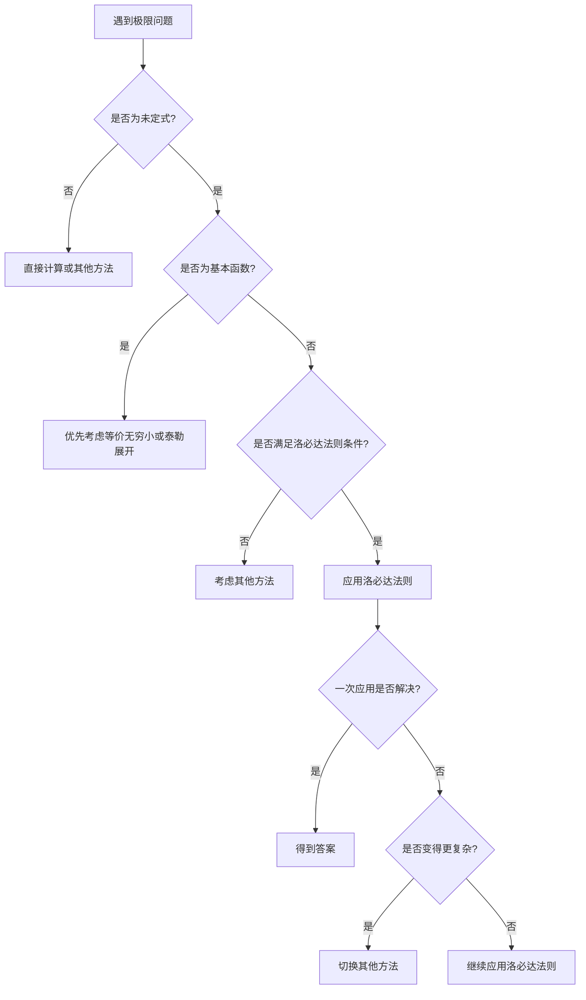

# 2.8 洛必达法则与应用

## 目录

1. [洛必达法则的理论基础](#1-洛必达法则的理论基础)
2. [洛必达法则的标准形式](#2-洛必达法则的标准形式)
3. [七种未定型极限的系统处理](#3-七种未定型极限的系统处理)
4. [洛必达法则的高级应用技巧](#4-洛必达法则的高级应用技巧)
5. [常见错误分析与解题策略](#5-常见错误分析与解题策略)
6. [经典例题与易错类型专项训练](#6-经典例题与易错类型专项训练)
7. [本章知识点总结](#7-本章知识点总结)

---

## 1. 洛必达法则的理论基础

### 1.1 洛必达法则的数学本质

> **核心思想**：洛必达法则将函数值比值的极限转化为导数比值的极限，体现了微分学"以直代曲"的基本思想。当遇到 $\frac{0}{0}$ 或 $\frac{\infty}{\infty}$ 型未定式时，通过比较分子分母的变化速度来确定极限值。

> **几何意义**：
> 
> 对于 $\frac{0}{0}$ 型：比较两条曲线在某点附近的切线斜率
> 
> 对于 $\frac{\infty}{\infty}$ 型：比较两条曲线趋向无穷时的增长速度

### 1.2 洛必达法则的严格表述

> **1.1（ $\frac{0}{0}$ 型洛必达法则）**
> 
> 设函数 $f(x)$ 和 $g(x)$ 满足：
> 1. **可导性条件**：在点 $x_0$ 的某去心邻域内可导
> 2. **未定式条件**： $\lim_{x \to x_0} f(x) = 0$ ， $\lim_{x \to x_0} g(x) = 0$
> 3. **分母导数非零**：在该去心邻域内 $g'(x) \neq 0$
> 4. **导数极限存在**： $\lim_{x \to x_0} \frac{f'(x)}{g'(x)}$ 存在（或为 $\pm\infty$ ）
> 
> 则： 
> $$\lim_{x \to x_0} \frac{f(x)}{g(x)} = \lim_{x \to x_0} \frac{f'(x)}{g'(x)}$$

> **1.2（ $\frac{\infty}{\infty}$ 型洛必达法则）**
> 
> 设函数 $f(x)$ 和 $g(x)$ 满足：
> 1. **可导性条件**：在点 $x_0$ 的某去心邻域内可导
> 2. **未定式条件**： $\lim_{x \to x_0} f(x) = \infty$ ， $\lim_{x \to x_0} g(x) = \infty$
> 3. **分母导数非零**：在该去心邻域内 $g'(x) \neq 0$
> 4. **导数极限存在**： $\lim_{x \to x_0} \frac{f'(x)}{g'(x)}$ 存在（或为 $\pm\infty$ ）
> 
> 则： 
> $$\lim_{x \to x_0} \frac{f(x)}{g(x)} = \lim_{x \to x_0} \frac{f'(x)}{g'(x)}$$

> ⚠️ **关键提醒**：四个条件必须同时满足，缺一不可！很多学生容易忽略条件验证。

### 1.3 洛必达法则的证明要点

#### **证明思路（基于Cauchy中值定理）**

**对于 $\frac{0}{0}$ 型**：利用Cauchy中值定理，在区间内找到中间点 $\xi$ ，使得函数值比等于导数比，通过极限过程建立等式。

**对于 $\frac{\infty}{\infty}$ 型**：利用变形技巧将问题转化为 $\frac{0}{0}$ 型或直接使用广义Cauchy中值定理。

---

## 2. 洛必达法则的标准形式

### 2.1 基本形式的扩展

#### **无穷远处的洛必达法则**

> **2.1**：当 $x \to \infty$ 时，若满足相应条件，洛必达法则同样适用：
> $$\lim_{x \to \infty} \frac{f(x)}{g(x)} = \lim_{x \to \infty} \frac{f'(x)}{g'(x)}$$

#### **单侧极限的洛必达法则**

> **2.2**：洛必达法则对左极限和右极限同样适用：
> $$\lim_{x \to x_0^+} \frac{f(x)}{g(x)} = \lim_{x \to x_0^+} \frac{f'(x)}{g'(x)}$$
> $$\lim_{x \to x_0^-} \frac{f(x)}{g(x)} = \lim_{x \to x_0^-} \frac{f'(x)}{g'(x)}$$

---

## 3. 七种未定型极限的系统处理

### 3.1 直接适用型

#### **类型1： $\frac{0}{0}$ 型**

> **转换策略**：直接应用洛必达法则，分子分母同时求导
> 
> **操作要点**： $\lim \frac{f(x)}{g(x)} = \lim \frac{f'(x)}{g'(x)}$，可多次使用

> **标准处理流程**：
> 1. 验证未定式条件
> 2. 检查可导性和分母导数非零
> 3. 计算导数比值的极限
> 4. 必要时多次应用

> **典型例题**：求 $\lim_{x \to 0} \frac{\sin x - x}{x^3}$

**解答**：
$$\lim_{x \to 0} \frac{\sin x - x}{x^3} \stackrel{L}{=} \lim_{x \to 0} \frac{\cos x - 1}{3x^2} \stackrel{L}{=} \lim_{x \to 0} \frac{-\sin x}{6x} \stackrel{L}{=} \lim_{x \to 0} \frac{-\cos x}{6} = -\frac{1}{6}$$

#### **类型2： $\frac{\infty}{\infty}$ 型**

> **转换策略**：直接应用洛必达法则，分子分母同时求导
> 
> **操作要点**： $\lim \frac{f(x)}{g(x)} = \lim \frac{f'(x)}{g'(x)}$，观察增长速度

> **标准处理流程**：
> 1. 验证分子分母都趋向无穷
> 2. 检查可导性条件
> 3. 直接应用洛必达法则
> 4. 观察函数增长速度对比

> **典型例题**：求 $\lim_{x \to +\infty} \frac{x^2}{e^x}$

**解答**：
$$\lim_{x \to +\infty} \frac{x^2}{e^x} \stackrel{L}{=} \lim_{x \to +\infty} \frac{2x}{e^x} \stackrel{L}{=} \lim_{x \to +\infty} \frac{2}{e^x} = 0$$

**重要结论**：指数函数的增长速度超过任何幂函数
$$\lim_{x \to +\infty} \frac{x^n}{e^x} = 0, \quad \lim_{x \to +\infty} \frac{e^x}{x^n} = +\infty$$

### 3.2 需要转化的未定型

#### **类型3： $0 \cdot \infty$ 型**

> **转换策略**：化乘法为除法，将两个因子之一写成分母
> 
> **操作要点**： $f \cdot g = \frac{f}{1/g}$ 或 $\frac{g}{1/f}$，转为 $\frac{0}{0}$ 或 $\frac{\infty}{\infty}$ 型

> **具体转化**：
> $$f(x) \cdot g(x) = \frac{f(x)}{1/g(x)} \text{（转为 } \frac{0}{0} \text{ 型）}$$
> $$f(x) \cdot g(x) = \frac{g(x)}{1/f(x)} \text{（转为 } \frac{\infty}{\infty} \text{ 型）}$$

> **典型例题**：求 $\lim_{x \to 0^+} x \ln x$

**解答**：
$$\lim_{x \to 0^+} x \ln x = \lim_{x \to 0^+} \frac{\ln x}{1/x} \stackrel{L}{=} \lim_{x \to 0^+} \frac{1/x}{-1/x^2} = \lim_{x \to 0^+} (-x) = 0$$

#### **类型4： $\infty - \infty$ 型**

> **转换策略**：化减法为除法，找公分母或进行有理化
> 
> **操作要点**：通分得到分数，或对根式进行有理化处理

> **具体转化**：
> 1. **通分法**： $f(x) - g(x) = \frac{f(x)h(x) - g(x)h(x)}{h(x)}$
> 2. **有理化法**：适用于根式差
> 3. **提取公因子法**

> **典型例题**：求 $\lim_{x \to 0} \left(\frac{1}{x} - \frac{1}{\sin x}\right)$

**解答**：
$$\lim_{x \to 0} \left(\frac{1}{x} - \frac{1}{\sin x}\right) = \lim_{x \to 0} \frac{\sin x - x}{x \sin x}$$

分子分母都趋于0，应用洛必达法则：
$$= \lim_{x \to 0} \frac{\cos x - 1}{\sin x + x \cos x} \stackrel{L}{=} \lim_{x \to 0} \frac{-\sin x}{\cos x + \cos x - x \sin x} = \lim_{x \to 0} \frac{-\sin x}{2\cos x - x \sin x} = \frac{0}{2} = 0$$

### 3.3 幂指型未定式（取对数法）

#### **统一处理原则**

对于 $[f(x)]^{g(x)}$ 型，设  $y = [f(x)]^{g(x)}$ ，取对数：
$$\ln y = g(x) \ln f(x)$$

先求 $\lim \ln y$ ，再求 $\lim y = e^{\lim \ln y}$

#### **类型5： $1^{\infty}$ 型**

> **转换策略**：对幂指函数取对数，化为 $0 \cdot \infty$ 型
> 
> **操作要点**：设  $y = f^g$，取对数得 $\ln y = g \ln f$，先求 $\lim \ln y$，再求 $e^{\lim \ln y}$

> **典型例题**：求 $\lim_{x \to +\infty} \left(1 + \frac{1}{x}\right)^x$

**解答**：
设  $y = \left(1 + \frac{1}{x}\right)^x$ ，则：
$$\ln y = x \ln\left(1 + \frac{1}{x}\right)$$
$$\lim_{x \to +\infty} \ln y = \lim_{x \to +\infty} \frac{\ln\left(1 + \frac{1}{x}\right)}{1/x} \stackrel{L}{=} \lim_{x \to +\infty} \frac{\frac{-1/x^2}{1 + 1/x}}{-1/x^2} = \lim_{x \to +\infty} \frac{1}{1 + 1/x} = 1$$

因此： $\lim_{x \to +\infty} y = e^1 = e$

#### **类型6： $0^0$ 型**

> **转换策略**：对幂指函数取对数，化为 $0 \cdot \infty$ 型
> 
> **操作要点**：设  $y = f^g$，取对数得 $\ln y = g \ln f$，先求 $\lim \ln y$，再求 $e^{\lim \ln y}$

> **典型例题**：求 $\lim_{x \to 0^+} x^x$

**解答**：
设  $y = x^x$ ，取对数：
$$\ln y = x \ln x$$

先求 $\lim_{x \to 0^+} \ln y$：
$$\lim_{x \to 0^+} \ln y = \lim_{x \to 0^+} x \ln x = \lim_{x \to 0^+} \frac{\ln x}{1/x} \stackrel{L}{=} \lim_{x \to 0^+} \frac{1/x}{-1/x^2} = \lim_{x \to 0^+} (-x) = 0$$

因此： $\lim_{x \to 0^+} x^x = e^0 = 1$

> **标准结论**： $\lim_{x \to 0^+} x^x = 1$

#### **类型7： $\infty^0$ 型**

> **转换策略**：对幂指函数取对数，化为 $\frac{\infty}{\infty}$ 型
> 
> **操作要点**：设  $y = f^g$，取对数得 $\ln y = g \ln f$，先求 $\lim \ln y$，再求 $e^{\lim \ln y}$

> **典型例题**：求 $\lim_{x \to +\infty} x^{1/x}$

**解答**：
设  $y = x^{1/x}$ ，取对数：
$$\ln y = \frac{1}{x} \ln x = \frac{\ln x}{x}$$

这是 $\frac{\infty}{\infty}$ 型，应用洛必达法则：
$$\lim_{x \to +\infty} \ln y = \lim_{x \to +\infty} \frac{\ln x}{x} \stackrel{L}{=} \lim_{x \to +\infty} \frac{1/x}{1} = \lim_{x \to +\infty} \frac{1}{x} = 0$$

因此： $\lim_{x \to +\infty} x^{1/x} = e^0 = 1$

> **标准结论**： $\lim_{x \to +\infty} x^{1/x} = 1$

---

## 4. 洛必达法则的高级应用技巧

### 4.1 多次应用的策略

> **什么时候需要多次使用？**
> 
> 当求导一次后仍然是 $\frac{0}{0}$ 或 $\frac{\infty}{\infty}$ 型时，就继续求导，直到得到确定的值。

> **使用技巧**：
> 1. **每次使用前都要检查**：确保还是未定式
> 2. **观察函数变化**：如果越来越复杂，考虑换方法
> 3. **预估使用次数**：分子分母零点的"层次"决定需要求导几次

> **简单判断法则**
> 
> 对于 $\frac{0}{0}$ 型：如果分子在零点附近像 $x^3$ 这样，分母像 $x$ 这样，大概需要求导3-1=2次。

### 4.2 与其他方法的聪明结合

#### **洛必达法则 + 等价无穷小：强强联手**

> **基本思路**：先用等价无穷小把复杂的函数简化，再用洛必达法则处理剩下的部分

> **典型例题**：求 $\lim_{x \to 0} \frac{\tan x - \sin x}{\sin^3 x}$

**解答对比**：

**方法一：直接洛必达（计算繁琐）**
$$\lim_{x \to 0} \frac{\tan x - \sin x}{\sin^3 x} \stackrel{L}{=} \lim_{x \to 0} \frac{\sec^2 x - \cos x}{3\sin^2 x \cos x}$$
继续求导会越来越复杂...

**方法二：泰勒展开（推荐）**
- 先用展开式： $\tan x - \sin x \approx \frac{x^3}{2}$，$\sin^3 x \approx x^3$  
- 直接得到： $\lim_{x \to 0} \frac{\tan x - \sin x}{\sin^3 x} = \frac{1}{2}$

#### **怎么选择最佳方法？**

> **选择指南**：
> - **简单基本函数**：优先用等价无穷小或泰勒展开
> - **复杂组合函数**：洛必达法则比较可靠
> - **需要高精度**：泰勒展开到足够高阶
> - **时间紧张时**：等价无穷小最快

### 4.3 实用应用技巧

#### **技巧1：避免无意义的计算**

> **问题**：有些题目看起来像未定式，其实可以直接化简
> 
> **例子**： $\lim_{x \to 2} \frac{x^2-4}{x-2}$ 不需要洛必达法则！
> 
> **正确做法**：先因式分解 $\frac{(x-2)(x+2)}{x-2} = x+2$，直接得到答案4

#### **技巧2：洛必达法则失效时的应对**

> **什么时候会失效？**
> - 求导后振荡不收敛（如 $\frac{\sin x}{x}$ 在无穷远处）
> - 越求导越复杂
> 
> **应对策略**：
> 1. **立即停止**，不要硬撑
> 2. **回到原式**，尝试其他方法
> 3. **分部处理**，先简化再使用

#### **技巧3：幂指型函数的快速识别**

> **一眼识别法**：
> - 看到 $[\text{趋于1}]^{\text{趋于}\infty}$ → $1^{\infty}$ 型
> - 看到 $[\text{趋于0}]^{\text{趋于0}}$ → $0^0$ 型  
> - 看到 $[\text{趋于}\infty]^{\text{趋于0}}$ → $\infty^0$ 型
> 
> **统一处理**：都是取对数转化！

---

## 5. 常见错误分析与解题策略

### 5.1 典型错误类型

#### **错误1：条件检查不充分**

**错误示例**：直接对 $\lim_{x \to 0} \frac{x^2}{x}$ 使用洛必达法则

**错误分析**：这不是未定式，直接化简得 $\lim_{x \to 0} x = 0$

**防范措施**：使用前必须验证是否为未定式

#### **错误2：无限制地重复使用**

**错误示例**：对 $\lim_{x \to +\infty} \frac{x + \sin x}{x}$ 反复使用洛必达法则

**正确分析**：
- 洛必达法则： $\lim_{x \to +\infty} \frac{1 + \cos x}{1}$ 不存在
- 正确方法： $\lim_{x \to +\infty} \frac{x + \sin x}{x} = \lim_{x \to +\infty} (1 + \frac{\sin x}{x}) = 1$

#### **错误3：幂指型处理错误**

**错误示例**：对 $\lim_{x \to 0^+} (\sin x)^x$ 直接使用洛必达法则

**正确处理**：需要先取对数转化为 $0 \cdot \infty$ 型

### 5.2 洛必达法则失效的典型情况

> **情况1：导数比值极限不存在且不为无穷**
> 
> 此时原极限可能存在，需要用其他方法计算

> **情况2：反复应用后变得更复杂**
> 
> 应及时停止，考虑等价无穷小或泰勒展开

---

## 6. 经典例题与易错类型专项训练

### 6.1 经典例题精选

#### **例题组一： $\frac{0}{0}$ 型经典问题**

> **例题1.1**：求 $\lim_{x \to 0} \frac{e^x - e^{-x} - 2x}{x - \sin x}$

**解法分析**：这是典型的 $\frac{0}{0}$ 型，需要多次应用洛必达法则。

**详细解答**：
$$\begin{aligned}
\lim_{x \to 0} \frac{e^x - e^{-x} - 2x}{x - \sin x} &\stackrel{L}{=} \lim_{x \to 0} \frac{e^x + e^{-x} - 2}{1 - \cos x} \\
&\stackrel{L}{=} \lim_{x \to 0} \frac{e^x - e^{-x}}{\sin x} \\
&\stackrel{L}{=} \lim_{x \to 0} \frac{e^x + e^{-x}}{\cos x} = \frac{1+1}{1} = 2
\end{aligned}$$

**关键技巧**：观察每次求导后的函数形式变化，及时判断是否还需要继续应用。

> **例题1.2**：求 $\lim_{x \to 0} \frac{\tan x - \sin x}{x^3}$

**解法分析**：可以用洛必达法则，也可以用泰勒展开，这里展示两种方法的对比。

**方法一（洛必达法则）**：
$$\begin{aligned}
\lim_{x \to 0} \frac{\tan x - \sin x}{x^3} &\stackrel{L}{=} \lim_{x \to 0} \frac{\sec^2 x - \cos x}{3x^2} \\
&= \lim_{x \to 0} \frac{2\sec^2 x \tan x + \sin x}{6x} \\
&= \lim_{x \to 0} \frac{2\sec^2 x (\sec^2 x + 2\tan^2 x) + \cos x}{6} = \frac{2 + 1}{6} = \frac{1}{2}
\end{aligned}$$

**方法二（泰勒展开，更简洁）**：
$$\tan x - \sin x = \sin x \left(\frac{1}{\cos x} - 1\right) = \sin x \cdot \frac{1-\cos x}{\cos x}$$
利用 $\sin x = x - \frac{x^3}{6} + o(x^3)$ 和 $1 - \cos x = \frac{x^2}{2} + o(x^2)$：
$$\tan x - \sin x = \frac{x^3}{2} + o(x^3)$$
因此： $\lim_{x \to 0} \frac{\tan x - \sin x}{x^3} = \frac{1}{2}$

#### **例题组二： $\frac{\infty}{\infty}$ 型经典问题**

> **例题2.1**：求 $\lim_{x \to +\infty} \frac{x^2 e^x}{e^{2x}}$

**解法分析**：这是 $\frac{\infty}{\infty}$ 型，体现指数函数与幂函数的增长速度比较。

**详细解答**：
$$\begin{aligned}
\lim_{x \to +\infty} \frac{x^2 e^x}{e^{2x}} &= \lim_{x \to +\infty} \frac{x^2}{e^x} \\
&\stackrel{L}{=} \lim_{x \to +\infty} \frac{2x}{e^x} \\
&\stackrel{L}{=} \lim_{x \to +\infty} \frac{2}{e^x} = 0
\end{aligned}$$

**重要结论**： $e^x$ 的增长速度远超任何多项式。

> **例题2.2**：求 $\lim_{x \to +\infty} \frac{\ln(\ln x)}{\ln x}$

**解法分析**：这涉及对数函数的多重嵌套，需要仔细处理导数。

**详细解答**：
$$\lim_{x \to +\infty} \frac{\ln(\ln x)}{\ln x} \stackrel{L}{=} \lim_{x \to +\infty} \frac{\frac{1}{\ln x} \cdot \frac{1}{x}}{\frac{1}{x}} = \lim_{x \to +\infty} \frac{1}{\ln x} = 0$$

#### **例题组三：转化型未定式**

> **例题3.1**：求 $\lim_{x \to 0^+} x^{\sin x}$ （ $0^0$ 型）

**解法分析**：幂指型未定式，需要取对数转化。

**详细解答**：
设  $y = x^{\sin x}$ ，取对数：
$$\ln y = \sin x \ln x$$
$$\begin{aligned}
\lim_{x \to 0^+} \ln y &= \lim_{x \to 0^+} \sin x \ln x \\
&= \lim_{x \to 0^+} \frac{\ln x}{1/\sin x} \\
&\stackrel{L}{=} \lim_{x \to 0^+} \frac{1/x}{-\cos x/\sin^2 x} \\
&= \lim_{x \to 0^+} \frac{-\sin^2 x}{x \cos x} \\
&= \lim_{x \to 0^+} \frac{-\sin x}{\cos x} \cdot \frac{\sin x}{x} = 0 \cdot 1 = 0
\end{aligned}$$

因此： $\lim_{x \to 0^+} x^{\sin x} = e^0 = 1$

> **例题3.2**：求 $\lim_{x \to +\infty} x(\ln(x+1) - \ln x)$ （ $\infty \cdot 0$ 型）

**解法分析**：先化简，再应用洛必达法则。

**详细解答**：
$$\begin{aligned}
\lim_{x \to +\infty} x(\ln(x+1) - \ln x) &= \lim_{x \to +\infty} x \ln\left(\frac{x+1}{x}\right) \\
&= \lim_{x \to +\infty} x \ln\left(1 + \frac{1}{x}\right) \\
&= \lim_{x \to +\infty} \frac{\ln(1 + 1/x)}{1/x} \\
&\stackrel{L}{=} \lim_{x \to +\infty} \frac{\frac{-1/x^2}{1 + 1/x}}{-1/x^2} \\
&= \lim_{x \to +\infty} \frac{1}{1 + 1/x} = 1
\end{aligned}$$

### 6.2 易错类型专项分析

#### **易错类型一：盲目使用洛必达法则**

> **错误示例**：求 $\lim_{x \to +\infty} \frac{x + \sin x}{x}$

**错误做法**：
$$\lim_{x \to +\infty} \frac{x + \sin x}{x} \stackrel{L}{=} \lim_{x \to +\infty} \frac{1 + \cos x}{1}$$
但 $\cos x$ 在无穷远处振荡，极限不存在！

**正确做法**：
$$\lim_{x \to +\infty} \frac{x + \sin x}{x} = \lim_{x \to +\infty} \left(1 + \frac{\sin x}{x}\right) = 1 + 0 = 1$$

> ⚠️ **教训**：洛必达法则失效时必须及时更换方法！

#### **易错类型二：忘记验证适用条件**

> **错误示例**：对 $\lim_{x \to 1} \frac{x^2 - 1}{x - 1}$ 使用洛必达法则

**错误分析**：这不是未定式！当 $x \to 1$ 时，分子 $\to 0$ ，分母 $\to 0$ ，但这是可约分的。

**正确做法**：
$$\lim_{x \to 1} \frac{x^2 - 1}{x - 1} = \lim_{x \to 1} \frac{(x-1)(x+1)}{x-1} = \lim_{x \to 1} (x+1) = 2$$

#### **易错类型三：幂指型处理错误**

> **错误示例**：求 $\lim_{x \to 0^+} (\sin x)^x$

**错误做法**：直接对幂指型函数求导使用洛必达法则。

**正确思路**：
设  $y = (\sin x)^x$ ，取对数：
$$\ln y = x \ln(\sin x)$$
$$\begin{aligned}
\lim_{x \to 0^+} \ln y &= \lim_{x \to 0^+} x \ln(\sin x) \\
&= \lim_{x \to 0^+} \frac{\ln(\sin x)}{1/x} \\
&\stackrel{L}{=} \lim_{x \to 0^+} \frac{\cos x/\sin x}{-1/x^2} \\
&= \lim_{x \to 0^+} \frac{-x^2 \cos x}{\sin x} \\
&= \lim_{x \to 0^+} \frac{-x^2 \cos x}{x} = \lim_{x \to 0^+} (-x \cos x) = 0
\end{aligned}$$

因此： $\lim_{x \to 0^+} (\sin x)^x = e^0 = 1$

#### **易错类型四：多次应用时的计算错误**

> **错误示例**：求 $\lim_{x \to 0} \frac{e^x - 1 - x - \frac{x^2}{2}}{x^3}$

**常见错误**：求导时粗心大意，导致计算错误。

**仔细计算**：
第一次求导：
$$\lim_{x \to 0} \frac{e^x - 1 - x}{3x^2}$$

第二次求导：
$$\lim_{x \to 0} \frac{e^x - 1}{6x}$$

第三次求导：
$$\lim_{x \to 0} \frac{e^x}{6} = \frac{1}{6}$$

> ⚠️ **提醒**：多次求导时，每一步都要认真计算，避免符号和系数错误。

#### **易错类型五：与等价无穷小混淆**

> **错误示例**：求 $\lim_{x \to 0} \frac{\tan x - x}{x^3}$

**错误思路**：直接用 $\tan x \sim x$ ，得到 $\frac{x - x}{x^3} = 0$ 。

**错误分析**：等价无穷小只能用于乘除，不能用于加减！

**正确解法**：
$$\begin{aligned}
\lim_{x \to 0} \frac{\tan x - x}{x^3} &\stackrel{L}{=} \lim_{x \to 0} \frac{\sec^2 x - 1}{3x^2} \\
&= \lim_{x \to 0} \frac{\tan^2 x}{3x^2} = \lim_{x \to 0} \frac{1}{3} \left(\frac{\tan x}{x}\right)^2 = \frac{1}{3} \cdot 1^2 = \frac{1}{3}
\end{aligned}$$

### 6.3 综合训练题组

#### **挑战级例题**

> **挑战题1**：求 $\lim_{x \to 0} \frac{\ln(1 + x + x^2) - \ln(1 + x)}{x^2}$

**解题思路**：利用对数性质先化简，再应用洛必达法则。

**参考解答**：
$$\begin{aligned}
\lim_{x \to 0} \frac{\ln(1 + x + x^2) - \ln(1 + x)}{x^2} &= \lim_{x \to 0} \frac{\ln\left(\frac{1 + x + x^2}{1 + x}\right)}{x^2} \\
&= \lim_{x \to 0} \frac{\ln\left(1 + \frac{x^2}{1 + x}\right)}{x^2} \\
&= \lim_{x \to 0} \frac{1}{x^2} \ln\left(1 + \frac{x^2}{1 + x}\right)
\end{aligned}$$

设  $t = \frac{x^2}{1 + x}$ ，当 $x \to 0$ 时， $t \to 0$ ，且 $\frac{t}{x^2} = \frac{1}{1 + x} \to 1$ 

利用 $\lim_{t \to 0} \frac{\ln(1 + t)}{t} = 1$ ：
$$\lim_{x \to 0} \frac{\ln\left(1 + \frac{x^2}{1 + x}\right)}{x^2} = \lim_{x \to 0} \frac{\ln\left(1 + \frac{x^2}{1 + x}\right)}{\frac{x^2}{1 + x}} \cdot \frac{1}{1 + x} = 1 \cdot 1 = 1$$

> **挑战题2**：求 $\lim_{x \to +\infty} \left(\frac{x+1}{x-1}\right)^x$

**解题思路**：这是 $1^{\infty}$ 型，需要取对数处理。

**参考解答**：
设  $y = \left(\frac{x+1}{x-1}\right)^x$ ，取对数：
$$\ln y = x \ln\left(\frac{x+1}{x-1}\right) = x \ln\left(1 + \frac{2}{x-1}\right)$$

$$\begin{aligned}
\lim_{x \to +\infty} \ln y &= \lim_{x \to +\infty} x \ln\left(1 + \frac{2}{x-1}\right) \\
&= \lim_{x \to +\infty} \frac{\ln\left(1 + \frac{2}{x-1}\right)}{1/x} \\
&\stackrel{L}{=} \lim_{x \to +\infty} \frac{\frac{1}{1 + \frac{2}{x-1}} \cdot \frac{-2}{(x-1)^2}}{-1/x^2} \\
&= \lim_{x \to +\infty} \frac{2x^2}{(x-1)^2 \left(1 + \frac{2}{x-1}\right)} \\
&= \lim_{x \to +\infty} \frac{2x^2}{(x-1)^2 + 2(x-1)} = \lim_{x \to +\infty} \frac{2x^2}{x^2 + 1} = 2
\end{aligned}$$

因此： $\lim_{x \to +\infty} \left(\frac{x+1}{x-1}\right)^x = e^2$

---

## 7. 本章知识点总结

### 7.1 核心理论体系

> **洛必达法则完整体系**
> 
> **理论层次**：定义 → 适用条件 → 证明要点 → 几何意义
> **应用层次**：基本类型 → 转化技巧 → 综合应用 → 失效处理
> **技能层次**：条件判断 → 方法选择 → 计算执行 → 结果验证

### 7.2 七种未定型处理完全图谱

| 未定型类型 | 转换策略 | 经典例题 | 关键技巧 | 常见陷阱 |
|:----------:|:--------:|:--------:|:--------:|:--------:|
| $\frac{0}{0}$ | 分子分母同时求导 | $\frac{\sin x - x}{x^3}$ | 可多次应用 | 忘记验证条件 |
| $\frac{\infty}{\infty}$ | 分子分母同时求导 | $\frac{x^2}{e^x}$ | 观察增长速度 | 无限次应用 |
| $0 \cdot \infty$ | 化乘法为除法 | $x \ln x$ | 选择转化方向 | 转化后更复杂 |
| $\infty - \infty$ | 通分或有理化 | $\frac{1}{x} - \frac{1}{\sin x}$ | 巧妙变形 | 强行通分 |
| $1^{\infty}$ | 取对数转化 | $(1+\frac{1}{x})^x$ | 化为 $0 \cdot \infty$ | 忘记取指数 |
| $0^0$ | 取对数转化 | $x^x$ | 化为 $0 \cdot \infty$ | 直接计算幂函数 |
| $\infty^0$ | 取对数转化 | $x^{1/x}$ | 化为 $\frac{\infty}{\infty}$ | 忽略对数性质 |

### 7.3 方法选择决策树

### 7.4 常用结论与公式速查

> **重要极限结论**
> - 对数爬行，幂函步行，指数飞行
>   - $\lim_{x \to +\infty} \frac{x^n}{e^x} = 0$ （指数函数增长速度最快）
>   - $\lim_{x \to +\infty} \frac{(\ln x)^n}{x^m} = 0$ （ $m > 0$ ，幂函数增长速度 > 对数函数）
> - $\lim_{x \to 0^+} x^x = 1$ ， $\lim_{x \to +\infty} x^{1/x} = 1$
> - $\lim_{x \to +\infty} \left(1 + \frac{a}{x}\right)^x = e^a$

> **转换策略速记**
> - **直接型**（ $\frac{0}{0}, \frac{\infty}{\infty}$）：分子分母同时求导
> - **乘积型**（ $0 \cdot \infty$）：化乘法为除法 → $\frac{f}{1/g}$ 或 $\frac{g}{1/f}$
> - **差值型**（ $\infty - \infty$）：通分或有理化处理
> - **幂指型**（ $1^{\infty}, 0^0, \infty^0$）：取对数 → $\ln y = g \ln f$

---