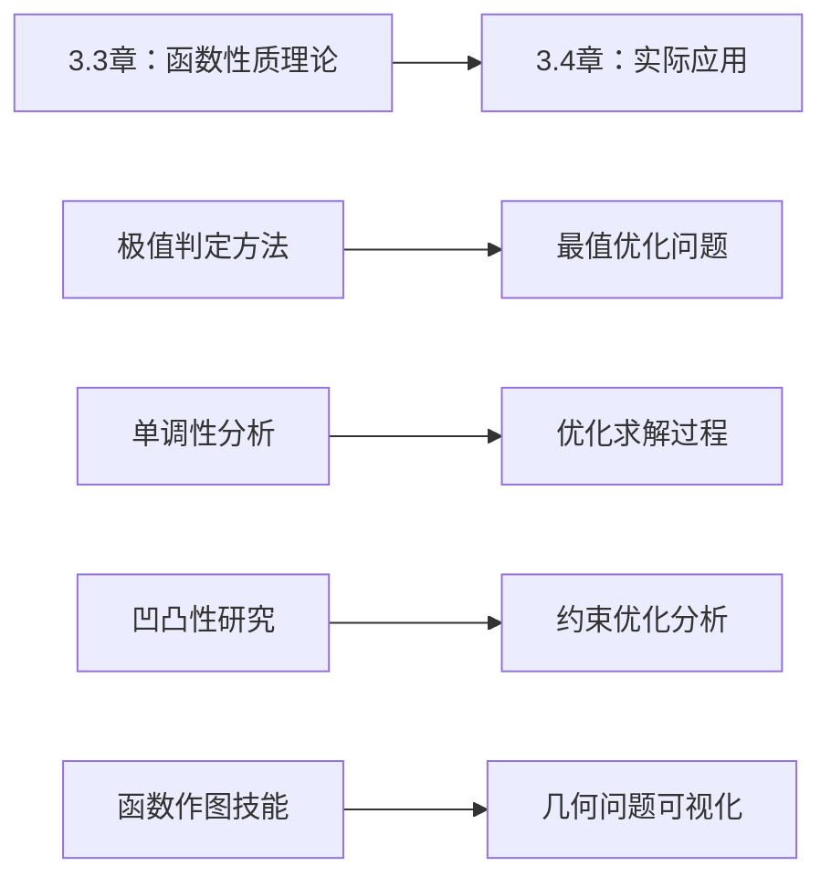

# 3.7 导数的几何应用与优化问题

---

## 章节概览

### 学习目标
1. **最值优化能力**：掌握各类约束和无约束优化问题的求解方法
2. **几何应用技能**：运用导数分析曲线的几何性质和实际问题
3. **建模分析能力**：将实际问题转化为数学优化模型
4. **数值计算方法**：掌握Newton迭代法等数值求解技术
5. **综合应用素养**：形成解决复杂应用问题的系统思维

### 重点难点

> **重点内容**
> - 函数最值的完整求解策略
> - Lagrange乘数法的系统应用
> - 曲率与曲率半径的计算方法
> - 相关变化率问题的建模与求解
> - Newton迭代法的理论与应用

> **难点内容**
> - 多约束条件的优化问题
> - 隐函数和参数方程的几何应用
> - 复杂实际问题的数学建模
> - 数值方法的收敛性分析
> - 优化问题的经济学解释

### 知识架构

```
导数几何应用与优化体系
├── 最值优化理论
│   ├── 无约束优化（基于3.3章极值理论）
│   ├── 等式约束优化（Lagrange乘数法）
│   ├── 不等式约束基础
│   └── 经济学应用
├── 几何应用分析
│   ├── 曲率计算
│   ├── 包络线理论
│   ├── 几何最值问题
│   └── 参数曲线分析
├── 变化率问题
│   ├── 相关变化率
│   ├── 弹性分析
│   ├── 边际分析
│   └── 增长率问题
└── 数值计算方法
    ├── Newton迭代法
    ├── 切线法应用
    ├── 收敛性分析
    └── 误差估计
```

### 与第3.3章的知识联系

本章内容建立在第3.3章函数性质研究的基础上：
- **3.3章极值理论** → **本章最值优化应用**
- **3.3章单调性分析** → **本章优化问题求解**
- **3.3章函数作图** → **本章几何优化可视化**
- **3.3章凹凸性研究** → **本章约束优化分析**

---

## 目录

1. [函数最值问题的系统求解](#1-函数最值问题的系统求解)
2. [Lagrange乘数法与约束优化](#2-lagrange乘数法与约束优化)
3. [曲率与几何应用](#3-曲率与几何应用)
4. [相关变化率与实际应用](#4-相关变化率与实际应用)
5. [Newton迭代法与数值计算](#5-newton迭代法与数值计算)
6. [经济学中的导数应用](#6-经济学中的导数应用)
7. [本章知识点总结](#7-本章知识点总结)

---

## 1. 函数最值问题的系统求解

### 1.1 最值问题的理论基础

> **回顾：极值与最值的区别**
> - **极值**：局部概念，在某个邻域内的最大值或最小值
> - **最值**：全局概念，在整个定义域内的最大值或最小值

> **定理1.1（最值存在定理）**
> 
> 若函数 $f(x)$ 在闭区间 $[a, b]$ 上连续，则 $f(x)$ 在 $[a, b]$ 上必定取得最大值和最小值。

### 1.2 闭区间上最值的求解

#### **标准求解步骤**

1. **求驻点**：利用第3.3章的方法，解方程 $f'(x) = 0$，得到驻点
2. **找不可导点**：确定 $f'(x)$ 不存在的点
3. **计算端点值**：计算 $f(a)$ 和 $f(b)$
4. **计算候选点函数值**：计算所有驻点和不可导点的函数值
5. **比较确定最值**：比较所有候选点的函数值

> **例题1.1**：求函数 $f(x) = x^3 - 3x^2 + 2$ 在区间 $[-1, 3]$ 上的最值。

**解答**：
运用第3.3章学习的方法：
$f'(x) = 3x^2 - 6x = 3x(x - 2)$

**驻点**：$f'(x) = 0$ ⟹ $x = 0$ 或 $x = 2$

**候选点函数值**：
- $f(-1) = (-1)^3 - 3(-1)^2 + 2 = -1 - 3 + 2 = -2$
- $f(0) = 0^3 - 3 \cdot 0^2 + 2 = 2$
- $f(2) = 2^3 - 3 \cdot 2^2 + 2 = 8 - 12 + 2 = -2$
- $f(3) = 3^3 - 3 \cdot 3^2 + 2 = 27 - 27 + 2 = 2$

**结论**：
- 最大值：$f(0) = f(3) = 2$
- 最小值：$f(-1) = f(2) = -2$

### 1.3 开区间和无穷区间上的最值

#### **求解策略**

1. **分析函数性态**：运用第3.3章的单调性和极值理论
2. **考虑端点行为**：分析函数在区间端点的极限行为
3. **比较极值与端点行为**：确定全局最值

### 1.4 实际应用中的最值问题

#### **建模步骤**

1. **理解问题**：明确要优化的目标和约束条件
2. **建立模型**：设定变量，建立目标函数
3. **确定定义域**：根据实际意义确定变量范围
4. **求解最值**：运用第3.3章和本章的方法求解
5. **验证结果**：检验结果的合理性

> **例题1.2**：用一根长为 $l$ 的铁丝围成一个矩形，求矩形面积的最大值。

**解答**：
设矩形的长为 $x$，宽为 $y$。

**约束条件**：$2x + 2y = l$ ⟹ $y = \frac{l - 2x}{2}$

**目标函数**：$S(x) = xy = x \cdot \frac{l - 2x}{2} = \frac{x(l - 2x)}{2}$

**定义域**：$0 < x < \frac{l}{2}$

**求导**：$S'(x) = \frac{l - 4x}{2}$

**驻点**：$S'(x) = 0$ ⟹ $l - 4x = 0$ ⟹ $x = \frac{l}{4}$

**二阶导数判定**：$S''(x) = -2 < 0$，所以 $x = \frac{l}{4}$ 是极大值点。

**结论**：当 $x = y = \frac{l}{4}$ 时，矩形面积最大，最大面积为 $S_{\max} = \frac{l^2}{16}$。

---

## 2. Lagrange乘数法与约束优化

### 2.1 Lagrange乘数法的理论基础

在第3.3章中，我们简单介绍了条件极值的概念。现在我们深入学习解决约束优化问题的强大工具——Lagrange乘数法。

> **定理2.1（Lagrange乘数法）**
> 
> 设函数 $f(x, y)$ 和 $g(x, y)$ 在约束条件 $g(x, y) = 0$ 确定的曲线上连续可微。若 $(x_0, y_0)$ 是约束极值点，且 $\nabla g(x_0, y_0) \neq 0$，则存在常数 $λ$，使得：
> $$\nabla f(x_0, y_0) = λ \nabla g(x_0, y_0)$$

**几何意义**：在约束极值点处，目标函数的梯度与约束函数的梯度平行。

**求解步骤**：
1. 建立Lagrange函数：$L(x, y, λ) = f(x, y) - λg(x, y)$
2. 求偏导数：$\frac{\partial L}{\partial x} = 0$ ， $\frac{\partial L}{\partial y} = 0$ ， $\frac{\partial L}{\partial λ} = 0$
3. 解方程组得到候选点
4. 判断并确定最值

### 2.2 单约束优化问题

> **例题2.1**：求椭圆 $\frac{x^2}{4} + \frac{y^2}{9} = 1$ 上的点到直线 $x + y - 10 = 0$ 距离的最值。

**解答**：
**目标函数**：点 $(x, y)$ 到直线的距离
$$f(x, y) = \frac{|x + y - 10|}{\sqrt{2}}$$

为简化计算，我们优化 $F(x, y) = (x + y - 10)^2$

**约束条件**：$g(x, y) = \frac{x^2}{4} + \frac{y^2}{9} - 1 = 0$

**建立Lagrange函数**：
$$L(x, y, λ) = (x + y - 10)^2 - λ\left(\frac{x^2}{4} + \frac{y^2}{9} - 1\right)$$

**求偏导数并令其为零**：
$$\frac{\partial L}{\partial x} = 2(x + y - 10) - λ \cdot \frac{x}{2} = 0$$
$$\frac{\partial L}{\partial y} = 2(x + y - 10) - λ \cdot \frac{2y}{9} = 0$$
$$\frac{\partial L}{\partial λ} = -\left(\frac{x^2}{4} + \frac{y^2}{9} - 1\right) = 0$$

**求解方程组**：
从前两个方程得：
$$\frac{x + y - 10}{x/2} = \frac{x + y - 10}{2y/9}$$

若 $x + y - 10 \neq 0$，则 $\frac{x}{2} = \frac{2y}{9}$ ⟹ $x = \frac{4y}{9}$

代入约束条件并求解，得到距离的最值。

### 2.3 多约束优化问题

对于多个约束条件的问题：
$$\min f(x, y, z) \quad \text{s.t.} \quad g_1(x, y, z) = 0, \quad g_2(x, y, z) = 0$$

**Lagrange函数**：
$$L = f(x, y, z) - λ_1 g_1(x, y, z) - λ_2 g_2(x, y, z)$$

**必要条件**：
$$\nabla f = λ_1 \nabla g_1 + λ_2 \nabla g_2$$

---

## 3. 曲率与几何应用

### 3.1 曲率的定义与计算

曲率描述了曲线在某点处弯曲的程度，是几何学中的重要概念。

> **定义3.1（曲率）**
> 
> 设曲线 $y = f(x)$ 在点 $M$ 处的曲率为 $κ$，则：
> $$κ = \frac{|f''(x)|}{(1 + [f'(x)]^2)^{3/2}}$$

### 3.2 不同形式曲线的曲率公式

#### **参数方程的曲率**

对于参数方程 $\begin{cases} x = x(t) \\ y = y(t) \end{cases}$：
$$κ = \frac{|x'y'' - y'x''|}{(x'^2 + y'^2)^{3/2}}$$

#### **极坐标的曲率**

对于极坐标方程 $ρ = ρ(θ)$：
$$κ = \frac{|ρ^2 + 2ρ'^2 - ρρ''|}{(ρ^2 + ρ'^2)^{3/2}}$$

### 3.3 曲率半径与几何意义

> **定义3.2（曲率半径）**
> 
> 曲率半径定义为曲率的倒数：$$R = \frac{1}{κ} = \frac{(1 + [f'(x)]^2)^{3/2}}{|f''(x)|}$$

**几何意义**：曲率半径表示在该点处与曲线"最吻合"的圆的半径。

> **例题3.2**：求圆 $\begin{cases} x = r\cos t \\ y = r\sin t \end{cases}$ 的曲率。

**解答**：
$x' = -r\sin t$ ， $y' = r\cos t$
$x'' = -r\cos t$ ， $y'' = -r\sin t$

$$κ = \frac{|x'y'' - y'x''|}{(x'^2 + y'^2)^{3/2}} = \frac{|(-r\sin t)(-r\sin t) - (r\cos t)(-r\cos t)|}{(r^2\sin^2 t + r^2\cos^2 t)^{3/2}}$$

$$= \frac{r^2\sin^2 t + r^2\cos^2 t}{r^3} = \frac{r^2}{r^3} = \frac{1}{r}$$

这证明了圆的曲率是常数 $\frac{1}{r}$，曲率半径就是圆的半径。

> **例题3.3**：求椭圆 $\frac{x^2}{a^2} + \frac{y^2}{b^2} = 1$（$a > b > 0$）上曲率的最大值和最小值。

**解答**：
参数方程：$\begin{cases} x = a\cos t \\ y = b\sin t \end{cases}$

经过计算可得：
$$κ(t) = \frac{ab}{(a^2\sin^2 t + b^2\cos^2 t)^{3/2}}$$

**最大曲率**：在短轴端点 $(0, ±b)$ ， $κ_{max} = \frac{a}{b^2}$
**最小曲率**：在长轴端点 $(±a, 0)$ ， $κ_{min} = \frac{b}{a^2}$

---

## 4. 相关变化率与实际应用

### 4.1 相关变化率问题的理论基础

**基本思想**：当几个变量之间存在某种函数关系时，如果其中一些变量随时间变化，那么其他变量的变化率可以通过已知变化率求出。

#### **标准求解步骤**

1. **理解问题**：明确各变量及其关系
2. **建立关系式**：根据几何或物理关系建立函数关系
3. **对时间求导**：利用链式法则对时间 $t$ 求导
4. **代入已知条件**：代入已知的变化率和瞬时值
5. **求解目标变化率**

### 4.2 几何类相关变化率问题

> **例题4.2**：一个长为10米的梯子靠在墙上，梯子底端以每秒2米的速度离开墙根滑动。当梯子底端距墙根6米时，梯子顶端下滑的速度是多少？

**解答**：
设梯子底端距墙根距离为 $x$，顶端距地面高度为 $y$，梯子长度为 $l = 10$。

**建立关系式**：$x^2 + y^2 = l^2 = 100$

**对时间求导**：$2x\frac{dx}{dt} + 2y\frac{dy}{dt} = 0$

**已知条件**：$\frac{dx}{dt} = 2$ m/s，当 $x = 6$ 时 ， $y = \sqrt{100 - 36} = 8$

**求解**：
$$2 \times 6 \times 2 + 2 \times 8 \times \frac{dy}{dt} = 0$$
$$\frac{dy}{dt} = -\frac{24}{16} = -1.5 \text{ m/s}$$

梯子顶端以1.5 m/s的速度下滑。

> **例题4.3**：一个圆锥形容器，顶点向下，顶角为60°，高为20厘米。水以每秒5立方厘米的速度注入容器。当水深为10厘米时，水面上升的速度是多少？

**解答**：
设水深为 $h$，水面半径为 $r$，水的体积为 $V$。

**几何关系**：由于顶角为60° ， $\tan 30° = \frac{r}{h}$，所以 $r = \frac{h}{\sqrt{3}}$

**体积关系**：$V = \frac{1}{3}πr^2h = \frac{1}{3}π\left(\frac{h}{\sqrt{3}}\right)^2h = \frac{πh^3}{9}$

**对时间求导**：$\frac{dV}{dt} = \frac{π}{9} \cdot 3h^2 \cdot \frac{dh}{dt} = \frac{πh^2}{3}\frac{dh}{dt}$

**已知条件**：$\frac{dV}{dt} = 5$ cm³/s ， $h = 10$ cm

**求解**：
$$5 = \frac{π \times 100}{3} \times \frac{dh}{dt}$$
$$\frac{dh}{dt} = \frac{15}{100π} = \frac{3}{20π} \text{ cm/s}$$

### 4.3 物理类相关变化率问题

> **例题4.4**：一个球形肥皂泡，其半径以每秒0.1厘米的速度增长。当半径为5厘米时：
> 1. 表面积的变化率是多少？
> 2. 体积的变化率是多少？

**解答**：
设球的半径为 $r$，表面积为 $S$，体积为 $V$。

**关系式**：$S = 4πr^2$ ， $V = \frac{4}{3}πr^3$

**对时间求导**：
$\frac{dS}{dt} = 8πr\frac{dr}{dt}$
$\frac{dV}{dt} = 4πr^2\frac{dr}{dt}$

**已知条件**：$\frac{dr}{dt} = 0.1$ cm/s ， $r = 5$ cm

**求解**：
1. $\frac{dS}{dt} = 8π \times 5 \times 0.1 = 4π$ cm²/s
2. $\frac{dV}{dt} = 4π \times 25 \times 0.1 = 10π$ cm³/s

---

## 5. Newton迭代法与数值计算

### 5.1 Newton迭代法的几何解释

Newton迭代法的几何意义是用切线逼近曲线与x轴的交点。

**迭代过程**：
1. 从初始点 $x_0$ 开始
2. 作函数图像在点 $(x_0, f(x_0))$ 处的切线
3. 切线与x轴的交点作为下一个近似值 $x_1$
4. 重复此过程

**切线方程**：$y - f(x_n) = f'(x_n)(x - x_n)$
**与x轴交点**：令 $y = 0$，得 $x_{n+1} = x_n - \frac{f(x_n)}{f'(x_n)}$

### 5.2 收敛性分析

> **定理5.2（Newton法收敛性）**
> 
> 设 $f(x)$ 在包含根 $x^*$ 的区间上二阶连续可导，且 $f'(x^*) ≠ 0$，则存在 $δ > 0$，当 $|x_0 - x^*| < δ$ 时，Newton迭代序列收敛到 $x^*$，且收敛阶为2。

**收敛条件**：
1. $f'(x) ≠ 0$ 在根附近
2. 初值 $x_0$ 选择恰当
3. $\frac{f(x)f''(x)}{[f'(x)]^2}$ 在根附近有界

### 5.3 典型应用实例

> **例题5.1**：用Newton迭代法求方程 $x^3 - 2x - 5 = 0$ 在 $x = 2$ 附近的根。

**解答**：
$f(x) = x^3 - 2x - 5$ ， $f'(x) = 3x^2 - 2$

**Newton迭代公式**：
$$x_{n+1} = x_n - \frac{x_n^3 - 2x_n - 5}{3x_n^2 - 2}$$

**迭代过程**（取 $x_0 = 2$）：
- $x_1 = 2 - \frac{8 - 4 - 5}{12 - 2} = 2 - \frac{-1}{10} = 2.1$
- $x_2 = 2.1 - \frac{(2.1)^3 - 2(2.1) - 5}{3(2.1)^2 - 2} ≈ 2.0946$
- $x_3 ≈ 2.0946$ (已收敛到足够精度)

> **例题5.2**：用Newton迭代法求 $\sqrt[3]{7}$ 的近似值。

**解答**：
问题等价于求解 $x^3 - 7 = 0$。

$f(x) = x^3 - 7$ ， $f'(x) = 3x^2$

**Newton迭代公式**：
$$x_{n+1} = x_n - \frac{x_n^3 - 7}{3x_n^2} = x_n - \frac{x_n}{3} + \frac{7}{3x_n^2} = \frac{2x_n}{3} + \frac{7}{3x_n^2}$$

**迭代过程**（取 $x_0 = 2$）：
- $x_1 = \frac{4}{3} + \frac{7}{12} = \frac{16 + 7}{12} = \frac{23}{12} ≈ 1.9167$
- $x_2 ≈ 1.9129$ (更接近真值 $\sqrt[3]{7} ≈ 1.9129$)

### 5.4 Newton法的变形与改进

#### **简化Newton法**
当 $f'(x)$ 计算复杂时，可用 $f'(x_0)$ 代替 $f'(x_n)$：
$$x_{n+1} = x_n - \frac{f(x_n)}{f'(x_0)}$$

#### **割线法**
用差商近似导数：
$$x_{n+1} = x_n - \frac{f(x_n)(x_n - x_{n-1})}{f(x_n) - f(x_{n-1})}$$

---

## 6. 经济学中的导数应用

### 6.1 边际分析理论

**边际**是经济学中的核心概念，表示某个经济变量发生单位变化时，相应的因变量的变化量。

#### **基本边际概念**

1. **边际成本**：$MC(q) = C'(q)$
2. **边际收益**：$MR(q) = R'(q)$  
3. **边际利润**：$MP(q) = P'(q) = MR(q) - MC(q)$

#### **边际分析的经济意义**

- **边际成本递增**：$MC'(q) > 0$，规模不经济
- **边际收益递减**：$MR'(q) < 0$，需求价格弹性递减
- **利润最大化条件**：$MR(q) = MC(q)$

### 6.2 弹性分析

> **定义6.1（弹性）**
> 
> 函数 $y = f(x)$ 在点 $x$ 处的弹性定义为：
> $$E_x(y) = \frac{dy/y}{dx/x} = \frac{x}{y} \cdot \frac{dy}{dx}$$

#### **需求价格弹性**

对于需求函数 $q = f(p)$：
$$E_p(q) = \frac{p}{q} \cdot \frac{dq}{dp}$$

- $|E_p(q)| > 1$：需求富有弹性
- $|E_p(q)| < 1$：需求缺乏弹性  
- $|E_p(q)| = 1$：单位弹性

> **例题6.2**：设需求函数为 $q = 100 - 2p$，求：
> 1. 需求价格弹性
> 2. 价格为20时的弹性

**解答**：
$\frac{dq}{dp} = -2$

**弹性函数**：
$$E_p(q) = \frac{p}{q} \cdot (-2) = \frac{-2p}{100 - 2p}$$

**当 $p = 20$ 时**：
$q = 100 - 40 = 60$
$$E_p(q) = \frac{-2 \times 20}{60} = -\frac{2}{3}$$

需求缺乏弹性。

### 6.3 生产函数分析

> **例题6.3**：设生产函数为 $Q = AL^αK^β$（Cobb-Douglas生产函数），其中 $A, α, β > 0$。分析：
> 1. 劳动的边际产出
> 2. 资本的边际产出
> 3. 规模报酬特征

**解答**：

1. **劳动边际产出**：
$$MP_L = \frac{∂Q}{∂L} = AαL^{α-1}K^β = α \cdot \frac{Q}{L}$$

2. **资本边际产出**：
$$MP_K = \frac{∂Q}{∂K} = AβL^αK^{β-1} = β \cdot \frac{Q}{K}$$

3. **规模报酬分析**：
设生产规模扩大 $λ$ 倍：
$$f(λL, λK) = A(λL)^α(λK)^β = λ^{α+β}AL^αK^β = λ^{α+β}Q$$

- 当 $α + β > 1$ 时：规模报酬递增
- 当 $α + β = 1$ 时：规模报酬不变
- 当 $α + β < 1$ 时：规模报酬递减

---

## 7. 本章知识点总结

### 7.1 核心方法总结

| 方法名称 | 适用问题 | 关键步骤 | 注意事项 |
|---------|----------|----------|----------|
| **微分法求最值** | 无约束优化 | 求导→驻点→判定 | 考虑端点和不可导点 |
| **Lagrange乘数法** | 等式约束优化 | 建立Lagrange函数→求梯度 | 检验约束规范性 |
| **曲率计算** | 几何分析 | 应用曲率公式 | 注意参数方程形式 |
| **相关变化率** | 动态问题 | 建立关系→对时间求导 | 正确理解物理意义 |
| **Newton迭代法** | 数值求解 | 切线逼近→迭代更新 | 选择合适初值 |
| **边际分析** | 经济问题 | 求导数→经济解释 | 理解边际含义 |

### 7.2 重要公式汇总

#### **曲率公式大全**
- **显式函数**：$κ = \frac{|y''|}{(1+y'^2)^{3/2}}$
- **参数方程**：$κ = \frac{|x'y''-y'x''|}{(x'^2+y'^2)^{3/2}}$
- **极坐标**：$κ = \frac{|ρ^2+2ρ'^2-ρρ''|}{(ρ^2+ρ'^2)^{3/2}}$

#### **经济学常用公式**
- **边际成本**：$MC = C'(q)$
- **边际收益**：$MR = R'(q)$
- **弹性**：$E_x(y) = \frac{x}{y} \cdot \frac{dy}{dx}$
- **利润最大化**：$MR = MC$

### 7.3 与第3.3章的知识整合

本章内容是第3.3章理论的实际应用：



### 7.4 考研重点提醒

#### **必考知识点（★★★★★）**

1. **最值问题的完整求解**
   - 闭区间上的最值求法
   - 实际优化问题的建模
   - 边界条件的检验

2. **Lagrange乘数法的熟练应用**  
   - 单约束条件问题
   - 多约束条件基础
   - 经济学背景的优化

3. **相关变化率问题的建模**
   - 几何类变化率问题
   - 物理类变化率问题
   - 正确建立关系式

4. **实际应用问题的数学转化**
   - 经济学中的边际分析
   - 物理学中的优化问题
   - 几何学中的最值问题

#### **重要考点（★★★★）**

1. **曲率的计算与应用**
2. **Newton迭代法的原理与收敛性**
3. **弹性分析在经济学中的应用**

#### **常考题型（★★★）**

1. **综合优化问题**
2. **几何最值问题**
3. **经济学应用题**

---

> **结语**：
> 
> 导数的几何应用与优化问题体现了微分学的实用价值，从第3.3章的纯数学函数分析到本章的实际问题建模求解，展现了数学工具的强大威力。掌握这些方法和技巧，不仅能够解决考研中的应用题，更为后续的高等数学学习和实际工作奠定坚实基础。
> 
> 特别要注意本章与第3.3章的有机结合，理论指导实践，实践检验理论，形成完整的微分学应用体系。 