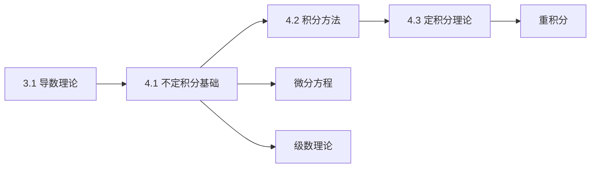

# 4.1 不定积分基础理论

---

## 章节概览

### 学习目标
1. **概念理解**：深刻理解原函数与不定积分的概念，掌握积分的本质
2. **理论基础**：熟练掌握不定积分的性质和基本定理
3. **计算技能**：熟练运用基本积分公式和积分运算法则
4. **几何直观**：理解不定积分的几何意义和物理背景
5. **应用能力**：能够灵活运用不定积分解决实际问题

### 重点难点

> **重点内容**
> - 原函数与不定积分的定义
> - 不定积分的基本性质和运算法则
> - 基本积分公式表的熟练掌握
> - 简单函数的不定积分计算
> - 积分与导数的互逆关系

> **难点内容**
> - 原函数存在性定理的理解
> - 不定积分的几何意义深层理解
> - 复杂函数原函数的存在性判断
> - 积分常数的正确理解和应用
> - 分段函数的积分处理

### 知识架构

```
不定积分基础理论
├── 原函数概念体系
│   ├── 原函数的定义
│   ├── 原函数存在性定理
│   └── 原函数的性质
├── 不定积分理论
│   ├── 不定积分的定义
│   ├── 几何意义
│   └── 物理意义
├── 基本性质与法则
│   ├── 线性性质
│   ├── 复合函数积分
│   └── 积分运算法则
├── 基本积分公式
│   ├── 幂函数积分
│   ├── 指数函数积分
│   ├── 三角函数积分
│   └── 反三角函数积分
└── 特殊问题
    ├── 分段函数积分
    ├── 含绝对值函数积分
    └── 积分存在性判定
```

### 与其他章节的联系



---

## 目录

1. [原函数与不定积分的概念](#1-原函数与不定积分的概念)
2. [不定积分的基本性质](#2-不定积分的基本性质)
3. [基本积分公式表](#3-基本积分公式表)
4. [不定积分的几何与物理意义](#4-不定积分的几何与物理意义)
5. [简单函数的不定积分计算](#5-简单函数的不定积分计算)
6. [本章知识点总结](#6-本章知识点总结)
7. [例题解析](#7-例题解析)

---

## 1. 原函数与不定积分的概念

### 1.1 原函数的严格定义

> **定义1.1（原函数）**
> 
> 设函数 $f(x)$ 在区间 $I$ 上有定义，如果存在函数 $F(x)$，使得在区间 $I$ 上处处有
> $$F'(x) = f(x)$$
> 则称 $F(x)$ 为 $f(x)$ 在区间 $I$ 上的一个**原函数**。

**重要说明**：
1. 原函数的定义域必须是区间（连通的）
2. 等式 $F'(x) = f(x)$ 必须在整个区间上成立
3. 原函数如果存在，则有无穷多个

> **定理1.1（原函数存在性定理）**
> 
> 如果函数 $f(x)$ 在区间 $[a,b]$ 上连续，则 $f(x)$ 在 $[a,b]$ 上必有原函数。

**几何直观**：连续函数的图像是一条连续的曲线，其下方的"面积函数"就是它的一个原函数。

> **定理1.2（原函数的性质）**
> 
> 若 $F(x)$ 是 $f(x)$ 在区间 $I$ 上的一个原函数，则：
> 1. $F(x) + C$（ $C$ 为任意常数）也是 $f(x)$ 的原函数
> 2. $f(x)$ 的任意两个原函数之间只相差一个常数

**证明要点**：
- 设 $F_1(x)$ 和 $F_2(x)$ 都是 $f(x)$ 的原函数
- 则 $(F_1(x) - F_2(x))' = F_1'(x) - F_2'(x) = f(x) - f(x) = 0$
- 由导数为零的函数必为常数，得 $F_1(x) - F_2(x) = C$

### 1.2 不定积分的定义

> **定义1.2（不定积分）**
> 
> 函数 $f(x)$ 的所有原函数组成的集合称为 $f(x)$ 的**不定积分**，记作
> $$\int f(x) \, dx = F(x) + C$$
> 其中 $F(x)$ 是 $f(x)$ 的任意一个原函数， $C$ 为任意常数，称为**积分常数**。

**符号说明**：
- $\int$ ：积分号
- $f(x)$ ：被积函数
- $x$ ：积分变量
- $dx$ ：微分符号
- $C$ ：积分常数（必不可少！）

> **注意事项**：
> 1. 积分常数 $C$ 不能省略
> 2. 积分变量可以是任意符号： $\int f(t) \, dt = F(t) + C$
> 3. 不定积分表示的是函数族，不是单一函数

### 1.3 微分与积分的互逆关系

> **基本公式（微积分基本定理的微分形式）**
> 
> 1. $\frac{d}{dx} \int f(x) \, dx = f(x)$
> 2. $\int F'(x) \, dx = F(x) + C$
> 3. $\int dF(x) = F(x) + C$

**应用示例**：
- $\frac{d}{dx} \int \sin x \, dx = \sin x$
- $\int \cos x \, dx = \sin x + C$
- $\int d(\ln x) = \ln x + C$

> **例题1.1**：验证 $F(x) = x^3 + 2x - 1$ 是 $f(x) = 3x^2 + 2$ 的原函数。

**解答**：
$$F'(x) = \frac{d}{dx}(x^3 + 2x - 1) = 3x^2 + 2 = f(x)$$
因此 $F(x) = x^3 + 2x - 1$ 确实是 $f(x) = 3x^2 + 2$ 的一个原函数。

---

## 2. 不定积分的基本性质

### 2.1 线性性质

> **性质2.1（线性性）**
> 
> 设函数 $f(x)$ 和 $g(x)$ 的原函数都存在，则：
> 1. $\int [f(x) + g(x)] \, dx = \int f(x) \, dx + \int g(x) \, dx$
> 2. $\int kf(x) \, dx = k \int f(x) \, dx$（ $k$ 为非零常数）
> 
> 综合表示为：
> $$\int [af(x) + bg(x)] \, dx = a\int f(x) \, dx + b\int g(x) \, dx$$

**证明**：基于导数的线性性质
$$\frac{d}{dx}[aF(x) + bG(x)] = aF'(x) + bG'(x) = af(x) + bg(x)$$

> **例题2.1**：计算 $\int (3x^2 + 2\sin x - e^x) \, dx$

**解答**：
$$\int (3x^2 + 2\sin x - e^x) \, dx = 3\int x^2 \, dx + 2\int \sin x \, dx - \int e^x \, dx$$
$$= 3 \cdot \frac{x^3}{3} + 2(-\cos x) - e^x + C = x^3 - 2\cos x - e^x + C$$

### 2.2 不变性定理

> **性质2.2（积分形式不变性）**
> 
> 设 $\int f(u) \, du = F(u) + C$，其中 $u$ 为中间变量，则有：
> $$\int f[\varphi(x)] \varphi'(x) \, dx = F[\varphi(x)] + C$$

符号理解：$f(u)$ 是 $F(u)$ 的导数，$F(u)$ 是 $f(u)$ 的不定积分（反导函数）

这是**第一类换元积分法**的理论基础。

**几何解释**：积分的"形式"在变量替换下保持不变。

> **例题2.2**：利用不变性计算 $\int 2x \cos(x^2) \, dx$

**解答**：
设 $u = x^2$，则 $du = 2x \, dx$
$$\int 2x \cos(x^2) \, dx = \int \cos u \, du = \sin u + C = \sin(x^2) + C$$

### 2.3 分部积分的理论基础

> **性质2.3（分部积分公式）**
> 
> 若函数 $u(x)$ 和 $v(x)$ 都可微，则：
> $$\int u(x) v'(x) \, dx = u(x)v(x) - \int u'(x) v(x) \, dx$$
> 或写成：
> $$\int u \, dv = uv - \int v \, du$$
> $dv$ 代表 $v'(x) dx$ → $v$ 的微分部分； $du$ 代表 $u'(x) dx$ → $u$ 的微分部分。

**推导**：基于乘积的微分法则
$$(uv)' = u'v + uv' \Rightarrow uv' = (uv)' - u'v$$
两边积分得分部积分公式。

---

## 3. 基本积分公式表

> **重要说明**：本节的积分公式与**参见**：[附录A-常用数学表格速查.md](./附录A-常用数学表格速查.md#4-基本积分表) - 第4节：基本积分表 保持一致，建议结合使用以达到最佳学习效果。

### 3.1 幂函数积分

| 被积函数 | 不定积分 | 适用条件 | 记忆要点 |
|:--------:|:--------:|:--------:|:---------|
| $k$ (常数) | $kx + C$ | 全体实数 | 常数的积分 |
| $x^n$ | $\frac{x^{n+1}}{n+1} + C$ | $n \neq -1$ | 指数加1除以新指数 |
| $\frac{1}{x}$ | $\ln\|x\| + C$ | $x \neq 0$ | 特殊情况，注意绝对值 |
| $\frac{1}{\sqrt{x}}$ | $2\sqrt{x} + C$ | $x > 0$ | $x^{-1/2}$ 的积分 |
| $\frac{1}{x^2}$ | $-\frac{1}{x} + C$ | $x \neq 0$ | $x^{-2}$ 的积分 |
| $\frac{1}{x^n}$ | $\frac{x^{1-n}}{1-n} + C$ | $n \neq 1, x \neq 0$ | 负指数幂 |

> **重要提醒**：
> - $\int x^{-1} \, dx = \ln|x| + C$ 是唯一例外
> - 当 $n = -1$ 时，幂函数积分公式失效
> - 对于 $\frac{1}{x}$ 要特别注意定义域和绝对值

### 3.2 指数与对数函数积分

| 被积函数 | 不定积分 | 适用条件 | 记忆要点 |
|:--------:|:--------:|:--------:|:---------|
| $e^x$ | $e^x + C$ | 全体实数 | 自然指数函数的特殊性 |
| $a^x$ | $\frac{a^x}{\ln a} + C$ | $a > 0, a \neq 1$ | 一般指数函数 |
| $e^{ax}$ | $\frac{1}{a}e^{ax} + C$ | $a \neq 0$ | 复合指数函数 |
| $\frac{1}{x}$ | $\ln\|x\| + C$ | $x \neq 0$ | 对数函数的导数 |

### 3.3 三角函数积分

| 被积函数 | 不定积分 | 定义域限制 | 记忆技巧 |
|:--------:|:--------:|:--------:|:---------|
| $\sin x$ | $-\cos x + C$ | $\mathbb{R}$ | 正弦积分为负余弦 |
| $\cos x$ | $\sin x + C$ | $\mathbb{R}$ | 余弦积分为正弦 |
| $\tan x$ | $-\ln\|\cos x\| + C$ | $x \neq \frac{\pi}{2}+k\pi$ | 或 $\ln\|\sec x\| + C$ |
| $\cot x$ | $\ln\|\sin x\| + C$ | $x \neq k\pi$ | 余切积分 |
| $\sec x$ | $\ln\|\sec x + \tan x\| + C$ | $x \neq \frac{\pi}{2}+k\pi$ | 正割积分（重要） |
| $\csc x$ | $-\ln\|\csc x + \cot x\| + C$ | $x \neq k\pi$ | 余割积分 |
| $\sec^2 x$ | $\tan x + C$ | $x \neq \frac{\pi}{2}+k\pi$ | 正割平方 |
| $\csc^2 x$ | $-\cot x + C$ | $x \neq k\pi$ | 余割平方 |
| $\sec x \tan x$ | $\sec x + C$ | $x \neq \frac{\pi}{2}+k\pi$ | 正割正切乘积 |
| $\csc x \cot x$ | $-\csc x + C$ | $x \neq k\pi$ | 余割余切乘积 |

### 3.4 反三角函数相关积分

| 被积函数 | 不定积分 | 适用条件 | 重要程度 |
|:--------:|:--------:|:--------:|:--------:|
| $\frac{1}{\sqrt{1-x^2}}$ | $\arcsin x + C$ | $\|x\| < 1$ | ⭐⭐⭐⭐⭐ |
| $\frac{1}{1+x^2}$ | $\arctan x + C$ | $\mathbb{R}$ | ⭐⭐⭐⭐⭐ |
| $\frac{1}{\sqrt{a^2-x^2}}$ | $\arcsin \frac{x}{a} + C$ | $\|x\| < a$ | ⭐⭐⭐⭐ |
| $\frac{1}{a^2+x^2}$ | $\frac{1}{a}\arctan \frac{x}{a} + C$ | $a \neq 0$ | ⭐⭐⭐⭐ |
| $\frac{1}{x\sqrt{x^2-a^2}}$ | $\frac{1}{a}\text{arcsec}\frac{\|x\|}{a} + C$ | $\|x\| > a$ | ⭐⭐⭐ |

### 3.5 根式积分

| 被积函数 | 不定积分 | 适用条件 | 技巧 |
|:--------:|:--------:|:--------:|:-----|
| $\frac{1}{\sqrt{x^2+a^2}}$ | $\ln(x+\sqrt{x^2+a^2}) + C$ | $a \neq 0$ | 双曲正弦反函数 |
| $\frac{1}{\sqrt{x^2-a^2}}$ | $\ln\left\|x+\sqrt{x^2-a^2}\right\| + C$ | $\|x\| > a > 0$ | 需要绝对值 |
| $\frac{1}{\sqrt{a^2-x^2}}$ | $\arcsin \frac{x}{a} + C$ | $\|x\| < a$ | 三角替换 |
| $\sqrt{a^2-x^2}$ | $\frac{x}{2}\sqrt{a^2-x^2} + \frac{a^2}{2}\arcsin \frac{x}{a} + C$ | $\|x\| \leq a$ | 分部积分 |
| $\sqrt{x^2+a^2}$ | $\frac{x}{2}\sqrt{x^2+a^2} + \frac{a^2}{2}\ln(x+\sqrt{x^2+a^2}) + C$ | $a \neq 0$ | 分部积分 |
| $\sqrt{x^2-a^2}$ | $\frac{x}{2}\sqrt{x^2-a^2} - \frac{a^2}{2}\ln\left\|x+\sqrt{x^2-a^2}\right\| + C$ | $\|x\| > a$ | 分部积分 |

### 3.6 双曲函数积分

| 被积函数 | 不定积分 | 记忆要点 |
|:--------:|:--------:|:---------|
| $\sinh x$ | $\cosh x + C$ | 双曲正弦积分双曲余弦 |
| $\cosh x$ | $\sinh x + C$ | 双曲余弦积分双曲正弦 |
| $\tanh x$ | $\ln(\cosh x) + C$ | 双曲正切积分对数双曲余弦 |
| $\text{coth} x$ | $\ln\|\sinh x\| + C$ | 双曲余切积分对数双曲正弦 |
| $\text{sech}^2 x$ | $\tanh x + C$ | 双曲正割平方积分双曲正切 |
| $\text{csch}^2 x$ | $-\text{coth} x + C$ | 双曲余割平方积分负双曲余切 |

### 3.7 有理函数积分

| 被积函数 | 不定积分 | 方法 |
|:--------:|:--------:|:-----|
| $\frac{1}{x^2+a^2}$ | $\frac{1}{a}\arctan \frac{x}{a} + C$ | 直接公式 |
| $\frac{1}{x^2-a^2}$ | $\frac{1}{2a}\ln\left\|\frac{x-a}{x+a}\right\| + C$ | 部分分式 |
| $\frac{1}{(x+a)^n}$ | $\frac{(x+a)^{1-n}}{1-n} + C$ | $n \neq 1$ |
| $\frac{x}{x^2+a^2}$ | $\frac{1}{2}\ln(x^2+a^2) + C$ | 换元积分 |
| $\frac{1}{x(x+a)}$ | $\frac{1}{a}\ln\left\|\frac{x}{x+a}\right\| + C$ | 部分分式 |

> **参考资料**：更多积分公式请**参见**：[附录A-常用数学表格速查.md](./附录A-常用数学表格速查.md#4-基本积分表) - 第4节：基本积分表，其中包含了完整的积分公式速查表。

---

## 4. 不定积分的几何与物理意义

### 4.1 几何意义

> **几何意义**：
> 
> 不定积分 $\int f(x) \, dx = F(x) + C$ 的几何意义是：
> - 表示曲线族 $y = F(x) + C$
> - 这些曲线的切线斜率处处为 $f(x)$
> - 不同的 $C$ 值对应不同的曲线，但它们平行（形状相同）

**直观理解**：
1. **积分曲线族**：所有原函数构成的曲线族
2. **方向场**：函数 $f(x)$ 确定了每点的切线方向
3. **积分常数的几何意义**：确定曲线在 $y$ 轴方向的平移

> **例题4.1**：描述 $\int 2x \, dx = x^2 + C$ 的几何意义。

**解答**：
- 积分结果表示抛物线族 $y = x^2 + C$
- 对于任意 $C$ 值，曲线 $y = x^2 + C$ 在点 $(x_0, x_0^2 + C)$ 处的切线斜率都是 $2x_0$
- 不同 $C$ 值对应的抛物线形状相同，只是在 $y$ 轴方向有平移

### 4.2 物理意义

> **物理意义**：
> 
> 在物理学中，不定积分常用于：
> 1. **运动学**：已知加速度求速度，已知速度求位移
> 2. **力学**：已知力求功，已知质量分布求质心
> 3. **电学**：已知电流求电荷，已知电场强度求电势

**运动学应用**：
- 若 $a(t)$ 为加速度，则速度 $v(t) = \int a(t) \, dt$
- 若 $v(t)$ 为速度，则位移 $s(t) = \int v(t) \, dt$

> **例题4.2**：质点做直线运动，加速度为 $a(t) = 6t$，初始时刻速度为 $v_0 = 5$ m/s，求速度函数。

**解答**：
$$v(t) = \int a(t) \, dt = \int 6t \, dt = 3t^2 + C$$
由初始条件 $v(0) = 5$：
$$v(0) = 3 \cdot 0^2 + C = C = 5$$
因此速度函数为 $v(t) = 3t^2 + 5$。

---

## 5. 简单函数的不定积分计算

### 5.1 直接积分法

**方法要点**：直接应用基本积分公式

> **例题5.1**：计算下列不定积分：
> 1. $\int (3x^4 - 2x^3 + x - 5) \, dx$
> 2. $\int \left(\frac{2}{x^3} + \frac{3}{\sqrt{x}} - 4e^x\right) \, dx$

**解答**：

1. $$\int (3x^4 - 2x^3 + x - 5) \, dx = 3 \cdot \frac{x^5}{5} - 2 \cdot \frac{x^4}{4} + \frac{x^2}{2} - 5x + C$$
   $$= \frac{3x^5}{5} - \frac{x^4}{2} + \frac{x^2}{2} - 5x + C$$

2. $$\int \left(\frac{2}{x^3} + \frac{3}{\sqrt{x}} - 4e^x\right) \, dx = \int (2x^{-3} + 3x^{-1/2} - 4e^x) \, dx$$
   $$= 2 \cdot \frac{x^{-2}}{-2} + 3 \cdot \frac{x^{1/2}}{1/2} - 4e^x + C = -\frac{1}{x^2} + 6\sqrt{x} - 4e^x + C$$

### 5.2 简单的复合函数积分

**方法要点**：识别复合函数结构，应用不变性定理

> **例题5.2**：计算下列不定积分：
> 1. $\int \sin(3x + 2) \, dx$
> 2. $\int e^{-2x} \, dx$
> 3. $\int \frac{1}{2x + 1} \, dx$
> 4. $\int x \sin(x^2) \, dx$
> 5. $\int \frac{x}{\sqrt{x^2+1}} \, dx$

**解答**：

1. 设 $u = 3x + 2$，则 $du = 3 \, dx$，$dx = \frac{1}{3} du$
   $$\int \sin(3x + 2) \, dx = \frac{1}{3} \int \sin u \, du = -\frac{1}{3} \cos u + C = -\frac{1}{3} \cos(3x + 2) + C$$

2. 设 $u = -2x$，则 $du = -2 \, dx$，$dx = -\frac{1}{2} du$
   $$\int e^{-2x} \, dx = -\frac{1}{2} \int e^u \, du = -\frac{1}{2} e^u + C = -\frac{1}{2} e^{-2x} + C$$

3. 设 $u = 2x + 1$，则 $du = 2 \, dx$，$dx = \frac{1}{2} du$
   $$\int \frac{1}{2x + 1} \, dx = \frac{1}{2} \int \frac{1}{u} \, du = \frac{1}{2} \ln|u| + C = \frac{1}{2} \ln|2x + 1| + C$$

4. **计算** $\int x \sin(x^2) \, dx$

   **解题思路**：识别内层函数 $x^2$，其导数 $2x$ 与外层的 $x$ 相关
   
   设 $u = x^2$，则 $du = 2x \, dx$，$x \, dx = \frac{1}{2} du$
   
   $$\int x \sin(x^2) \, dx = \int \sin(x^2) \cdot x \, dx = \int \sin u \cdot \frac{1}{2} \, du$$
   $$= \frac{1}{2} \int \sin u \, du = \frac{1}{2}(-\cos u) + C = -\frac{1}{2}\cos(x^2) + C$$

5. **计算** $\int \frac{x}{\sqrt{x^2+1}} \, dx$

   **解题思路**：观察到分子 $x$ 是分母根号内 $x^2+1$ 的导数的一半
   
   设 $u = x^2 + 1$，则 $du = 2x \, dx$，$x \, dx = \frac{1}{2} du$
   
   $$\int \frac{x}{\sqrt{x^2+1}} \, dx = \int \frac{1}{\sqrt{x^2+1}} \cdot x \, dx = \int \frac{1}{\sqrt{u}} \cdot \frac{1}{2} \, du$$
   $$= \frac{1}{2} \int u^{-1/2} \, du = \frac{1}{2} \cdot \frac{u^{1/2}}{1/2} + C = \frac{1}{2} \cdot 2u^{1/2} + C$$
   $$= \sqrt{u} + C = \sqrt{x^2+1} + C$$

> **解题要点总结**：
> - **关键观察**：寻找内层函数的导数在积分式中的出现
> - **换元原则**：当被积函数可写成 $f[g(x)] \cdot g'(x)$ 的形式时，设 $u = g(x)$
> - **验证方法**：对结果求导应得到原被积函数

### 5.3 利用三角恒等式的积分

> **例题5.3**：计算 $\int \sin^2 x \, dx$

**解答**：
利用恒等式 $\sin^2 x = \frac{1 - \cos 2x}{2}$：
$$\int \sin^2 x \, dx = \int \frac{1 - \cos 2x}{2} \, dx = \frac{1}{2} \int (1 - \cos 2x) \, dx$$
$$= \frac{1}{2}\left(x - \frac{\sin 2x}{2}\right) + C = \frac{x}{2} - \frac{\sin 2x}{4} + C$$

**常用三角恒等式**：
- $\sin^2 x = \frac{1 - \cos 2x}{2}$
- $\cos^2 x = \frac{1 + \cos 2x}{2}$
- $\tan^2 x = \sec^2 x - 1$

---

## 6. 本章知识点总结

### 6.1 核心概念总结

| 概念 | 定义要点 | 重要性质 |
|:----:|:---------|:---------|
| 原函数 | $F'(x) = f(x)$ | 存在则有无穷多个 |
| 不定积分 | $\int f(x) \, dx = F(x) + C$ | 表示原函数族 |
| 积分常数 | 任意常数 $C$ | 不可省略 |
| 线性性质 | $\int [af(x) + bg(x)] \, dx$ | 积分的基本运算法则 |

### 6.2 基本积分公式分类

#### **代数函数类**
- 幂函数：$\int x^n \, dx = \frac{x^{n+1}}{n+1} + C$ （$n \neq -1$）
- 倒数函数：$\int \frac{1}{x} \, dx = \ln|x| + C$

#### **超越函数类**
- 指数函数：$\int e^x \, dx = e^x + C$
- 三角函数：$\int \sin x \, dx = -\cos x + C$
- 反三角函数：$\int \frac{1}{\sqrt{1-x^2}} \, dx = \arcsin x + C$

### 6.3 常见错误与注意事项

> **常见错误**：
> 1. **忘记积分常数**：$\int x \, dx = \frac{x^2}{2}$ ❌  正确：$\frac{x^2}{2} + C$ ✓
> 2. **幂函数积分错误**：$\int x^{-1} \, dx = \frac{x^0}{0}$ ❌  正确：$\ln|x| + C$ ✓
> 3. **三角函数积分符号错误**：$\int \sin x \, dx = \cos x + C$ ❌  正确：$-\cos x + C$ ✓
> 4. **复合函数系数错误**：$\int \sin(2x) \, dx = -\cos(2x) + C$ ❌  正确：$-\frac{1}{2}\cos(2x) + C$ ✓

### 6.4 解题策略总结

> **解题步骤**：
> 1. **识别函数类型**：确定被积函数的基本形式
> 2. **选择积分方法**：直接积分、换元积分或分部积分
> 3. **应用积分公式**：正确使用基本积分公式
> 4. **检验结果**：对结果求导验证正确性
> 5. **注意常数**：不要忘记加积分常数

---

## 7. 例题解析

### 7.1 基础计算题

> **例题7.1**：计算 $\int \left(x^3 - \frac{2}{x^2} + \sqrt{x} - 3e^x + \sin x\right) \, dx$

**解题思路**：利用线性性质，逐项积分

**详细解答**：
$$\int \left(x^3 - \frac{2}{x^2} + \sqrt{x} - 3e^x + \sin x\right) \, dx$$

$$= \int x^3 \, dx - 2\int x^{-2} \, dx + \int x^{1/2} \, dx - 3\int e^x \, dx + \int \sin x \, dx$$

$$= \frac{x^4}{4} - 2 \cdot \frac{x^{-1}}{-1} + \frac{x^{3/2}}{3/2} - 3e^x + (-\cos x) + C$$

$$= \frac{x^4}{4} + \frac{2}{x} + \frac{2x^{3/2}}{3} - 3e^x - \cos x + C$$

### 7.2 复合函数积分

> **例题7.2**：计算 $\int (2x + 1)^5 \, dx$

**解题思路**：识别复合函数结构，使用换元法

**详细解答**：
设 $u = 2x + 1$，则 $du = 2 \, dx$，$dx = \frac{1}{2} du$

$$\int (2x + 1)^5 \, dx = \int u^5 \cdot \frac{1}{2} \, du = \frac{1}{2} \int u^5 \, du$$

$$= \frac{1}{2} \cdot \frac{u^6}{6} + C = \frac{u^6}{12} + C = \frac{(2x + 1)^6}{12} + C$$


### 7.3 三角函数积分应用

> **例题7.3**：计算 $\int \cos^2 x \, dx$

**解题思路**：利用三角恒等式化简

**详细解答**：
利用恒等式 $\cos^2 x = \frac{1 + \cos 2x}{2}$：

$$\int \cos^2 x \, dx = \int \frac{1 + \cos 2x}{2} \, dx = \frac{1}{2} \int (1 + \cos 2x) \, dx$$

$$= \frac{1}{2}\left(x + \frac{\sin 2x}{2}\right) + C = \frac{x}{2} + \frac{\sin 2x}{4} + C$$

### 7.4 综合应用题

> **例题7.4**：已知 $f'(x) = 3x^2 + 2x - 1$，且 $f(1) = 5$，求 $f(x)$。

**解题思路**：通过不定积分求原函数，利用初始条件确定积分常数

**详细解答**：
由题意：$f(x) = \int f'(x) \, dx = \int (3x^2 + 2x - 1) \, dx$

$$f(x) = 3 \cdot \frac{x^3}{3} + 2 \cdot \frac{x^2}{2} - x + C = x^3 + x^2 - x + C$$

利用初始条件 $f(1) = 5$：
$$f(1) = 1^3 + 1^2 - 1 + C = 1 + 1 - 1 + C = 1 + C = 5$$

解得 $C = 4$

因此：$f(x) = x^3 + x^2 - x + 4$

**验证**：
- $f'(x) = 3x^2 + 2x - 1$ ✓
- $f(1) = 1 + 1 - 1 + 4 = 5$ ✓

---

## 8. 常见错误分析与学习建议

### 8.1 常见错误类型

#### **错误1：忘记积分常数**
❌ **错误**：$\int 2x \, dx = x^2$
✅ **正确**：$\int 2x \, dx = x^2 + C$

> **重要提醒**：不定积分表示的是函数族，积分常数 $C$ 必不可少！

#### **错误2：积分公式应用错误**
❌ **错误**：$\int \frac{1}{x^2} \, dx = \frac{x^{-1}}{-1} + C = -\frac{1}{x} + C$ （公式记忆错误）
✅ **正确**：$\int x^{-2} \, dx = \frac{x^{-2+1}}{-2+1} + C = \frac{x^{-1}}{-1} + C = -\frac{1}{x} + C$

#### **错误3：定义域问题**
❌ **错误**：$\int \frac{1}{x} \, dx = \ln x + C$
✅ **正确**：$\int \frac{1}{x} \, dx = \ln\|x\| + C$ （注意绝对值）

#### **错误4：线性性质误用**
❌ **错误**：$\int \frac{1}{x+1} \, dx = \frac{\int dx}{\int (x+1) dx} = \frac{x}{\frac{x^2}{2}+x+C}$
✅ **正确**：$\int \frac{1}{x+1} \, dx = \ln\|x+1\| + C$

> **关键提醒**：积分的线性性质只适用于和差，不适用于乘除！
