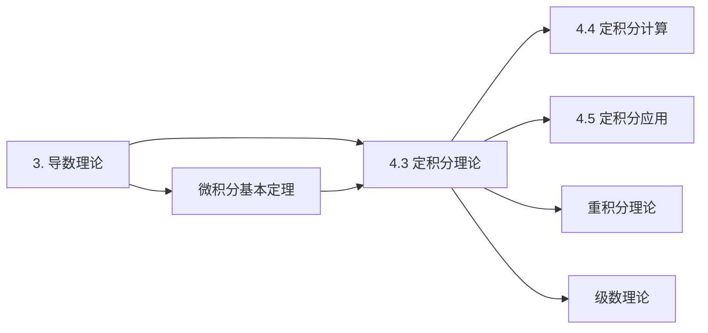

# 4.3 定积分理论基础

---

## 章节概览

### 学习目标
1. **概念理解**：深刻理解定积分的定义和本质，掌握黎曼积分的思想
2. **几何意义**：理解定积分的几何意义和物理背景
3. **性质掌握**：熟练掌握定积分的基本性质和运算法则
4. **定理应用**：熟练运用微积分基本定理计算定积分
5. **存在性理论**：理解定积分存在的充分条件

### 重点难点

> **重点内容**
> - 定积分的定义（黎曼积分）
> - 定积分的几何意义和物理意义
> - 定积分的基本性质
> - 微积分基本定理（牛顿-莱布尼茨公式）
> - 定积分存在性定理

> **难点内容**
> - 定积分定义中极限过程的理解
> - 可积函数类的判定
> - 微积分基本定理的证明思想
> - 变上限积分函数的性质
> - 定积分与不定积分的关系

### 知识架构

```
定积分理论基础
├── 定积分的定义
│   ├── 黎曼积分定义
│   ├── 分割与求和
│   └── 极限过程
├── 几何与物理意义
│   ├── 面积问题
│   ├── 物理应用
│   └── 几何解释
├── 定积分的性质
│   ├── 线性性质
│   ├── 区间可加性
│   ├── 保序性
│   └── 估值定理
├── 微积分基本定理
│   ├── 变上限积分函数
│   ├── 第一基本定理
│   ├── 第二基本定理
│   └── 牛顿-莱布尼茨公式
└── 存在性理论
    ├── 连续函数可积
    ├── 单调函数可积
    └── 有界且不连续点有限
```

### 与前后章节的联系



---

## 目录

1. [定积分的定义](#1-定积分的定义)
2. [定积分的几何与物理意义](#2-定积分的几何与物理意义)
3. [定积分的基本性质](#3-定积分的基本性质)
4. [微积分基本定理](#4-微积分基本定理)
5. [定积分存在性理论](#5-定积分存在性理论)
6. [变上限积分函数](#6-变上限积分函数)
7. [典型例题解析](#7-典型例题解析)

---

## 1. 定积分的定义

### 1.1 背景：面积问题

**历史背景**：计算曲线下方的面积是定积分产生的直接动因。

**问题描述**：设函数 $f(x) \geq 0$ 在区间 $[a,b]$ 上连续，求曲线 $y = f(x)$、直线 $x = a$、$x = b$ 和 $x$ 轴所围成的曲边梯形的面积。

**解决思路**：
1. **分割**：将区间 $[a,b]$ 分成 $n$ 个小区间
2. **近似**：用矩形面积近似每个小区间上的曲边梯形面积
3. **求和**：将所有小矩形面积相加
4. **取极限**：让分割越来越细，求和的极限

### 1.2 定积分的直观理解（简化版）

在严格的数学定义之前，我们先从直观角度理解定积分：

> **直观定义（定积分的本质）**
> 
> 定积分 $\int_a^b f(x) \, dx$ 就是将区间 $[a,b]$ 分成很多很小的部分，在每个小部分上：
> 1. **宽度**：用 $\Delta x$ 表示
> 2. **高度**：用函数值 $f(x)$ 表示  
> 3. **面积**：$f(x) \cdot \Delta x$
> 4. **求和**：将所有小矩形面积加起来
> 5. **取极限**：让分割越来越细，得到精确值

**数学表达**：
$$\int_a^b f(x) \, dx = \lim_{\text{分割越来越细}} \sum \text{(高度)} \times \text{(宽度)}$$

### 1.3 黎曼积分的严格定义

> **定义1.1（定积分/黎曼积分）**
> 
> 设函数 $f(x)$ 在区间 $[a,b]$ 上有界。
> 
> **步骤1**：对区间 $[a,b]$ 作分割 $T: a = x_0 < x_1 < x_2 < \cdots < x_n = b$
> 
> **步骤2**：记 $\Delta x_i = x_i - x_{i-1}$（第 $i$ 个小区间的长度）
> 
> **步骤3**：在每个小区间 $[x_{i-1}, x_i]$ 上任选一点 $\xi_i$
> 
> **步骤4**：构造黎曼和 $S = \sum_{i=1}^n f(\xi_i) \Delta x_i$
> 
> **步骤5**：若当分割越来越细时，黎曼和趋于同一极限 $I$，则称此极限为定积分：
> $$\int_a^b f(x) \, dx = I$$

**重要性质**：
- 定积分的值与分割方式无关
- 定积分的值与介点选择无关
- 定积分存在时称 $f(x)$ 在 $[a,b]$ 上**可积**

### 1.4 特殊约定

> **约定**：
> 1. **上下限相等**：$\int_a^a f(x) \, dx = 0$
> 2. **上下限互换**：$\int_a^b f(x) \, dx = -\int_b^a f(x) \, dx$
> 3. **积分变量无关性**：$\int_a^b f(x) \, dx = \int_a^b f(t) \, dt$

---

## 2. 定积分的几何与物理意义

### 2.1 几何意义

#### **基本几何意义**

> **几何意义**：
> 
> 定积分 $\int_a^b f(x) \, dx$ 表示由曲线 $y = f(x)$、直线 $x = a$、$x = b$ 和 $x$ 轴所围成图形的**有向面积**：
> - 当 $f(x) \geq 0$ 时，定积分等于曲线上方的面积
> - 当 $f(x) \leq 0$ 时，定积分等于曲线下方面积的负值
> - 当 $f(x)$ 变号时，定积分等于各部分有向面积的代数和

**实际面积的计算**：
若要求真实的几何面积，需要：
$$S = \int_a^b |f(x)| \, dx$$

> **例题2.1**：求 $y = \sin x$ 在 $[0, 2\pi]$ 上与 $x$ 轴围成的面积。

**解答**：
由于 $\sin x$ 在 $[0, \pi]$ 上为正，在 $[\pi, 2\pi]$ 上为负：
$$\int_0^{2\pi} \sin x \, dx = \int_0^\pi \sin x \, dx + \int_\pi^{2\pi} \sin x \, dx = 2 + (-2) = 0$$

实际面积为：
$$S = \int_0^{2\pi} |\sin x| \, dx = \int_0^\pi \sin x \, dx + \int_\pi^{2\pi} (-\sin x) \, dx = 2 + 2 = 4$$

### 2.2 物理意义

#### **运动学应用**

> **物理意义**：
> 
> 1. **位移**：若 $v(t)$ 是速度函数，则 $\int_{t_1}^{t_2} v(t) \, dt$ 表示从时刻 $t_1$ 到 $t_2$ 的位移
> 2. **路程**：$\int_{t_1}^{t_2} |v(t)| \, dt$ 表示从时刻 $t_1$ 到 $t_2$ 的路程
> 3. **功**：若 $F(x)$ 是力函数，则 $\int_{x_1}^{x_2} F(x) \, dx$ 表示力所做的功
> 4. **质量**：若 $\rho(x)$ 是线密度，则 $\int_a^b \rho(x) \, dx$ 表示线段的总质量

> **例题2.2**：质点沿直线运动，速度为 $v(t) = t^2 - 4t + 3$（$t$ 从0到5），求位移和路程。

**解答**：
先求 $v(t) = 0$ 的时刻：$t^2 - 4t + 3 = 0$，得 $t = 1$ 或 $t = 3$

位移：
$$s = \int_0^5 v(t) \, dt = \int_0^5 (t^2 - 4t + 3) \, dt$$
$$= \left[\frac{t^3}{3} - 2t^2 + 3t\right]_0^5 = \frac{125}{3} - 50 + 15 = \frac{125 - 150 + 45}{3} = \frac{20}{3}$$

路程：由于 $v(t)$ 在 $[1,3]$ 上为负：
$$\text{路程} = \int_0^1 v(t) \, dt + \int_1^3 |v(t)| \, dt + \int_3^5 v(t) \, dt$$
$$= \int_0^1 v(t) \, dt - \int_1^3 v(t) \, dt + \int_3^5 v(t) \, dt$$

### 2.3 其他应用

- **概率论**：连续型随机变量的概率密度函数积分
- **工程学**：信号处理中的能量、功率计算
- **经济学**：消费者剩余、生产者剩余

---

## 3. 定积分的基本性质

### 3.1 线性性质

> **性质3.1（线性性）**
> 
> 设函数 $f(x)$ 和 $g(x)$ 在 $[a,b]$ 上可积，$k_1, k_2$ 为常数，则：
> $$\int_a^b [k_1 f(x) + k_2 g(x)] \, dx = k_1 \int_a^b f(x) \, dx + k_2 \int_a^b g(x) \, dx$$

**几何解释**：定积分保持线性运算。

### 3.2 区间可加性

> **性质3.2（区间可加性）**
> 
> 设函数 $f(x)$ 在包含点 $a$、$b$、$c$ 的区间上可积，则：
> $$\int_a^b f(x) \, dx = \int_a^c f(x) \, dx + \int_c^b f(x) \, dx$$
> 
> 该性质对于 $a$、$b$、$c$ 的任意排列都成立。

**应用**：当被积函数在某点不连续时，可以分段计算。

### 3.3 保序性（单调性）

> **性质3.3（保序性）**
> 
> 设函数 $f(x)$ 和 $g(x)$ 在 $[a,b]$ 上可积：
> 1. 若 $f(x) \geq 0$，则 $\int_a^b f(x) \, dx \geq 0$
> 2. 若 $f(x) \leq g(x)$，则 $\int_a^b f(x) \, dx \leq \int_a^b g(x) \, dx$
> 3. 若 $f(x) \leq g(x)$ 且 $f(x) < g(x)$ 在某个子区间上成立，则 $\int_a^b f(x) \, dx < \int_a^b g(x) \, dx$

### 3.4 估值定理

> **性质3.4（估值定理）**
> 
> 设函数 $f(x)$ 在 $[a,b]$ 上可积，且 $m \leq f(x) \leq M$，则：
> $$m(b-a) \leq \int_a^b f(x) \, dx \leq M(b-a)$$

**推广形式**：若 $g(x) \geq 0$ 且 $f(x)$、$g(x)$ 都可积，$m \leq f(x) \leq M$，则：
$$m \int_a^b g(x) \, dx \leq \int_a^b f(x)g(x) \, dx \leq M \int_a^b g(x) \, dx$$

### 3.5 积分中值定理

> **定理3.1（积分第一中值定理）**
> 
> 设函数 $f(x)$ 在 $[a,b]$ 上连续，则至少存在一点 $\xi \in [a,b]$，使得：
> $$\int_a^b f(x) \, dx = f(\xi)(b-a)$$

**几何意义**：存在一个矩形，其面积等于曲线下的面积。

> **定理3.2（积分第二中值定理）**
> 
> 设函数 $f(x)$ 在 $[a,b]$ 上连续，$g(x)$ 在 $[a,b]$ 上可积且不变号，则至少存在一点 $\xi \in [a,b]$，使得：
> $$\int_a^b f(x)g(x) \, dx = f(\xi) \int_a^b g(x) \, dx$$

> **例题3.1**：利用积分中值定理估计 $\int_0^1 e^{x^2} \, dx$ 的值

**解答**：
在 $[0,1]$ 上，$f(x) = e^{x^2}$ 连续。
- 当 $x = 0$ 时，$f(0) = e^0 = 1$
- 当 $x = 1$ 时，$f(1) = e^1 = e$
- $f(x)$ 在 $[0,1]$ 上单调递增

由积分中值定理，存在 $\xi \in [0,1]$，使得：
$$\int_0^1 e^{x^2} \, dx = e^{\xi^2} \cdot 1 = e^{\xi^2}$$

因为 $1 \leq e^{\xi^2} \leq e$，所以：
$$1 \leq \int_0^1 e^{x^2} \, dx \leq e$$

### 3.6 绝对值不等式

> **性质3.6（绝对值不等式）**
> 
> 设函数 $f(x)$ 在 $[a,b]$ 上可积，则 $|f(x)|$ 也可积，且：
> $$\left|\int_a^b f(x) \, dx\right| \leq \int_a^b |f(x)| \, dx$$

**应用**：用于估计积分的绝对值。

### 3.7 重要不等式

#### **柯西-施瓦茨不等式**

> **定理3.3（柯西-施瓦茨不等式）**
> 
> 设函数 $f(x)$ 和 $g(x)$ 在 $[a,b]$ 上连续，则：
> $$\left(\int_a^b f(x)g(x) \, dx\right)^2 \leq \int_a^b f^2(x) \, dx \cdot \int_a^b g^2(x) \, dx$$
> 
> 等号成立当且仅当存在常数 $k$，使得 $f(x) = kg(x)$。

#### **闵可夫斯基不等式**

> **定理3.4（闵可夫斯基不等式）**
> 
> 设函数 $f(x)$ 和 $g(x)$ 在 $[a,b]$ 上连续，则：
> $$\left(\int_a^b |f(x) + g(x)|^p \, dx\right)^{1/p} \leq \left(\int_a^b |f(x)|^p \, dx\right)^{1/p} + \left(\int_a^b |g(x)|^p \, dx\right)^{1/p}$$
> 
> 其中 $p \geq 1$。

> **重要补充**：定积分性质的应用经常涉及极限运算，相关的重要极限公式请**参见**：[附录A-常用数学表格速查.md](./附录A-常用数学表格速查.md#2-重要极限表) - 第2节：重要极限表，特别是：
> - 函数增长阶比较（$x \to +\infty$ 时）
> - 指数对数型极限
> - 三角函数高阶极限
> - 积分相关极限

---

## 4. 微积分基本定理

### 4.1 变上限积分函数

> **定义4.1（变上限积分函数）**
> 
> 设 $f(t)$ 在 $[a,b]$ 上可积，定义函数：
> $$F(x) = \int_a^x f(t) \, dt \quad (a \leq x \leq b)$$
> 称为**变上限积分函数**。

**性质**：
1. $F(a) = 0$
2. $F(x)$ 在 $[a,b]$ 上连续（即使 $f(x)$ 有跳跃间断点）

### 4.2 微积分第一基本定理

> **定理4.1（微积分第一基本定理）**
> 
> 若 $f(x)$ 在 $[a,b]$ 上连续，则变上限积分函数 $F(x) = \int_a^x f(t) \, dt$ 在 $[a,b]$ 上可导，且：
> $$F'(x) = \frac{d}{dx} \int_a^x f(t) \, dt = f(x)$$

**证明要点**：
利用导数定义和积分中值定理：
$$F'(x) = \lim_{h \to 0} \frac{F(x+h) - F(x)}{h} = \lim_{h \to 0} \frac{\int_x^{x+h} f(t) \, dt}{h} = \lim_{h \to 0} f(\xi) = f(x)$$

**重要结论**：连续函数一定有原函数，且 $\int_a^x f(t) \, dt$ 就是 $f(x)$ 的一个原函数。

### 4.3 微积分第二基本定理（牛顿-莱布尼茨公式）

> **定理4.2（微积分第二基本定理）**
> 
> 若 $f(x)$ 在 $[a,b]$ 上连续，$F(x)$ 是 $f(x)$ 的任一原函数，则：
> $$\int_a^b f(x) \, dx = F(b) - F(a)$$
> 记作：$\int_a^b f(x) \, dx = F(x) \Big|_a^b$

**证明思路**：
设 $G(x) = \int_a^x f(t) \, dt$，由第一基本定理知 $G'(x) = f(x)$。
若 $F(x)$ 也是 $f(x)$ 的原函数，则 $F'(x) = f(x) = G'(x)$。
因此 $F(x) - G(x) = C$（常数）。
令 $x = a$：$F(a) - G(a) = F(a) - 0 = C$
令 $x = b$：$F(b) - G(b) = C = F(a)$
所以：$G(b) = F(b) - F(a)$，即 $\int_a^b f(x) \, dx = F(b) - F(a)$

> **例题4.1**：计算 $\int_0^2 (x^2 + 1) \, dx$

**解答**：
$F(x) = \frac{x^3}{3} + x$ 是 $x^2 + 1$ 的一个原函数，因此：
$$\int_0^2 (x^2 + 1) \, dx = F(2) - F(0) = \left(\frac{8}{3} + 2\right) - (0 + 0) = \frac{8}{3} + 2 = \frac{14}{3}$$

### 4.4 复合函数的变上限积分

> **推广公式**：
> 
> 若 $f(x)$ 连续，$u(x)$ 和 $v(x)$ 可导，则：
> 1. $\frac{d}{dx} \int_a^{u(x)} f(t) \, dt = f(u(x)) \cdot u'(x)$
> 2. $\frac{d}{dx} \int_{v(x)}^{u(x)} f(t) \, dt = f(u(x)) \cdot u'(x) - f(v(x)) \cdot v'(x)$

> **例题4.2**：求 $\frac{d}{dx} \int_0^{x^2} \sin t^2 \, dt$

**解答**：
设 $u(x) = x^2$，则 $u'(x) = 2x$，$f(t) = \sin t^2$
$$\frac{d}{dx} \int_0^{x^2} \sin t^2 \, dt = \sin(x^2)^2 \cdot 2x = 2x \sin x^4$$

---

## 5. 定积分存在性理论

### 5.1 可积的充分条件

> **定理5.1（连续函数可积）**
> 
> 若 $f(x)$ 在 $[a,b]$ 上连续，则 $f(x)$ 在 $[a,b]$ 上可积。

> **定理5.2（单调函数可积）**
> 
> 若 $f(x)$ 在 $[a,b]$ 上单调，则 $f(x)$ 在 $[a,b]$ 上可积。

> **定理5.3（有界且不连续点有限）**
> 
> 若 $f(x)$ 在 $[a,b]$ 上有界，且不连续点的集合是有限集，则 $f(x)$ 在 $[a,b]$ 上可积。

### 5.2 可积的必要条件

> **定理5.4（可积的必要条件）**
> 
> 若 $f(x)$ 在 $[a,b]$ 上可积，则 $f(x)$ 在 $[a,b]$ 上必定有界。

**反例**：$f(x) = \frac{1}{x}$ 在 $(0,1]$ 上无界，因此在 $[0,1]$ 上不可积。

### 5.3 达布定理

> **定理5.5（达布定理/可积的充要条件）**
> 
> 函数 $f(x)$ 在 $[a,b]$ 上可积的充要条件是：对于任意 $\varepsilon > 0$，存在一个分割 $T$，使得上和 $S^* - $ 下和 $S_* < \varepsilon$。

**几何意义**：上和与下和的差可以任意小。

---

## 6. 变上限积分函数

### 6.1 变上限积分函数的性质

> **性质总结**：
> 
> 设 $F(x) = \int_a^x f(t) \, dt$，其中 $f(t)$ 在包含 $[a,x]$ 的区间上可积：
> 
> 1. **连续性**：$F(x)$ 在定义域上连续
> 2. **可导性**：若 $f(x)$ 连续，则 $F'(x) = f(x)$
> 3. **单调性**：若 $f(x) \geq 0$，则 $F(x)$ 单调递增
> 4. **凹凸性**：若 $f(x)$ 单调递增，则 $F(x)$ 为凸函数

> **例题6.1**：设 $F(x) = \int_0^x (t^2 - 1) \, dt$，求 $F(x)$ 的单调区间和极值。

**解答**：
$$F'(x) = x^2 - 1$$
令 $F'(x) = 0$：$x^2 - 1 = 0$，得 $x = \pm 1$

- 当 $x < -1$ 时，$F'(x) > 0$，$F(x)$ 递增
- 当 $-1 < x < 1$ 时，$F'(x) < 0$，$F(x)$ 递减  
- 当 $x > 1$ 时，$F'(x) > 0$，$F(x)$ 递增

因此 $x = -1$ 是极大值点，$x = 1$ 是极小值点。

### 6.2 变限积分函数的应用

#### **求解积分方程**

> **例题6.2**：解积分方程 $f(x) = x + \int_0^x f(t) \, dt$

**解答**：
设 $F(x) = \int_0^x f(t) \, dt$，则原方程变为 $f(x) = x + F(x)$

对两边求导：$f'(x) = 1 + F'(x) = 1 + f(x)$

解微分方程 $f'(x) - f(x) = 1$：
特征方程：$r - 1 = 0$，$r = 1$
通解：$f(x) = Ce^x + C_0$
代入原方程求得：$f(x) = Ce^x - 1$

由 $f(0) = 0 + F(0) = 0$，得 $C = 1$

因此：$f(x) = e^x - 1$

---

## 7. 典型例题解析

### 7.1 定积分性质的应用

> **例题7.1**：设 $f(x)$ 在 $[-a,a]$ 上连续，证明：
> $$\int_{-a}^a f(x) \, dx = \int_0^a [f(x) + f(-x)] \, dx$$

**证明**：
$$\int_{-a}^a f(x) \, dx = \int_{-a}^0 f(x) \, dx + \int_0^a f(x) \, dx$$

对第一个积分作换元 $x = -t$：
$$\int_{-a}^0 f(x) \, dx = \int_a^0 f(-t) \cdot (-dt) = \int_0^a f(-t) \, dt = \int_0^a f(-x) \, dx$$

因此：
$$\int_{-a}^a f(x) \, dx = \int_0^a f(-x) \, dx + \int_0^a f(x) \, dx = \int_0^a [f(-x) + f(x)] \, dx$$

### 7.2 中值定理的应用

> **例题7.2**：设 $f(x)$ 在 $[0,1]$ 上连续且单调递增，证明：
> $$\int_0^1 xf(x) \, dx \geq \frac{1}{2} \int_0^1 f(x) \, dx$$

**证明**：
考虑函数 $g(x) = x - \frac{1}{2}$，则在 $[0, \frac{1}{2}]$ 上 $g(x) \leq 0$，在 $[\frac{1}{2}, 1]$ 上 $g(x) \geq 0$。

$$\int_0^1 g(x)f(x) \, dx = \int_0^{1/2} g(x)f(x) \, dx + \int_{1/2}^1 g(x)f(x) \, dx$$

由于 $f(x)$ 单调递增，在 $[0, \frac{1}{2}]$ 上 $f(x) \leq f(\frac{1}{2})$，在 $[\frac{1}{2}, 1]$ 上 $f(x) \geq f(\frac{1}{2})$。

因为 $g(x) \leq 0$ 且 $f(x) \leq f(\frac{1}{2})$ 在 $[0, \frac{1}{2}]$ 上，所以：
$$\int_0^{1/2} g(x)f(x) \, dx \geq f(\frac{1}{2}) \int_0^{1/2} g(x) \, dx$$

类似地：
$$\int_{1/2}^1 g(x)f(x) \, dx \geq f(\frac{1}{2}) \int_{1/2}^1 g(x) \, dx$$

因此：
$$\int_0^1 g(x)f(x) \, dx \geq f(\frac{1}{2}) \int_0^1 g(x) \, dx = 0$$

即：$\int_0^1 xf(x) \, dx - \frac{1}{2} \int_0^1 f(x) \, dx \geq 0$

### 7.3 变上限积分函数的综合应用

> **例题7.3**：设 $f(x) = \int_0^x \frac{\sin t}{t} \, dt$（$x > 0$），求 $f(x)$ 的性质。

**解答**：
1. **定义域**：$(0, +\infty)$（注意 $t = 0$ 处需要取极限）

2. **连续性**：由于 $\lim_{t \to 0^+} \frac{\sin t}{t} = 1$，所以被积函数在 $(0, +\infty)$ 上连续，因此 $f(x)$ 连续。

3. **可导性**：$f'(x) = \frac{\sin x}{x} > 0$（当 $x > 0$ 时），所以 $f(x)$ 严格单调递增。

4. **二阶导数**：
   $$f''(x) = \frac{d}{dx}\left(\frac{\sin x}{x}\right) = \frac{x \cos x - \sin x}{x^2}$$
   
5. **渐近性质**：
   - $f(0^+) = 0$
   - $\lim_{x \to +\infty} f(x) = \frac{\pi}{2}$（这是一个重要的反常积分结果）

---
