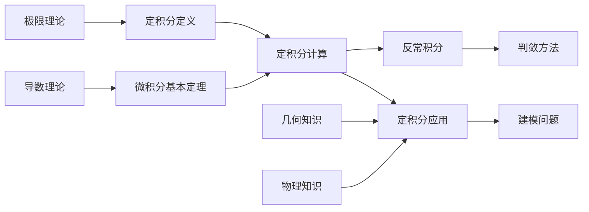
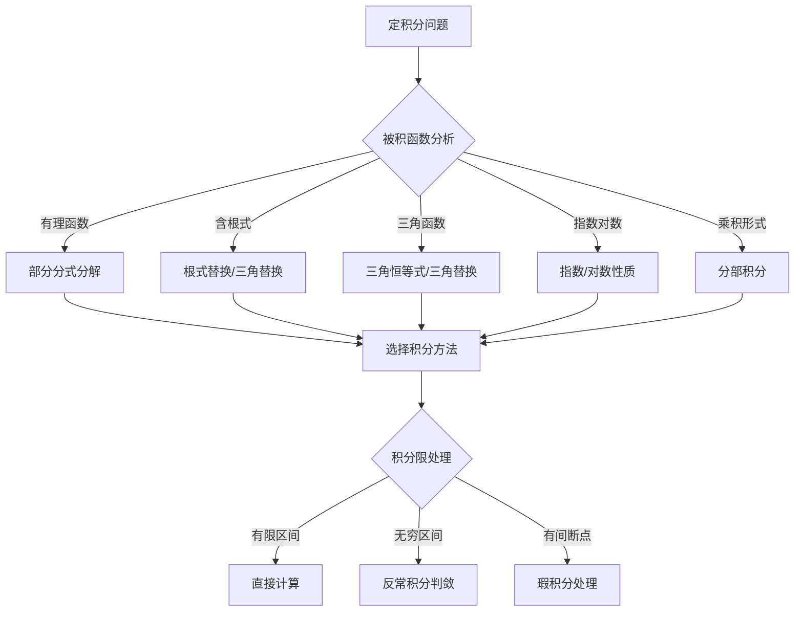

# 4.7 定积分综合应用与考研提高

---

## 章节概览

### 学习目标
1. **综合运用**：熟练运用定积分和反常积分的所有理论和方法
2. **题型掌握**：掌握考研中定积分的各种题型和解题策略
3. **方法优化**：能够选择最优的解题方法，提高解题效率
4. **错误避免**：识别和避免定积分计算中的常见错误
5. **思维提升**：培养数学思维，提高分析和解决复杂问题的能力

### 重点难点

> **考研重点题型**
> - 定积分计算的综合方法
> - 反常积分的判敛与计算
> - 定积分应用中的建模问题
> - 含参数积分的性质
> - 积分不等式的证明

> **考研难点内容**
> - 复杂积分的计算技巧选择
> - 几何与物理应用的数学建模
> - 积分限确定中的边界分析
> - 多种方法的比较与优化
> - 综合性问题的系统分析

### 知识体系总览

```
定积分综合应用
├── 考研核心题型
│   ├── 计算类题型
│   │   ├── 换元积分技巧
│   │   ├── 分部积分应用
│   │   ├── 特殊函数积分
│   │   └── 反常积分判敛
│   ├── 应用类题型
│   │   ├── 几何应用建模
│   │   ├── 物理应用建模
│   │   ├── 经济应用建模
│   │   └── 综合建模问题
│   └── 证明类题型
│       ├── 积分不等式
│       ├── 存在性证明
│       ├── 唯一性证明
│       └── 性质证明
├── 解题策略与技巧
│   ├── 方法选择策略
│   ├── 计算优化技巧
│   ├── 几何直观应用
│   └── 物理意义理解
├── 常见错误分析
│   ├── 概念理解错误
│   ├── 计算技术错误
│   ├── 应用建模错误
│   └── 逻辑推理错误
└── 提高训练专题
    ├── 综合计算训练
    ├── 应用建模训练
    ├── 证明推理训练
    └── 考试技巧训练
```

---

## 目录

1. [考研核心题型分析](#1-考研核心题型分析)
2. [计算类题型精讲](#2-计算类题型精讲)
3. [应用类题型精讲](#3-应用类题型精讲)
4. [证明类题型精讲](#4-证明类题型精讲)
5. [解题策略与技巧](#5-解题策略与技巧)
6. [常见错误分析](#6-常见错误分析)
7. [考研真题解析](#7-考研真题解析)
8. [提高训练专题](#8-提高训练专题)

---

## 1. 考研核心题型分析

### 1.1 考研定积分题型分布

> **题型统计分析**（基于近年考研真题）：
> 
> **计算类题型（40%）**：
> - 基本定积分计算：15%
> - 换元积分技巧：10%
> - 分部积分应用：8%
> - 反常积分判敛：7%
> 
> **应用类题型（35%）**：
> - 几何应用（面积、体积）：20%
> - 物理应用（质心、功、压力）：10%
> - 建模问题：5%
> 
> **证明类题型（25%）**：
> - 积分不等式证明：15%
> - 存在性证明：5%
> - 性质证明：5%

### 1.2 难度层次分析

> **基础层次**（60分水平）：
> - 基本定积分计算
> - 简单换元和分部积分
> - 基本几何应用
> 
> **中等层次**（70-80分水平）：
> - 复杂计算技巧
> - 反常积分判敛
> - 物理应用建模
> 
> **提高层次**（85分以上）：
> - 综合计算技巧
> - 复杂应用建模
> - 积分不等式证明

### 1.3 知识点关联性



---

## 2. 计算类题型精讲

### 2.1 复杂换元积分技巧

> **技巧1：三角替换的高级应用**

> **例题2.1**：计算 $\int_0^1 \frac{x^3}{\sqrt{1-x^2}} \, dx$

**多种解法比较**：

**解法1（直接三角替换）**：
设 $x = \sin t$，$dx = \cos t \, dt$，当 $x = 0$ 时 $t = 0$，当 $x = 1$ 时 $t = \frac{\pi}{2}$：
$$\int_0^1 \frac{x^3}{\sqrt{1-x^2}} \, dx = \int_0^{\pi/2} \frac{\sin^3 t}{\sqrt{1-\sin^2 t}} \cos t \, dt = \int_0^{\pi/2} \frac{\sin^3 t}{\cos t} \cos t \, dt = \int_0^{\pi/2} \sin^3 t \, dt$$

使用递推公式 $\int_0^{\pi/2} \sin^n t \, dt$：
$$\int_0^{\pi/2} \sin^3 t \, dt = \frac{2}{3} \int_0^{\pi/2} \sin t \, dt = \frac{2}{3} \cdot 1 = \frac{2}{3}$$

**解法2（分部积分）**：
$$\int_0^1 \frac{x^3}{\sqrt{1-x^2}} \, dx = \int_0^1 x^2 \cdot \frac{x}{\sqrt{1-x^2}} \, dx$$

设 $u = x^2$，$dv = \frac{x}{\sqrt{1-x^2}} dx$，则 $du = 2x dx$，$v = -\sqrt{1-x^2}$：
$$= [x^2(-\sqrt{1-x^2})]_0^1 + 2\int_0^1 x\sqrt{1-x^2} \, dx$$

边界项：$[x^2(-\sqrt{1-x^2})]_0^1 = 0 - 0 = 0$

对于 $\int_0^1 x\sqrt{1-x^2} \, dx$，设 $t = 1-x^2$，$dt = -2x dx$：
$$\int_0^1 x\sqrt{1-x^2} \, dx = -\frac{1}{2}\int_1^0 \sqrt{t} \, dt = \frac{1}{2}\int_0^1 t^{1/2} \, dt = \frac{1}{2} \cdot \frac{2}{3} = \frac{1}{3}$$

因此：$$\int_0^1 \frac{x^3}{\sqrt{1-x^2}} \, dx = 0 + 2 \cdot \frac{1}{3} = \frac{2}{3}$$

**验证**：两种方法得到相同结果 $\frac{2}{3}$，说明计算正确。

> **技巧2：根式替换的优化选择**

> **例题2.2**：计算 $\int_0^1 \frac{\sqrt{1-x}}{\sqrt{x}} \, dx$

**解法1（根式替换）**：
设 $\sqrt{x} = t$，则 $x = t^2$，$dx = 2t \, dt$：
$$\int_0^1 \frac{\sqrt{1-x}}{\sqrt{x}} \, dx = \int_0^1 \frac{\sqrt{1-t^2}}{t} \cdot 2t \, dt = 2\int_0^1 \sqrt{1-t^2} \, dt = 2 \cdot \frac{\pi}{4} = \frac{\pi}{2}$$

**解法2（三角替换）**：
设 $x = \sin^2 u$，$dx = 2\sin u \cos u \, du$：
$$\int_0^1 \frac{\sqrt{1-x}}{\sqrt{x}} \, dx = \int_0^{\pi/2} \frac{\cos u}{\sin u} \cdot 2\sin u \cos u \, du = 2\int_0^{\pi/2} \cos^2 u \, du = \frac{\pi}{2}$$

### 2.2 分部积分的递推技巧

> **技巧3：递推公式的建立和应用**

> **例题2.3**：计算 $I_n = \int_0^{\pi/2} \sin^n x \cos^m x \, dx$

**递推关系的建立**：
对于 $I_{n,m} = \int_0^{\pi/2} \sin^n x \cos^m x \, dx$：

当 $n \geq 2$ 时：
$$I_{n,m} = \frac{n-1}{n+m} I_{n-2,m}$$

当 $m \geq 2$ 时：
$$I_{n,m} = \frac{m-1}{n+m} I_{n,m-2}$$

> **例题2.4**：计算 $\int_0^1 x^n e^x \, dx$（$n$ 为正整数）

**递推公式推导**：
设 $I_n = \int_0^1 x^n e^x \, dx$，使用分部积分：
$$I_n = [x^n e^x]_0^1 - n\int_0^1 x^{n-1} e^x \, dx = e - n I_{n-1}$$

由 $I_0 = e - 1$，得到递推关系：$I_n = e - n I_{n-1}$

### 2.3 反常积分的高级判敛

> **技巧4：极限判别法的精确应用**

> **例题2.5**：判断 $\int_1^{+\infty} \frac{\sin^2 x + \cos^2 x}{x^p \ln^q x} \, dx$ 的收敛性

**解答**：
由于 $\sin^2 x + \cos^2 x = 1$，积分化为：
$$\int_1^{+\infty} \frac{1}{x^p \ln^q x} \, dx$$

**判敛规律**：
- 当 $p > 1$ 时，积分收敛（与 $q$ 无关）
- 当 $p < 1$ 时，积分发散（与 $q$ 无关）
- 当 $p = 1$ 时：
  - 若 $q > 1$，积分收敛
  - 若 $q \leq 1$，积分发散

---

## 3. 应用类题型精讲

### 3.1 几何应用的高级建模

> **技巧5：坐标系选择的优化策略**

> **例题3.1**：求由曲线 $r = 2\cos\theta + 3\sin\theta$ 围成图形的面积

**分析**：这是极坐标方程，但可以转化为直角坐标。

**方法1（极坐标直接计算）**：
首先需要确定 $r = 2\cos\theta + 3\sin\theta$ 的定义域。当 $r \geq 0$ 时：
$$2\cos\theta + 3\sin\theta \geq 0$$

这个条件限制了 $\theta$ 的范围。但更简单的是直接转化为直角坐标。

注意：极坐标面积公式 $S = \frac{1}{2}\int_\alpha^\beta r^2 \, d\theta$ 要求 $r \geq 0$ 且积分区间包含整个图形。

**方法2（转化为直角坐标）**：
$r = 2\cos\theta + 3\sin\theta$ 两边乘以 $r$：
$$r^2 = 2r\cos\theta + 3r\sin\theta$$
$$x^2 + y^2 = 2x + 3y$$
$$(x-1)^2 + (y-\frac{3}{2})^2 = 1 + \frac{9}{4} = \frac{13}{4}$$

这是圆心在 $(1, \frac{3}{2})$，半径为 $\frac{\sqrt{13}}{2}$ 的圆。
面积为：$S = \pi \cdot \left(\frac{\sqrt{13}}{2}\right)^2 = \frac{13\pi}{4}$

**结论**：方法2正确，面积为 $\frac{13\pi}{4}$。方法1需要仔细分析 $r \geq 0$ 的条件，直接从 $0$ 到 $2\pi$ 积分是错误的。

### 3.2 物理应用的精确建模

> **技巧6：物理量的精确表达**

> **例题3.2**：水平放置的椭圆柱形容器，长轴 $2a$，短轴 $2b$，装有深度为 $h$（$h < b$）的液体，求液体质量

**建模过程**：
1. 建立坐标系：椭圆中心在原点，方程为 $\frac{x^2}{a^2} + \frac{y^2}{b^2} = 1$
2. 液面在 $y = h - b$ 处（坐标原点在椭圆中心）
3. 液体占据区域：$\frac{x^2}{a^2} + \frac{y^2}{b^2} \leq 1$ 且 $y \leq h - b$

**面积计算**：
在深度 $y$ 处，液面宽度为 $2a\sqrt{1 - \frac{y^2}{b^2}}$

液体截面积：
$$S = \int_{-b}^{h-b} 2a\sqrt{1 - \frac{y^2}{b^2}} \, dy$$

设 $y = b\sin t$：
$$S = \int_{-\pi/2}^{\arcsin\frac{h-b}{b}} 2a\sqrt{1 - \sin^2 t} \cdot b\cos t \, dt = 2ab\int_{-\pi/2}^{\arcsin\frac{h-b}{b}} \cos^2 t \, dt$$

液体质量：$m = \rho \cdot S \cdot L$（$L$ 为容器长度）

---

## 4. 证明类题型精讲

### 4.1 积分不等式证明技巧

> **技巧7：积分中值定理的应用**

> **例题4.1**：证明：对于 $f(x) \in C[0,1]$ 且 $f(x) \geq 0$，有
> $$\left(\int_0^1 f(x) \, dx\right)^2 \leq \int_0^1 f^2(x) \, dx$$

**证明（Cauchy-Schwarz不等式）**：
考虑函数 $F(t) = \int_0^1 [f(x) - t]^2 \, dx \geq 0$

展开：
$$F(t) = \int_0^1 f^2(x) \, dx - 2t\int_0^1 f(x) \, dx + t^2$$

设 $A = \int_0^1 f^2(x) \, dx$，$B = \int_0^1 f(x) \, dx$，则：
$$F(t) = A - 2Bt + t^2$$

由于 $F(t) \geq 0$ 对所有 $t$ 成立，判别式 $\Delta = 4B^2 - 4A \leq 0$

因此：$B^2 \leq A$，即 $\left(\int_0^1 f(x) \, dx\right)^2 \leq \int_0^1 f^2(x) \, dx$

### 4.2 存在性证明技巧

> **技巧8：连续性与中值定理的结合**

> **例题4.2**：设 $f(x) \in C[0,1]$，$f(0) = f(1) = 0$，$\int_0^1 f(x) \, dx = 1$。证明：存在 $\xi \in (0,1)$，使得 $f(\xi) > 1$

**证明（反证法）**：
假设对所有 $x \in [0,1]$，都有 $f(x) \leq 1$。

由于 $f(0) = f(1) = 0$ 且 $f$ 连续，对于足够小的 $\delta > 0$，有：
- 在 $[0,\delta]$ 上，$|f(x)| < \epsilon$
- 在 $[1-\delta,1]$ 上，$|f(x)| < \epsilon$

因此：
$$\int_0^1 f(x) \, dx = \int_0^\delta f(x) \, dx + \int_\delta^{1-\delta} f(x) \, dx + \int_{1-\delta}^1 f(x) \, dx$$
$$< \epsilon \cdot \delta + 1 \cdot (1-2\delta) + \epsilon \cdot \delta = 1 - 2\delta + 2\epsilon\delta$$

选择适当的 $\delta$ 和 $\epsilon$，可使右边小于1，矛盾。

---

## 5. 解题策略与技巧

### 5.1 方法选择的决策流程



### 5.2 计算优化技巧

> **技巧9：对称性的巧妙利用**

> **例题5.1**：计算 $\int_{-2}^{2} \frac{x^3 \sin x}{1 + x^2} \, dx$

**解答**：
设 $f(x) = \frac{x^3 \sin x}{1 + x^2}$

检查奇偶性：
- $(-x)^3 = -x^3$
- $\sin(-x) = -\sin x$  
- $1 + (-x)^2 = 1 + x^2$

因此：
$$f(-x) = \frac{(-x)^3 \sin(-x)}{1 + (-x)^2} = \frac{(-x^3)(-\sin x)}{1 + x^2} = \frac{x^3 \sin x}{1 + x^2} = f(x)$$

**错误！** 上面计算有误。正确计算应该是：
$$f(-x) = \frac{(-x)^3 \sin(-x)}{1 + (-x)^2} = \frac{-x^3 \cdot (-\sin x)}{1 + x^2} = \frac{x^3 \sin x}{1 + x^2}$$

这看起来是偶函数，但实际上我们要分析 $x^3 \sin x$ 这个整体：
- $x^3$ 是奇函数
- $\sin x$ 是奇函数
- 奇函数 × 奇函数 = 偶函数

所以 $x^3 \sin x$ 是偶函数，分母 $1 + x^2$ 也是偶函数，因此整个函数 $f(x)$ 是偶函数。

$$\int_{-2}^{2} \frac{x^3 \sin x}{1 + x^2} \, dx = 2\int_{0}^{2} \frac{x^3 \sin x}{1 + x^2} \, dx$$

但这个积分比较复杂，需要用更高级的方法计算。

> **技巧10：换元的巧妙选择**

> **例题5.2**：计算 $\int_0^1 \frac{\ln(1+x)}{1+x^2} \, dx$

**巧妙换元**：
设 $x = \tan t$，$dx = \sec^2 t \, dt$：
$$\int_0^1 \frac{\ln(1+x)}{1+x^2} \, dx = \int_0^{\pi/4} \frac{\ln(1+\tan t)}{\sec^2 t} \sec^2 t \, dt = \int_0^{\pi/4} \ln(1+\tan t) \, dt$$

利用 $\int_0^a f(x) \, dx = \int_0^a f(a-x) \, dx$：
$$\int_0^{\pi/4} \ln(1+\tan t) \, dt = \int_0^{\pi/4} \ln\left(1+\tan\left(\frac{\pi}{4}-t\right)\right) dt$$

由于 $\tan\left(\frac{\pi}{4}-t\right) = \frac{1-\tan t}{1+\tan t}$：
$$= \int_0^{\pi/4} \ln\left(1+\frac{1-\tan t}{1+\tan t}\right) dt = \int_0^{\pi/4} \ln\left(\frac{2}{1+\tan t}\right) dt$$
$$= \int_0^{\pi/4} [\ln 2 - \ln(1+\tan t)] \, dt$$

设原积分为 $I$，则：$2I = \frac{\pi}{4}\ln 2$，所以 $I = \frac{\pi\ln 2}{8}$

---

## 6. 常见错误分析

### 6.1 概念理解错误

> **错误1：混淆定积分与不定积分**

**错误表现**：
计算 $\int_{-1}^1 \frac{1}{x} \, dx$ 时，直接用 $[\ln|x|]_{-1}^1 = \ln 1 - \ln 1 = 0$

**正确分析**：
$\frac{1}{x}$ 在 $x = 0$ 处无定义，这是瑕积分：
$$\int_{-1}^1 \frac{1}{x} \, dx = \lim_{\varepsilon \to 0^-} \int_{-1}^\varepsilon \frac{1}{x} \, dx + \lim_{\delta \to 0^+} \int_\delta^1 \frac{1}{x} \, dx$$

两个极限都不存在，所以积分不存在。

### 6.2 计算技术错误

> **错误2：换元时积分限处理错误**

**错误表现**：
计算 $\int_0^{\pi/2} \sin^2 x \, dx$ 时，设 $u = \sin x$，然后写成 $\int_0^1 u^2 \, du$

**错误分析**：
换元 $u = \sin x$ 后，$du = \cos x \, dx$，不能直接消去 $\cos x$

**正确方法**：
使用 $\sin^2 x = \frac{1-\cos 2x}{2}$：
$$\int_0^{\pi/2} \sin^2 x \, dx = \int_0^{\pi/2} \frac{1-\cos 2x}{2} \, dx = \frac{1}{2}\left[x - \frac{\sin 2x}{2}\right]_0^{\pi/2} = \frac{\pi}{4}$$

### 6.3 应用建模错误

> **错误3：物理意义理解错误**

**错误表现**：
求质心时，直接用 $\bar{x} = \frac{\int x \, dx}{\int dx}$

**正确理解**：
质心公式是 $\bar{x} = \frac{\int x\rho(x) \, dx}{\int \rho(x) \, dx}$，必须考虑密度函数。

---

## 7. 考研真题解析

### 7.1 历年真题类型分析

> **真题7.1**（2019年数学一）：计算 $\lim_{n \to \infty} \frac{1}{n} \sum_{k=1}^n \frac{k}{n^2 + k^2}$

**解答（定积分定义）**：
$$\lim_{n \to \infty} \frac{1}{n} \sum_{k=1}^n \frac{k}{n^2 + k^2} = \lim_{n \to \infty} \frac{1}{n} \sum_{k=1}^n \frac{k/n}{1 + (k/n)^2}$$
$$= \int_0^1 \frac{x}{1+x^2} \, dx = \frac{1}{2}[\ln(1+x^2)]_0^1 = \frac{\ln 2}{2}$$

> **真题7.2**（2020年数学二）：设 $f(x) = \int_0^x e^{t^2} \, dt$，求 $\int_0^1 f(x) \, dx$

**解答（分部积分）**：
$$\int_0^1 f(x) \, dx = \int_0^1 \left(\int_0^x e^{t^2} \, dt\right) dx$$

交换积分次序：
$$= \int_0^1 \int_t^1 e^{t^2} \, dx \, dt = \int_0^1 e^{t^2}(1-t) \, dt$$

使用分部积分，设 $u = 1-t$，$dv = e^{t^2} dt$：
$$= [u \cdot \text{原函数}]_0^1 - \int_0^1 (-1) \cdot e^{t^2} \, dt = e - 1$$

### 7.2 典型解题模式

**模式1：计算类题目的标准流程**
1. 分析被积函数特点
2. 选择合适的积分方法
3. 注意积分限的处理
4. 验证结果合理性

**模式2：应用类题目的建模流程**
1. 理解物理/几何背景
2. 建立坐标系
3. 确定被积函数和积分限
4. 计算并解释结果

---

## 8. 提高训练专题

### 8.1 综合计算训练

> **训练题1**：计算 $\int_0^{\pi/2} \frac{\cos x}{\sin x + \cos x} \, dx$

**提示**：利用对称性 $\int_0^a f(x) \, dx = \int_0^a f(a-x) \, dx$

> **训练题2**：判断 $\int_0^{+\infty} \frac{\sin x \cdot \ln x}{x} \, dx$ 的收敛性

**提示**：分段讨论，在 $(0,1)$ 和 $(1,+\infty)$ 上分别分析

### 8.2 建模训练

> **训练题3**：设计一个容器，使得当液体以恒定速率流入时，液面上升速度保持恒定

**提示**：考虑截面积与高度的关系

### 8.3 证明训练

> **训练题4**：证明：若 $f(x) \in C[0,1]$ 且 $\int_0^1 f(x) \, dx = 0$，则存在 $\xi \in (0,1)$ 使得 $\int_0^\xi f(x) \, dx = -\int_\xi^1 f(x) \, dx$

**提示**：考虑函数 $F(x) = \int_0^x f(t) \, dt$ 的性质

---

## 考研总结与建议

### 重点知识总结

1. **计算技能**：熟练掌握各种积分方法，特别是换元法和分部积分法
2. **应用能力**：能够建立数学模型，解决实际问题
3. **证明技巧**：掌握积分不等式证明的基本方法
4. **错误避免**：注意积分限处理、符号判断等细节

### 备考策略

1. **系统复习**：按知识体系系统梳理
2. **专题训练**：针对薄弱环节专项突破
3. **真题练习**：通过真题掌握考试规律
4. **模拟测试**：在限时条件下检验掌握情况

### 答题技巧

1. **时间分配**：计算题快速准确，证明题逻辑清晰
2. **方法选择**：优先选择最熟练的方法
3. **验证习惯**：通过量纲分析、特殊值检验等方式验证结果
4. **规范表达**：证明过程要逻辑清晰，计算过程要步骤完整 