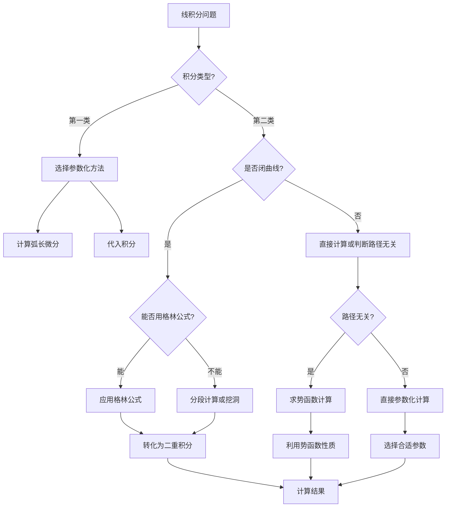

# 8.2 线积分理论与计算
 
## 目录

1. [第一类线积分（对弧长的线积分）](#1-第一类线积分对弧长的线积分)
2. [第二类线积分（对坐标的线积分）](#2-第二类线积分对坐标的线积分)
3. [格林公式及其应用](#3-格林公式及其应用)
4. [路径无关性与保守场](#4-路径无关性与保守场)
5. [线积分的物理应用](#5-线积分的物理应用)
6. [综合例题与练习](#6-综合例题与练习)
7. [知识点总结](#7-知识点总结)

---

## 1. 第一类线积分（对弧长的线积分）

### 1.1 基本定义

> **定义1.1（第一类线积分）**
> 
> 设 $L$ 为平面上的光滑曲线，函数 $f(x,y)$ 在曲线 $L$ 上有界。将曲线 $L$ 任意分割成 $n$ 小段，设第 $i$ 小段的弧长为 $\Delta s_i$，在每一小段上任取一点 $(\xi_i, \eta_i)$，作和式：
> $$S_n = \sum_{i=1}^n f(\xi_i, \eta_i) \Delta s_i$$
> 
> 若当各小段弧长的最大值趋于零时，和式 $S_n$ 的极限存在且与分割方法及点的选择无关，则称此极限为函数 $f(x,y)$ 在曲线 $L$ 上的**第一类线积分**，记作：
> $$\int_L f(x,y) \, ds$$
> 其中 $ds$ 为弧长微分。

**几何意义**：当 $f(x,y) \geq 0$ 时，第一类线积分 $\int_L f(x,y) \, ds$ 表示以曲线 $L$ 为底边、高为 $f(x,y)$ 的柱面的面积。

**物理意义**：表示线密度为 $f(x,y)$ 的曲线 $L$ 的质量。

*图8.1.1：线积分与面积分的综合概念图。展示第一类线积分（质量）、第二类线积分（做功）、格林公式、路径无关性、面积分和高斯定理的几何意义和物理应用。*

### 1.2 计算方法

#### 方法一：参数方程法

> **计算公式1.1（参数方程法）**
> 
> 设曲线 $L$ 的参数方程为：
> $$\begin{cases}
> x = \varphi(t) \\
> y = \psi(t)
> \end{cases} \quad t \in [\alpha, \beta]$$
> 
> 其中 $\varphi(t)$、 $\psi(t)$ 在 $[\alpha, \beta]$ 上具有连续导数，且 $[\varphi'(t)]^2 + [\psi'(t)]^2 \neq 0$，则：
> $$\int_L f(x,y) \, ds = \int_\alpha^\beta f[\varphi(t), \psi(t)] \sqrt{[\varphi'(t)]^2 + [\psi'(t)]^2} \, dt$$

#### 方法二：直角坐标法

> **计算公式1.2（直角坐标法）**
> 
> 若曲线 $L$ 可表示为 $y = g(x)$，$x \in [a,b]$，其中 $g(x)$ 在 $[a,b]$ 上连续可导，则：
> $$\int_L f(x,y) \, ds = \int_a^b f[x, g(x)] \sqrt{1 + [g'(x)]^2} \, dx$$

#### 方法三：极坐标法

> **计算公式1.3（极坐标法）**
> 
> 若曲线 $L$ 的极坐标方程为 $r = r(\theta)$，$\theta \in [\alpha, \beta]$，其中 $r(\theta)$ 在 $[\alpha, \beta]$ 上连续可导，则：
> $$\int_L f(x,y) \, ds = \int_\alpha^\beta f[r(\theta)\cos\theta, r(\theta)\sin\theta] \sqrt{[r(\theta)]^2 + [r'(\theta)]^2} \, d\theta$$

### 1.3 典型例题

> **例题1.1**：计算 $\int_L (x^2 + y^2) \, ds$，其中 $L$ 是圆周 $x^2 + y^2 = a^2$

**解答**：
使用参数方程： $x = a\cos t$，$y = a\sin t$，$t \in [0, 2\pi]$

$\varphi'(t) = -a\sin t$，$\psi'(t) = a\cos t$

$\sqrt{[\varphi'(t)]^2 + [\psi'(t)]^2} = \sqrt{a^2\sin^2 t + a^2\cos^2 t} = a$

因此：
$$\int_L (x^2 + y^2) \, ds = \int_0^{2\pi} (a^2\cos^2 t + a^2\sin^2 t) \cdot a \, dt = \int_0^{2\pi} a^3 \, dt = 2\pi a^3$$

*图8.1.2：线积分计算例题。左图：圆周线积分，右图：抛物线线积分，展示了不同路径上的积分计算方法。*

> **例题1.2**：计算 $\int_L xy \, ds$，其中 $L$ 是从点 $(0,0)$ 到点 $(1,1)$ 的直线段

**解答**：
直线方程： $y = x$，$x \in [0,1]$

$g'(x) = 1$，$\sqrt{1 + [g'(x)]^2} = \sqrt{2}$

因此：
$$\int_L xy \, ds = \int_0^1 x \cdot x \cdot \sqrt{2} \, dx = \sqrt{2} \int_0^1 x^2 \, dx = \sqrt{2} \cdot \frac{1}{3} = \frac{\sqrt{2}}{3}$$

### 1.4 空间曲线的第一类线积分

> **定义1.2（空间曲线第一类线积分）**
> 设空间曲线 $\Gamma$ 的参数方程为：
> $$\begin{cases}
> x = \varphi(t) \\
> y = \psi(t) \\
> z = \omega(t)
> \end{cases} \quad t \in [\alpha, \beta]$$
> 
> 则： $$\int_\Gamma f(x,y,z) \, ds = \int_\alpha^\beta f[\varphi(t), \psi(t), \omega(t)] \sqrt{[\varphi'(t)]^2 + [\psi'(t)]^2 + [\omega'(t)]^2} \, dt$$

> **例题1.3**：计算 $\int_\Gamma xyz \, ds$，其中 $\Gamma$ 是螺旋线 $x = \cos t$，$y = \sin t$，$z = t$，$t \in [0, 2\pi]$

**解答**：
$\varphi'(t) = -\sin t$，$\psi'(t) = \cos t$，$\omega'(t) = 1$

$\sqrt{[\varphi'(t)]^2 + [\psi'(t)]^2 + [\omega'(t)]^2} = \sqrt{\sin^2 t + \cos^2 t + 1} = \sqrt{2}$

$$\int_\Gamma xyz \, ds = \int_0^{2\pi} \cos t \cdot \sin t \cdot t \cdot \sqrt{2} \, dt = \frac{\sqrt{2}}{2} \int_0^{2\pi} t \sin 2t \, dt$$

使用分部积分： $\int t \sin 2t \, dt = -\frac{t \cos 2t}{2} + \frac{\sin 2t}{4}$

$$= \frac{\sqrt{2}}{2} \left[-\frac{t \cos 2t}{2} + \frac{\sin 2t}{4}\right]_0^{2\pi} = \frac{\sqrt{2}}{2} \left[-\frac{2\pi \cos 4\pi}{2} + \frac{\sin 4\pi}{4} - 0\right] = \frac{\sqrt{2}}{2} \cdot (-\pi) = -\frac{\pi\sqrt{2}}{2}$$

### 1.5 性质与计算技巧

> **性质1.1（线性性）**
> $$\int_L [af(x,y) + bg(x,y)] \, ds = a\int_L f(x,y) \, ds + b\int_L g(x,y) \, ds$$

> **性质1.2（路径可加性）**
> 若曲线 $L = L_1 + L_2$，则：
> $$\int_L f(x,y) \, ds = \int_{L_1} f(x,y) \, ds + \int_{L_2} f(x,y) \, ds$$

> **性质1.3（与方向无关）**
> 第一类线积分的值与积分路径的方向无关。

> **计算技巧1.1（对称性利用）**
> - 若曲线 $L$ 关于 $x$ 轴对称， $f(x,y)$ 关于 $y$ 为奇函数，则 $\int_L f(x,y) \, ds = 0$
> - 若曲线 $L$ 关于 $y$ 轴对称， $f(x,y)$ 关于 $x$ 为奇函数，则 $\int_L f(x,y) \, ds = 0$

> **计算技巧1.2（分段计算）**
> 对于分段光滑曲线，在各段分别计算后相加。

> **⚠️ 易错点提醒**
> 1. **参数化方向**：第二类线积分与路径方向相关，参数增大方向即为正方向
> 2. **弧长微分**：$ds = \sqrt{(\frac{dx}{dt})^2 + (\frac{dy}{dt})^2} dt$，注意是平方和开方
> 3. **格林公式条件**：要求区域单连通，被积函数有连续偏导数
> 4. **路径无关判断**：在单连通区域内 $\frac{\partial P}{\partial y} = \frac{\partial Q}{\partial x}$
> 5. **奇点处理**：含奇点时需要挖洞或特殊处理

---

## 2. 第二类线积分（对坐标的线积分）

### 2.1 基本定义

> **定义2.1（第二类线积分）**
> 设  $L$ 为平面上的有向光滑曲线， $P(x,y)$、 $Q(x,y)$ 在 $L$ 上有界，则称
> $$\int_L P(x,y) \, dx + Q(x,y) \, dy$$
> 为函数 $P(x,y)$、 $Q(x,y)$ 在有向曲线 $L$ 上的第二类线积分。

**物理意义**：表示变力 $\vec{F} = (P, Q)$ 沿曲线 $L$ 所做的功。

### 2.2 计算方法

#### 方法一：参数方程法

> **计算公式2.1**
> 设有向曲线 $L$ 的参数方程为：
> $$\begin{cases}
> x = \varphi(t) \\
> y = \psi(t)
> \end{cases} \quad t \in [\alpha, \beta]$$
> 
> 则：
> $$\int_L P \, dx + Q \, dy = \int_\alpha^\beta [P(\varphi(t), \psi(t)) \varphi'(t) + Q(\varphi(t), \psi(t)) \psi'(t)] \, dt$$

#### 方法二：直角坐标法

> **计算公式2.2**
> 若有向曲线 $L$ 可表示为 $y = g(x)$，$x$ 从 $a$ 到 $b$，则：
> $$\int_L P \, dx + Q \, dy = \int_a^b [P(x, g(x)) + Q(x, g(x)) g'(x)] \, dx$$

### 2.3 典型例题

> **例题2.1**：计算 $\int_L y \, dx + x \, dy$，其中 $L$ 是从点 $(0,0)$ 到点 $(1,1)$ 的抛物线 $y = x^2$

**解答**：
曲线方程： $y = x^2$，$x \in [0,1]$，$dy = 2x \, dx$

$$\int_L y \, dx + x \, dy = \int_0^1 (x^2 \, dx + x \cdot 2x \, dx) = \int_0^1 (x^2 + 2x^2) \, dx = \int_0^1 3x^2 \, dx = 1$$

> **例题2.2**：计算 $\int_L x \, dx + y \, dy$，其中 $L$ 是圆周 $x^2 + y^2 = 1$ 的上半部分，从 $(1,0)$ 到 $(-1,0)$

**解答**：
使用参数方程： $x = \cos t$，$y = \sin t$，$t \in [0, \pi]$

$dx = -\sin t \, dt$，$dy = \cos t \, dt$

$$\int_L x \, dx + y \, dy = \int_0^\pi [\cos t \cdot (-\sin t) + \sin t \cdot \cos t] \, dt = \int_0^\pi 0 \, dt = 0$$

### 2.4 空间曲线的第二类线积分

> **定义2.2（空间曲线第二类线积分）**
> 设空间曲线 $\Gamma$ 的参数方程为：
> $$\begin{cases}
> x = \varphi(t) \\
> y = \psi(t) \\
> z = \omega(t)
> \end{cases} \quad t \in [\alpha, \beta]$$
> 
> 则：
> $$\int_\Gamma P \, dx + Q \, dy + R \, dz = \int_\alpha^\beta [P \varphi'(t) + Q \psi'(t) + R \omega'(t)] \, dt$$

> **例题2.3**：计算 $\int_\Gamma x \, dx + y \, dy + z \, dz$，其中 $\Gamma$ 是从 $(0,0,0)$ 到 $(1,1,1)$ 的直线段

**解答**：
直线段参数方程： $x = t$，$y = t$，$z = t$，$t \in [0,1]$

$dx = dt$，$dy = dt$，$dz = dt$

$$\int_\Gamma x \, dx + y \, dy + z \, dz = \int_0^1 (t + t + t) \, dt = 3 \int_0^1 t \, dt = 3 \cdot \frac{1}{2} = \frac{3}{2}$$

### 2.5 性质与计算技巧

> **性质2.1（线性性）**
> $$\int_L [aP_1 + bP_2] \, dx + [aQ_1 + bQ_2] \, dy = a\int_L P_1 \, dx + Q_1 \, dy + b\int_L P_2 \, dx + Q_2 \, dy$$

> **性质2.2（方向性）**
> $$\int_{-L} P \, dx + Q \, dy = -\int_L P \, dx + Q \, dy$$
> 其中 $-L$ 表示 $L$ 的反向。

> **性质2.3（路径可加性）**
> 若有向曲线 $L = L_1 + L_2$，则：
> $$\int_L P \, dx + Q \, dy = \int_{L_1} P \, dx + Q \, dy + \int_{L_2} P \, dx + Q \, dy$$

> **计算技巧2.1（方向判断）**
> - 参数 $t$ 增大的方向即为曲线的正方向
> - 闭曲线通常取逆时针为正方向

> **计算技巧2.2（特殊曲线处理）**
> - 直线段：直接用参数方程
> - 圆弧：用三角参数化
> - 抛物线：用 $x$ 或 $y$ 作参数

> **⚠️ 易错点提醒**
> 1. 注意积分路径的方向性
> 2. 参数化时要保证方向正确
> 3. 分段曲线要注意连接点的方向

---

## 3. 格林公式及其应用

### 3.1 格林公式

> **定理3.1（格林公式/Green公式）**
> 
> 设 $D$ 是由分段光滑的简单闭曲线 $L$ 围成的单连通区域，函数 $P(x,y)$、 $Q(x,y)$ 在区域 $D$ 上具有一阶连续偏导数，则：
> $$\oint_L P(x,y) \, dx + Q(x,y) \, dy = \iint_D \left(\frac{\partial Q}{\partial x} - \frac{\partial P}{\partial y}\right) \, dx \, dy$$
> 其中 $L$ 取正方向（逆时针方向）。

**几何意义**：格林公式建立了平面上沿闭曲线的线积分与该闭曲线围成区域上的二重积分之间的关系。

**物理意义**：在向量场理论中，格林公式体现了环流量与旋度之间的关系。

*图8.1.5：格林公式应用示例。心形线边界积分，展示了如何将复杂曲线的线积分转化为区域上的二重积分计算。*

### 3.2 格林公式的应用

#### 应用一：计算线积分

> **例题3.1**：计算 $\oint_L (x^2 - y^2) \, dx + 2xy \, dy$，其中 $L$ 是圆周 $x^2 + y^2 = 1$，取逆时针方向

**解答**：
$P = x^2 - y^2$，$Q = 2xy$

$\frac{\partial Q}{\partial x} = 2y$，$\frac{\partial P}{\partial y} = -2y$

$\frac{\partial Q}{\partial x} - \frac{\partial P}{\partial y} = 2y - (-2y) = 4y$

由格林公式：
$$\oint_L (x^2 - y^2) \, dx + 2xy \, dy = \iint_D 4y \, dx \, dy$$

使用极坐标： $x = r\cos\theta$，$y = r\sin\theta$，$dx \, dy = r \, dr \, d\theta$

$$= \int_0^{2\pi} \int_0^1 4r\sin\theta \cdot r \, dr \, d\theta = \int_0^{2\pi} 4\sin\theta \, d\theta \int_0^1 r^2 \, dr = 0 \cdot \frac{1}{3} = 0$$

*图8.1.6：例题3.1的格林公式应用演示。左图显示向量场和积分路径，右图显示旋度在区域内的分布，积分值为0体现了对称性。*

#### 应用二：计算平面图形的面积

> **公式3.1（用线积分计算面积）**
> 平面区域 $D$ 的面积为：
> $$S = \iint_D 1 \, dx \, dy = \oint_L x \, dy = -\oint_L y \, dx = \frac{1}{2}\oint_L x \, dy - y \, dx$$

> **例题3.2**：用线积分计算椭圆 $\frac{x^2}{a^2} + \frac{y^2}{b^2} = 1$ 的面积

**解答**：
椭圆的参数方程： $x = a\cos t$，$y = b\sin t$，$t \in [0, 2\pi]$

$dx = -a\sin t \, dt$，$dy = b\cos t \, dt$

$$S = \oint_L x \, dy = \int_0^{2\pi} a\cos t \cdot b\cos t \, dt = ab \int_0^{2\pi} \cos^2 t \, dt = ab \cdot \pi = \pi ab$$

#### 应用三：格林公式的逆向应用

> **例题3.3**：已知 $\oint_L (3x^2y - y^3) \, dx + (x^3 - 3xy^2) \, dy = 0$ 对任意简单闭曲线 $L$ 成立，求被积函数的关系

**解答**：
设  $P = 3x^2y - y^3$，$Q = x^3 - 3xy^2$

由格林公式： $\oint_L P \, dx + Q \, dy = \iint_D \left(\frac{\partial Q}{\partial x} - \frac{\partial P}{\partial y}\right) \, dx \, dy = 0$

因此： $\frac{\partial Q}{\partial x} - \frac{\partial P}{\partial y} = 0$

$\frac{\partial Q}{\partial x} = 3x^2 - 3y^2$，$\frac{\partial P}{\partial y} = 3x^2 - 3y^2$

验证： $\frac{\partial Q}{\partial x} = \frac{\partial P}{\partial y}$，满足条件。

> **⚠️ 考研重点**：格林公式的逆向应用常出现在证明题中，要熟练掌握。

### 3.3 格林公式的推广

#### 复连通区域的格林公式

> **定理3.2（复连通区域的格林公式）**
> 设  $D$ 是由外边界 $L$ 和内边界 $L_1, L_2, \ldots, L_n$ 围成的复连通区域，则：
> $$\oint_L P \, dx + Q \, dy - \sum_{i=1}^n \oint_{L_i} P \, dx + Q \, dy = \iint_D \left(\frac{\partial Q}{\partial x} - \frac{\partial P}{\partial y}\right) \, dx \, dy$$

---

## 4. 路径无关性与保守场

### 4.1 路径无关性的条件

> **定理4.1（路径无关性的充要条件）**
> 
> 设 $D$ 是单连通区域，函数 $P(x,y)$、 $Q(x,y)$ 在 $D$ 内具有一阶连续偏导数，则以下四个条件等价：
> 
> 1. **路径无关性**：线积分 $\int_L P(x,y) \, dx + Q(x,y) \, dy$ 在 $D$ 内与路径无关
> 2. **积分为零**：对 $D$ 内任意闭曲线 $C$，有 $\oint_C P(x,y) \, dx + Q(x,y) \, dy = 0$
> 3. **偏导数相等**： $\frac{\partial P}{\partial y} = \frac{\partial Q}{\partial x}$ 在 $D$ 内恒成立
> 4. **存在势函数**：存在二元函数 $u(x,y)$ 使得 $\frac{\partial u}{\partial x} = P(x,y)$， $\frac{\partial u}{\partial y} = Q(x,y)$

*图8.1.7：路径无关性的直观演示。三条不同路径（直线、抛物线、折线）在保守向量场中的积分值相等，验证了路径无关性。*

### 4.2 势函数的求法

当 $\frac{\partial P}{\partial y} = \frac{\partial Q}{\partial x}$ 时，存在势函数 $u(x,y)$ 使得：
$$\frac{\partial u}{\partial x} = P(x,y), \quad \frac{\partial u}{\partial y} = Q(x,y)$$

#### 方法一：不定积分法

> **例题4.1**：求 $(2xy + 3x^2) \, dx + (x^2 + 2y) \, dy$ 的势函数

**解答**：
$P = 2xy + 3x^2$，$Q = x^2 + 2y$

检验： $\frac{\partial P}{\partial y} = 2x$，$\frac{\partial Q}{\partial x} = 2x$，满足条件。

设  $u(x,y)$ 为势函数，则：
$$\frac{\partial u}{\partial x} = 2xy + 3x^2$$

对 $x$ 积分： $u(x,y) = x^2y + x^3 + \varphi(y)$

由 $\frac{\partial u}{\partial y} = x^2 + \varphi'(y) = x^2 + 2y$，得 $\varphi'(y) = 2y$

因此 $\varphi(y) = y^2 + C$

势函数为： $u(x,y) = x^2y + x^3 + y^2 + C$

#### 方法二：线积分法

> **公式4.1（势函数的线积分表示）**
> $$u(x,y) = \int_{(x_0,y_0)}^{(x,y)} P \, dx + Q \, dy + C$$
> 其中 $(x_0, y_0)$ 是 $D$ 内任意固定点。

### 4.3 应用

> **例题4.2**：计算 $\int_L (2xy + 3x^2) \, dx + (x^2 + 2y) \, dy$，其中 $L$ 是从 $(0,0)$ 到 $(1,2)$ 的任意路径

**解答**：
由例题4.1知，势函数为 $u(x,y) = x^2y + x^3 + y^2$

因此：
$$\int_L (2xy + 3x^2) \, dx + (x^2 + 2y) \, dy = u(1,2) - u(0,0) = (1 + 1 + 4) - 0 = 6$$

---

## 5. 线积分的物理应用

### 5.1 变力做功

> **物理意义**：变力 $\vec{F} = P(x,y)\vec{i} + Q(x,y)\vec{j}$ 沿曲线 $L$ 所做的功为：
> $$W = \int_L \vec{F} \cdot d\vec{r} = \int_L P \, dx + Q \, dy$$

> **例题5.1**：质点在力场 $\vec{F} = (x + y)\vec{i} + (x - y)\vec{j}$ 中沿抛物线 $y = x^2$ 从 $(0,0)$ 移动到 $(1,1)$，求力所做的功

**解答**：
$P = x + y$，$Q = x - y$

沿抛物线 $y = x^2$，$dy = 2x \, dx$，$x \in [0,1]$

$$W = \int_L (x + y) \, dx + (x - y) \, dy = \int_0^1 [(x + x^2) + (x - x^2) \cdot 2x] \, dx$$
$$= \int_0^1 [x + x^2 + 2x^2 - 2x^3] \, dx = \int_0^1 (x + 3x^2 - 2x^3) \, dx$$
$$= \left[\frac{x^2}{2} + x^3 - \frac{x^4}{2}\right]_0^1 = \frac{1}{2} + 1 - \frac{1}{2} = 1$$

### 5.2 曲线的质量和重心

> **质量公式**：线密度为 $\rho(x,y)$ 的曲线 $L$ 的质量为：
> $$m = \int_L \rho(x,y) \, ds$$

> **重心坐标公式**：
> $$\bar{x} = \frac{1}{m} \int_L x\rho(x,y) \, ds, \quad \bar{y} = \frac{1}{m} \int_L y\rho(x,y) \, ds$$

> **例题5.2**：求半圆周 $x^2 + y^2 = a^2$ （ $y \geq 0$）的重心，设线密度为常数 $\rho$

**解答**：
参数方程： $x = a\cos t$，$y = a\sin t$，$t \in [0, \pi]$

$ds = a \, dt$

质量： $m = \int_L \rho \, ds = \rho \int_0^\pi a \, dt = \pi a \rho$

由对称性， $\bar{x} = 0$

$$\bar{y} = \frac{1}{m} \int_L y\rho \, ds = \frac{1}{\pi a \rho} \int_0^\pi a\sin t \cdot \rho \cdot a \, dt = \frac{a}{\pi} \int_0^\pi \sin t \, dt = \frac{a}{\pi} \cdot 2 = \frac{2a}{\pi}$$

因此重心坐标为 $\left(0, \frac{2a}{\pi}\right)$。

---

## 6. 综合例题与练习

### 6.1 基础练习题

> **练习6.1**：计算下列第一类线积分：
> 1. $\int_L x \, ds$，其中 $L$ 是线段 $y = x$，$x \in [0,1]$
> 2. $\int_L (x^2 + y^2) \, ds$，其中 $L$ 是圆周 $x^2 + y^2 = 4$
> 3. $\int_L xy \, ds$，其中 $L$ 是抛物线 $y = x^2$，$x \in [0,2]$

**参考答案**：
1. $\frac{\sqrt{2}}{2}$
2. $16\pi$
3. $\frac{4\sqrt{17} + \ln(4 + \sqrt{17})}{6}$

### 6.2 综合计算题

> **例题6.1**：计算 $\oint_L \frac{-y \, dx + x \, dy}{x^2 + y^2}$，其中 $L$ 是圆周 $x^2 + y^2 = 1$，取逆时针方向

**解答**：
$P = \frac{-y}{x^2 + y^2}$，$Q = \frac{x}{x^2 + y^2}$

在除原点外的区域内：
$$\frac{\partial Q}{\partial x} = \frac{(x^2 + y^2) - x \cdot 2x}{(x^2 + y^2)^2} = \frac{y^2 - x^2}{(x^2 + y^2)^2}$$
$$\frac{\partial P}{\partial y} = \frac{-(x^2 + y^2) - (-y) \cdot 2y}{(x^2 + y^2)^2} = \frac{-x^2 - y^2 + 2y^2}{(x^2 + y^2)^2} = \frac{y^2 - x^2}{(x^2 + y^2)^2}$$

因此 $\frac{\partial Q}{\partial x} = \frac{\partial P}{\partial y}$，但由于原点处不连续，不能直接用格林公式。

使用参数方程： $x = \cos t$，$y = \sin t$，$t \in [0, 2\pi]$

$$\oint_L \frac{-y \, dx + x \, dy}{x^2 + y^2} = \int_0^{2\pi} \frac{-\sin t \cdot (-\sin t) + \cos t \cdot \cos t}{1} \, dt = \int_0^{2\pi} 1 \, dt = 2\pi$$

> **例题6.2**：验证 $(3x^2 + 6xy^2) \, dx + (6x^2y + 4y^3) \, dy$ 在整个平面上与路径无关，并求其势函数

**解答**：
$P = 3x^2 + 6xy^2$，$Q = 6x^2y + 4y^3$

$\frac{\partial P}{\partial y} = 12xy$，$\frac{\partial Q}{\partial x} = 12xy$

因为 $\frac{\partial P}{\partial y} = \frac{\partial Q}{\partial x}$，所以与路径无关。

求势函数：
$$\frac{\partial u}{\partial x} = 3x^2 + 6xy^2$$

对 $x$ 积分： $u(x,y) = x^3 + 3x^2y^2 + \varphi(y)$

$$\frac{\partial u}{\partial y} = 6x^2y + \varphi'(y) = 6x^2y + 4y^3$$

因此 $\varphi'(y) = 4y^3$，$\varphi(y) = y^4 + C$

势函数为： $u(x,y) = x^3 + 3x^2y^2 + y^4 + C$

### 6.3 典型例题

> **例题6.3**：计算 $\oint_L \frac{x \, dy - y \, dx}{x^2 + y^2}$，其中 $L$ 是椭圆 $\frac{x^2}{4} + y^2 = 1$，取逆时针方向

**解答**：
$P = \frac{-y}{x^2 + y^2}$，$Q = \frac{x}{x^2 + y^2}$

在椭圆内部（除原点）： $\frac{\partial Q}{\partial x} = \frac{\partial P}{\partial y}$

但原点在椭圆内部，不能直接用格林公式。

使用椭圆参数方程： $x = 2\cos t$，$y = \sin t$，$t \in [0, 2\pi]$

$dx = -2\sin t \, dt$，$dy = \cos t \, dt$

$$\oint_L \frac{x \, dy - y \, dx}{x^2 + y^2} = \int_0^{2\pi} \frac{2\cos t \cdot \cos t - \sin t \cdot (-2\sin t)}{4\cos^2 t + \sin^2 t} \, dt$$

$$= \int_0^{2\pi} \frac{2\cos^2 t + 2\sin^2 t}{4\cos^2 t + \sin^2 t} \, dt = \int_0^{2\pi} \frac{2}{3\cos^2 t + 1} \, dt$$

使用积分公式 $\int_0^{2\pi} \frac{dt}{a + b\cos^2 t} = \frac{2\pi}{\sqrt{a(a+b)}}$，其中 $a = 1$，$b = 3$：

$$= 2 \cdot \frac{2\pi}{\sqrt{1 \cdot 4}} = 2 \cdot \frac{2\pi}{2} = 2\pi$$

**考研提示**：椭圆线积分 $\oint_L \frac{x \, dy - y \, dx}{x^2 + y^2}$ 对任何包含原点的简单闭曲线都等于 $2\pi$，这是一个重要结论。

> **例题6.4**：设  $L$ 是从点 $(1,0)$ 沿 $y = \sin x$ 到点 $(\pi, 0)$ 的曲线段，计算 $\int_L y^2 \, dx + x^2 \, dy$

**解答**：
曲线方程： $y = \sin x$，$x \in [1, \pi]$，$dy = \cos x \, dx$

$$\int_L y^2 \, dx + x^2 \, dy = \int_1^\pi [\sin^2 x + x^2 \cos x] \, dx$$

$$= \int_1^\pi \sin^2 x \, dx + \int_1^\pi x^2 \cos x \, dx$$

第一个积分： $\int_1^\pi \sin^2 x \, dx = \int_1^\pi \frac{1 - \cos 2x}{2} \, dx = \frac{\pi - 1}{2}$

第二个积分用分部积分：
$\int x^2 \cos x \, dx = x^2 \sin x - 2 \int x \sin x \, dx = x^2 \sin x + 2x \cos x - 2 \sin x$

$$\int_1^\pi x^2 \cos x \, dx = [\pi^2 \sin \pi + 2\pi \cos \pi - 2 \sin \pi] - [1^2 \sin 1 + 2 \cdot 1 \cos 1 - 2 \sin 1]$$

$$= 0 - 2\pi - 0 - [\sin 1 + 2\cos 1 - 2\sin 1] = -2\pi - 2\cos 1 + \sin 1$$

因此： $\int_L y^2 \, dx + x^2 \, dy = \frac{\pi - 1}{2} - 2\pi - 2\cos 1 + \sin 1$

### 6.4 考研重点题型

> **例题6.5**：计算 $\oint_L \frac{x \, dy - y \, dx}{x^2 + y^2}$，其中 $L$ 是不包含原点的任意简单闭曲线，取逆时针方向

**解答**：
设  $P = \frac{-y}{x^2 + y^2}$，$Q = \frac{x}{x^2 + y^2}$

在不包含原点的区域内：
$$\frac{\partial Q}{\partial x} = \frac{y^2 - x^2}{(x^2 + y^2)^2}, \quad \frac{\partial P}{\partial y} = \frac{y^2 - x^2}{(x^2 + y^2)^2}$$

因为 $\frac{\partial Q}{\partial x} = \frac{\partial P}{\partial y}$，由格林公式：
$$\oint_L \frac{x \, dy - y \, dx}{x^2 + y^2} = \iint_D 0 \, dx \, dy = 0$$

**考研要点**：这类题目考查格林公式在含奇点问题中的应用。

> **例题6.6**：判断下列线积分是否与路径无关，若无关，求其势函数：
> $\int_L (2x + y) \, dx + (x + 2y) \, dy$

**解答**：
$P = 2x + y$，$Q = x + 2y$

$\frac{\partial P}{\partial y} = 1$，$\frac{\partial Q}{\partial x} = 1$

因为 $\frac{\partial P}{\partial y} = \frac{\partial Q}{\partial x}$，所以与路径无关。

求势函数 $u(x,y)$：
$$\frac{\partial u}{\partial x} = 2x + y \Rightarrow u = x^2 + xy + \varphi(y)$$
$$\frac{\partial u}{\partial y} = x + \varphi'(y) = x + 2y \Rightarrow \varphi'(y) = 2y$$

因此 $\varphi(y) = y^2 + C$，势函数为：$u(x,y) = x^2 + xy + y^2 + C$

> **例题6.7**：设力场 $\vec{F} = (y^2, 2xy - 3, z^2)$，计算质点从 $(0,0,0)$ 到 $(1,1,1)$ 沿任意路径运动时力所做的功

**解答**：
首先检验该力场是否为保守力场：
$P = y^2$，$Q = 2xy - 3$，$R = z^2$

$$\frac{\partial P}{\partial y} = 2y, \quad \frac{\partial Q}{\partial x} = 2y$$
$$\frac{\partial P}{\partial z} = 0, \quad \frac{\partial R}{\partial x} = 0$$
$$\frac{\partial Q}{\partial z} = 0, \quad \frac{\partial R}{\partial y} = 0$$

满足 $\text{rot } \vec{F} = 0$，是保守力场。

求势函数：
$$\frac{\partial u}{\partial x} = y^2 \Rightarrow u = xy^2 + \varphi(y,z)$$
$$\frac{\partial u}{\partial y} = 2xy + \frac{\partial \varphi}{\partial y} = 2xy - 3 \Rightarrow \frac{\partial \varphi}{\partial y} = -3$$
$$\frac{\partial u}{\partial z} = \frac{\partial \varphi}{\partial z} = z^2$$

因此 $\varphi(y,z) = -3y + \frac{z^3}{3} + C$

势函数为：$u = xy^2 - 3y + \frac{z^3}{3} + C$

做功为：$W = u(1,1,1) - u(0,0,0) = 1 - 3 + \frac{1}{3} = -\frac{5}{3}$

### 6.5 应用题

> **例题6.8**：求曲线 $L: x = t$，$y = t^2$，$z = t^3$ （ $t \in [0,1]$）的质量，设线密度 $\rho(x,y,z) = x + y + z$

**解答**：
这是空间曲线的第一类线积分。

$\frac{dx}{dt} = 1$，$\frac{dy}{dt} = 2t$，$\frac{dz}{dt} = 3t^2$

$ds = \sqrt{1 + 4t^2 + 9t^4} \, dt$

$$m = \int_L (x + y + z) \, ds = \int_0^1 (t + t^2 + t^3) \sqrt{1 + 4t^2 + 9t^4} \, dt$$

注意到 $1 + 4t^2 + 9t^4 = (1 + 3t^2)^2$，所以 $\sqrt{1 + 4t^2 + 9t^4} = 1 + 3t^2$

$$m = \int_0^1 (t + t^2 + t^3)(1 + 3t^2) \, dt = \int_0^1 (t + t^2 + t^3 + 3t^3 + 3t^4 + 3t^5) \, dt$$

$$= \int_0^1 (t + t^2 + 4t^3 + 3t^4 + 3t^5) \, dt = \frac{1}{2} + \frac{1}{3} + 1 + \frac{3}{5} + \frac{1}{2} = \frac{47}{15}$$

---

## 7. 知识点总结
 
#### 重要公式与定理

> **第一类线积分计算公式**
> - 参数方程法：$\int_L f(x,y) \, ds = \int_\alpha^\beta f[\varphi(t), \psi(t)] \sqrt{[\varphi'(t)]^2 + [\psi'(t)]^2} \, dt$
> - 直角坐标法：$\int_L f(x,y) \, ds = \int_a^b f[x, g(x)] \sqrt{1 + [g'(x)]^2} \, dx$
> - 空间曲线：$\int_\Gamma f(x,y,z) \, ds = \int_\alpha^\beta f[\varphi(t), \psi(t), \omega(t)] \sqrt{[\varphi'(t)]^2 + [\psi'(t)]^2 + [\omega'(t)]^2} \, dt$

> **第二类线积分计算公式**
> - 参数方程法：$\int_L P \, dx + Q \, dy = \int_\alpha^\beta [P \varphi'(t) + Q \psi'(t)] \, dt$
> - 直角坐标法：$\int_L P \, dx + Q \, dy = \int_a^b [P(x, g(x)) + Q(x, g(x)) g'(x)] \, dx$
> - 空间曲线：$\int_\Gamma P \, dx + Q \, dy + R \, dz = \int_\alpha^\beta [P \varphi'(t) + Q \psi'(t) + R \omega'(t)] \, dt$

> **格林公式**
> $$\oint_L P \, dx + Q \, dy = \iint_D \left(\frac{\partial Q}{\partial x} - \frac{\partial P}{\partial y}\right) \, dx \, dy$$

> **路径无关性等价条件**
> 1. 线积分与路径无关
> 2. 沿任意闭曲线的积分为零
> 3. $\frac{\partial P}{\partial y} = \frac{\partial Q}{\partial x}$（平面）；$\text{rot } \vec{F} = 0$（空间）
> 4. 存在势函数 $u$ 使得 $du = P \, dx + Q \, dy$

> **考研常用结论**
> - **面积公式**：$S = \frac{1}{2}\oint_L |x \, dy - y \, dx|$
> - **旋转定理**：$\oint_L \frac{x \, dy - y \, dx}{x^2 + y^2} = 2\pi$ （绕原点一圈）
> - **功的计算**：$W = \int_L \vec{F} \cdot d\vec{r}$
> - **环流量**：$\Gamma = \oint_L \vec{v} \cdot d\vec{r}$

 
###  解题方法与技巧

#### 解题流程图

